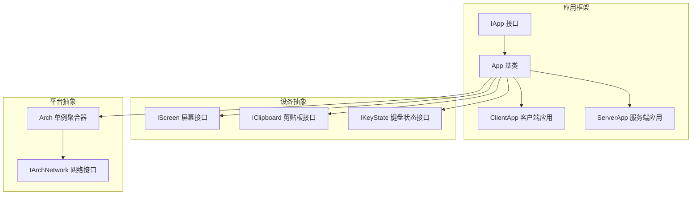
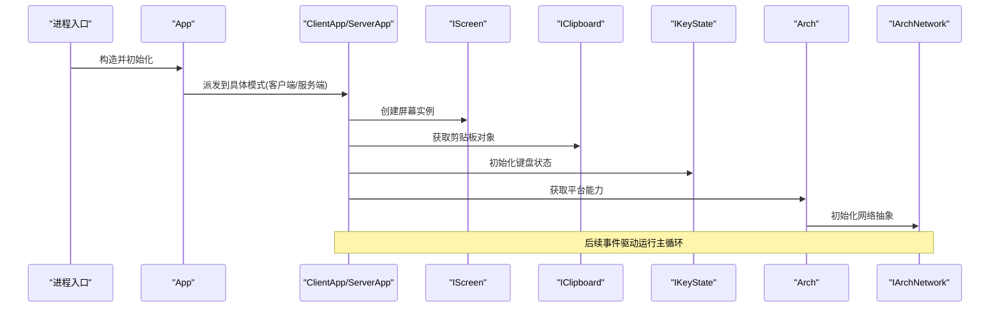
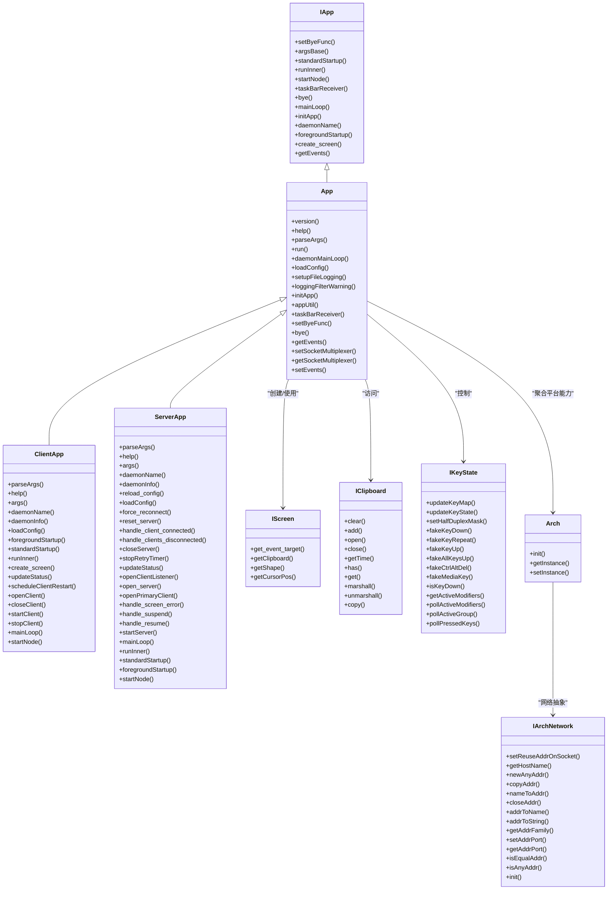

# API 参考

<cite>
**本文引用的文件**   
- [README.md](file://README.md)
- [App.h](file://src/lib/inputleap/App.h)
- [IApp.h](file://src/lib/inputleap/IApp.h)
- [ClientApp.h](file://src/lib/inputleap/ClientApp.h)
- [ServerApp.h](file://src/lib/inputleap/ServerApp.h)
- [IScreen.h](file://src/lib/inputleap/IScreen.h)
- [IClipboard.h](file://src/lib/inputleap/IClipboard.h)
- [IKeyState.h](file://src/lib/inputleap/IKeyState.h)
- [Fwd.h](file://src/lib/inputleap/Fwd.h)
- [Arch.h](file://src/lib/arch/Arch.h)
- [IArchNetwork.h](file://src/lib/arch/IArchNetwork.h)
</cite>

## 目录
1. [简介](#简介)
2. [项目结构](#项目结构)
3. [核心组件](#核心组件)
4. [架构总览](#架构总览)
5. [详细组件分析](#详细组件分析)
6. [依赖关系分析](#依赖关系分析)
7. [性能考虑](#性能考虑)
8. [故障排查指南](#故障排查指南)
9. [结论](#结论)
10. [附录](#附录) 

## 简介
本 API 参考面向插件开发者与集成商，聚焦 Input Leap 的公共编程接口，包括应用生命周期、屏幕抽象、剪贴板、键盘状态以及跨平台网络抽象等。文档提供：
- 公共接口、类定义、函数签名与数据结构的说明
- 参数、返回值与异常处理的约定
- 使用示例（以“代码片段路径”形式给出）
- 版本兼容性与弃用提示、迁移建议
- 错误码与调试信息要点
- 性能注意事项

Input Leap 是一个跨平台的 KVM 软件实现，允许通过鼠标移动或快捷键在多台计算机间共享键鼠输入。当前版本不支持与 Synergy 兼容。

章节来源
- [README.md:1-157](file://README.md#L1-L157)

## 项目结构
本项目采用分层与按功能域组织的方式：
- src/lib/inputleap：核心应用框架与领域接口（App、Screen、Clipboard、KeyState 等）
- src/lib/arch：跨平台抽象层（网络、日志、多线程、任务栏等）
- src/server / src/client：服务端与客户端入口及平台相关逻辑
- src/gui：图形界面配置工具
- doc：用户与开发者文档

图表来源
- [IApp.h:31-48](file://src/lib/inputleap/IApp.h#L31-L48)
- [App.h:43-122](file://src/lib/inputleap/App.h#L43-L122)
- [ClientApp.h:31-85](file://src/lib/inputleap/ClientApp.h#L31-L85)
- [ServerApp.h:48-117](file://src/lib/inputleap/ServerApp.h#L48-L117)
- [IScreen.h:32-73](file://src/lib/inputleap/IScreen.h#L32-L73)
- [IClipboard.h:30-175](file://src/lib/inputleap/IClipboard.h#L30-L175)
- [IKeyState.h:34-185](file://src/lib/inputleap/IKeyState.h#L34-L185)
- [Arch.h:77-110](file://src/lib/arch/Arch.h#L77-L110)
- [IArchNetwork.h:60-284](file://src/lib/arch/IArchNetwork.h#L60-L284)

章节来源
- [App.h:43-122](file://src/lib/inputleap/App.h#L43-L122)
- [ClientApp.h:31-85](file://src/lib/inputleap/ClientApp.h#L31-L85)
- [ServerApp.h:48-117](file://src/lib/inputleap/ServerApp.h#L48-L117)
- [IScreen.h:32-73](file://src/lib/inputleap/IScreen.h#L32-L73)
- [IClipboard.h:30-175](file://src/lib/inputleap/IClipboard.h#L30-L175)
- [IKeyState.h:34-185](file://src/lib/inputleap/IKeyState.h#L34-L185)
- [Arch.h:77-110](file://src/lib/arch/Arch.h#L77-L110)
- [IArchNetwork.h:60-284](file://src/lib/arch/IArchNetwork.h#L60-L284)

## 核心组件
本节概述对外暴露的核心接口与职责边界，便于快速定位扩展点。

- IApp：应用生命周期与启动流程的统一抽象，定义了标准启动、前台启动、主循环、事件队列访问等能力。
- App：IApp 的具体实现基类，封装通用初始化、日志、IPC、托盘、事件循环等。
- ClientApp：客户端应用实现，负责连接服务器、管理客户端屏幕、重连策略与状态更新。
- ServerApp：服务端应用实现，负责监听客户端、加载配置、维护服务端屏幕与主客户端、重启与热重载等。
- IScreen：屏幕抽象，提供剪贴板访问、屏幕几何与光标位置查询等。
- IClipboard：剪贴板抽象，支持多格式读写、序列化/反序列化与拷贝。
- IKeyState：键盘状态与合成事件，支持按键按下/抬起/重复、修饰键、媒体键等。
- Arch：跨平台能力聚合器，统一调度各子系统（网络、日志、线程、任务栏等）。
- IArchNetwork：网络抽象，提供地址族、套接字、轮询、端口解析、主机名解析等。

章节来源
- [IApp.h:31-48](file://src/lib/inputleap/IApp.h#L31-L48)
- [App.h:43-122](file://src/lib/inputleap/App.h#L43-L122)
- [ClientApp.h:31-85](file://src/lib/inputleap/ClientApp.h#L31-L85)
- [ServerApp.h:48-117](file://src/lib/inputleap/ServerApp.h#L48-L117)
- [IScreen.h:32-73](file://src/lib/inputleap/IScreen.h#L32-L73)
- [IClipboard.h:30-175](file://src/lib/inputleap/IClipboard.h#L30-L175)
- [IKeyState.h:34-185](file://src/lib/inputleap/IKeyState.h#L34-L185)
- [Arch.h:77-110](file://src/lib/arch/Arch.h#L77-L110)
- [IArchNetwork.h:60-284](file://src/lib/arch/IArchNetwork.h#L60-L284)

## 架构总览
下图展示了从应用启动到设备抽象与平台网络的调用链。

图表来源
- [App.h:43-122](file://src/lib/inputleap/App.h#L43-L122)
- [ClientApp.h:31-85](file://src/lib/inputleap/ClientApp.h#L31-L85)
- [ServerApp.h:48-117](file://src/lib/inputleap/ServerApp.h#L48-L117)
- [IScreen.h:32-73](file://src/lib/inputleap/IScreen.h#L32-L73)
- [IClipboard.h:30-175](file://src/lib/inputleap/IClipboard.h#L30-L175)
- [IKeyState.h:34-185](file://src/lib/inputleap/IKeyState.h#L34-L185)
- [Arch.h:77-110](file://src/lib/arch/Arch.h#L77-L110)
- [IArchNetwork.h:60-284](file://src/lib/arch/IArchNetwork.h#L60-L284)

## 详细组件分析

### IApp 接口
- 作用：定义应用的标准启动流程、前台启动、主循环、事件队列访问、任务栏接收器等。
- 关键方法
  - setByeFunc：设置退出回调
  - argsBase：返回通用参数对象引用
  - standardStartup：标准启动流程
  - runInner：带输出器与启动函数的内部运行
  - startNode：节点启动钩子
  - taskBarReceiver：获取任务栏接收器
  - bye：触发退出
  - mainLoop：主事件循环
  - initApp：初始化应用（含参数解析、日志等）
  - daemonName：守护进程名称
  - foregroundStartup：前台启动
  - create_screen：创建屏幕实例
  - getEvents：获取事件队列指针

- 典型用法
  - 自定义应用时继承 IApp 或基于 App 扩展
  - 在 initApp 中完成参数解析与日志配置
  - 在 mainLoop 中驱动事件处理

章节来源
- [IApp.h:31-48](file://src/lib/inputleap/IApp.h#L31-L48)

### App 基类
- 作用：实现 IApp 的通用逻辑，包含 IPC、文件日志、托盘、Socket 复用器、事件循环等。
- 关键方法与属性
  - version/help/parseArgs/loadConfig：版本、帮助、参数解析与配置加载
  - run/daemonMainLoop：进程运行与守护进程主循环
  - setupFileLogging/loggingFilterWarning：日志配置与过滤警告
  - initApp：组合参数解析、文件日志与配置加载
  - appUtil/taskBarReceiver/bye/getEvents：平台工具、托盘、退出、事件队列访问
  - setSocketMultiplexer/getSocketMultiplexer：注入 Socket 复用器
  - handle_ipc_message/run_events_loop：IPC 消息处理与事件循环

- 设计要点
  - 通过工厂函数指针创建平台特定的任务栏接收器
  - 提供 MinimalApp 最小化实现，简化非 GUI 场景

章节来源
- [App.h:43-122](file://src/lib/inputleap/App.h#L43-L122)

### ClientApp 客户端应用
- 作用：客户端侧应用实现，负责连接服务器、管理客户端屏幕、重连策略与状态更新。
- 关键方法
  - parseArgs/help：客户端参数解析与帮助
  - args：返回客户端专用参数引用
  - daemonName/daemonInfo：守护进程元信息
  - loadConfig：客户端通常不直接加载配置文件（空实现）
  - foregroundStartup/standardStartup/runInner：启动流程
  - create_screen/open_client_screen：创建与打开客户端屏幕
  - updateStatus/handle_*：状态更新与事件处理
  - scheduleClientRestart/handle_client_restart：重连调度
  - openClient/closeClient/startClient/stopClient：客户端连接生命周期
  - mainLoop/startNode：主循环与节点启动

- 使用示例（路径）
  - 启动客户端并连接服务器：[ClientApp.h:52-72](file://src/lib/inputleap/ClientApp.h#L52-L72)
  - 重连策略与超时计算：[ClientApp.h:58-66](file://src/lib/inputleap/ClientApp.h#L58-L66)

章节来源
- [ClientApp.h:31-85](file://src/lib/inputleap/ClientApp.h#L31-L85)

### ServerApp 服务端应用
- 作用：服务端侧应用实现，负责监听客户端、加载配置、维护服务端屏幕与主客户端、重启与热重载等。
- 关键方法与属性
  - parseArgs/help：服务端参数解析与帮助
  - args：返回服务端专用参数引用
  - daemonName/daemonInfo：守护进程元信息
  - reload_config/force_reconnect/reset_server：配置热重载、强制重连与服务端重置
  - handle_client_connected/handle_clients_disconnected：客户端连接事件
  - closeServer/stopRetryTimer/updateStatus：关闭服务、停止重试计时器与状态更新
  - openClientListener/open_server/openPrimaryClient：监听器、服务端与主客户端创建
  - handle_screen_error/handle_suspend/handle_resume：屏幕错误与系统挂起恢复
  - startServer/mainLoop/runInner/standardStartup/foregroundStartup/startNode：启动与主循环
  - server_/m_listener/m_timer/listen_address_：服务端实例、监听器、计时器与监听地址

- 使用示例（路径）
  - 加载配置与开启监听：[ServerApp.h:68-96](file://src/lib/inputleap/ServerApp.h#L68-L96)
  - 主循环与启动流程：[ServerApp.h:96-100](file://src/lib/inputleap/ServerApp.h#L96-L100)

章节来源
- [ServerApp.h:48-117](file://src/lib/inputleap/ServerApp.h#L48-L117)

### IScreen 屏幕接口
- 作用：屏幕抽象，提供剪贴板访问、屏幕几何与光标位置查询。
- 关键方法
  - get_event_target：获取事件目标
  - getClipboard：获取指定 ID 的剪贴板对象
  - getShape：获取屏幕左上角坐标与宽高
  - getCursorPos：获取当前光标位置

- 数据结构
  - ClipboardInfo：剪贴板标识与序列号

- 使用示例（路径）
  - 读取屏幕形状与光标位置：[IScreen.h:63-70](file://src/lib/inputleap/IScreen.h#L63-L70)
  - 获取剪贴板对象：[IScreen.h:56](file://src/lib/inputleap/IScreen.h#L56)

章节来源
- [IScreen.h:32-73](file://src/lib/inputleap/IScreen.h#L32-L73)

### IClipboard 剪贴板接口
- 作用：剪贴板抽象，支持多格式读写、序列化/反序列化与拷贝。
- 关键枚举
  - EFormat：文本、HTML、位图、PNG、JPEG、TIFF、WEBP 等格式
- 关键方法
  - clear/open/close：清空、打开、关闭剪贴板
  - add：添加数据
  - getTime/has/get：获取时间戳、检查格式存在、读取数据
  - marshall/unmarshall/copy：序列化、反序列化与拷贝

- 使用示例（路径）
  - 打开剪贴板并读取文本：[IClipboard.h:104-135](file://src/lib/inputleap/IClipboard.h#L104-L135)
  - 序列化剪贴板内容：[IClipboard.h:142-149](file://src/lib/inputleap/IClipboard.h#L142-L149)

章节来源
- [IClipboard.h:30-175](file://src/lib/inputleap/IClipboard.h#L30-L175)

### IKeyState 键盘状态接口
- 作用：键盘状态与合成事件，支持按键按下/抬起/重复、修饰键、媒体键等。
- 关键结构与类型
  - KeyInfo：按键事件信息，包含键码、修饰掩码、物理按钮、计数与目标屏幕集合
  - KeyButtonSet：已按下键集合
- 关键方法
  - updateKeyMap/updateKeyState：更新键映射与物理状态
  - setHalfDuplexMask：设置半双工修饰键掩码
  - fakeKeyDown/fakeKeyRepeat/fakeKeyUp/fakeAllKeysUp：合成按键事件
  - fakeCtrlAltDel/fakeMediaKey：特殊组合键与媒体键
  - isKeyDown/getActiveModifiers/pollActiveModifiers/pollActiveGroup/pollPressedKeys：查询状态

- 使用示例（路径）
  - 合成按键按下与抬起：[IKeyState.h:107-128](file://src/lib/inputleap/IKeyState.h#L107-L128)
  - 查询活动修饰键与布局：[IKeyState.h:160-175](file://src/lib/inputleap/IKeyState.h#L160-L175)

章节来源
- [IKeyState.h:34-185](file://src/lib/inputleap/IKeyState.h#L34-L185)

### Arch 与 IArchNetwork 平台抽象
- Arch
  - 作用：集中式跨平台能力聚合器，提供单例访问与初始化顺序保证
  - 关键方法：init、getInstance/setInstance
- IArchNetwork
  - 作用：网络抽象，定义地址族、套接字类型、poll 事件、地址操作、主机名解析等
  - 关键方法：setReuseAddrOnSocket、getHostName、newAnyAddr/copyAddr/nameToAddr/closeAddr、addrToName/addrToString/getAddrFamily/setAddrPort/getAddrPort/isEqualAddr/isAnyAddr/init

- 使用示例（路径）
  - 获取本地主机名与地址族：[IArchNetwork.h:242-263](file://src/lib/arch/IArchNetwork.h#L242-L263)
  - 地址比较与任意地址判断：[IArchNetwork.h:271-279](file://src/lib/arch/IArchNetwork.h#L271-L279)

章节来源
- [Arch.h:77-110](file://src/lib/arch/Arch.h#L77-L110)
- [IArchNetwork.h:60-284](file://src/lib/arch/IArchNetwork.h#L60-L284)

### 预声明与类型前向声明
- Fwd.h 提供了大量前向声明，用于解耦头文件依赖，便于构建大型工程。
- 常见前向类型：App、MinimalApp、ArgParser、ClientApp、ServerApp、Screen、PlatformScreen、IClipboard、IKeyState、INode、PacketStreamFilter 等。

章节来源
- [Fwd.h:17-111](file://src/lib/inputleap/Fwd.h#L17-L111)

## 依赖关系分析
- 耦合与内聚
  - App 作为基类，将通用逻辑与平台无关部分集中在一个层次，提升内聚性
  - ClientApp/ServerApp 分别关注客户端与服务端业务，职责清晰
  - IScreen/IClipboard/IKeyState 作为设备抽象，降低平台差异对上层的影响
  - Arch/IArchNetwork 将平台差异下沉至底层，避免上层污染
- 外部依赖与集成点
  - 网络抽象通过 IArchNetwork 暴露，便于替换不同平台实现
  - 事件系统与日志输出通过 IEventQueue/ILogOutputter 等接口接入

图表来源
- [IApp.h:31-48](file://src/lib/inputleap/IApp.h#L31-L48)
- [App.h:43-122](file://src/lib/inputleap/App.h#L43-L122)
- [ClientApp.h:31-85](file://src/lib/inputleap/ClientApp.h#L31-L85)
- [ServerApp.h:48-117](file://src/lib/inputleap/ServerApp.h#L48-L117)
- [IScreen.h:32-73](file://src/lib/inputleap/IScreen.h#L32-L73)
- [IClipboard.h:30-175](file://src/lib/inputleap/IClipboard.h#L30-L175)
- [IKeyState.h:34-185](file://src/lib/inputleap/IKeyState.h#L34-L185)
- [Arch.h:77-110](file://src/lib/arch/Arch.h#L77-L110)
- [IArchNetwork.h:60-284](file://src/lib/arch/IArchNetwork.h#L60-L284)

## 性能考虑
- 事件循环与 I/O 复用
  - 通过 Socket 复用器与 poll 机制减少阻塞，提高并发处理能力
  - 建议在主循环中避免长时间阻塞操作，必要时异步处理
- 日志级别与过滤
  - 使用 --debug/--log 控制日志级别与输出，生产环境建议降低日志量以提升性能
- 剪贴板序列化
  - 大体积图像数据建议使用压缩格式（如 PNG/JPEG），并在传输前后进行必要的尺寸限制
- 重连策略
  - 客户端重连应使用指数退避或可配置的重试间隔，避免雪崩效应

[本节为通用指导，无需特定文件来源]

## 故障排查指南
- 常见问题
  - 客户端无法连接服务器：检查服务器 IP、端口与防火墙规则；确认服务端监听地址与端口正确
  - 剪贴板同步失败：确认剪贴板格式是否受支持；注意 Linux/Wayland 下剪贴板共享的限制
  - 键盘映射异常：确保两端键映射一致；必要时调用 updateKeyMap 刷新映射
- 调试信息
  - 使用 --debug 指定日志级别，结合 --log 输出到文件进行分析
  - 关注服务端与客户端的状态更新消息，定位断连与重连原因
- 错误码与异常
  - 接口返回值多为布尔或整数，表示成功/失败；具体错误码需结合日志上下文分析
  - 对于网络与系统调用失败，优先检查平台错误码与日志堆栈

章节来源
- [README.md:103-157](file://README.md#L103-L157)

## 结论
Input Leap 的 API 围绕应用生命周期、设备抽象与平台网络三大层面展开。通过 IApp/App 提供的标准化启动与运行模型，配合 IScreen/IClipboard/IKeyState 的设备抽象，以及 Arch/IArchNetwork 的平台能力聚合，开发者可以较为便捷地进行扩展与集成。建议在生产环境中合理配置日志与重连策略，关注性能与稳定性。

[本节为总结性内容，无需特定文件来源]

## 附录

### 版本兼容性与弃用提示
- 兼容性
  - 当前版本在 Windows、macOS、Linux、FreeBSD、OpenBSD 上已知可用
  - 不支持 32 位 Windows 版本
- 弃用与迁移
  - 某些命令行选项标记为废弃（例如 --enable-crypto 默认启用但标记为废弃），建议在新项目中移除相关参数
  - 旧版服务管理参数（--service）已被独立守护进程替代，建议使用新的守护进程管理方式

章节来源
- [README.md:114-157](file://README.md#L114-L157)
- [App.h:154-200](file://src/lib/inputleap/App.h#L154-L200)

### 常用命令与参数速查
- 通用参数
  - --debug：设置日志级别
  - --name：指定屏幕名称
  - --no-restart/--restart：失败后是否自动重启
  - --log：将日志写入文件
  - --no-tray：禁用系统托盘图标
  - --enable-drag-drop：启用拖放
  - --profile-dir/--drop-dir：指定配置与拖放目录
  - --version：显示版本信息
- 平台相关
  - Unix：--daemon/--no-daemon 切换守护进程模式
  - Windows：--exit-pause 退出时等待按键以便查看错误信息

章节来源
- [App.h:154-200](file://src/lib/inputleap/App.h#L154-L200)