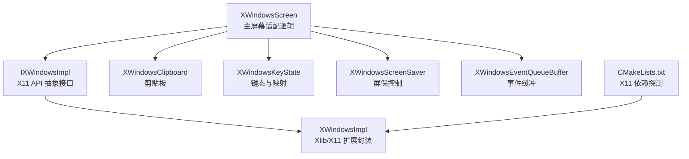
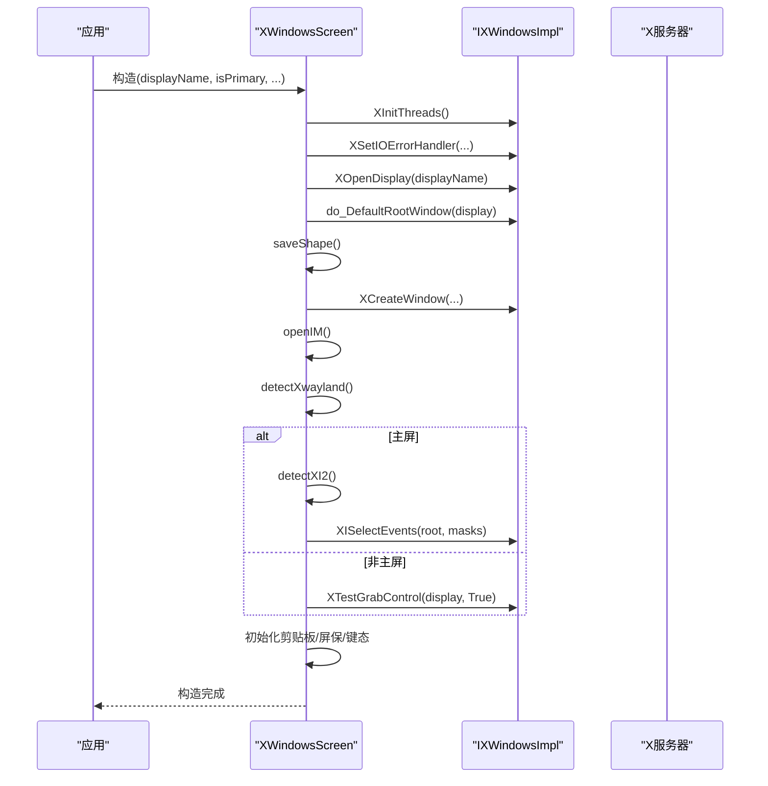
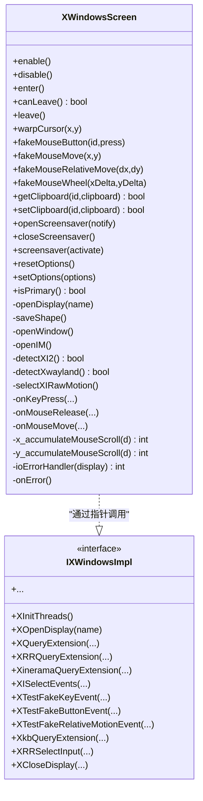
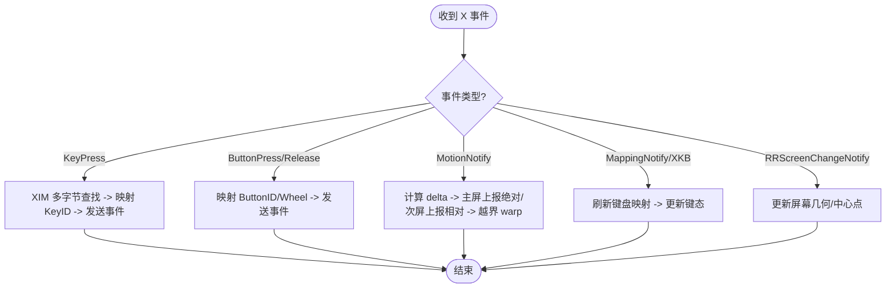
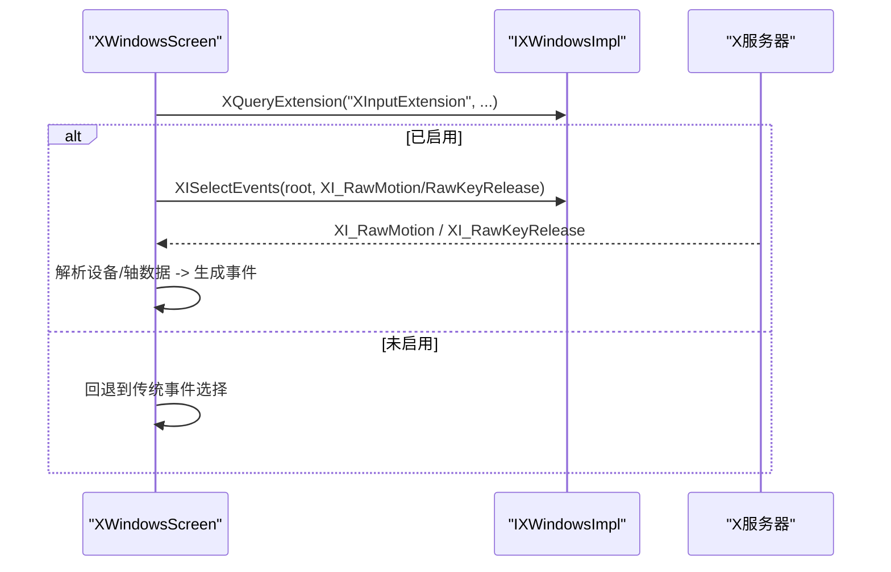
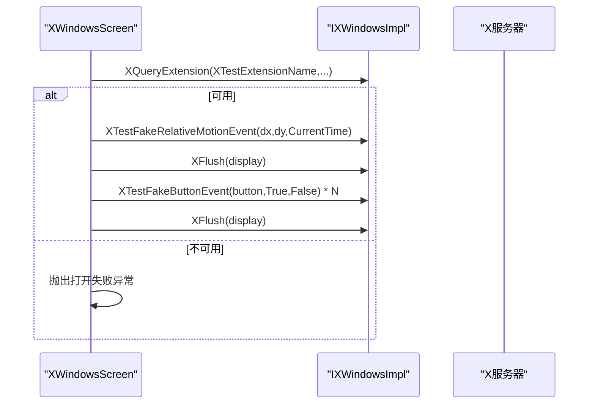
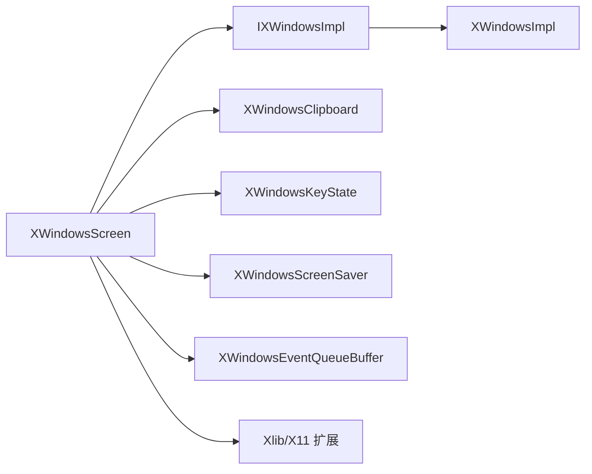

# Linux 平台适配器

<cite>
**本文引用的文件**   
- [XWindowsScreen.h](file://src/lib/platform/XWindowsScreen.h)
- [XWindowsScreen.cpp](file://src/lib/platform/XWindowsScreen.cpp)
- [IXWindowsImpl.h](file://src/lib/platform/IXWindowsImpl.h)
- [XWindowsImpl.h](file://src/lib/platform/XWindowsImpl.h)
- [XWindowsImpl.cpp](file://src/lib/platform/XWindowsImpl.cpp)
- [XWindowsUtil.cpp](file://src/lib/platform/XWindowsUtil.cpp)
- [CMakeLists.txt](file://CMakeLists.txt)
</cite>

## 目录
1. [简介](#简介)
2. [项目结构](#项目结构)
3. [核心组件](#核心组件)
4. [架构总览](#架构总览)
5. [详细组件分析](#详细组件分析)
6. [依赖关系分析](#依赖关系分析)
7. [性能考虑](#性能考虑)
8. [故障排查指南](#故障排查指南)
9. [结论](#结论)
10. [附录](#附录)

## 简介
本文件面向在 Linux 平台上开发与维护 X11 平台适配器的工程师，聚焦于 XWindowsScreen 类的实现细节与扩展集成。内容涵盖：
- X11 协议处理、事件分发与窗口管理
- XInput2（XI2）原始输入与 XTest 模拟输入
- XKB 键盘映射与状态、XRandR 多显示器支持、Xinerama 兼容策略
- XIM 输入法上下文与 IM 风格选择
- Wayland 兼容性考量与 XWayland 检测
- Xlib 错误处理、资源泄漏防护与性能调优实践

## 项目结构
Linux 平台适配相关代码位于 src/lib/platform 下，核心类为 XWindowsScreen，通过 IXWindowsImpl 抽象层间接调用 Xlib/X11 扩展函数，便于测试与替换实现。构建系统通过 CMake 探测 X11 及其扩展并启用 HAVE_X11。

图表来源
- [XWindowsScreen.h:1-271](file://src/lib/platform/XWindowsScreen.h#L1-L271)
- [IXWindowsImpl.h:1-218](file://src/lib/platform/IXWindowsImpl.h#L1-L218)
- [XWindowsImpl.h:1-152](file://src/lib/platform/XWindowsImpl.h#L1-L152)
- [CMakeLists.txt:164-186](file://CMakeLists.txt#L164-L186)

章节来源
- [CMakeLists.txt:164-186](file://CMakeLists.txt#L164-L186)

## 核心组件
- XWindowsScreen：实现 IPlatformScreen/IScreen/IPrimaryScreen/ISecondaryScreen 等接口，负责显示连接、窗口创建、事件选择、输入捕获与模拟、剪贴板、屏保、键盘映射更新、鼠标滚动累积等。
- IXWindowsImpl：定义所有 X11/Xlib 及扩展的纯虚接口，屏蔽底层库差异。
- XWindowsImpl：对 Xlib/X11 扩展函数的薄封装，提供线程安全初始化、错误处理钩子、扩展查询与选择、XI2/XTest/XKB/XRandR/Xinerama 等能力。
- 辅助模块：XWindowsClipboard、XWindowsKeyState、XWindowsScreenSaver、XWindowsEventQueueBuffer、XWindowsUtil（错误锁）。

章节来源
- [XWindowsScreen.h:39-271](file://src/lib/platform/XWindowsScreen.h#L39-L271)
- [IXWindowsImpl.h:20-218](file://src/lib/platform/IXWindowsImpl.h#L20-L218)
- [XWindowsImpl.h:10-152](file://src/lib/platform/XWindowsImpl.h#L10-L152)

## 架构总览
XWindowsScreen 作为平台适配的核心，通过 IXWindowsImpl 访问 X11 服务，并在构造期完成以下关键步骤：
- 初始化 Xlib 多线程支持并安装 XIO 错误处理器
- 打开 Display、获取根窗口、保存屏幕形状
- 创建透明 InputOnly 窗口用于抓取或隐藏光标
- 初始化屏保、键态、剪贴板对象
- 检测 XWayland、XInput2、XKB、XRandR 等扩展并订阅事件
- 为主屏设置 XI2 RawMotion 监听，或为非主屏启用 XTestGrabControl

图表来源
- [XWindowsScreen.cpp:64-163](file://src/lib/platform/XWindowsScreen.cpp#L64-L163)
- [XWindowsScreen.cpp:859-914](file://src/lib/platform/XWindowsScreen.cpp#L859-L914)
- [XWindowsScreen.cpp:963-1013](file://src/lib/platform/XWindowsScreen.cpp#L963-L1013)
- [XWindowsScreen.cpp:1015-1076](file://src/lib/platform/XWindowsScreen.cpp#L1015-L1076)
- [XWindowsScreen.cpp:2023-2052](file://src/lib/platform/XWindowsScreen.cpp#L2023-L2052)

## 详细组件分析

### XWindowsScreen 类设计与职责
- 生命周期与资源
  - 构造：初始化线程、安装 IO 错误处理器、打开 Display、创建窗口、初始化子系统、检测扩展与事件订阅。
  - 析构：释放 IM/IC、销毁窗口、关闭 Display、恢复错误处理器、删除 impl。
- 主屏/次屏差异化
  - 主屏：创建覆盖全屏的 InputOnly 窗口以捕获全局输入；可选使用 XI2 RawMotion 提升精度与延迟表现。
  - 次屏：使用 XTestGrabControl 避免被其他客户端的 Grab 影响；使用 XTest 模拟输入。
- 事件处理
  - 按键/按键重复：结合 XKB 与 XIM 进行 Keysym 解析与多字节输入。
  - 鼠标移动：主屏直接转发坐标；次屏将相对位移转换为 warp 回中心并发送相对运动。
  - 滚轮：统一转换为按钮 4/5/6/7 的按下/释放序列，并进行滚动累积。
- 剪贴板
  - 基于 ICCCM 选择机制，持有多个 ClipboardID 实例，响应 SelectionRequest/SelectionClear 等。
- 屏保与 DPMS
  - 进入/离开屏幕时唤醒屏幕，必要时强制 DPMS 到 On。
- 选项与行为
  - 可配置 XTest 对 Xinerama 的“无感知”行为、是否保留焦点等。

图表来源
- [XWindowsScreen.h:39-271](file://src/lib/platform/XWindowsScreen.h#L39-L271)
- [IXWindowsImpl.h:20-218](file://src/lib/platform/IXWindowsImpl.h#L20-L218)

章节来源
- [XWindowsScreen.h:39-271](file://src/lib/platform/XWindowsScreen.h#L39-L271)
- [XWindowsScreen.cpp:64-163](file://src/lib/platform/XWindowsScreen.cpp#L64-L163)
- [XWindowsScreen.cpp:196-352](file://src/lib/platform/XWindowsScreen.cpp#L196-L352)
- [XWindowsScreen.cpp:804-857](file://src/lib/platform/XWindowsScreen.cpp#L804-L857)
- [XWindowsScreen.cpp:1500-1615](file://src/lib/platform/XWindowsScreen.cpp#L1500-L1615)
- [XWindowsScreen.cpp:1693-1724](file://src/lib/platform/XWindowsScreen.cpp#L1693-L1724)

### X11 协议处理与事件流
- 事件选择
  - 主屏：若检测到 XI2，则选择 Root 窗口的 XI_RawMotion 与 XI_RawKeyRelease；否则遍历树并为每个窗口选择 PointerMotionMask 与 SubstructureNotifyMask，以捕获全局鼠标移动与新窗口创建。
  - 非主屏：仅需要隐藏光标与接收 LeaveWindow 事件。
- 事件分发
  - 按键：优先走 XIM 多字节转换，再映射为 KeyID；XKB 映射变化时刷新键表。
  - 鼠标：主屏上报绝对位置；次屏上报相对位移并在越界时 warp 回中心。
  - 滚轮：将 4/5/6/7 按钮映射为 WheelInfo，并进行滚动累积。

图表来源
- [XWindowsScreen.cpp:1727-1781](file://src/lib/platform/XWindowsScreen.cpp#L1727-L1781)
- [XWindowsScreen.cpp:1783-1800](file://src/lib/platform/XWindowsScreen.cpp#L1783-L1800)
- [XWindowsScreen.cpp:1500-1615](file://src/lib/platform/XWindowsScreen.cpp#L1500-L1615)
- [XWindowsScreen.cpp:1987-2001](file://src/lib/platform/XWindowsScreen.cpp#L1987-L2001)
- [XWindowsScreen.cpp:905-914](file://src/lib/platform/XWindowsScreen.cpp#L905-L914)

章节来源
- [XWindowsScreen.cpp:1727-1781](file://src/lib/platform/XWindowsScreen.cpp#L1727-L1781)
- [XWindowsScreen.cpp:1500-1615](file://src/lib/platform/XWindowsScreen.cpp#L1500-L1615)
- [XWindowsScreen.cpp:1987-2001](file://src/lib/platform/XWindowsScreen.cpp#L1987-L2001)
- [XWindowsScreen.cpp:905-914](file://src/lib/platform/XWindowsScreen.cpp#L905-L914)

### XInput2（XI2）原始输入
- 检测与选择
  - 通过 XQueryExtension("XInputExtension") 判断可用性。
  - 若可用，则在 Root 窗口上选择 XIAllMasterDevices 的 XI_RawMotion 与 XI_RawKeyRelease。
- 优势
  - 绕过窗口层级与事件传播限制，获得更低的延迟与更高的可靠性。
  - 减少因 X11 事件传播缺陷导致的漏报问题。

图表来源
- [XWindowsScreen.cpp:2023-2052](file://src/lib/platform/XWindowsScreen.cpp#L2023-L2052)
- [IXWindowsImpl.h:168-169](file://src/lib/platform/IXWindowsImpl.h#L168-L169)

章节来源
- [XWindowsScreen.cpp:2023-2052](file://src/lib/platform/XWindowsScreen.cpp#L2023-L2052)

### XTest 模拟输入
- 适用场景
  - 在非主屏（客户端侧）注入鼠标/键盘事件，不受本地应用 Grab 影响。
- 关键流程
  - 构造阶段检查 XTest 扩展可用性。
  - 相对移动使用 XTestFakeRelativeMotionEvent。
  - 滚轮通过多次触发按钮 4/5/6/7 的 Press/Release。
  - 每次批量操作后调用 XFlush 确保及时下发。

图表来源
- [XWindowsScreen.cpp:859-886](file://src/lib/platform/XWindowsScreen.cpp#L859-L886)
- [XWindowsScreen.cpp:804-857](file://src/lib/platform/XWindowsScreen.cpp#L804-L857)
- [IXWindowsImpl.h:64-75](file://src/lib/platform/IXWindowsImpl.h#L64-L75)

章节来源
- [XWindowsScreen.cpp:804-857](file://src/lib/platform/XWindowsScreen.cpp#L804-L857)
- [XWindowsScreen.cpp:859-886](file://src/lib/platform/XWindowsScreen.cpp#L859-L886)

### XKB 键盘映射与状态
- 初始化
  - 查询 XKB 版本与扩展，启用 MapNotify 与 StateNotify 事件。
- 更新
  - 收到 MappingNotify 时刷新映射；常规情况下更新键态。
- 作用
  - 保证不同布局/组合键下的正确映射与状态同步。

章节来源
- [XWindowsScreen.cpp:888-903](file://src/lib/platform/XWindowsScreen.cpp#L888-L903)
- [XWindowsScreen.cpp:1987-2001](file://src/lib/platform/XWindowsScreen.cpp#L1987-L2001)

### XRandR 与多显示器支持
- 扩展检测与事件订阅
  - 查询 XRandR 扩展，启用 RRScreenChangeNotify 与 RRCrtcChangeNotify。
- 屏幕几何
  - 启动时读取默认屏幕宽高与中心点；在多物理屏环境下根据 Xinerama 信息调整中心点。
- 现代发行版建议
  - 优先使用 XRandR 而非 Xinerama；当 Xinerama 存在且多屏时，注意其 WarpPointer 与 GrabPointer 交互的已知问题。

章节来源
- [XWindowsScreen.cpp:905-914](file://src/lib/platform/XWindowsScreen.cpp#L905-L914)
- [XWindowsScreen.cpp:917-961](file://src/lib/platform/XWindowsScreen.cpp#L917-L961)

### XIM 输入法上下文
- 打开 IM 并选择支持的样式（当前仅支持 XIMPreeditNothing 配合 StatusNothing/None）。
- 创建 IC 并将窗口句柄绑定，按 IC 要求的事件掩码选择窗口事件。
- 在 enter/leave 时重置与设置 IC 焦点，确保 IME 行为正确。

章节来源
- [XWindowsScreen.cpp:1015-1076](file://src/lib/platform/XWindowsScreen.cpp#L1015-L1076)
- [XWindowsScreen.cpp:236-291](file://src/lib/platform/XWindowsScreen.cpp#L236-L291)
- [XWindowsScreen.cpp:301-352](file://src/lib/platform/XWindowsScreen.cpp#L301-L352)

### 剪贴板与选择机制
- 针对多种数据类型（文本、HTML、位图、图片等）提供转换器。
- 遵循 ICCCM 时序，使用真实时间戳进行所有权切换与数据交换。
- 在主/从端之间同步剪贴板内容，避免竞态与丢失。

章节来源
- [XWindowsScreen.cpp:354-385](file://src/lib/platform/XWindowsScreen.cpp#L354-L385)
- [XWindowsScreen.cpp:1655-1690](file://src/lib/platform/XWindowsScreen.cpp#L1655-L1690)

### 屏保与 DPMS 集成
- 进入屏幕时尝试唤醒屏幕，必要时强制 DPMS 到 On。
- 提供开关以禁用/启用系统屏保，避免远程输入被屏保中断。

章节来源
- [XWindowsScreen.cpp:236-291](file://src/lib/platform/XWindowsScreen.cpp#L236-L291)
- [XWindowsScreen.cpp:387-413](file://src/lib/platform/XWindowsScreen.cpp#L387-L413)

### Wayland 兼容性与 XWayland 检测
- 启动时查询是否存在 "XWAYLAND" 扩展，若存在记录告警日志提示行为可能不符合预期。
- 建议在 Wayland 原生环境优先采用 Wayland 方案；在必须使用 X11 的场景下，可通过 XWayland 运行但需知悉限制。

章节来源
- [XWindowsScreen.cpp:122-124](file://src/lib/platform/XWindowsScreen.cpp#L122-L124)
- [XWindowsScreen.cpp:2030-2036](file://src/lib/platform/XWindowsScreen.cpp#L2030-L2036)

## 依赖关系分析
- 内部依赖
  - XWindowsScreen 依赖 IXWindowsImpl 提供的 X11 抽象，具体由 XWindowsImpl 实现。
  - 依赖 XWindowsClipboard、XWindowsKeyState、XWindowsScreenSaver、XWindowsEventQueueBuffer 等子系统。
- 外部依赖
  - Xlib 与 X11 扩展：XTest、XInput2、XKB、XRandR、Xinerama、DPMS。
  - 构建期通过 pkg_check_modules 探测 X11、ICE、SM 等库。

图表来源
- [XWindowsScreen.h:23-36](file://src/lib/platform/XWindowsScreen.h#L23-L36)
- [IXWindowsImpl.h:1-218](file://src/lib/platform/IXWindowsImpl.h#L1-L218)
- [XWindowsImpl.h:1-152](file://src/lib/platform/XWindowsImpl.h#L1-L152)
- [CMakeLists.txt:164-186](file://CMakeLists.txt#L164-L186)

章节来源
- [CMakeLists.txt:164-186](file://CMakeLists.txt#L164-L186)

## 性能考虑
- 事件路径优化
  - 优先使用 XI2 RawMotion 降低延迟与丢包风险。
  - 次屏相对移动合并与阈值判断，减少不必要的 warp 与事件风暴。
- 滚动累积
  - 对水平/垂直滚动进行累积，达到阈值才发出事件，避免高频抖动。
- 批处理与刷新
  - 批量模拟输入后统一 XFlush，减少往返开销。
- 事件选择策略
  - 仅在已有客户端选择 PointerMotionMask 时才向上层选择该掩码，避免破坏事件传播语义。
- 资源复用
  - 透明光标与 IM/IC 生命周期与窗口一致，避免频繁创建销毁。

章节来源
- [XWindowsScreen.cpp:1601-1615](file://src/lib/platform/XWindowsScreen.cpp#L1601-L1615)
- [XWindowsScreen.cpp:804-857](file://src/lib/platform/XWindowsScreen.cpp#L804-L857)
- [XWindowsScreen.cpp:1727-1781](file://src/lib/platform/XWindowsScreen.cpp#L1727-L1781)

## 故障排查指南
- X 显示断开
  - 现象：程序崩溃或无法继续访问 Display。
  - 处理：安装 XIO 错误处理器，断开时将 m_display 置空、清空事件缓冲、通知上层 SCREEN_ERROR。
- X 错误忽略与记录
  - 使用 ErrorLock 临时替换错误处理器，在特定临界区忽略 BadWindow 等错误，或在调试模式下记录错误详情。
- 常见问题定位
  - XTEST 不可用：在非主屏初始化时检查扩展，缺失则抛出打开失败异常。
  - XWayland 环境：检测并告警，提示行为可能不符合预期。
  - 多显示器 warp 异常：Xinerama 下注意 WarpPointer 与 GrabPointer 的交互问题，必要时调整中心点与 warp 策略。

章节来源
- [XWindowsScreen.cpp:1693-1724](file://src/lib/platform/XWindowsScreen.cpp#L1693-L1724)
- [XWindowsUtil.cpp:319-371](file://src/lib/platform/XWindowsUtil.cpp#L319-L371)
- [XWindowsScreen.cpp:859-886](file://src/lib/platform/XWindowsScreen.cpp#L859-L886)
- [XWindowsScreen.cpp:2030-2036](file://src/lib/platform/XWindowsScreen.cpp#L2030-L2036)
- [XWindowsScreen.cpp:917-961](file://src/lib/platform/XWindowsScreen.cpp#L917-L961)

## 结论
XWindowsScreen 通过清晰的抽象层与模块化设计，在保持对 X11 生态良好兼容的同时，提供了对现代输入栈（XI2）、键盘布局（XKB）、多显示器（XRandR/Xinerama）与输入法（XIM）的全面支持。借助 XTest 在非主屏注入输入，并结合完善的错误处理与资源管理，能够在复杂桌面环境中稳定工作。对于 Wayland 环境，应优先考虑原生方案；在必须使用 X11 的场景下，利用 XWayland 检测与相应降级策略保障用户体验。

## 附录
- 构建与依赖
  - 使用 CMake 探测 X11、ICE、SM 等库，启用 HAVE_X11 宏，链接对应库。
- 最佳实践清单
  - 始终通过 IXWindowsImpl 访问 X11，避免直接调用导致耦合。
  - 在关键区域使用 ErrorLock 隔离错误，防止 BadWindow 等干扰。
  - 优先启用 XI2 RawMotion，回退到传统事件选择以保证兼容性。
  - 合理设置 XFlush 频率，平衡实时性与吞吐。
  - 在 Wayland 环境下明确告知用户潜在限制。

章节来源
- [CMakeLists.txt:164-186](file://CMakeLists.txt#L164-L186)