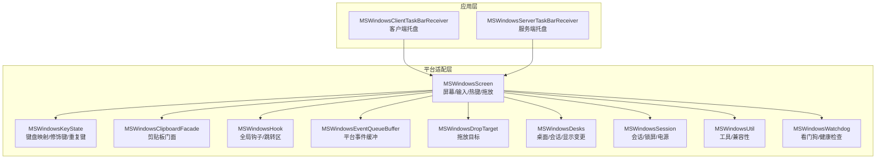
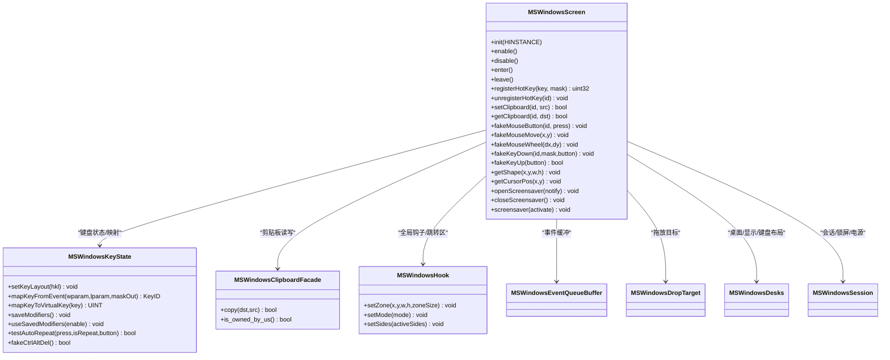
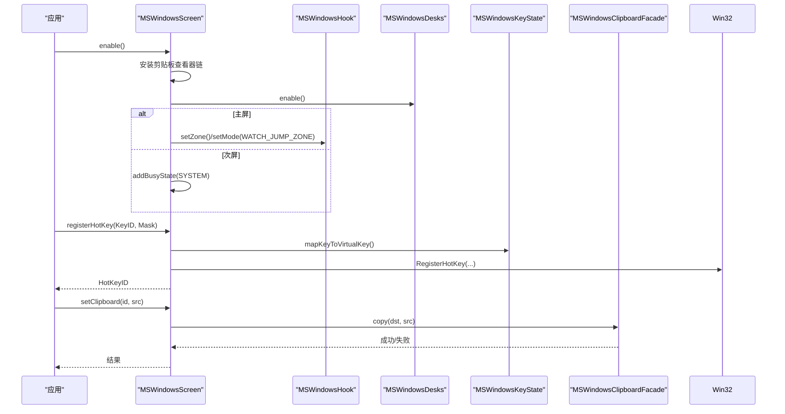
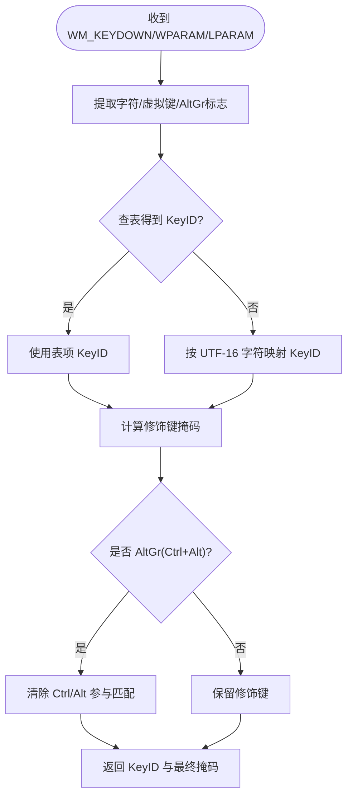
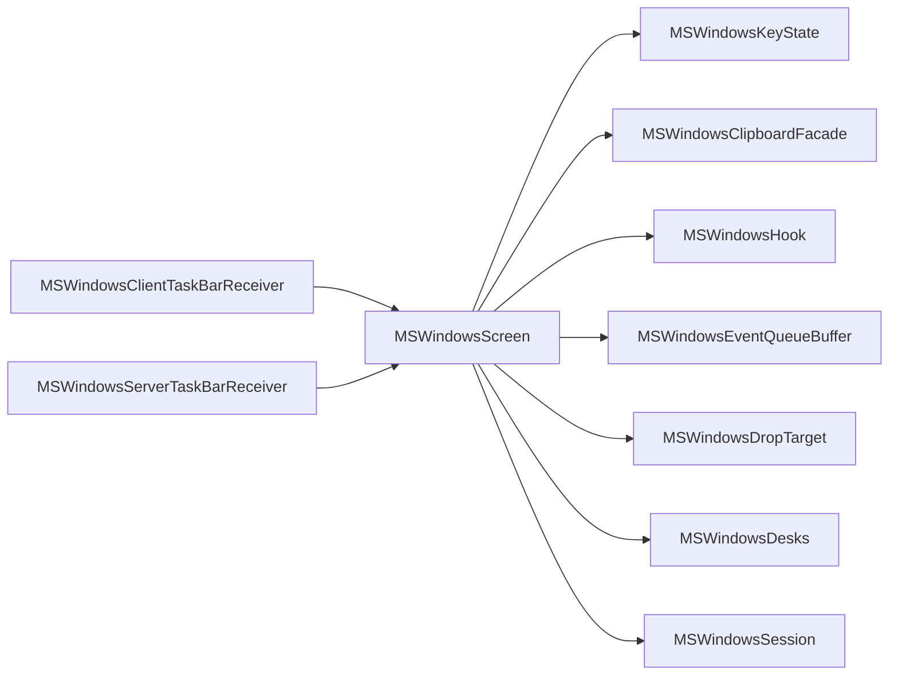

# Windows 平台适配器

<cite>
**本文引用的文件**   
- [MSWindowsScreen.h](file://src/lib/platform/MSWindowsScreen.h)
- [MSWindowsScreen.cpp](file://src/lib/platform/MSWindowsScreen.cpp)
- [MSWindowsKeyState.h](file://src/lib/platform/MSWindowsKeyState.h)
- [MSWindowsKeyState.cpp](file://src/lib/platform/MSWindowsKeyState.cpp)
- [MSWindowsClipboard.h](file://src/lib/platform/MSWindowsClipboard.h)
- [MSWindowsClipboardFacade.cpp](file://src/lib/platform/MSWindowsClipboardFacade.cpp)
- [MSWindowsHook.h](file://src/lib/platform/MSWindowsHook.h)
- [MSWindowsEventQueueBuffer.h](file://src/lib/platform/MSWindowsEventQueueBuffer.h)
- [MSWindowsDropTarget.h](file://src/lib/platform/MSWindowsDropTarget.h)
- [MSWindowsDesks.h](file://src/lib/platform/MSWindowsDesks.h)
- [MSWindowsSession.h](file://src/lib/platform/MSWindowsSession.h)
- [MSWindowsUtil.h](file://src/lib/platform/MSWindowsUtil.h)
- [MSWindowsWatchdog.h](file://src/lib/platform/MSWindowsWatchdog.h)
- [MSWindowsClientTaskBarReceiver.h](file://src/client/MSWindowsClientTaskBarReceiver.h)
- [MSWindowsServerTaskBarReceiver.h](file://src/server/MSWindowsServerTaskBarReceiver.h)
</cite>

## 目录
1. [简介](#简介)
2. [项目结构](#项目结构)
3. [核心组件](#核心组件)
4. [架构总览](#架构总览)
5. [详细组件分析](#详细组件分析)
6. [依赖关系分析](#依赖关系分析)
7. [性能与可靠性](#性能与可靠性)
8. [故障排查指南](#故障排查指南)
9. [结论](#结论)
10. [附录](#附录)

## 简介
本文件面向在 Windows 平台上开发或维护 Input Leap 的工程师，聚焦于 MSWindowsScreen 类及其周边子系统。内容涵盖 Win32 API 集成、输入事件捕获、屏幕检测、系统托盘、键盘状态管理、剪贴板操作、热键注册、窗口管理与拖放、无障碍访问（鼠标键）处理、UAC 提权与权限策略、以及 Windows 版本兼容性与特性检测模式。文档以“渐进式复杂度”组织，既提供高层架构图，也给出代码级关系图与关键流程时序图，帮助读者快速定位实现细节并理解设计动机。

## 项目结构
Input Leap 的 Windows 平台适配位于 src/lib/platform 下，围绕 MSWindowsScreen 构建输入、剪贴板、桌面会话、钩子与事件缓冲等子系统；GUI 层通过任务栏接收器与核心交互；客户端与服务端各自拥有独立的入口和托盘集成。

图表来源
- [MSWindowsScreen.h:42-346](file://src/lib/platform/MSWindowsScreen.h#L42-L346)
- [MSWindowsScreen.cpp:89-186](file://src/lib/platform/MSWindowsScreen.cpp#L89-L186)
- [MSWindowsKeyState.h:37-232](file://src/lib/platform/MSWindowsKeyState.h#L37-L232)
- [MSWindowsClipboardFacade.cpp:1-200](file://src/lib/platform/MSWindowsClipboardFacade.cpp#L1-L200)
- [MSWindowsHook.h:1-120](file://src/lib/platform/MSWindowsHook.h#L1-L120)
- [MSWindowsEventQueueBuffer.h:1-120](file://src/lib/platform/MSWindowsEventQueueBuffer.h#L1-L120)
- [MSWindowsDropTarget.h:1-120](file://src/lib/platform/MSWindowsDropTarget.h#L1-L120)
- [MSWindowsDesks.h:1-120](file://src/lib/platform/MSWindowsDesks.h#L1-L120)
- [MSWindowsSession.h:1-120](file://src/lib/platform/MSWindowsSession.h#L1-L120)
- [MSWindowsUtil.h:1-120](file://src/lib/platform/MSWindowsUtil.h#L1-L120)
- [MSWindowsWatchdog.h:1-120](file://src/lib/platform/MSWindowsWatchdog.h#L1-L120)
- [MSWindowsClientTaskBarReceiver.h:1-120](file://src/client/MSWindowsClientTaskBarReceiver.h#L1-L120)
- [MSWindowsServerTaskBarReceiver.h:1-120](file://src/server/MSWindowsServerTaskBarReceiver.h#L1-L120)

章节来源
- [MSWindowsScreen.h:42-346](file://src/lib/platform/MSWindowsScreen.h#L42-L346)
- [MSWindowsScreen.cpp:89-186](file://src/lib/platform/MSWindowsScreen.cpp#L89-L186)

## 核心组件
- MSWindowsScreen：Windows 平台的屏幕抽象实现，负责窗口创建与管理、输入转发、热键注册、剪贴板监听、拖放、屏幕形状与光标位置、进入/离开逻辑、节能与屏保控制等。
- MSWindowsKeyState：键盘虚拟键到内部 KeyID 的映射、修饰键状态跟踪、自动重复键判定、Ctrl+Alt+Del 模拟、键盘布局切换等。
- 剪贴板子系统：基于 MSWindowsClipboardFacade 与具体转换器，封装 SetClipboardViewer 链、数据格式转换与跨进程同步。
- 钩子与事件缓冲：MSWindowsHook 注入全局钩子，MSWindowsEventQueueBuffer 将 Win32 消息桥接到应用事件队列。
- 桌面与会话：MSWindowsDesks/MSWindowsSession 处理多桌面、显示变化、会话切换、锁屏与电源事件。
- 托盘与入口：客户端与服务端分别通过 TaskBarReceiver 集成系统托盘与生命周期管理。

章节来源
- [MSWindowsScreen.h:42-346](file://src/lib/platform/MSWindowsScreen.h#L42-L346)
- [MSWindowsKeyState.h:37-232](file://src/lib/platform/MSWindowsKeyState.h#L37-L232)
- [MSWindowsClipboardFacade.cpp:1-200](file://src/lib/platform/MSWindowsClipboardFacade.cpp#L1-L200)
- [MSWindowsHook.h:1-120](file://src/lib/platform/MSWindowsHook.h#L1-L120)
- [MSWindowsEventQueueBuffer.h:1-120](file://src/lib/platform/MSWindowsEventQueueBuffer.h#L1-L120)
- [MSWindowsDesks.h:1-120](file://src/lib/platform/MSWindowsDesks.h#L1-L120)
- [MSWindowsSession.h:1-120](file://src/lib/platform/MSWindowsSession.h#L1-L120)
- [MSWindowsClientTaskBarReceiver.h:1-120](file://src/client/MSWindowsClientTaskBarReceiver.h#L1-L120)
- [MSWindowsServerTaskBarReceiver.h:1-120](file://src/server/MSWindowsServerTaskBarReceiver.h#L1-L120)

## 架构总览
下图展示 MSWindowsScreen 作为中心协调者，如何与键盘、剪贴板、钩子、拖放、桌面/会话、事件缓冲协作，并与托盘入口交互。

图表来源
- [MSWindowsScreen.h:42-346](file://src/lib/platform/MSWindowsScreen.h#L42-L346)
- [MSWindowsKeyState.h:37-232](file://src/lib/platform/MSWindowsKeyState.h#L37-L232)
- [MSWindowsClipboardFacade.cpp:1-200](file://src/lib/platform/MSWindowsClipboardFacade.cpp#L1-L200)
- [MSWindowsHook.h:1-120](file://src/lib/platform/MSWindowsHook.h#L1-L120)
- [MSWindowsEventQueueBuffer.h:1-120](file://src/lib/platform/MSWindowsEventQueueBuffer.h#L1-L120)
- [MSWindowsDropTarget.h:1-120](file://src/lib/platform/MSWindowsDropTarget.h#L1-L120)
- [MSWindowsDesks.h:1-120](file://src/lib/platform/MSWindowsDesks.h#L1-L120)
- [MSWindowsSession.h:1-120](file://src/lib/platform/MSWindowsSession.h#L1-L120)

## 详细组件分析

### MSWindowsScreen 类实现要点
- 初始化与资源
  - 保存 HINSTANCE、创建主窗口与 DropWindow、注册拖放目标、初始化 OLE、安装剪贴板查看器链、设置事件缓冲。
  - 构造期间创建 MSWindowsDesks、MSWindowsKeyState、MSWindowsScreenSaver，并更新屏幕形状与中心点。
- 启用/禁用
  - enable：启动修复定时器、加入剪贴板查看器链、启用桌面追踪、为主屏设置跳转区与钩子模式、为次屏阻止系统休眠。
  - disable：停止追踪、卸载钩子、恢复特殊键序列、移除剪贴板查看器、清理定时器与状态。
- 进入/离开
  - enter：进入桌面上下文、主屏启用跳转区与标记旧消息、次屏唤醒显示并关闭屏保。
  - leave：记录前台窗口键盘布局、通知桌面离开、主屏回弹到中心、保存修饰键状态、切换钩子模式、记录按下键列表。
- 热键注册
  - 仅允许 Shift/Ctrl/Alt/Super 组合；将内部 KeyID 映射为 VK；调用 RegisterHotKey；失败时回退为本地处理并记录 ID 复用池。
- 剪贴板
  - setClipboard/getClipboard 通过 MSWindowsClipboardFacade 完成复制/清空；checkClipboards 用于修复 NT 剪贴板查看器链不通知的已知问题。
- 鼠标/滚轮/按键伪造
  - fakeMouseButton/fakeMouseMove/fakeMouseWheel 委托至桌面子系统；按键伪造统一走 KeyState 并联动无障碍显示逻辑。
- 屏幕与光标
  - getShape/getCursorPos 由桌面子系统提供；warpCursor 移动后丢弃已排队的相关输入事件，避免重复。
- 屏保与电源
  - open/close/screensaver 与 MSWindowsScreenSaver 交互；进入次屏时主动唤醒显示并抑制屏保。
- 拖放
  - 使用 DropTarget 与隐藏窗口承载拖放消息；非主屏拖拽开始时会在新线程中向服务器发送文件信息。

图表来源
- [MSWindowsScreen.cpp:204-269](file://src/lib/platform/MSWindowsScreen.cpp#L204-L269)
- [MSWindowsScreen.cpp:550-624](file://src/lib/platform/MSWindowsScreen.cpp#L550-L624)
- [MSWindowsScreen.cpp:384-423](file://src/lib/platform/MSWindowsScreen.cpp#L384-L423)
- [MSWindowsKeyState.h:118-118](file://src/lib/platform/MSWindowsKeyState.h#L118-L118)
- [MSWindowsClipboardFacade.cpp:1-200](file://src/lib/platform/MSWindowsClipboardFacade.cpp#L1-L200)

章节来源
- [MSWindowsScreen.h:42-346](file://src/lib/platform/MSWindowsScreen.h#L42-L346)
- [MSWindowsScreen.cpp:89-186](file://src/lib/platform/MSWindowsScreen.cpp#L89-L186)
- [MSWindowsScreen.cpp:204-269](file://src/lib/platform/MSWindowsScreen.cpp#L204-L269)
- [MSWindowsScreen.cpp:272-364](file://src/lib/platform/MSWindowsScreen.cpp#L272-L364)
- [MSWindowsScreen.cpp:550-624](file://src/lib/platform/MSWindowsScreen.cpp#L550-L624)
- [MSWindowsScreen.cpp:384-423](file://src/lib/platform/MSWindowsScreen.cpp#L384-L423)

### 键盘状态管理（MSWindowsKeyState）
- 虚拟键映射表：内置大量 VK 到 KeyID 的静态映射，覆盖功能键、媒体键、扩展键等。
- 修饰键跟踪：支持保存/恢复修饰键状态，解决“在非主屏合成按键时需补发修饰键”的场景。
- 自动重复键：根据最近一次 down 的按钮与 isRepeat 标志推断重复。
- AltGr 处理：当检测到 Ctrl+Alt 同时按下且 noAltGr 标志未置位时，屏蔽 AltGr 参与匹配，简化客户端配置。
- 键盘布局：动态获取 ToUnicodeEx 函数指针（NT 族可用），按当前 HKL 进行字符到 KeyID 的转换。
- Ctrl+Alt+Del：通过广播 SAS 事件或切换到 winlogon 桌面发送热键的方式模拟。

图表来源
- [MSWindowsKeyState.cpp:680-718](file://src/lib/platform/MSWindowsKeyState.cpp#L680-L718)
- [MSWindowsKeyState.cpp:612-618](file://src/lib/platform/MSWindowsKeyState.cpp#L612-L618)
- [MSWindowsKeyState.cpp:644-656](file://src/lib/platform/MSWindowsKeyState.cpp#L644-L656)
- [MSWindowsKeyState.cpp:786-800](file://src/lib/platform/MSWindowsKeyState.cpp#L786-L800)

章节来源
- [MSWindowsKeyState.h:37-232](file://src/lib/platform/MSWindowsKeyState.h#L37-L232)
- [MSWindowsKeyState.cpp:37-552](file://src/lib/platform/MSWindowsKeyState.cpp#L37-L552)
- [MSWindowsKeyState.cpp:612-618](file://src/lib/platform/MSWindowsKeyState.cpp#L612-L618)
- [MSWindowsKeyState.cpp:644-656](file://src/lib/platform/MSWindowsKeyState.cpp#L644-L656)
- [MSWindowsKeyState.cpp:680-718](file://src/lib/platform/MSWindowsKeyState.cpp#L680-L718)
- [MSWindowsKeyState.cpp:786-800](file://src/lib/platform/MSWindowsKeyState.cpp#L786-L800)

### 剪贴板操作与一致性保障
- 读取/写入：通过 MSWindowsClipboardFacade 统一封装，支持多种格式转换器（文本、HTML、位图等）。
- 所有权检测：若程序认为拥有剪贴板但实际丢失，则主动上报“被抢占”，保证跨屏一致性。
- 查看器链修复：针对 NT 家族可能不发 WM_DRAWCLIPBOARD 的问题，定期自检并触发重同步。

章节来源
- [MSWindowsScreen.cpp:384-423](file://src/lib/platform/MSWindowsScreen.cpp#L384-L423)
- [MSWindowsClipboardFacade.cpp:1-200](file://src/lib/platform/MSWindowsClipboardFacade.cpp#L1-L200)

### 热键注册机制
- 限制修饰键集合：仅允许 Shift/Ctrl/Alt/Super。
- 映射与冲突处理：优先尝试系统级 RegisterHotKey；失败则降级为本地处理，并将 ID 放入复用池。
- 注销：根据是否系统级注册选择 UnregisterHotKey，并清理映射。

章节来源
- [MSWindowsScreen.cpp:550-624](file://src/lib/platform/MSWindowsScreen.cpp#L550-L624)
- [MSWindowsScreen.cpp:626-653](file://src/lib/platform/MSWindowsScreen.cpp#L626-L653)

### 窗口管理与拖放
- 窗口：创建主窗口与 DropWindow，前者用于剪贴板所有者与消息循环，后者承载拖放目标。
- 拖放：注册 DropTarget，进入非主屏拖拽开始时，后台线程向服务器发送文件路径与数据。

章节来源
- [MSWindowsScreen.cpp:126-165](file://src/lib/platform/MSWindowsScreen.cpp#L126-L165)
- [MSWindowsScreen.cpp:366-382](file://src/lib/platform/MSWindowsScreen.cpp#L366-L382)
- [MSWindowsDropTarget.h:1-120](file://src/lib/platform/MSWindowsDropTarget.h#L1-L120)

### 无障碍访问（鼠标键）与光标可见性
- 目的：在某些场景下系统会隐藏光标，需强制显示。
- 机制：利用 MOUSEKEYS 辅助功能，结合 NumLock 状态修正，确保强制显示生效且不引入误触。

章节来源
- [MSWindowsScreen.h:313-328](file://src/lib/platform/MSWindowsScreen.h#L313-L328)
- [MSWindowsScreen.cpp:782-800](file://src/lib/platform/MSWindowsScreen.cpp#L782-L800)

### 系统托盘与入口
- 客户端与服务端分别通过 TaskBarReceiver 集成托盘图标、菜单与生命周期回调，便于用户启停与状态提示。

章节来源
- [MSWindowsClientTaskBarReceiver.h:1-120](file://src/client/MSWindowsClientTaskBarReceiver.h#L1-L120)
- [MSWindowsServerTaskBarReceiver.h:1-120](file://src/server/MSWindowsServerTaskBarReceiver.h#L1-L120)

## 依赖关系分析
- 松耦合：MSWindowsScreen 通过接口与独立模块协作（KeyState、ClipboardFacade、Hook、Desks、Session），降低内聚风险。
- 外部依赖：Win32 API（窗口、消息、热键、剪贴板、拖放）、OLE、多显示器兼容库（multimon）。
- 潜在环依赖：通过前向声明与头文件隔离避免循环引用；事件总线解耦平台与业务逻辑。

图表来源
- [MSWindowsScreen.h:42-346](file://src/lib/platform/MSWindowsScreen.h#L42-L346)
- [MSWindowsClientTaskBarReceiver.h:1-120](file://src/client/MSWindowsClientTaskBarReceiver.h#L1-L120)
- [MSWindowsServerTaskBarReceiver.h:1-120](file://src/server/MSWindowsServerTaskBarReceiver.h#L1-L120)

章节来源
- [MSWindowsScreen.h:42-346](file://src/lib/platform/MSWindowsScreen.h#L42-L346)

## 性能与可靠性
- 事件批处理与丢弃：warpCursor 后丢弃相关输入事件，避免抖动与重复处理。
- 定时修复：固定周期执行 handle_fixes，修复剪贴板链、键鼠状态漂移等问题。
- 异步拖放：非主屏拖放文件传输在后台线程执行，避免阻塞 UI 与消息循环。
- 幂等与健壮性：剪贴板所有权不一致时的自愈逻辑；钩子模式切换与标记机制防止过期消息干扰。

[本节为通用指导，无需源码引用]

## 故障排查指南
- 剪贴板不同步
  - 现象：某屏无法看到最新剪贴板内容。
  - 排查：确认 SetClipboardViewer 链是否正确；检查 checkClipboards 是否触发“失去所有权”的自愈逻辑。
- 热键无效
  - 现象：注册的快捷键无响应。
  - 排查：确认修饰键组合是否在允许集合；查看是否因冲突导致降级为本地处理；核对 VK 映射。
- 光标不可见
  - 现象：进入次屏后光标消失。
  - 排查：检查 forceShowCursor/updateForceShowCursor 是否被调用；确认 MouseKeys 状态与 NumLock 影响。
- 键盘映射异常
  - 现象：某些键无法识别或修饰键错乱。
  - 排查：验证 HKL 切换；检查 AltGr 处理分支；确认 didGroupsChange 与 save/useSavedModifiers 的使用时机。
- 拖放失败
  - 现象：从本机拖入 Input Leap 窗口无反应。
  - 排查：确认 DropWindow 与 DropTarget 注册成功；检查非主屏拖放后台线程是否执行。

章节来源
- [MSWindowsScreen.cpp:404-423](file://src/lib/platform/MSWindowsScreen.cpp#L404-L423)
- [MSWindowsScreen.cpp:550-624](file://src/lib/platform/MSWindowsScreen.cpp#L550-L624)
- [MSWindowsScreen.cpp:782-800](file://src/lib/platform/MSWindowsScreen.cpp#L782-L800)
- [MSWindowsKeyState.cpp:680-718](file://src/lib/platform/MSWindowsKeyState.cpp#L680-L718)
- [MSWindowsScreen.cpp:366-382](file://src/lib/platform/MSWindowsScreen.cpp#L366-L382)

## 结论
MSWindowsScreen 作为 Windows 平台适配的核心，整合了输入、剪贴板、热键、拖放、桌面/会话与事件缓冲等子系统，形成稳定可靠的跨屏输入共享能力。其设计强调可维护性与鲁棒性：通过模块化拆分、事件驱动与定时修复机制，有效应对 Windows 生态中的历史兼容性问题。开发者在扩展功能时，建议遵循现有边界与约定，优先复用 KeyState、ClipboardFacade、Hook 与 Desks 等组件，以降低耦合与回归风险。

[本节为总结性内容，无需源码引用]

## 附录

### Windows 权限、UAC 提权与无障碍访问配置
- 权限与 UAC
  - 全局钩子与系统级热键通常需要较高权限。建议在部署时提供带提升清单的应用，或在首次运行时引导用户以管理员身份运行。
  - 对于需要访问受限区域（如安全桌面）的功能，应明确告知用户并遵循最小权限原则。
- 无障碍访问（鼠标键）
  - 若出现光标不可见或鼠标行为异常，检查系统“鼠标键”设置；必要时在应用内通过 MOUSEKEYS 结构查询/调整，确保强制显示光标生效。
- 剪贴板与拖放
  - 剪贴板查看器链需正确维护；拖放目标需在合适的窗口上注册，并确保 OLE 初始化/反初始化顺序正确。

[本节为通用指导，无需源码引用]

### Windows 版本兼容性与特性检测模式
- 动态符号加载
  - 对仅在 NT 族提供的 API（如 ToUnicodeEx）采用 GetProcAddress 动态解析，避免在旧系统上链接失败。
- 宏与常量补齐
  - 对缺失的 Win32 常量（如扩展鼠标键、电源事件）进行条件编译补齐，增强 MinGW/旧 SDK 兼容性。
- 多显示器兼容
  - 引入 multimon 兼容层，屏蔽编译器差异并提供统一的显示器枚举与布局检测。
- 特性探测
  - 在运行时检测系统能力（如是否存在鼠标、是否多显示器、是否处于安全桌面），据此调整行为（如禁止离开屏幕、启用/禁用钩子模式）。

章节来源
- [MSWindowsKeyState.cpp:612-618](file://src/lib/platform/MSWindowsKeyState.cpp#L612-L618)
- [MSWindowsScreen.cpp:52-59](file://src/lib/platform/MSWindowsScreen.cpp#L52-L59)
- [MSWindowsScreen.cpp:62-77](file://src/lib/platform/MSWindowsScreen.cpp#L62-L77)
- [MSWindowsScreen.cpp:79-82](file://src/lib/platform/MSWindowsScreen.cpp#L79-L82)