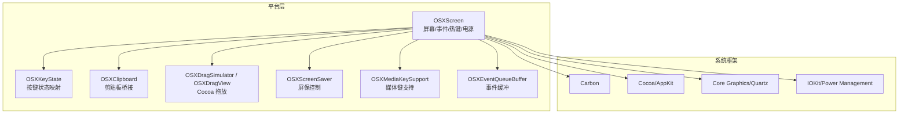
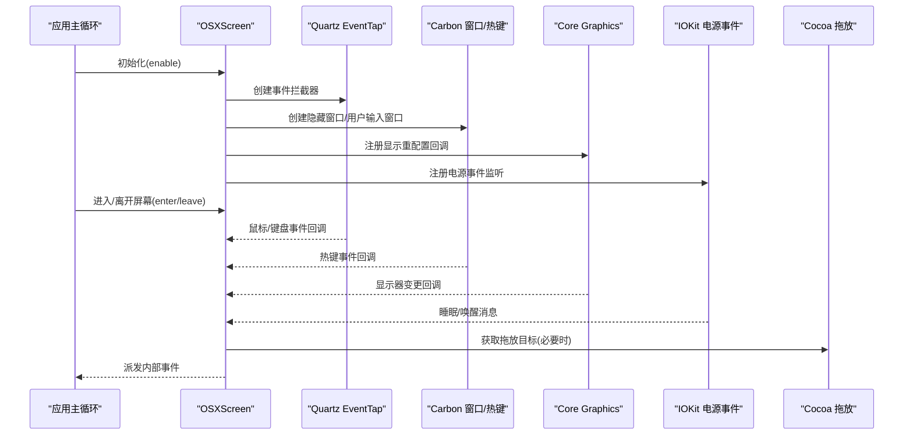
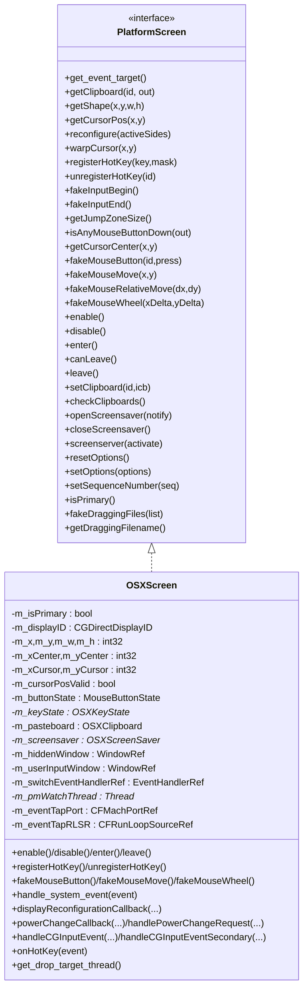
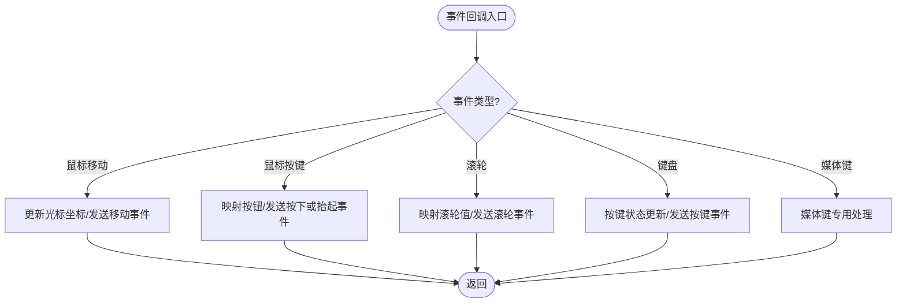
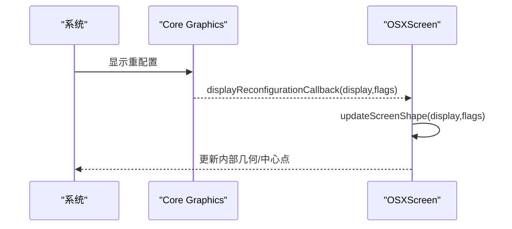
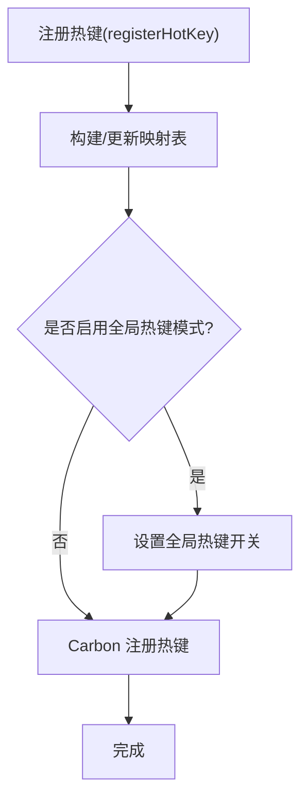
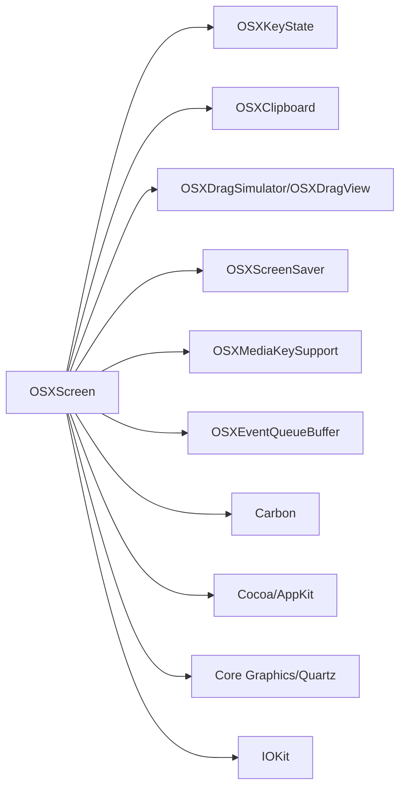

# macOS 平台适配器

<cite>
**本文引用的文件**   
- [OSXScreen.h](file://src/lib/platform/OSXScreen.h)
- [OSXScreenSaver.cpp](file://src/lib/platform/OSXScreenSaver.cpp)
- [OSXDragSimulator.h](file://src/lib/platform/OSXDragSimulator.h)
- [OSXDragView.h](file://src/lib/platform/OSXDragView.h)
- [OSXClipboard.h](file://src/lib/platform/OSXClipboard.h)
- [OSXKeyState.h](file://src/lib/platform/OSXKeyState.h)
- [OSXMediaKeySupport.h](file://src/lib/platform/OSXMediaKeySupport.h)
- [OSXEventQueueBuffer.h](file://src/lib/platform/OSXEventQueueBuffer.h)
- [ArgParser.h](file://src/lib/inputleap/ArgParser.h)
- [OSXScreenTests.cpp](file://src/test/integtests/platform/OSXScreenTests.cpp)
</cite>

## 目录
1. [简介](#简介)
2. [项目结构](#项目结构)
3. [核心组件](#核心组件)
4. [架构总览](#架构总览)
5. [详细组件分析](#详细组件分析)
6. [依赖关系分析](#依赖关系分析)
7. [性能考量](#性能考量)
8. [故障排查指南](#故障排查指南)
9. [结论](#结论)
10. [附录](#附录)

## 简介
本文件面向 macOS 平台适配器的开发者，聚焦于 OSXScreen 类的实现细节与系统集成方式。内容涵盖 Carbon API 与 Cocoa 框架的集成、Core Graphics 屏幕操作、NSEvent/Quartz 事件处理、辅助功能权限管理、菜单栏/Dock 图标管理与通知中心集成的机制说明，以及 macOS 特定内存管理、ARC 兼容性与性能优化最佳实践。同时提供不同 macOS 版本的兼容性处理与特性降级策略建议。

## 项目结构
macOS 平台相关代码主要位于 src/lib/platform 目录，围绕屏幕输入输出、剪贴板、拖放、电源管理、热键等能力进行模块化组织。OSXScreen 作为屏幕抽象的核心实现，聚合了 Quartz Event Tap、Carbon 窗口/热键、IOKit 电源管理、Core Graphics 显示配置变更回调等子系统。

图表来源
- [OSXScreen.h:52-357](file://src/lib/platform/OSXScreen.h#L52-L357)
- [OSXKeyState.h:22-71](file://src/lib/platform/OSXKeyState.h#L22-L71)
- [OSXClipboard.h:22-79](file://src/lib/platform/OSXClipboard.h#L22-L79)
- [OSXDragSimulator.h:25-28](file://src/lib/platform/OSXDragSimulator.h#L25-L28)
- [OSXDragView.h:17](file://src/lib/platform/OSXDragView.h#L17)
- [OSXScreenSaver.cpp:1-200](file://src/lib/platform/OSXScreenSaver.cpp#L1-L200)
- [OSXMediaKeySupport.h:20](file://src/lib/platform/OSXMediaKeySupport.h#L20)
- [OSXEventQueueBuffer.h:23](file://src/lib/platform/OSXEventQueueBuffer.h#L23)

章节来源
- [OSXScreen.h:52-357](file://src/lib/platform/OSXScreen.h#L52-L357)

## 核心组件
- OSXScreen：屏幕抽象的具体实现，负责鼠标/键盘事件采集与注入、屏幕几何信息、热键注册、剪贴板同步、屏保控制、电源事件监听、拖放目标获取等。
- OSXKeyState：维护按键状态并负责 Quartz 修饰键掩码与 Carbon 修饰键掩码之间的转换。
- OSXClipboard：在应用剪贴板格式与 Carbon Scrap 之间进行转换与同步。
- OSXDragSimulator/OSXDragView：基于 Cocoa 的拖放模拟与接收视图，用于获取拖放目标路径。
- OSXScreenSaver：封装屏保启停逻辑。
- OSXMediaKeySupport：媒体键（音量、播放控制）支持。
- OSXEventQueueBuffer：事件队列缓冲，桥接 Carbon 事件循环。

章节来源
- [OSXScreen.h:52-357](file://src/lib/platform/OSXScreen.h#L52-L357)
- [OSXKeyState.h:22-71](file://src/lib/platform/OSXKeyState.h#L22-L71)
- [OSXClipboard.h:22-79](file://src/lib/platform/OSXClipboard.h#L22-L79)
- [OSXDragSimulator.h:25-28](file://src/lib/platform/OSXDragSimulator.h#L25-L28)
- [OSXDragView.h:17](file://src/lib/platform/OSXDragView.h#L17)
- [OSXScreenSaver.cpp:1-200](file://src/lib/platform/OSXScreenSaver.cpp#L1-L200)
- [OSXMediaKeySupport.h:20](file://src/lib/platform/OSXMediaKeySupport.h#L20)
- [OSXEventQueueBuffer.h:23](file://src/lib/platform/OSXEventQueueBuffer.h#L23)

## 架构总览
OSXScreen 通过 Quartz Event Tap 捕获全局输入事件，结合 Carbon 窗口与热键机制，将事件转换为内部统一事件模型；同时使用 Core Graphics 查询屏幕几何与分辨率变化回调，使用 IOKit 监听睡眠/唤醒事件，并通过 Cocoa 子进程或 AppKit 完成拖放目标解析。

图表来源
- [OSXScreen.h:168-182](file://src/lib/platform/OSXScreen.h#L168-L182)
- [OSXScreen.h:191-199](file://src/lib/platform/OSXScreen.h#L191-L199)
- [OSXScreen.h:307-316](file://src/lib/platform/OSXScreen.h#L307-L316)
- [OSXDragSimulator.h:25-28](file://src/lib/platform/OSXDragSimulator.h#L25-L28)

## 详细组件分析

### OSXScreen 类设计与职责
- 继承自 PlatformScreen，实现跨平台屏幕接口在 macOS 上的具体行为。
- 关键职责：
  - 屏幕几何与光标位置获取、光标居中计算。
  - 鼠标/滚轮/键盘事件的注入与转发。
  - 全局热键注册/注销与修饰键组合处理。
  - 剪贴板同步与序列号去抖。
  - 屏保控制与“确认睡眠”事件处理。
  - 电源事件监听（睡眠/唤醒）。
  - 拖放目标获取（通过 Cocoa 子进程/视图）。
  - 双键点击合并与滚动速度映射。
  - Carbon 循环就绪等待（10.7+）。

图表来源
- [OSXScreen.h:52-357](file://src/lib/platform/OSXScreen.h#L52-L357)

章节来源
- [OSXScreen.h:52-357](file://src/lib/platform/OSXScreen.h#L52-L357)

### Quartz 事件拦截与 NSEvent/CGEvent 处理
- 通过 CGEventTap 订阅全局输入事件，并在回调中过滤/转换后派发到内部事件队列。
- 提供主/次两个事件拦截入口以区分不同上下文。
- 对媒体键事件单独处理，避免与普通按键混淆。
- 与 Carbon 窗口协同，确保在无焦点时仍可接收用户输入事件。

图表来源
- [OSXScreen.h:191-199](file://src/lib/platform/OSXScreen.h#L191-L199)
- [OSXScreen.h:130-133](file://src/lib/platform/OSXScreen.h#L130-L133)

章节来源
- [OSXScreen.h:191-199](file://src/lib/platform/OSXScreen.h#L191-L199)
- [OSXScreen.h:130-133](file://src/lib/platform/OSXScreen.h#L130-L133)

### 屏幕几何与 Core Graphics 集成
- 使用 Core Graphics 查询当前显示 ID、屏幕矩形与中心点。
- 注册显示重配置回调，动态响应分辨率/布局变化。
- 提供 warpCursor、getCursorPos、getCursorCenter 等方法。

图表来源
- [OSXScreen.h:168-170](file://src/lib/platform/OSXScreen.h#L168-L170)
- [OSXScreen.h:112-114](file://src/lib/platform/OSXScreen.h#L112-L114)

章节来源
- [OSXScreen.h:112-114](file://src/lib/platform/OSXScreen.h#L112-L114)
- [OSXScreen.h:168-170](file://src/lib/platform/OSXScreen.h#L168-L170)

### 热键系统与 Carbon 集成
- 使用 Carbon Event Manager 注册全局热键，支持修饰键组合。
- 提供 isGlobalHotKeyOperatingModeAvailable/setGlobalHotKeysEnabled/getGlobalHotKeysEnabled 等静态方法用于检测与切换全局热键模式。
- 内部维护 HotKeyMap、ModifierHotKeyMap 等映射表，便于增删改查。

图表来源
- [OSXScreen.h:187-189](file://src/lib/platform/OSXScreen.h#L187-L189)
- [OSXScreen.h:318-323](file://src/lib/platform/OSXScreen.h#L318-L323)

章节来源
- [OSXScreen.h:187-189](file://src/lib/platform/OSXScreen.h#L187-L189)
- [OSXScreen.h:318-323](file://src/lib/platform/OSXScreen.h#L318-L323)

### 剪贴板与 Carbon Scrap 转换
- OSXClipboard 负责在应用剪贴板格式与 Carbon Scrap 之间进行转换。
- OSXScreen 持有 OSXClipboard 实例，周期性检查剪贴板变化并派发事件。

章节来源
- [OSXClipboard.h:22-79](file://src/lib/platform/OSXClipboard.h#L22-L79)
- [OSXScreen.h:287-298](file://src/lib/platform/OSXScreen.h#L287-L298)

### 拖放目标获取（Cocoa 集成）
- 通过 OSXDragSimulator/OSXDragView 启动最小化 Cocoa 环境，调用 getCocoaDropTarget 获取拖放目标路径。
- 该过程可能涉及独立线程与事件循环协调。

章节来源
- [OSXDragSimulator.h:25-28](file://src/lib/platform/OSXDragSimulator.h#L25-L28)
- [OSXDragView.h:17](file://src/lib/platform/OSXDragView.h#L17)
- [OSXScreen.h:204](file://src/lib/platform/OSXScreen.h#L204)

### 屏保控制与电源事件
- OSXScreenSaver 封装屏保启停逻辑。
- 使用 IOKit 监听系统电源事件（睡眠/唤醒），并提供 handlePowerChangeRequest 处理请求。
- 提供 openScreensaver/closeScreensaver/screensaver 等接口。

章节来源
- [OSXScreenSaver.cpp:1-200](file://src/lib/platform/OSXScreenSaver.cpp#L1-L200)
- [OSXScreen.h:177-184](file://src/lib/platform/OSXScreen.h#L177-L184)
- [OSXScreen.h:291-294](file://src/lib/platform/OSXScreen.h#L291-L294)

### 媒体键支持
- OSXMediaKeySupport 提供媒体键事件处理能力，避免与普通按键冲突。

章节来源
- [OSXMediaKeySupport.h:20](file://src/lib/platform/OSXMediaKeySupport.h#L20)

### 事件缓冲与 Carbon 循环
- OSXEventQueueBuffer 桥接 Carbon 事件循环，确保事件顺序与一致性。
- OSXScreen 提供 waitForCarbonLoop 以等待 Carbon 循环就绪（10.7+）。

章节来源
- [OSXEventQueueBuffer.h:23](file://src/lib/platform/OSXEventQueueBuffer.h#L23)
- [OSXScreen.h:103](file://src/lib/platform/OSXScreen.h#L103)
- [OSXScreen.h:347-351](file://src/lib/platform/OSXScreen.h#L347-L351)

### 辅助功能权限管理
- macOS 要求具备辅助功能权限才能进行全局事件注入与屏幕控制。
- 建议在应用启动时检测权限，若未授权则引导用户前往“系统偏好设置 > 安全性与隐私 > 辅助功能”进行授权。
- 可结合 ArgParser 提供的 parseCarbonArg 参数解析流程，在命令行或配置中提示/记录权限状态。

章节来源
- [ArgParser.h:94](file://src/lib/inputleap/ArgParser.h#L94)

### 菜单栏集成、Dock 图标管理与通知中心集成
- 当前仓库未见直接的菜单栏、Dock 图标或通知中心集成代码。
- 建议采用以下方案：
  - 菜单栏：使用 NSStatusBar 与 NSMenu 创建常驻菜单项，暴露常用操作（如切换主从屏、查看日志、退出）。
  - Dock 图标：默认由 Info.plist 与 bundle 资源决定，可在需要时自定义图标与右键菜单。
  - 通知中心：使用 NSUserNotificationCenter 或 UserNotifications Framework 推送状态变更与错误提示。
- 这些属于上层 UI 集成，可与现有平台层解耦，通过 IPC 或事件总线与核心服务通信。

[本节为概念性建议，不直接分析具体源码文件]

## 依赖关系分析
- 模块内聚：OSXScreen 聚合多个子系统（事件、热键、电源、剪贴板、屏保、拖放），职责清晰但耦合度较高，建议通过接口进一步解耦。
- 外部依赖：
  - Carbon：窗口、热键、事件循环。
  - Cocoa/AppKit：拖放目标获取、UI 集成（未来扩展）。
  - Core Graphics/Quartz：事件拦截、屏幕几何、显示变更回调。
  - IOKit：电源事件监听。
- 潜在循环依赖：当前未见明显循环依赖，但需注意事件回调与线程间的锁与条件变量使用。

图表来源
- [OSXScreen.h:52-357](file://src/lib/platform/OSXScreen.h#L52-L357)
- [OSXKeyState.h:22-71](file://src/lib/platform/OSXKeyState.h#L22-L71)
- [OSXClipboard.h:22-79](file://src/lib/platform/OSXClipboard.h#L22-L79)
- [OSXDragSimulator.h:25-28](file://src/lib/platform/OSXDragSimulator.h#L25-L28)
- [OSXDragView.h:17](file://src/lib/platform/OSXDragView.h#L17)
- [OSXScreenSaver.cpp:1-200](file://src/lib/platform/OSXScreenSaver.cpp#L1-L200)
- [OSXMediaKeySupport.h:20](file://src/lib/platform/OSXMediaKeySupport.h#L20)
- [OSXEventQueueBuffer.h:23](file://src/lib/platform/OSXEventQueueBuffer.h#L23)

章节来源
- [OSXScreen.h:52-357](file://src/lib/platform/OSXScreen.h#L52-L357)

## 性能考量
- 事件节流与合并：
  - 双击合并：利用 m_lastClickTime/m_clickState 减少重复事件。
  - 滚轮映射：map_scroll_wheel_from_osx/map_scroll_wheel_to_osx 与 getScrollSpeed/getScrollSpeedFactor 提升用户体验。
- 定时器与后台任务：
  - 剪贴板检查定时器与拖拽定时器需合理设置间隔，避免频繁系统调用。
- 线程与锁：
  - 电源事件监听线程使用互斥量与条件变量保护共享状态，注意避免死锁与忙等。
- 资源释放：
  - 正确销毁 EventTap、CFRunLoopSource、IOKit 连接等资源，防止泄漏。
- ARC 与 Objective-C++：
  - 在 .mm 文件中混编 C++ 与 Objective-C 时，遵循 ARC 规则，避免手动 retain/release 与 ARC 冲突。

[本节为通用指导，不直接分析具体源码文件]

## 故障排查指南
- 辅助功能权限缺失：
  - 现象：无法注入事件或读取屏幕状态。
  - 处理：引导用户开启辅助功能权限，重启应用后重试。
- 事件丢失或延迟：
  - 现象：鼠标/键盘事件不生效或滞后。
  - 处理：检查 EventTap 是否正确创建与运行，确认 Carbon 循环已就绪（waitForCarbonLoop）。
- 屏保/电源异常：
  - 现象：睡眠/唤醒后行为异常。
  - 处理：验证 powerChangeCallback 与 handlePowerChangeRequest 是否被触发，检查 assertionID 生命周期。
- 剪贴板不同步：
  - 现象：复制粘贴失败。
  - 处理：检查 OSXClipboard 转换逻辑与序列号去抖，确认 checkClipboards 定时器工作正常。
- 测试用例参考：
  - 可参考 OSXScreenTests.cpp 中的光标可见性测试思路（尽管当前被禁用），用于定位光标显示问题。

章节来源
- [OSXScreen.h:103](file://src/lib/platform/OSXScreen.h#L103)
- [OSXScreen.h:177-184](file://src/lib/platform/OSXScreen.h#L177-L184)
- [OSXScreen.h:296-298](file://src/lib/platform/OSXScreen.h#L296-L298)
- [OSXScreenTests.cpp:1-53](file://src/test/integtests/platform/OSXScreenTests.cpp#L1-L53)

## 结论
OSXScreen 作为 macOS 平台适配的核心，整合了 Carbon、Cocoa、Core Graphics 与 IOKit 等多层系统能力，提供了完整的屏幕与输入事件处理链路。为保证稳定性与可维护性，建议：
- 明确模块边界，降低高耦合风险。
- 完善权限检测与降级策略，提升用户体验。
- 强化资源管理与线程安全，避免泄漏与竞态。
- 针对新系统特性制定兼容与降级方案，保持向后兼容。

[本节为总结性内容，不直接分析具体源码文件]

## 附录
- 版本兼容与特性降级建议：
  - 10.7+：使用 waitForCarbonLoop 等待 Carbon 循环就绪。
  - 10.10+：优先使用 Quartz Event Tap 进行事件拦截，必要时回退到 Carbon 事件管理器。
  - 10.12+：考虑引入更现代的权限提示与通知中心 API。
  - 10.15+：关注 App Sandbox 与权限变更的影响，调整 UI 集成策略。
- 最佳实践清单：
  - 所有系统对象生命周期明确，析构时释放资源。
  - 事件处理尽量轻量，耗时操作放入后台线程。
  - 对外暴露稳定接口，内部实现可替换。
  - 单元测试覆盖关键路径（事件映射、热键注册、电源事件）。

[本节为通用指导，不直接分析具体源码文件]