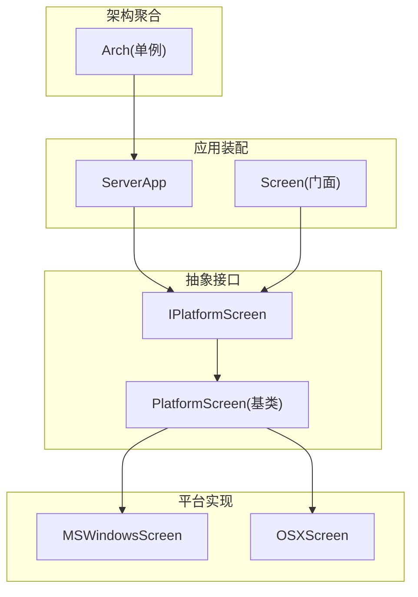
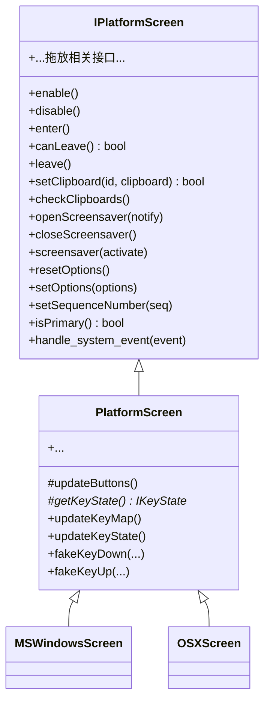
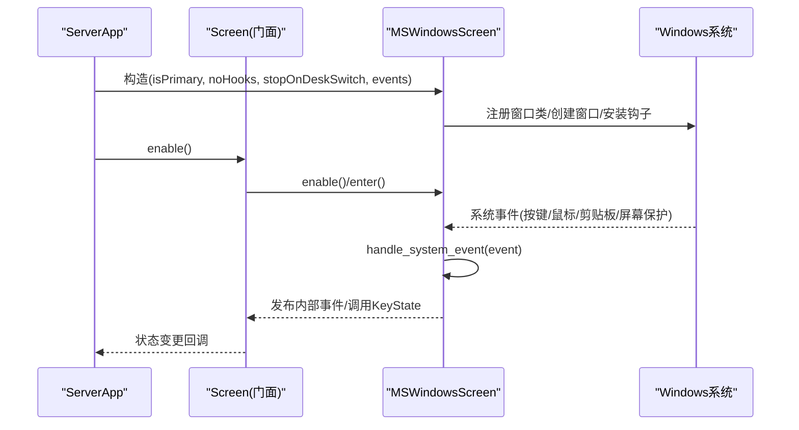
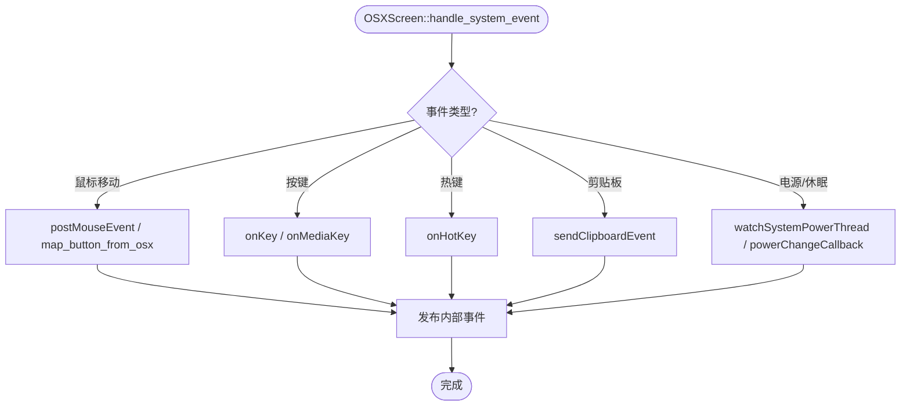
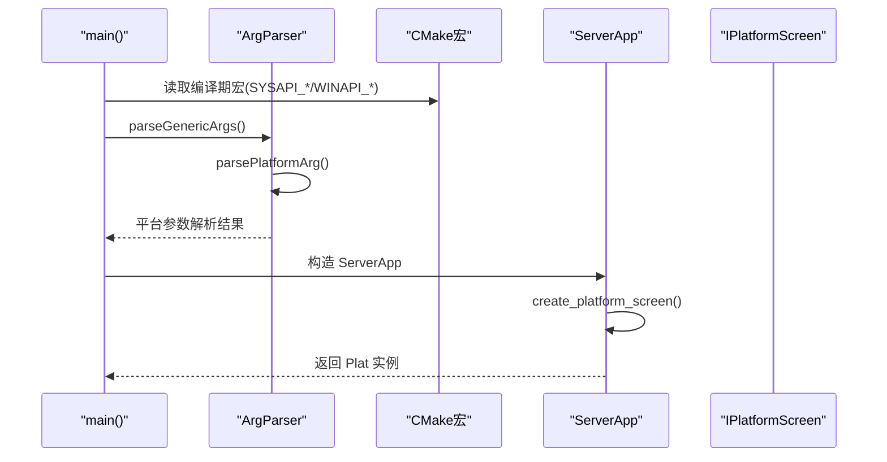
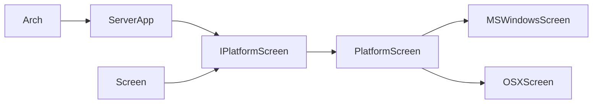

# 平台抽象层设计

<cite>
**本文引用的文件**   
- [IPlatformScreen.h](file://src/lib/inputleap/IPlatformScreen.h)
- [PlatformScreen.h](file://src/lib/inputleap/PlatformScreen.h)
- [MSWindowsScreen.h](file://src/lib/platform/MSWindowsScreen.h)
- [OSXScreen.h](file://src/lib/platform/OSXScreen.h)
- [Arch.h](file://src/lib/arch/Arch.h)
- [ArgParser.cpp](file://src/lib/inputleap/ArgParser.cpp)
- [CMakeLists.txt](file://CMakeLists.txt)
- [ServerApp.h](file://src/lib/inputleap/ServerApp.h)
- [Screen.h](file://src/lib/inputleap/Screen.h)
- [Screen.cpp](file://src/lib/inputleap/Screen.cpp)
- [PlatformScreenLoggingWrapper.cpp](file://src/lib/inputleap/PlatformScreenLoggingWrapper.cpp)
</cite>

## 目录
1. [引言](#引言)
2. [项目结构](#项目结构)
3. [核心组件](#核心组件)
4. [架构总览](#架构总览)
5. [详细组件分析](#详细组件分析)
6. [依赖关系分析](#依赖关系分析)
7. [性能考量](#性能考量)
8. [故障排查指南](#故障排查指南)
9. [结论](#结论)
10. [附录](#附录)

## 引言
本文件面向 Input Leap 的平台抽象层，系统性阐述 IPlatformScreen 接口的设计理念与虚函数规范，解释跨平台抽象层如何屏蔽操作系统差异；并详细说明平台工厂模式、动态加载机制与运行时平台检测的实现方式。同时给出平台特定代码的组织结构、条件编译策略与构建系统配置，并提供新平台适配的开发流程、测试策略与兼容性验证方法，帮助开发者快速、安全地扩展新的平台支持。

## 项目结构
Input Leap 的平台抽象层位于 src/lib 下，围绕输入设备与屏幕的跨平台能力进行分层：
- 抽象接口层：定义平台无关的屏幕与键鼠状态接口（如 IScreen、IPrimaryScreen、ISecondaryScreen、IKeyState）以及统一的平台屏幕接口 IPlatformScreen。
- 基础实现层：提供 PlatformScreen 基类，封装通用逻辑与默认行为，要求子类实现平台相关细节。
- 平台实现层：针对不同平台的具体实现，例如 Windows 的 MSWindowsScreen、macOS 的 OSXScreen。
- 架构聚合层：通过 Arch 单例聚合各平台子系统（日志、多线程、网络、系统、任务栏等），在运行期统一访问。
- 应用装配层：ServerApp 负责创建具体平台屏幕实例，Screen 作为高层门面协调生命周期与事件分发。
- 构建与条件编译：顶层 CMakeLists.txt 根据目标平台注入宏定义，驱动不同平台的编译分支。

图表来源
- [IPlatformScreen.h:37-185](file://src/lib/inputleap/IPlatformScreen.h#L37-L185)
- [PlatformScreen.h:34-91](file://src/lib/inputleap/PlatformScreen.h#L34-L91)
- [MSWindowsScreen.h:42-131](file://src/lib/platform/MSWindowsScreen.h#L42-L131)
- [OSXScreen.h:53-109](file://src/lib/platform/OSXScreen.h#L53-L109)
- [Arch.h:77-110](file://src/lib/arch/Arch.h#L77-L110)
- [ServerApp.h:115](file://src/lib/inputleap/ServerApp.h#L115)
- [Screen.h:40-88](file://src/lib/inputleap/Screen.h#L40-L88)

章节来源
- [CMakeLists.txt:207-248](file://CMakeLists.txt#L207-L248)
- [Arch.h:77-110](file://src/lib/arch/Arch.h#L77-L110)
- [ServerApp.h:115](file://src/lib/inputleap/ServerApp.h#L115)
- [Screen.h:40-88](file://src/lib/inputleap/Screen.h#L40-L88)

## 核心组件
本节聚焦 IPlatformScreen 接口的设计与职责边界，以及 PlatformScreen 基类的约定与扩展点。

- IPlatformScreen 设计理念
  - 统一入口：对主屏与副屏共同的生命周期与系统交互进行抽象，包括 enable/disable、enter/leave、剪贴板、屏幕保护、选项管理、拖放等。
  - 事件处理契约：要求平台实现在构造时注册系统事件处理器，析构时移除；并在 handle_system_event 中按 IScreen/IPrimaryScreen/ISecondaryScreen/IKeyState 的语义发布事件或调用 KeyState。
  - 主屏责任：主屏需额外维护热键、鼠标键盘模拟、焦点与窗口类等系统资源；副屏则侧重事件合成与光标控制。
  - 可观测性：提供 isPrimary、序列号、拖拽状态等辅助接口，便于上层编排。

- 虚函数规范要点
  - 生命周期：enable/disable 成对出现；enter/canLeave/leave 用于“进入/离开”屏幕时的前置检查与清理。
  - 剪贴板：setClipboard/checkClipboards 保证跨端一致性；checkClipboards 作为兜底策略。
  - 屏幕保护：openScreensaver/closeScreensaver/screensaver 组合使用，支持通知模式与强制激活/关闭。
  - 选项：resetOptions/setOptions 允许平台按需忽略未知项。
  - 事件：handle_system_event 必须将系统事件转换为内部事件模型，并投递到 get_event_target() 指定的目标。

- PlatformScreen 基类
  - 提供通用键鼠状态代理与拖拽状态缓存，减少重复实现。
  - 暴露受保护的纯虚函数 updateButtons/getKeyState，要求子类实现底层按钮映射与键态对象获取。
  - 对未实现的拖放相关接口抛出运行时异常，明确扩展点。

章节来源
- [IPlatformScreen.h:37-185](file://src/lib/inputleap/IPlatformScreen.h#L37-L185)
- [PlatformScreen.h:34-91](file://src/lib/inputleap/PlatformScreen.h#L34-L91)

## 架构总览
平台抽象层通过“接口 + 基类 + 平台实现 + 架构聚合 + 应用装配”的分层，屏蔽操作系统差异，使上层业务无需感知平台细节。

图表来源
- [IPlatformScreen.h:37-185](file://src/lib/inputleap/IPlatformScreen.h#L37-L185)
- [PlatformScreen.h:34-91](file://src/lib/inputleap/PlatformScreen.h#L34-L91)
- [MSWindowsScreen.h:42-131](file://src/lib/platform/MSWindowsScreen.h#L42-L131)
- [OSXScreen.h:53-109](file://src/lib/platform/OSXScreen.h#L53-L109)

## 详细组件分析

### IPlatformScreen 接口与虚函数规范
- 生命周期与进入/离开
  - enable/disable：准备/释放系统资源，副屏隐藏光标、准备事件合成。
  - enter/canLeave/leave：主屏 may fail canLeave 以阻止离开（如无法安装钩子）。
- 剪贴板同步
  - setClipboard：设置指定 ID 的剪贴板内容。
  - checkClipboards：轮询所有剪贴板所有权变化，必要时主动发布抓取事件。
- 屏幕保护
  - openScreensaver(notify)：notify=true 时上报激活/停用事件；false 时禁用并恢复。
  - screensaver(activate)：强制激活或停用。
- 选项与序列号
  - resetOptions/setOptions：重置为默认或增量更新；忽略未知项。
  - setSequenceNumber：设置后续剪贴板事件的序列号。
- 事件处理
  - handle_system_event：平台应在构造中注册系统事件处理器，析构移除；在此方法内将系统事件转换为内部事件并投递至 get_event_target()。

章节来源
- [IPlatformScreen.h:37-185](file://src/lib/inputleap/IPlatformScreen.h#L37-L185)

### PlatformScreen 基类与扩展点
- 通用功能
  - 键鼠状态代理：updateKeyMap/updateKeyState/fakeKeyDown/fakeKeyUp 等。
  - 拖拽状态：m_draggingFilename/m_draggingStarted/m_fakeDraggingStarted。
- 扩展点
  - updateButtons：子类实现鼠标按钮映射与状态跟踪。
  - getKeyState：返回平台特定的 IKeyState 指针。
- 未实现行为的异常提示
  - fakeDraggingFiles/getDropTarget/setDropTarget 默认抛异常，提示平台实现需覆盖。

章节来源
- [PlatformScreen.h:34-91](file://src/lib/inputleap/PlatformScreen.h#L34-L91)

### Windows 平台实现（MSWindowsScreen）
- 关键职责
  - 窗口类与窗口创建、消息循环、热键注册、剪贴板链维护、屏幕保护集成、光标显示控制、拖放目标窗口等。
  - 主屏：reconfigure/warpCursor/registerHotKey/unregisterHotKey/fakeInputBegin/End 等。
  - 副屏：fakeMouseButton/fakeMouseMove/fakeMouseRelativeMove/fakeMouseWheel。
- 事件处理
  - 在构造函数中安装系统事件处理器，在析构中移除；handle_system_event 转发到具体消息处理函数。
- 资源管理
  - 静态 HINSTANCE 保存、窗口类注册/销毁、DropTarget 线程发送拖拽数据等。

图表来源
- [MSWindowsScreen.h:42-131](file://src/lib/platform/MSWindowsScreen.h#L42-L131)
- [Screen.cpp:60-99](file://src/lib/inputleap/Screen.cpp#L60-L99)

章节来源
- [MSWindowsScreen.h:42-131](file://src/lib/platform/MSWindowsScreen.h#L42-L131)

### macOS 平台实现（OSXScreen）
- 关键职责
  - Quartz Event Tap、Carbon 事件、IOKit 电源管理、全局热键、剪贴板、屏幕保护、分辨率切换回调等。
  - 主屏：reconfigure/warpCursor/registerHotKey/unregisterHotKey/fakeInputBegin/End 等。
  - 副屏：fakeMouseButton/fakeMouseMove/fakeMouseRelativeMove/fakeMouseWheel。
- 事件处理
  - 通过 CGEventTap 与 Carbon 事件处理器捕获输入事件，转换并发布到内部事件队列。
- 特殊处理
  - 自动显示/隐藏光标、滚动速度映射、双击合并、用户快速切换监听等。

图表来源
- [OSXScreen.h:53-109](file://src/lib/platform/OSXScreen.h#L53-L109)

章节来源
- [OSXScreen.h:53-109](file://src/lib/platform/OSXScreen.h#L53-L109)

### 平台工厂模式与运行时平台检测
- 工厂位置
  - ServerApp 提供 create_platform_screen()，负责根据当前平台创建具体的 IPlatformScreen 实例。
- 运行时检测
  - 通过编译期宏（由 CMake 注入）决定包含哪些平台头与实现，从而在运行期选择正确的平台路径。
- 参数解析
  - ArgParser::parsePlatformArg 依据平台宏分派到对应平台参数解析器，确保命令行选项在不同平台上的正确行为。

图表来源
- [ServerApp.h:115](file://src/lib/inputleap/ServerApp.h#L115)
- [ArgParser.cpp:324-343](file://src/lib/inputleap/ArgParser.cpp#L324-L343)
- [CMakeLists.txt:207-248](file://CMakeLists.txt#L207-L248)

章节来源
- [ServerApp.h:115](file://src/lib/inputleap/ServerApp.h#L115)
- [ArgParser.cpp:324-343](file://src/lib/inputleap/ArgParser.cpp#L324-L343)
- [CMakeLists.txt:207-248](file://CMakeLists.txt#L207-L248)

### 动态加载机制
- 进程执行状态控制（Windows）
  - ArchMiscWindows 通过 LoadLibrary/GetProcAddress 动态加载 SetThreadExecutionState，兼容旧版系统。
- 其他平台
  - 未见显式动态库加载示例；主要依赖编译期宏与链接期符号。

章节来源
- [Arch.h:77-110](file://src/lib/arch/Arch.h#L77-L110)
- [ArchMiscWindows.cpp:371-399](file://src/lib/arch/win32/ArchMiscWindows.cpp#L371-L399)

### 平台特定代码组织结构
- 平台实现位于 src/lib/platform 下，每个平台一个目录与一组头/源文件。
- 抽象接口与基类位于 src/lib/inputleap。
- 架构聚合位于 src/lib/arch，按平台子目录组织（win32/unix）。
- 应用装配位于 src/lib/inputleap 中的 ServerApp 与 Screen。

章节来源
- [MSWindowsScreen.h:42-131](file://src/lib/platform/MSWindowsScreen.h#L42-L131)
- [OSXScreen.h:53-109](file://src/lib/platform/OSXScreen.h#L53-L109)
- [Arch.h:77-110](file://src/lib/arch/Arch.h#L77-L110)

### 条件编译策略与构建系统配置
- 顶层 CMakeLists.txt 根据目标平台注入宏：
  - Windows：SYSAPI_WIN32=1、WINAPI_MSWINDOWS=1
  - Unix：SYSAPI_UNIX=1；Apple 启用 WINAPI_CARBON=1；Linux 可选 X11 或 libei
- 源码中使用这些宏进行分支选择，如 ArgParser::parsePlatformArg 的多分支解析。

章节来源
- [CMakeLists.txt:207-248](file://CMakeLists.txt#L207-L248)
- [ArgParser.cpp:324-343](file://src/lib/inputleap/ArgParser.cpp#L324-L343)

## 依赖关系分析
- 耦合与内聚
  - IPlatformScreen 与 PlatformScreen 形成高内聚的抽象层；平台实现仅依赖抽象接口与必要的基础设施（事件队列、KeyState）。
  - ServerApp 与 Screen 作为装配层，依赖 IPlatformScreen 而不直接耦合具体平台。
- 外部依赖
  - Windows：Win32 API、COM、WTS、Userenv 等。
  - macOS：Carbon、Quartz、IOKit。
  - Linux/X11：X11 或 libei（由构建开关决定）。
- 潜在循环依赖
  - 通过接口解耦，未见明显循环依赖；注意避免在平台实现中反向依赖上层业务模块。

图表来源
- [IPlatformScreen.h:37-185](file://src/lib/inputleap/IPlatformScreen.h#L37-L185)
- [PlatformScreen.h:34-91](file://src/lib/inputleap/PlatformScreen.h#L34-L91)
- [MSWindowsScreen.h:42-131](file://src/lib/platform/MSWindowsScreen.h#L42-L131)
- [OSXScreen.h:53-109](file://src/lib/platform/OSXScreen.h#L53-L109)
- [ServerApp.h:115](file://src/lib/inputleap/ServerApp.h#L115)
- [Screen.h:40-88](file://src/lib/inputleap/Screen.h#L40-L88)
- [Arch.h:77-110](file://src/lib/arch/Arch.h#L77-L110)

章节来源
- [CMakeLists.txt:207-248](file://CMakeLists.txt#L207-L248)

## 性能考量
- 事件处理路径优化
  - 平台实现应尽量减少 handle_system_event 中的锁竞争与拷贝，优先使用引用与零拷贝策略传递数据。
- 定时器与轮询
  - 剪贴板检查、屏幕保护状态等采用定时器轮询的场景，应合理降低频率，避免 CPU 占用过高。
- 资源管理
  - 窗口类、钩子、事件监听器等系统资源需在 enable/disable 与 enter/leave 中严格配对，防止泄漏。
- 动态加载
  - Windows 上动态加载内核函数以避免旧系统不兼容，但需注意首次加载开销与错误回退路径。

[本节为通用指导，不涉及具体文件分析]

## 故障排查指南
- 日志包装
  - PlatformScreenLoggingWrapper 对关键接口调用进行日志记录，便于定位问题。
- 常见问题
  - 剪贴板不同步：检查 setClipboard/checkClipboards 调用路径与序列号设置。
  - 屏幕保护异常：确认 openScreensaver/closeScreensaver/screensaver 的组合与 notify 模式。
  - 主屏离开失败：关注 canLeave 返回值与主屏钩子安装状态。
  - 事件丢失：核对 handle_system_event 是否正确投递到 get_event_target()。

章节来源
- [PlatformScreenLoggingWrapper.cpp:39-205](file://src/lib/inputleap/PlatformScreenLoggingWrapper.cpp#L39-L205)

## 结论
Input Leap 的平台抽象层通过清晰的接口与基类约定、严格的平台实现约束、以及基于宏的条件编译与工厂装配，实现了良好的跨平台能力与可扩展性。遵循本文档的规范与流程，开发者可以高效地为新平台添加支持，并通过完善的测试与兼容性验证保障质量。

[本节为总结，不涉及具体文件分析]

## 附录

### 新平台适配开发流程
- 步骤
  1. 在 src/lib/platform 下新增平台目录与头/源文件，继承 PlatformScreen 并实现 IPlatformScreen 全部虚函数。
  2. 在 ServerApp::create_platform_screen() 中添加平台分支，返回新平台实例。
  3. 在顶层 CMakeLists.txt 中为新平台注入宏定义，并确保依赖库链接。
  4. 在 ArgParser 中为新平台添加命令行参数解析分支（如有需要）。
  5. 编写单元测试与集成测试，覆盖 enable/disable、enter/leave、剪贴板、屏幕保护、事件处理等关键路径。
  6. 使用 PlatformScreenLoggingWrapper 进行调试与问题定位。
- 注意事项
  - 严格遵循 IPlatformScreen 的语义与生命周期约定。
  - 主屏与副屏的职责分离要清晰，避免越权操作。
  - 资源申请与释放必须成对，防止泄漏与悬挂句柄。

[本节为流程指导，不涉及具体文件分析]

### 测试策略与兼容性验证
- 单元测试
  - 针对 PlatformScreen 基类的通用逻辑与默认异常路径进行测试。
  - 对 IPlatformScreen 的关键方法（剪贴板、屏幕保护、选项）进行断言。
- 集成测试
  - 在主屏/副屏场景下验证事件流转、热键注册、光标行为、拖放流程。
- 兼容性验证
  - 在不同操作系统版本与硬件环境下验证动态加载与 API 可用性。
  - 针对旧系统特性（如 Windows 旧版 API）进行回退路径验证。

[本节为测试指导，不涉及具体文件分析]