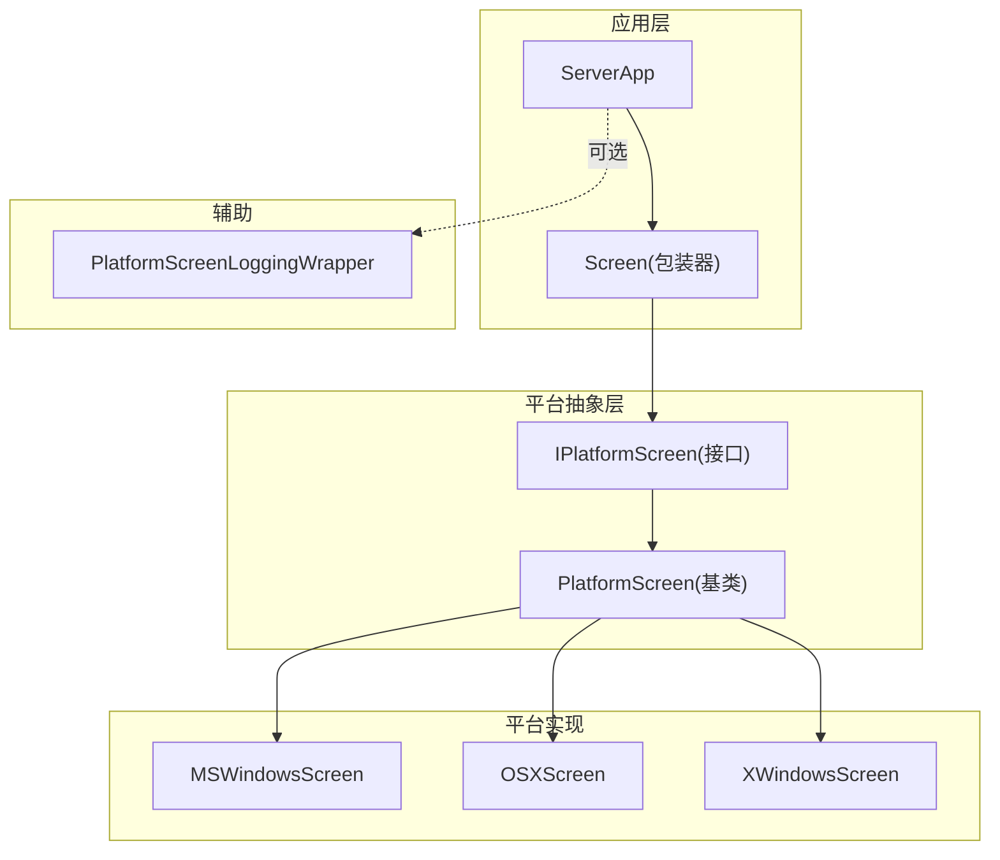
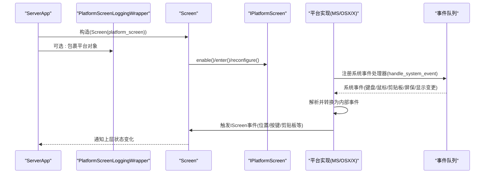
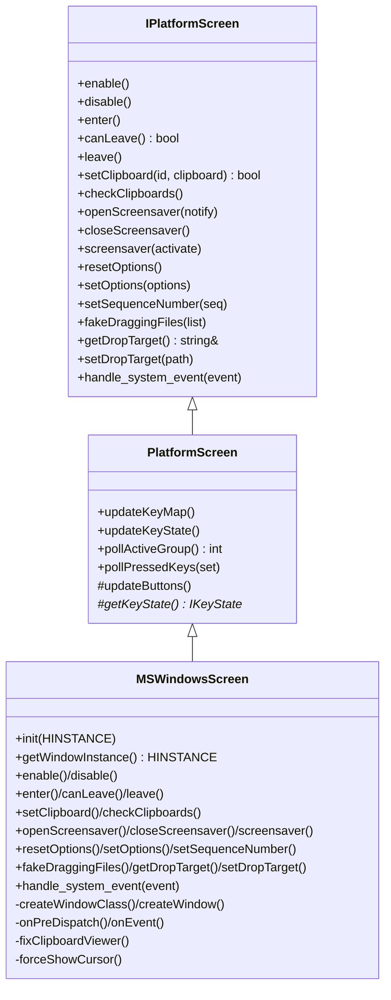
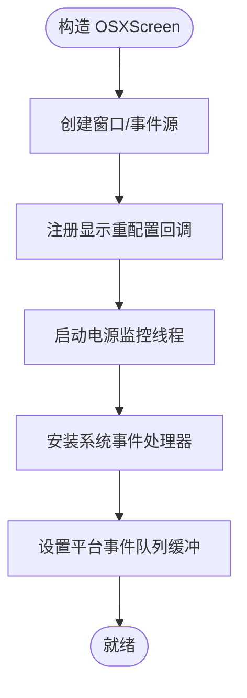
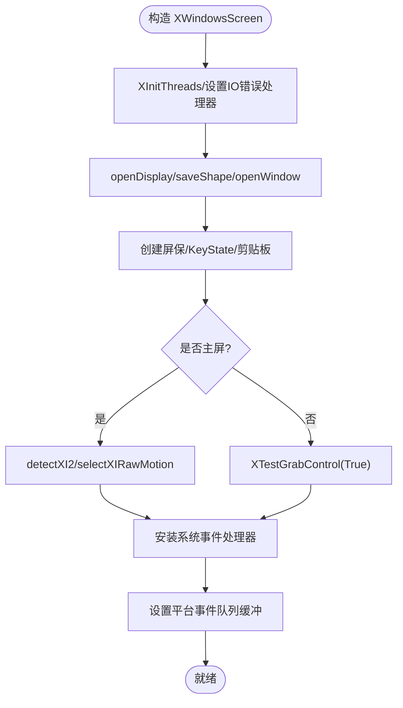
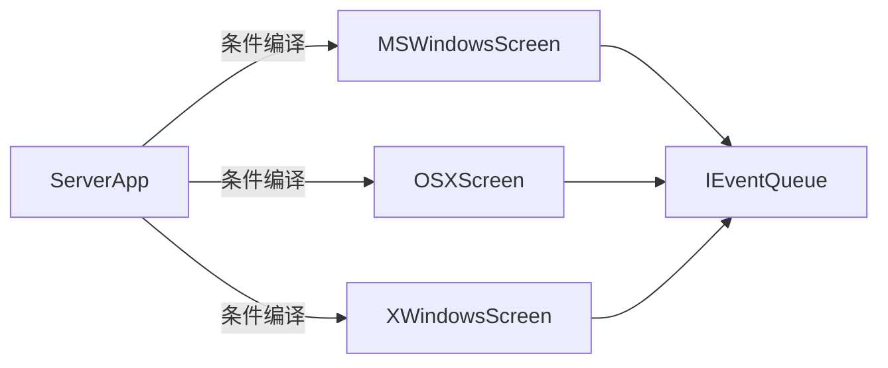

# 平台适配器接口

<cite>
**本文引用的文件**   
- [IPlatformScreen.h](file://src/lib/inputleap/IPlatformScreen.h)
- [PlatformScreen.h](file://src/lib/inputleap/PlatformScreen.h)
- [MSWindowsScreen.h](file://src/lib/platform/MSWindowsScreen.h)
- [MSWindowsScreen.cpp](file://src/lib/platform/MSWindowsScreen.cpp)
- [OSXScreen.h](file://src/lib/platform/OSXScreen.h)
- [XWindowsScreen.h](file://src/lib/platform/XWindowsScreen.h)
- [XWindowsScreen.cpp](file://src/lib/platform/XWindowsScreen.cpp)
- [PlatformScreenLoggingWrapper.h](file://src/lib/inputleap/PlatformScreenLoggingWrapper.h)
- [PlatformScreenLoggingWrapper.cpp](file://src/lib/inputleap/PlatformScreenLoggingWrapper.cpp)
- [ServerApp.cpp](file://src/lib/inputleap/ServerApp.cpp)
- [Screen.h](file://src/lib/inputleap/Screen.h)
- [Screen.cpp](file://src/lib/inputleap/Screen.cpp)
</cite>

## 目录
1. [简介](#简介)
2. [项目结构](#项目结构)
3. [核心组件](#核心组件)
4. [架构总览](#架构总览)
5. [详细组件分析](#详细组件分析)
6. [依赖关系分析](#依赖关系分析)
7. [性能考量](#性能考量)
8. [故障排查指南](#故障排查指南)
9. [结论](#结论)
10. [附录：新平台适配开发指南](#附录新平台适配开发指南)

## 简介
本文件面向希望为 InputLeap 新增或维护平台适配器的开发者，聚焦于 IPlatformScreen 接口规范与 PlatformScreen 基类约定，并深入解析 MSWindowsScreen、OSXScreen、XWindowsScreen 三大平台实现的关键职责、初始化流程、事件处理与资源管理。文档同时提供跨平台输入捕获、屏幕检测、系统集成的抽象层 API 说明，以及平台兼容性检查、特性检测与降级处理的实践模式，帮助快速扩展新的平台后端。

## 项目结构
InputLeap 的平台适配层位于 src/lib/platform 下，各平台通过继承 PlatformScreen（实现 IPlatformScreen）完成具体能力；上层通过统一的 Screen 包装器与 ServerApp 进行实例化与生命周期管理。

图表来源
- [ServerApp.cpp:47-60](file://src/lib/inputleap/ServerApp.cpp#L47-L60)
- [Screen.h:40-88](file://src/lib/inputleap/Screen.h#L40-L88)
- [IPlatformScreen.h:37-87](file://src/lib/inputleap/IPlatformScreen.h#L37-L87)
- [PlatformScreen.h:34-94](file://src/lib/inputleap/PlatformScreen.h#L34-L94)
- [MSWindowsScreen.h:41-126](file://src/lib/platform/MSWindowsScreen.h#L41-L126)
- [OSXScreen.h:52-104](file://src/lib/platform/OSXScreen.h#L52-L104)
- [XWindowsScreen.h:38-89](file://src/lib/platform/XWindowsScreen.h#L38-L89)
- [PlatformScreenLoggingWrapper.h:23-40](file://src/lib/inputleap/PlatformScreenLoggingWrapper.h#L23-L40)

章节来源
- [ServerApp.cpp:47-60](file://src/lib/inputleap/ServerApp.cpp#L47-L60)
- [Screen.h:40-88](file://src/lib/inputleap/Screen.h#L40-L88)
- [IPlatformScreen.h:37-87](file://src/lib/inputleap/IPlatformScreen.h#L37-L87)
- [PlatformScreen.h:34-94](file://src/lib/inputleap/PlatformScreen.h#L34-L94)

## 核心组件
- IPlatformScreen：定义所有平台必须实现的统一接口，涵盖启用/禁用、进入/离开、剪贴板、屏保、选项、拖放、系统事件等。
- PlatformScreen：提供通用键鼠状态轮询、拖放状态、媒体键等默认实现，并要求子类实现 updateButtons() 和 getKeyState()。
- 平台实现：MSWindowsScreen、OSXScreen、XWindowsScreen 分别基于 Windows、macOS、X11 完成输入捕获、光标控制、热键、剪贴板、屏保、显示变化等。
- 日志包装器：PlatformScreenLoggingWrapper 对 IPlatformScreen 的调用进行透明日志记录，便于调试。
- 高层封装：Screen 将 IPlatformScreen 包装为更高层的 IScreen 行为，负责配置重入、进入/离开逻辑、屏保同步等。

章节来源
- [IPlatformScreen.h:37-188](file://src/lib/inputleap/IPlatformScreen.h#L37-L188)
- [PlatformScreen.h:34-94](file://src/lib/inputleap/PlatformScreen.h#L34-L94)
- [PlatformScreenLoggingWrapper.h:23-40](file://src/lib/inputleap/PlatformScreenLoggingWrapper.h#L23-L40)
- [Screen.h:40-88](file://src/lib/inputleap/Screen.h#L40-L88)

## 架构总览
下图展示从应用到平台的调用链与事件流，包括系统事件注入、平台实现处理、以及日志包装器的可插拔性。

图表来源
- [ServerApp.cpp:47-60](file://src/lib/inputleap/ServerApp.cpp#L47-L60)
- [PlatformScreenLoggingWrapper.cpp:165-198](file://src/lib/inputleap/PlatformScreenLoggingWrapper.cpp#L165-L198)
- [MSWindowsScreen.cpp:159-165](file://src/lib/platform/MSWindowsScreen.cpp#L159-L165)
- [XWindowsScreen.cpp:156-163](file://src/lib/platform/XWindowsScreen.cpp#L156-L163)
- [IPlatformScreen.h:162-184](file://src/lib/inputleap/IPlatformScreen.h#L162-L184)

## 详细组件分析

### IPlatformScreen 接口规范
- 生命周期
  - enable/disable：准备/释放系统事件监听与合成输入能力。
  - enter/canLeave/leave：焦点切换时的进入/离开钩子。
- 剪贴板
  - setClipboard/getClipboard/checkClipboards：设置/读取/轮询剪贴板所有权。
- 屏保
  - openScreensaver/closeScreensaver/screensaver：打开/关闭/强制激活屏保，支持通知模式。
- 选项与序列号
  - resetOptions/setOptions/setSequenceNumber：重置/设置选项、设置剪贴板事件序列号。
- 拖放
  - fakeDraggingFiles/getDropTarget/setDropTarget/isDraggingStarted/isFakeDraggingStarted/getDraggingFilename/clearDraggingFilename：跨屏拖拽文件数据传递与目标路径。
- 系统事件
  - handle_system_event：在构造函数中安装系统事件处理器，析构时移除；主屏需按 IPrimaryScreen 发布事件并更新 KeyState。

章节来源
- [IPlatformScreen.h:44-184](file://src/lib/inputleap/IPlatformScreen.h#L44-L184)

### PlatformScreen 基类
- 提供键鼠状态轮询、半双工掩码、虚拟按键、活动修饰键/组、按下键集合等默认实现。
- 要求子类实现：
  - updateButtons()：更新内部按钮映射与状态。
  - getKeyState()：返回平台特定的 IKeyState 指针。
- 拖放默认抛出异常，由具体平台覆盖以实现。

章节来源
- [PlatformScreen.h:34-94](file://src/lib/inputleap/PlatformScreen.h#L34-L94)

### MSWindowsScreen（Windows 平台）
- 关键职责
  - 窗口与消息循环：创建窗口类/窗口，处理 WM_* 消息，分发至 onPreDispatch/onEvent。
  - 输入捕获：全局钩子、热键注册、鼠标/键盘事件转换。
  - 剪贴板：作为剪贴板查看器链成员，处理剪贴板变更事件。
  - 屏保：通过 MSWindowsScreenSaver 集成。
  - 拖放：MSWindowsDropTarget 接收拖拽文件列表。
- 初始化与资源
  - init(HINSTANCE)：保存进程实例句柄。
  - 构造：创建屏幕形状缓存、窗口、OleInitialize、DropTarget、安装系统事件处理器、设置平台事件队列缓冲。
  - 析构：撤销拖放、释放 COM、销毁窗口/类、删除 KeyState/Desks/Screensaver、移除事件处理器。
- 特性与兼容
  - 多显示器检测、MouseKeys 可见性修复、特殊组合键屏蔽、显示变更回调。
- 典型流程
  - 系统事件 -> handle_system_event -> 具体消息处理 -> 转发给上层 IScreen。

图表来源
- [IPlatformScreen.h:37-184](file://src/lib/inputleap/IPlatformScreen.h#L37-L184)
- [PlatformScreen.h:34-94](file://src/lib/inputleap/PlatformScreen.h#L34-L94)
- [MSWindowsScreen.h:41-126](file://src/lib/platform/MSWindowsScreen.h#L41-L126)
- [MSWindowsScreen.cpp:159-165](file://src/lib/platform/MSWindowsScreen.cpp#L159-L165)

章节来源
- [MSWindowsScreen.h:41-126](file://src/lib/platform/MSWindowsScreen.h#L41-L126)
- [MSWindowsScreen.cpp:89-165](file://src/lib/platform/MSWindowsScreen.cpp#L89-L165)

### OSXScreen（macOS 平台）
- 关键职责
  - 事件捕获：Quartz Event Tap、Carbon 事件、全局热键。
  - 剪贴板：OSXClipboard 集成。
  - 屏保：OSXScreenSaver 集成。
  - 电源管理：IOKit 监听睡眠/唤醒。
  - 拖放：后台线程获取目标路径。
- 初始化与资源
  - 构造：创建隐藏窗口/用户输入窗口、注册显示重配置回调、启动电源监控线程、安装系统事件处理器、设置平台事件队列缓冲。
  - 析构：清理事件源、Runloop、线程、窗口与剪贴板对象。
- 特性与兼容
  - 全局热键操作模式可用性检测与开关。
  - Carbon 循环就绪等待机制。
  - 滚动速度因子与滚轮映射。

图表来源
- [OSXScreen.h:52-104](file://src/lib/platform/OSXScreen.h#L52-L104)
- [OSXScreen.h:167-189](file://src/lib/platform/OSXScreen.h#L167-L189)
- [OSXScreen.h:329-351](file://src/lib/platform/OSXScreen.h#L329-L351)

章节来源
- [OSXScreen.h:52-104](file://src/lib/platform/OSXScreen.h#L52-L104)
- [OSXScreen.h:167-189](file://src/lib/platform/OSXScreen.h#L167-L189)
- [OSXScreen.h:329-351](file://src/lib/platform/OSXScreen.h#L329-L351)

### XWindowsScreen（X11 平台）
- 关键职责
  - 连接与窗口：打开 Display、根窗口、创建透明窗口、选择事件。
  - 输入捕获：XI2 原始运动、XKB、XTest 模拟输入。
  - 剪贴板：XSelection 与 XWindowsClipboard。
  - 屏保：XWindowsScreenSaver。
  - 输入法：XIM/XIC。
- 初始化与资源
  - 构造：XInitThreads、设置 IO 错误处理器、打开 Display、保存屏幕形状、创建窗口与屏保、KeyState、剪贴板数组、安装系统事件处理器、设置平台事件队列缓冲。
  - 析构：销毁窗口、关闭 IM/IC、关闭 Display、恢复 IO 错误处理器。
- 特性与兼容
  - XI2 检测与回退到根窗口事件选择。
  - Xwayland 检测与警告。
  - Xinerama 感知与 xtest 不感知问题的规避。

图表来源
- [XWindowsScreen.cpp:111-163](file://src/lib/platform/XWindowsScreen.cpp#L111-L163)
- [XWindowsScreen.h:146-150](file://src/lib/platform/XWindowsScreen.h#L146-L150)

章节来源
- [XWindowsScreen.cpp:111-163](file://src/lib/platform/XWindowsScreen.cpp#L111-L163)
- [XWindowsScreen.h:146-150](file://src/lib/platform/XWindowsScreen.h#L146-L150)

### 日志包装器 PlatformScreenLoggingWrapper
- 作用：对 IPlatformScreen 的所有方法调用进行透明日志记录，便于定位问题。
- 使用方式：在构建阶段用 std::unique_ptr<IPlatformScreen> 包装实际平台对象后交给上层。

章节来源
- [PlatformScreenLoggingWrapper.h:23-40](file://src/lib/inputleap/PlatformScreenLoggingWrapper.h#L23-L40)
- [PlatformScreenLoggingWrapper.cpp:165-198](file://src/lib/inputleap/PlatformScreenLoggingWrapper.cpp#L165-L198)

### 高层封装 Screen
- 职责：封装 IPlatformScreen，提供 reconfigure、enter/leave、屏保同步、拖放开关等高层语义。
- 构造：接受 unique_ptr<IPlatformScreen>，重置选项，记录是否为主屏。

章节来源
- [Screen.h:40-88](file://src/lib/inputleap/Screen.h#L40-L88)
- [Screen.cpp:28-43](file://src/lib/inputleap/Screen.cpp#L28-L43)

## 依赖关系分析
- 平台选择：ServerApp 根据编译宏选择对应平台头文件，从而实例化相应平台屏幕。
- 事件总线：各平台在构造中向 IEventQueue 注册 SYSTEM 事件处理器，并在析构中移除。
- 平台缓冲：各平台设置自己的事件队列缓冲以适配平台事件循环。

图表来源
- [ServerApp.cpp:47-60](file://src/lib/inputleap/ServerApp.cpp#L47-L60)
- [MSWindowsScreen.cpp:159-165](file://src/lib/platform/MSWindowsScreen.cpp#L159-L165)
- [XWindowsScreen.cpp:156-163](file://src/lib/platform/XWindowsScreen.cpp#L156-L163)

章节来源
- [ServerApp.cpp:47-60](file://src/lib/inputleap/ServerApp.cpp#L47-L60)

## 性能考量
- 事件节流与合并：X11 端累积小幅度滚轮增量以减少事件风暴；Windows/macOS 侧通过定时器/事件源优化高频事件处理。
- 剪贴板轮询：仅在必要时检查剪贴板所有者，避免频繁系统调用。
- 显示变更：仅在显示配置变化时更新屏幕形状缓存，减少重复计算。
- 事件缓冲：平台特定事件队列缓冲降低跨线程/跨语言边界开销。

[本节为通用指导，无需源码引用]

## 故障排查指南
- 常见问题
  - 无法捕获输入：确认已正确安装系统事件处理器且未提前移除；检查 canLeave 失败原因（如主屏无法安装钩子）。
  - 剪贴板不同步：检查 setSequenceNumber 是否正确设置；确认 checkClipboards 被周期性调用。
  - 屏保异常：验证 openScreensaver/closeScreensaver 成对调用；注意 notify 模式下的激活/停用事件。
  - 拖放失败：确保实现了 fakeDraggingFiles/getDropTarget/setDropTarget；Windows 需正确注册 DropTarget。
- 诊断手段
  - 使用 PlatformScreenLoggingWrapper 包裹平台对象，观察关键方法调用与参数。
  - 关注系统事件处理函数 handle_system_event 的日志输出。

章节来源
- [PlatformScreenLoggingWrapper.cpp:165-198](file://src/lib/inputleap/PlatformScreenLoggingWrapper.cpp#L165-L198)
- [IPlatformScreen.h:162-184](file://src/lib/inputleap/IPlatformScreen.h#L162-L184)

## 结论
IPlatformScreen 提供了稳定、清晰的跨平台抽象，PlatformScreen 进一步收敛了通用逻辑。三大平台实现遵循相同生命周期与事件模型，差异主要体现在底层 API 与特性检测上。通过日志包装器与高层封装，开发者可以高效地扩展新平台并保持行为一致。

[本节为总结，无需源码引用]

## 附录：新平台适配开发指南

### 需要实现的虚函数与最小契约
- 必须实现
  - enable/disable：准备/释放系统事件监听与合成输入。
  - enter/canLeave/leave：进入/离开逻辑，canLeave 在主屏可能失败。
  - setClipboard/getClipboard/checkClipboards：剪贴板读写与所有权检查。
  - openScreensaver/closeScreensaver/screensaver：屏保控制。
  - resetOptions/setOptions/setSequenceNumber：选项与序列号。
  - fakeDraggingFiles/getDropTarget/setDropTarget/isDraggingStarted/isFakeDraggingStarted/getDraggingFilename/clearDraggingFilename：拖放相关。
  - handle_system_event：在构造中安装系统事件处理器，析构移除；主屏需按 IPrimaryScreen 发布事件并更新 KeyState。
  - updateButtons/getKeyState：由 PlatformScreen 要求实现。
- 建议实现
  - get_event_target：返回事件目标。
  - isPrimary：标识主屏。
  - getShape/getCursorPos：屏幕几何与光标位置。

章节来源
- [IPlatformScreen.h:44-184](file://src/lib/inputleap/IPlatformScreen.h#L44-L184)
- [PlatformScreen.h:72-91](file://src/lib/inputleap/PlatformScreen.h#L72-L91)

### 平台特定的初始化流程
- 构造阶段
  - 初始化平台子系统（如 XInitThreads、OleInitialize、Quartz/Carbon 事件源）。
  - 打开显示/窗口、保存屏幕形状、创建屏保与 KeyState 对象。
  - 安装系统事件处理器，设置平台事件队列缓冲。
- 析构阶段
  - 移除事件处理器、释放平台资源、销毁窗口/显示、撤销拖放、关闭 COM/IOKit 等。

章节来源
- [MSWindowsScreen.cpp:126-165](file://src/lib/platform/MSWindowsScreen.cpp#L126-L165)
- [XWindowsScreen.cpp:111-163](file://src/lib/platform/XWindowsScreen.cpp#L111-L163)
- [OSXScreen.h:167-189](file://src/lib/platform/OSXScreen.h#L167-L189)

### 资源管理与异常安全
- 采用 RAII 管理平台资源，构造失败时回滚已分配资源。
- 在析构中保证幂等清理，避免重复释放。
- 对平台 API 失败路径进行健壮处理（如 X 显示断开、COM 初始化失败）。

章节来源
- [MSWindowsScreen.cpp:149-157](file://src/lib/platform/MSWindowsScreen.cpp#L149-L157)
- [XWindowsScreen.cpp:125-130](file://src/lib/platform/XWindowsScreen.cpp#L125-L130)

### 平台兼容性检查、特性检测与降级处理
- 特性检测
  - X11：detectXI2/detectXwayland，若不支持 XI2 则回退到根窗口事件选择。
  - macOS：全局热键操作模式可用性检测与开关。
  - Windows：多显示器、MouseKeys 状态、特殊组合键屏蔽。
- 降级策略
  - 当高级特性不可用时，提供保守但可用的替代路径（如不使用 XI2 原始运动）。
  - 对未知或不支持的选项忽略并记录日志。

章节来源
- [XWindowsScreen.cpp:133-145](file://src/lib/platform/XWindowsScreen.cpp#L133-L145)
- [OSXScreen.h:186-189](file://src/lib/platform/OSXScreen.h#L186-L189)
- [MSWindowsScreen.h:266-274](file://src/lib/platform/MSWindowsScreen.h#L266-L274)

### 事件处理与系统集成模式
- 系统事件入口：handle_system_event 统一入口，内部分派到具体消息/事件处理函数。
- 事件目标：所有事件的目标应为 get_event_target() 返回值。
- 主屏责任：除发布 IScreen 事件外，还需在按键按下/释放时更新 KeyState，并在键盘布局变化时调用 updateKeyMap。

章节来源
- [IPlatformScreen.h:162-184](file://src/lib/inputleap/IPlatformScreen.h#L162-L184)

### 示例：添加新平台 MyPlatformScreen
- 步骤
  - 新建 MyPlatformScreen.h/.cpp，继承 PlatformScreen，实现 IPlatformScreen 全部纯虚函数。
  - 在构造中完成平台初始化、安装系统事件处理器、设置事件队列缓冲。
  - 在析构中执行反向清理。
  - 在 ServerApp 中按平台宏引入头文件并实例化。
  - 可选：使用 PlatformScreenLoggingWrapper 包裹以便调试。
- 验收要点
  - 能正确响应 enter/leave、剪贴板变化、屏保控制。
  - 主屏能发布 IPrimaryScreen 事件并维护 KeyState。
  - 在特性不可用时具备降级路径且不崩溃。

[本节为概念性指导，无需源码引用]