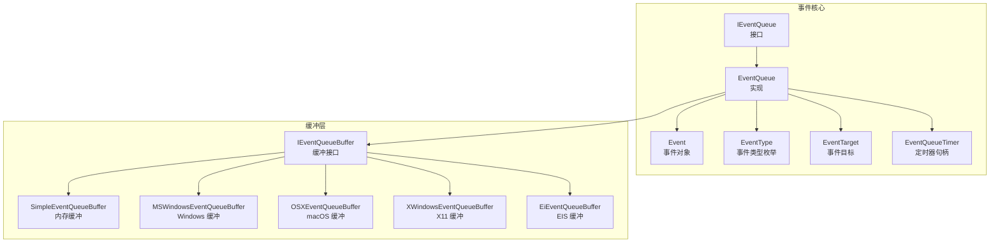
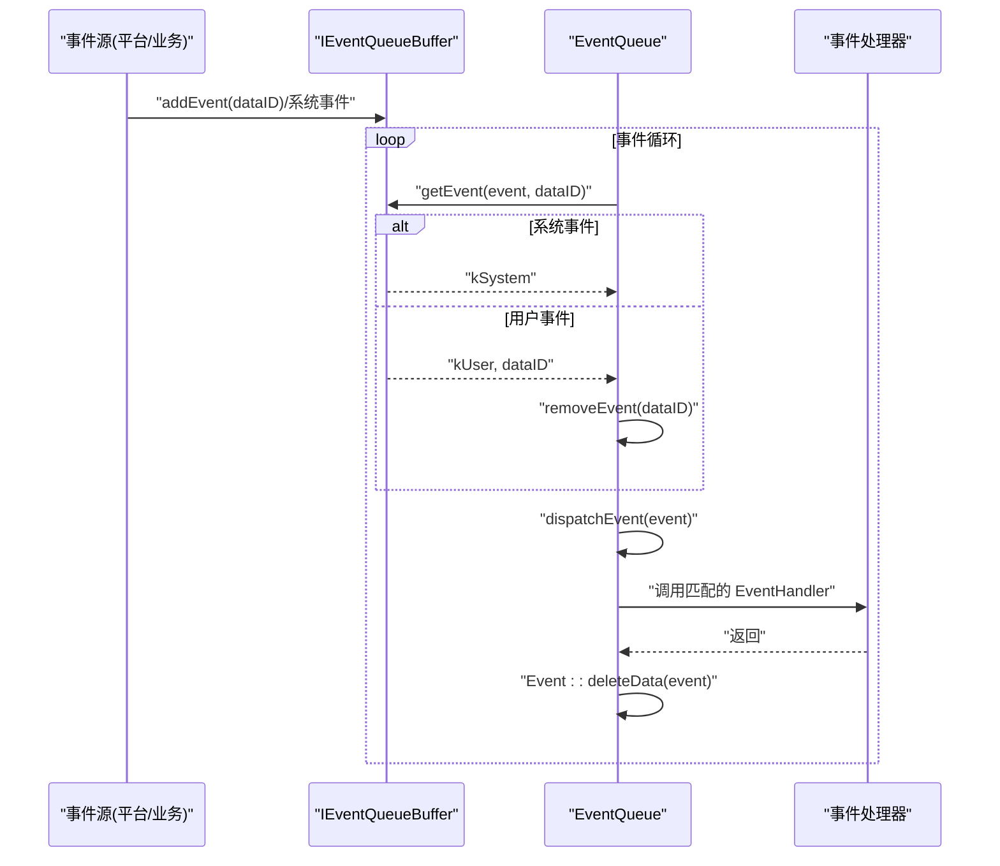
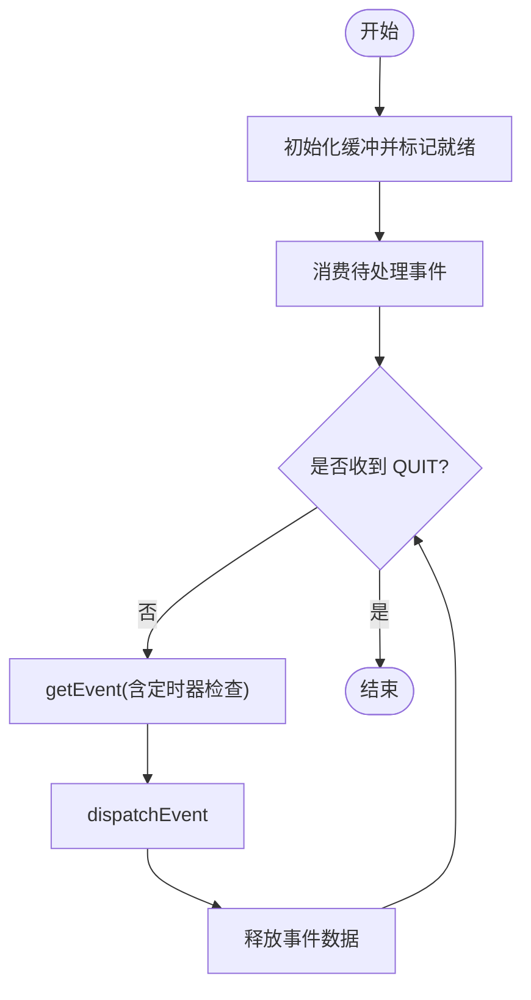
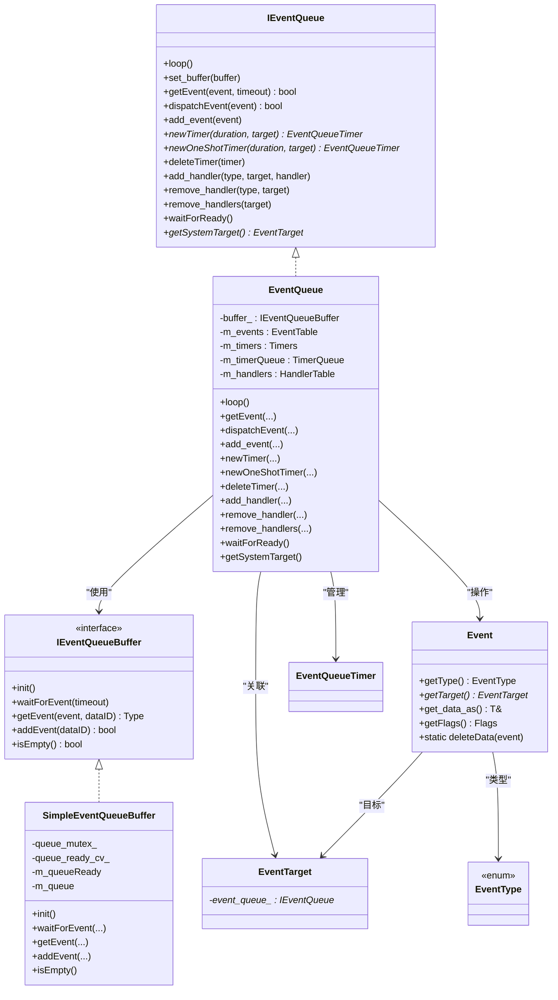
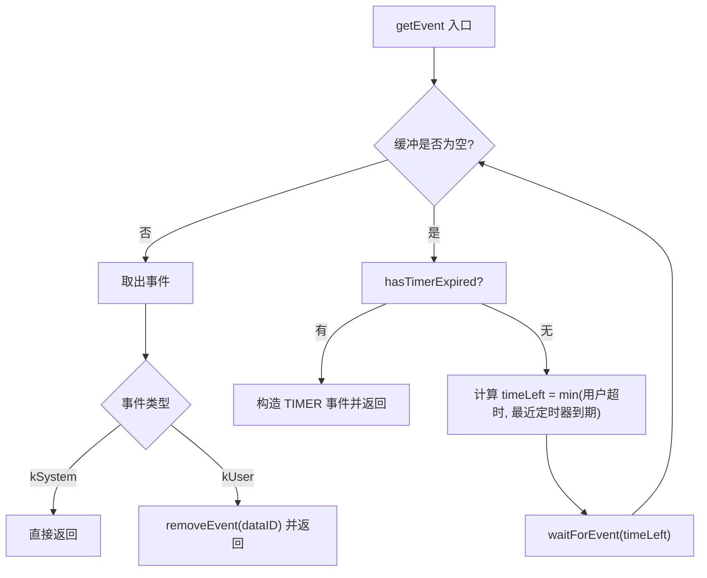
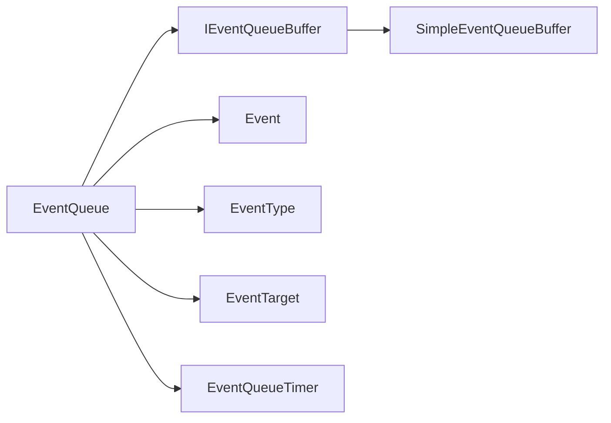

# 事件分发接口

<cite>
**本文引用的文件**   
- [EventQueue.h](file://src/lib/base/EventQueue.h)
- [EventQueue.cpp](file://src/lib/base/EventQueue.cpp)
- [IEventQueue.h](file://src/lib/base/IEventQueue.h)
- [IEventQueueBuffer.h](file://src/lib/base/IEventQueueBuffer.h)
- [SimpleEventQueueBuffer.h](file://src/lib/base/SimpleEventQueueBuffer.h)
- [EventTypes.h](file://src/lib/base/EventTypes.h)
- [Event.h](file://src/lib/base/Event.h)
- [EventTarget.h](file://src/lib/base/EventTarget.h)
- [EventQueueTimer.h](file://src/lib/base/EventQueueTimer.h)
- [Client.cpp](file://src/lib/client/Client.cpp)
</cite>

## 目录
1. [简介](#简介)
2. [项目结构](#项目结构)
3. [核心组件](#核心组件)
4. [架构总览](#架构总览)
5. [详细组件分析](#详细组件分析)
6. [依赖关系分析](#依赖关系分析)
7. [性能与并发特性](#性能与并发特性)
8. [故障排查指南](#故障排查指南)
9. [结论](#结论)
10. [附录：事件类型与数据结构](#附录事件类型与数据结构)

## 简介
本文件面向 Input Leap 的事件分发子系统，系统性阐述 EventQueue 事件队列系统的设计原理与编程接口。内容涵盖：
- 事件类型定义、事件创建、投递与处理机制
- 异步事件处理模型、事件优先级管理（定时器）
- 线程安全与事件循环实现细节
- 输入事件（键盘、鼠标、剪贴板等）在事件系统中的结构与使用方法
- 如何注册事件处理器、自定义事件类型、处理事件流并提供示例路径

## 项目结构
事件分发相关代码主要位于 base 层，采用“平台无关核心 + 平台特定缓冲”的分层设计：
- IEventQueue：事件队列抽象接口
- EventQueue：跨平台事件队列实现，负责事件调度、定时器、处理器注册、线程同步
- IEventQueueBuffer：平台无关的缓冲接口
- SimpleEventQueueBuffer：内存队列缓冲（测试/通用场景）
- 平台特定缓冲：MSWindowsEventQueueBuffer、OSXEventQueueBuffer、XWindowsEventQueueBuffer、EiEventQueueBuffer
- Event、EventTarget、EventType、EventQueueTimer：事件、目标、类型与定时器基础类型

图示来源
- [EventQueue.h:35-135](file://src/lib/base/EventQueue.h#L35-L135)
- [IEventQueue.h:28-175](file://src/lib/base/IEventQueue.h#L28-L175)
- [IEventQueueBuffer.h:24-86](file://src/lib/base/IEventQueueBuffer.h#L24-L86)
- [SimpleEventQueueBuffer.h:26-54](file://src/lib/base/SimpleEventQueueBuffer.h#L26-L54)
- [EventTypes.h:22-291](file://src/lib/base/EventTypes.h#L22-L291)
- [Event.h:30-153](file://src/lib/base/Event.h#L30-L153)
- [EventTarget.h:23-44](file://src/lib/base/EventTarget.h#L23-L44)
- [EventQueueTimer.h:22-30](file://src/lib/base/EventQueueTimer.h#L22-L30)

章节来源
- [EventQueue.h:35-135](file://src/lib/base/EventQueue.h#L35-L135)
- [IEventQueue.h:28-175](file://src/lib/base/IEventQueue.h#L28-L175)
- [IEventQueueBuffer.h:24-86](file://src/lib/base/IEventQueueBuffer.h#L24-L86)
- [SimpleEventQueueBuffer.h:26-54](file://src/lib/base/SimpleEventQueueBuffer.h#L26-L54)
- [EventTypes.h:22-291](file://src/lib/base/EventTypes.h#L22-L291)
- [Event.h:30-153](file://src/lib/base/Event.h#L30-L153)
- [EventTarget.h:23-44](file://src/lib/base/EventTarget.h#L23-L44)
- [EventQueueTimer.h:22-30](file://src/lib/base/EventQueueTimer.h#L22-L30)

## 核心组件
- IEventQueue：定义事件循环、事件获取/派发、定时器、处理器注册等统一接口
- EventQueue：具体实现，包含：
  - 事件表与 ID 复用，避免重复分配
  - 定时器优先队列（按剩余时间排序），支持周期与一次性定时器
  - 处理器映射（目标->类型->处理器），支持未知类型兜底
  - 线程安全：互斥锁保护共享状态；条件变量用于就绪通知
  - 信号中断集成：将 QUIT 事件入队以优雅退出
- IEventQueueBuffer：平台无关缓冲接口，封装等待/取事件/添加事件
- SimpleEventQueueBuffer：基于 deque 的内存缓冲，使用条件变量唤醒
- Event：可移动不可拷贝的事件对象，携带类型、目标、数据与标志位
- EventType：所有事件类型的集中定义（键盘、鼠标、剪贴板、网络、屏幕等）
- EventTarget：事件目标基类，持有指向所属 EventQueue 的指针，生命周期内自动注销
- EventQueueTimer：定时器句柄，继承自 EventTarget，可作为事件目标

章节来源
- [IEventQueue.h:28-175](file://src/lib/base/IEventQueue.h#L28-L175)
- [EventQueue.h:35-135](file://src/lib/base/EventQueue.h#L35-L135)
- [EventQueue.cpp:40-81](file://src/lib/base/EventQueue.cpp#L40-L81)
- [IEventQueueBuffer.h:24-86](file://src/lib/base/IEventQueueBuffer.h#L24-L86)
- [SimpleEventQueueBuffer.h:26-54](file://src/lib/base/SimpleEventQueueBuffer.h#L26-L54)
- [Event.h:30-153](file://src/lib/base/Event.h#L30-L153)
- [EventTypes.h:22-291](file://src/lib/base/EventTypes.h#L22-L291)
- [EventTarget.h:23-44](file://src/lib/base/EventTarget.h#L23-L44)
- [EventQueueTimer.h:22-30](file://src/lib/base/EventQueueTimer.h#L22-L30)

## 架构总览
事件从不同来源进入系统，经缓冲层聚合后由 EventQueue 统一调度：
- 系统事件：由平台缓冲直接产出（如窗口消息、X11/EIS 事件）
- 用户事件：通过 add_event 或 add_event_to_buffer 入队
- 定时器事件：由内部 Timer 优先队列驱动生成 TIMER 事件
- 派发：根据事件目标与类型查找处理器并调用；若无精确匹配则回退到 UNKNOWN 处理器

图示来源
- [EventQueue.cpp:58-81](file://src/lib/base/EventQueue.cpp#L58-L81)
- [EventQueue.cpp:110-167](file://src/lib/base/EventQueue.cpp#L110-L167)
- [EventQueue.cpp:169-186](file://src/lib/base/EventQueue.cpp#L169-L186)
- [IEventQueueBuffer.h:40-75](file://src/lib/base/IEventQueueBuffer.h#L40-L75)

## 详细组件分析

### EventQueue 设计与实现
- 事件循环 loop()
  - 初始化缓冲，标记就绪并通过条件变量通知 waitForReady()
  - 先消费 pending 队列中的预置事件
  - 主循环：getEvent -> dispatchEvent -> 释放数据 -> 继续
- 事件获取 getEvent(timeout)
  - 若缓冲为空，先检查是否有定时器到期
  - 计算实际超时：min(用户超时, 最近定时器到期时间)
  - 等待缓冲唤醒，取出事件并按类型分支处理
- 事件派发 dispatchEvent(target, type)
  - 优先查找精确类型处理器，否则回退到 UNKNOWN 处理器
- 事件投递 add_event(Event&&)
  - 过滤无效类型（UNKNOWN/SYSTEM/TIMER）
  - 若设置 kDeliverImmediately，立即派发并释放
  - 若尚未就绪，放入 m_pending；否则加入缓冲
- 事件存储 save_event/remove_event
  - 维护事件表与旧 ID 回收池，减少分配开销
- 定时器 newTimer/newOneShotTimer/deleteTimer
  - 使用 Stopwatch 累计时间，Timer 优先队列按剩余时间排序
  - 周期性定时器到期后重置并重新入队；一次性定时器仅触发一次
- 处理器管理 add_handler/remove_handler/remove_handlers
  - 校验 EventTarget 归属同一 EventQueue
  - 删除处理器时清理空映射并复位 target.event_queue_
- 就绪等待 waitForReady()
  - 阻塞直到 is_ready_ 为真，防止过早投递

图示来源
- [EventQueue.cpp:58-81](file://src/lib/base/EventQueue.cpp#L58-L81)
- [EventQueue.cpp:110-167](file://src/lib/base/EventQueue.cpp#L110-L167)
- [EventQueue.cpp:169-186](file://src/lib/base/EventQueue.cpp#L169-L186)
- [EventQueue.cpp:188-225](file://src/lib/base/EventQueue.cpp#L188-L225)
- [EventQueue.cpp:227-280](file://src/lib/base/EventQueue.cpp#L227-L280)
- [EventQueue.cpp:282-346](file://src/lib/base/EventQueue.cpp#L282-L346)
- [EventQueue.cpp:348-383](file://src/lib/base/EventQueue.cpp#L348-L383)
- [EventQueue.cpp:385-440](file://src/lib/base/EventQueue.cpp#L385-L440)
- [EventQueue.cpp:447-455](file://src/lib/base/EventQueue.cpp#L447-L455)

章节来源
- [EventQueue.cpp:40-81](file://src/lib/base/EventQueue.cpp#L40-L81)
- [EventQueue.cpp:110-167](file://src/lib/base/EventQueue.cpp#L110-L167)
- [EventQueue.cpp:169-186](file://src/lib/base/EventQueue.cpp#L169-L186)
- [EventQueue.cpp:188-225](file://src/lib/base/EventQueue.cpp#L188-L225)
- [EventQueue.cpp:227-280](file://src/lib/base/EventQueue.cpp#L227-L280)
- [EventQueue.cpp:282-346](file://src/lib/base/EventQueue.cpp#L282-L346)
- [EventQueue.cpp:348-383](file://src/lib/base/EventQueue.cpp#L348-L383)
- [EventQueue.cpp:385-440](file://src/lib/base/EventQueue.cpp#L385-L440)
- [EventQueue.cpp:447-455](file://src/lib/base/EventQueue.cpp#L447-L455)

### 事件类型与数据结构
- EventType：集中定义所有事件类型，包括：
  - 系统/定时器/退出
  - 客户端/服务器连接与消息
  - 套接字/流事件
  - 屏幕与输入事件（按键、按钮、移动、滚轮、热键、屏保）
  - 剪贴板事件（被抢占、变更、发送分片）
  - 文件传输事件（分片发送、接收完成、心跳）
- Event：事件载体
  - 成员：类型、目标、数据指针、标志位
  - 数据包装：EventData<T> 模板，提供 clone 与访问器
  - 标志位：kDeliverImmediately 表示立即派发并释放
- EventDataBase/EventData：多态数据容器，便于传递结构化事件载荷
- EventTarget：事件目标基类，持有 event_queue_ 指针，用于绑定与生命周期管理
- EventQueueTimer：定时器句柄，作为独立事件目标

图示来源
- [IEventQueue.h:28-175](file://src/lib/base/IEventQueue.h#L28-L175)
- [EventQueue.h:35-135](file://src/lib/base/EventQueue.h#L35-L135)
- [IEventQueueBuffer.h:24-86](file://src/lib/base/IEventQueueBuffer.h#L24-L86)
- [SimpleEventQueueBuffer.h:26-54](file://src/lib/base/SimpleEventQueueBuffer.h#L26-L54)
- [Event.h:30-153](file://src/lib/base/Event.h#L30-L153)
- [EventTarget.h:23-44](file://src/lib/base/EventTarget.h#L23-L44)
- [EventQueueTimer.h:22-30](file://src/lib/base/EventQueueTimer.h#L22-L30)
- [EventTypes.h:22-291](file://src/lib/base/EventTypes.h#L22-L291)

章节来源
- [EventTypes.h:22-291](file://src/lib/base/EventTypes.h#L22-L291)
- [Event.h:30-153](file://src/lib/base/Event.h#L30-L153)
- [EventTarget.h:23-44](file://src/lib/base/EventTarget.h#L23-L44)
- [EventQueueTimer.h:22-30](file://src/lib/base/EventQueueTimer.h#L22-L30)

### 异步事件处理模型与线程安全
- 异步模型
  - 平台缓冲在独立线程中收集系统事件，通过 addEvent 唤醒 EventQueue
  - EventQueue 在主循环中阻塞等待，保证单线程顺序处理，避免竞态
- 线程安全
  - 关键数据结构（事件表、定时器、处理器表）均受互斥锁保护
  - 就绪通知使用条件变量，避免忙等
  - 信号处理函数仅向队列追加 QUIT 事件，不直接操作复杂状态
- 事件优先级
  - 定时器事件具有最高优先级：当缓冲为空时优先检查定时器
  - 定时器按剩余时间排序，确保最早到期者先触发

章节来源
- [EventQueue.cpp:40-55](file://src/lib/base/EventQueue.cpp#L40-L55)
- [EventQueue.cpp:110-167](file://src/lib/base/EventQueue.cpp#L110-L167)
- [EventQueue.cpp:385-440](file://src/lib/base/EventQueue.cpp#L385-L440)
- [SimpleEventQueueBuffer.h:44-51](file://src/lib/base/SimpleEventQueueBuffer.h#L44-L51)

### 事件循环与定时器流程

图示来源
- [EventQueue.cpp:110-167](file://src/lib/base/EventQueue.cpp#L110-L167)
- [EventQueue.cpp:385-440](file://src/lib/base/EventQueue.cpp#L385-L440)

章节来源
- [EventQueue.cpp:110-167](file://src/lib/base/EventQueue.cpp#L110-L167)
- [EventQueue.cpp:385-440](file://src/lib/base/EventQueue.cpp#L385-L440)

### 事件处理器注册与回调
- 注册 add_handler(type, target, handler)
  - 校验 target 归属当前 EventQueue
  - 保存处理器引用，后续 dispatchEvent 按目标+类型查找
- 移除 remove_handler/remove_handlers
  - 清理映射，必要时清空 target.event_queue_
- 回调执行
  - 精确匹配优先，否则回退到 UNKNOWN 处理器
  - 处理器类型为 std::function<void(const Event&)>

章节来源
- [EventQueue.cpp:282-346](file://src/lib/base/EventQueue.cpp#L282-L346)
- [EventQueue.cpp:169-186](file://src/lib/base/EventQueue.cpp#L169-L186)
- [IEventQueue.h:133-152](file://src/lib/base/IEventQueue.h#L133-L152)

### 输入事件（键盘、鼠标、剪贴板）的使用方式
- 键盘事件
  - KEY_STATE_KEY_DOWN / KEY_STATE_KEY_UP / KEY_STATE_KEY_REPEAT
  - 事件数据为 KeyInfo（count==1 表示按下/抬起，重复事件携带计数）
- 鼠标事件
  - PRIMARY_SCREEN_BUTTON_DOWN / PRIMARY_SCREEN_BUTTON_UP
  - PRIMARY_SCREEN_MOTION_ON_PRIMARY / PRIMARY_SCREEN_MOTION_ON_SECONDARY
  - PRIMARY_SCREEN_WHEEL
  - 事件数据分别为 ButtonInfo、MotionInfo、WheelInfo
- 剪贴板事件
  - CLIPBOARD_GRABBED / CLIPBOARD_CHANGED / CLIPBOARD_SENDING
  - 事件数据为 ClipboardInfo 或相关分片信息
- 使用建议
  - 在对应 EventTarget 上注册相应 EventType 的处理器
  - 在处理器中通过 Event::get_data_as<T>() 获取结构化数据
  - 注意事件数据的生命周期由 EventQueue 管理，不要在处理器外长期持有原始指针

章节来源
- [EventTypes.h:202-287](file://src/lib/base/EventTypes.h#L202-L287)
- [Event.h:120-137](file://src/lib/base/Event.h#L120-L137)

### 事件创建与投递
- 创建事件
  - 使用 Event(type, target, data, flags) 构造
  - 数据通过 create_event_data<T>(...) 包装为 EventDataBase
- 投递事件
  - add_event(Event&&)：根据标志位决定是否立即派发或入缓冲
  - set_buffer(...)：替换底层缓冲，会丢弃未处理事件
- 系统事件
  - 由平台缓冲产出，类型为 SYSTEM，无需手动入队

章节来源
- [Event.h:75-85](file://src/lib/base/Event.h#L75-L85)
- [Event.h:53-57](file://src/lib/base/Event.h#L53-L57)
- [EventQueue.cpp:188-225](file://src/lib/base/EventQueue.cpp#L188-L225)
- [EventQueue.cpp:83-108](file://src/lib/base/EventQueue.cpp#L83-L108)

### 定时器 API 与用法
- newTimer(duration, target)：周期定时器
- newOneShotTimer(duration, target)：一次性定时器
- deleteTimer(timer)：销毁定时器
- 定时器事件数据为 TimerEvent，包含 m_timer 与 m_count（累积次数）

章节来源
- [IEventQueue.h:95-131](file://src/lib/base/IEventQueue.h#L95-L131)
- [EventQueue.cpp:227-280](file://src/lib/base/EventQueue.cpp#L227-L280)
- [EventQueue.cpp:385-440](file://src/lib/base/EventQueue.cpp#L385-L440)

### 事件处理代码示例（路径指引）
- 注册处理器
  - 参考：[Client.cpp:79-91](file://src/lib/client/Client.cpp#L79-L91)、[Client.cpp:442-468](file://src/lib/client/Client.cpp#L442-L468)
- 使用定时器
  - 参考：[Client.cpp:490-491](file://src/lib/client/Client.cpp#L490-L491)
- 处理系统/网络/屏幕事件
  - 参考：[Client.cpp:479-481](file://src/lib/client/Client.cpp#L479-L481)

## 依赖关系分析
- 模块耦合
  - EventQueue 强依赖 IEventQueueBuffer 抽象，松耦合平台实现
  - EventQueue 与 EventTarget/EventType/Event 紧密协作
- 外部依赖
  - 多线程原语：std::mutex、std::condition_variable
  - 计时：Stopwatch
  - 平台信号：Arch::setSignalHandler
- 潜在环依赖
  - 无直接循环导入；EventTarget 仅持有 IEventQueue 指针，EventQueue 持有 EventTarget 集合，通过方法调用解耦

图示来源
- [EventQueue.h:35-135](file://src/lib/base/EventQueue.h#L35-L135)
- [IEventQueueBuffer.h:24-86](file://src/lib/base/IEventQueueBuffer.h#L24-L86)
- [SimpleEventQueueBuffer.h:26-54](file://src/lib/base/SimpleEventQueueBuffer.h#L26-L54)
- [Event.h:30-153](file://src/lib/base/Event.h#L30-L153)
- [EventTypes.h:22-291](file://src/lib/base/EventTypes.h#L22-L291)
- [EventTarget.h:23-44](file://src/lib/base/EventTarget.h#L23-L44)
- [EventQueueTimer.h:22-30](file://src/lib/base/EventQueueTimer.h#L22-L30)

章节来源
- [EventQueue.h:35-135](file://src/lib/base/EventQueue.h#L35-L135)
- [IEventQueueBuffer.h:24-86](file://src/lib/base/IEventQueueBuffer.h#L24-L86)
- [SimpleEventQueueBuffer.h:26-54](file://src/lib/base/SimpleEventQueueBuffer.h#L26-L54)
- [Event.h:30-153](file://src/lib/base/Event.h#L30-L153)
- [EventTypes.h:22-291](file://src/lib/base/EventTypes.h#L22-L291)
- [EventTarget.h:23-44](file://src/lib/base/EventTarget.h#L23-L44)
- [EventQueueTimer.h:22-30](file://src/lib/base/EventQueueTimer.h#L22-L30)

## 性能与并发特性
- 事件存储优化
  - 事件 ID 复用池减少分配与哈希冲突
- 定时器调度
  - 优先队列保证 O(log N) 插入与最小堆顶 O(1) 查询
- 等待策略
  - 结合用户超时与最近定时器到期时间，避免频繁唤醒
- 线程安全
  - 细粒度互斥锁保护共享状态，条件变量降低 CPU 占用
- 建议
  - 批量事件合并：在高吞吐场景下尽量合并相近事件以减少派发开销
  - 处理器轻量化：避免在处理器中进行阻塞 IO，必要时转交后台任务

[本节为通用指导，不涉及具体文件分析]

## 故障排查指南
- 事件未到达处理器
  - 确认已正确注册 add_handler(type, target, handler)
  - 检查 EventTarget 是否属于当前 EventQueue
  - 确认事件类型是否正确，必要时注册 UNKNOWN 兜底处理器
- 定时器不触发
  - 检查 duration > 0
  - 确认未提前 deleteTimer
  - 观察 getNextTimerTimeout 返回值与 hasTimerExpired 逻辑
- 事件丢失
  - 检查 set_buffer 是否意外替换缓冲导致未处理事件被丢弃
  - 确认 add_event 的标志位与 is_ready_ 状态
- 死锁或卡顿
  - 避免在处理器中再次对 EventQueue 加锁
  - 避免在处理器中长时间阻塞

章节来源
- [EventQueue.cpp:83-108](file://src/lib/base/EventQueue.cpp#L83-L108)
- [EventQueue.cpp:282-346](file://src/lib/base/EventQueue.cpp#L282-L346)
- [EventQueue.cpp:385-440](file://src/lib/base/EventQueue.cpp#L385-L440)
- [EventQueue.cpp:188-225](file://src/lib/base/EventQueue.cpp#L188-L225)

## 结论
Input Leap 的事件分发系统以 IEventQueue 为核心，通过平台无关的缓冲抽象与跨平台的 EventQueue 实现，提供了稳定、可扩展且线程安全的事件处理框架。其优势在于：
- 清晰的层次与职责分离
- 灵活的处理器注册与回退机制
- 高效的定时器调度与等待策略
- 良好的线程安全与资源管理

在实际使用中，应遵循目标绑定、类型匹配、轻量处理器与合理超时等最佳实践，以获得高可靠与高性能的事件处理体验。

[本节为总结性内容，不涉及具体文件分析]

## 附录：事件类型与数据结构
- 事件类型分类
  - 系统与控制：UNKNOWN、QUIT、SYSTEM、TIMER
  - 客户端/服务器：CLIENT_*、SERVER_*、IPC_*、DATA_SOCKET_*、SOCKET_*
  - 屏幕与输入：PRIMARY_SCREEN_*、SCREEN_*、KEY_STATE_*
  - 剪贴板与文件：CLIPBOARD_*、FILE_*
- 事件数据
  - 使用 EventData<T> 包装，通过 Event::get_data_as<T>() 访问
  - 常见数据：KeyInfo、ButtonInfo、MotionInfo、WheelInfo、ClipboardInfo、TimerEvent 等

章节来源
- [EventTypes.h:22-291](file://src/lib/base/EventTypes.h#L22-L291)
- [Event.h:38-57](file://src/lib/base/Event.h#L38-L57)
- [Event.h:120-137](file://src/lib/base/Event.h#L120-L137)