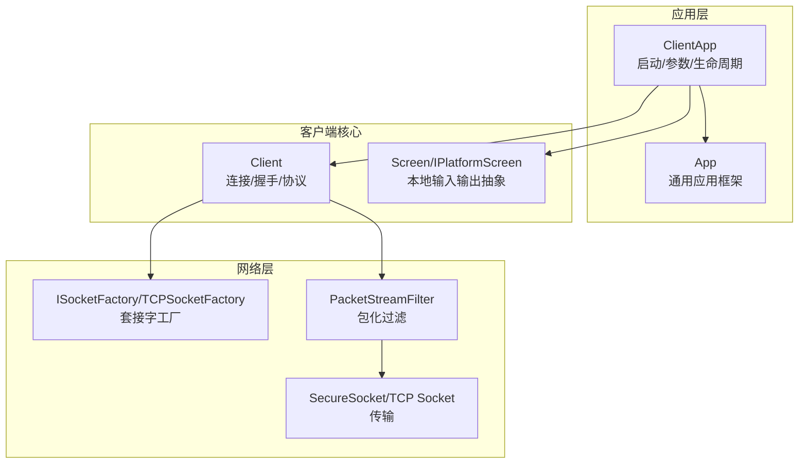
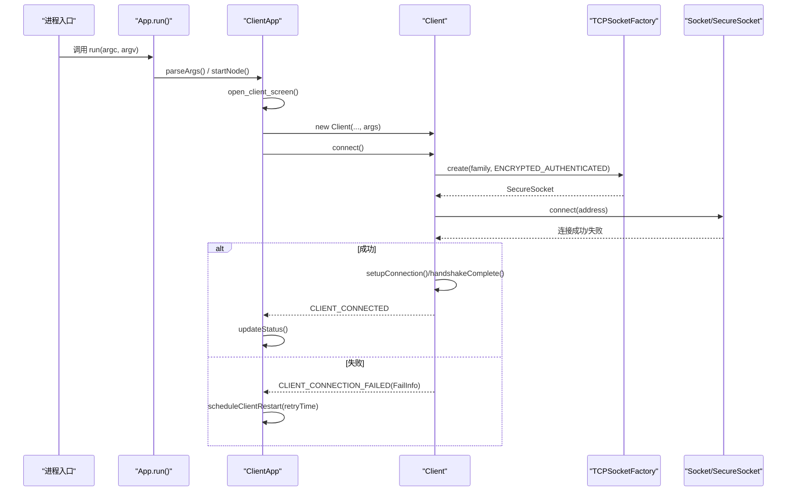
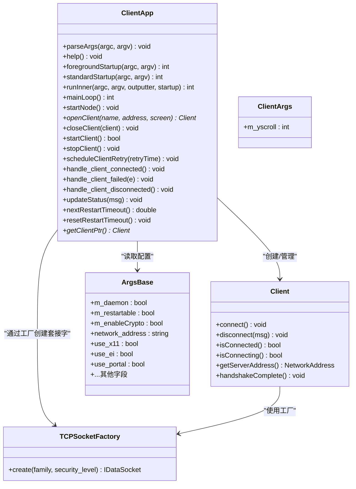
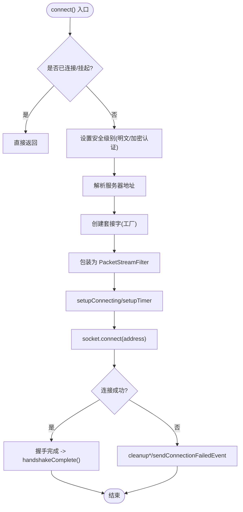
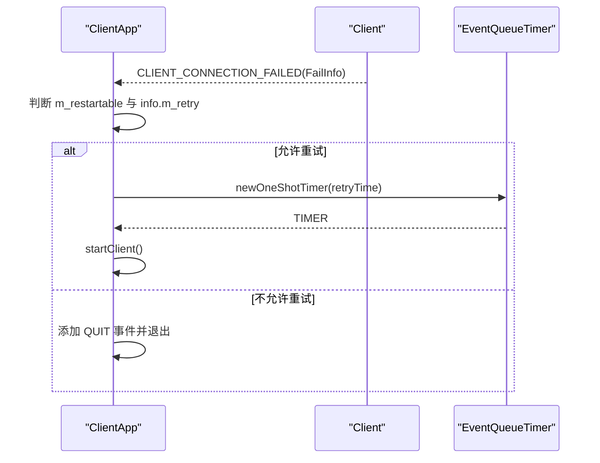
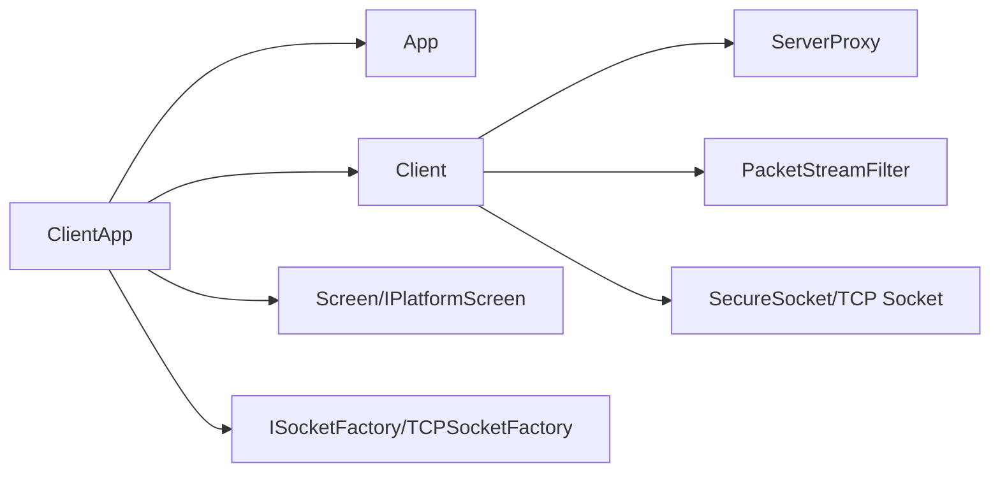

# 客户端应用接口

<cite>
**本文引用的文件**   
- [ClientApp.h](file://src/lib/inputleap/ClientApp.h)
- [ClientApp.cpp](file://src/lib/inputleap/ClientApp.cpp)
- [Client.h](file://src/lib/client/Client.h)
- [Client.cpp](file://src/lib/client/Client.cpp)
- [ArgsBase.h](file://src/lib/inputleap/ArgsBase.h)
- [ClientArgs.h](file://src/lib/inputleap/ClientArgs.h)
- [App.h](file://src/lib/inputleap/App.h)
- [App.cpp](file://src/lib/inputleap/App.cpp)
- [TCPSocketFactory.cpp](file://src/lib/net/TCPSocketFactory.cpp)
</cite>

## 目录
1. [简介](#简介)
2. [项目结构](#项目结构)
3. [核心组件](#核心组件)
4. [架构总览](#架构总览)
5. [详细组件分析](#详细组件分析)
6. [依赖关系分析](#依赖关系分析)
7. [性能考虑](#性能考虑)
8. [故障排查指南](#故障排查指南)
9. [结论](#结论)
10. [附录：集成示例与最佳实践](#附录：集成示例与最佳实践)

## 简介
本文件面向希望集成或扩展 Input Leap 客户端能力的开发者，聚焦于 ClientApp 类的编程接口与行为，涵盖以下主题：
- 客户端连接管理、重连机制与状态同步
- 客户端启动流程、连接建立过程、网络通信处理与异常恢复策略
- 客户端参数配置、连接参数设置与认证机制
- 客户端集成的代码示例（以“路径引用”形式提供）与错误处理建议

## 项目结构
Input Leap 的客户端实现位于 lib 层，关键入口为 ClientApp，负责解析参数、创建本地屏幕抽象、创建并管理 Client 实例、处理事件循环与重连。Client 负责与服务器握手、加密认证、数据收发与剪贴板/拖放等协议交互。

图表来源
- [ClientApp.h:31-85](file://src/lib/inputleap/ClientApp.h#L31-L85)
- [ClientApp.cpp:174-247](file://src/lib/inputleap/ClientApp.cpp#L174-L247)
- [Client.h:40-223](file://src/lib/client/Client.h#L40-L223)
- [Client.cpp:110-164](file://src/lib/client/Client.cpp#L110-L164)
- [TCPSocketFactory.cpp:41-53](file://src/lib/net/TCPSocketFactory.cpp#L41-L53)

章节来源
- [ClientApp.h:31-85](file://src/lib/inputleap/ClientApp.h#L31-L85)
- [ClientApp.cpp:174-247](file://src/lib/inputleap/ClientApp.cpp#L174-L247)
- [Client.h:40-223](file://src/lib/client/Client.h#L40-L223)
- [Client.cpp:110-164](file://src/lib/client/Client.cpp#L110-L164)
- [TCPSocketFactory.cpp:41-53](file://src/lib/net/TCPSocketFactory.cpp#L41-L53)

## 核心组件
- ClientApp：客户端应用控制器，负责参数解析、屏幕初始化、Client 生命周期管理、事件循环、重连调度与状态更新。
- Client：客户端协议栈顶层，负责连接建立、握手、加密认证、事件转发、剪贴板/拖放等。
- ArgsBase/ClientArgs：命令行与配置文件参数集合，包含网络地址、加密开关、平台后端选择等。
- App：通用应用框架，提供 run/daemonize/mainLoop 等统一入口。
- TCPSocketFactory：根据安全级别创建明文或加密套接字。

章节来源
- [ClientApp.h:31-85](file://src/lib/inputleap/ClientApp.h#L31-L85)
- [Client.h:40-223](file://src/lib/client/Client.h#L40-L223)
- [ArgsBase.h:25-57](file://src/lib/inputleap/ArgsBase.h#L25-L57)
- [ClientArgs.h:24-30](file://src/lib/inputleap/ClientArgs.h#L24-L30)
- [App.h:43-122](file://src/lib/inputleap/App.h#L43-L122)
- [TCPSocketFactory.cpp:41-53](file://src/lib/net/TCPSocketFactory.cpp#L41-L53)

## 架构总览
下图展示了从进程启动到建立加密连接的完整调用链，以及关键事件在 ClientApp 与 Client 之间的流转。

图表来源
- [App.cpp:105-124](file://src/lib/inputleap/App.cpp#L105-L124)
- [ClientApp.cpp:489-531](file://src/lib/inputleap/ClientApp.cpp#L489-L531)
- [ClientApp.cpp:363-405](file://src/lib/inputleap/ClientApp.cpp#L363-L405)
- [Client.cpp:110-164](file://src/lib/client/Client.cpp#L110-L164)
- [TCPSocketFactory.cpp:41-53](file://src/lib/net/TCPSocketFactory.cpp#L41-L53)

## 详细组件分析

### ClientApp 类接口与职责
- 启动与运行
  - foregroundStartup/standardStartup/runInner：统一入口，支持前台/后台模式与守护进程化。
  - mainLoop：创建 SocketMultiplexer，启动节点，可选 IPC 客户端，进入事件循环，退出时清理。
- 参数解析与帮助
  - parseArgs：解析客户端参数，保存服务器地址，必要时进行 DNS 解析与端口校验。
  - help：打印客户端专用帮助信息。
- 屏幕与平台抽象
  - create_screen/create_platform_screen：按平台创建 IPlatformScreen 并包装为 Screen；可附加日志包装器。
- 客户端生命周期
  - openClient/closeClient：创建/销毁 Client，注册/注销连接相关事件处理器。
  - startClient/stopClient：启动/停止当前客户端连接；封装了屏幕不可用等异常的恢复逻辑。
- 重连与状态
  - scheduleClientRestart/handle_client_restart：基于定时器重试连接。
  - handle_client_connected/failed/disconnected：处理连接状态变化并更新任务栏状态。
  - nextRestartTimeout/resetRestartTimeout：控制重试间隔（当前固定常数）。
- 事件与通知
  - updateStatus：通过 TaskBarReceiver 更新 UI 状态。

图表来源
- [ClientApp.h:31-85](file://src/lib/inputleap/ClientApp.h#L31-L85)
- [ClientApp.cpp:81-110](file://src/lib/inputleap/ClientApp.cpp#L81-L110)
- [ClientApp.cpp:363-405](file://src/lib/inputleap/ClientApp.cpp#L363-L405)
- [Client.h:40-223](file://src/lib/client/Client.h#L40-L223)
- [ArgsBase.h:25-57](file://src/lib/inputleap/ArgsBase.h#L25-L57)
- [ClientArgs.h:24-30](file://src/lib/inputleap/ClientArgs.h#L24-L30)
- [TCPSocketFactory.cpp:41-53](file://src/lib/net/TCPSocketFactory.cpp#L41-L53)

章节来源
- [ClientApp.h:31-85](file://src/lib/inputleap/ClientApp.h#L31-L85)
- [ClientApp.cpp:81-110](file://src/lib/inputleap/ClientApp.cpp#L81-L110)
- [ClientApp.cpp:363-405](file://src/lib/inputleap/ClientApp.cpp#L363-L405)
- [Client.h:40-223](file://src/lib/client/Client.h#L40-L223)
- [ArgsBase.h:25-57](file://src/lib/inputleap/ArgsBase.h#L25-L57)
- [ClientArgs.h:24-30](file://src/lib/inputleap/ClientArgs.h#L24-L30)
- [TCPSocketFactory.cpp:41-53](file://src/lib/net/TCPSocketFactory.cpp#L41-L53)

### Client 连接与握手流程
- 连接建立
  - connect：若已连接或挂起则直接返回；否则根据 m_useSecureNetwork 决定安全级别，解析地址，创建套接字，安装计时器与连接中状态，发起异步连接。
- 握手完成
  - handshakeComplete：标记 ready，启用本地屏幕，发出 CLIENT_CONNECTED 事件。
- 断开与失败
  - disconnect：清理资源并发送断开或失败事件。
  - 内部失败路径：捕获 XBase 异常后清理并上报失败。

图表来源
- [Client.cpp:110-164](file://src/lib/client/Client.cpp#L110-L164)
- [Client.cpp:183-188](file://src/lib/client/Client.cpp#L183-L188)

章节来源
- [Client.cpp:110-164](file://src/lib/client/Client.cpp#L110-L164)
- [Client.cpp:183-188](file://src/lib/client/Client.cpp#L183-L188)

### 重连机制与状态同步
- 触发条件
  - 连接失败：CLIENT_CONNECTION_FAILED 携带 FailInfo（含是否可重试标志）。
  - 连接断开：CLIENT_DISCONNECTED。
- 策略
  - 若 args().m_restartable 为真且允许重试，则通过 scheduleClientRestart(nextRestartTimeout()) 定时重试；否则退出。
  - 当前重试间隔为固定值（常量 RETRY_TIME），可在需要时改为指数退避。
- 状态同步
  - 连接成功：重置重试时间，更新任务栏状态。
  - 连接失败/断开：记录日志，必要时更新 UI 提示。

图表来源
- [ClientApp.cpp:282-310](file://src/lib/inputleap/ClientApp.cpp#L282-L310)
- [ClientApp.cpp:250-269](file://src/lib/inputleap/ClientApp.cpp#L250-L269)
- [ClientApp.cpp:207-227](file://src/lib/inputleap/ClientApp.cpp#L207-L227)

章节来源
- [ClientApp.cpp:282-310](file://src/lib/inputleap/ClientApp.cpp#L282-L310)
- [ClientApp.cpp:250-269](file://src/lib/inputleap/ClientApp.cpp#L250-L269)
- [ClientApp.cpp:207-227](file://src/lib/inputleap/ClientApp.cpp#L207-L227)

### 参数配置与连接参数
- 公共参数（ArgsBase）
  - 守护进程/重启能力/日志/显示后端/名称/拖放/IPC/加密开关/平台后端选择等。
- 客户端特有参数（ClientArgs）
  - 垂直滚动增量等。
- 关键影响点
  - network_address：目标服务器地址（主机名[:端口]），在 parseArgs 中解析并可延迟解析。
  - m_enableCrypto：决定是否使用加密认证连接。
  - use_x11/use_ei/use_portal：选择平台后端与 XDG portal 行为。

章节来源
- [ArgsBase.h:25-57](file://src/lib/inputleap/ArgsBase.h#L25-L57)
- [ClientArgs.h:24-30](file://src/lib/inputleap/ClientArgs.h#L24-L30)
- [ClientApp.cpp:81-110](file://src/lib/inputleap/ClientApp.cpp#L81-L110)

### 认证与安全
- 安全级别
  - 当 m_useSecureNetwork 为真时，Client 使用 ENCRYPTED_AUTHENTICATED 安全级别，客户端始终对服务器进行认证。
- 套接字创建
  - TCPSocketFactory::create 根据安全级别返回 SecureSocket 或普通 TCP Socket。
- 握手阶段
  - 连接成功后进入握手流程，完成后触发 CLIENT_CONNECTED。

章节来源
- [Client.cpp:120-124](file://src/lib/client/Client.cpp#L120-L124)
- [TCPSocketFactory.cpp:41-53](file://src/lib/net/TCPSocketFactory.cpp#L41-L53)
- [Client.cpp:183-188](file://src/lib/client/Client.cpp#L183-L188)

## 依赖关系分析
- ClientApp 依赖
  - App：继承自 App，复用通用应用框架。
  - Client：创建并管理客户端连接。
  - Screen/IPlatformScreen：本地输入输出抽象。
  - ISocketFactory/TCPSocketFactory：网络套接字工厂。
  - EventQueue/EventQueueTimer：事件与定时器。
- Client 依赖
  - ServerProxy：协议会话代理。
  - PacketStreamFilter：流式包化。
  - SecureSocket/TCP Socket：底层传输。

图表来源
- [ClientApp.h:31-85](file://src/lib/inputleap/ClientApp.h#L31-L85)
- [Client.h:40-223](file://src/lib/client/Client.h#L40-L223)
- [TCPSocketFactory.cpp:41-53](file://src/lib/net/TCPSocketFactory.cpp#L41-L53)

章节来源
- [ClientApp.h:31-85](file://src/lib/inputleap/ClientApp.h#L31-L85)
- [Client.h:40-223](file://src/lib/client/Client.h#L40-L223)
- [TCPSocketFactory.cpp:41-53](file://src/lib/net/TCPSocketFactory.cpp#L41-L53)

## 性能考虑
- 事件循环与线程
  - mainLoop 中创建 SocketMultiplexer 并在非 macOS 平台直接运行事件循环；macOS 下需等待 Carbon 循环就绪。
- 重试策略
  - 当前采用固定间隔重试，可根据业务场景改为指数退避以降低瞬时拥塞时的重试风暴。
- 日志与调试
  - 可通过日志级别与文件输出定位问题；注意高日志级别可能带来额外开销。

[本节为通用指导，不直接分析具体文件]

## 故障排查指南
- 常见错误与处理
  - 屏幕不可用：startClient 捕获 XScreenUnavailable，记录警告并安排重试（若允许）。
  - 打开屏幕失败：捕获 XScreenOpenFailure/XBase，记录严重错误并终止。
  - 连接失败：CLIENT_CONNECTION_FAILED 携带 FailInfo，根据 m_restartable 与 info.m_retry 决定是否重试或退出。
  - 断开连接：CLIENT_DISCONNECTED，若允许则自动重试。
- 诊断要点
  - 检查 network_address 是否正确，DNS 解析是否成功。
  - 确认 m_enableCrypto 与服务器端配置一致。
  - 查看日志输出，关注连接尝试、握手结果与错误码。

章节来源
- [ClientApp.cpp:363-405](file://src/lib/inputleap/ClientApp.cpp#L363-L405)
- [ClientApp.cpp:282-310](file://src/lib/inputleap/ClientApp.cpp#L282-L310)
- [Client.cpp:156-164](file://src/lib/client/Client.cpp#L156-L164)

## 结论
ClientApp 作为客户端应用的控制器，提供了完整的启动、参数解析、屏幕初始化、连接管理与重连机制；Client 负责与服务器端的握手与协议交互，并通过工厂模式灵活选择明文或加密通道。结合 ArgsBase/ClientArgs 的配置项，用户可便捷地定制行为以满足不同部署环境的需求。

[本节为总结性内容，不直接分析具体文件]

## 附录：集成示例与最佳实践
- 创建与启动客户端实例
  - 参考路径：[ClientApp.cpp:489-531](file://src/lib/inputleap/ClientApp.cpp#L489-L531)、[ClientApp.cpp:363-405](file://src/lib/inputleap/ClientApp.cpp#L363-L405)
- 配置连接参数与加密
  - 参考路径：[ArgsBase.h:25-57](file://src/lib/inputleap/ArgsBase.h#L25-L57)、[Client.cpp:120-124](file://src/lib/client/Client.cpp#L120-L124)
- 监听连接状态变化
  - 参考路径：[ClientApp.cpp:312-337](file://src/lib/inputleap/ClientApp.cpp#L312-L337)、[Client.cpp:183-188](file://src/lib/client/Client.cpp#L183-L188)
- 处理重连与超时
  - 参考路径：[ClientApp.cpp:250-269](file://src/lib/inputleap/ClientApp.cpp#L250-L269)、[ClientApp.cpp:207-227](file://src/lib/inputleap/ClientApp.cpp#L207-L227)
- 平台后端选择
  - 参考路径：[ClientApp.cpp:533-554](file://src/lib/inputleap/ClientApp.cpp#L533-L554)

章节来源
- [ClientApp.cpp:489-531](file://src/lib/inputleap/ClientApp.cpp#L489-L531)
- [ClientApp.cpp:363-405](file://src/lib/inputleap/ClientApp.cpp#L363-L405)
- [ArgsBase.h:25-57](file://src/lib/inputleap/ArgsBase.h#L25-L57)
- [Client.cpp:120-124](file://src/lib/client/Client.cpp#L120-L124)
- [ClientApp.cpp:312-337](file://src/lib/inputleap/ClientApp.cpp#L312-L337)
- [Client.cpp:183-188](file://src/lib/client/Client.cpp#L183-L188)
- [ClientApp.cpp:250-269](file://src/lib/inputleap/ClientApp.cpp#L250-L269)
- [ClientApp.cpp:207-227](file://src/lib/inputleap/ClientApp.cpp#L207-L227)
- [ClientApp.cpp:533-554](file://src/lib/inputleap/ClientApp.cpp#L533-L554)