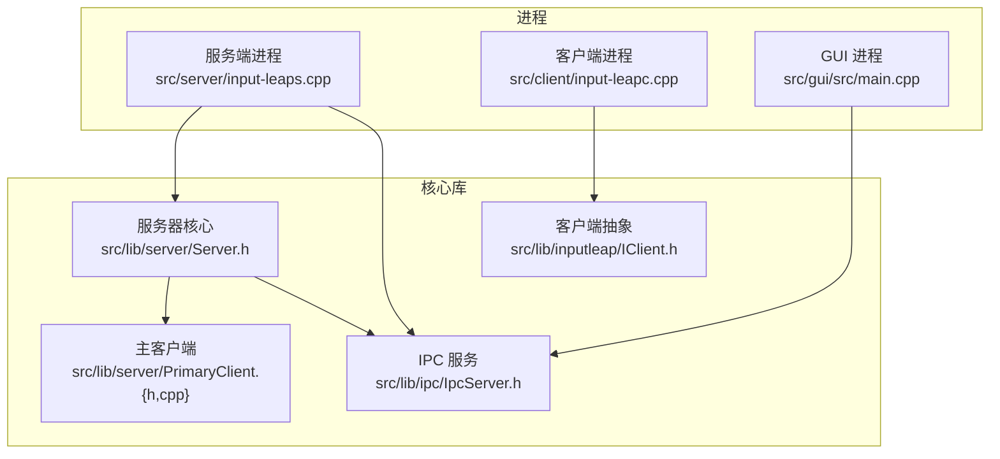
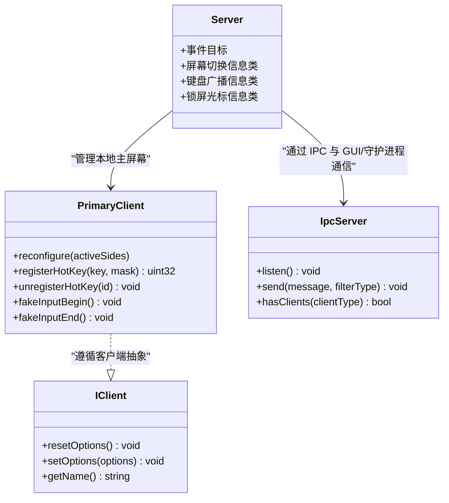
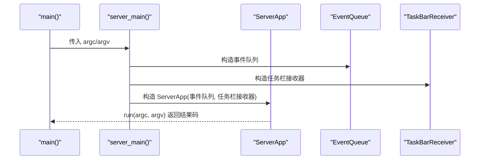
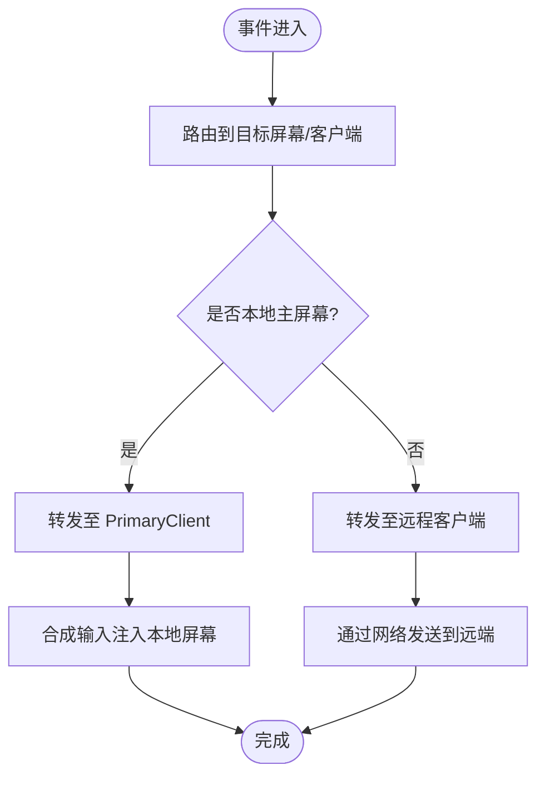
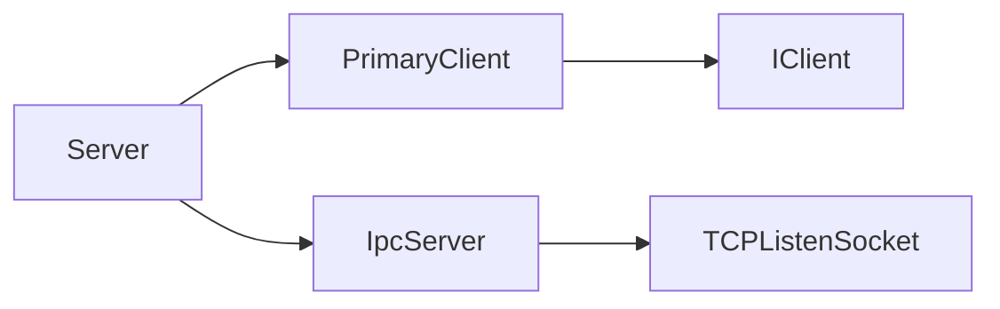

# 服务器客户端接口

<cite>
**本文引用的文件**   
- [README.md](file://README.md)
- [src/server/input-leaps.cpp](file://src/server/input-leaps.cpp)
- [src/lib/server/Server.h](file://src/lib/server/Server.h)
- [src/lib/server/PrimaryClient.h](file://src/lib/server/PrimaryClient.h)
- [src/lib/server/PrimaryClient.cpp](file://src/lib/server/PrimaryClient.cpp)
- [src/lib/inputleap/IClient.h](file://src/lib/inputleap/IClient.h)
- [src/lib/ipc/IpcServer.h](file://src/lib/ipc/IpcServer.h)
</cite>

## 目录
1. [简介](#简介)
2. [项目结构](#项目结构)
3. [核心组件](#核心组件)
4. [架构总览](#架构总览)
5. [详细组件分析](#详细组件分析)
6. [依赖关系分析](#依赖关系分析)
7. [性能考虑](#性能考虑)
8. [故障排查指南](#故障排查指南)
9. [结论](#结论)
10. [附录](#附录)

## 简介
本文件面向希望集成 Input Leap 的开发者，聚焦于“服务器端”和“客户端”编程接口的技术说明。内容覆盖：
- Server 服务器管理类的职责与关键 API
- Client 客户端抽象接口 IClient 的能力边界
- PrimaryClient 主客户端（本地屏幕）的扩展能力
- IPC 通信服务 IpcServer 的连接管理与消息分发
- 服务器启动流程、客户端连接生命周期、事件分发机制
- 配置参数、回调与事件监听的使用要点
- 错误处理与状态同步建议

## 项目结构
Input Leap 采用分层组织方式：
- src/server: 服务端可执行程序入口与平台任务栏集成
- src/client: 客户端可执行程序入口与平台任务栏集成
- src/gui: Qt GUI 应用（用于配置与可视化）
- src/lib: 核心库，包含 server、client、inputleap、ipc、net、base 等模块
- src/test: 单元测试与集成测试

下图展示与本文相关的顶层结构与入口点映射：

图表来源
- [src/server/input-leaps.cpp:39-70](file://src/server/input-leaps.cpp#L39-L70)
- [src/lib/server/Server.h:40-96](file://src/lib/server/Server.h#L40-L96)
- [src/lib/server/PrimaryClient.h:39-87](file://src/lib/server/PrimaryClient.h#L39-L87)
- [src/lib/server/PrimaryClient.cpp:1-47](file://src/lib/server/PrimaryClient.cpp#L1-L47)
- [src/lib/inputleap/IClient.h:144-171](file://src/lib/inputleap/IClient.h#L144-L171)
- [src/lib/ipc/IpcServer.h:40-93](file://src/lib/ipc/IpcServer.h#L40-L93)

章节来源
- [README.md:1-157](file://README.md#L1-L157)
- [src/server/input-leaps.cpp:39-70](file://src/server/input-leaps.cpp#L39-L70)

## 核心组件
本节概述各核心组件的职责与对外暴露的关键接口，便于快速定位 API 位置与使用方式。

- Server（服务器管理类）
  - 职责：实现服务器侧的核心算法，协调输入事件路由、屏幕切换、剪贴板同步、热键注册等。
  - 关键类型/信息对象：LockCursorToScreenInfo、SwitchToScreenInfo、SwitchInDirectionInfo、ScreenConnectedInfo、KeyboardBroadcastInfo 等，用于封装控制命令或事件数据。
  - 事件目标：继承 EventTarget，支持事件订阅与分发。
  - 参考路径：[src/lib/server/Server.h:40-96](file://src/lib/server/Server.h#L40-L96)

- PrimaryClient（主客户端）
  - 职责：代表本地“主屏幕”的客户端代理，负责将系统输入注入到本地屏幕，并屏蔽自身合成的输入以避免回环。
  - 关键能力：reconfigure、registerHotKey/unregisterHotKey、fakeInputBegin/fakeInputEnd 等。
  - 参考路径：
    - [src/lib/server/PrimaryClient.h:39-87](file://src/lib/server/PrimaryClient.h#L39-L87)
    - [src/lib/server/PrimaryClient.cpp:1-47](file://src/lib/server/PrimaryClient.cpp#L1-L47)

- IClient（客户端抽象接口）
  - 职责：定义客户端通用能力，如选项重置/设置、获取名称等。
  - 关键方法：resetOptions、setOptions、getName。
  - 参考路径：[src/lib/inputleap/IClient.h:144-171](file://src/lib/inputleap/IClient.h#L144-L171)

- IpcServer（IPC 服务）
  - 职责：提供本地 TCP 套接字监听、客户端连接管理、按类型过滤的消息广播等，供 GUI 与守护进程/客户端/服务端之间通信。
  - 关键方法：listen、send、hasClients。
  - 参考路径：[src/lib/ipc/IpcServer.h:40-93](file://src/lib/ipc/IpcServer.h#L40-L93)

章节来源
- [src/lib/server/Server.h:40-96](file://src/lib/server/Server.h#L40-L96)
- [src/lib/server/PrimaryClient.h:39-87](file://src/lib/server/PrimaryClient.h#L39-L87)
- [src/lib/server/PrimaryClient.cpp:1-47](file://src/lib/server/PrimaryClient.cpp#L1-L47)
- [src/lib/inputleap/IClient.h:144-171](file://src/lib/inputleap/IClient.h#L144-L171)
- [src/lib/ipc/IpcServer.h:40-93](file://src/lib/ipc/IpcServer.h#L40-L93)

## 架构总览
下图展示了服务端进程启动后，Server 与 PrimaryClient、IPC 服务的交互关系，以及事件在系统中的流向。

图表来源
- [src/lib/server/Server.h:40-96](file://src/lib/server/Server.h#L40-L96)
- [src/lib/server/PrimaryClient.h:39-87](file://src/lib/server/PrimaryClient.h#L39-L87)
- [src/lib/inputleap/IClient.h:144-171](file://src/lib/inputleap/IClient.h#L144-L171)
- [src/lib/ipc/IpcServer.h:40-93](file://src/lib/ipc/IpcServer.h#L40-L93)

## 详细组件分析

### Server 服务器管理类
- 角色与职责
  - 作为服务器侧的顶层控制器，负责协调输入事件路由、屏幕切换、剪贴板同步、热键注册等。
  - 通过事件目标机制参与事件循环，接收来自底层平台的事件并进行分发。
- 关键数据结构
  - LockCursorToScreenInfo：封装“锁定光标到屏幕”的状态开关。
  - SwitchToScreenInfo：封装“切换到指定屏幕”的目标名。
  - SwitchInDirectionInfo：封装“按方向切换屏幕”的方向枚举。
  - ScreenConnectedInfo：封装“某屏幕已连接”的通知数据。
  - KeyboardBroadcastInfo：封装“键盘广播开关”的状态。
- 典型用法
  - 在服务器启动后，创建并运行 Server 实例；根据配置加载屏幕布局、注册热键、初始化网络监听。
  - 当收到客户端连接或断开时，更新内部状态并触发相应事件。
  - 对本地主屏幕的操作委托给 PrimaryClient。
- 参考路径
  - [src/lib/server/Server.h:40-96](file://src/lib/server/Server.h#L40-L96)

章节来源
- [src/lib/server/Server.h:40-96](file://src/lib/server/Server.h#L40-L96)

### PrimaryClient 主客户端
- 角色与职责
  - 表示本地主屏幕的客户端代理，负责将合成输入注入本地屏幕，同时避免自身合成输入被再次捕获形成回环。
- 关键能力
  - reconfigure：根据激活的跳转边重新配置屏幕跳转区域。
  - registerHotKey/unregisterHotKey：注册/注销系统级热键。
  - fakeInputBegin/fakeInputEnd：成对调用以标记一段“合成输入”区间，确保不被当作用户输入再次处理。
- 参考路径
  - [src/lib/server/PrimaryClient.h:39-87](file://src/lib/server/PrimaryClient.h#L39-L87)
  - [src/lib/server/PrimaryClient.cpp:1-47](file://src/lib/server/PrimaryClient.cpp#L1-L47)

章节来源
- [src/lib/server/PrimaryClient.h:39-87](file://src/lib/server/PrimaryClient.h#L39-L87)
- [src/lib/server/PrimaryClient.cpp:1-47](file://src/lib/server/PrimaryClient.cpp#L1-L47)

### IClient 客户端抽象接口
- 角色与职责
  - 定义所有客户端（包括远程客户端与本地主客户端）应实现的通用能力。
- 关键方法
  - resetOptions：将所有选项重置为默认值。
  - setOptions：按给定选项进行增量设置，忽略未知项。
  - getName：返回客户端名称。
- 参考路径
  - [src/lib/inputleap/IClient.h:144-171](file://src/lib/inputleap/IClient.h#L144-L171)

章节来源
- [src/lib/inputleap/IClient.h:144-171](file://src/lib/inputleap/IClient.h#L144-L171)

### IpcServer IPC 服务
- 角色与职责
  - 提供本地 TCP 监听，管理客户端连接，支持按客户端类型过滤的消息广播，常用于 GUI 与守护进程/客户端/服务端之间的日志与控制通道。
- 关键方法
  - listen：开启仅允许本地连接的 TCP 监听。
  - send：向匹配过滤器类型的客户端发送消息。
  - hasClients：查询是否存在指定类型的已连接客户端。
- 参考路径
  - [src/lib/ipc/IpcServer.h:40-93](file://src/lib/ipc/IpcServer.h#L40-L93)

章节来源
- [src/lib/ipc/IpcServer.h:40-93](file://src/lib/ipc/IpcServer.h#L40-L93)

### 服务器启动流程（序列图）
下图描述服务端进程的启动过程，从 main 到 ServerApp 的运行，再到事件循环与监听器的初始化。

图表来源
- [src/server/input-leaps.cpp:39-70](file://src/server/input-leaps.cpp#L39-L70)

章节来源
- [src/server/input-leaps.cpp:39-70](file://src/server/input-leaps.cpp#L39-L70)

### 事件分发机制（流程图）
以下流程图概括了输入事件从平台层进入 Server，再分发到对应客户端或本地主屏幕的基本路径。

[此图为概念性流程，不直接映射具体源码文件]

## 依赖关系分析
- 组件耦合
  - Server 依赖 PrimaryClient 以操作本地主屏幕，并通过 IpcServer 与外部进程通信。
  - PrimaryClient 遵循 IClient 抽象，具备统一的选项管理与命名访问能力。
  - IpcServer 独立于业务逻辑，专注于本地 IPC 连接与消息分发。
- 外部依赖
  - 事件系统：EventTarget/IEventQueue 贯穿 Server 与 IpcServer。
  - 网络栈：TCPListenSocket、SocketMultiplexer 由 IpcServer 使用。
- 潜在循环依赖
  - 当前设计通过接口解耦（IClient），降低循环依赖风险。

图表来源
- [src/lib/server/Server.h:40-96](file://src/lib/server/Server.h#L40-L96)
- [src/lib/server/PrimaryClient.h:39-87](file://src/lib/server/PrimaryClient.h#L39-L87)
- [src/lib/inputleap/IClient.h:144-171](file://src/lib/inputleap/IClient.h#L144-L171)
- [src/lib/ipc/IpcServer.h:40-93](file://src/lib/ipc/IpcServer.h#L40-L93)

章节来源
- [src/lib/server/Server.h:40-96](file://src/lib/server/Server.h#L40-L96)
- [src/lib/server/PrimaryClient.h:39-87](file://src/lib/server/PrimaryClient.h#L39-L87)
- [src/lib/inputleap/IClient.h:144-171](file://src/lib/inputleap/IClient.h#L144-L171)
- [src/lib/ipc/IpcServer.h:40-93](file://src/lib/ipc/IpcServer.h#L40-L93)

## 性能考虑
- 事件循环与线程模型
  - 事件驱动架构下，应避免在事件回调中执行耗时操作，必要时将工作卸载到后台线程。
- 网络与 IPC
  - 合理设置消息批处理与节流策略，减少频繁小消息带来的开销。
  - 使用 IpcServer 的过滤器类型广播，避免不必要的消息复制与分发。
- 输入合成
  - 使用 PrimaryClient 的合成输入边界（fakeInputBegin/fakeInputEnd）包裹批量合成，减少重复检测与回环判断成本。

[本节为通用指导，不直接分析具体文件]

## 故障排查指南
- 常见问题定位
  - 无法建立 IPC 连接：检查 IpcServer::listen 是否成功、端口占用情况、防火墙策略。
  - 客户端未收到消息：确认 IpcServer::send 的过滤器类型是否与客户端类型一致。
  - 本地输入回环：确认合成输入区间是否正确配对 fakeInputBegin/fakeInputEnd。
- 日志与调试
  - 利用 IpcServer 的日志通道将关键事件输出到 GUI 或守护进程，便于追踪问题。
- 参考路径
  - [src/lib/ipc/IpcServer.h:40-93](file://src/lib/ipc/IpcServer.h#L40-L93)
  - [src/lib/server/PrimaryClient.cpp:1-47](file://src/lib/server/PrimaryClient.cpp#L1-L47)

章节来源
- [src/lib/ipc/IpcServer.h:40-93](file://src/lib/ipc/IpcServer.h#L40-L93)
- [src/lib/server/PrimaryClient.cpp:1-47](file://src/lib/server/PrimaryClient.cpp#L1-L47)

## 结论
Input Leap 的服务器与客户端接口围绕 Server、PrimaryClient、IClient 与 IpcServer 四大核心展开。通过清晰的分层与事件驱动模型，系统实现了跨机器的键盘鼠标共享与剪贴板同步。开发者在集成时应重点关注：
- 正确初始化 Server 与事件循环
- 使用 PrimaryClient 的安全合成输入边界
- 借助 IpcServer 进行可靠的本地通信
- 遵循 IClient 的选项管理与命名约定

[本节为总结性内容，不直接分析具体文件]

## 附录

### 配置与启动要点
- 命令行加载配置文件
  - 通过 --config <保存的配置路径> 启动以加载预设配置。
- 客户端配置服务器 IP
  - 若客户端“服务器 IP”字段为空，可在配置文件中显式添加 serverhostname 参数。
- 参考路径
  - [README.md:132-147](file://README.md#L132-L147)

章节来源
- [README.md:132-147](file://README.md#L132-L147)

### 示例：服务器端集成步骤（无代码）
- 初始化事件队列与日志
- 创建并运行 ServerApp
- 加载配置（屏幕布局、网络参数、热键等）
- 启动 IpcServer 监听本地连接
- 注册热键并启用服务器功能
- 在事件回调中处理客户端连接/断开与输入事件

章节来源
- [src/server/input-leaps.cpp:39-70](file://src/server/input-leaps.cpp#L39-L70)
- [src/lib/server/Server.h:40-96](file://src/lib/server/Server.h#L40-L96)
- [src/lib/ipc/IpcServer.h:40-93](file://src/lib/ipc/IpcServer.h#L40-L93)

### 示例：客户端集成步骤（无代码）
- 初始化事件队列与日志
- 创建客户端实例并实现 IClient 接口
- 设置服务器地址与必要选项（setOptions）
- 连接到服务器并加入事件循环
- 在回调中处理连接状态变化与输入事件

章节来源
- [src/lib/inputleap/IClient.h:144-171](file://src/lib/inputleap/IClient.h#L144-L171)