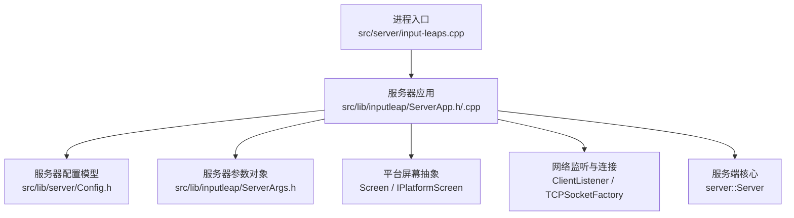
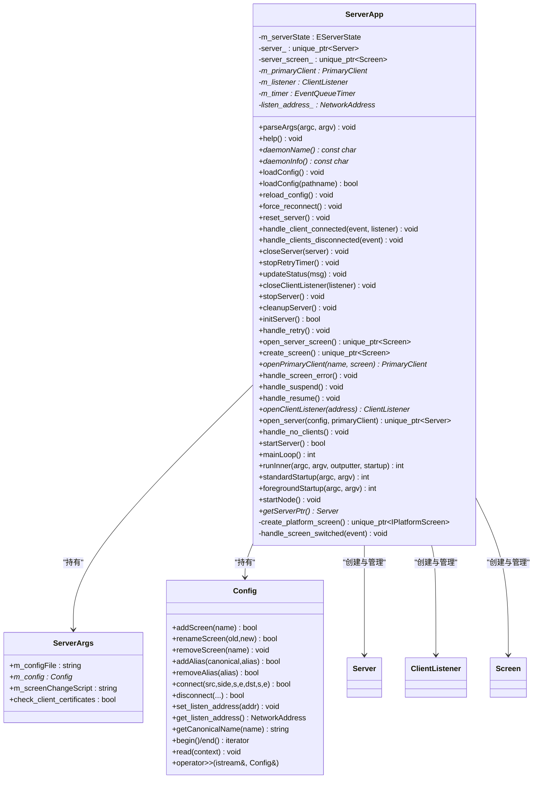
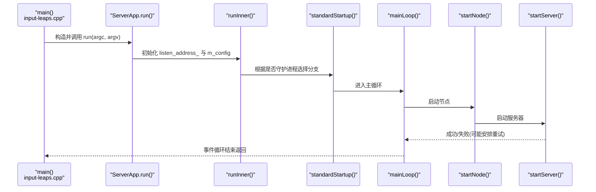
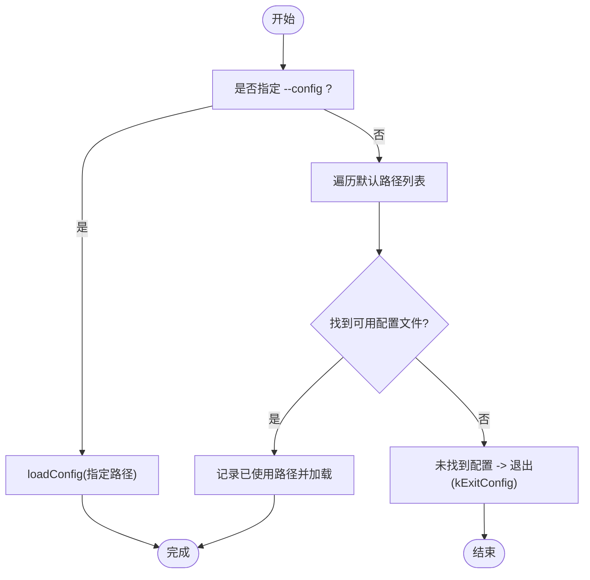
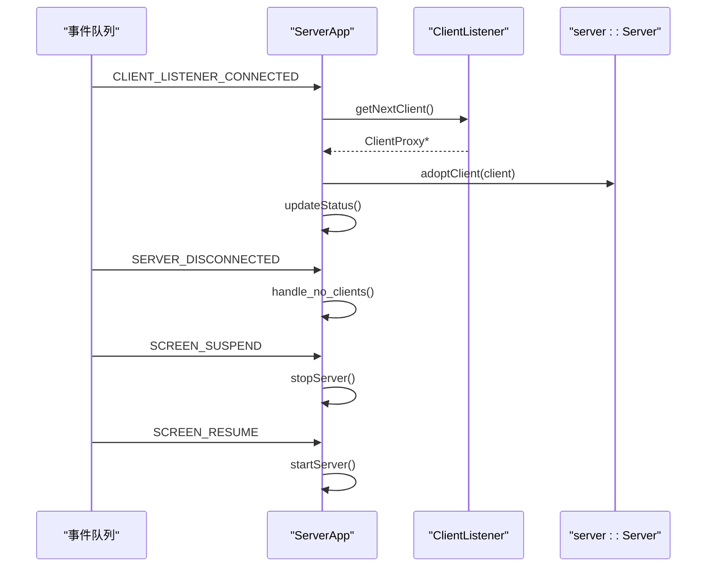
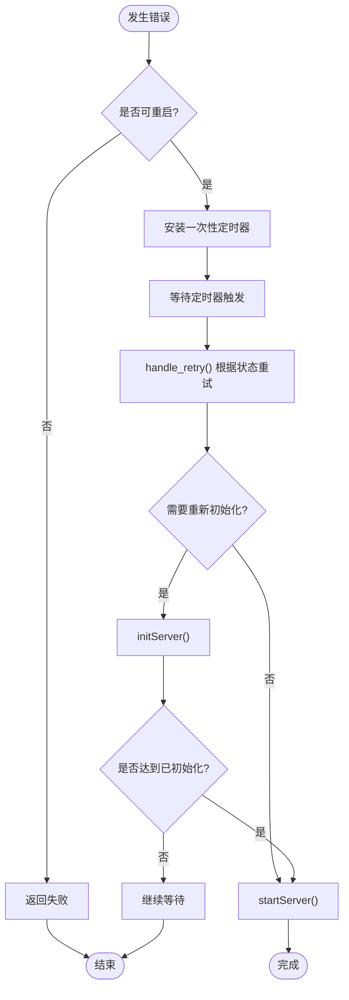
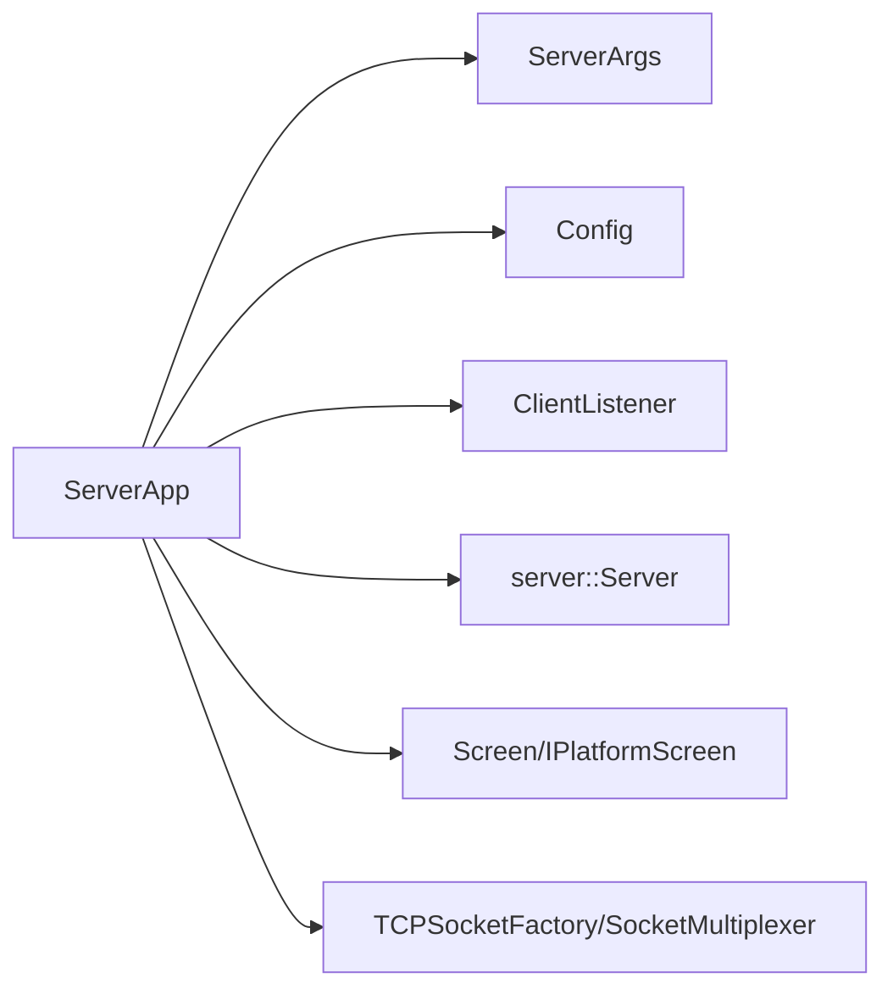

# 服务器应用接口

<cite>
**本文引用的文件**   
- [ServerApp.h](file://src/lib/inputleap/ServerApp.h)
- [ServerApp.cpp](file://src/lib/inputleap/ServerApp.cpp)
- [input-leaps.cpp](file://src/server/input-leaps.cpp)
- [ServerArgs.h](file://src/lib/inputleap/ServerArgs.h)
- [Config.h](file://src/lib/server/Config.h)
</cite>

## 目录
1. [简介](#简介)
2. [项目结构](#项目结构)
3. [核心组件](#核心组件)
4. [架构总览](#架构总览)
5. [详细组件分析](#详细组件分析)
6. [依赖关系分析](#依赖关系分析)
7. [性能考虑](#性能考虑)
8. [故障排查指南](#故障排查指南)
9. [结论](#结论)
10. [附录](#附录)

## 简介
本文件面向希望集成或扩展 Input Leap 服务器应用的开发者，聚焦 ServerApp 类的完整 API 与实现细节。内容涵盖：
- 服务器生命周期管理（初始化、启动、停止、清理）
- 配置加载与热重载
- 状态控制与事件处理机制
- 错误恢复策略（可重启模式下的重试）
- 参数解析、命令行选项与配置文件路径选择
- 集成示例与最佳实践（如何正确启动/停止实例、监听状态变化）

## 项目结构
Input Leap 的服务器进程入口位于 src/server，核心服务器应用逻辑位于 src/lib/inputleap，配置模型位于 src/lib/server。



图表来源
- [input-leaps.cpp:34-63](file://src/server/input-leaps.cpp#L34-L63)
- [ServerApp.h:48-117](file://src/lib/inputleap/ServerApp.h#L48-L117)
- [ServerApp.cpp:707-795](file://src/lib/inputleap/ServerApp.cpp#L707-L795)
- [Config.h:62-466](file://src/lib/server/Config.h#L62-L466)
- [ServerArgs.h:26-35](file://src/lib/inputleap/ServerArgs.h#L26-L35)

章节来源
- [input-leaps.cpp:34-63](file://src/server/input-leaps.cpp#L34-L63)
- [ServerApp.h:48-117](file://src/lib/inputleap/ServerApp.h#L48-L117)
- [ServerApp.cpp:707-795](file://src/lib/inputleap/ServerApp.cpp#L707-L795)
- [Config.h:62-466](file://src/lib/server/Config.h#L62-L466)
- [ServerArgs.h:26-35](file://src/lib/inputleap/ServerArgs.h#L26-L35)

## 核心组件
- ServerApp：服务器应用主类，负责参数解析、配置加载、生命周期管理、事件绑定、启动/停止、错误恢复等。
- Config：服务器配置模型，包含屏幕定义、别名、链接、监听地址、输入过滤规则等。
- ServerArgs：服务器专用参数对象，继承自通用参数基类，持有配置文件路径、屏幕切换脚本、证书校验开关等。
- 平台屏幕抽象：通过 create_platform_screen 创建具体平台的屏幕实现，并包装为 Screen 供上层使用。
- 网络监听与连接：ClientListener 基于 TCP 监听客户端连接，TCPSocketFactory 提供套接字工厂。
- server::Server：服务端核心，负责与客户端交互、屏幕切换、事件分发等。

章节来源
- [ServerApp.h:48-117](file://src/lib/inputleap/ServerApp.h#L48-L117)
- [ServerApp.cpp:707-795](file://src/lib/inputleap/ServerApp.cpp#L707-L795)
- [Config.h:62-466](file://src/lib/server/Config.h#L62-L466)
- [ServerArgs.h:26-35](file://src/lib/inputleap/ServerArgs.h#L26-L35)

## 架构总览
下图展示了从进程入口到服务器运行主循环的关键调用链与组件交互。

```mermaid
sequenceDiagram
participant Main as "main()<br/>input-leaps.cpp"
participant App as "ServerApp<br/>ServerApp.cpp"
participant Loop as "mainLoop()<br/>ServerApp.cpp"
participant Node as "startNode()<br/>ServerApp.cpp"
participant Start as "startServer()<br/>ServerApp.cpp"
participant Listener as "openClientListener()<br/>ServerApp.cpp"
participant Srv as "open_server()<br/>ServerApp.cpp"
Main->>App : 构造并调用 run(argc, argv)
App->>App : runInner() 初始化 listen_address_ 与 args().m_config
App->>App : standardStartup()/foregroundStartup()
App->>Loop : mainLoop()
Loop->>Node : startNode()
Node->>Start : startServer()
Start->>Listener : openClientListener(address)
Start->>Srv : open_server(config, primaryClient)
Note over App,Srv : 注册事件处理器、更新状态、进入事件循环
```

图表来源
- [input-leaps.cpp:34-63](file://src/server/input-leaps.cpp#L34-L63)
- [ServerApp.cpp:806-830](file://src/lib/inputleap/ServerApp.cpp#L806-L830)
- [ServerApp.cpp:837-857](file://src/lib/inputleap/ServerApp.cpp#L837-L857)
- [ServerApp.cpp:707-795](file://src/lib/inputleap/ServerApp.cpp#L707-L795)
- [ServerApp.cpp:880-888](file://src/lib/inputleap/ServerApp.cpp#L880-L888)
- [ServerApp.cpp:533-598](file://src/lib/inputleap/ServerApp.cpp#L533-L598)
- [ServerApp.cpp:640-660](file://src/lib/inputleap/ServerApp.cpp#L640-L660)
- [ServerApp.cpp:662-673](file://src/lib/inputleap/ServerApp.cpp#L662-L673)

## 详细组件分析

### ServerApp 类 API 概览
- 生命周期与启动
  - parseArgs：解析服务器特定命令行参数，必要时退出。
  - loadConfig / loadConfig(pathname)：加载配置文件；支持显式路径与默认路径查找。
  - initServer：初始化屏幕与主客户端；失败时根据可重启标志进行重试。
  - startServer：创建监听器与服务端实例；失败时根据可重启标志进行重试。
  - stopServer / cleanupServer：优雅关闭、释放资源、重置状态。
  - mainLoop：设置多路复用器、补充默认配置、注册信号与事件、进入事件循环。
  - standardStartup / foregroundStartup：前台/后台两种启动方式。
  - startNode：节点启动钩子，内部调用 startServer。
- 事件处理
  - handle_client_connected：接收新客户端并交由服务端接管。
  - handle_clients_disconnected：所有客户端断开后触发退出。
  - handle_retry：定时器回调，按当前状态尝试重新初始化或启动。
  - handle_no_clients：无客户端时的状态更新。
  - handle_screen_error / handle_suspend / handle_resume：屏幕错误、挂起/恢复处理。
  - reloadSignalHandler / reload_config：HUP 信号触发的配置热重载。
- 辅助方法
  - updateStatus：向任务栏接收器更新状态。
  - force_reconnect / reset_server：强制重连与重置服务。
  - openClientListener / open_server / openPrimaryClient / open_server_screen：创建监听器、服务端、主客户端与屏幕。
  - create_screen / create_platform_screen：创建平台无关的 Screen 及底层平台屏幕。
- 状态机
  - EServerState：kUninitialized → kInitializing → kInitialized → kStarting → kStarted，以及中间态 kInitializingToStart。

章节来源
- [ServerApp.h:36-117](file://src/lib/inputleap/ServerApp.h#L36-L117)
- [ServerApp.cpp:88-110](file://src/lib/inputleap/ServerApp.cpp#L88-L110)
- [ServerApp.cpp:196-282](file://src/lib/inputleap/ServerApp.cpp#L196-L282)
- [ServerApp.cpp:454-504](file://src/lib/inputleap/ServerApp.cpp#L454-L504)
- [ServerApp.cpp:533-598](file://src/lib/inputleap/ServerApp.cpp#L533-L598)
- [ServerApp.cpp:364-404](file://src/lib/inputleap/ServerApp.cpp#L364-L404)
- [ServerApp.cpp:707-795](file://src/lib/inputleap/ServerApp.cpp#L707-L795)
- [ServerApp.cpp:837-857](file://src/lib/inputleap/ServerApp.cpp#L837-L857)
- [ServerApp.cpp:880-888](file://src/lib/inputleap/ServerApp.cpp#L880-L888)
- [ServerApp.cpp:291-303](file://src/lib/inputleap/ServerApp.cpp#L291-L303)
- [ServerApp.cpp:406-452](file://src/lib/inputleap/ServerApp.cpp#L406-L452)
- [ServerApp.cpp:675-678](file://src/lib/inputleap/ServerApp.cpp#L675-L678)
- [ServerApp.cpp:616-638](file://src/lib/inputleap/ServerApp.cpp#L616-L638)
- [ServerApp.cpp:179-194](file://src/lib/inputleap/ServerApp.cpp#L179-L194)
- [ServerApp.cpp:341-352](file://src/lib/inputleap/ServerApp.cpp#L341-L352)
- [ServerApp.cpp:284-289](file://src/lib/inputleap/ServerApp.cpp#L284-L289)
- [ServerApp.cpp:800-803](file://src/lib/inputleap/ServerApp.cpp#L800-L803)
- [ServerApp.cpp:640-660](file://src/lib/inputleap/ServerApp.cpp#L640-L660)
- [ServerApp.cpp:662-673](file://src/lib/inputleap/ServerApp.cpp#L662-L673)
- [ServerApp.cpp:609-614](file://src/lib/inputleap/ServerApp.cpp#L609-L614)
- [ServerApp.cpp:506-520](file://src/lib/inputleap/ServerApp.cpp#L506-L520)
- [ServerApp.cpp:600-607](file://src/lib/inputleap/ServerApp.cpp#L600-L607)
- [ServerApp.cpp:890-911](file://src/lib/inputleap/ServerApp.cpp#L890-L911)

#### 类图（代码级）


图表来源
- [ServerApp.h:48-117](file://src/lib/inputleap/ServerApp.h#L48-L117)
- [ServerApp.cpp:806-830](file://src/lib/inputleap/ServerApp.cpp#L806-L830)
- [ServerArgs.h:26-35](file://src/lib/inputleap/ServerArgs.h#L26-L35)
- [Config.h:62-466](file://src/lib/server/Config.h#L62-L466)

### 启动流程与初始化过程
- 进程入口
  - main 调用 server_main，初始化 Arch、Log、EventQueue，构造 ServerApp 并调用 run。
- 运行阶段
  - runInner 初始化 listen_address_ 与 args().m_config，安装输出过滤器，执行 startup 回调。
  - standardStartup 在 daemon 模式下 fork 守护进程，否则直接 mainLoop。
  - mainLoop 中完成：
    - 设置 SocketMultiplexer
    - 若配置无屏幕则添加本机作为默认屏幕
    - 设置监听地址（优先使用命令行 --address，其次配置中的地址，最后默认端口）
    - 规范化主屏幕名称
    - 调用 appUtil().startNode() 触发 startServer
    - 可选启用 IPC 客户端
    - 注册 HUP 信号与 SERVER_APP_RELOAD_CONFIG 事件以支持配置热重载
    - 注册 SERVER_APP_FORCE_RECONNECT 与 SERVER_APP_RESET_SERVER 事件
    - 进入事件循环
- 启动失败与重试
  - initServer 与 startServer 捕获异常，若 args().m_restartable 为真，则安装一次性定时器并在 handle_retry 中重试。

章节来源
- [input-leaps.cpp:34-63](file://src/server/input-leaps.cpp#L34-L63)
- [ServerApp.cpp:806-830](file://src/lib/inputleap/ServerApp.cpp#L806-L830)
- [ServerApp.cpp:837-857](file://src/lib/inputleap/ServerApp.cpp#L837-L857)
- [ServerApp.cpp:707-795](file://src/lib/inputleap/ServerApp.cpp#L707-L795)
- [ServerApp.cpp:454-504](file://src/lib/inputleap/ServerApp.cpp#L454-L504)
- [ServerApp.cpp:533-598](file://src/lib/inputleap/ServerApp.cpp#L533-L598)
- [ServerApp.cpp:406-452](file://src/lib/inputleap/ServerApp.cpp#L406-L452)

#### 启动序列图（代码级）


图表来源
- [input-leaps.cpp:34-63](file://src/server/input-leaps.cpp#L34-L63)
- [ServerApp.cpp:806-830](file://src/lib/inputleap/ServerApp.cpp#L806-L830)
- [ServerApp.cpp:837-857](file://src/lib/inputleap/ServerApp.cpp#L837-L857)
- [ServerApp.cpp:707-795](file://src/lib/inputleap/ServerApp.cpp#L707-L795)
- [ServerApp.cpp:880-888](file://src/lib/inputleap/ServerApp.cpp#L880-L888)
- [ServerApp.cpp:533-598](file://src/lib/inputleap/ServerApp.cpp#L533-L598)

### 配置加载与热重载
- 加载顺序
  - 若命令行指定 --config，则直接加载该路径。
  - 否则依次尝试：
    - 用户配置目录下的 input-leap.conf
    - 兼容旧版 .input-leap.conf（会打印弃用提示）
    - 系统配置目录下的 input-leap.conf
  - 任一成功即停止搜索并记录已使用的配置文件路径。
- 热重载
  - 注册 HUP 信号处理器，将 SERVER_APP_RELOAD_CONFIG 事件加入队列。
  - 事件处理回调 reload_config 调用 loadConfig(args().m_configFile)，成功后将新配置注入 server_->setConfig。
- 配置模型
  - Config 提供屏幕、别名、链接、监听地址、输入过滤规则等能力，并支持流式读取/写入。

章节来源
- [ServerApp.cpp:196-282](file://src/lib/inputleap/ServerApp.cpp#L196-L282)
- [ServerApp.cpp:179-194](file://src/lib/inputleap/ServerApp.cpp#L179-L194)
- [ServerApp.cpp:747-749](file://src/lib/inputleap/ServerApp.cpp#L747-L749)
- [Config.h:62-466](file://src/lib/server/Config.h#L62-L466)

#### 配置加载流程图（代码级）


图表来源
- [ServerApp.cpp:196-282](file://src/lib/inputleap/ServerApp.cpp#L196-L282)

### 事件处理机制
- 客户端连接
  - CLIENT_LISTENER_CONNECTED：获取下一个客户端并交由 server 接管，更新状态。
- 客户端断开
  - SERVER_DISCONNECTED：若无客户端，更新状态；全部断开时触发 QUIT。
- 屏幕相关
  - SCREEN_ERROR：严重错误，触发 QUIT。
  - SCREEN_SUSPEND / SCREEN_RESUME：挂起时停止服务器，恢复时重新启动。
- 系统信号
  - HUP：触发配置热重载。
- 应用命令
  - SERVER_APP_FORCE_RECONNECT：强制断开客户端以便自动重连。
  - SERVER_APP_RESET_SERVER：重置服务器（停止并重新启动）。

章节来源
- [ServerApp.cpp:291-303](file://src/lib/inputleap/ServerApp.cpp#L291-L303)
- [ServerApp.cpp:675-678](file://src/lib/inputleap/ServerApp.cpp#L675-L678)
- [ServerApp.cpp:616-638](file://src/lib/inputleap/ServerApp.cpp#L616-L638)
- [ServerApp.cpp:179-194](file://src/lib/inputleap/ServerApp.cpp#L179-L194)
- [ServerApp.cpp:753-759](file://src/lib/inputleap/ServerApp.cpp#L753-L759)

#### 事件处理时序图（代码级）


图表来源
- [ServerApp.cpp:291-303](file://src/lib/inputleap/ServerApp.cpp#L291-L303)
- [ServerApp.cpp:675-678](file://src/lib/inputleap/ServerApp.cpp#L675-L678)
- [ServerApp.cpp:622-638](file://src/lib/inputleap/ServerApp.cpp#L622-L638)

### 错误恢复策略
- 可重启模式（args().m_restartable）
  - 初始化失败（如主屏幕不可用）：安装一次性定时器，稍后重试。
  - 启动失败（如监听地址被占用）：安装一次性定时器，短间隔重试。
- 非可重启模式
  - 立即返回失败，由上层决定退出。
- 超时等待
  - 关闭服务器时，等待客户端断开，最长超时时间固定，期间监听 TIMER 与 SERVER_DISCONNECTED 事件。

章节来源
- [ServerApp.cpp:454-504](file://src/lib/inputleap/ServerApp.cpp#L454-L504)
- [ServerApp.cpp:533-598](file://src/lib/inputleap/ServerApp.cpp#L533-L598)
- [ServerApp.cpp:306-328](file://src/lib/inputleap/ServerApp.cpp#L306-L328)
- [ServerApp.cpp:406-452](file://src/lib/inputleap/ServerApp.cpp#L406-L452)

#### 重试流程图（代码级）


图表来源
- [ServerApp.cpp:454-504](file://src/lib/inputleap/ServerApp.cpp#L454-L504)
- [ServerApp.cpp:533-598](file://src/lib/inputleap/ServerApp.cpp#L533-L598)
- [ServerApp.cpp:406-452](file://src/lib/inputleap/ServerApp.cpp#L406-L452)

### 参数解析与命令行选项
- 解析入口
  - parseArgs 调用 ArgParser.parseServerArgs(args(), argc, argv)。
  - 若解析失败或要求退出，则调用 m_bye(kExitArgs)。
- 监听地址
  - 若提供 --address，则解析为 NetworkAddress 并 resolve；失败则记录日志并退出。
- 帮助信息
  - help 输出服务器使用说明，包括 --address、--config、平台后端选项等。
- 服务器参数对象
  - ServerArgs 持有配置文件路径、屏幕切换脚本、证书校验开关等。

章节来源
- [ServerApp.cpp:88-110](file://src/lib/inputleap/ServerApp.cpp#L88-L110)
- [ServerApp.cpp:112-176](file://src/lib/inputleap/ServerApp.cpp#L112-L176)
- [ServerArgs.h:26-35](file://src/lib/inputleap/ServerArgs.h#L26-L35)

### 集成示例与最佳实践
- 启动服务器实例
  - 在进程入口构造 ServerApp 并调用 run(argc, argv)。
  - 如需后台运行，使用 standardStartup；始终前台运行使用 foregroundStartup。
- 停止服务器实例
  - 调用 stopServer 或 cleanupServer 确保资源释放与状态复位。
- 监听状态变化
  - 通过任务栏接收器（m_taskBarReceiver）的 updateStatus 回调观察状态。
  - 订阅事件队列中的关键事件（如 SERVER_DISCONNECTED、SCREEN_SUSPEND/RESUME）以响应状态变化。
- 配置热重载
  - 发送 HUP 信号或触发 SERVER_APP_RELOAD_CONFIG 事件，即可在不重启的情况下加载新配置。
- 强制重连与重置
  - 触发 SERVER_APP_FORCE_RECONNECT 使客户端断开并重连。
  - 触发 SERVER_APP_RESET_SERVER 重置服务器状态。

章节来源
- [input-leaps.cpp:34-63](file://src/server/input-leaps.cpp#L34-L63)
- [ServerApp.cpp:837-857](file://src/lib/inputleap/ServerApp.cpp#L837-L857)
- [ServerApp.cpp:364-404](file://src/lib/inputleap/ServerApp.cpp#L364-L404)
- [ServerApp.cpp:341-352](file://src/lib/inputleap/ServerApp.cpp#L341-L352)
- [ServerApp.cpp:747-759](file://src/lib/inputleap/ServerApp.cpp#L747-L759)
- [ServerApp.cpp:284-289](file://src/lib/inputleap/ServerApp.cpp#L284-L289)
- [ServerApp.cpp:800-803](file://src/lib/inputleap/ServerApp.cpp#L800-L803)

## 依赖关系分析
- 组件耦合
  - ServerApp 依赖 ServerArgs 与 Config 进行参数与配置管理。
  - 通过 openClientListener 与 open_server 分别创建网络监听与服务端核心。
  - 通过 create_platform_screen 与 create_screen 构建平台无关的屏幕抽象。
- 外部依赖
  - 平台相关头文件（Windows、X11、EI、Carbon）在运行时条件编译下创建对应屏幕实现。
  - 网络层依赖 TCPSocketFactory 与 SocketMultiplexer。
- 潜在循环依赖
  - ServerApp 与 server::Server 之间通过事件解耦，避免强耦合。



图表来源
- [ServerApp.cpp:640-660](file://src/lib/inputleap/ServerApp.cpp#L640-L660)
- [ServerApp.cpp:662-673](file://src/lib/inputleap/ServerApp.cpp#L662-L673)
- [ServerApp.cpp:600-607](file://src/lib/inputleap/ServerApp.cpp#L600-L607)
- [ServerApp.cpp:890-911](file://src/lib/inputleap/ServerApp.cpp#L890-L911)

章节来源
- [ServerApp.cpp:640-660](file://src/lib/inputleap/ServerApp.cpp#L640-L660)
- [ServerApp.cpp:662-673](file://src/lib/inputleap/ServerApp.cpp#L662-L673)
- [ServerApp.cpp:600-607](file://src/lib/inputleap/ServerApp.cpp#L600-L607)
- [ServerApp.cpp:890-911](file://src/lib/inputleap/ServerApp.cpp#L890-L911)

## 性能考虑
- 事件驱动与多路复用：通过 SocketMultiplexer 统一管理网络 IO，减少线程开销。
- 延迟初始化与重试：在屏幕不可用或端口占用时采用定时器重试，避免阻塞主循环。
- 日志级别控制：在高日志级别时对平台屏幕进行包装以增强可观测性，但会带来额外开销，建议仅在调试时开启。

[本节为一般性指导，不直接分析具体文件]

## 故障排查指南
- 无法监听端口
  - 检查 --address 是否正确，确认端口未被占用；查看日志中的“cannot listen for clients”提示。
- 主屏幕不可用
  - 在可重启模式下会自动重试；检查平台后端（X11/EI/Carbon/Windows）是否正确初始化。
- 配置加载失败
  - 确认配置文件路径与权限；注意弃用路径的迁移提示。
- 客户端频繁断开
  - 关注 SERVER_DISCONNECTED 事件与状态更新；必要时使用强制重连。
- 屏幕切换脚本未执行
  - 检查 X11 后端下 --screen-change-script 的路径与可执行权限。

章节来源
- [ServerApp.cpp:572-582](file://src/lib/inputleap/ServerApp.cpp#L572-L582)
- [ServerApp.cpp:473-488](file://src/lib/inputleap/ServerApp.cpp#L473-L488)
- [ServerApp.cpp:196-282](file://src/lib/inputleap/ServerApp.cpp#L196-L282)
- [ServerApp.cpp:675-678](file://src/lib/inputleap/ServerApp.cpp#L675-L678)
- [ServerApp.cpp:680-705](file://src/lib/inputleap/ServerApp.cpp#L680-L705)

## 结论
ServerApp 提供了完整的服务器生命周期管理与事件驱动架构，结合 Config 与 ServerArgs 实现了灵活的配置与参数控制。通过可重启模式与定时器重试机制，系统在常见错误场景下具备较好的自愈能力。开发者可通过事件系统与任务栏接收器轻松集成状态监控与控制功能。

[本节为总结性内容，不直接分析具体文件]

## 附录
- 常用事件类型
  - CLIENT_LISTENER_CONNECTED：新客户端连接
  - SERVER_DISCONNECTED：服务端断开（无客户端）
  - SCREEN_ERROR / SCREEN_SUSPEND / SCREEN_RESUME：屏幕错误与电源事件
  - SERVER_APP_RELOAD_CONFIG / SERVER_APP_FORCE_RECONNECT / SERVER_APP_RESET_SERVER：应用级控制事件
- 典型退出码
  - kExitArgs：参数解析失败
  - kExitConfig：未找到有效配置
  - kExitFailed：启动失败
  - kExitSuccess：正常退出

章节来源
- [ServerApp.cpp:88-110](file://src/lib/inputleap/ServerApp.cpp#L88-L110)
- [ServerApp.cpp:252-256](file://src/lib/inputleap/ServerApp.cpp#L252-L256)
- [ServerApp.cpp:732-735](file://src/lib/inputleap/ServerApp.cpp#L732-L735)
- [ServerApp.cpp:884-888](file://src/lib/inputleap/ServerApp.cpp#L884-L888)
- [ServerApp.cpp:794-795](file://src/lib/inputleap/ServerApp.cpp#L794-L795)