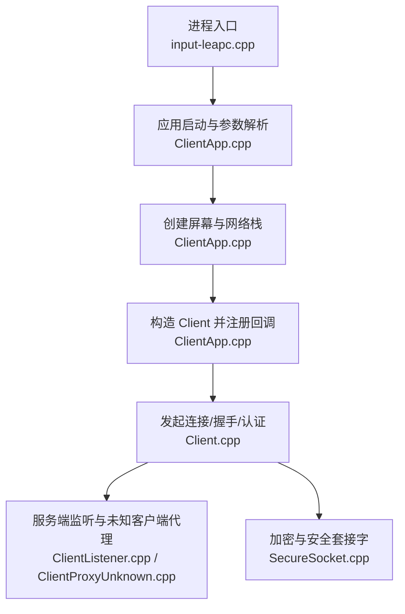
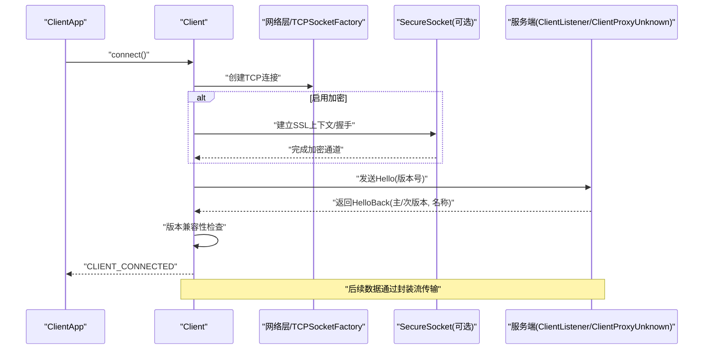
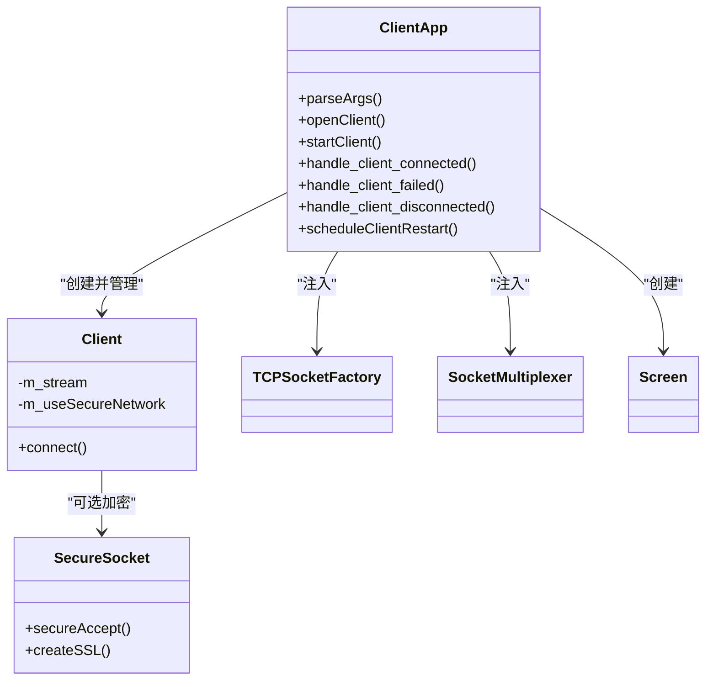

# 客户端连接管理

<cite>
**本文引用的文件**   
- [src/client/input-leapc.cpp](file://src/client/input-leapc.cpp)
- [src/lib/inputleap/ClientApp.h](file://src/lib/inputleap/ClientApp.h)
- [src/lib/inputleap/ClientApp.cpp](file://src/lib/inputleap/ClientApp.cpp)
- [src/lib/client/Client.cpp](file://src/lib/client/Client.cpp)
- [src/lib/server/ClientListener.cpp](file://src/lib/server/ClientListener.cpp)
- [src/lib/server/ClientProxyUnknown.cpp](file://src/lib/server/ClientProxyUnknown.cpp)
- [src/lib/net/SecureSocket.cpp](file://src/lib/net/SecureSocket.cpp)
</cite>

## 目录
1. [简介](#简介)
2. [项目结构](#项目结构)
3. [核心组件](#核心组件)
4. [架构总览](#架构总览)
5. [详细组件分析](#详细组件分析)
6. [依赖关系分析](#依赖关系分析)
7. [性能与可靠性](#性能与可靠性)
8. [故障排查指南](#故障排查指南)
9. [结论](#结论)
10. [附录：使用示例与最佳实践](#附录使用示例与最佳实践)

## 简介
本文件面向“客户端连接管理”的 API 与实现，聚焦 Client 类如何建立和维护与服务器的连接、自动重连机制、连接状态同步与数据传输协议。文档覆盖连接参数配置、认证流程、加密通信、错误重试策略、连接监听器、状态回调函数和异常处理机制的实现细节，并提供可操作的代码示例路径，帮助开发者快速集成与排障。

## 项目结构
从客户端进程入口到连接生命周期，关键路径如下：
- 进程入口初始化事件循环与应用实例
- 解析命令行参数并解析服务器地址
- 创建平台屏幕抽象与网络栈
- 构造 Client 对象并注册连接事件回调
- 发起连接、握手、版本协商、可选加密与认证
- 运行期断线检测与自动重连调度

图表来源
- [src/client/input-leapc.cpp:1-64](file://src/client/input-leapc.cpp#L1-L64)
- [src/lib/inputleap/ClientApp.cpp:418-465](file://src/lib/inputleap/ClientApp.cpp#L418-L465)
- [src/lib/client/Client.cpp:110-123](file://src/lib/client/Client.cpp#L110-L123)
- [src/lib/server/ClientListener.cpp:121-154](file://src/lib/server/ClientListener.cpp#L121-L154)
- [src/lib/server/ClientProxyUnknown.cpp:145-221](file://src/lib/server/ClientProxyUnknown.cpp#L145-L221)
- [src/lib/net/SecureSocket.cpp:409-451](file://src/lib/net/SecureSocket.cpp#L409-L451)

章节来源
- [src/client/input-leapc.cpp:1-64](file://src/client/input-leapc.cpp#L1-L64)
- [src/lib/inputleap/ClientApp.cpp:418-465](file://src/lib/inputleap/ClientApp.cpp#L418-L465)

## 核心组件
- 客户端应用外壳（ClientApp）
  - 负责解析参数、创建屏幕与网络栈、构造 Client、注册连接事件回调、统一处理连接成功/失败/断开以及自动重连调度。
- 客户端连接核心（Client）
  - 负责建立 TCP/SSL 连接、发送 Hello、版本协商、可选加密与认证、维护连接状态、触发事件。
- 服务端侧配合（ClientListener/ClientProxyUnknown）
  - 用于理解握手与版本协商流程，便于客户端对齐协议行为。
- 安全传输（SecureSocket）
  - 提供 SSL/TLS 握手、证书校验等能力。

章节来源
- [src/lib/inputleap/ClientApp.h:31-88](file://src/lib/inputleap/ClientApp.h#L31-L88)
- [src/lib/inputleap/ClientApp.cpp:312-337](file://src/lib/inputleap/ClientApp.cpp#L312-L337)
- [src/lib/client/Client.cpp:110-123](file://src/lib/client/Client.cpp#L110-L123)
- [src/lib/server/ClientListener.cpp:121-154](file://src/lib/server/ClientListener.cpp#L121-L154)
- [src/lib/server/ClientProxyUnknown.cpp:145-221](file://src/lib/server/ClientProxyUnknown.cpp#L145-L221)
- [src/lib/net/SecureSocket.cpp:409-451](file://src/lib/net/SecureSocket.cpp#L409-L451)

## 架构总览
下图展示客户端连接建立、握手、认证与事件回调的整体时序。

图表来源
- [src/lib/inputleap/ClientApp.cpp:312-337](file://src/lib/inputleap/ClientApp.cpp#L312-L337)
- [src/lib/client/Client.cpp:110-123](file://src/lib/client/Client.cpp#L110-L123)
- [src/lib/server/ClientListener.cpp:121-154](file://src/lib/server/ClientListener.cpp#L121-L154)
- [src/lib/server/ClientProxyUnknown.cpp:145-221](file://src/lib/server/ClientProxyUnknown.cpp#L145-L221)
- [src/lib/net/SecureSocket.cpp:409-451](file://src/lib/net/SecureSocket.cpp#L409-L451)

## 详细组件分析

### 客户端应用外壳（ClientApp）
职责
- 解析命令行参数（包括服务器地址、端口、是否守护进程、是否可重启等）。
- 创建平台屏幕抽象与 Socket 多路复用器。
- 构造 Client 并注册三类事件回调：连接成功、连接失败、断开。
- 根据配置决定是否在失败或断开后自动重连。

关键方法
- parseArgs：解析参数并解析服务器地址；若不可解析且不允许重启则退出。
- openClient：构造 Client，绑定事件回调。
- startClient：创建 Screen 与 Client，调用 connect()；捕获屏幕不可用等异常并安排重试。
- handle_client_failed/handle_client_disconnected：根据 m_restartable 与 FailInfo.m_retry 决定退出或定时重连。
- scheduleClientRestart：基于固定间隔（RETRY_TIME）设置一次性定时器进行重连。

事件模型
- CLIENT_CONNECTED：连接成功后更新状态并重置重试时间。
- CLIENT_CONNECTION_FAILED：携带 FailInfo（包含 m_what、m_retry），决定是否退出或重试。
- CLIENT_DISCONNECTED：根据是否可重启决定是否退出或重试。

章节来源
- [src/lib/inputleap/ClientApp.cpp:82-110](file://src/lib/inputleap/ClientApp.cpp#L82-L110)
- [src/lib/inputleap/ClientApp.cpp:312-337](file://src/lib/inputleap/ClientApp.cpp#L312-L337)
- [src/lib/inputleap/ClientApp.cpp:363-405](file://src/lib/inputleap/ClientApp.cpp#L363-L405)
- [src/lib/inputleap/ClientApp.cpp:282-310](file://src/lib/inputleap/ClientApp.cpp#L282-L310)
- [src/lib/inputleap/ClientApp.cpp:262-269](file://src/lib/inputleap/ClientApp.cpp#L262-L269)
- [src/lib/inputleap/ClientApp.cpp:207-227](file://src/lib/inputleap/ClientApp.cpp#L207-L227)

### 客户端连接核心（Client）
职责
- 建立底层连接（TCP/SSL），发送 Hello 消息，接收 HelloBack，进行版本协商。
- 选择安全级别：明文或加密认证（客户端始终验证服务器）。
- 维护连接状态，向应用层派发连接事件。

关键流程
- connect：若已有连接或处于挂起状态则短路；否则根据配置选择安全级别并发起连接。
- 事件订阅：订阅屏幕挂起/恢复事件以控制连接时机；支持文件传输相关事件（可选）。

章节来源
- [src/lib/client/Client.cpp:110-123](file://src/lib/client/Client.cpp#L110-L123)
- [src/lib/client/Client.cpp:80-91](file://src/lib/client/Client.cpp#L80-L91)

### 握手与版本协商（服务端视角辅助理解）
说明
- 客户端发送 Hello（含主/次版本），服务端回复 HelloBack（含主/次版本与名称）。
- 服务端对版本进行校验，不兼容时返回错误码并关闭连接。
- 该流程有助于客户端对齐协议行为与错误处理。

章节来源
- [src/lib/server/ClientProxyUnknown.cpp:145-221](file://src/lib/server/ClientProxyUnknown.cpp#L145-L221)

### 加密与安全（SecureSocket）
职责
- 在 ENCRYPTED_AUTHENTICATED 模式下执行 SSL 握手与证书校验。
- 处理非致命错误与重试逻辑，确保握手稳定。

要点
- 客户端总是验证服务器证书，保证双向信任链中的服务端可信。
- 握手失败会记录日志并可能短暂休眠以避免频繁重试。

章节来源
- [src/lib/net/SecureSocket.cpp:409-451](file://src/lib/net/SecureSocket.cpp#L409-L451)

### 自动重连与状态同步
重连策略
- 固定间隔重试：nextRestartTimeout 返回常量 RETRY_TIME（秒）。
- 仅在允许重启（m_restartable）且未挂起（m_suspended）时调度定时器。
- 连接失败时依据 FailInfo.m_retry 决定是否继续重试。

状态同步
- 通过事件队列将连接状态变化通知上层（Connected/Failed/Disconnected）。
- 任务栏状态更新与日志输出保持一致。

章节来源
- [src/lib/inputleap/ClientApp.cpp:207-227](file://src/lib/inputleap/ClientApp.cpp#L207-L227)
- [src/lib/inputleap/ClientApp.cpp:262-269](file://src/lib/inputleap/ClientApp.cpp#L262-L269)
- [src/lib/inputleap/ClientApp.cpp:282-310](file://src/lib/inputleap/ClientApp.cpp#L282-L310)

## 依赖关系分析
- ClientApp 依赖：
  - Client：连接核心
  - TCPSocketFactory/SocketMultiplexer：网络 I/O
  - Screen/IPlatformScreen：平台输入输出抽象
  - EventQueue/EventQueueTimer：事件与定时器
- Client 依赖：
  - 网络层（TCP/SSL）、协议工具（Hello/版本协商）
- SecureSocket 依赖：
  - OpenSSL（SSL_new/SSL_accept/证书校验）

图表来源
- [src/lib/inputleap/ClientApp.h:31-88](file://src/lib/inputleap/ClientApp.h#L31-L88)
- [src/lib/inputleap/ClientApp.cpp:312-337](file://src/lib/inputleap/ClientApp.cpp#L312-L337)
- [src/lib/client/Client.cpp:110-123](file://src/lib/client/Client.cpp#L110-L123)
- [src/lib/net/SecureSocket.cpp:409-451](file://src/lib/net/SecureSocket.cpp#L409-L451)

## 性能与可靠性
- 连接建立
  - 优先复用 Socket 多路复用器，减少线程切换开销。
  - 握手阶段限制 Hello 长度，避免恶意或畸形报文导致资源耗尽。
- 重连策略
  - 固定间隔重试，简单可控；可根据业务需求扩展为指数退避。
- 安全性
  - 默认支持加密与认证，建议在生产环境强制启用。
- 资源清理
  - 析构时移除事件处理器、删除定时器、释放连接，避免悬挂指针与内存泄漏。

[本节为通用指导，无需源码引用]

## 故障排查指南
常见问题与定位思路
- 无法解析服务器地址或端口无效
  - 现象：启动即退出或提示地址错误。
  - 定位：查看 parseArgs 中地址解析与端口校验分支。
- 连接失败但允许重启
  - 现象：周期性尝试重连。
  - 定位：handle_client_failed 中 FailInfo.m_retry 与 m_restartable 判断。
- 连接中断后退出
  - 现象：断开后直接退出。
  - 定位：handle_client_disconnected 中 m_restartable 分支。
- 握手超时或不响应
  - 现象：长时间无连接成功事件。
  - 定位：参考服务端未知客户端代理的超时处理逻辑，确认客户端 Hello 发送与读取。
- 证书校验失败
  - 现象：加密模式握手失败。
  - 定位：SecureSocket 的证书校验与错误处理分支。

章节来源
- [src/lib/inputleap/ClientApp.cpp:82-110](file://src/lib/inputleap/ClientApp.cpp#L82-L110)
- [src/lib/inputleap/ClientApp.cpp:282-310](file://src/lib/inputleap/ClientApp.cpp#L282-L310)
- [src/lib/server/ClientProxyUnknown.cpp:229-239](file://src/lib/server/ClientProxyUnknown.cpp#L229-L239)
- [src/lib/net/SecureSocket.cpp:409-451](file://src/lib/net/SecureSocket.cpp#L409-L451)

## 结论
客户端连接管理围绕 ClientApp 与 Client 两个核心展开：前者负责生命周期与重连策略，后者负责连接建立、握手与协议交互。通过事件驱动与定时器机制，系统实现了稳定的连接状态同步与自动恢复。生产环境建议启用加密与认证，并结合日志与监控完善可观测性。

[本节为总结，无需源码引用]

## 附录：使用示例与最佳实践
以下示例仅给出“代码片段路径”，请根据实际工程替换占位符。

- 配置连接参数（服务器地址、端口、是否守护进程、是否可重启）
  - 参考：[src/lib/inputleap/ClientApp.cpp:82-110](file://src/lib/inputleap/ClientApp.cpp#L82-L110)
- 启动客户端并建立连接
  - 参考：[src/lib/inputleap/ClientApp.cpp:363-405](file://src/lib/inputleap/ClientApp.cpp#L363-L405)
- 注册连接监听器与状态回调
  - 参考：[src/lib/inputleap/ClientApp.cpp:312-337](file://src/lib/inputleap/ClientApp.cpp#L312-L337)
- 处理连接失败并重试
  - 参考：[src/lib/inputleap/ClientApp.cpp:282-310](file://src/lib/inputleap/ClientApp.cpp#L282-L310)
- 处理连接断开与退出
  - 参考：[src/lib/inputleap/ClientApp.cpp:300-310](file://src/lib/inputleap/ClientApp.cpp#L300-L310)
- 启用加密与认证（客户端始终验证服务器）
  - 参考：[src/lib/client/Client.cpp:110-123](file://src/lib/client/Client.cpp#L110-L123)
  - 参考：[src/lib/net/SecureSocket.cpp:409-451](file://src/lib/net/SecureSocket.cpp#L409-L451)
- 监控连接质量（结合日志与状态更新）
  - 参考：[src/lib/inputleap/ClientApp.cpp:272-279](file://src/lib/inputleap/ClientApp.cpp#L272-L279)

最佳实践
- 明确区分“可重启”与“不可重启”场景，合理设置 m_restartable。
- 在失败回调中记录 FailInfo.m_what 与 m_retry，便于问题定位。
- 生产环境强制启用加密与认证，并确保证书链完整。
- 对长连接增加心跳或健康检查（可在上层扩展）。
- 避免在高频重连路径中进行阻塞操作，保持事件循环流畅。

[本节为使用指引，无需源码引用]