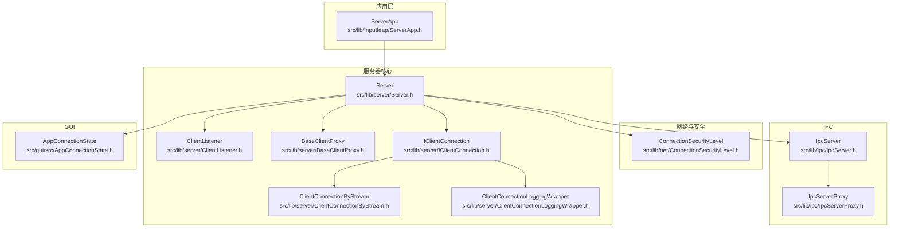
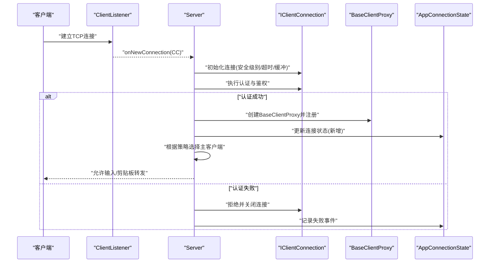
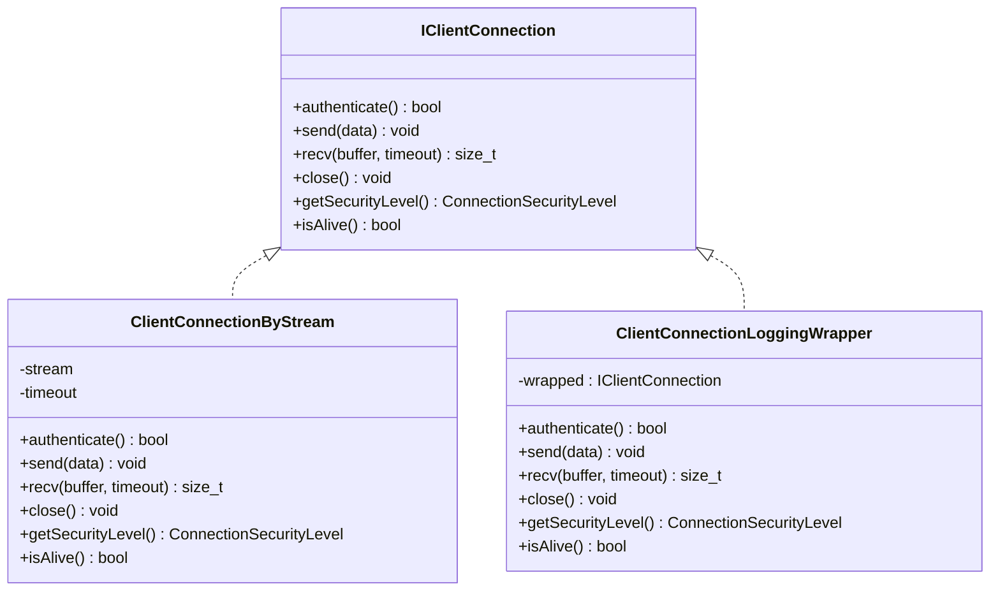
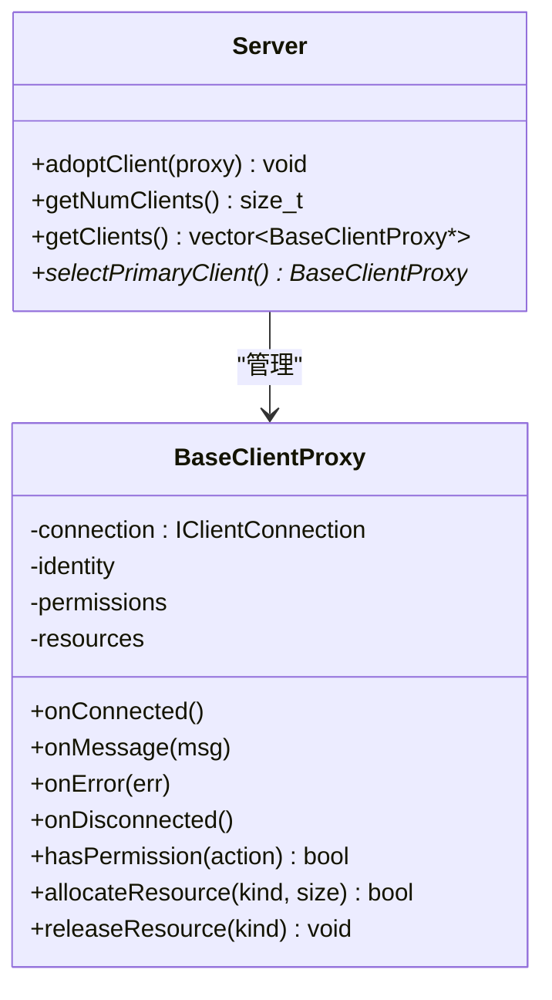
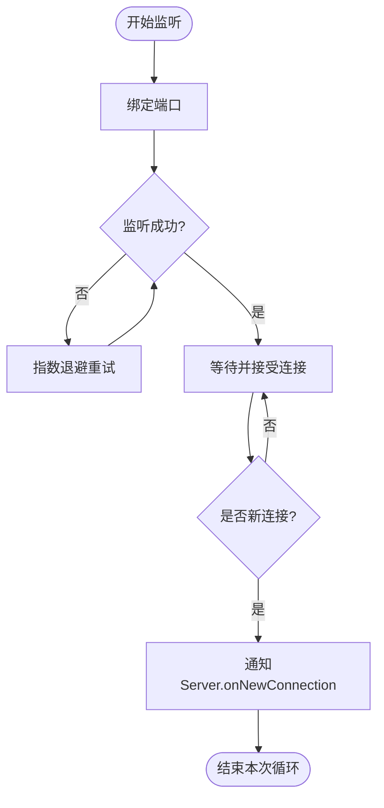
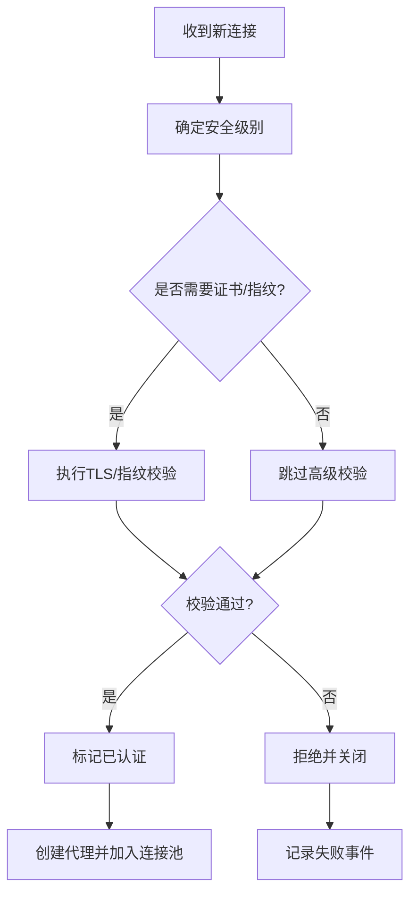
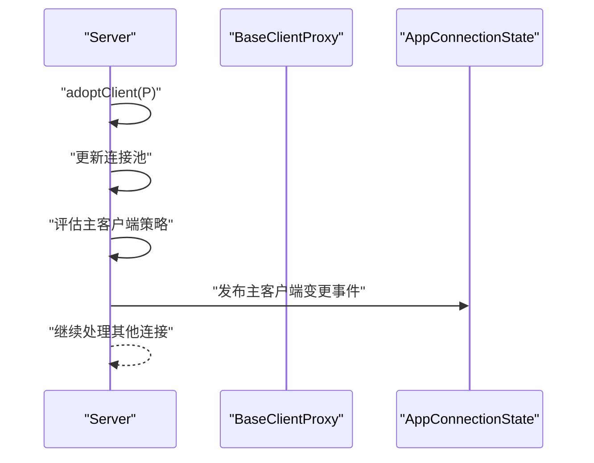
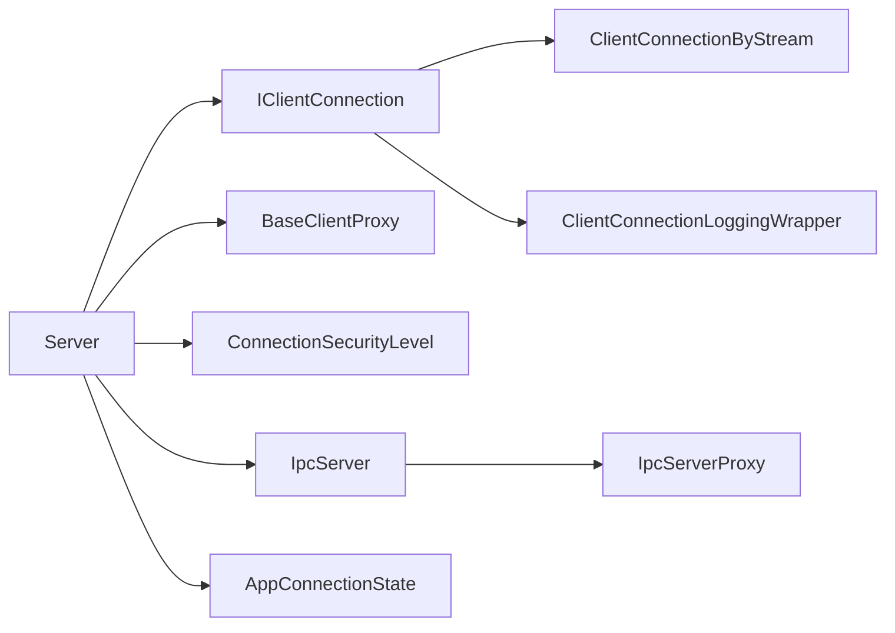

# 服务器连接管理

<cite>
**本文引用的文件**   
- [src/lib/server/Server.h](file://src/lib/server/Server.h)
- [src/lib/server/BaseClientProxy.h](file://src/lib/server/BaseClientProxy.h)
- [src/lib/server/ClientListener.h](file://src/lib/server/ClientListener.h)
- [src/lib/server/IClientConnection.h](file://src/lib/server/IClientConnection.h)
- [src/lib/server/ClientConnectionByStream.h](file://src/lib/server/ClientConnectionByStream.h)
- [src/lib/server/ClientConnectionLoggingWrapper.h](file://src/lib/server/ClientConnectionLoggingWrapper.h)
- [src/lib/net/ConnectionSecurityLevel.h](file://src/lib/net/ConnectionSecurityLevel.h)
- [src/lib/inputleap/ServerApp.h](file://src/lib/inputleap/ServerApp.h)
- [src/lib/ipc/IpcServer.h](file://src/lib/ipc/IpcServer.h)
- [src/lib/ipc/IpcServerProxy.h](file://src/lib/ipc/IpcServerProxy.h)
- [src/gui/src/AppConnectionState.h](file://src/gui/src/AppConnectionState.h)
</cite>

## 目录
1. [简介](#简介)
2. [项目结构](#项目结构)
3. [核心组件](#核心组件)
4. [架构总览](#架构总览)
5. [详细组件分析](#详细组件分析)
6. [依赖关系分析](#依赖关系分析)
7. [性能考虑](#性能考虑)
8. [故障排查指南](#故障排查指南)
9. [结论](#结论)
10. [附录](#附录)

## 简介
本文件面向服务器端连接管理，聚焦于 Server 类如何接受并处理客户端连接、维护连接池与主客户端选择、并发处理多客户端、以及连接生命周期、认证与权限控制、资源分配等关键机制。文档同时覆盖连接监听器、连接事件处理与状态监控的实现要点，并提供 adoptClient()、getNumClients()、getClients() 等核心接口的使用指引，以及 BaseClientProxy 的管理机制说明。

## 项目结构
与服务器连接管理相关的代码主要分布在以下模块：
- 服务器核心与代理：src/lib/server
- 网络与安全级别：src/lib/net
- IPC 服务端与代理：src/lib/ipc
- GUI 连接状态展示：src/gui/src
- 应用层入口（服务器应用）：src/lib/inputleap

图表来源
- [src/lib/server/Server.h](file://src/lib/server/Server.h)
- [src/lib/server/ClientListener.h](file://src/lib/server/ClientListener.h)
- [src/lib/server/BaseClientProxy.h](file://src/lib/server/BaseClientProxy.h)
- [src/lib/server/IClientConnection.h](file://src/lib/server/IClientConnection.h)
- [src/lib/server/ClientConnectionByStream.h](file://src/lib/server/ClientConnectionByStream.h)
- [src/lib/server/ClientConnectionLoggingWrapper.h](file://src/lib/server/ClientConnectionLoggingWrapper.h)
- [src/lib/net/ConnectionSecurityLevel.h](file://src/lib/net/ConnectionSecurityLevel.h)
- [src/lib/ipc/IpcServer.h](file://src/lib/ipc/IpcServer.h)
- [src/lib/ipc/IpcServerProxy.h](file://src/lib/ipc/IpcServerProxy.h)
- [src/gui/src/AppConnectionState.h](file://src/gui/src/AppConnectionState.h)
- [src/lib/inputleap/ServerApp.h](file://src/lib/inputleap/ServerApp.h)

章节来源
- [src/lib/server/Server.h](file://src/lib/server/Server.h)
- [src/lib/server/BaseClientProxy.h](file://src/lib/server/BaseClientProxy.h)
- [src/lib/server/ClientListener.h](file://src/lib/server/ClientListener.h)
- [src/lib/server/IClientConnection.h](file://src/lib/server/IClientConnection.h)
- [src/lib/server/ClientConnectionByStream.h](file://src/lib/server/ClientConnectionByStream.h)
- [src/lib/server/ClientConnectionLoggingWrapper.h](file://src/lib/server/ClientConnectionLoggingWrapper.h)
- [src/lib/net/ConnectionSecurityLevel.h](file://src/lib/net/ConnectionSecurityLevel.h)
- [src/lib/ipc/IpcServer.h](file://src/lib/ipc/IpcServer.h)
- [src/lib/ipc/IpcServerProxy.h](file://src/lib/ipc/IpcServerProxy.h)
- [src/gui/src/AppConnectionState.h](file://src/gui/src/AppConnectionState.h)
- [src/lib/inputleap/ServerApp.h](file://src/lib/inputleap/ServerApp.h)

## 核心组件
- Server：服务器核心，负责监听新连接、创建并管理客户端连接对象、维护连接集合、选择主客户端、提供 adoptClient()/getNumClients()/getClients() 等接口。
- ClientListener：连接监听器，封装底层 socket 监听与 accept 流程，将新连接回调给 Server。
- IClientConnection：客户端连接抽象接口，定义读写、认证、安全级别、关闭等能力。
- ClientConnectionByStream：基于流实现的连接，承载实际数据收发。
- ClientConnectionLoggingWrapper：对连接的日志包装，便于审计与排障。
- BaseClientProxy：客户端代理基类，封装与单个客户端的会话上下文、消息路由、资源分配与生命周期钩子。
- ConnectionSecurityLevel：连接安全等级枚举，用于认证与加密策略。
- IpcServer / IpcServerProxy：进程内通信服务与代理，用于本地管理与调试。
- AppConnectionState：GUI 侧的连接状态聚合，用于可视化监控。
- ServerApp：服务器应用装配与启动，协调各子系统。

章节来源
- [src/lib/server/Server.h](file://src/lib/server/Server.h)
- [src/lib/server/ClientListener.h](file://src/lib/server/ClientListener.h)
- [src/lib/server/IClientConnection.h](file://src/lib/server/IClientConnection.h)
- [src/lib/server/ClientConnectionByStream.h](file://src/lib/server/ClientConnectionByStream.h)
- [src/lib/server/ClientConnectionLoggingWrapper.h](file://src/lib/server/ClientConnectionLoggingWrapper.h)
- [src/lib/server/BaseClientProxy.h](file://src/lib/server/BaseClientProxy.h)
- [src/lib/net/ConnectionSecurityLevel.h](file://src/lib/net/ConnectionSecurityLevel.h)
- [src/lib/ipc/IpcServer.h](file://src/lib/ipc/IpcServer.h)
- [src/lib/ipc/IpcServerProxy.h](file://src/lib/ipc/IpcServerProxy.h)
- [src/gui/src/AppConnectionState.h](file://src/gui/src/AppConnectionState.h)
- [src/lib/inputleap/ServerApp.h](file://src/lib/inputleap/ServerApp.h)

## 架构总览
下图展示了从客户端接入到连接管理的整体流程，包括监听、认证、代理创建、主客户端选择与并发处理。

图表来源
- [src/lib/server/ClientListener.h](file://src/lib/server/ClientListener.h)
- [src/lib/server/Server.h](file://src/lib/server/Server.h)
- [src/lib/server/IClientConnection.h](file://src/lib/server/IClientConnection.h)
- [src/lib/server/BaseClientProxy.h](file://src/lib/server/BaseClientProxy.h)
- [src/gui/src/AppConnectionState.h](file://src/gui/src/AppConnectionState.h)

## 详细组件分析

### Server 类与连接生命周期
- 职责
  - 接收来自 ClientListener 的新连接回调。
  - 为每个连接创建 IClientConnection 实例并进行认证与鉴权。
  - 为已认证连接创建 BaseClientProxy，纳入连接池管理。
  - 维护连接集合，支持遍历、计数与主客户端选择。
  - 提供 adoptClient()、getNumClients()、getClients() 等接口供上层使用。
- 生命周期阶段
  - 新建：accept -> 构造连接 -> 配置安全级别与超时。
  - 认证：校验凭据/证书/指纹，决定允许或拒绝。
  - 就绪：创建代理、加入连接池、触发“连接就绪”事件。
  - 活跃：读写事件分发、心跳检测、资源配额检查。
  - 断开：异常或主动关闭 -> 清理代理与资源 -> 触发“连接断开”事件。
- 主客户端选择
  - 策略通常基于优先级、最近活跃时间或显式配置；选择后向其他客户端广播变更。
- 并发模型
  - 每个连接在独立线程或事件循环中运行，避免阻塞其他连接。
  - 连接集合访问需加锁或使用无锁容器以保证一致性。

章节来源
- [src/lib/server/Server.h](file://src/lib/server/Server.h)
- [src/lib/server/ClientListener.h](file://src/lib/server/ClientListener.h)
- [src/lib/server/IClientConnection.h](file://src/lib/server/IClientConnection.h)
- [src/lib/server/BaseClientProxy.h](file://src/lib/server/BaseClientProxy.h)

### 连接抽象与实现：IClientConnection、ClientConnectionByStream、ClientConnectionLoggingWrapper
- IClientConnection
  - 定义统一接口：认证、读写、关闭、获取安全级别、查询状态等。
- ClientConnectionByStream
  - 基于流进行数据收发，封装缓冲区、超时与错误码映射。
- ClientConnectionLoggingWrapper
  - 装饰器模式，透明地记录入站/出站消息、错误与耗时，便于审计。

图表来源
- [src/lib/server/IClientConnection.h](file://src/lib/server/IClientConnection.h)
- [src/lib/server/ClientConnectionByStream.h](file://src/lib/server/ClientConnectionByStream.h)
- [src/lib/server/ClientConnectionLoggingWrapper.h](file://src/lib/server/ClientConnectionLoggingWrapper.h)

章节来源
- [src/lib/server/IClientConnection.h](file://src/lib/server/IClientConnection.h)
- [src/lib/server/ClientConnectionByStream.h](file://src/lib/server/ClientConnectionByStream.h)
- [src/lib/server/ClientConnectionLoggingWrapper.h](file://src/lib/server/ClientConnectionLoggingWrapper.h)

### BaseClientProxy 管理机制
- 作用
  - 封装与单个客户端的会话上下文：身份、屏幕名、权限集、资源配额、消息路由表。
  - 提供生命周期钩子：onConnected/onDisconnected/onMessage/onError。
  - 与 Server 协作完成主客户端选择与广播。
- 资源分配
  - 按连接维度分配内存缓冲、事件队列、定时器句柄。
  - 支持动态调整配额与限流策略。
- 并发安全
  - 内部状态变更需加锁或采用单线程串行化。
  - 对外暴露的 API 应保证幂等与可重入。

图表来源
- [src/lib/server/BaseClientProxy.h](file://src/lib/server/BaseClientProxy.h)
- [src/lib/server/Server.h](file://src/lib/server/Server.h)

章节来源
- [src/lib/server/BaseClientProxy.h](file://src/lib/server/BaseClientProxy.h)
- [src/lib/server/Server.h](file://src/lib/server/Server.h)

### 连接监听器与事件处理：ClientListener
- 职责
  - 绑定端口、监听新连接、调用 Server 的 onNewConnection 回调。
  - 处理 accept 错误、重试与退避。
- 事件处理
  - 成功：传递 IClientConnection 给 Server。
  - 失败：上报错误、记录日志、必要时重启监听。

图表来源
- [src/lib/server/ClientListener.h](file://src/lib/server/ClientListener.h)
- [src/lib/server/Server.h](file://src/lib/server/Server.h)

章节来源
- [src/lib/server/ClientListener.h](file://src/lib/server/ClientListener.h)
- [src/lib/server/Server.h](file://src/lib/server/Server.h)

### 认证、权限控制与安全级别
- 认证流程
  - 连接建立后，依据 ConnectionSecurityLevel 决定握手方式（明文/证书/指纹）。
  - 校验通过后标记连接为“已认证”，否则拒绝并关闭。
- 权限控制
  - 基于角色/白名单/屏幕名匹配，限制输入、剪贴板、电源管理等操作。
  - 通过 BaseClientProxy::hasPermission 进行细粒度授权。
- 安全级别
  - ConnectionSecurityLevel 提供不同强度策略，影响加密与验证步骤。

图表来源
- [src/lib/net/ConnectionSecurityLevel.h](file://src/lib/net/ConnectionSecurityLevel.h)
- [src/lib/server/IClientConnection.h](file://src/lib/server/IClientConnection.h)
- [src/lib/server/BaseClientProxy.h](file://src/lib/server/BaseClientProxy.h)

章节来源
- [src/lib/net/ConnectionSecurityLevel.h](file://src/lib/net/ConnectionSecurityLevel.h)
- [src/lib/server/IClientConnection.h](file://src/lib/server/IClientConnection.h)
- [src/lib/server/BaseClientProxy.h](file://src/lib/server/BaseClientProxy.h)

### 连接池、主客户端选择与并发处理
- 连接池
  - 以线程安全容器维护所有已认证连接及其代理。
  - 提供 adoptClient() 添加、遍历 getClients()、计数 getNumClients()。
- 主客户端选择
  - 策略可配置：最高优先级、最近活跃、显式指定。
  - 变更后广播至所有客户端，确保一致视图。
- 并发处理
  - 每个连接独立线程/事件循环，避免相互阻塞。
  - 共享状态（如主客户端指针）需原子或互斥保护。

图表来源
- [src/lib/server/Server.h](file://src/lib/server/Server.h)
- [src/lib/server/BaseClientProxy.h](file://src/lib/server/BaseClientProxy.h)
- [src/gui/src/AppConnectionState.h](file://src/gui/src/AppConnectionState.h)

章节来源
- [src/lib/server/Server.h](file://src/lib/server/Server.h)
- [src/lib/server/BaseClientProxy.h](file://src/lib/server/BaseClientProxy.h)
- [src/gui/src/AppConnectionState.h](file://src/gui/src/AppConnectionState.h)

### IPC 集成与本地管理
- IpcServer 提供本地管理通道，便于调试、热插拔与运维。
- IpcServerProxy 作为本地客户端，调用远端服务进行连接查询与控制。

章节来源
- [src/lib/ipc/IpcServer.h](file://src/lib/ipc/IpcServer.h)
- [src/lib/ipc/IpcServerProxy.h](file://src/lib/ipc/IpcServerProxy.h)

### GUI 连接状态监控
- AppConnectionState 聚合当前连接数、主客户端、各连接健康度，供界面展示。
- 与 Server 的事件系统联动，实时更新 UI。

章节来源
- [src/gui/src/AppConnectionState.h](file://src/gui/src/AppConnectionState.h)
- [src/lib/server/Server.h](file://src/lib/server/Server.h)

## 依赖关系分析
- 低耦合高内聚
  - Server 仅依赖 IClientConnection 抽象，具体实现可替换。
  - BaseClientProxy 与连接解耦，专注会话与权限。
- 外部依赖
  - 网络栈与安全库由 ConnectionSecurityLevel 抽象。
  - IPC 与 GUI 通过事件/状态同步，避免直接强耦合。

图表来源
- [src/lib/server/Server.h](file://src/lib/server/Server.h)
- [src/lib/server/IClientConnection.h](file://src/lib/server/IClientConnection.h)
- [src/lib/server/BaseClientProxy.h](file://src/lib/server/BaseClientProxy.h)
- [src/lib/server/ClientConnectionByStream.h](file://src/lib/server/ClientConnectionByStream.h)
- [src/lib/server/ClientConnectionLoggingWrapper.h](file://src/lib/server/ClientConnectionLoggingWrapper.h)
- [src/lib/net/ConnectionSecurityLevel.h](file://src/lib/net/ConnectionSecurityLevel.h)
- [src/lib/ipc/IpcServer.h](file://src/lib/ipc/IpcServer.h)
- [src/lib/ipc/IpcServerProxy.h](file://src/lib/ipc/IpcServerProxy.h)
- [src/gui/src/AppConnectionState.h](file://src/gui/src/AppConnectionState.h)

章节来源
- [src/lib/server/Server.h](file://src/lib/server/Server.h)
- [src/lib/server/IClientConnection.h](file://src/lib/server/IClientConnection.h)
- [src/lib/server/BaseClientProxy.h](file://src/lib/server/BaseClientProxy.h)
- [src/lib/server/ClientConnectionByStream.h](file://src/lib/server/ClientConnectionByStream.h)
- [src/lib/server/ClientConnectionLoggingWrapper.h](file://src/lib/server/ClientConnectionLoggingWrapper.h)
- [src/lib/net/ConnectionSecurityLevel.h](file://src/lib/net/ConnectionSecurityLevel.h)
- [src/lib/ipc/IpcServer.h](file://src/lib/ipc/IpcServer.h)
- [src/lib/ipc/IpcServerProxy.h](file://src/lib/ipc/IpcServerProxy.h)
- [src/gui/src/AppConnectionState.h](file://src/gui/src/AppConnectionState.h)

## 性能考虑
- 连接池容量与背压
  - 设置最大连接数与每连接资源上限，防止 OOM。
  - 在高负载时启用排队与拒绝策略。
- 零拷贝与缓冲复用
  - 重用缓冲区、减少内存分配次数。
  - 大消息分片传输，降低单次拷贝开销。
- 并发与锁粒度
  - 连接间尽量无锁；连接内短临界区。
  - 主客户端选择结果缓存，减少频繁计算。
- 日志与监控
  - 生产环境降低日志级别，按需采样。
  - 指标上报（连接数、延迟、错误率）异步写入。

[本节为通用指导，不直接分析具体文件]

## 故障排查指南
- 常见问题
  - 连接被拒绝：检查认证凭据、证书链、白名单策略。
  - 主客户端未切换：确认选择策略与广播事件链路。
  - 资源耗尽：查看每连接配额与全局上限，调整阈值。
  - 性能抖动：定位热点路径，优化锁粒度与日志级别。
- 诊断手段
  - 使用 ClientConnectionLoggingWrapper 输出详细报文与耗时。
  - 通过 IpcServer 查询实时连接列表与健康状态。
  - 观察 AppConnectionState 的 UI 指标变化趋势。

章节来源
- [src/lib/server/ClientConnectionLoggingWrapper.h](file://src/lib/server/ClientConnectionLoggingWrapper.h)
- [src/lib/ipc/IpcServer.h](file://src/lib/ipc/IpcServer.h)
- [src/gui/src/AppConnectionState.h](file://src/gui/src/AppConnectionState.h)

## 结论
Server 通过清晰的抽象分层与事件驱动模型，实现了可扩展、可观测、可运维的多客户端连接管理。结合 BaseClientProxy 的会话与权限控制、ConnectionSecurityLevel 的安全策略、以及 IPC/GUI 的监控能力，形成完整的连接生命周期闭环。建议在生产环境中合理配置资源配额、日志级别与监控指标，以获得稳定高效的运行表现。

[本节为总结性内容，不直接分析具体文件]

## 附录

### 核心接口使用示例（路径引用）
- 配置连接参数
  - 参考：[src/lib/server/Server.h](file://src/lib/server/Server.h)
- 处理连接异常
  - 参考：[src/lib/server/ClientConnectionLoggingWrapper.h](file://src/lib/server/ClientConnectionLoggingWrapper.h)
- 监控连接健康状态
  - 参考：[src/gui/src/AppConnectionState.h](file://src/gui/src/AppConnectionState.h)
- 使用 adoptClient()
  - 参考：[src/lib/server/Server.h](file://src/lib/server/Server.h)
- 使用 getNumClients()
  - 参考：[src/lib/server/Server.h](file://src/lib/server/Server.h)
- 使用 getClients()
  - 参考：[src/lib/server/Server.h](file://src/lib/server/Server.h)
- BaseClientProxy 管理
  - 参考：[src/lib/server/BaseClientProxy.h](file://src/lib/server/BaseClientProxy.h)

章节来源
- [src/lib/server/Server.h](file://src/lib/server/Server.h)
- [src/lib/server/ClientConnectionLoggingWrapper.h](file://src/lib/server/ClientConnectionLoggingWrapper.h)
- [src/gui/src/AppConnectionState.h](file://src/gui/src/AppConnectionState.h)
- [src/lib/server/BaseClientProxy.h](file://src/lib/server/BaseClientProxy.h)