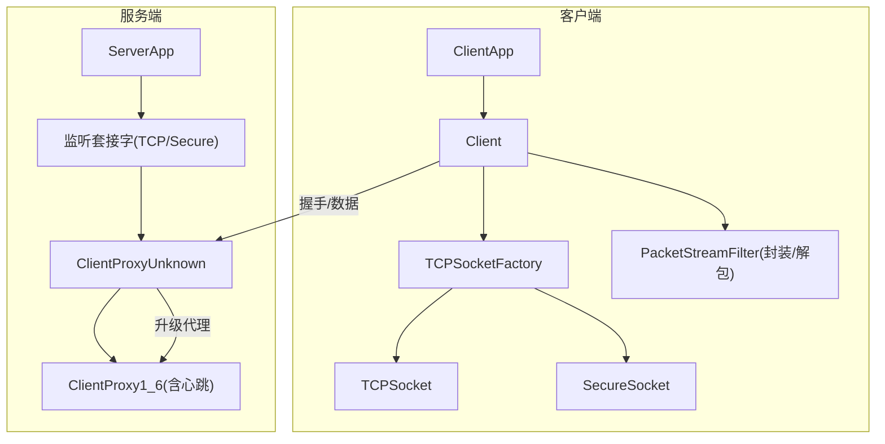
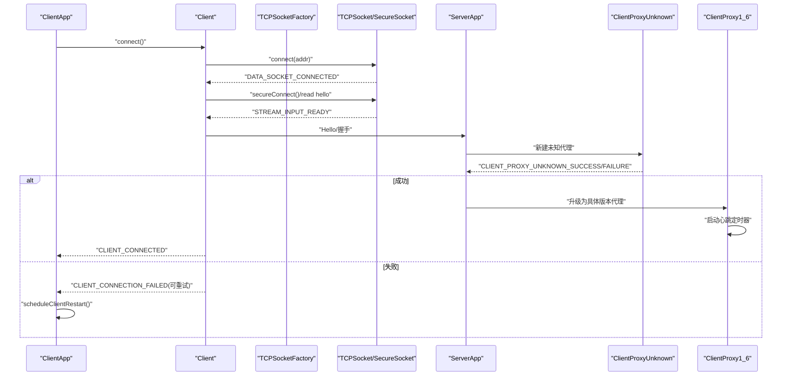
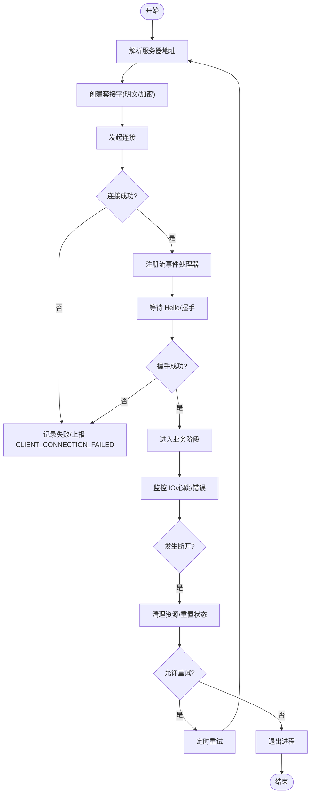
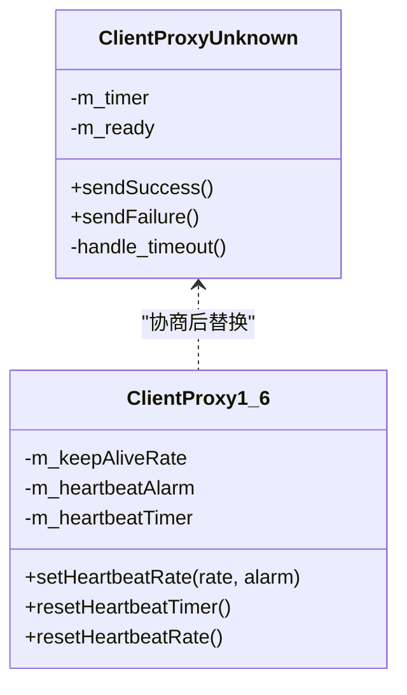
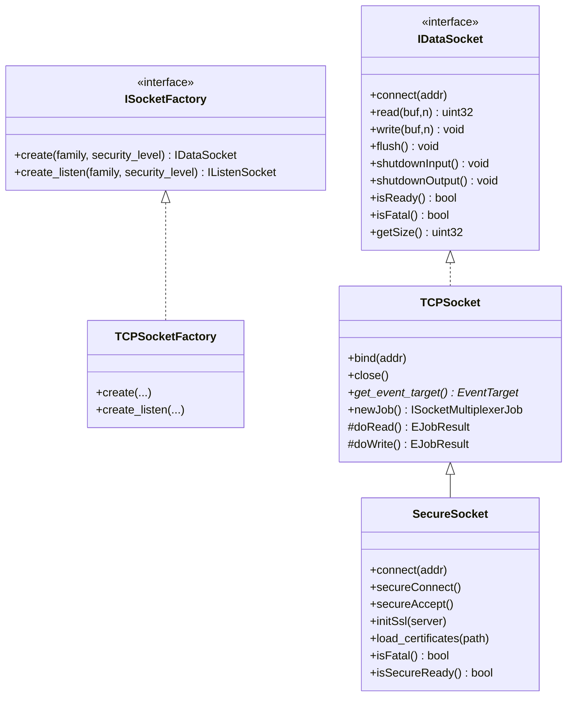
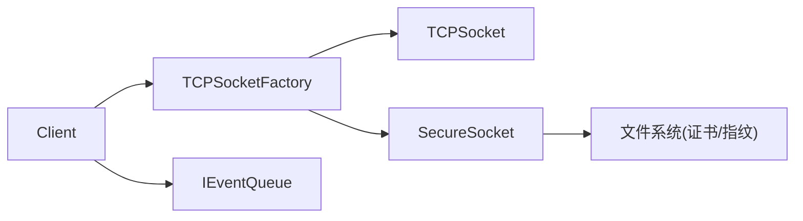

# 连接管理接口

<cite>
**本文引用的文件**   
- [Client.h](file://src/lib/client/Client.h)
- [Client.cpp](file://src/lib/client/Client.cpp)
- [ClientApp.cpp](file://src/lib/inputleap/ClientApp.cpp)
- [ServerApp.cpp](file://src/lib/inputleap/ServerApp.cpp)
- [TCPSocketFactory.h](file://src/lib/net/TCPSocketFactory.h)
- [TCPSocketFactory.cpp](file://src/lib/net/TCPSocketFactory.cpp)
- [TCPSocket.h](file://src/lib/net/TCPSocket.h)
- [SecureSocket.h](file://src/lib/net/SecureSocket.h)
- [SecureSocket.cpp](file://src/lib/net/SecureSocket.cpp)
- [ClientProxy1_6.cpp](file://src/lib/server/ClientProxy1_6.cpp)
- [ClientProxyUnknown.cpp](file://src/lib/server/ClientProxyUnknown.cpp)
</cite>

## 目录
1. [简介](#简介)
2. [项目结构](#项目结构)
3. [核心组件](#核心组件)
4. [架构总览](#架构总览)
5. [详细组件分析](#详细组件分析)
6. [依赖关系分析](#依赖关系分析)
7. [性能考虑](#性能考虑)
8. [故障排查指南](#故障排查指南)
9. [结论](#结论)
10. [附录](#附录)

## 简介
本文件面向 Input Leap 的连接管理接口，聚焦 Server 与 Client 的网络连接生命周期：建立、维护、断开与重连。内容覆盖 TCP/IP 连接处理、SSL/TLS 安全连接、连接参数配置、超时与心跳检测、网络故障恢复策略，并提供可操作的监控与优化建议。文档以代码级实现为依据，通过图示和“章节来源”标注帮助读者快速定位源码位置。

## 项目结构
Input Leap 的连接栈由应用层（Client/Server）、协议代理层（ClientProxy*）与底层网络抽象（TCP/Secure Socket + 多路复用）组成。关键路径如下：
- 客户端侧：ClientApp 创建并管理 Client；Client 负责解析地址、创建数据流、握手与事件分发；底层使用 TCPSocketFactory 按需创建明文或加密套接字。
- 服务端侧：ServerApp 监听并接纳客户端；对未知版本客户端使用 ClientProxyUnknown 进行协商，随后切换为具体版本的代理（如 ClientProxy1_6），并启用心跳机制。

图表来源
- [ClientApp.cpp:312-337](file://src/lib/inputleap/ClientApp.cpp#L312-L337)
- [Client.cpp:122-153](file://src/lib/client/Client.cpp#L122-L153)
- [TCPSocketFactory.cpp:41-65](file://src/lib/net/TCPSocketFactory.cpp#L41-L65)
- [ClientProxyUnknown.cpp:36-51](file://src/lib/server/ClientProxyUnknown.cpp#L36-L51)
- [ClientProxy1_6.cpp:132-155](file://src/lib/server/ClientProxy1_6.cpp#L132-L155)

章节来源
- [ClientApp.cpp:312-337](file://src/lib/inputleap/ClientApp.cpp#L312-L337)
- [Client.cpp:122-153](file://src/lib/client/Client.cpp#L122-L153)
- [TCPSocketFactory.cpp:41-65](file://src/lib/net/TCPSocketFactory.cpp#L41-L65)
- [ClientProxyUnknown.cpp:36-51](file://src/lib/server/ClientProxyUnknown.cpp#L36-L51)
- [ClientProxy1_6.cpp:132-155](file://src/lib/server/ClientProxy1_6.cpp#L132-L155)

## 核心组件
- Client：客户端主控制器，负责连接发起、握手、状态机、错误与重试、与屏幕子系统交互。
- ClientApp：客户端应用入口，订阅 Client 事件，决定退出或自动重启。
- TCPSocketFactory：根据安全级别选择明文或加密套接字，统一工厂化创建。
- TCPSocket：基于多路复用的非阻塞 TCP 数据通道，提供读写缓冲与事件回调。
- SecureSocket：在 TCPSocket 之上叠加 SSL/TLS 握手、证书校验与资源清理。
- ClientProxyUnknown：服务端对新连接的协议协商阶段，发送 Hello 并等待版本信息。
- ClientProxy1_6：具体协议版本代理，包含心跳/保活定时器与消息解析。

章节来源
- [Client.h:40-120](file://src/lib/client/Client.h#L40-L120)
- [Client.cpp:454-471](file://src/lib/client/Client.cpp#L454-L471)
- [ClientApp.cpp:263-337](file://src/lib/inputleap/ClientApp.cpp#L263-L337)
- [TCPSocketFactory.h:29-46](file://src/lib/net/TCPSocketFactory.h#L29-L46)
- [TCPSocket.h:39-114](file://src/lib/net/TCPSocket.h#L39-L114)
- [SecureSocket.h:35-111](file://src/lib/net/SecureSocket.h#L35-L111)
- [ClientProxyUnknown.cpp:36-51](file://src/lib/server/ClientProxyUnknown.cpp#L36-L51)
- [ClientProxy1_6.cpp:132-155](file://src/lib/server/ClientProxy1_6.cpp#L132-L155)

## 架构总览
下图展示从客户端发起连接到服务端完成握手与进入业务阶段的完整流程，包括失败重试与心跳保活。

图表来源
- [Client.cpp:122-153](file://src/lib/client/Client.cpp#L122-L153)
- [Client.cpp:454-471](file://src/lib/client/Client.cpp#L454-L471)
- [ClientApp.cpp:263-337](file://src/lib/inputleap/ClientApp.cpp#L263-L337)
- [ClientProxyUnknown.cpp:36-51](file://src/lib/server/ClientProxyUnknown.cpp#L36-L51)
- [ClientProxy1_6.cpp:132-155](file://src/lib/server/ClientProxy1_6.cpp#L132-L155)

## 详细组件分析

### 客户端连接生命周期（Client）
- 连接建立
  - 解析服务器地址（每次连接前重新解析，适配移动网络变化）。
  - 通过工厂创建数据套接字（明文或加密），包装为 PacketStreamFilter 用于分帧。
  - 注册流事件处理器：连接成功、输入就绪、输出错误、关闭等。
- 握手与维护
  - 等待服务端 Hello，完成协议协商后进入业务阶段。
  - 与 Screen 子系统对接，转发剪贴板、形状变更等事件。
- 断开与重连
  - 捕获 SOCKET_DISCONNECTED/STREAM_*_SHUTDOWN 等事件，触发清理与重连调度。
  - 上层 ClientApp 根据是否可重启策略决定是否退出或延时重试。

图表来源
- [Client.cpp:122-153](file://src/lib/client/Client.cpp#L122-L153)
- [Client.cpp:454-471](file://src/lib/client/Client.cpp#L454-L471)
- [ClientApp.cpp:263-337](file://src/lib/inputleap/ClientApp.cpp#L263-L337)

章节来源
- [Client.h:40-120](file://src/lib/client/Client.h#L40-L120)
- [Client.cpp:122-153](file://src/lib/client/Client.cpp#L122-L153)
- [Client.cpp:454-471](file://src/lib/client/Client.cpp#L454-L471)
- [ClientApp.cpp:263-337](file://src/lib/inputleap/ClientApp.cpp#L263-L337)

### 服务端连接协商与心跳（ClientProxyUnknown / ClientProxy1_6）
- 未知代理（ClientProxyUnknown）
  - 为新连接设置超时计时器，发送 Hello 消息并等待客户端版本信息。
  - 成功后移除计时器并派发成功事件，交由上层接管；失败则派发失败事件并释放资源。
- 具体代理（ClientProxy1_6）
  - 维护心跳速率与告警阈值，收到数据时重置心跳定时器。
  - 若心跳超时未收到数据，判定对端死亡并断开连接。

图表来源
- [ClientProxyUnknown.cpp:36-92](file://src/lib/server/ClientProxyUnknown.cpp#L36-L92)
- [ClientProxy1_6.cpp:132-174](file://src/lib/server/ClientProxy1_6.cpp#L132-L174)

章节来源
- [ClientProxyUnknown.cpp:36-92](file://src/lib/server/ClientProxyUnknown.cpp#L36-L92)
- [ClientProxy1_6.cpp:132-174](file://src/lib/server/ClientProxy1_6.cpp#L132-L174)

### 套接字与安全连接（TCPSocket / SecureSocket / TCPSocketFactory）
- TCPSocketFactory
  - 根据安全级别返回明文 TCPSocket 或加密 SecureSocket；监听端同理。
- TCPSocket
  - 基于多路复用，维护可读/可写/已连接状态，提供读写缓冲与事件派发。
  - 内部 job 链支持连接中/已连接两种服务状态。
- SecureSocket
  - 继承自 TCPSocket，在 TCP 连接成功后执行 SSL 握手。
  - 持有 SSL 上下文与句柄，提供证书加载与对端指纹校验能力。
  - 提供 isFatal 标记致命错误，close 时释放 SSL 资源。

图表来源
- [TCPSocketFactory.h:29-46](file://src/lib/net/TCPSocketFactory.h#L29-L46)
- [TCPSocketFactory.cpp:41-65](file://src/lib/net/TCPSocketFactory.cpp#L41-L65)
- [TCPSocket.h:39-114](file://src/lib/net/TCPSocket.h#L39-L114)
- [SecureSocket.h:35-111](file://src/lib/net/SecureSocket.h#L35-L111)

章节来源
- [TCPSocketFactory.h:29-46](file://src/lib/net/TCPSocketFactory.h#L29-L46)
- [TCPSocketFactory.cpp:41-65](file://src/lib/net/TCPSocketFactory.cpp#L41-L65)
- [TCPSocket.h:39-114](file://src/lib/net/TCPSocket.h#L39-L114)
- [SecureSocket.h:35-111](file://src/lib/net/SecureSocket.h#L35-L111)
- [SecureSocket.cpp:87-137](file://src/lib/net/SecureSocket.cpp#L87-L137)

### 连接参数配置与超时/心跳
- 客户端
  - 连接参数来源于 ClientArgs（例如是否可重启、安全级别等），由 ClientApp 构造 Client 时传入。
  - 连接失败时根据 m_restartable 与 FailInfo.m_retry 决定是否退订或安排延迟重试。
- 服务端
  - 未知代理阶段使用一次性定时器作为握手超时。
  - 具体代理阶段使用心跳速率与告警阈值控制保活。

章节来源
- [Client.h:55-58](file://src/lib/client/Client.h#L55-L58)
- [ClientApp.cpp:263-337](file://src/lib/inputleap/ClientApp.cpp#L263-L337)
- [ClientProxyUnknown.cpp:36-51](file://src/lib/server/ClientProxyUnknown.cpp#L36-L51)
- [ClientProxy1_6.cpp:132-155](file://src/lib/server/ClientProxy1_6.cpp#L132-L155)

### 连接池管理与负载均衡
- 当前实现未提供显式的连接池或负载均衡策略。
- 典型用法为单连接模式：一个 Client 对应一个 Server 实例；如需多连接，可在应用层组合多个 Client 实例并按需路由。

[本节为概念性说明，不直接分析具体文件]

## 依赖关系分析
- 耦合关系
  - Client 依赖 ISocketFactory 与 IEventQueue，屏蔽了底层 TCP/SSL 差异。
  - SecureSocket 依赖 TCPSocket 的 I/O 与事件模型，在其上叠加 TLS。
  - 服务端通过 ClientProxyUnknown 到具体代理的替换，降低版本耦合。
- 外部依赖
  - 多路复用器（SocketMultiplexer）驱动非阻塞 I/O。
  - 文件系统用于加载证书与指纹库。

图表来源
- [Client.h:55-58](file://src/lib/client/Client.h#L55-L58)
- [TCPSocketFactory.cpp:41-65](file://src/lib/net/TCPSocketFactory.cpp#L41-L65)
- [SecureSocket.h:59-60](file://src/lib/net/SecureSocket.h#L59-L60)

章节来源
- [Client.h:55-58](file://src/lib/client/Client.h#L55-L58)
- [TCPSocketFactory.cpp:41-65](file://src/lib/net/TCPSocketFactory.cpp#L41-L65)
- [SecureSocket.h:59-60](file://src/lib/net/SecureSocket.h#L59-L60)

## 性能考虑
- 非阻塞 I/O 与多路复用：避免线程阻塞，提升并发吞吐。
- 缓冲区管理：读写缓冲减少系统调用次数；注意大消息分片与背压。
- 加密开销：SSL/TLS 握手与加解密有 CPU 成本，合理选择安全级别与证书缓存。
- 心跳与超时：过短的心跳会增加负载，过长会降低故障发现速度，需按网络环境调优。
- 重试退避：指数退避可降低雪崩风险，结合抖动避免集中重连。

[本节为通用指导，不直接分析具体文件]

## 故障排查指南
- 常见现象与定位
  - 无法连接：检查地址解析、端口可达性与防火墙；查看客户端日志中的连接尝试与失败原因。
  - 握手失败：确认服务端 Hello 与客户端期望版本一致；核对证书与指纹库路径。
  - 频繁断线：关注心跳告警与对端无响应；检查网络抖动与 MTU 问题。
- 关键事件与处理
  - CLIENT_CONNECTION_FAILED：携带失败信息与是否可重试标志。
  - CLIENT_CONNECTED/CLIENT_DISCONNECTED：用于 UI 状态更新与资源回收。
  - STREAM_OUTPUT_ERROR/STREAM_*_SHUTDOWN：触发清理与可能的重连。
- 操作建议
  - 调整重试间隔与最大重试次数。
  - 开启更详细的日志级别，定位握手与 SSL 细节。
  - 在服务端强制断开异常连接，避免资源泄漏。

章节来源
- [ClientApp.cpp:263-337](file://src/lib/inputleap/ClientApp.cpp#L263-L337)
- [Client.cpp:454-471](file://src/lib/client/Client.cpp#L454-L471)
- [ServerApp.cpp:284-319](file://src/lib/inputleap/ServerApp.cpp#L284-L319)

## 结论
Input Leap 的连接管理采用清晰的分层设计：应用层（Client/ServerApp）负责策略与状态，协议代理层负责协商与保活，底层网络抽象统一 TCP/SSL 差异。通过事件驱动与非阻塞 I/O，系统在稳定性与性能之间取得平衡。生产部署建议结合网络特征调优心跳与超时，并在应用层实现必要的重试退避与监控指标采集。

[本节为总结性内容，不直接分析具体文件]

## 附录
- 示例与参考路径（不包含代码片段）
  - 客户端连接与重试：[ClientApp.cpp:263-337](file://src/lib/inputleap/ClientApp.cpp#L263-L337)
  - 客户端连接建立与事件绑定：[Client.cpp:122-153](file://src/lib/client/Client.cpp#L122-L153)、[Client.cpp:454-471](file://src/lib/client/Client.cpp#L454-L471)
  - 工厂创建明文/加密套接字：[TCPSocketFactory.cpp:41-65](file://src/lib/net/TCPSocketFactory.cpp#L41-L65)
  - SSL 连接与资源释放：[SecureSocket.cpp:87-137](file://src/lib/net/SecureSocket.cpp#L87-L137)
  - 服务端握手与心跳：[ClientProxyUnknown.cpp:36-51](file://src/lib/server/ClientProxyUnknown.cpp#L36-L51)、[ClientProxy1_6.cpp:132-155](file://src/lib/server/ClientProxy1_6.cpp#L132-L155)
  - 服务端强制断开与优雅关闭：[ServerApp.cpp:284-319](file://src/lib/inputleap/ServerApp.cpp#L284-L319)