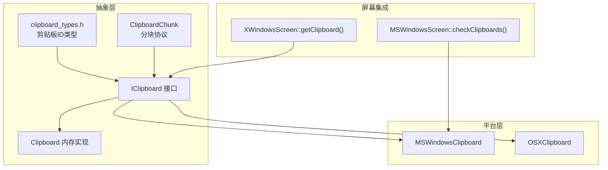
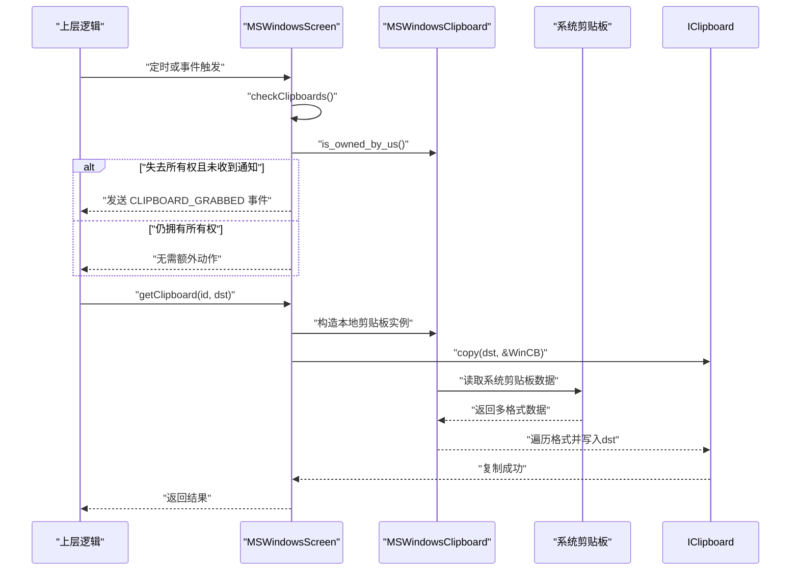
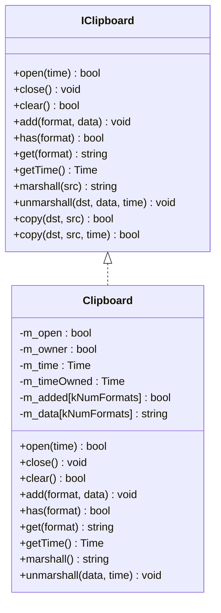
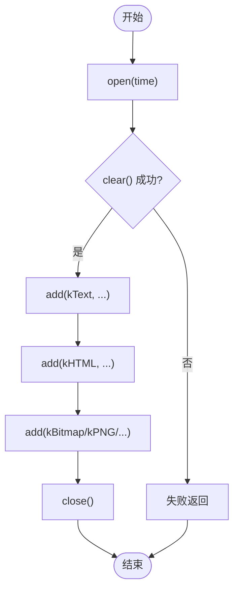
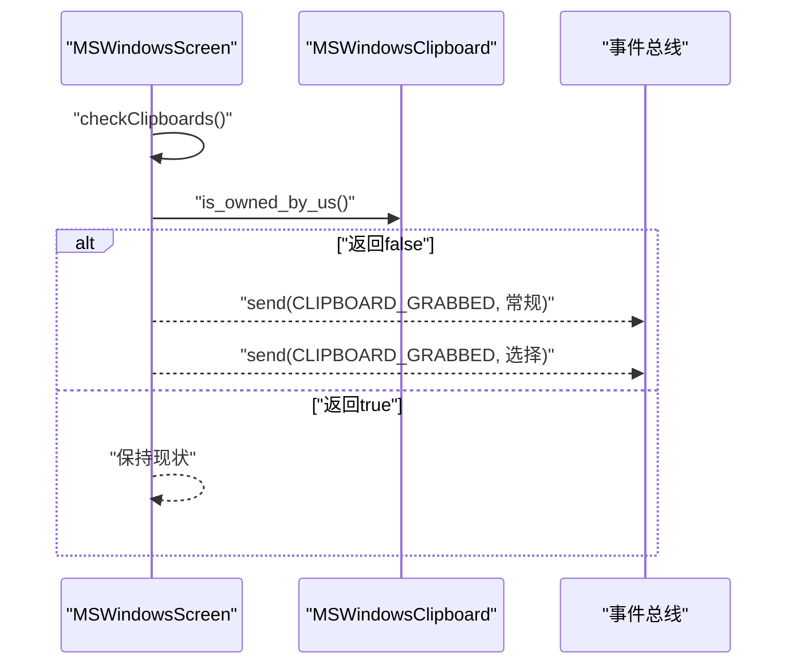
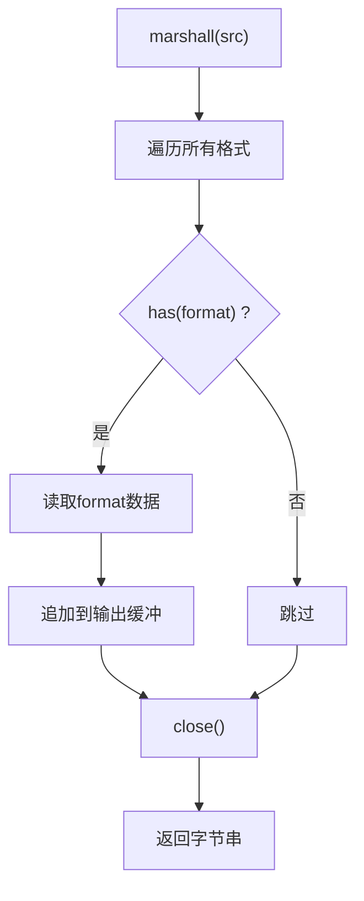
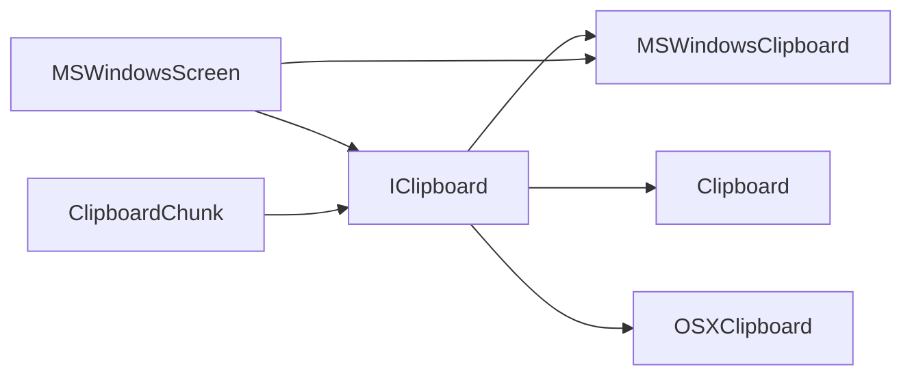

# 剪贴板接口

<cite>
**本文引用的文件**   
- [IClipboard.h](file://src/lib/inputleap/IClipboard.h)
- [IClipboard.cpp](file://src/lib/inputleap/IClipboard.cpp)
- [Clipboard.h](file://src/lib/inputleap/Clipboard.h)
- [Clipboard.cpp](file://src/lib/inputleap/Clipboard.cpp)
- [clipboard_types.h](file://src/lib/inputleap/clipboard_types.h)
- [MSWindowsClipboard.h](file://src/lib/platform/MSWindowsClipboard.h)
- [OSXClipboard.h](file://src/lib/platform/OSXClipboard.h)
- [MSWindowsScreen.cpp](file://src/lib/platform/MSWindowsScreen.cpp)
- [XWindowsScreen.cpp](file://src/lib/platform/XWindowsScreen.cpp)
- [ClipboardChunk.h](file://src/lib/inputleap/ClipboardChunk.h)
- [ClipboardChunk.cpp](file://src/lib/inputleap/ClipboardChunk.cpp)
</cite>

## 目录
1. [简介](#简介)
2. [项目结构](#项目结构)
3. [核心组件](#核心组件)
4. [架构总览](#架构总览)
5. [详细组件分析](#详细组件分析)
6. [依赖关系分析](#依赖关系分析)
7. [性能与内存管理](#性能与内存管理)
8. [故障排查指南](#故障排查指南)
9. [结论](#结论)
10. [附录：跨平台实现要点与示例路径](#附录跨平台实现要点与示例路径)

## 简介
本文件为 InputLeap 的剪贴板（Clipboard）接口提供系统化 API 文档，覆盖多格式数据管理、所有权处理、序列化/反序列化、以及不同平台的数据转换。重点说明：
- setClipboard() 的实现要求（通过 open/clear/add/close 序列完成）
- checkClipboards() 的所有权检查机制（以 Windows 为例）
- 文本、HTML、图像（BMP/PNG/JPEG/TIFF/WEBP）等格式的处理方式
- 完整的接口定义、数据类型说明与错误处理策略
- 跨平台共享的实践建议、性能优化与内存管理最佳实践

## 项目结构
剪贴板相关代码位于 lib/inputleap 与 lib/platform 两个层次：
- 抽象层：IClipboard 接口与内存实现 Clipboard，负责统一的数据格式、生命周期与编解码
- 平台层：各平台具体实现（如 MSWindowsClipboard、OSXClipboard），负责与系统剪贴板交互及格式转换
- 传输层：ClipboardChunk 用于分块传输大对象（如图片）

图示来源
- [IClipboard.h:24-177](file://src/lib/inputleap/IClipboard.h#L24-L177)
- [Clipboard.h:23-76](file://src/lib/inputleap/Clipboard.h#L23-L76)
- [clipboard_types.h:23-43](file://src/lib/inputleap/clipboard_types.h#L23-L43)
- [ClipboardChunk.h:27-53](file://src/lib/inputleap/ClipboardChunk.h#L27-L53)
- [MSWindowsClipboard.h:29-120](file://src/lib/platform/MSWindowsClipboard.h#L29-L120)
- [OSXClipboard.h:27-98](file://src/lib/platform/OSXClipboard.h#L27-L98)
- [MSWindowsScreen.cpp:403-423](file://src/lib/platform/MSWindowsScreen.cpp#L403-L423)
- [XWindowsScreen.cpp:454-469](file://src/lib/platform/XWindowsScreen.cpp#L454-L469)

章节来源
- [IClipboard.h:24-177](file://src/lib/inputleap/IClipboard.h#L24-L177)
- [Clipboard.h:23-76](file://src/lib/inputleap/Clipboard.h#L23-L76)
- [clipboard_types.h:23-43](file://src/lib/inputleap/clipboard_types.h#L23-L43)
- [ClipboardChunk.h:27-53](file://src/lib/inputleap/ClipboardChunk.h#L27-L53)
- [MSWindowsClipboard.h:29-120](file://src/lib/platform/MSWindowsClipboard.h#L29-L120)
- [OSXClipboard.h:27-98](file://src/lib/platform/OSXClipboard.h#L27-L98)
- [MSWindowsScreen.cpp:403-423](file://src/lib/platform/MSWindowsScreen.cpp#L403-L423)
- [XWindowsScreen.cpp:454-469](file://src/lib/platform/XWindowsScreen.cpp#L454-L469)

## 核心组件
- IClipboard 接口
  - 统一的生命周期：open(time)/close()
  - 数据操作：clear()/add(format, data)/has(format)/get(format)
  - 时间戳：getTime()
  - 静态工具：marshall()/unmarshall()/copy(dst, src[, time])
  - 支持格式：kText(kUTF-8/LF)、kHTML(kUTF-8/LF)、kBitmap(BMP INFOHEADER+像素)、kPNG/kJpeg/kTiff/kWebp
- Clipboard 内存实现
  - 维护 m_open/m_owner/m_time/m_timeOwned/m_added[]/m_data[]
  - clear() 会记录当前时间为“拥有时间”，并标记拥有者
- clipboard_types.h
  - 剪贴板标识：kClipboardClipboard(常规剪贴板)、kClipboardSelection(选择区)
- ClipboardChunk 分块协议
  - start/data/end 三段式消息，带 id 与 sequence，用于可靠传输大数据

章节来源
- [IClipboard.h:24-177](file://src/lib/inputleap/IClipboard.h#L24-L177)
- [IClipboard.cpp:25-146](file://src/lib/inputleap/IClipboard.cpp#L25-L146)
- [Clipboard.h:23-76](file://src/lib/inputleap/Clipboard.h#L23-L76)
- [Clipboard.cpp:24-117](file://src/lib/inputleap/Clipboard.cpp#L24-L117)
- [clipboard_types.h:23-43](file://src/lib/inputleap/clipboard_types.h#L23-L43)
- [ClipboardChunk.h:27-53](file://src/lib/inputleap/ClipboardChunk.h#L27-L53)
- [ClipboardChunk.cpp:38-86](file://src/lib/inputleap/ClipboardChunk.cpp#L38-L86)

## 架构总览
下图展示从高层 Screen 到平台剪贴板实现的调用链，以及所有权检查流程。

图示来源
- [MSWindowsScreen.cpp:403-423](file://src/lib/platform/MSWindowsScreen.cpp#L403-L423)
- [MSWindowsClipboard.h:35-88](file://src/lib/platform/MSWindowsClipboard.h#L35-L88)
- [IClipboard.cpp:121-146](file://src/lib/inputleap/IClipboard.cpp#L121-L146)

## 详细组件分析

### IClipboard 接口与内存实现
- 关键方法
  - open(time): 打开剪贴板会话，time 作为本次操作的基准时间戳
  - close(): 关闭会话
  - clear(): 清空并获取所有权（内存实现中设置 m_owner=true 与 m_timeOwned=m_time）
  - add(format, data): 添加指定格式数据
  - has(format)/get(format): 查询与读取
  - getTime(): 返回最近一次 clear() 的时间（即“拥有时间”）
  - marshall()/unmarshall(): 将多格式数据打包/解包为二进制流
  - copy(dst, src[, time]): 在两个剪贴板间拷贝所有可用格式，并同步时间戳
- 数据格式
  - kText: UTF-8，换行 LF
  - kHTML: UTF-8 HTML片段，换行 LF
  - kBitmap: BMP（INFOHEADER+像素数据）
  - kPNG/kJpeg/kTiff/kWebp: 对应图像格式
- 复杂度
  - marshall/unmarshall/copy 均为 O(F + Σ|data_i|)，F 为支持的格式数量

图示来源
- [IClipboard.h:24-177](file://src/lib/inputleap/IClipboard.h#L24-L177)
- [Clipboard.h:23-76](file://src/lib/inputleap/Clipboard.h#L23-L76)
- [IClipboard.cpp:25-146](file://src/lib/inputleap/IClipboard.cpp#L25-L146)
- [Clipboard.cpp:24-117](file://src/lib/inputleap/Clipboard.cpp#L24-L117)

章节来源
- [IClipboard.h:24-177](file://src/lib/inputleap/IClipboard.h#L24-L177)
- [IClipboard.cpp:25-146](file://src/lib/inputleap/IClipboard.cpp#L25-L146)
- [Clipboard.h:23-76](file://src/lib/inputleap/Clipboard.h#L23-L76)
- [Clipboard.cpp:24-117](file://src/lib/inputleap/Clipboard.cpp#L24-L117)

### 所有权与 setClipboard() 实现要求
- 所有权语义
  - 内存实现中，clear() 会将 m_owner 置为 true，并记录 m_timeOwned = m_time
  - 平台实现可能具备额外的“外部所有权”判断（例如 Windows 的 emptyUnowned/is_owned_by_us）
- setClipboard() 的正确实现步骤
  - 先 open(time)
  - 再 clear() 以获取所有权并清空旧数据
  - 依次 add(kText/kHTML/kBitmap/... ) 写入所需格式
  - 最后 close()
  - 若需要对外宣称“非自身写入”，可使用平台特定的无主清空（如 Windows 的 emptyUnowned）
- 注意事项
  - 必须在 open/close 之间进行 clear/add/has/get
  - 时间戳应保持一致性，避免重复传播或循环更新

图示来源
- [IClipboard.h:72-135](file://src/lib/inputleap/IClipboard.h#L72-L135)
- [Clipboard.cpp:38-66](file://src/lib/inputleap/Clipboard.cpp#L38-L66)
- [MSWindowsClipboard.h:41-57](file://src/lib/platform/MSWindowsClipboard.h#L41-L57)

章节来源
- [IClipboard.h:72-135](file://src/lib/inputleap/IClipboard.h#L72-L135)
- [Clipboard.cpp:38-66](file://src/lib/inputleap/Clipboard.cpp#L38-L66)
- [MSWindowsClipboard.h:41-57](file://src/lib/platform/MSWindowsClipboard.h#L41-L57)

### checkClipboards() 所有权检查机制（Windows）
- 目的：修复某些系统下 WM_DRAWCLIPBOARD 不触发的缺陷，定期校验是否仍拥有剪贴板
- 行为：
  - 若内部认为拥有但 is_owned_by_us() 返回 false，则重置状态并向服务器广播 CLIPBOARD_GRABBED 事件
- X11 平台：默认空实现（始终最新）

图示来源
- [MSWindowsScreen.cpp:403-423](file://src/lib/platform/MSWindowsScreen.cpp#L403-L423)
- [MSWindowsClipboard.h:56-57](file://src/lib/platform/MSWindowsClipboard.h#L56-L57)

章节来源
- [MSWindowsScreen.cpp:403-423](file://src/lib/platform/MSWindowsScreen.cpp#L403-L423)
- [MSWindowsClipboard.h:56-57](file://src/lib/platform/MSWindowsClipboard.h#L56-L57)
- [XWindowsScreen.cpp:381-385](file://src/lib/platform/XWindowsScreen.cpp#L381-L385)

### 数据格式与转换
- 文本与 HTML
  - 编码：UTF-8；换行：LF
  - 平台转换器负责与系统原生格式互转（如 Windows 的 ANSI/UTF-16/HTML 片段）
- 图像
  - 内部统一使用 BMP（INFOHEADER+像素）作为中间表示
  - 平台转换器可将 BMP 转换为 PNG/JPEG/TIFF/WEBP 等
- 转换接口
  - Windows: IMSWindowsClipboardConverter（fromIClipboard/toIClipboard）
  - macOS: IOSXClipboardConverter（fromIClipboard/toIClipboard）

章节来源
- [IClipboard.h:42-70](file://src/lib/inputleap/IClipboard.h#L42-L70)
- [MSWindowsClipboard.h:90-117](file://src/lib/platform/MSWindowsClipboard.h#L90-L117)
- [OSXClipboard.h:58-95](file://src/lib/platform/OSXClipboard.h#L58-L95)

### 序列化与网络传输
- marshall/unmarshall
  - 格式：[numFormats][format][size][data]...
  - 仅对已知格式（<kNumFormats）写入/读取，兼容版本差异
- 分块传输（ClipboardChunk）
  - start(id, sequence, size) / data(id, sequence, payload) / end(id, sequence)
  - 接收端按 sequence 组装，校验 id 范围，累计拼接后返回完整数据

图示来源
- [IClipboard.cpp:64-110](file://src/lib/inputleap/IClipboard.cpp#L64-L110)
- [ClipboardChunk.cpp:62-86](file://src/lib/inputleap/ClipboardChunk.cpp#L62-L86)

章节来源
- [IClipboard.cpp:64-110](file://src/lib/inputleap/IClipboard.cpp#L64-L110)
- [ClipboardChunk.h:27-53](file://src/lib/inputleap/ClipboardChunk.h#L27-L53)
- [ClipboardChunk.cpp:62-86](file://src/lib/inputleap/ClipboardChunk.cpp#L62-L86)

## 依赖关系分析
- 耦合与内聚
  - IClipboard 与 Clipboard 高内聚，屏蔽平台细节
  - 平台实现通过转换器与系统 API 交互，降低与上层耦合
- 直接/间接依赖
  - Screen 层依赖 IClipboard 与平台剪贴板类
  - 网络层依赖 ClipboardChunk 进行大数据传输
- 潜在循环依赖
  - 未见明显循环；平台类仅依赖抽象接口与转换器

图示来源
- [IClipboard.h:24-177](file://src/lib/inputleap/IClipboard.h#L24-L177)
- [Clipboard.h:23-76](file://src/lib/inputleap/Clipboard.h#L23-L76)
- [MSWindowsClipboard.h:29-120](file://src/lib/platform/MSWindowsClipboard.h#L29-L120)
- [OSXClipboard.h:27-98](file://src/lib/platform/OSXClipboard.h#L27-L98)
- [MSWindowsScreen.cpp:403-423](file://src/lib/platform/MSWindowsScreen.cpp#L403-L423)
- [ClipboardChunk.h:27-53](file://src/lib/inputleap/ClipboardChunk.h#L27-L53)

章节来源
- [IClipboard.h:24-177](file://src/lib/inputleap/IClipboard.h#L24-L177)
- [Clipboard.h:23-76](file://src/lib/inputleap/Clipboard.h#L23-L76)
- [MSWindowsClipboard.h:29-120](file://src/lib/platform/MSWindowsClipboard.h#L29-L120)
- [OSXClipboard.h:27-98](file://src/lib/platform/OSXClipboard.h#L27-L98)
- [MSWindowsScreen.cpp:403-423](file://src/lib/platform/MSWindowsScreen.cpp#L403-L423)
- [ClipboardChunk.h:27-53](file://src/lib/inputleap/ClipboardChunk.h#L27-L53)

## 性能与内存管理
- 批量拷贝优化
  - 使用 IClipboard::copy(dst, src) 一次性迁移所有格式，减少多次 open/close 开销
- 序列化优化
  - marshall 前预计算总大小并 reserve，避免多次扩容
- 大对象传输
  - 优先使用 ClipboardChunk 分块传输，避免单次分配过大内存
- 时间戳一致性
  - 合理传递 time，避免不必要的重复传播与循环
- 平台差异
  - Windows 需关注 is_owned_by_us 与 emptyUnowned 的使用场景，避免误判所有权导致重复上报

章节来源
- [IClipboard.cpp:64-110](file://src/lib/inputleap/IClipboard.cpp#L64-L110)
- [ClipboardChunk.cpp:62-86](file://src/lib/inputleap/ClipboardChunk.cpp#L62-L86)
- [MSWindowsClipboard.h:41-57](file://src/lib/platform/MSWindowsClipboard.h#L41-L57)

## 故障排查指南
- 现象：粘贴无效或内容缺失
  - 检查是否在 open/close 之间执行 clear/add/has/get
  - 确认 add 的 format 与目标应用期望一致（如 HTML 片段而非完整文档）
- 现象：频繁重复粘贴或循环传播
  - 核对 getTime() 与传入 time 的一致性，确保不会因时间回退触发重传
- 现象：Windows 上丢失所有权
  - 在 checkClipboards() 中检测 is_owned_by_us()，必要时广播 CLIPBOARD_GRABBED
- 现象：大图片卡顿或内存峰值过高
  - 改用 ClipboardChunk 分块传输；避免同时持有多个大图副本

章节来源
- [MSWindowsScreen.cpp:403-423](file://src/lib/platform/MSWindowsScreen.cpp#L403-L423)
- [IClipboard.cpp:64-110](file://src/lib/inputleap/IClipboard.cpp#L64-L110)
- [ClipboardChunk.cpp:62-86](file://src/lib/inputleap/ClipboardChunk.cpp#L62-L86)

## 结论
InputLeap 的剪贴板子系统通过统一的 IClipboard 接口屏蔽平台差异，结合内存实现与平台转换器，实现了多格式、跨平台的剪贴板共享。setClipboard() 的正确实现依赖于严格的生命周期管理与所有权语义；checkClipboards() 在所有权异常时主动恢复一致性；marshall/unmarshall 与 ClipboardChunk 提供了高效可靠的序列化与传输能力。遵循本文的性能与内存管理建议，可在保证正确性的前提下获得更优体验。

## 附录：跨平台实现要点与示例路径
- 通用流程
  - 打开：open(time)
  - 清空并获取所有权：clear()
  - 写入：add(kText/kHTML/kBitmap/...)
  - 关闭：close()
- Windows 特有
  - 无主清空：emptyUnowned()（用于让系统认为由其他应用写入）
  - 所有权检查：is_owned_by_us()
- macOS 特有
  - 同步：synchronize()（按需刷新系统剪贴板状态）
- 参考实现路径
  - 接口与内存实现：[IClipboard.h](file://src/lib/inputleap/IClipboard.h), [Clipboard.h](file://src/lib/inputleap/Clipboard.h)
  - 平台接口：[MSWindowsClipboard.h](file://src/lib/platform/MSWindowsClipboard.h), [OSXClipboard.h](file://src/lib/platform/OSXClipboard.h)
  - 所有权检查：[MSWindowsScreen.cpp](file://src/lib/platform/MSWindowsScreen.cpp)
  - 序列化与分块：[IClipboard.cpp](file://src/lib/inputleap/IClipboard.cpp), [ClipboardChunk.h/.cpp](file://src/lib/inputleap/ClipboardChunk.h)