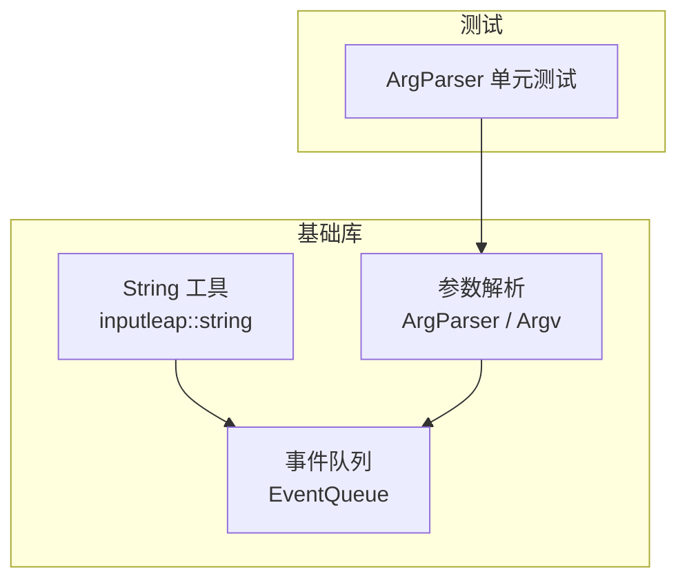
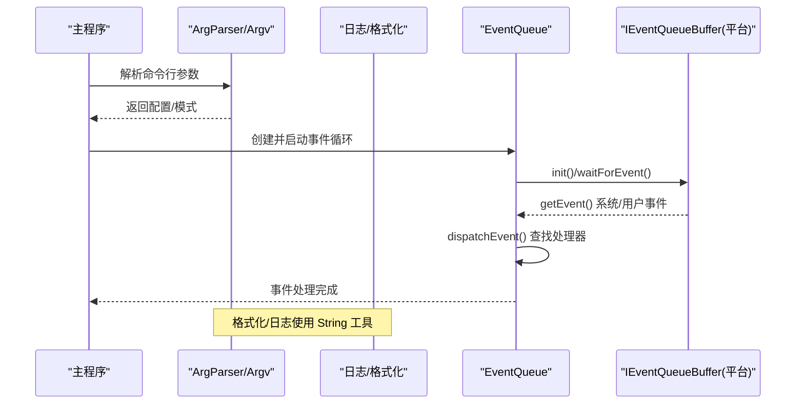
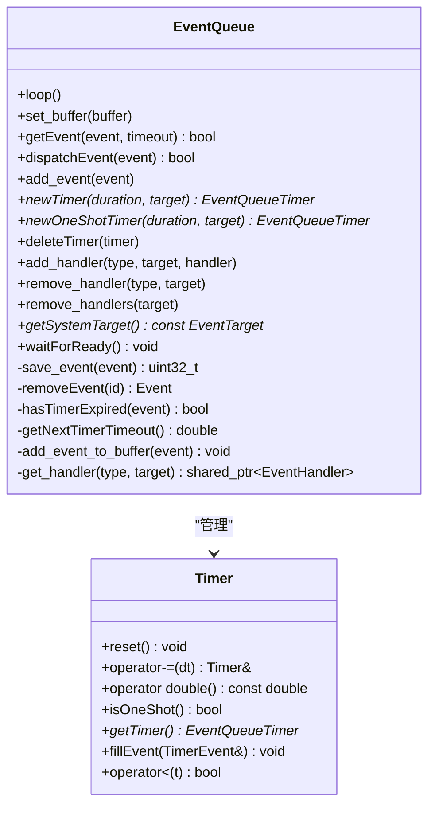
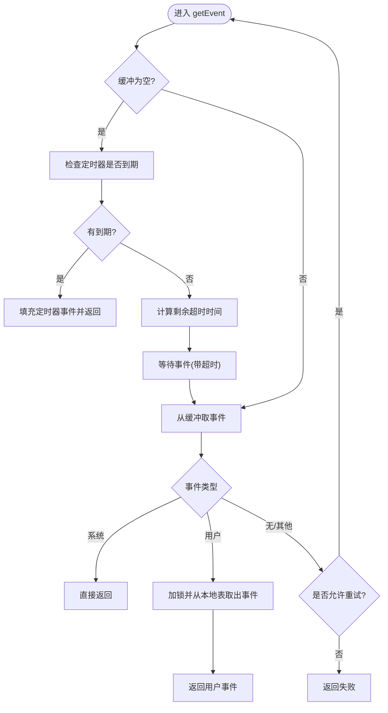
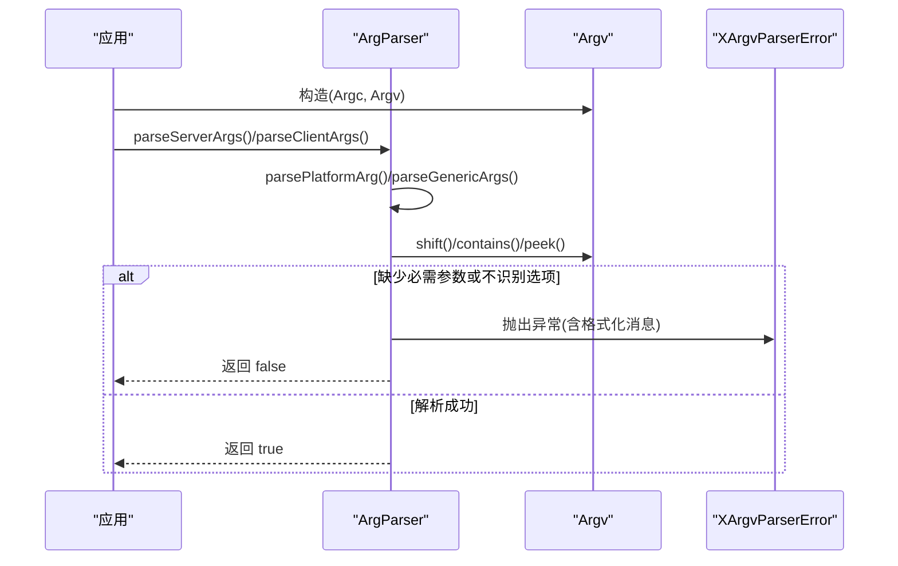
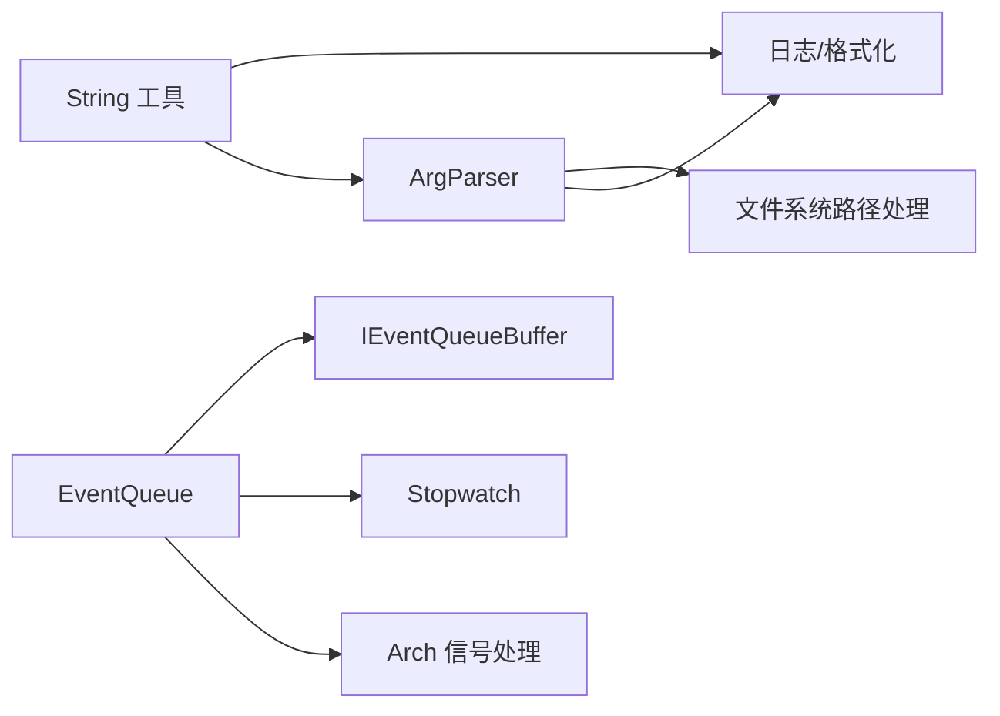

# 基础工具类

<cite>
**本文引用的文件**   
- [src/lib/base/String.h](file://src/lib/base/String.h)
- [src/lib/base/String.cpp](file://src/lib/base/String.cpp)
- [src/lib/base/EventQueue.h](file://src/lib/base/EventQueue.h)
- [src/lib/base/EventQueue.cpp](file://src/lib/base/EventQueue.cpp)
- [src/lib/inputleap/ArgParser.h](file://src/lib/inputleap/ArgParser.h)
- [src/lib/inputleap/ArgParser.cpp](file://src/lib/inputleap/ArgParser.cpp)
- [src/test/unittests/inputleap/ArgParserTests.cpp](file://src/test/unittests/inputleap/ArgParserTests.cpp)
</cite>

## 目录
1. [简介](#简介)
2. [项目结构](#项目结构)
3. [核心组件](#核心组件)
4. [架构总览](#架构总览)
5. [详细组件分析](#详细组件分析)
6. [依赖关系分析](#依赖关系分析)
7. [性能考虑](#性能考虑)
8. [故障排查指南](#故障排查指南)
9. [结论](#结论)
10. [附录](#附录)

## 简介
本文件为 Input Leap 的基础工具类与通用组件提供 API 文档，重点覆盖：
- 字符串处理工具 inputleap::string（静态方法与比较器）
- 事件队列 EventQueue 的事件管理机制、定时器与线程安全
- 命令行参数解析 ArgParser 与 Argv 的使用方法、异常处理与平台差异

文档包含接口说明、模板/类型说明、使用示例路径、线程安全性与性能要点，以及常见问题的定位方法。

## 项目结构
本次文档聚焦于以下模块：
- 字符串工具：inputleap::string（头文件与实现）
- 事件系统：EventQueue（头文件与实现）
- 参数解析：ArgParser 与 Argv（头文件与实现），并参考单元测试用例

图表来源
- [src/lib/base/String.h:1-137](file://src/lib/base/String.h#L1-L137)
- [src/lib/base/EventQueue.h:1-135](file://src/lib/base/EventQueue.h#L1-L135)
- [src/lib/inputleap/ArgParser.h:1-107](file://src/lib/inputleap/ArgParser.h#L1-L107)
- [src/test/unittests/inputleap/ArgParserTests.cpp:1-226](file://src/test/unittests/inputleap/ArgParserTests.cpp#L1-L226)

章节来源
- [src/lib/base/String.h:1-137](file://src/lib/base/String.h#L1-L137)
- [src/lib/base/EventQueue.h:1-135](file://src/lib/base/EventQueue.h#L1-L135)
- [src/lib/inputleap/ArgParser.h:1-107](file://src/lib/inputleap/ArgParser.h#L1-L107)

## 核心组件
本节概述三大基础组件的职责与关键能力：
- String 工具：提供格式化、大小写转换、十六进制编解码、分割等常用字符串操作；提供不区分大小写的比较器 CaselessCmp。
- EventQueue：跨平台事件循环的核心，负责事件入队/出队、分发、定时器管理、信号中断处理与线程安全。
- ArgParser/Argv：统一的命令行参数解析框架，支持通用选项、平台特定选项、错误抛出与日志输出。

章节来源
- [src/lib/base/String.h:1-137](file://src/lib/base/String.h#L1-L137)
- [src/lib/base/EventQueue.h:1-135](file://src/lib/base/EventQueue.h#L1-L135)
- [src/lib/inputleap/ArgParser.h:1-107](file://src/lib/inputleap/ArgParser.h#L1-L107)

## 架构总览
下图展示三个组件在系统中的角色与交互：
- String 工具被多处调用（包括参数解析与日志格式化）。
- EventQueue 作为事件驱动核心，接收系统/用户事件与定时器事件，按目标与类型分发给处理器。
- ArgParser 负责解析进程启动参数，设置运行模式与平台特性，必要时抛出 XArgvParserError。

图表来源
- [src/lib/inputleap/ArgParser.cpp:106-156](file://src/lib/inputleap/ArgParser.cpp#L106-L156)
- [src/lib/base/EventQueue.cpp:57-81](file://src/lib/base/EventQueue.cpp#L57-L81)
- [src/lib/base/EventQueue.cpp:110-167](file://src/lib/base/EventQueue.cpp#L110-L167)
- [src/lib/base/String.cpp:76-163](file://src/lib/base/String.cpp#L76-L163)

## 详细组件分析

### 字符串工具 inputleap::string
- 命名空间：inputleap::string
- 主要功能
  - 格式化：format/vformat/sprintf（支持位置占位符与可变参数）
  - 文本处理：findReplaceAll、removeFileExt、uppercase、removeChar、splitString
  - 编码转换：to_hex/from_hex
  - 数值转换：sizeTypeToString/stringToSizeType
  - 比较器：CaselessCmp（大小写不敏感比较）
- 复杂度与行为要点
  - findReplaceAll：线性扫描替换，时间 O(n)，注意替换串长度变化导致的索引推进
  - splitString：一次遍历拆分，时间 O(n)
  - to_hex/from_hex：O(n)，from_hex 对非法输入返回空容器
  - CaselessCmp：基于字符级 tolower 的字典序比较
- 线程安全性
  - 所有函数均为无状态纯函数或就地修改传入字符串，本身线程安全；但共享对象需外部同步
- 使用示例路径
  - 格式化用法参见：[src/lib/base/String.cpp:76-163](file://src/lib/base/String.cpp#L76-L163)
  - 十六进制编解码参见：[src/lib/base/String.cpp:226-262](file://src/lib/base/String.cpp#L226-L262)
  - 大小写不敏感比较参见：[src/lib/base/String.cpp:319-352](file://src/lib/base/String.cpp#L319-L352)

章节来源
- [src/lib/base/String.h:34-133](file://src/lib/base/String.h#L34-L133)
- [src/lib/base/String.cpp:76-163](file://src/lib/base/String.cpp#L76-L163)
- [src/lib/base/String.cpp:201-313](file://src/lib/base/String.cpp#L201-L313)
- [src/lib/base/String.cpp:319-352](file://src/lib/base/String.cpp#L319-L352)

### 事件队列 EventQueue
- 职责
  - 事件循环：loop() 初始化缓冲、等待事件、分发事件直至退出
  - 事件入队/出队：add_event/getEvent/dispatchEvent
  - 定时器：newTimer/newOneShotTimer/deleteTimer，内部维护优先级队列
  - 处理器注册：add_handler/remove_handler/remove_handlers
  - 系统目标：getSystemTarget
  - 就绪等待：waitForReady
- 关键数据结构
  - m_events：保存用户事件数据表
  - m_timerQueue：定时器优先级队列
  - m_timers：已注册定时器集合
  - m_handlers：目标到类型到处理器的映射
  - buffer_：平台相关 IEventQueueBuffer 抽象
- 线程安全
  - 通过互斥量保护事件表、处理器表与定时器队列
  - waitForReady 使用条件变量等待 loop 初始化完成
- 异常与错误处理
  - 将目标绑定到错误的 EventQueue 时抛出 std::invalid_argument
  - 超时未就绪时抛出运行时错误
- 使用示例路径
  - 事件循环与获取事件：[src/lib/base/EventQueue.cpp:57-81](file://src/lib/base/EventQueue.cpp#L57-L81)、[src/lib/base/EventQueue.cpp:110-167](file://src/lib/base/EventQueue.cpp#L110-L167)
  - 定时器创建与删除：[src/lib/base/EventQueue.cpp:227-280](file://src/lib/base/EventQueue.cpp#L227-L280)
  - 处理器注册与移除：[src/lib/base/EventQueue.cpp:282-331](file://src/lib/base/EventQueue.cpp#L282-L331)
  - 就绪等待：[src/lib/base/EventQueue.cpp:447-455](file://src/lib/base/EventQueue.cpp#L447-L455)

图表来源
- [src/lib/base/EventQueue.h:42-132](file://src/lib/base/EventQueue.h#L42-L132)
- [src/lib/base/EventQueue.cpp:461-521](file://src/lib/base/EventQueue.cpp#L461-L521)

图表来源
- [src/lib/base/EventQueue.cpp:110-167](file://src/lib/base/EventQueue.cpp#L110-L167)
- [src/lib/base/EventQueue.cpp:385-440](file://src/lib/base/EventQueue.cpp#L385-L440)

章节来源
- [src/lib/base/EventQueue.h:42-132](file://src/lib/base/EventQueue.h#L42-L132)
- [src/lib/base/EventQueue.cpp:40-81](file://src/lib/base/EventQueue.cpp#L40-L81)
- [src/lib/base/EventQueue.cpp:110-167](file://src/lib/base/EventQueue.cpp#L110-L167)
- [src/lib/base/EventQueue.cpp:227-280](file://src/lib/base/EventQueue.cpp#L227-L280)
- [src/lib/base/EventQueue.cpp:282-331](file://src/lib/base/EventQueue.cpp#L282-L331)
- [src/lib/base/EventQueue.cpp:385-440](file://src/lib/base/EventQueue.cpp#L385-L440)
- [src/lib/base/EventQueue.cpp:447-455](file://src/lib/base/EventQueue.cpp#L447-L455)

### 命令行参数解析 ArgParser 与 Argv
- Argv
  - 作用：封装 argc/argv，提供 shift/peek/contains/empty/size/exename 等便捷方法
  - 一次性使用：当 empty() 为真后应丢弃并重新构造
- ArgParser
  - 作用：统一解析服务器/客户端/平台/通用参数，设置 ArgsBase 字段
  - 通用选项：调试级别、日志文件、守护进程、名称、重启策略、拖放、加密、插件目录等
  - 平台选项：Windows/Cocoa/X11/LibEI 等平台特定开关
  - 错误处理：XArgvParserError 携带格式化消息，并在解析失败时打印并返回 false
- 使用示例路径
  - 基本 shift 与 optarg 提取：[src/test/unittests/inputleap/ArgParserTests.cpp:42-74](file://src/test/unittests/inputleap/ArgParserTests.cpp#L42-L74)
  - 双引号分割与命令组装：[src/test/unittests/inputleap/ArgParserTests.cpp:76-226](file://src/test/unittests/inputleap/ArgParserTests.cpp#L76-L226)
  - 通用参数解析流程：[src/lib/inputleap/ArgParser.cpp:345-454](file://src/lib/inputleap/ArgParser.cpp#L345-L454)
  - 服务器/客户端解析入口：[src/lib/inputleap/ArgParser.cpp:106-211](file://src/lib/inputleap/ArgParser.cpp#L106-L211)

图表来源
- [src/lib/inputleap/ArgParser.cpp:106-211](file://src/lib/inputleap/ArgParser.cpp#L106-L211)
- [src/lib/inputleap/ArgParser.cpp:345-454](file://src/lib/inputleap/ArgParser.cpp#L345-L454)
- [src/lib/inputleap/ArgParser.cpp:35-45](file://src/lib/inputleap/ArgParser.cpp#L35-L45)

章节来源
- [src/lib/inputleap/ArgParser.h:27-107](file://src/lib/inputleap/ArgParser.h#L27-L107)
- [src/lib/inputleap/ArgParser.cpp:35-45](file://src/lib/inputleap/ArgParser.cpp#L35-L45)
- [src/lib/inputleap/ArgParser.cpp:106-211](file://src/lib/inputleap/ArgParser.cpp#L106-L211)
- [src/lib/inputleap/ArgParser.cpp:345-454](file://src/lib/inputleap/ArgParser.cpp#L345-L454)
- [src/test/unittests/inputleap/ArgParserTests.cpp:42-226](file://src/test/unittests/inputleap/ArgParserTests.cpp#L42-L226)

## 依赖关系分析
- String 工具
  - 被日志与参数解析广泛使用（例如格式化消息、路径/文件名处理）
- EventQueue
  - 依赖平台缓冲 IEventQueueBuffer（SimpleEventQueueBuffer 默认实现）
  - 依赖 Stopwatch 进行计时
  - 依赖 Arch 信号处理以注入退出事件
- ArgParser
  - 依赖文件系统路径处理与日志输出
  - 依赖 App 回调以输出帮助/版本信息

图表来源
- [src/lib/base/String.cpp:76-163](file://src/lib/base/String.cpp#L76-L163)
- [src/lib/inputleap/ArgParser.cpp:18-27](file://src/lib/inputleap/ArgParser.cpp#L18-L27)
- [src/lib/base/EventQueue.cpp:19-27](file://src/lib/base/EventQueue.cpp#L19-L27)

章节来源
- [src/lib/base/String.cpp:76-163](file://src/lib/base/String.cpp#L76-L163)
- [src/lib/inputleap/ArgParser.cpp:18-27](file://src/lib/inputleap/ArgParser.cpp#L18-L27)
- [src/lib/base/EventQueue.cpp:19-27](file://src/lib/base/EventQueue.cpp#L19-L27)

## 性能考虑
- String 工具
  - 优先使用 reserve 预分配（如 vformat 内部会预估长度）
  - 大量 findReplaceAll 场景建议评估替换频率与串长，避免频繁重分配
  - from_hex/to_hex 适合小中规模数据；超大二进制建议使用流式处理
- EventQueue
  - getEvent 在空闲时会结合定时器最短到期时间减少阻塞等待
  - 用户事件采用 ID 复用机制降低内存碎片
  - 定时器使用优先级队列，插入/弹出为对数复杂度
- ArgParser
  - 解析过程为线性扫描，开销较小；应避免重复构造 Argv
  - 长参数列表下，尽量集中解析，减少多次遍历

## 故障排查指南
- 事件队列未就绪
  - 现象：waitForReady 超时抛出运行时错误
  - 排查：确认 loop() 已在独立线程启动且正常执行
  - 参考：[src/lib/base/EventQueue.cpp:447-455](file://src/lib/base/EventQueue.cpp#L447-L455)
- 事件处理器未触发
  - 现象：事件未被处理
  - 排查：确认 add_handler 的目标与类型正确；检查 remove_handlers 是否误删
  - 参考：[src/lib/base/EventQueue.cpp:282-331](file://src/lib/base/EventQueue.cpp#L282-L331)
- 定时器未按期触发
  - 现象：定时器事件延迟或丢失
  - 排查：检查 newTimer/newOneShotTimer 的 duration 是否为正；确认 deleteTimer 未提前销毁
  - 参考：[src/lib/base/EventQueue.cpp:227-280](file://src/lib/base/EventQueue.cpp#L227-L280)
- 参数解析失败
  - 现象：抛出 XArgvParserError 并打印错误信息
  - 排查：核对必填参数是否存在、选项拼写是否正确；查看日志中的 exename 与消息
  - 参考：[src/lib/inputleap/ArgParser.cpp:35-45](file://src/lib/inputleap/ArgParser.cpp#L35-L45)、[src/lib/inputleap/ArgParser.cpp:106-211](file://src/lib/inputleap/ArgParser.cpp#L106-L211)

章节来源
- [src/lib/base/EventQueue.cpp:447-455](file://src/lib/base/EventQueue.cpp#L447-L455)
- [src/lib/base/EventQueue.cpp:227-280](file://src/lib/base/EventQueue.cpp#L227-L280)
- [src/lib/base/EventQueue.cpp:282-331](file://src/lib/base/EventQueue.cpp#L282-L331)
- [src/lib/inputleap/ArgParser.cpp:35-45](file://src/lib/inputleap/ArgParser.cpp#L35-L45)
- [src/lib/inputleap/ArgParser.cpp:106-211](file://src/lib/inputleap/ArgParser.cpp#L106-L211)

## 结论
- String 工具提供了稳定高效的字符串处理能力，适用于日志、配置与网络数据的格式化和转换。
- EventQueue 实现了跨平台、线程安全的事件循环与定时器机制，是应用事件驱动架构的核心。
- ArgParser/Argv 提供了统一的参数解析框架，具备清晰的错误报告与平台扩展点。
- 在实际项目中，建议遵循上述线程安全与性能建议，并结合单元测试验证关键路径。

## 附录
- 使用示例路径汇总
  - 字符串格式化与十六进制编解码：[src/lib/base/String.cpp:76-163](file://src/lib/base/String.cpp#L76-L163)、[src/lib/base/String.cpp:226-262](file://src/lib/base/String.cpp#L226-L262)
  - 事件循环与定时器：[src/lib/base/EventQueue.cpp:57-81](file://src/lib/base/EventQueue.cpp#L57-L81)、[src/lib/base/EventQueue.cpp:227-280](file://src/lib/base/EventQueue.cpp#L227-L280)
  - 参数解析与异常：[src/lib/inputleap/ArgParser.cpp:106-211](file://src/lib/inputleap/ArgParser.cpp#L106-L211)、[src/test/unittests/inputleap/ArgParserTests.cpp:42-226](file://src/test/unittests/inputleap/ArgParserTests.cpp#L42-L226)