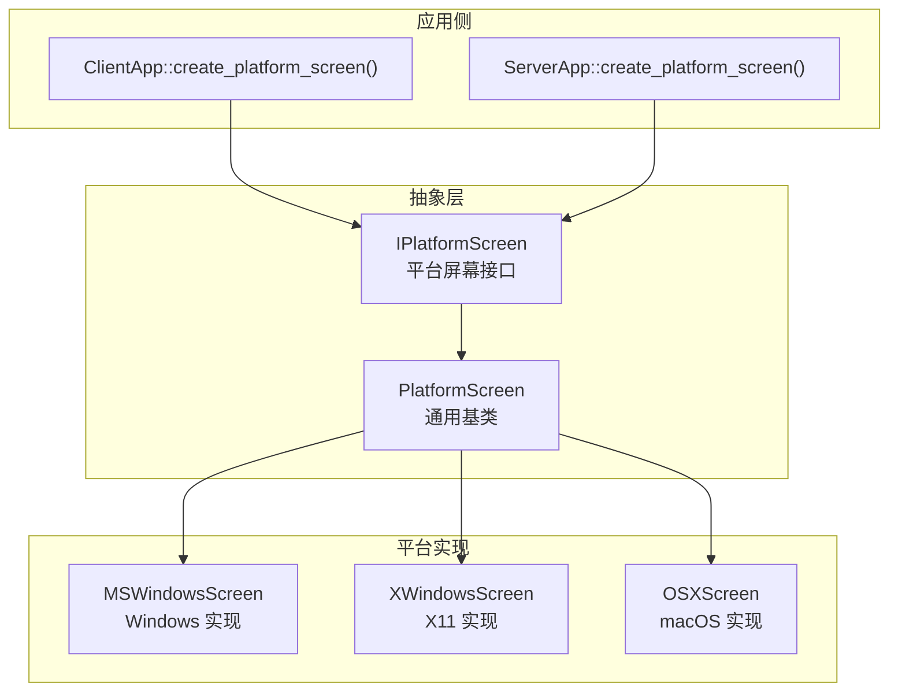
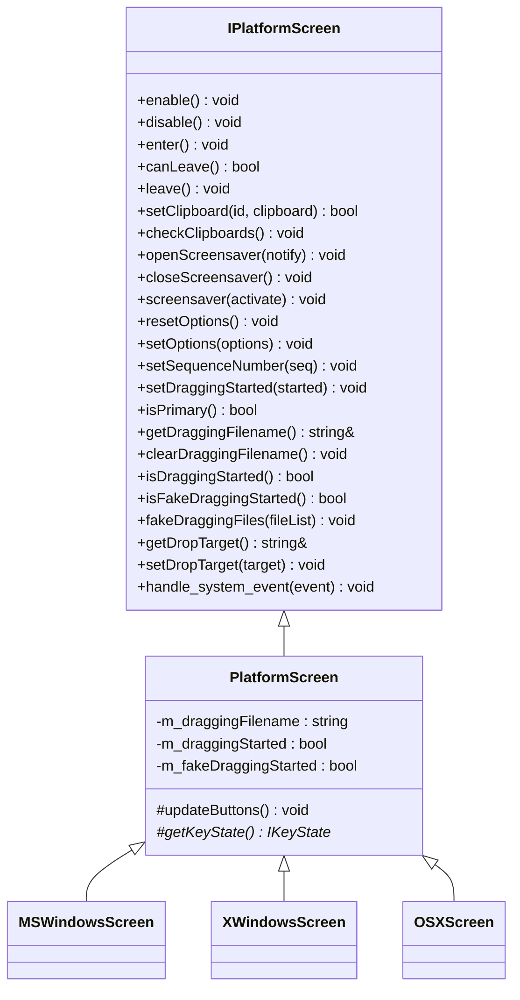
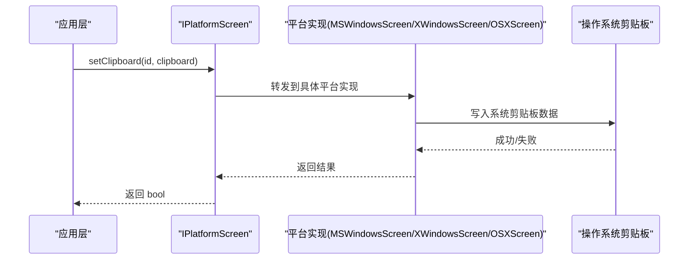
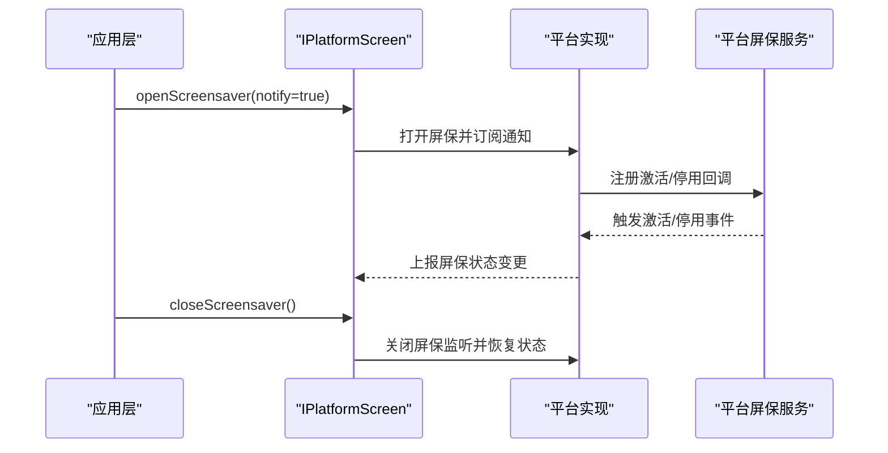
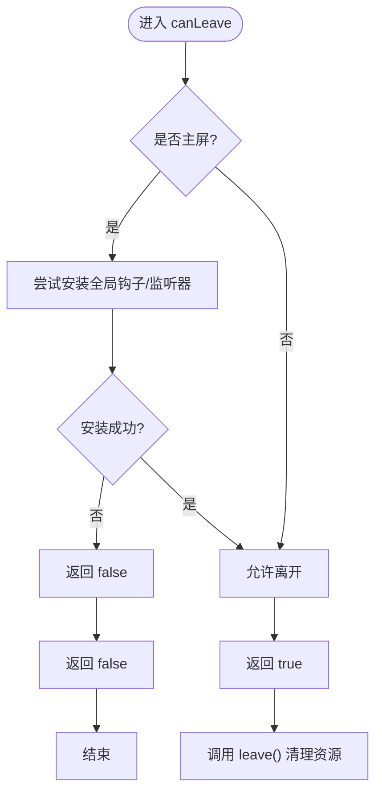
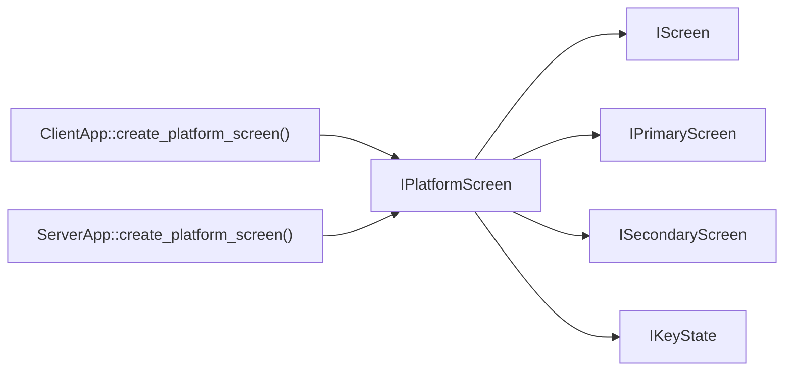

# 平台屏幕接口

<cite>
**本文引用的文件**   
- [IPlatformScreen.h](file://src/lib/inputleap/IPlatformScreen.h)
- [PlatformScreen.h](file://src/lib/inputleap/PlatformScreen.h)
- [MSWindowsScreen.h](file://src/lib/platform/MSWindowsScreen.h)
- [XWindowsScreen.h](file://src/lib/platform/XWindowsScreen.h)
- [OSXScreen.h](file://src/lib/platform/OSXScreen.h)
- [clipboard_types.h](file://src/lib/inputleap/clipboard_types.h)
- [option_types.h](file://src/lib/inputleap/option_types.h)
- [ClientApp.cpp](file://src/lib/inputleap/ClientApp.cpp)
- [ServerApp.cpp](file://src/lib/inputleap/ServerApp.cpp)
</cite>

## 目录
1. [简介](#简介)
2. [项目结构](#项目结构)
3. [核心组件](#核心组件)
4. [架构总览](#架构总览)
5. [详细组件分析](#详细组件分析)
6. [依赖关系分析](#依赖关系分析)
7. [性能考虑](#性能考虑)
8. [故障排查指南](#故障排查指南)
9. [结论](#结论)
10. [附录](#附录)

## 简介
本文件为 IPlatformScreen 平台抽象接口的权威 API 文档。该接口统一了不同操作系统（Windows、X11、macOS）的屏幕操作，包括生命周期管理（enable/disable）、屏幕切换处理（enter/canLeave/leave）、剪贴板操作（setClipboard/checkClipboards）、屏幕保护程序控制（openScreensaver/closeScreensaver/screensaver），以及选项更新、拖拽状态与系统事件处理等能力。通过统一的虚函数契约，上层逻辑无需关心底层平台差异即可实现跨平台的输入共享与协同。

## 项目结构
IPlatformScreen 位于输入输出抽象层，作为平台无关的屏幕接口；各平台提供具体实现类继承自公共基类 PlatformScreen，并最终由应用侧在运行时根据平台选择具体实现。

图示来源
- [IPlatformScreen.h:37-185](file://src/lib/inputleap/IPlatformScreen.h#L37-L185)
- [PlatformScreen.h:34-91](file://src/lib/inputleap/PlatformScreen.h#L34-L91)
- [MSWindowsScreen.h:41-126](file://src/lib/platform/MSWindowsScreen.h#L41-L126)
- [XWindowsScreen.h:38-88](file://src/lib/platform/XWindowsScreen.h#L38-L88)
- [OSXScreen.h:52-98](file://src/lib/platform/OSXScreen.h#L52-L98)
- [ClientApp.cpp:533-554](file://src/lib/inputleap/ClientApp.cpp#L533-L554)
- [ServerApp.cpp:890-911](file://src/lib/inputleap/ServerApp.cpp#L890-L911)

章节来源
- [IPlatformScreen.h:37-185](file://src/lib/inputleap/IPlatformScreen.h#L37-L185)
- [PlatformScreen.h:34-91](file://src/lib/inputleap/PlatformScreen.h#L34-L91)
- [ClientApp.cpp:533-554](file://src/lib/inputleap/ClientApp.cpp#L533-L554)
- [ServerApp.cpp:890-911](file://src/lib/inputleap/ServerApp.cpp#L890-L911)

## 核心组件
- IPlatformScreen：定义所有平台必须实现的屏幕抽象接口，涵盖生命周期、切换、剪贴板、屏保、选项、拖拽与系统事件处理。
- PlatformScreen：提供部分通用实现与默认行为，要求子类实现关键方法（如 updateButtons/getKeyState）。
- 平台实现：MSWindowsScreen、XWindowsScreen、OSXScreen 分别针对 Windows、X11、macOS 完成具体系统调用与事件分发。

章节来源
- [IPlatformScreen.h:37-185](file://src/lib/inputleap/IPlatformScreen.h#L37-L185)
- [PlatformScreen.h:34-91](file://src/lib/inputleap/PlatformScreen.h#L34-L91)
- [MSWindowsScreen.h:41-126](file://src/lib/platform/MSWindowsScreen.h#L41-L126)
- [XWindowsScreen.h:38-88](file://src/lib/platform/XWindowsScreen.h#L38-L88)
- [OSXScreen.h:52-98](file://src/lib/platform/OSXScreen.h#L52-L98)

## 架构总览
IPlatformScreen 同时聚合了多个子接口能力：IScreen（屏幕基础信息）、IPrimaryScreen（主屏能力）、ISecondaryScreen（副屏能力）、IKeyState（键盘状态）。平台实现类通过继承 PlatformScreen 复用通用逻辑，并在构造函数中注册系统事件处理器，将底层事件转换为 IScreen/IPrimaryScreen/ISecondaryScreen 事件。

图示来源
- [IPlatformScreen.h:37-185](file://src/lib/inputleap/IPlatformScreen.h#L37-L185)
- [PlatformScreen.h:34-91](file://src/lib/inputleap/PlatformScreen.h#L34-L91)
- [MSWindowsScreen.h:41-126](file://src/lib/platform/MSWindowsScreen.h#L41-L126)
- [XWindowsScreen.h:38-88](file://src/lib/platform/XWindowsScreen.h#L38-L88)
- [OSXScreen.h:52-98](file://src/lib/platform/OSXScreen.h#L52-L98)

## 详细组件分析

### 虚函数接口定义与语义说明
以下按功能域对 IPlatformScreen 的核心方法进行说明。为避免泄露实现细节，本节仅给出参数类型、返回值与行为约定，并附带“代码片段路径”以便查阅源码。

- 生命周期管理
  - enable(): 启用屏幕，准备上报系统/用户事件；副屏还需准备合成事件并隐藏光标。
    - 返回：无
    - 线程安全：应在 UI/事件循环线程或平台指定线程调用
    - 代码片段路径：[IPlatformScreen.h:50](file://src/lib/inputleap/IPlatformScreen.h#L50)
  - disable(): 撤销 enable() 的操作，停止上报事件。
    - 返回：无
    - 代码片段路径：[IPlatformScreen.h:57](file://src/lib/inputleap/IPlatformScreen.h#L57)

- 屏幕切换处理
  - enter(): 用户进入当前屏幕时调用。
    - 返回：无
    - 代码片段路径：[IPlatformScreen.h:63](file://src/lib/inputleap/IPlatformScreen.h#L63)
  - canLeave(): 尝试离开前检查是否允许离开（例如主屏无法安装钩子时应失败）。
    - 返回：true 表示可以离开
    - 代码片段路径：[IPlatformScreen.h:72](file://src/lib/inputleap/IPlatformScreen.h#L72)
  - leave(): 实际执行离开逻辑，应受 canLeave() 保护。
    - 返回：无
    - 代码片段路径：[IPlatformScreen.h:79](file://src/lib/inputleap/IPlatformScreen.h#L79)

- 剪贴板操作
  - setClipboard(id, clipboard): 设置指定 id 的系统剪贴板内容。
    - 参数：id 为 ClipboardID；clipboard 为只读指针
    - 返回：bool 表示成功与否
    - 代码片段路径：[IPlatformScreen.h:85](file://src/lib/inputleap/IPlatformScreen.h#L85)
  - checkClipboards(): 轮询所有剪贴板所有权变化并发布抓取事件，用于系统不可靠时的后备机制。
    - 返回：无
    - 代码片段路径：[IPlatformScreen.h:93](file://src/lib/inputleap/IPlatformScreen.h#L93)

- 屏幕保护程序控制
  - openScreensaver(notify): 打开屏保。notify=true 时需持续上报激活/停用事件直到 closeScreensaver()；notify=false 则禁用屏保并在 closeScreensaver() 恢复。
    - 参数：notify 布尔
    - 返回：无
    - 代码片段路径：[IPlatformScreen.h:102](file://src/lib/inputleap/IPlatformScreen.h#L102)
  - closeScreensaver(): 关闭屏保监听，必要时恢复屏保。
    - 返回：无
    - 代码片段路径：[IPlatformScreen.h:110](file://src/lib/inputleap/IPlatformScreen.h#L110)
  - screensaver(activate): 强制激活或停用电屏保。
    - 参数：activate 布尔
    - 返回：无
    - 代码片段路径：[IPlatformScreen.h:117](file://src/lib/inputleap/IPlatformScreen.h#L117)

- 选项更新
  - resetOptions(): 将所有选项重置为默认值。
    - 返回：无
    - 代码片段路径：[IPlatformScreen.h:123](file://src/lib/inputleap/IPlatformScreen.h#L123)
  - setOptions(options): 设置给定选项集合，忽略未知项且不修改未提供的选项。
    - 参数：options 为 OptionsList（uint32 序列）
    - 返回：无
    - 代码片段路径：[IPlatformScreen.h:130](file://src/lib/inputleap/IPlatformScreen.h#L130)

- 剪贴板序列号与拖拽状态
  - setSequenceNumber(seq): 设置后续剪贴板事件的序列号。
    - 参数：seq 为 uint32
    - 返回：无
    - 代码片段路径：[IPlatformScreen.h:136](file://src/lib/inputleap/IPlatformScreen.h#L136)
  - setDraggingStarted(started): 设置拖拽开始标志。
    - 参数：started 布尔
    - 返回：无
    - 代码片段路径：[IPlatformScreen.h:139](file://src/lib/inputleap/IPlatformScreen.h#L139)
  - isPrimary(): 判断是否为主屏。
    - 返回：bool
    - 代码片段路径：[IPlatformScreen.h:149](file://src/lib/inputleap/IPlatformScreen.h#L149)
  - getDraggingFilename()/clearDraggingFilename()/isDraggingStarted()/isFakeDraggingStarted(): 获取/清除拖拽文件名与状态查询。
    - 代码片段路径：[IPlatformScreen.h:153-156](file://src/lib/inputleap/IPlatformScreen.h#L153-L156)
  - fakeDraggingFiles(fileList)/getDropTarget()/setDropTarget(target): 模拟拖拽文件列表、获取/设置放置目标。
    - 代码片段路径：[IPlatformScreen.h:158-160](file://src/lib/inputleap/IPlatformScreen.h#L158-L160)

- 系统事件处理
  - handle_system_event(event): 平台屏幕应在构造时注册系统事件处理器，析构时移除；重写此方法以处理系统事件并按需发布 IScreen/IPrimaryScreen 事件。
    - 参数：event 为 Event 引用
    - 返回：无
    - 代码片段路径：[IPlatformScreen.h:184](file://src/lib/inputleap/IPlatformScreen.h#L184)

章节来源
- [IPlatformScreen.h:50-184](file://src/lib/inputleap/IPlatformScreen.h#L50-L184)

### 类型与常量参考
- ClipboardID：剪贴板标识符类型（uint8_t），包含 kClipboardClipboard、kClipboardSelection、kClipboardEnd 等常量。
  - 代码片段路径：[clipboard_types.h:27-42](file://src/lib/inputleap/clipboard_types.h#L27-L42)
- OptionsList：选项列表类型为 std::vector<uint32_t>，配合 OPTION_CODE 宏将四字符字符串打包为 OptionID。
  - 代码片段路径：[option_types.h:37-44](file://src/lib/inputleap/option_types.h#L37-L44)

章节来源
- [clipboard_types.h:27-42](file://src/lib/inputleap/clipboard_types.h#L27-L42)
- [option_types.h:37-44](file://src/lib/inputleap/option_types.h#L37-L44)

### 平台实现要点与示例路径
- Windows（MSWindowsScreen）
  - 覆盖 enable/disable/enter/canLeave/leave、剪贴板、屏保、选项、拖拽与系统事件处理等方法。
  - 示例路径：
    - [MSWindowsScreen.h:108-126](file://src/lib/platform/MSWindowsScreen.h#L108-L126)
    - [MSWindowsScreen.h:129-131](file://src/lib/platform/MSWindowsScreen.h#L129-L131)
- X11（XWindowsScreen）
  - 覆盖相同接口集，并通过 X11 扩展与事件模型进行适配。
  - 示例路径：
    - [XWindowsScreen.h:75-88](file://src/lib/platform/XWindowsScreen.h#L75-L88)
    - [XWindowsScreen.h:92-94](file://src/lib/platform/XWindowsScreen.h#L92-L94)
- macOS（OSXScreen）
  - 覆盖相同接口集，使用 Quartz/Carbon 事件与 IOKit 电源管理。
  - 示例路径：
    - [OSXScreen.h:85-98](file://src/lib/platform/OSXScreen.h#L85-L98)
    - [OSXScreen.h:107-109](file://src/lib/platform/OSXScreen.h#L107-L109)

章节来源
- [MSWindowsScreen.h:108-131](file://src/lib/platform/MSWindowsScreen.h#L108-L131)
- [XWindowsScreen.h:75-94](file://src/lib/platform/XWindowsScreen.h#L75-L94)
- [OSXScreen.h:85-109](file://src/lib/platform/OSXScreen.h#L85-L109)

### 典型调用时序（剪贴板写入）

图示来源
- [IPlatformScreen.h:85](file://src/lib/inputleap/IPlatformScreen.h#L85)
- [MSWindowsScreen.h:113](file://src/lib/platform/MSWindowsScreen.h#L113)
- [XWindowsScreen.h:80](file://src/lib/platform/XWindowsScreen.h#L80)
- [OSXScreen.h:90](file://src/lib/platform/OSXScreen.h#L90)

### 典型调用时序（屏幕保护程序）

图示来源
- [IPlatformScreen.h:102-110](file://src/lib/inputleap/IPlatformScreen.h#L102-L110)
- [MSWindowsScreen.h:115-117](file://src/lib/platform/MSWindowsScreen.h#L115-L117)
- [XWindowsScreen.h:82-84](file://src/lib/platform/XWindowsScreen.h#L82-L84)
- [OSXScreen.h:92-94](file://src/lib/platform/OSXScreen.h#L92-L94)

### 复杂逻辑流程图（canLeave/leave 决策）

图示来源
- [IPlatformScreen.h:72-79](file://src/lib/inputleap/IPlatformScreen.h#L72-L79)
- [MSWindowsScreen.h:111-112](file://src/lib/platform/MSWindowsScreen.h#L111-L112)
- [XWindowsScreen.h:78-79](file://src/lib/platform/XWindowsScreen.h#L78-L79)
- [OSXScreen.h:88-89](file://src/lib/platform/OSXScreen.h#L88-L89)

## 依赖关系分析
- 接口聚合：IPlatformScreen 聚合 IScreen、IPrimaryScreen、ISecondaryScreen、IKeyState 的能力，形成统一的屏幕抽象。
- 平台选择：ClientApp/ServerApp 根据编译期宏与运行参数创建具体平台实现（MSWindowsScreen、XWindowsScreen、OSXScreen）。
- 事件驱动：平台实现在构造时注册系统事件处理器，析构时移除，确保事件生命周期与对象一致。

图示来源
- [IPlatformScreen.h:37-39](file://src/lib/inputleap/IPlatformScreen.h#L37-L39)
- [ClientApp.cpp:533-554](file://src/lib/inputleap/ClientApp.cpp#L533-L554)
- [ServerApp.cpp:890-911](file://src/lib/inputleap/ServerApp.cpp#L890-L911)

章节来源
- [IPlatformScreen.h:37-39](file://src/lib/inputleap/IPlatformScreen.h#L37-L39)
- [ClientApp.cpp:533-554](file://src/lib/inputleap/ClientApp.cpp#L533-L554)
- [ServerApp.cpp:890-911](file://src/lib/inputleap/ServerApp.cpp#L890-L911)

## 性能考虑
- 事件批处理与节流：避免在高频事件（鼠标移动、滚轮）中频繁调用系统 API，建议合并或节流。
- 剪贴板同步：仅在检测到变化时同步，减少不必要的读写；使用 setSequenceNumber 辅助去抖。
- 钩子/监听器安装：canLeave 失败时应快速返回，避免阻塞主流程。
- 屏保通知：仅在 notify=true 时注册回调，降低常驻开销。
- 线程亲和性：UI/事件相关操作应在平台指定线程执行，避免跨线程直接调用原生 API。

## 故障排查指南
- 剪贴板不同步
  - 现象：远端剪贴板未更新或重复推送。
  - 排查：确认 setSequenceNumber 是否正确递增；检查 checkClipboards 是否被周期性调用；验证平台实现是否正确处理所有权变更。
  - 参考路径：[IPlatformScreen.h:85-93](file://src/lib/inputleap/IPlatformScreen.h#L85-L93)
- 屏幕切换卡住
  - 现象：canLeave 返回 false 导致无法离开。
  - 排查：检查主屏钩子/监听器安装是否失败；确认 leave 清理逻辑是否被执行。
  - 参考路径：[IPlatformScreen.h:72-79](file://src/lib/inputleap/IPlatformScreen.h#L72-L79)
- 屏保状态异常
  - 现象：openScreensaver 后未收到激活/停用事件或无法恢复。
  - 排查：确认 notify 参数与回调注册；检查 closeScreensaver 是否被调用以恢复状态。
  - 参考路径：[IPlatformScreen.h:102-110](file://src/lib/inputleap/IPlatformScreen.h#L102-L110)

章节来源
- [IPlatformScreen.h:85-110](file://src/lib/inputleap/IPlatformScreen.h#L85-L110)

## 结论
IPlatformScreen 通过统一的虚函数契约屏蔽了多平台差异，使上层业务能够以一致的方式管理屏幕生命周期、切换、剪贴板与屏保等行为。平台实现遵循相同的接口语义，结合事件驱动与可选的通知机制，实现了高效且可维护的跨平台屏幕抽象。

## 附录

### 自定义平台适配步骤（概览）
- 新建类继承 PlatformScreen，并实现 IPlatformScreen 的所有纯虚方法。
- 在构造中注册系统事件处理器，析构中移除。
- 实现 updateButtons/getKeyState 等受保护方法以接入平台键鼠状态。
- 在 ClientApp/ServerApp 的 create_platform_screen 中添加平台分支以返回新实现。
- 参考现有实现路径：
  - [MSWindowsScreen.h:41-126](file://src/lib/platform/MSWindowsScreen.h#L41-L126)
  - [XWindowsScreen.h:38-88](file://src/lib/platform/XWindowsScreen.h#L38-L88)
  - [OSXScreen.h:52-98](file://src/lib/platform/OSXScreen.h#L52-L98)
  - [ClientApp.cpp:533-554](file://src/lib/inputleap/ClientApp.cpp#L533-L554)
  - [ServerApp.cpp:890-911](file://src/lib/inputleap/ServerApp.cpp#L890-L911)