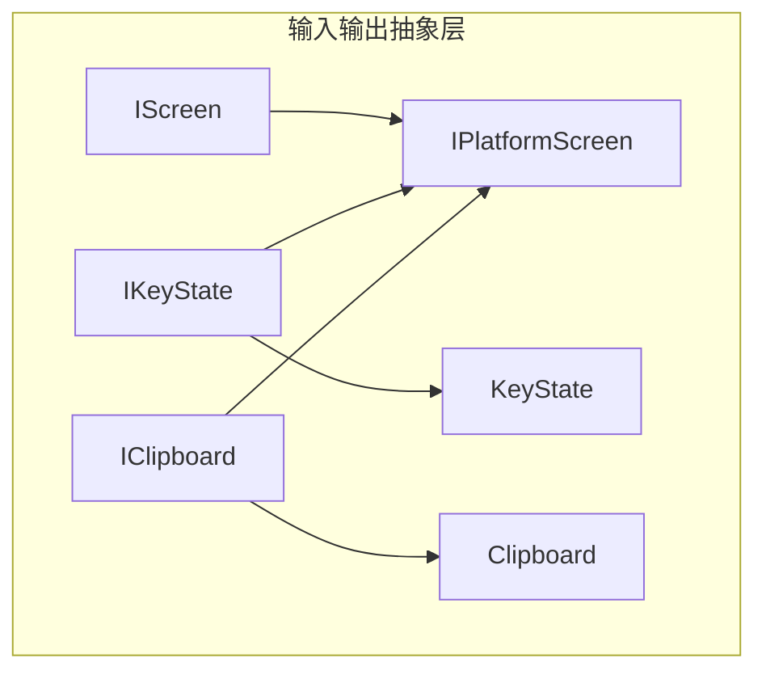
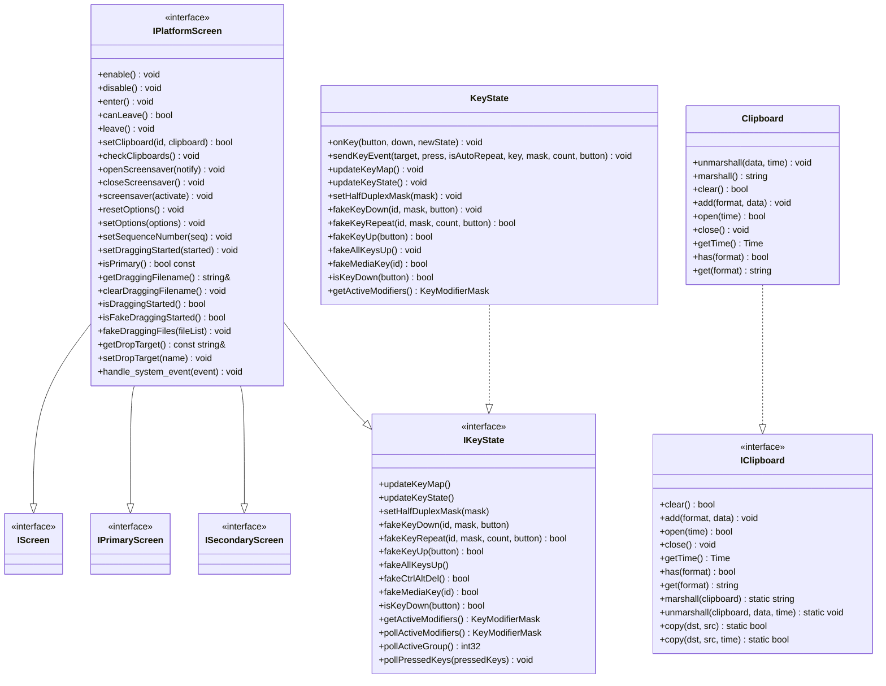
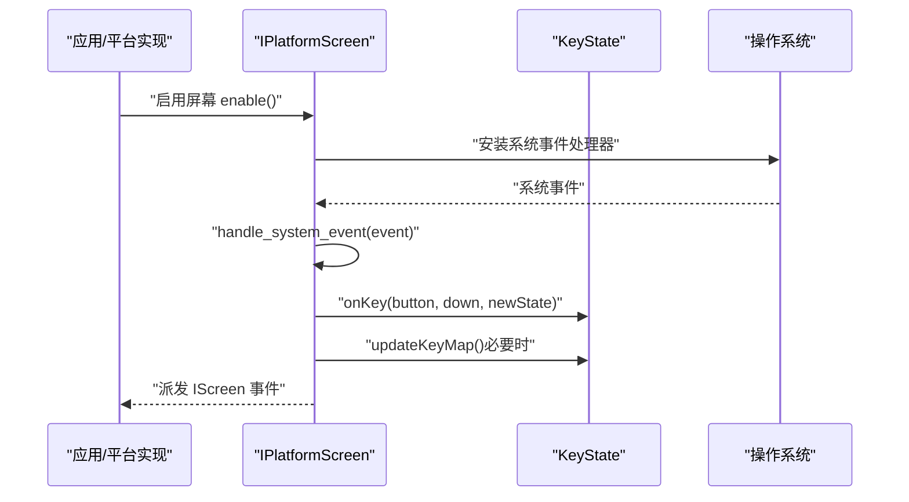
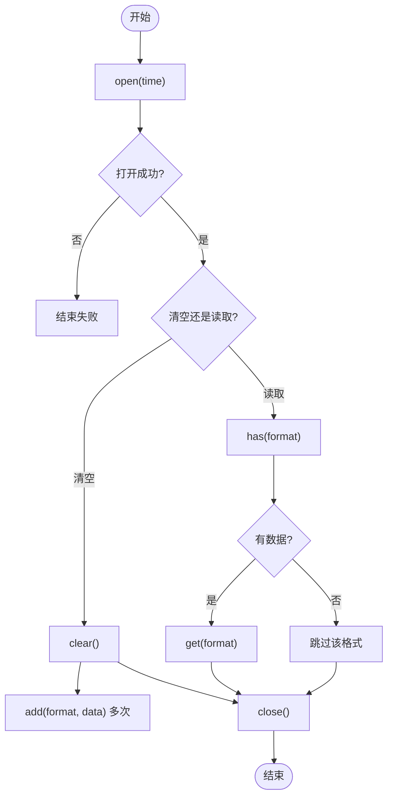
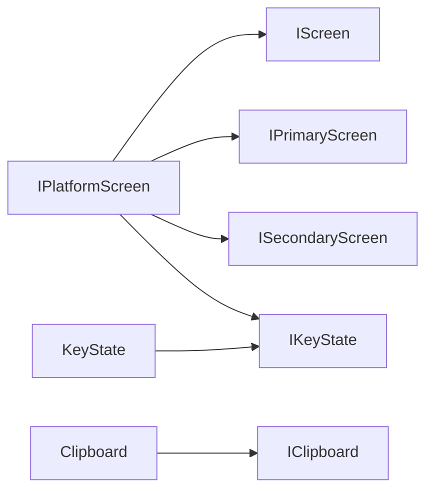

# 核心接口

<cite>
**本文引用的文件**   
- [IPlatformScreen.h](file://src/lib/inputleap/IPlatformScreen.h)
- [IScreen.h](file://src/lib/inputleap/IScreen.h)
- [IKeyState.h](file://src/lib/inputleap/IKeyState.h)
- [KeyState.h](file://src/lib/inputleap/KeyState.h)
- [IClipboard.h](file://src/lib/inputleap/IClipboard.h)
- [Clipboard.h](file://src/lib/inputleap/Clipboard.h)
</cite>

## 目录
1. [简介](#简介)
2. [项目结构](#项目结构)
3. [核心组件](#核心组件)
4. [架构总览](#架构总览)
5. [详细组件分析](#详细组件分析)
6. [依赖关系分析](#依赖关系分析)
7. [性能考虑](#性能考虑)
8. [故障排查指南](#故障排查指南)
9. [结论](#结论)
10. [附录](#附录)

## 简介
本文件为 Input Leap 的核心接口 API 文档，聚焦以下三类能力：
- 平台抽象 IPlatformScreen：统一屏幕、剪贴板、屏保与选项等跨平台能力。
- 键盘状态 IKeyState 与 KeyState：键位映射、修饰键处理、按键合成与状态同步。
- 剪贴板 IClipboard 与 Clipboard：多格式数据读写、序列化/反序列化与拷贝。

文档提供类继承关系图、虚函数接口定义、参数类型说明与返回值描述，并给出实现自定义平台适配、事件处理与状态管理的实践建议，同时讨论线程安全性、性能考量与最佳实践。

## 项目结构
Input Leap 将平台无关的输入/输出抽象集中在 lib/inputleap 中，平台相关实现位于 lib/platform。核心接口均位于 inputleap 命名空间下，便于上层逻辑以统一方式调用。

图表来源
- [IPlatformScreen.h:37-39](file://src/lib/inputleap/IPlatformScreen.h#L37-L39)
- [IKeyState.h:34-36](file://src/lib/inputleap/IKeyState.h#L34-L36)
- [IClipboard.h:30-32](file://src/lib/inputleap/IClipboard.h#L30-L32)
- [KeyState.h:31-35](file://src/lib/inputleap/KeyState.h#L31-L35)
- [Clipboard.h:29-32](file://src/lib/inputleap/Clipboard.h#L29-L32)

章节来源
- [IPlatformScreen.h:37-39](file://src/lib/inputleap/IPlatformScreen.h#L37-L39)
- [IKeyState.h:34-36](file://src/lib/inputleap/IKeyState.h#L34-L36)
- [IClipboard.h:30-32](file://src/lib/inputleap/IClipboard.h#L30-L32)
- [KeyState.h:31-35](file://src/lib/inputleap/KeyState.h#L31-L35)
- [Clipboard.h:29-32](file://src/lib/inputleap/Clipboard.h#L29-L32)

## 核心组件
本节概述三大核心接口的职责与关键方法，供快速定位与理解。

- IPlatformScreen（平台屏幕抽象）
  - 生命周期：enable/disable/enter/leave/canLeave
  - 剪贴板：setClipboard/checkClipboards
  - 屏保：openScreensaver/closeScreensaver/screensaver
  - 选项：resetOptions/setOptions
  - 拖放：setDraggingStarted/isDraggingStarted/fakeDraggingFiles/getDropTarget/setDropTarget
  - 系统事件：handle_system_event（平台侧安装系统事件处理器并转发到 IScreen/IPrimaryScreen/ISecondaryScreen）

- IKeyState（键盘状态接口）
  - 状态更新：updateKeyMap/updateKeyState
  - 半双工修饰键：setHalfDuplexMask
  - 按键合成：fakeKeyDown/fakeKeyRepeat/fakeKeyUp/fakeAllKeysUp/fakeCtrlAltDel/fakeMediaKey
  - 状态查询：isKeyDown/getActiveModifiers/pollActiveModifiers/pollActiveGroup/pollPressedKeys

- IClipboard（剪贴板接口）
  - 生命周期：open/close/getTime
  - 数据操作：clear/add/has/get
  - 序列化工具：marshall/unmarshall/copy（静态方法）

章节来源
- [IPlatformScreen.h:44-184](file://src/lib/inputleap/IPlatformScreen.h#L44-L184)
- [IKeyState.h:81-184](file://src/lib/inputleap/IKeyState.h#L81-L184)
- [IClipboard.h:72-169](file://src/lib/inputleap/IClipboard.h#L72-L169)

## 架构总览
下图展示核心接口之间的继承与组合关系，以及平台实现应遵循的职责边界。

图表来源
- [IPlatformScreen.h:37-39](file://src/lib/inputleap/IPlatformScreen.h#L37-L39)
- [IKeyState.h:34-36](file://src/lib/inputleap/IKeyState.h#L34-L36)
- [KeyState.h:31-35](file://src/lib/inputleap/KeyState.h#L31-L35)
- [IClipboard.h:30-32](file://src/lib/inputleap/IClipboard.h#L30-L32)
- [Clipboard.h:29-32](file://src/lib/inputleap/Clipboard.h#L29-L32)

## 详细组件分析

### IPlatformScreen 平台抽象接口
- 设计要点
  - 聚合了屏幕生命周期、剪贴板所有权、屏保控制、选项重置与设置、拖放状态与目标、系统事件分发等跨平台能力。
  - 作为 IScreen/IPrimaryScreen/ISecondaryScreen/IKeyState 的统一入口，平台实现需完整覆盖所有虚函数。
- 关键方法与语义
  - 生命周期：enable/disable 准备/释放系统资源；enter/leave/canLeave 处理焦点切换与前置条件检查。
  - 剪贴板：setClipboard 写入指定 ID 的剪贴板内容；checkClipboards 轮询所有权变更并派发抓取事件。
  - 屏保：openScreensaver 支持通知模式或禁用恢复模式；closeScreensaver 关闭通知或恢复屏保；screensaver 强制激活/停用。
  - 选项：resetOptions 恢复默认；setOptions 增量更新。
  - 拖放：管理开始标志、文件名列表、目标屏幕名称。
  - 系统事件：在构造时注册系统事件处理器，在析构移除；在 handle_system_event 中将系统事件转换为 IScreen 事件并调用 KeyState 的 onKey/updateKeyMap。
- 返回值与异常
  - canLeave 返回是否允许离开（例如主屏无法安装钩子时应失败）。
  - setClipboard 返回是否成功设置。
- 线程安全与性能
  - 建议在单线程事件循环内调用，避免并发修改剪贴板或屏保状态。
  - checkClipboards 可周期性调用但应避免高频轮询导致 CPU 占用过高。
- 自定义平台适配示例（步骤）
  - 继承 IPlatformScreen 并实现全部纯虚函数。
  - 在构造函数中注册系统事件处理器，在析构中移除。
  - 在 handle_system_event 中解析系统事件，调用 IScreen 的相应方法，并在主屏上调用 KeyState::onKey 与 updateKeyMap。
  - 使用 setClipboard 与 checkClipboards 维护剪贴板一致性。
  - 通过 openScreensaver/closeScreensaver/screensaver 对接系统屏保 API。
  - 通过 resetOptions/setOptions 响应配置变化。

章节来源
- [IPlatformScreen.h:44-184](file://src/lib/inputleap/IPlatformScreen.h#L44-L184)

### IKeyState 键盘状态管理与 KeyState 实现
- 设计要点
  - IKeyState 定义键位状态查询与按键合成的统一接口；KeyState 提供通用实现，封装修饰键、半双工键、自动重复、媒体键等逻辑。
  - 平台子类需提供 getKeyMap 与 fakeKey 两个受保护方法以完成平台差异。
- 关键方法与语义
  - 状态更新：updateKeyMap 刷新键位映射；updateKeyState 同步物理键盘状态。
  - 修饰键：setHalfDuplexMask 设置半双工修饰键掩码；getActiveModifiers 获取当前活动修饰键。
  - 按键合成：fakeKeyDown/fakeKeyRepeat/fakeKeyUp/fakeAllKeysUp/fakeCtrlAltDel/fakeMediaKey。
  - 状态查询：isKeyDown/pollActiveModifiers/pollActiveGroup/pollPressedKeys。
  - 事件发送：sendKeyEvent 用于向目标投递按键事件（含自动重复计数）。
- 复杂度与数据结构
  - 内部维护每个按钮的状态数组与合成状态数组，时间复杂度 O(1) 访问；批量合成按 Keystrokes 数量线性处理。
- 线程安全与性能
  - 建议在事件线程内调用；若从其他线程触发合成，请确保外部同步。
  - 对 poll* 系列方法，注意系统调用开销，避免在热路径频繁调用。
- 自定义平台适配示例（步骤）
  - 继承 KeyState 并实现 getKeyMap（填充 KeyMap）与 fakeKey（注入平台级按键事件）。
  - 在主屏收到本地按键时调用 onKey 更新内部状态。
  - 需要读取系统真实修饰键或按下键集合时调用 pollActiveModifiers/pollPressedKeys。

图表来源
- [IPlatformScreen.h:162-184](file://src/lib/inputleap/IPlatformScreen.h#L162-L184)
- [KeyState.h:40-57](file://src/lib/inputleap/KeyState.h#L40-L57)

章节来源
- [IKeyState.h:81-184](file://src/lib/inputleap/IKeyState.h#L81-L184)
- [KeyState.h:31-122](file://src/lib/inputleap/KeyState.h#L31-L122)

### IClipboard 剪贴板操作与 Clipboard 内存实现
- 设计要点
  - IClipboard 定义跨平台剪贴板的数据格式、打开/关闭、读写与序列化/拷贝工具。
  - Clipboard 是内存中的实现，用于在网络传输或进程间传递剪贴板数据。
- 数据格式
  - 文本 UTF-8（换行 LF）、HTML 片段 UTF-8、位图 BMP（无文件头，紧随 INFOHEADER 后为像素数据），以及 PNG/JPEG/TIFF/WEBP 等图像格式。
- 关键方法与语义
  - 生命周期：open/close/getTime；必须在 open 成功后调用 close。
  - 数据操作：clear/add/has/get；clear 需在成功 open 之后调用。
  - 工具方法：marshall/unmarshall/copy（静态）用于打包/还原/复制。
- 返回值与异常
  - clear/open 可能失败，需检查返回值；get 在无数据时返回空字符串。
- 线程安全与性能
  - 同一实例的 open/close 成对出现；多线程场景需外部同步。
  - marshall/unmarshall 适合网络传输前一次性打包，避免多次系统调用。
- 自定义平台适配示例（步骤）
  - 继承 IClipboard 实现平台剪贴板访问。
  - 在 open 中尝试获取所有权或只读句柄，记录时间戳。
  - add 时将数据写入平台剪贴板；get/has 从平台读取对应格式。
  - 使用 marshall/unmarshall 进行跨进程/跨设备传输。

图表来源
- [IClipboard.h:72-169](file://src/lib/inputleap/IClipboard.h#L72-L169)
- [Clipboard.h:57-73](file://src/lib/inputleap/Clipboard.h#L57-L73)

章节来源
- [IClipboard.h:30-169](file://src/lib/inputleap/IClipboard.h#L30-L169)
- [Clipboard.h:29-73](file://src/lib/inputleap/Clipboard.h#L29-L73)

## 依赖关系分析
- 耦合关系
  - IPlatformScreen 聚合 IScreen/IPrimaryScreen/ISecondaryScreen/IKeyState，形成“平台能力聚合器”。
  - KeyState 依赖 KeyMap 完成键位映射；平台实现通过 getKeyMap 注入映射表。
  - Clipboard 仅依赖 IClipboard 接口，便于替换不同存储后端。
- 可能的循环依赖
  - 接口层无直接循环；平台实现需注意不要在 IPlatformScreen 中反向强依赖具体 KeyState/Clipboard 实现，保持松耦合。
- 外部依赖点
  - 操作系统事件、剪贴板服务、屏保服务、键盘布局与修饰键状态。

图表来源
- [IPlatformScreen.h:37-39](file://src/lib/inputleap/IPlatformScreen.h#L37-L39)
- [KeyState.h:31-35](file://src/lib/inputleap/KeyState.h#L31-L35)
- [Clipboard.h:29-32](file://src/lib/inputleap/Clipboard.h#L29-L32)

章节来源
- [IPlatformScreen.h:37-39](file://src/lib/inputleap/IPlatformScreen.h#L37-L39)
- [KeyState.h:31-35](file://src/lib/inputleap/KeyState.h#L31-L35)
- [Clipboard.h:29-32](file://src/lib/inputleap/Clipboard.h#L29-L32)

## 性能考虑
- 事件处理
  - 在 handle_system_event 中尽量轻量，避免阻塞；复杂处理应投递到后台队列。
- 剪贴板
  - 合并多格式数据时使用 marshall 减少系统交互次数；仅在必要时轮询 checkClipboards。
- 键盘状态
  - 避免在热路径频繁调用 pollActiveModifiers/pollPressedKeys；优先使用 onKey 驱动的内部状态。
- 屏保
  - openScreensaver 的通知模式会持续回调，应合理节流。

[本节为通用指导，不直接分析具体文件]

## 故障排查指南
- 常见问题
  - 剪贴板未生效：确认 open/close 配对且 clear/add 顺序正确；检查 has/get 返回与格式匹配。
  - 按键状态不一致：核对 onKey 调用时机与半双工修饰键掩码；必要时调用 updateKeyState 同步。
  - 屏保行为异常：区分通知模式与禁用恢复模式；确保 closeScreensaver 被调用。
  - 系统事件丢失：确认在构造中注册了系统事件处理器，析构中移除。
- 定位手段
  - 在 handle_system_event 入口处添加日志；在 KeyState::sendKeyEvent 处观察事件投递。
  - 对比 getActiveModifiers 与 pollActiveModifiers 的差异，判断系统状态与内部状态是否一致。

章节来源
- [IPlatformScreen.h:162-184](file://src/lib/inputleap/IPlatformScreen.h#L162-L184)
- [KeyState.h:40-78](file://src/lib/inputleap/KeyState.h#L40-L78)
- [IClipboard.h:72-169](file://src/lib/inputleap/IClipboard.h#L72-L169)

## 结论
IPlatformScreen、IKeyState/KeyState 与 IClipboard/Clipboard 构成了 Input Leap 的核心抽象层。通过清晰的接口契约与合理的职责划分，平台实现可以专注于系统差异，而业务逻辑保持稳定。遵循本文的最佳实践与注意事项，可获得稳定、高效且易扩展的平台适配方案。

[本节为总结性内容，不直接分析具体文件]

## 附录
- 术语
  - 半双工修饰键：在开/关切换时不会报告 release/press 的修饰键。
  - 自动重复：长按某键产生的重复按键事件。
  - 媒体键：多媒体专用键（如音量、播放/暂停）。
- 参考路径
  - 平台实现示例：参见 platform 目录下各平台的 KeyState/Clipboard 实现。
  - 测试用例：unittests/integtests 中提供了 KeyState 与 Clipboard 的行为验证。

[本节为补充信息，不直接分析具体文件]