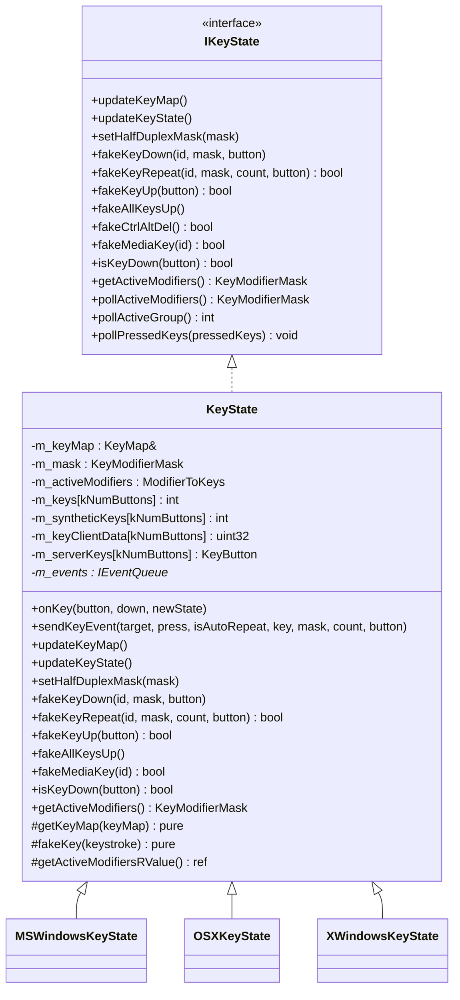
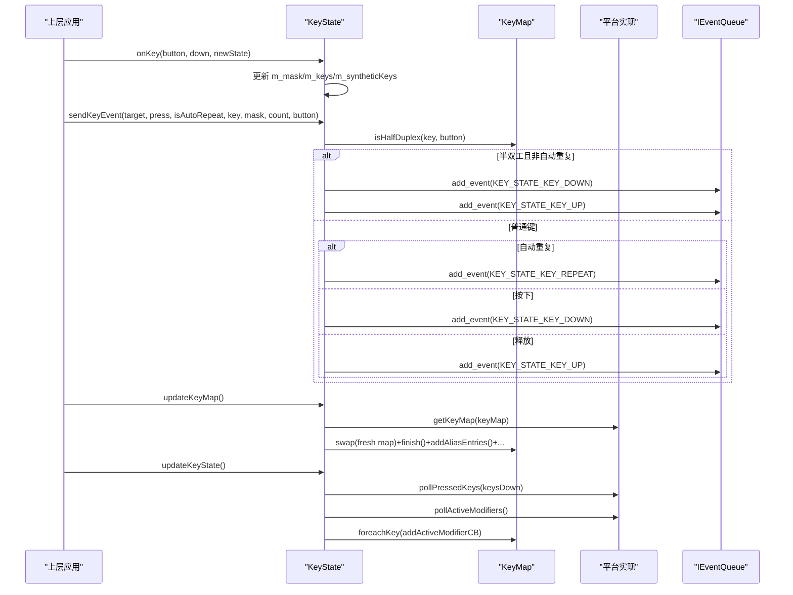
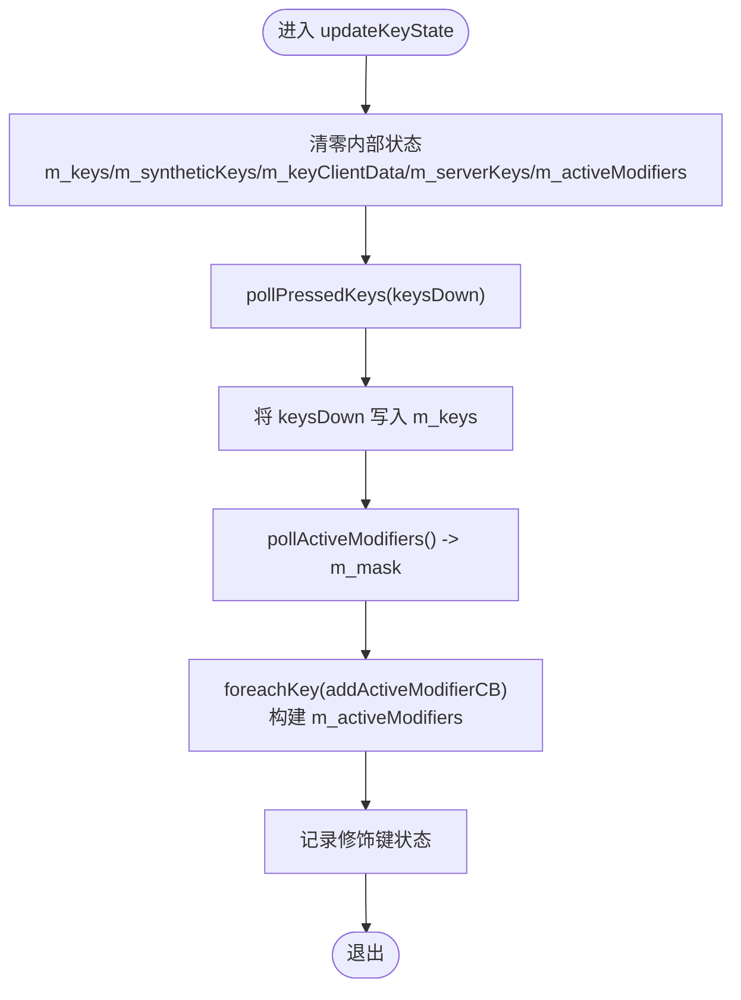
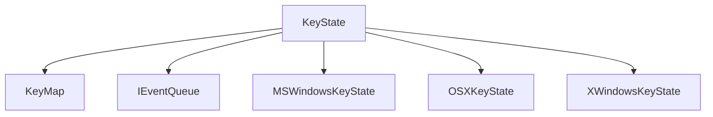

# 键盘状态管理

<cite>
**本文引用的文件**   
- [src/lib/inputleap/IKeyState.h](file://src/lib/inputleap/IKeyState.h)
- [src/lib/inputleap/KeyState.h](file://src/lib/inputleap/KeyState.h)
- [src/lib/inputleap/KeyState.cpp](file://src/lib/inputleap/KeyState.cpp)
- [src/lib/platform/MSWindowsKeyState.h](file://src/lib/platform/MSWindowsKeyState.h)
- [src/lib/platform/OSXKeyState.h](file://src/lib/platform/OSXKeyState.h)
- [src/lib/platform/XWindowsKeyState.h](file://src/lib/platform/XWindowsKeyState.h)
- [src/test/unittests/inputleap/KeyStateTests.cpp](file://src/test/unittests/inputleap/KeyStateTests.cpp)
</cite>

## 目录
1. [简介](#简介)
2. [项目结构](#项目结构)
3. [核心组件](#核心组件)
4. [架构总览](#架构总览)
5. [详细组件分析](#详细组件分析)
6. [依赖关系分析](#依赖关系分析)
7. [性能考虑](#性能考虑)
8. [故障排查指南](#故障排查指南)
9. [结论](#结论)
10. [附录：API 参考与示例](#附录api-参考与示例)

## 简介
本文件为 KeyState 键盘状态管理类的权威 API 文档，聚焦以下能力：
- 键盘状态的跟踪机制（按键按下/释放、自动重复、半双工修饰键）
- 按键映射处理（KeyID 到物理按键的映射、组合键、小键盘映射、别名）
- 修饰键状态管理（活动修饰键集合、半双工切换键行为）
- onKey() 方法的使用方式与调用时机
- updateKeyMap()/updateKeyState() 的职责与调用时机
- 跨平台差异（Windows/macOS/Linux X11）的处理要点
- 事件处理与状态同步的最佳实践

## 项目结构
KeyState 采用“接口 + 抽象基类 + 平台实现”的分层设计：
- IKeyState：定义统一的键盘状态接口
- KeyState：通用实现，封装状态机、映射、事件合成等逻辑
- 平台特定实现：MSWindowsKeyState、OSXKeyState、XWindowsKeyState，负责系统级查询与合成

图表来源
- [src/lib/inputleap/IKeyState.h:34-185](file://src/lib/inputleap/IKeyState.h#L34-L185)
- [src/lib/inputleap/KeyState.h:31-225](file://src/lib/inputleap/KeyState.h#L31-L225)
- [src/lib/platform/MSWindowsKeyState.h:37-232](file://src/lib/platform/MSWindowsKeyState.h#L37-L232)
- [src/lib/platform/OSXKeyState.h:38-179](file://src/lib/platform/OSXKeyState.h#L38-L179)
- [src/lib/platform/XWindowsKeyState.h:40-170](file://src/lib/platform/XWindowsKeyState.h#L40-L170)

章节来源
- [src/lib/inputleap/IKeyState.h:34-185](file://src/lib/inputleap/IKeyState.h#L34-L185)
- [src/lib/inputleap/KeyState.h:31-225](file://src/lib/inputleap/KeyState.h#L31-L225)

## 核心组件
- IKeyState：统一接口，定义更新键盘映射/状态、模拟按键、查询状态等方法。
- KeyState：核心状态机与事件合成器，维护当前按键状态、修饰键状态、合成按键计数、服务器端按键映射等；提供 onKey()/sendKeyEvent()/updateKeyMap()/updateKeyState() 等关键方法。
- 平台实现：分别实现 getKeyMap()/fakeKey()/pollActiveModifiers()/pollActiveGroup()/pollPressedKeys() 等平台相关细节。

章节来源
- [src/lib/inputleap/IKeyState.h:34-185](file://src/lib/inputleap/IKeyState.h#L34-L185)
- [src/lib/inputleap/KeyState.h:31-225](file://src/lib/inputleap/KeyState.h#L31-L225)
- [src/lib/inputleap/KeyState.cpp:388-419](file://src/lib/inputleap/KeyState.cpp#L388-L419)

## 架构总览
KeyState 通过 KeyMap 完成 KeyID 到物理按键的映射，并通过 IEventQueue 派发 KEY_STATE_KEY_DOWN/UP/REPEAT 事件。平台实现负责从操作系统获取真实按键与修饰键状态，并将合成按键投递到底层驱动或 HID 子系统。

图表来源
- [src/lib/inputleap/KeyState.cpp:422-473](file://src/lib/inputleap/KeyState.cpp#L422-L473)
- [src/lib/inputleap/KeyState.cpp:476-516](file://src/lib/inputleap/KeyState.cpp#L476-L516)
- [src/lib/inputleap/KeyState.cpp:518-528](file://src/lib/inputleap/KeyState.cpp#L518-L528)

## 详细组件分析

### KeyState 核心 API 与职责
- onKey(button, down, newState)
  - 作用：在本地主屏幕响应真实按键时更新内部修饰键掩码与按键状态。
  - 参数：
    - button：物理按键编号（KeyButton），会被屏蔽高位后使用
    - down：是否按下
    - newState：当前修饰键掩码（KeyModifierMask）
  - 行为：更新 m_mask、m_keys[button]、m_syntheticKeys[button]；忽略无效按钮。
  - 返回值：无
  - 注意：仅由主屏幕在本地事件回调中调用；子类可覆盖以扩展平台行为。

- sendKeyEvent(target, press, isAutoRepeat, key, mask, count, button)
  - 作用：根据半双工/重复策略向事件队列派发 KEY_STATE_KEY_DOWN/UP/REPEAT。
  - 参数：
    - target：事件目标
    - press：是否按下
    - isAutoRepeat：是否自动重复
    - key：逻辑键 ID（KeyID）
    - mask：修饰键掩码
    - count：重复次数（仅在 REPEAT 时使用）
    - button：物理按键编号
  - 行为：若为半双工键且非自动重复，则同时发送 DOWN 和 UP；否则按 press/isAutoRepeat 分支派发对应事件。
  - 返回值：无

- updateKeyMap()
  - 作用：刷新键盘映射表并添加组合键/小键盘/别名条目。
  - 流程：调用平台 getKeyMap() 填充临时 KeyMap，swap 到成员，finish()，再添加组合键、小键盘、别名。
  - 调用时机：键盘布局变化、配置变更、初始化完成后。

- updateKeyState()
  - 作用：将内部状态重置并从系统拉取当前按键与修饰键状态，重建活动修饰键集合。
  - 流程：清零 m_keys/m_syntheticKeys/m_keyClientData/m_serverKeys/m_activeModifiers；pollPressedKeys() 设置 m_keys；pollActiveModifiers() 设置 m_mask；foreachKey() 计算活动修饰键。
  - 调用时机：启动、布局切换、需要与系统状态对齐时。

- setHalfDuplexMask(mask)
  - 作用：设置半双工修饰键（如 CapsLock/NumLock/ScrollLock）。
  - 行为：清空旧标记，依据 mask 添加相应半双工键。

- fakeKeyDown/fakeKeyRepeat/fakeKeyUp/fakeAllKeysUp/fakeMediaKey
  - 作用：合成按键事件并维护内部状态一致性（包括修饰键、客户端数据、服务器端映射）。
  - 关键点：
    - fakeKeyDown：忽略某些键（如锁定键），映射 KeyID 到 Keystrokes，必要时特殊处理媒体键；更新活动修饰键集合与计数。
    - fakeKeyRepeat：处理死键导致的重复键位变化，修正旧键 up 与新键 down 的状态。
    - fakeKeyUp：生成 release 序列，清理修饰键与计数。
    - fakeAllKeysUp：批量释放所有合成按键，重置服务器映射与活动修饰键，重新从系统读取修饰键。
    - fakeMediaKey：默认返回 false，平台可覆盖（macOS 支持）。

- isKeyDown(button)/getActiveModifiers()
  - 作用：查询按键状态与活动修饰键掩码。

- 受保护钩子（供平台实现覆盖）
  - getKeyMap(KeyMap&)：填充当前键盘映射
  - fakeKey(Keystroke)：向底层发送单个合成按键
  - getActiveModifiersRValue()：返回修饰键掩码引用，供 KeyMap 修改

章节来源
- [src/lib/inputleap/KeyState.h:40-131](file://src/lib/inputleap/KeyState.h#L40-L131)
- [src/lib/inputleap/KeyState.cpp:422-473](file://src/lib/inputleap/KeyState.cpp#L422-L473)
- [src/lib/inputleap/KeyState.cpp:476-516](file://src/lib/inputleap/KeyState.cpp#L476-L516)
- [src/lib/inputleap/KeyState.cpp:531-543](file://src/lib/inputleap/KeyState.cpp#L531-L543)
- [src/lib/inputleap/KeyState.cpp:546-723](file://src/lib/inputleap/KeyState.cpp#L546-L723)
- [src/lib/inputleap/KeyState.cpp:726-772](file://src/lib/inputleap/KeyState.cpp#L726-L772)
- [src/lib/inputleap/KeyState.cpp:774-831](file://src/lib/inputleap/KeyState.cpp#L774-L831)
- [src/lib/inputleap/KeyState.cpp:833-908](file://src/lib/inputleap/KeyState.cpp#L833-L908)

### 修饰键与半双工键处理
- 半双工修饰键：CapsLock/NumLock/ScrollLock 在 toggle 时不会报告对偶的 press/release，KeyState 通过 setHalfDuplexMask() 注册这些键，并在 sendKeyEvent() 中对半双工键进行特殊处理（直接成对发送 DOWN/UP，忽略自动重复）。
- 活动修饰键集合：updateKeyState() 通过 foreachKey() 遍历 KeyMap，结合当前 group 与 mask 构建 m_activeModifiers，用于后续映射与状态判断。

章节来源
- [src/lib/inputleap/KeyState.cpp:531-543](file://src/lib/inputleap/KeyState.cpp#L531-L543)
- [src/lib/inputleap/KeyState.cpp:476-516](file://src/lib/inputleap/KeyState.cpp#L476-L516)
- [src/lib/inputleap/KeyState.cpp:518-528](file://src/lib/inputleap/KeyState.cpp#L518-L528)

### 按键映射与组合键
- 组合键与死键：addCombinationEntries() 注入死键与 Compose 序列，使多步输入能正确映射为目标字符。
- 小键盘映射：addKeypadEntries() 将 KP_* 键映射到标准键，保证数字小键盘在不同布局下行为一致。
- 别名映射：addAliasEntries() 补充 Tab/LeftTab 与非断空格等别名，提升兼容性。

章节来源
- [src/lib/inputleap/KeyState.cpp:800-831](file://src/lib/inputleap/KeyState.cpp#L800-L831)

### 事件合成与重复
- fakeKeys() 支持“连续重复段”，当遇到 repeat 标记的按键序列时，会按 count 循环发送，直到遇到非 repeat 项为止。
- sendKeyEvent() 根据半双工与重复标志选择派发 DOWN/UP/REPEAT。

章节来源
- [src/lib/inputleap/KeyState.cpp:833-867](file://src/lib/inputleap/KeyState.cpp#L833-L867)
- [src/lib/inputleap/KeyState.cpp:445-473](file://src/lib/inputleap/KeyState.cpp#L445-L473)

### 跨平台差异与最佳实践

#### Windows（MSWindowsKeyState）
- 特点：
  - 维护虚拟键与 KeyButton 的双向映射表，支持 ToUnicodeEx 转换
  - 提供 saveModifiers()/useSavedModifiers() 以在主/次屏间保持修饰键语义一致
  - 支持 Ctrl+Alt+Del 的特殊合成
- 建议：
  - 在窗口焦点切换或布局变化时调用 updateKeyMap()/updateKeyState()
  - 使用 testAutoRepeat() 辅助识别自动重复事件
  - 通过 setKeyLayout(HKL) 指定布局上下文

章节来源
- [src/lib/platform/MSWindowsKeyState.h:37-232](file://src/lib/platform/MSWindowsKeyState.h#L37-L232)

#### macOS（OSXKeyState）
- 特点：
  - 基于 Carbon/CoreGraphics 的事件与修饰键处理
  - 支持 handleModifierKeys() 精确处理修饰键变化
  - 支持 fakeMediaKey() 合成媒体键
- 建议：
  - 监听修饰键变化并调用 handleModifierKeys() 以保持状态一致
  - 使用 adjustAltGrModifier() 处理 Option 作为 AltGr 的场景

章节来源
- [src/lib/platform/OSXKeyState.h:38-179](file://src/lib/platform/OSXKeyState.h#L38-L179)

#### Linux X11（XWindowsKeyState）
- 特点：
  - 使用 XKB 获取键组与修饰键信息
  - 支持 setActiveGroup()/setAutoRepeat() 控制键盘组与重复
  - 提供 mapModifiersFromX()/mapModifiersToX() 转换修饰键掩码
- 建议：
  - 在 XKB 状态变化时调用 updateKeyMap()/updateKeyState()
  - 使用 kGroupPoll/kGroupPollAndSet 优化 pollActiveGroup() 的性能

章节来源
- [src/lib/platform/XWindowsKeyState.h:40-170](file://src/lib/platform/XWindowsKeyState.h#L40-L170)

### 流程图：updateKeyState() 状态同步

图表来源
- [src/lib/inputleap/KeyState.cpp:490-516](file://src/lib/inputleap/KeyState.cpp#L490-L516)
- [src/lib/inputleap/KeyState.cpp:518-528](file://src/lib/inputleap/KeyState.cpp#L518-L528)

## 依赖关系分析
- KeyState 依赖：
  - KeyMap：按键映射、组合键、半双工判定、活动修饰键枚举
  - IEventQueue：事件派发
  - 平台实现：系统级状态查询与合成
- 耦合与内聚：
  - KeyState 与 KeyMap 高内聚（映射与状态计算集中在 KeyState）
  - 平台差异通过虚函数解耦，避免条件编译扩散
- 外部依赖：
  - Windows：Win32 API（ToUnicodeEx、GetAsyncKeyState 等）
  - macOS：Carbon/CoreGraphics/HID
  - X11：Xlib/XKB/XTest

图表来源
- [src/lib/inputleap/KeyState.h:31-225](file://src/lib/inputleap/KeyState.h#L31-L225)
- [src/lib/platform/MSWindowsKeyState.h:37-232](file://src/lib/platform/MSWindowsKeyState.h#L37-L232)
- [src/lib/platform/OSXKeyState.h:38-179](file://src/lib/platform/OSXKeyState.h#L38-L179)
- [src/lib/platform/XWindowsKeyState.h:40-170](file://src/lib/platform/XWindowsKeyState.h#L40-L170)

章节来源
- [src/lib/inputleap/KeyState.h:31-225](file://src/lib/inputleap/KeyState.h#L31-L225)

## 性能考虑
- updateKeyMap() 应仅在布局变化或配置更新时调用，避免频繁重建映射。
- updateKeyState() 包含系统轮询与 KeyMap 遍历，建议在必要时刻（如焦点切换、布局切换）调用。
- fakeKeys() 的重复段处理可减少事件数量，提高合成效率。
- X11 的 pollActiveGroup() 较昂贵，可使用 kGroupPollAndSet 缓存结果。

## 故障排查指南
- 现象：修饰键状态不同步
  - 检查是否在布局变化后调用了 updateKeyMap()/updateKeyState()
  - 确认 setHalfDuplexMask() 是否正确设置了半双工修饰键
- 现象：自动重复异常
  - 检查 sendKeyEvent() 的 isAutoRepeat 分支与半双工键处理
  - Windows 平台建议使用 testAutoRepeat() 辅助判断
- 现象：媒体键无效
  - macOS 需确保 fakeMediaKey() 被覆盖并正确实现
- 现象：死键/Compose 组合输出不正确
  - 确认 addCombinationEntries() 已执行，组合键表完整

章节来源
- [src/lib/inputleap/KeyState.cpp:476-516](file://src/lib/inputleap/KeyState.cpp#L476-L516)
- [src/lib/inputleap/KeyState.cpp:531-543](file://src/lib/inputleap/KeyState.cpp#L531-L543)
- [src/lib/inputleap/KeyState.cpp:445-473](file://src/lib/inputleap/KeyState.cpp#L445-L473)
- [src/lib/platform/MSWindowsKeyState.h:60-86](file://src/lib/platform/MSWindowsKeyState.h#L60-L86)
- [src/lib/platform/OSXKeyState.h:96-97](file://src/lib/platform/OSXKeyState.h#L96-L97)
- [src/lib/platform/XWindowsKeyState.h:64-71](file://src/lib/platform/XWindowsKeyState.h#L64-L71)

## 结论
KeyState 提供了健壮的键盘状态管理与事件合成框架，通过 KeyMap 与平台实现的解耦，实现了跨平台的键盘行为一致性。正确使用 onKey()/updateKeyMap()/updateKeyState()，并结合半双工修饰键与组合键映射，能够稳定地处理复杂键盘交互场景。

## 附录：API 参考与示例

### 关键方法与参数说明
- onKey(button, down, newState)
  - 参数：
    - button：KeyButton（物理按键编号）
    - down：bool（是否按下）
    - newState：KeyModifierMask（当前修饰键掩码）
  - 返回值：void
  - 用途：主屏幕本地事件回调中更新内部状态

- sendKeyEvent(target, press, isAutoRepeat, key, mask, count, button)
  - 参数：
    - target：EventTarget*
    - press：bool（是否按下）
    - isAutoRepeat：bool（是否自动重复）
    - key：KeyID（逻辑键）
    - mask：KeyModifierMask（修饰键掩码）
    - count：int32（重复次数）
    - button：KeyButton（物理按键）
  - 返回值：void
  - 用途：根据半双工与重复策略派发事件

- updateKeyMap()
  - 参数：无
  - 返回值：void
  - 用途：刷新键盘映射并添加组合键/小键盘/别名

- updateKeyState()
  - 参数：无
  - 返回值：void
  - 用途：重置并同步系统按键与修饰键状态

- setHalfDuplexMask(mask)
  - 参数：mask：KeyModifierMask
  - 返回值：void
  - 用途：设置半双工修饰键

- fakeKeyDown/fakeKeyRepeat/fakeKeyUp/fakeAllKeysUp/fakeMediaKey
  - 参数与返回值见各方法签名
  - 用途：合成按键事件并维护状态一致性

- isKeyDown(button)/getActiveModifiers()
  - 参数/返回值：见方法签名
  - 用途：查询按键状态与活动修饰键

章节来源
- [src/lib/inputleap/KeyState.h:40-131](file://src/lib/inputleap/KeyState.h#L40-L131)
- [src/lib/inputleap/KeyState.cpp:422-473](file://src/lib/inputleap/KeyState.cpp#L422-L473)
- [src/lib/inputleap/KeyState.cpp:476-516](file://src/lib/inputleap/KeyState.cpp#L476-L516)
- [src/lib/inputleap/KeyState.cpp:531-543](file://src/lib/inputleap/KeyState.cpp#L531-L543)
- [src/lib/inputleap/KeyState.cpp:546-723](file://src/lib/inputleap/KeyState.cpp#L546-L723)
- [src/lib/inputleap/KeyState.cpp:726-772](file://src/lib/inputleap/KeyState.cpp#L726-L772)

### 单元测试中的使用示例路径
- onKey 基本用法与边界情况
  - [src/test/unittests/inputleap/KeyStateTests.cpp:50-81](file://src/test/unittests/inputleap/KeyStateTests.cpp#L50-L81)
- sendKeyEvent 半双工与重复行为
  - [src/test/unittests/inputleap/KeyStateTests.cpp:83-94](file://src/test/unittests/inputleap/KeyStateTests.cpp#L83-L94)
- updateKeyMap/updateKeyState 的行为验证
  - [src/test/unittests/inputleap/KeyStateTests.cpp:96-170](file://src/test/unittests/inputleap/KeyStateTests.cpp#L96-L170)
- setHalfDuplexMask 的修饰键注册
  - [src/test/unittests/inputleap/KeyStateTests.cpp:172-200](file://src/test/unittests/inputleap/KeyStateTests.cpp#L172-L200)

### 平台特定实现要点
- Windows：保存/恢复修饰键、Ctrl+Alt+Del 合成、自动重复检测
  - [src/lib/platform/MSWindowsKeyState.h:60-86](file://src/lib/platform/MSWindowsKeyState.h#L60-L86)
  - [src/lib/platform/MSWindowsKeyState.h:139-147](file://src/lib/platform/MSWindowsKeyState.h#L139-L147)
- macOS：修饰键变化处理、媒体键合成
  - [src/lib/platform/OSXKeyState.h:49-55](file://src/lib/platform/OSXKeyState.h#L49-L55)
  - [src/lib/platform/OSXKeyState.h:96-97](file://src/lib/platform/OSXKeyState.h#L96-L97)
- X11：键盘组与自动重复控制、修饰键转换
  - [src/lib/platform/XWindowsKeyState.h:57-71](file://src/lib/platform/XWindowsKeyState.h#L57-L71)
  - [src/lib/platform/XWindowsKeyState.h:77-90](file://src/lib/platform/XWindowsKeyState.h#L77-L90)