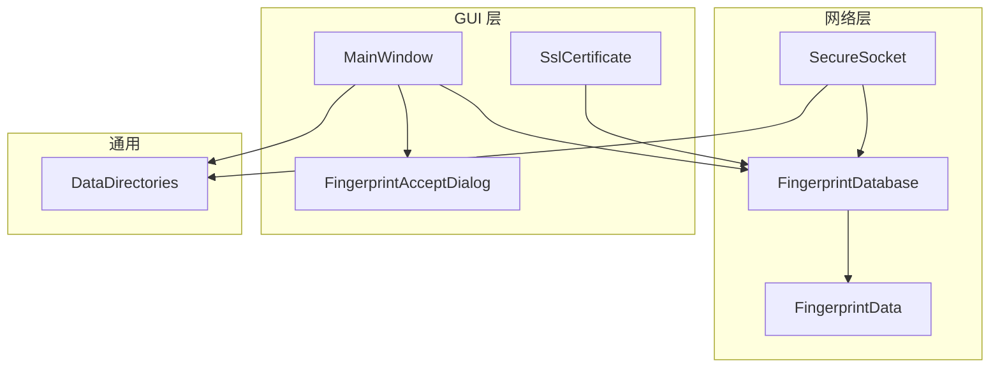
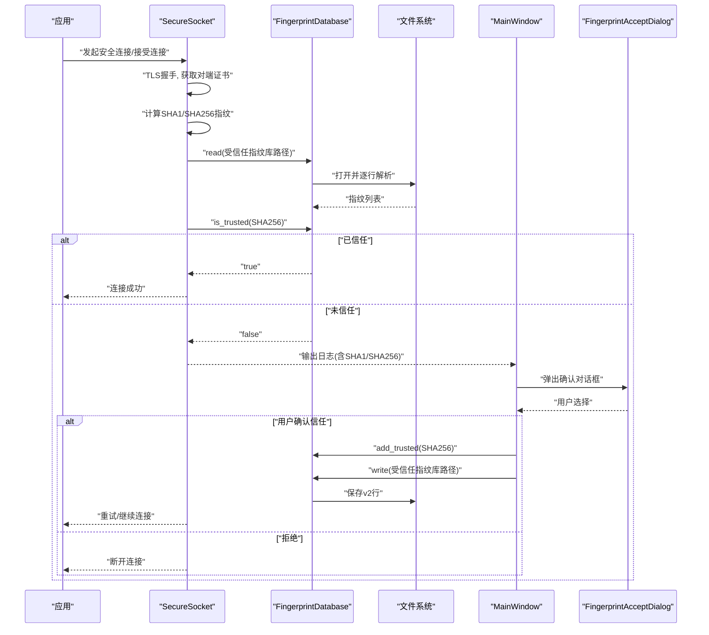
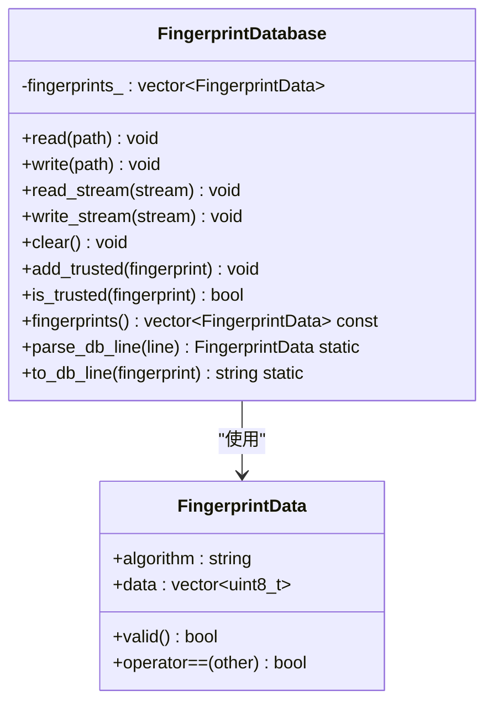
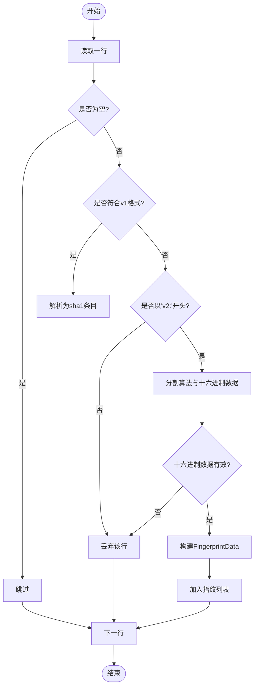
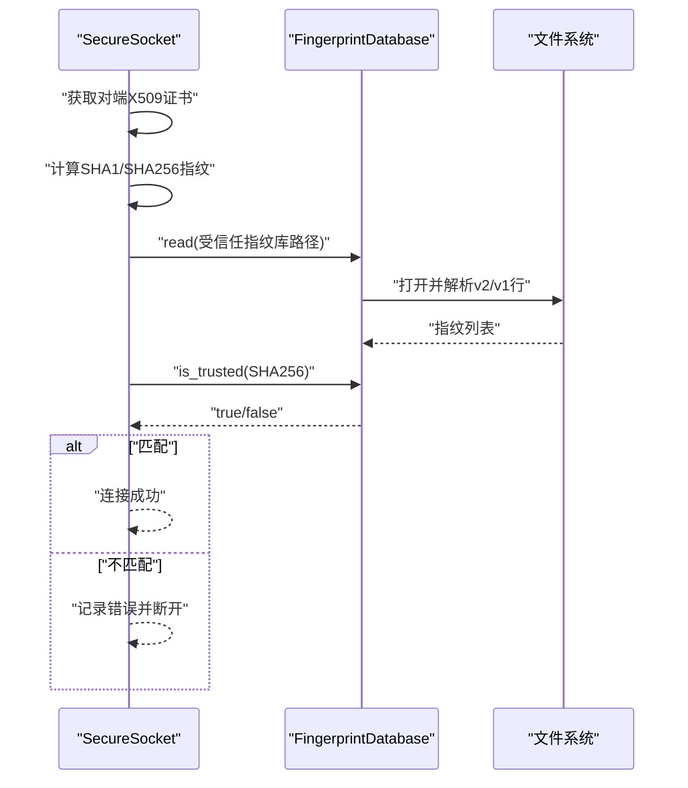
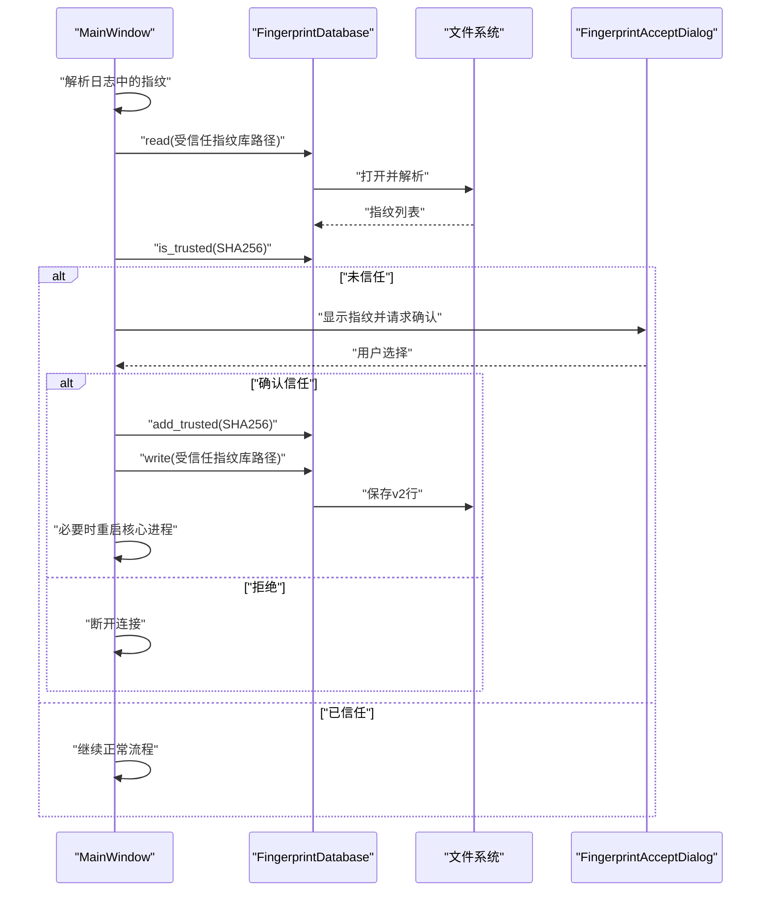
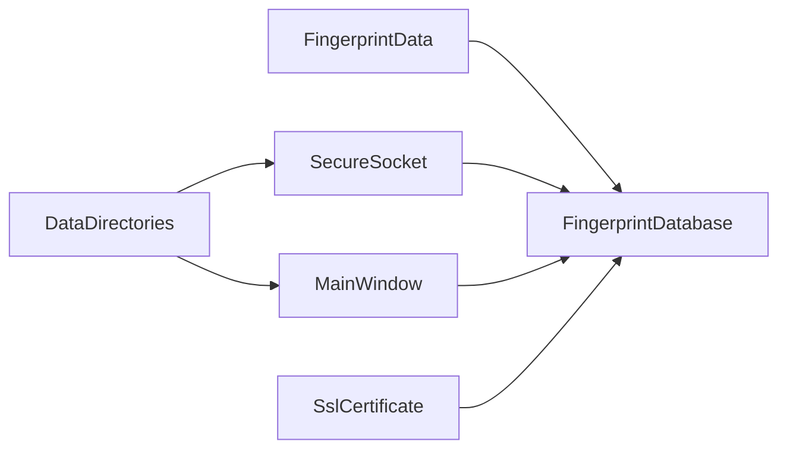

# FingerprintDatabase 指纹数据库接口

<cite>
**本文引用的文件**   
- [FingerprintDatabase.h](file://src/lib/net/FingerprintDatabase.h)
- [FingerprintDatabase.cpp](file://src/lib/net/FingerprintDatabase.cpp)
- [FingerprintData.h](file://src/lib/net/FingerprintData.h)
- [FingerprintData.cpp](file://src/lib/net/FingerprintData.cpp)
- [SecureSocket.cpp](file://src/lib/net/SecureSocket.cpp)
- [MainWindow.cpp](file://src/gui/src/MainWindow.cpp)
- [FingerprintAcceptDialog.h](file://src/gui/src/FingerprintAcceptDialog.h)
- [FingerprintAcceptDialog.cpp](file://src/gui/src/FingerprintAcceptDialog.cpp)
- [SslCertificate.cpp](file://src/gui/src/SslCertificate.cpp)
- [DataDirectories_static.cpp](file://src/lib/common/DataDirectories_static.cpp)
- [FingerprintDatabaseTests.cpp](file://src/test/unittests/net/FingerprintDatabaseTests.cpp)
</cite>

## 目录
1. [简介](#简介)
2. [项目结构](#项目结构)
3. [核心组件](#核心组件)
4. [架构总览](#架构总览)
5. [详细组件分析](#详细组件分析)
6. [依赖关系分析](#依赖关系分析)
7. [性能考虑](#性能考虑)
8. [故障排查指南](#故障排查指南)
9. [结论](#结论)
10. [附录](#附录)

## 简介
本文件为 FingerprintDatabase 类的权威 API 文档，聚焦于 SSL 证书指纹的存储、验证与管理机制。内容涵盖：
- 指纹格式定义与数据库文件格式
- 初始化、读取/写入、添加信任、校验对端证书
- 与 SecureSocket 的集成方式及自动信任流程
- GUI 首次连接时的指纹确认对话框与更新机制
- 安全性与最佳实践建议

## 项目结构
围绕 FingerprintDatabase 的相关代码分布在网络层、GUI 层与通用数据目录模块中：
- 网络层：FingerprintDatabase、FingerprintData、SecureSocket
- GUI 层：MainWindow（日志解析与用户交互）、FingerprintAcceptDialog（指纹确认对话框）、SslCertificate（本地指纹生成）
- 通用：DataDirectories（指纹数据库路径）

图表来源
- [FingerprintDatabase.h:28-48](file://src/lib/net/FingerprintDatabase.h#L28-L48)
- [FingerprintData.h:32-39](file://src/lib/net/FingerprintData.h#L32-L39)
- [SecureSocket.cpp:656-709](file://src/lib/net/SecureSocket.cpp#L656-L709)
- [MainWindow.cpp:479-550](file://src/gui/src/MainWindow.cpp#L479-L550)
- [FingerprintAcceptDialog.h:29-42](file://src/gui/src/FingerprintAcceptDialog.h#L29-L42)
- [SslCertificate.cpp:64-84](file://src/gui/src/SslCertificate.cpp#L64-L84)
- [DataDirectories_static.cpp:31-49](file://src/lib/common/DataDirectories_static.cpp#L31-L49)

章节来源
- [FingerprintDatabase.h:28-48](file://src/lib/net/FingerprintDatabase.h#L28-L48)
- [FingerprintData.h:32-39](file://src/lib/net/FingerprintData.h#L32-L39)
- [SecureSocket.cpp:656-709](file://src/lib/net/SecureSocket.cpp#L656-L709)
- [MainWindow.cpp:479-550](file://src/gui/src/MainWindow.cpp#L479-L550)
- [FingerprintAcceptDialog.h:29-42](file://src/gui/src/FingerprintAcceptDialog.h#L29-L42)
- [SslCertificate.cpp:64-84](file://src/gui/src/SslCertificate.cpp#L64-L84)
- [DataDirectories_static.cpp:31-49](file://src/lib/common/DataDirectories_static.cpp#L31-L49)

## 核心组件
- FingerprintDatabase：提供指纹库的读写、流式读写、清空、添加信任项、信任判断等能力；支持 v2 行格式与 v1 兼容格式。
- FingerprintData：表示一个指纹条目，包含算法标识与原始字节序列，并提供相等比较与有效性判断。
- SecureSocket：在 TLS 握手后计算对端证书指纹，并基于 FingerprintDatabase 进行信任校验。
- MainWindow：从日志中解析对端指纹，弹出确认对话框，并在用户确认后写入信任库。
- FingerprintAcceptDialog：展示 SHA1/SHA256 指纹与随机艺术图，引导用户确认是否信任。
- SslCertificate：生成或更新本地证书的指纹到“本地指纹”文件，便于比对。
- DataDirectories：提供指纹数据库文件的默认路径（本地、受信任服务器、受信任客户端）。

章节来源
- [FingerprintDatabase.h:28-48](file://src/lib/net/FingerprintDatabase.h#L28-L48)
- [FingerprintDatabase.cpp:26-89](file://src/lib/net/FingerprintDatabase.cpp#L26-L89)
- [FingerprintData.h:32-39](file://src/lib/net/FingerprintData.h#L32-L39)
- [FingerprintData.cpp:25-51](file://src/lib/net/FingerprintData.cpp#L25-L51)
- [SecureSocket.cpp:656-709](file://src/lib/net/SecureSocket.cpp#L656-L709)
- [MainWindow.cpp:479-550](file://src/gui/src/MainWindow.cpp#L479-L550)
- [FingerprintAcceptDialog.h:29-42](file://src/gui/src/FingerprintAcceptDialog.h#L29-L42)
- [FingerprintAcceptDialog.cpp:22-63](file://src/gui/src/FingerprintAcceptDialog.cpp#L22-L63)
- [SslCertificate.cpp:64-84](file://src/gui/src/SslCertificate.cpp#L64-L84)
- [DataDirectories_static.cpp:31-49](file://src/lib/common/DataDirectories_static.cpp#L31-L49)

## 架构总览
下图展示了从建立安全连接到完成指纹校验的关键调用链，以及 GUI 侧的用户确认与持久化流程。

图表来源
- [SecureSocket.cpp:656-709](file://src/lib/net/SecureSocket.cpp#L656-L709)
- [FingerprintDatabase.cpp:26-89](file://src/lib/net/FingerprintDatabase.cpp#L26-L89)
- [MainWindow.cpp:479-550](file://src/gui/src/MainWindow.cpp#L479-L550)
- [FingerprintAcceptDialog.cpp:22-63](file://src/gui/src/FingerprintAcceptDialog.cpp#L22-L63)

## 详细组件分析

### FingerprintDatabase 类 API
- 构造/析构：无显式资源管理需求，内部维护内存中的指纹向量。
- read(path)：从 UTF-8 文本文件加载指纹，每行一条记录。
- write(path)：将当前指纹列表以 v2 格式写回文件。
- read_stream(stream)/write_stream(stream)：流式读写，便于测试与扩展。
- clear()：清空内存中的指纹列表。
- add_trusted(fingerprint)：去重添加信任指纹。
- is_trusted(fingerprint)：按算法+数据精确匹配判断是否信任。
- fingerprints()：只读访问所有指纹条目。
- parse_db_line(line)/to_db_line(fp)：静态方法，负责 v2 行解析与序列化。

图表来源
- [FingerprintDatabase.h:28-48](file://src/lib/net/FingerprintDatabase.h#L28-L48)
- [FingerprintData.h:32-39](file://src/lib/net/FingerprintData.h#L32-L39)

章节来源
- [FingerprintDatabase.h:28-48](file://src/lib/net/FingerprintDatabase.h#L28-L48)
- [FingerprintDatabase.cpp:26-89](file://src/lib/net/FingerprintDatabase.cpp#L26-L89)
- [FingerprintData.h:32-39](file://src/lib/net/FingerprintData.h#L32-L39)
- [FingerprintData.cpp:25-51](file://src/lib/net/FingerprintData.cpp#L25-L51)

### 指纹格式与数据库文件结构
- 支持的算法：sha1（已弃用）、sha256（推荐）。
- v2 行格式：版本前缀 + 算法名 + 十六进制数据，冒号分隔。
- v1 兼容格式：纯大写十六进制字节串，以冒号分隔，长度固定。
- 解析规则：空行跳过；非法行忽略；v1 行自动转换为 sha1 条目；v2 行要求十六进制数据合法且非空。
- 序列化：统一输出为 v2 行，确保向后兼容。

图表来源
- [FingerprintDatabase.cpp:91-133](file://src/lib/net/FingerprintDatabase.cpp#L91-L133)

章节来源
- [FingerprintDatabase.cpp:91-133](file://src/lib/net/FingerprintDatabase.cpp#L91-L133)
- [FingerprintDatabaseTests.cpp:23-67](file://src/test/unittests/net/FingerprintDatabaseTests.cpp#L23-L67)

### 与 SecureSocket 的集成与自动信任
- 服务端模式（secureAccept）：当安全级别为加密认证时，校验客户端证书指纹，失败则断开。
- 客户端模式（secureConnect）：校验服务器证书指纹，失败则断开。
- 校验流程：提取对端证书 -> 计算 SHA1/SHA256 指纹 -> 读取受信任指纹库 -> 仅以 SHA256 进行信任匹配。
- 日志提示：输出对端证书信息、指纹值与使用的指纹库路径，便于 GUI 解析与用户核对。

图表来源
- [SecureSocket.cpp:656-709](file://src/lib/net/SecureSocket.cpp#L656-L709)
- [FingerprintDatabase.cpp:26-89](file://src/lib/net/FingerprintDatabase.cpp#L26-L89)

章节来源
- [SecureSocket.cpp:448-489](file://src/lib/net/SecureSocket.cpp#L448-L489)
- [SecureSocket.cpp:521-529](file://src/lib/net/SecureSocket.cpp#L521-L529)
- [SecureSocket.cpp:656-709](file://src/lib/net/SecureSocket.cpp#L656-L709)

### GUI 首次连接确认与指纹更新
- 日志解析：MainWindow 从日志中提取 SHA1/SHA256 指纹字符串。
- 路径选择：根据角色（客户端/服务端）选择对应的受信任指纹库路径。
- 用户交互：若未信任，弹出 FingerprintAcceptDialog，显示指纹与随机艺术图，引导用户确认。
- 更新机制：用户确认后，向数据库添加 SHA256 指纹并持久化；客户端模式下重启核心进程以重新建立连接。

图表来源
- [MainWindow.cpp:479-550](file://src/gui/src/MainWindow.cpp#L479-L550)
- [FingerprintAcceptDialog.cpp:22-63](file://src/gui/src/FingerprintAcceptDialog.cpp#L22-L63)
- [FingerprintDatabase.cpp:77-89](file://src/lib/net/FingerprintDatabase.cpp#L77-L89)

章节来源
- [MainWindow.cpp:479-550](file://src/gui/src/MainWindow.cpp#L479-L550)
- [FingerprintAcceptDialog.h:29-42](file://src/gui/src/FingerprintAcceptDialog.h#L29-L42)
- [FingerprintAcceptDialog.cpp:22-63](file://src/gui/src/FingerprintAcceptDialog.cpp#L22-L63)

### 本地指纹生成与展示
- 生成：SslCertificate 从 PEM 证书计算 SHA1/SHA256 指纹，写入“本地指纹”文件，供用户比对。
- 展示：MainWindow 读取本地指纹文件，格式化显示完整指纹、列对齐视图与随机艺术图。

章节来源
- [SslCertificate.cpp:64-84](file://src/gui/src/SslCertificate.cpp#L64-L84)
- [MainWindow.cpp:1086-1134](file://src/gui/src/MainWindow.cpp#L1086-L1134)

### 数据库文件位置
- 目录：SSL/Fingerprints
- 文件：
  - Local.txt：本地证书指纹（用于展示与比对）
  - TrustedServers.txt：受信任的服务器指纹（客户端使用）
  - TrustedClients.txt：受信任的客户端指纹（服务端使用）

章节来源
- [DataDirectories_static.cpp:31-49](file://src/lib/common/DataDirectories_static.cpp#L31-L49)

## 依赖关系分析
- FingerprintDatabase 依赖 FingerprintData 作为基本数据类型。
- SecureSocket 依赖 FingerprintDatabase 进行信任校验。
- GUI 层通过日志解析与 FingerprintDatabase 交互，实现用户确认与持久化。
- DataDirectories 提供统一的指纹库路径。

图表来源
- [FingerprintData.h:32-39](file://src/lib/net/FingerprintData.h#L32-L39)
- [FingerprintDatabase.h:28-48](file://src/lib/net/FingerprintDatabase.h#L28-L48)
- [SecureSocket.cpp:656-709](file://src/lib/net/SecureSocket.cpp#L656-L709)
- [MainWindow.cpp:479-550](file://src/gui/src/MainWindow.cpp#L479-L550)
- [SslCertificate.cpp:64-84](file://src/gui/src/SslCertificate.cpp#L64-L84)
- [DataDirectories_static.cpp:31-49](file://src/lib/common/DataDirectories_static.cpp#L31-L49)

章节来源
- [FingerprintData.h:32-39](file://src/lib/net/FingerprintData.h#L32-L39)
- [FingerprintDatabase.h:28-48](file://src/lib/net/FingerprintDatabase.h#L28-L48)
- [SecureSocket.cpp:656-709](file://src/lib/net/SecureSocket.cpp#L656-L709)
- [MainWindow.cpp:479-550](file://src/gui/src/MainWindow.cpp#L479-L550)
- [SslCertificate.cpp:64-84](file://src/gui/src/SslCertificate.cpp#L64-L84)
- [DataDirectories_static.cpp:31-49](file://src/lib/common/DataDirectories_static.cpp#L31-L49)

## 性能考虑
- 读取/写入复杂度：线性于文件行数 N，时间 O(N)，空间 O(N)。
- 信任判断：线性扫描，时间 O(M)，M 为已信任指纹数量。
- 优化建议：
  - 对于大规模指纹库，可引入哈希表或索引以提升 is_trusted 查询性能。
  - 批量写入时可考虑原子写入（临时文件+替换）提升一致性。
  - 避免频繁重复读取同一库文件，可在会话内缓存结果。

[本节为通用指导，无需源码引用]

## 故障排查指南
- 常见问题
  - 无法读取指纹库：检查文件路径与权限，确认目录存在。
  - 指纹不匹配：确认对端证书指纹与本地受信任库一致；注意区分客户端与服务端对应文件。
  - 旧版 v1 格式：确保文件仍为合法冒号分隔十六进制串，否则会被忽略。
- 定位手段
  - 查看日志中的“peer fingerprint (SHA1): ... (SHA256): ...”与“fingerprint_db_path: ...”，确认实际使用的库路径。
  - 使用单元测试用例验证解析与序列化行为。

章节来源
- [SecureSocket.cpp:656-709](file://src/lib/net/SecureSocket.cpp#L656-L709)
- [FingerprintDatabaseTests.cpp:23-93](file://src/test/unittests/net/FingerprintDatabaseTests.cpp#L23-L93)

## 结论
FingerprintDatabase 提供了简洁可靠的 SSL 证书指纹管理能力，结合 SecureSocket 的自动校验与 GUI 的用户确认流程，实现了端到端的证书指纹信任体系。推荐始终使用 SHA256 指纹进行信任判断，并通过 GUI 提供的随机艺术图辅助人工核验，以确保连接安全。

[本节为总结性内容，无需源码引用]

## 附录

### API 参考速览
- 初始化与生命周期
  - 构造/析构：无显式资源管理
- 文件操作
  - read(path)：从 UTF-8 文本文件加载指纹
  - write(path)：将指纹列表以 v2 格式写回文件
- 流式操作
  - read_stream(stream)/write_stream(stream)：流式读写
- 集合操作
  - clear()：清空
  - add_trusted(fingerprint)：去重添加
  - is_trusted(fingerprint)：精确匹配判断
  - fingerprints()：只读访问
- 静态工具
  - parse_db_line(line)：解析单行
  - to_db_line(fingerprint)：序列化单条

章节来源
- [FingerprintDatabase.h:28-48](file://src/lib/net/FingerprintDatabase.h#L28-L48)
- [FingerprintDatabase.cpp:26-89](file://src/lib/net/FingerprintDatabase.cpp#L26-L89)

### 使用示例（步骤说明）
- 首次连接时的指纹验证流程
  - 客户端发起连接，SecureSocket 计算对端证书指纹并尝试匹配受信任库
  - 若未匹配，GUI 弹出确认对话框，用户核对指纹后决定是否信任
  - 确认后写入受信任库，客户端重启核心进程并重试连接
- 用户确认对话框集成
  - 展示 SHA1/SHA256 指纹与随机艺术图，提供明确解释文案
- 指纹更新机制
  - 服务端生成或更新本地证书指纹至 Local.txt，便于用户比对
  - 客户端/服务端分别维护各自的受信任指纹库文件

章节来源
- [SecureSocket.cpp:656-709](file://src/lib/net/SecureSocket.cpp#L656-L709)
- [MainWindow.cpp:479-550](file://src/gui/src/MainWindow.cpp#L479-L550)
- [FingerprintAcceptDialog.cpp:22-63](file://src/gui/src/FingerprintAcceptDialog.cpp#L22-L63)
- [SslCertificate.cpp:64-84](file://src/gui/src/SslCertificate.cpp#L64-L84)
- [DataDirectories_static.cpp:31-49](file://src/lib/common/DataDirectories_static.cpp#L31-L49)

### 安全性考虑
- 优先使用 SHA256 进行信任判断，SHA1 仅用于兼容旧系统
- 禁止在未经验证的情况下自动信任未知指纹
- 保护指纹库文件权限，防止被恶意篡改
- 定期审计受信任指纹列表，移除不再需要的条目

[本节为通用安全建议，无需源码引用]