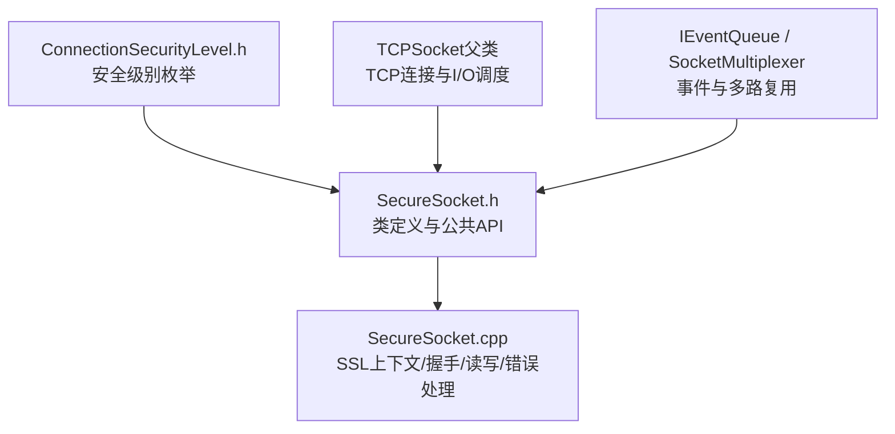
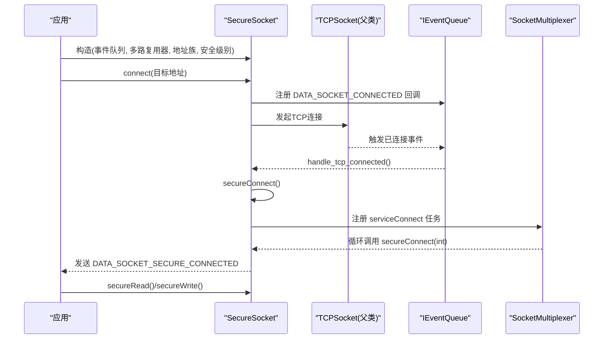
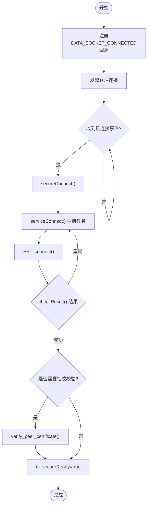
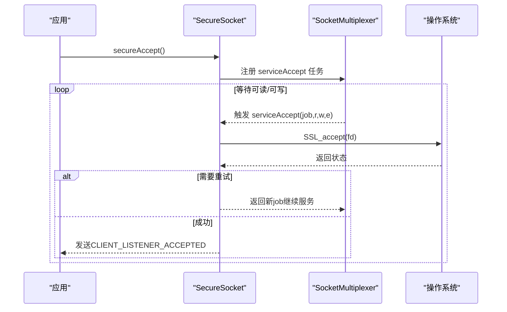
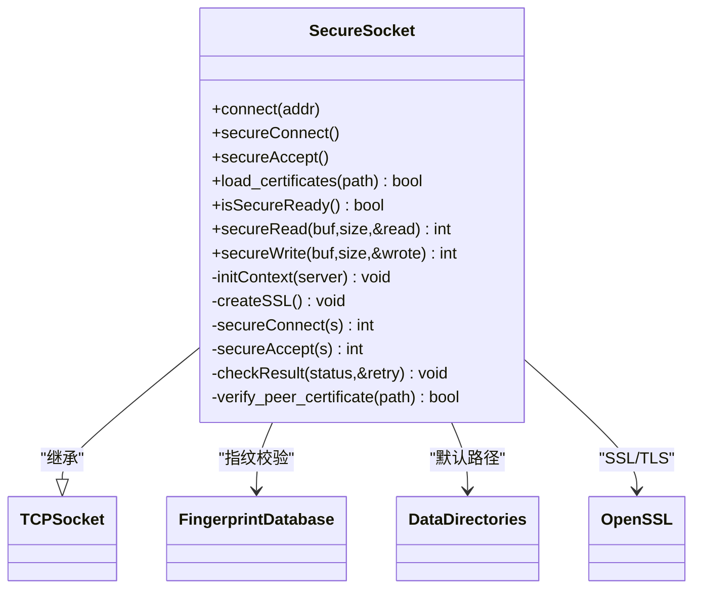

# SecureSocket 安全套接字接口

<cite>
**本文引用的文件**   
- [SecureSocket.h](file://src/lib/net/SecureSocket.h)
- [SecureSocket.cpp](file://src/lib/net/SecureSocket.cpp)
- [ConnectionSecurityLevel.h](file://src/lib/net/ConnectionSecurityLevel.h)
</cite>

## 目录
1. [简介](#简介)
2. [项目结构](#项目结构)
3. [核心组件](#核心组件)
4. [架构总览](#架构总览)
5. [详细组件分析](#详细组件分析)
6. [依赖关系分析](#依赖关系分析)
7. [性能考虑](#性能考虑)
8. [故障排查指南](#故障排查指南)
9. [结论](#结论)
10. [附录：使用示例与最佳实践](#附录使用示例与最佳实践)

## 简介
本文件为 SecureSocket 类的权威 API 文档，聚焦于安全套接字的初始化、连接建立与 SSL/TLS 握手流程。内容涵盖构造函数参数说明、connect()/secureConnect()/secureAccept() 的安全连接流程、证书加载 load_certificates() 的使用方法、错误处理机制、重试策略与性能优化建议，并提供客户端与服务端连接的完整代码示例路径与安全配置最佳实践。

## 项目结构
SecureSocket 位于网络层模块中，继承自 TCP 套接字基类，负责在现有 TCP 连接之上叠加 SSL/TLS 加密能力。其关键实现集中在头文件与源文件中，并通过事件队列与多路复用器协同工作。

图表来源
- [SecureSocket.h:35-111](file://src/lib/net/SecureSocket.h#L35-L111)
- [SecureSocket.cpp:56-116](file://src/lib/net/SecureSocket.cpp#L56-L116)
- [ConnectionSecurityLevel.h:20-24](file://src/lib/net/ConnectionSecurityLevel.h#L20-L24)

章节来源
- [SecureSocket.h:35-111](file://src/lib/net/SecureSocket.h#L35-L111)
- [SecureSocket.cpp:56-116](file://src/lib/net/SecureSocket.cpp#L56-L116)
- [ConnectionSecurityLevel.h:20-24](file://src/lib/net/ConnectionSecurityLevel.h#L20-L24)

## 核心组件
- 类 SecureSocket：封装基于 OpenSSL 的 TLS 安全传输，提供客户端与服务端两种模式的安全连接能力。
- 安全级别 ConnectionSecurityLevel：控制是否仅加密或要求双向认证（指纹校验）。
- 事件与多路复用：通过 IEventQueue 与 SocketMultiplexer 驱动非阻塞 I/O 与状态机推进。

章节来源
- [SecureSocket.h:35-111](file://src/lib/net/SecureSocket.h#L35-L111)
- [ConnectionSecurityLevel.h:20-24](file://src/lib/net/ConnectionSecurityLevel.h#L20-L24)

## 架构总览
下图展示了 SecureSocket 在连接生命周期中的关键阶段：TCP 连接建立后触发事件回调，随后进入 SSL/TLS 握手；握手成功后方可进行加密读写。

图表来源
- [SecureSocket.cpp:110-116](file://src/lib/net/SecureSocket.cpp#L110-L116)
- [SecureSocket.cpp:862-871](file://src/lib/net/SecureSocket.cpp#L862-L871)
- [SecureSocket.cpp:130-135](file://src/lib/net/SecureSocket.cpp#L130-L135)
- [SecureSocket.cpp:711-746](file://src/lib/net/SecureSocket.cpp#L711-L746)

## 详细组件分析

### 构造函数与初始化
- 构造函数签名
  - 面向新建连接：接收 IEventQueue*、SocketMultiplexer*、IArchNetwork::EAddressFamily、ConnectionSecurityLevel。
  - 面向已接受连接：接收 IEventQueue*、SocketMultiplexer*、ArchSocket、ConnectionSecurityLevel。
- 成员初始化
  - m_secureReady=false，m_fatal=false，security_level_ 默认 ENCRYPTED。
- 析构与关闭
  - 析构时标记致命错误并尽快从多路复用器移除任务，释放 SSL 资源。
  - close() 会先释放 SSL 资源再调用父类关闭。

章节来源
- [SecureSocket.h:37-41](file://src/lib/net/SecureSocket.h#L37-L41)
- [SecureSocket.cpp:56-73](file://src/lib/net/SecureSocket.cpp#L56-L73)
- [SecureSocket.cpp:75-91](file://src/lib/net/SecureSocket.cpp#L75-L91)

### 连接建立与握手流程（客户端）
- connect(NetworkAddress)
  - 注册 DATA_SOCKET_CONNECTED 事件回调，然后委托父类发起 TCP 连接。
- handle_tcp_connected(Event)
  - 收到 TCP 已连接事件后，立即启动 secureConnect()。
- secureConnect()
  - 将服务函数 serviceConnect 注册到多路复用器，由底层驱动反复尝试 SSL_connect。
- serviceConnect(job, read, write, error)
  - 跨平台获取底层 socket 描述符，调用 secureConnect(int)。
  - 成功返回 >0，失败 <0，需要重试则返回新 job 继续服务。
- secureConnect(int s)
  - 加载客户端证书（若配置），创建 SSL 对象并绑定 fd，执行 SSL_connect。
  - checkResult 解析返回值与错误码，处理 WANT_READ/WANT_WRITE 等可重试状态。
  - 成功后设置 m_secureReady=true，并根据安全级别决定是否验证对端证书指纹。

图表来源
- [SecureSocket.cpp:110-116](file://src/lib/net/SecureSocket.cpp#L110-L116)
- [SecureSocket.cpp:862-871](file://src/lib/net/SecureSocket.cpp#L862-L871)
- [SecureSocket.cpp:130-135](file://src/lib/net/SecureSocket.cpp#L130-L135)
- [SecureSocket.cpp:711-746](file://src/lib/net/SecureSocket.cpp#L711-L746)
- [SecureSocket.cpp:483-536](file://src/lib/net/SecureSocket.cpp#L483-L536)
- [SecureSocket.cpp:539-620](file://src/lib/net/SecureSocket.cpp#L539-L620)

章节来源
- [SecureSocket.cpp:110-116](file://src/lib/net/SecureSocket.cpp#L110-L116)
- [SecureSocket.cpp:862-871](file://src/lib/net/SecureSocket.cpp#L862-L871)
- [SecureSocket.cpp:130-135](file://src/lib/net/SecureSocket.cpp#L130-L135)
- [SecureSocket.cpp:711-746](file://src/lib/net/SecureSocket.cpp#L711-L746)
- [SecureSocket.cpp:483-536](file://src/lib/net/SecureSocket.cpp#L483-L536)
- [SecureSocket.cpp:539-620](file://src/lib/net/SecureSocket.cpp#L539-L620)

### 服务端接受与握手流程
- secureAccept()
  - 将服务函数 serviceAccept 注册到多路复用器，由底层驱动反复尝试 SSL_accept。
- serviceAccept(job, read, write, error)
  - 跨平台获取底层 socket 描述符，调用 secureAccept(int)。
  - 成功返回 >0，失败 <0，需要重试则返回新 job 继续服务。
- secureAccept(int s)
  - 创建 SSL 对象并绑定 fd，执行 SSL_accept。
  - checkResult 解析返回值与错误码，处理可重试状态。
  - 成功后根据安全级别决定是否验证客户端证书指纹，设置 m_secureReady=true。

图表来源
- [SecureSocket.cpp:137-143](file://src/lib/net/SecureSocket.cpp#L137-L143)
- [SecureSocket.cpp:748-782](file://src/lib/net/SecureSocket.cpp#L748-L782)
- [SecureSocket.cpp:421-481](file://src/lib/net/SecureSocket.cpp#L421-L481)

章节来源
- [SecureSocket.cpp:137-143](file://src/lib/net/SecureSocket.cpp#L137-L143)
- [SecureSocket.cpp:748-782](file://src/lib/net/SecureSocket.cpp#L748-L782)
- [SecureSocket.cpp:421-481](file://src/lib/net/SecureSocket.cpp#L421-L481)

### 证书加载与指纹校验
- load_certificates(path)
  - 校验路径有效性，加载 PEM 格式的证书与私钥，并检查私钥一致性。
  - 用于客户端侧在握手前加载本地证书（若启用认证）。
- verify_peer_certificate(fingerprint_db_path)
  - 提取对端证书信息，计算 SHA1/SHA256 指纹，读取信任库比对。
  - 当安全级别为 ENCRYPTED_AUTHENTICATED 时强制校验。

章节来源
- [SecureSocket.cpp:319-354](file://src/lib/net/SecureSocket.cpp#L319-L354)
- [SecureSocket.cpp:656-709](file://src/lib/net/SecureSocket.cpp#L656-L709)

### 读/写与数据流
- doRead()
  - 若已就绪，调用 secureRead 循环读取至输入缓冲，必要时发出 STREAM_INPUT_READY 或 STREAM_INPUT_SHUTDOWN 事件。
- doWrite()
  - 若已就绪，调用 secureWrite 写入；支持部分写入重试，避免重复拷贝。
- secureRead()/secureWrite()
  - 加锁后调用 OpenSSL 对应接口，统一经 checkResult 处理错误与重试。

章节来源
- [SecureSocket.cpp:145-202](file://src/lib/net/SecureSocket.cpp#L145-L202)
- [SecureSocket.cpp:204-249](file://src/lib/net/SecureSocket.cpp#L204-L249)
- [SecureSocket.cpp:251-302](file://src/lib/net/SecureSocket.cpp#L251-L302)

### 错误处理与重试策略
- checkResult(status, retry)
  - 解析 SSL_get_error 返回值：
    - SSL_ERROR_NONE：操作完成，重置重试计数。
    - SSL_ERROR_WANT_READ/WRITE/CONNECT/ACCEPT：可重试，递增重试计数并调整可写标志位。
    - SSL_ERROR_ZERO_RETURN：连接关闭，标记致命错误。
    - SSL_ERROR_SSL/SYSCALL/未知：记录错误并标记致命错误，断开连接。
- 重试机制
  - 握手阶段：serviceConnect/serviceAccept 在需要重试时返回新 job，由多路复用器再次调度。
  - 读写阶段：doRead/doWrite 内部根据返回值决定 kRetry/kNew/kBreak。
- 致命错误
  - isFatal(true) 后，后续读写直接返回错误，并在 disconnect() 中发出停止重试与断开事件。

章节来源
- [SecureSocket.cpp:539-620](file://src/lib/net/SecureSocket.cpp#L539-L620)
- [SecureSocket.cpp:711-746](file://src/lib/net/SecureSocket.cpp#L711-L746)
- [SecureSocket.cpp:748-782](file://src/lib/net/SecureSocket.cpp#L748-L782)
- [SecureSocket.cpp:145-202](file://src/lib/net/SecureSocket.cpp#L145-L202)
- [SecureSocket.cpp:204-249](file://src/lib/net/SecureSocket.cpp#L204-L249)
- [SecureSocket.cpp:648-654](file://src/lib/net/SecureSocket.cpp#L648-L654)

### 安全级别与行为差异
- ConnectionSecurityLevel
  - PLAINTEXT：明文（不启用 SSL）。
  - ENCRYPTED：仅加密，不强制对端证书。
  - ENCRYPTED_AUTHENTICATED：加密且要求对端证书指纹匹配。
- 行为影响
  - initContext 在 ENCRYPTED_AUTHENTICATED 模式下请求对端证书但不做系统级验证，改用自定义回调与指纹库校验。
  - 服务端/客户端在握手成功后分别校验对端指纹。

章节来源
- [ConnectionSecurityLevel.h:20-24](file://src/lib/net/ConnectionSecurityLevel.h#L20-L24)
- [SecureSocket.cpp:362-406](file://src/lib/net/SecureSocket.cpp#L362-L406)
- [SecureSocket.cpp:448-459](file://src/lib/net/SecureSocket.cpp#L448-L459)
- [SecureSocket.cpp:522-529](file://src/lib/net/SecureSocket.cpp#L522-L529)

## 依赖关系分析
- 外部依赖
  - OpenSSL：SSL_CTX/SSL 对象管理、握手与密码套件查询。
  - 文件系统：PEM 证书与私钥加载、指纹数据库读取。
  - 日志系统：调试与诊断输出。
- 内部依赖
  - TCPSocket：基础 TCP 连接与 I/O 缓冲。
  - FingerprintDatabase：指纹库读取与匹配。
  - DataDirectories：证书与指纹库默认路径。

图表来源
- [SecureSocket.h:35-111](file://src/lib/net/SecureSocket.h#L35-L111)
- [SecureSocket.cpp:319-354](file://src/lib/net/SecureSocket.cpp#L319-L354)
- [SecureSocket.cpp:656-709](file://src/lib/net/SecureSocket.cpp#L656-L709)

章节来源
- [SecureSocket.h:35-111](file://src/lib/net/SecureSocket.h#L35-L111)
- [SecureSocket.cpp:319-354](file://src/lib/net/SecureSocket.cpp#L319-L354)
- [SecureSocket.cpp:656-709](file://src/lib/net/SecureSocket.cpp#L656-L709)

## 性能考虑
- 非阻塞与多路复用
  - 通过 SocketMultiplexer 与 TSocketMultiplexerMethodJob 驱动握手与 I/O，避免阻塞线程。
- 缓冲区与拷贝
  - doWrite 使用内部缓冲减少重复拷贝；doRead 批量读取以减少事件次数。
- 重试退避
  - 握手阶段使用固定短延迟重试，避免频繁轮询造成 CPU 抖动。
- 密码套件与版本
  - 禁用 SSLv3，选择现代 TLS 方法；可在日志中查看协商密码套件以评估强度。
- 资源管理
  - 析构/close 及时释放 SSL 上下文与句柄，防止泄漏。

章节来源
- [SecureSocket.cpp:145-202](file://src/lib/net/SecureSocket.cpp#L145-L202)
- [SecureSocket.cpp:204-249](file://src/lib/net/SecureSocket.cpp#L204-L249)
- [SecureSocket.cpp:45-46](file://src/lib/net/SecureSocket.cpp#L45-L46)
- [SecureSocket.cpp:392-394](file://src/lib/net/SecureSocket.cpp#L392-L394)
- [SecureSocket.cpp:75-91](file://src/lib/net/SecureSocket.cpp#L75-L91)

## 故障排查指南
- 常见问题定位
  - 握手失败：检查 checkResult 日志，关注 WANT_* 与 SSL_ERROR_* 分类。
  - 证书问题：确认 load_certificates 返回成功，PEM 格式正确，私钥与证书匹配。
  - 指纹不匹配：核对指纹库路径与内容，确保 ENCRYPTED_AUTHENTICATED 模式下指纹一致。
- 关键日志点
  - 握手成功/失败、当前密码套件、对端证书信息与指纹摘要、指纹库读取情况。
- 断连与重试
  - 致命错误会触发 STOP_RETRY 与 DISCONNECTED 事件；观察上层是否正确处理。

章节来源
- [SecureSocket.cpp:539-620](file://src/lib/net/SecureSocket.cpp#L539-L620)
- [SecureSocket.cpp:319-354](file://src/lib/net/SecureSocket.cpp#L319-L354)
- [SecureSocket.cpp:656-709](file://src/lib/net/SecureSocket.cpp#L656-L709)
- [SecureSocket.cpp:648-654](file://src/lib/net/SecureSocket.cpp#L648-L654)

## 结论
SecureSocket 在 TCP 之上提供了完整的 TLS 安全通道能力，支持客户端与服务端两种模式，具备完善的错误处理与重试机制。通过安全级别与指纹校验，可实现强身份认证。结合多路复用与非阻塞 I/O，适合在高并发场景下稳定运行。

## 附录：使用示例与最佳实践

### 客户端连接示例（路径）
- 构造 SecureSocket（事件队列、多路复用器、IPv4/IPv6、ENCRYPTED 或 ENCRYPTED_AUTHENTICATED）
- 调用 connect(目标地址)
- 监听 DATA_SOCKET_SECURE_CONNECTED 事件
- 使用 secureRead()/secureWrite() 进行加密通信
- 参考路径
  - [SecureSocket.cpp:110-116](file://src/lib/net/SecureSocket.cpp#L110-L116)
  - [SecureSocket.cpp:862-871](file://src/lib/net/SecureSocket.cpp#L862-L871)
  - [SecureSocket.cpp:711-746](file://src/lib/net/SecureSocket.cpp#L711-L746)

### 服务端连接示例（路径）
- 构造 SecureSocket（事件队列、多路复用器、已接受 socket、安全级别）
- 调用 secureAccept()
- 监听 CLIENT_LISTENER_ACCEPTED 事件
- 使用 secureRead()/secureWrite() 进行加密通信
- 参考路径
  - [SecureSocket.cpp:137-143](file://src/lib/net/SecureSocket.cpp#L137-L143)
  - [SecureSocket.cpp:748-782](file://src/lib/net/SecureSocket.cpp#L748-L782)

### 证书加载与指纹库配置（路径）
- 客户端加载本地证书与私钥（可选，取决于安全级别）
  - 参考路径：[SecureSocket.cpp:319-354](file://src/lib/net/SecureSocket.cpp#L319-L354)
- 指纹库路径与读取
  - 参考路径：[SecureSocket.cpp:656-709](file://src/lib/net/SecureSocket.cpp#L656-L709)

### 安全最佳实践
- 优先使用 ENCRYPTED_AUTHENTICATED 并维护可信指纹库，避免中间人攻击。
- 确保证书与私钥为有效 PEM 格式，且私钥与证书匹配。
- 定期更新指纹库，轮换证书与密钥。
- 监控日志中的密码套件与握手结果，确保使用现代 TLS 版本与强密码套件。
- 合理设置超时与重试策略，避免无限重试导致资源耗尽。