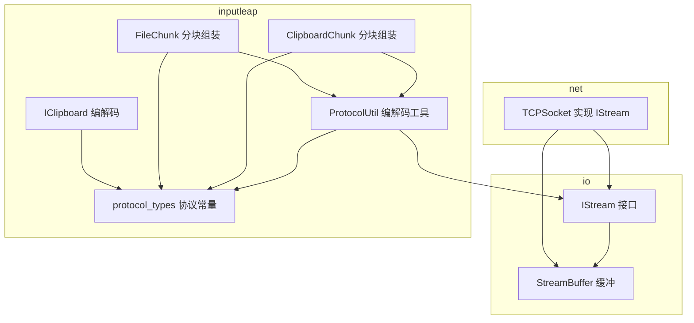
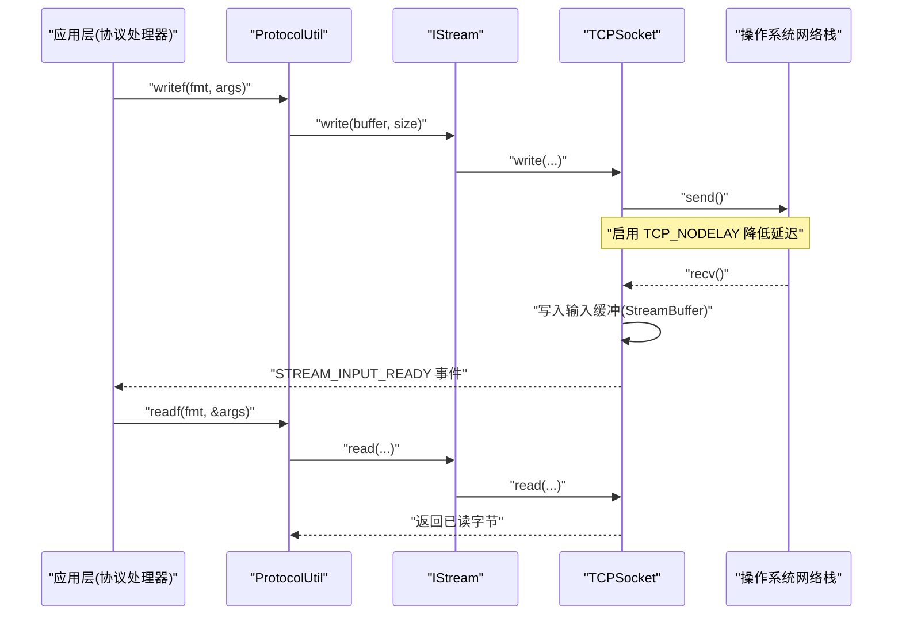
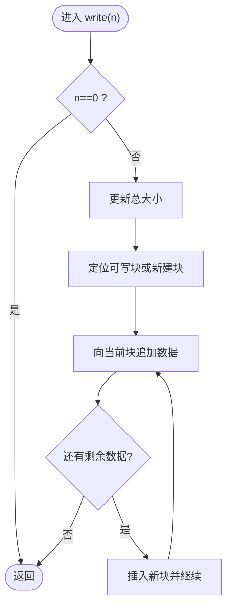
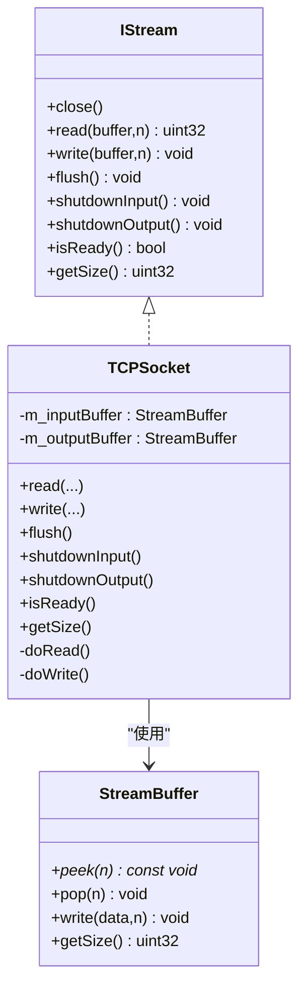
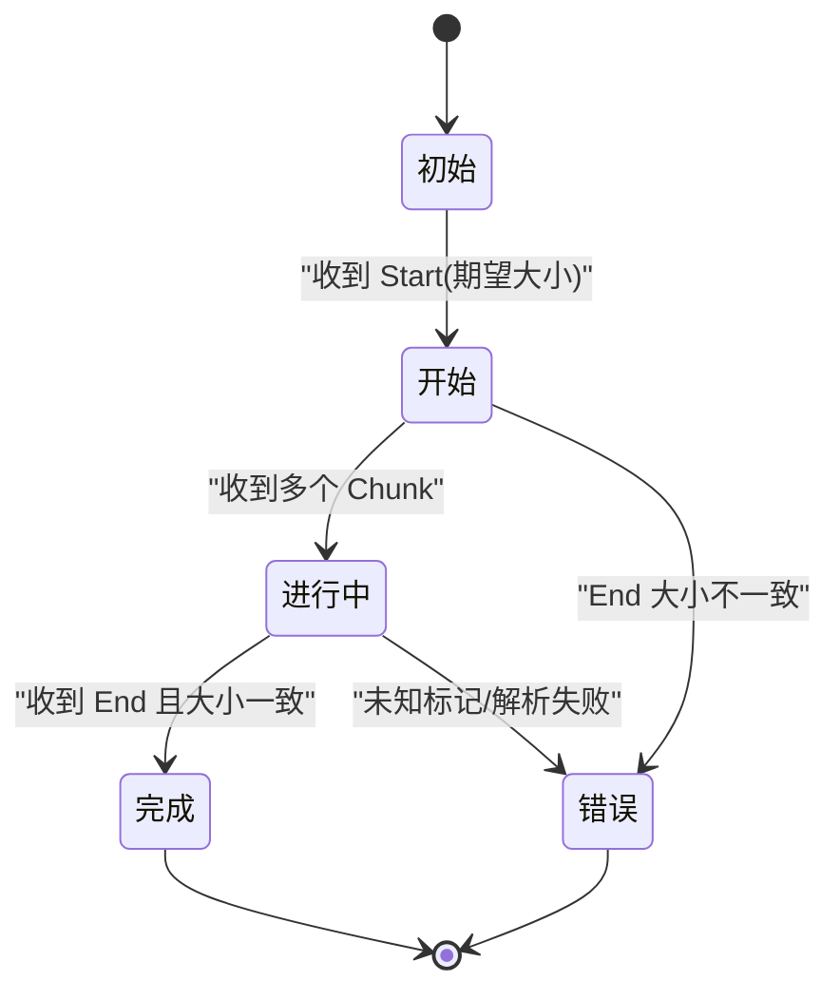
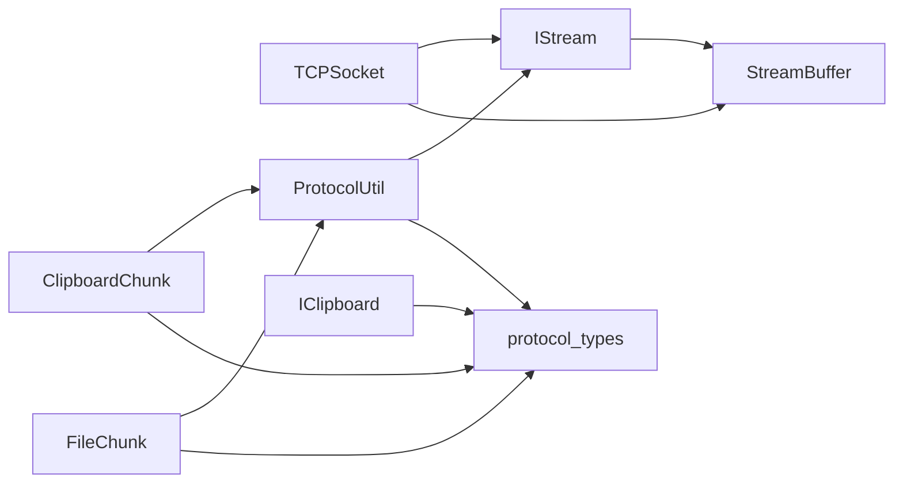

# Stream 数据流接口

<cite>
**本文引用的文件**   
- [IStream.h](file://src/lib/io/IStream.h)
- [StreamBuffer.h](file://src/lib/io/StreamBuffer.h)
- [StreamBuffer.cpp](file://src/lib/io/StreamBuffer.cpp)
- [TCPSocket.h](file://src/lib/net/TCPSocket.h)
- [TCPSocket.cpp](file://src/lib/net/TCPSocket.cpp)
- [ProtocolUtil.h](file://src/lib/inputleap/ProtocolUtil.h)
- [ProtocolUtil.cpp](file://src/lib/inputleap/ProtocolUtil.cpp)
- [protocol_types.h](file://src/lib/inputleap/protocol_types.h)
- [protocol_types.cpp](file://src/lib/inputleap/protocol_types.cpp)
- [IClipboard.cpp](file://src/lib/inputleap/IClipboard.cpp)
- [ClipboardChunk.cpp](file://src/lib/inputleap/ClipboardChunk.cpp)
- [FileChunk.cpp](file://src/lib/inputleap/FileChunk.cpp)
</cite>

## 目录
1. [简介](#简介)
2. [项目结构](#项目结构)
3. [核心组件](#核心组件)
4. [架构总览](#架构总览)
5. [详细组件分析](#详细组件分析)
6. [依赖关系分析](#依赖关系分析)
7. [性能与内存管理](#性能与内存管理)
8. [故障排查指南](#故障排查指南)
9. [结论](#结论)
10. [附录：协议帧格式与示例](#附录协议帧格式与示例)

## 简介
本文件为 InputLeap 的 Stream 及相关数据流类的 API 文档，聚焦于二进制数据的序列化、反序列化与传输协议。内容涵盖：
- 数据流的读写操作、缓冲区管理与字节序处理
- InputLeap 自定义协议的帧格式定义、消息类型标识、长度编码方式
- 输入事件、剪贴板数据、配置信息的传输格式与编解码流程
- 流式处理的性能优化技巧与内存管理最佳实践

## 项目结构
围绕 Stream 与协议的核心代码分布在以下模块：
- io：通用流接口 IStream 与缓冲实现 StreamBuffer
- net：基于 TCP 的数据套接字 TCPSocket（实现 IStream）
- inputleap：协议工具 ProtocolUtil、协议常量 protocol_types、剪贴板与文件分块编解码

图表来源
- [IStream.h:28-117](file://src/lib/io/IStream.h#L28-L117)
- [StreamBuffer.h:25-79](file://src/lib/io/StreamBuffer.h#L25-L79)
- [TCPSocket.h:39-116](file://src/lib/net/TCPSocket.h#L39-L116)
- [ProtocolUtil.h:30-95](file://src/lib/inputleap/ProtocolUtil.h#L30-L95)
- [protocol_types.h:25-350](file://src/lib/inputleap/protocol_types.h#L25-L350)
- [IClipboard.cpp:25-165](file://src/lib/inputleap/IClipboard.cpp#L25-L165)
- [ClipboardChunk.cpp:27-99](file://src/lib/inputleap/ClipboardChunk.cpp#L27-L99)
- [FileChunk.cpp:27-122](file://src/lib/inputleap/FileChunk.cpp#L27-L122)

章节来源
- [IStream.h:28-117](file://src/lib/io/IStream.h#L28-L117)
- [StreamBuffer.h:25-79](file://src/lib/io/StreamBuffer.h#L25-L79)
- [TCPSocket.h:39-116](file://src/lib/net/TCPSocket.h#L39-L116)
- [ProtocolUtil.h:30-95](file://src/lib/inputleap/ProtocolUtil.h#L30-L95)
- [protocol_types.h:25-350](file://src/lib/inputleap/protocol_types.h#L25-L350)

## 核心组件
- IStream：双向流抽象，提供 close/read/write/flush/shutdownInput/shutdownOutput/isReady/getSize 等能力，是上层协议与底层网络/IO 的契约。
- StreamBuffer：FIFO 字节缓冲，支持 peek/pop/write/getSize，内部以分块链表组织，减少拷贝并提升连续读取性能。
- TCPSocket：TCP 套接字的 IStream 实现，使用 StreamBuffer 做输入输出缓冲，结合事件多路复用进行非阻塞读写。
- ProtocolUtil：面向协议的格式化读写工具，支持定长整数（NBO）、变长向量与字符串的序列化和反序列化。
- protocol_types：协议版本、默认端口、KeepAlive 策略、最大消息长度限制以及所有消息码与字段说明。
- IClipboard/ClipboardChunk/FileChunk：剪贴板与文件传输的分块编解码与组装逻辑。

章节来源
- [IStream.h:28-117](file://src/lib/io/IStream.h#L28-L117)
- [StreamBuffer.h:25-79](file://src/lib/io/StreamBuffer.h#L25-L79)
- [StreamBuffer.cpp:49-144](file://src/lib/io/StreamBuffer.cpp#L49-L144)
- [TCPSocket.h:39-116](file://src/lib/net/TCPSocket.h#L39-L116)
- [TCPSocket.cpp:320-381](file://src/lib/net/TCPSocket.cpp#L320-L381)
- [ProtocolUtil.h:30-95](file://src/lib/inputleap/ProtocolUtil.h#L30-L95)
- [ProtocolUtil.cpp:31-103](file://src/lib/inputleap/ProtocolUtil.cpp#L31-L103)
- [protocol_types.h:25-350](file://src/lib/inputleap/protocol_types.h#L25-L350)

## 架构总览
下图展示了从应用层到网络层的调用链与数据流向：上层通过 ProtocolUtil 将结构化消息写入 IStream；TCPSocket 作为 IStream 的具体实现，将数据经系统 IO 发送；对端接收后由 ProtocolUtil 解析。

图表来源
- [ProtocolUtil.cpp:31-103](file://src/lib/inputleap/ProtocolUtil.cpp#L31-L103)
- [TCPSocket.cpp:320-381](file://src/lib/net/TCPSocket.cpp#L320-L381)
- [TCPSocket.cpp:304-318](file://src/lib/net/TCPSocket.cpp#L304-L318)

## 详细组件分析

### IStream 接口
- 职责：定义跨平台、跨实现的统一流式读写语义。
- 关键方法：
  - read/write：按字节读写，可能阻塞或触发错误事件
  - flush：确保缓冲数据落盘/发送
  - shutdownInput/shutdownOutput：半关闭，配合事件通知
  - isReady/getSize：可读性探测与保守估计可用字节数

章节来源
- [IStream.h:28-117](file://src/lib/io/IStream.h#L28-L117)

### StreamBuffer 缓冲
- 设计要点：
  - 以固定大小分块（Chunk）的链表存储，避免频繁扩容与拷贝
  - peek 会合并头部片段，保证连续内存视图
  - pop 按消费进度推进头指针，必要时清空旧块
- 复杂度：
  - write：均摊 O(1) 追加，极端情况下需分配新块
  - peek：最坏 O(k) 合并前 k 个块至首块
  - pop：O(m) 丢弃 m 个完整块

图表来源
- [StreamBuffer.cpp:95-139](file://src/lib/io/StreamBuffer.cpp#L95-L139)

章节来源
- [StreamBuffer.h:25-79](file://src/lib/io/StreamBuffer.h#L25-L79)
- [StreamBuffer.cpp:49-144](file://src/lib/io/StreamBuffer.cpp#L49-L144)

### TCPSocket 实现
- 角色：IStream 的网络实现，维护输入/输出两个 StreamBuffer。
- 行为：
  - doRead：循环读取系统 socket，填充输入缓冲，必要时触发 STREAM_INPUT_READY
  - doWrite：从输出缓冲取数据发送，成功后 discardWrittenData 推进缓冲
  - shutdownInput/Output：分别关闭读/写侧，发出对应事件
  - isReady：当输入缓冲非空时返回 true
  - flush：等待输出缓冲清空（内部条件变量协调）

图表来源
- [IStream.h:28-117](file://src/lib/io/IStream.h#L28-L117)
- [StreamBuffer.h:25-79](file://src/lib/io/StreamBuffer.h#L25-L79)
- [TCPSocket.h:39-116](file://src/lib/net/TCPSocket.h#L39-L116)
- [TCPSocket.cpp:320-381](file://src/lib/net/TCPSocket.cpp#L320-L381)

章节来源
- [TCPSocket.h:39-116](file://src/lib/net/TCPSocket.h#L39-L116)
- [TCPSocket.cpp:198-242](file://src/lib/net/TCPSocket.cpp#L198-L242)
- [TCPSocket.cpp:320-381](file://src/lib/net/TCPSocket.cpp#L320-L381)

### ProtocolUtil 编解码工具
- 功能：提供类似 printf/scanf 风格的二进制格式化读写。
- 格式符（部分）：
  - %1i/%2i/%4i：1/2/4 字节整数（%2i/%4i 为大端 NBO）
  - %1I/%2I/%4I：向量元素数组（对应 1/2/4 字节，NBO）
  - %s：%string* 的字节流
  - %S：先读/写长度 N，再读/写 N 字节原始数据
- 异常：XIOReadMismatch 用于描述格式不匹配的错误。

章节来源
- [ProtocolUtil.h:30-95](file://src/lib/inputleap/ProtocolUtil.h#L30-L95)
- [ProtocolUtil.cpp:31-103](file://src/lib/inputleap/ProtocolUtil.cpp#L31-L103)

### protocol_types 协议常量与消息
- 版本：主版本 1，次版本 6；包含历史演进注释。
- 连接参数：默认端口、Hello 握手最大长度、KeepAlive 间隔与容忍次数。
- 安全与上限：最大消息长度、列表长度、字符串长度限制。
- 消息码：命令类（C*）、数据类（D*）、查询类（Q*）、错误类（E*），附带字段说明与方向。

章节来源
- [protocol_types.h:25-350](file://src/lib/inputleap/protocol_types.h#L25-L350)
- [protocol_types.cpp:23-31](file://src/lib/inputleap/protocol_types.cpp#L23-L31)

### 剪贴板与文件分块传输
- 剪贴板打包（IClipboard::marshall/unmarshall）：
  - 格式：4 字节数量 + 若干“4 字节格式ID + 4 字节长度 + 数据”
  - 大端序写入/读取
- 剪贴板流式分块（ClipboardChunk）：
  - 状态机：Start（携带期望总大小）→ Chunk（累积）→ End（校验一致性）
- 文件分块（FileChunk）：
  - 状态机：Start（携带期望总大小）→ Chunk（累积）→ End（校验一致性）
  - 可选统计平均速率与耗时（调试日志）

图表来源
- [IClipboard.cpp:64-110](file://src/lib/inputleap/IClipboard.cpp#L64-L110)
- [ClipboardChunk.cpp:62-96](file://src/lib/inputleap/ClipboardChunk.cpp#L62-L96)
- [FileChunk.cpp:54-119](file://src/lib/inputleap/FileChunk.cpp#L54-L119)

章节来源
- [IClipboard.cpp:25-165](file://src/lib/inputleap/IClipboard.cpp#L25-L165)
- [ClipboardChunk.cpp:27-99](file://src/lib/inputleap/ClipboardChunk.cpp#L27-L99)
- [FileChunk.cpp:27-122](file://src/lib/inputleap/FileChunk.cpp#L27-L122)

## 依赖关系分析
- 低耦合：IStream 作为稳定接口，屏蔽底层差异；TCPSocket 仅依赖 IStream 与 StreamBuffer。
- 协议解耦：ProtocolUtil 独立于具体传输，只依赖 IStream 与协议常量。
- 业务扩展点：新增数据类型可通过 ProtocolUtil 的格式符快速集成。

图表来源
- [IStream.h:28-117](file://src/lib/io/IStream.h#L28-L117)
- [StreamBuffer.h:25-79](file://src/lib/io/StreamBuffer.h#L25-L79)
- [TCPSocket.h:39-116](file://src/lib/net/TCPSocket.h#L39-L116)
- [ProtocolUtil.h:30-95](file://src/lib/inputleap/ProtocolUtil.h#L30-L95)
- [protocol_types.h:25-350](file://src/lib/inputleap/protocol_types.h#L25-L350)
- [ClipboardChunk.cpp:27-99](file://src/lib/inputleap/ClipboardChunk.cpp#L27-L99)
- [FileChunk.cpp:27-122](file://src/lib/inputleap/FileChunk.cpp#L27-L122)
- [IClipboard.cpp:25-165](file://src/lib/inputleap/IClipboard.cpp#L25-L165)

## 性能与内存管理
- 零拷贝倾向：
  - StreamBuffer::peek 尽量返回连续内存视图，减少上层拷贝
  - TCPSocket::doWrite 直接取输出缓冲数据进行发送
- 小延迟优先：
  - 设置 TCP_NODELAY，降低鼠标移动等高频事件的延迟
- 缓冲控制：
  - 输入缓冲有最大阈值，防止恶意或异常流量导致内存膨胀
  - 输出缓冲按需 flush，避免不必要阻塞
- 内存碎片：
  - 分块链表降低大块分配压力，但需注意长期运行下的碎片化；必要时定期清理或重建缓冲
- 并发安全：
  - TCPSocket 内部使用互斥保护读写状态，避免竞态

章节来源
- [TCPSocket.cpp:304-318](file://src/lib/net/TCPSocket.cpp#L304-L318)
- [TCPSocket.cpp:320-381](file://src/lib/net/TCPSocket.cpp#L320-L381)
- [StreamBuffer.cpp:49-144](file://src/lib/io/StreamBuffer.cpp#L49-L144)

## 故障排查指南
- 常见错误
  - 协议不匹配：XIOReadMismatch 表示 readf 解析失败，检查格式符与顺序
  - 分块不完整：剪贴板/文件结束校验失败，检查期望大小与实际累计大小
  - 连接中断：STREAM_INPUT_SHUTDOWN/STREAM_OUTPUT_SHUTDOWN/SOCKET_DISCONNECTED 事件
- 诊断建议
  - 开启 DEBUG/DEBUG2 日志，观察分块传输速率与耗时
  - 确认对端是否遵循 KeepAlive 策略，超时将被断开
  - 检查最大消息长度限制，超大消息会被拒绝

章节来源
- [ProtocolUtil.h:83-95](file://src/lib/inputleap/ProtocolUtil.h#L83-L95)
- [ClipboardChunk.cpp:82-96](file://src/lib/inputleap/ClipboardChunk.cpp#L82-L96)
- [FileChunk.cpp:99-119](file://src/lib/inputleap/FileChunk.cpp#L99-L119)
- [TCPSocket.cpp:198-242](file://src/lib/net/TCPSocket.cpp#L198-L242)

## 结论
InputLeap 的 Stream 体系以 IStream 为核心抽象，结合 StreamBuffer 的高效缓冲与 TCPSocket 的非阻塞网络实现，提供了稳定、可扩展的二进制数据通道。ProtocolUtil 简化了复杂结构的序列化/反序列化工作，配合 protocol_types 的消息定义，形成了清晰、可维护的协议层。剪贴板与文件的分块传输在可靠性与性能之间取得平衡，适合高吞吐与实时性要求并存的使用场景。

## 附录：协议帧格式与示例

### 通用帧格式与长度编码
- 消息码：固定 4 字节 ASCII 码（如 CCLP、DKEY 等）
- 参数：紧跟消息码之后，按 protocol_types 中定义的字段顺序与类型排列
- 长度编码：
  - 定长整数：%1i/%2i/%4i，其中 %2i/%4i 为大端序（NBO）
  - 变长数据：%S 先传长度（NBO），再传 N 字节负载
  - 向量：%1I/%2I/%4I 按元素宽度序列化，%2I/%4I 为 NBO

章节来源
- [protocol_types.h:99-103](file://src/lib/inputleap/protocol_types.h#L99-L103)
- [ProtocolUtil.h:42-71](file://src/lib/inputleap/ProtocolUtil.h#L42-L71)
- [protocol_types.cpp:23-31](file://src/lib/inputleap/protocol_types.cpp#L23-L31)

### 握手与保活
- Hello/HelloBack：交换主/次版本号与客户端名称
- KeepAlive：周期性心跳，未响应则判定连接失效

章节来源
- [protocol_types.h:113-183](file://src/lib/inputleap/protocol_types.h#L113-L183)

### 输入事件（键盘/鼠标）
- 键盘按下/释放/重复：包含键码、修饰键掩码、物理键按钮（兼容旧版）
- 鼠标移动/相对移动/滚轮：绝对坐标或增量，支持水平滚动

章节来源
- [protocol_types.h:189-244](file://src/lib/inputleap/protocol_types.h#L189-L244)

### 剪贴板数据
- 一次性打包（IClipboard）：
  - 4 字节格式数量
  - 每个格式：4 字节格式ID + 4 字节长度 + 数据
- 流式分块（ClipboardChunk）：
  - Start：携带期望总大小
  - Chunk：多次累积
  - End：校验总大小一致

章节来源
- [IClipboard.cpp:64-110](file://src/lib/inputleap/IClipboard.cpp#L64-L110)
- [ClipboardChunk.cpp:62-96](file://src/lib/inputleap/ClipboardChunk.cpp#L62-L96)

### 配置信息（选项）
- SetOptions：主站下发选项键值对，客户端应据此更新本地配置

章节来源
- [protocol_types.h:268-272](file://src/lib/inputleap/protocol_types.h#L268-L272)

### 文件传输
- 分块协议（FileChunk）：
  - Start：携带期望总大小
  - Chunk：多次累积
  - End：校验总大小一致，并记录统计信息（可选）

章节来源
- [FileChunk.cpp:54-119](file://src/lib/inputleap/FileChunk.cpp#L54-L119)