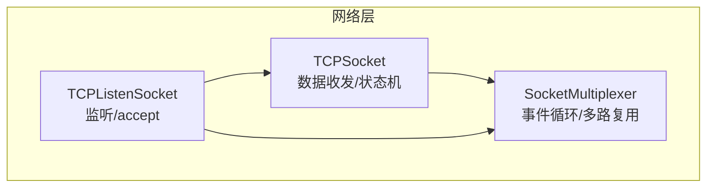
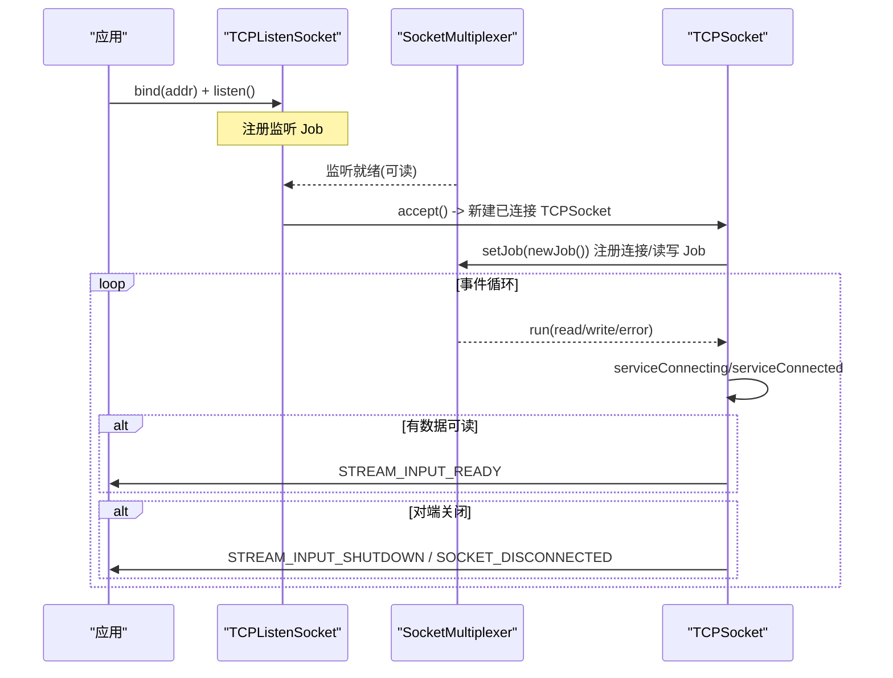
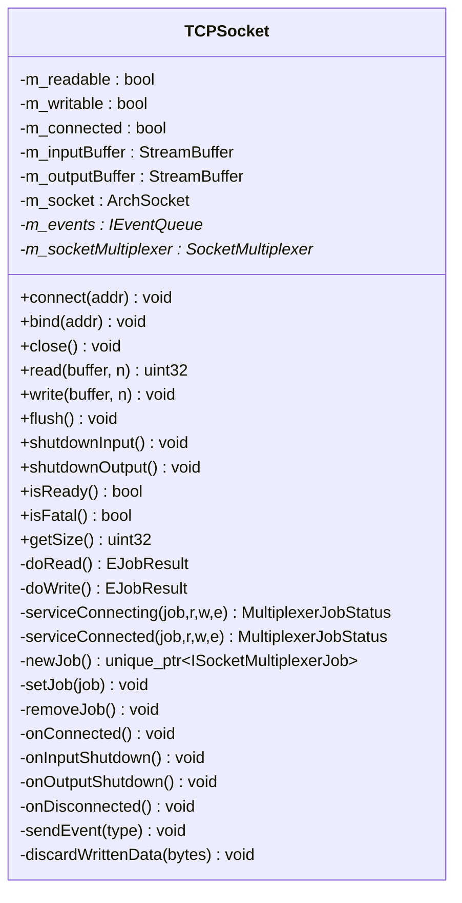
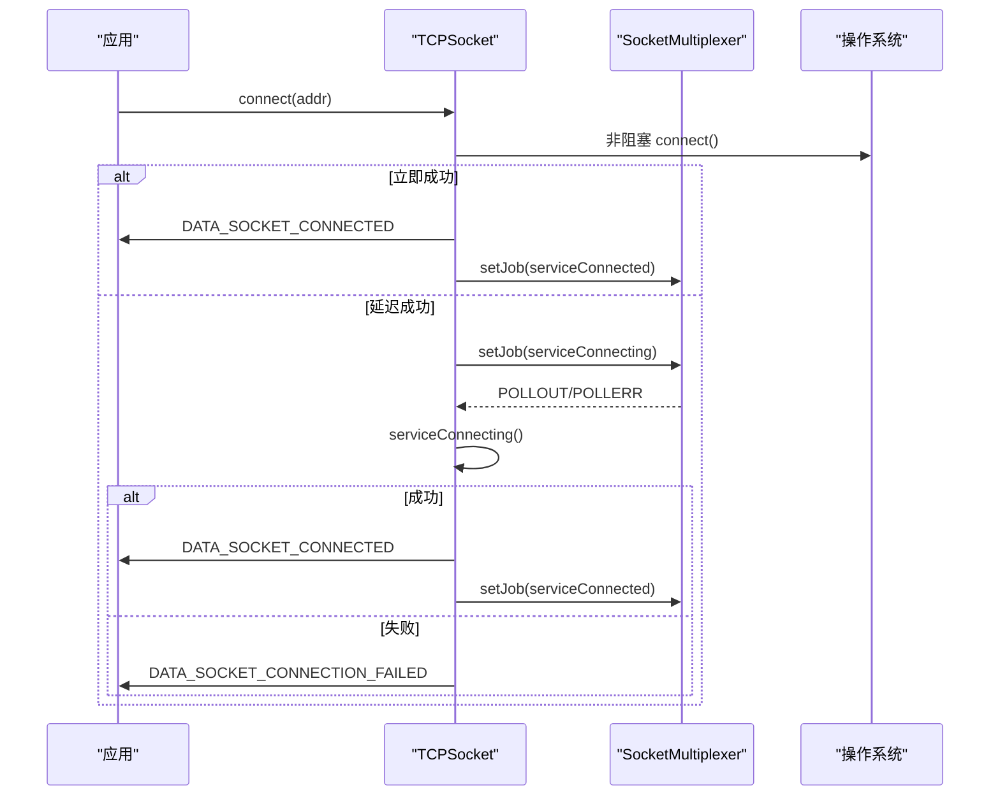
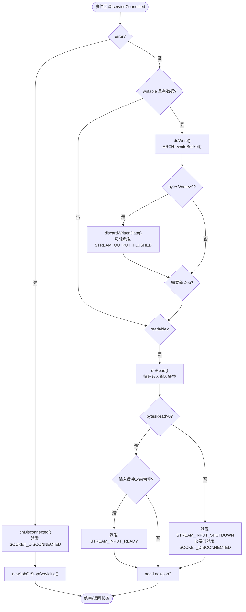
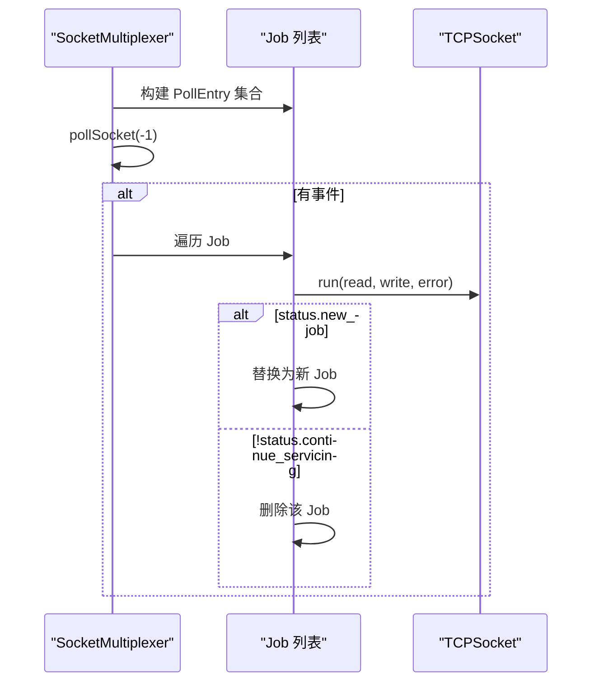
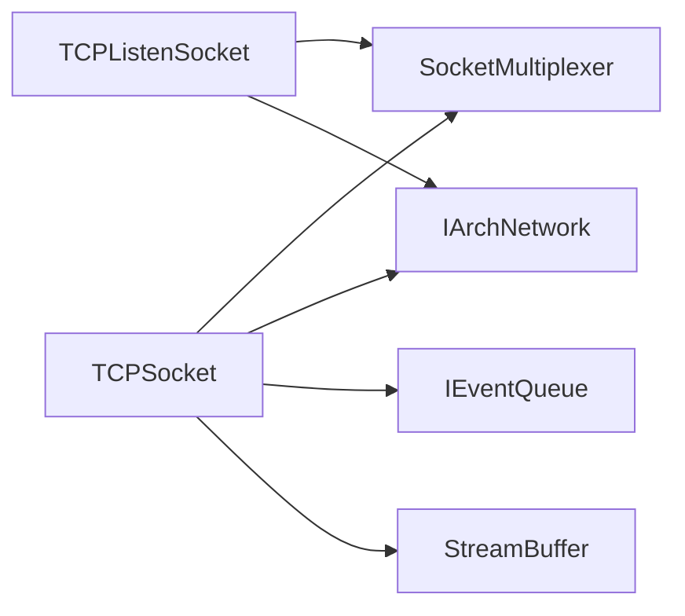

# TCPSocket TCP 连接接口

<cite>
**本文引用的文件**
- [TCPSocket.h](file://src/lib/net/TCPSocket.h)
- [TCPSocket.cpp](file://src/lib/net/TCPSocket.cpp)
- [SocketMultiplexer.h](file://src/lib/net/SocketMultiplexer.h)
- [SocketMultiplexer.cpp](file://src/lib/net/SocketMultiplexer.cpp)
- [TCPListenSocket.cpp](file://src/lib/net/TCPListenSocket.cpp)
</cite>

## 目录
1. [简介](#简介)
2. [项目结构](#项目结构)
3. [核心组件](#核心组件)
4. [架构总览](#架构总览)
5. [详细组件分析](#详细组件分析)
6. [依赖关系分析](#依赖关系分析)
7. [性能与行为特性](#性能与行为特性)
8. [故障排查指南](#故障排查指南)
9. [结论](#结论)
10. [附录：API 参考](#附录api-参考)

## 简介
本文件为 TCPSocket 类的完整 API 文档，聚焦于 TCP 连接的建立、数据传输、连接管理等基础网络操作。内容涵盖 connect()、accept()（由监听套接字提供）、read()、write() 等核心方法的参数与返回值语义；说明网络地址解析、端口绑定、超时设置、非阻塞 I/O 模式的使用；并提供连接生命周期管理示例（连接池、重连机制、错误恢复策略）以及与底层 SocketMultiplexer 的集成方式和事件驱动模型。

## 项目结构
TCPSocket 位于网络层模块中，负责基于 TCP 的数据传输与状态机管理；SocketMultiplexer 提供多路复用服务线程，统一调度各 socket 的可读/可写事件；TCPListenSocket 负责监听新连接并通过 accept() 返回已连接的 TCPSocket。

图表来源
- [TCPSocket.h:39-116](file://src/lib/net/TCPSocket.h#L39-L116)
- [SocketMultiplexer.h:37-116](file://src/lib/net/SocketMultiplexer.h#L37-L116)
- [TCPListenSocket.cpp:104-125](file://src/lib/net/TCPListenSocket.cpp#L104-L125)

章节来源
- [TCPSocket.h:39-116](file://src/lib/net/TCPSocket.h#L39-L116)
- [SocketMultiplexer.h:37-116](file://src/lib/net/SocketMultiplexer.h#L37-L116)
- [TCPListenSocket.cpp:104-125](file://src/lib/net/TCPListenSocket.cpp#L104-L125)

## 核心组件
- TCPSocket：实现 IDataSocket/IStream/ISocket 接口，封装 TCP 连接的生命周期、读写缓冲、事件派发与非阻塞 I/O 处理。
- SocketMultiplexer：单例式后台服务线程，维护所有 socket 的 Job 列表，使用 poll 进行事件分发，调用 ISocketMultiplexerJob::run 回调。
- TCPListenSocket：监听套接字，bind/listen 后通过 accept() 返回已连接的 TCPSocket。

章节来源
- [TCPSocket.h:39-116](file://src/lib/net/TCPSocket.h#L39-L116)
- [TCPSocket.cpp:38-79](file://src/lib/net/TCPSocket.cpp#L38-L79)
- [SocketMultiplexer.h:37-116](file://src/lib/net/SocketMultiplexer.h#L37-L116)
- [SocketMultiplexer.cpp:135-246](file://src/lib/net/SocketMultiplexer.cpp#L135-L246)
- [TCPListenSocket.cpp:58-80](file://src/lib/net/TCPListenSocket.cpp#L58-L80)

## 架构总览
TCPSocket 通过 SocketMultiplexer 注册“作业”（Job），在可读/可写事件发生时执行 serviceConnecting/serviceConnected 状态机，完成连接建立、数据收发与断开处理。TCPListenSocket 在监听就绪时接受新连接并构造 TCPSocket，随后交由 Multiplexer 继续服务。

图表来源
- [TCPListenSocket.cpp:104-125](file://src/lib/net/TCPListenSocket.cpp#L104-L125)
- [TCPSocket.cpp:407-434](file://src/lib/net/TCPSocket.cpp#L407-L434)
- [TCPSocket.cpp:495-537](file://src/lib/net/TCPSocket.cpp#L495-L537)
- [TCPSocket.cpp:539-608](file://src/lib/net/TCPSocket.cpp#L539-L608)
- [SocketMultiplexer.cpp:135-246](file://src/lib/net/SocketMultiplexer.cpp#L135-L246)

## 详细组件分析

### TCPSocket 类图

图表来源
- [TCPSocket.h:39-116](file://src/lib/net/TCPSocket.h#L39-L116)
- [TCPSocket.cpp:130-181](file://src/lib/net/TCPSocket.cpp#L130-L181)
- [TCPSocket.cpp:265-292](file://src/lib/net/TCPSocket.cpp#L265-L292)
- [TCPSocket.cpp:320-381](file://src/lib/net/TCPSocket.cpp#L320-L381)
- [TCPSocket.cpp:407-434](file://src/lib/net/TCPSocket.cpp#L407-L434)
- [TCPSocket.cpp:495-608](file://src/lib/net/TCPSocket.cpp#L495-L608)

#### 关键方法语义与行为
- connect(const NetworkAddress& addr)
  - 作用：发起非阻塞 TCP 连接。若本地 socket 未创建或已连接则立即失败并派发连接失败事件。
  - 成功路径：若内核立即连接成功，派发 DATA_SOCKET_CONNECTED 并进入已连接状态；否则标记可写，等待 Multiplexer 通知连接完成。
  - 失败路径：派发 DATA_SOCKET_CONNECTION_FAILED 并进入断开态。
  - 参考路径：[TCPSocket.cpp:265-292](file://src/lib/net/TCPSocket.cpp#L265-L292)

- read(void* buffer, std::uint32_t n)
  - 作用：从输入缓冲拷贝最多 n 字节到用户缓冲区，返回实际拷贝字节数。
  - 行为：若无数据返回 0；当输入缓冲为空且两端均不可读写时派发 SOCKET_DISCONNECTED。
  - 参考路径：[TCPSocket.cpp:130-150](file://src/lib/net/TCPSocket.cpp#L130-L150)

- write(const void* buffer, std::uint32_t n)
  - 作用：将数据追加至输出缓冲，必要时注册可写 Job 以触发发送。
  - 行为：若输出侧已 shutdown 则派发 STREAM_OUTPUT_ERROR；空写入被忽略。
  - 参考路径：[TCPSocket.cpp:152-181](file://src/lib/net/TCPSocket.cpp#L152-L181)

- flush()
  - 作用：阻塞等待输出缓冲清空（STREAM_OUTPUT_FLUSHED 事件）。
  - 参考路径：[TCPSocket.cpp:183-188](file://src/lib/net/TCPSocket.cpp#L183-L188)

- shutdownInput()/shutdownOutput()
  - 作用：分别关闭对端读取/写入能力，派发相应 SHUTDOWN 事件并清理缓冲。
  - 参考路径：[TCPSocket.cpp:190-242](file://src/lib/net/TCPSocket.cpp#L190-L242)

- isReady()/getSize()
  - 作用：查询输入缓冲是否非空/剩余字节数。
  - 参考路径：[TCPSocket.cpp:244-263](file://src/lib/net/TCPSocket.cpp#L244-L263)

- close()
  - 作用：移除 Multiplexer 中的 Job，派发断开事件，关闭底层 socket。
  - 参考路径：[TCPSocket.cpp:95-123](file://src/lib/net/TCPSocket.cpp#L95-L123)

- bind(const NetworkAddress&)
  - 作用：将 socket 绑定到指定地址（客户端通常不需要）。
  - 异常映射：地址占用抛出 XSocketAddressInUse，其他网络错误抛出 XSocketBind。
  - 参考路径：[TCPSocket.cpp:81-93](file://src/lib/net/TCPSocket.cpp#L81-L93)

- accept()（由 TCPListenSocket 提供）
  - 作用：从监听队列取出一个已连接 socket，返回新的 TCPSocket。
  - 参考路径：[TCPListenSocket.cpp:104-125](file://src/lib/net/TCPListenSocket.cpp#L104-L125)

#### 连接建立序列（客户端）

图表来源
- [TCPSocket.cpp:265-292](file://src/lib/net/TCPSocket.cpp#L265-L292)
- [TCPSocket.cpp:495-537](file://src/lib/net/TCPSocket.cpp#L495-L537)
- [TCPSocket.cpp:407-434](file://src/lib/net/TCPSocket.cpp#L407-L434)

#### 数据收发流程（已连接）

图表来源
- [TCPSocket.cpp:539-608](file://src/lib/net/TCPSocket.cpp#L539-L608)
- [TCPSocket.cpp:320-381](file://src/lib/net/TCPSocket.cpp#L320-L381)
- [TCPSocket.cpp:450-458](file://src/lib/net/TCPSocket.cpp#L450-L458)

### SocketMultiplexer 集成与事件驱动模型
- 角色：后台服务线程持续收集所有 socket 的 PollEntry，调用 ARCH->pollSocket 等待事件，然后遍历 Job 列表并调用其 run(read, write, error)。
- 任务替换：Job 返回状态指示是否继续服务、是否需要替换为新 Job 或停止服务。
- 并发安全：通过“锁的锁”和条件变量保证主循环与其他线程对 Job 列表的修改互斥。

图表来源
- [SocketMultiplexer.cpp:135-246](file://src/lib/net/SocketMultiplexer.cpp#L135-L246)
- [SocketMultiplexer.h:37-116](file://src/lib/net/SocketMultiplexer.h#L37-L116)

章节来源
- [SocketMultiplexer.cpp:73-133](file://src/lib/net/SocketMultiplexer.cpp#L73-L133)
- [SocketMultiplexer.cpp:135-246](file://src/lib/net/SocketMultiplexer.cpp#L135-L246)
- [SocketMultiplexer.h:37-116](file://src/lib/net/SocketMultiplexer.h#L37-L116)

## 依赖关系分析
- TCPSocket 依赖：
  - SocketMultiplexer：注册/移除 Job，驱动事件循环。
  - IArchNetwork：创建/绑定/连接/读写/关闭底层 socket，以及设置 NoDelay。
  - IEventQueue：派发各类事件（连接、断开、输入就绪、输出刷新等）。
  - StreamBuffer：输入/输出缓冲管理。
- TCPListenSocket 依赖：
  - SocketMultiplexer：注册监听 Job。
  - IArchNetwork：listen/accept。

图表来源
- [TCPSocket.h:39-116](file://src/lib/net/TCPSocket.h#L39-L116)
- [TCPSocket.cpp:19-28](file://src/lib/net/TCPSocket.cpp#L19-L28)
- [SocketMultiplexer.h:37-116](file://src/lib/net/SocketMultiplexer.h#L37-L116)
- [TCPListenSocket.cpp:58-80](file://src/lib/net/TCPListenSocket.cpp#L58-L80)

章节来源
- [TCPSocket.h:39-116](file://src/lib/net/TCPSocket.h#L39-L116)
- [TCPSocket.cpp:19-28](file://src/lib/net/TCPSocket.cpp#L19-L28)
- [SocketMultiplexer.h:37-116](file://src/lib/net/SocketMultiplexer.h#L37-L116)
- [TCPListenSocket.cpp:58-80](file://src/lib/net/TCPListenSocket.cpp#L58-L80)

## 性能与行为特性
- 非阻塞 I/O：connect 为非阻塞，连接结果通过 Multiplexer 的 POLLOUT/POLLERR 通知；读写也基于事件驱动，避免忙轮询。
- Nagle 禁用：初始化时调用 setNoDelayOnSocket(true)，降低短消息延迟，适合鼠标/键盘事件场景。
- 输入缓冲上限：内部限制最大输入缓冲大小，防止内存无限增长。
- 输出刷新同步：flush() 等待 STREAM_OUTPUT_FLUSHED 事件，确保数据落盘/发送完毕。
- 事件粒度：输入缓冲首次有数据时派发 STREAM_INPUT_READY；输出缓冲清空时派发 STREAM_OUTPUT_FLUSHED。

章节来源
- [TCPSocket.cpp:295-318](file://src/lib/net/TCPSocket.cpp#L295-L318)
- [TCPSocket.cpp:320-362](file://src/lib/net/TCPSocket.cpp#L320-L362)
- [TCPSocket.cpp:450-458](file://src/lib/net/TCPSocket.cpp#L450-L458)

## 故障排查指南
- 连接失败
  - 现象：收到 DATA_SOCKET_CONNECTION_FAILED。
  - 原因：远端拒绝、网络不可达、系统错误码等。
  - 建议：记录错误信息，实施退避重试；检查防火墙与路由。
  - 参考路径：[TCPSocket.cpp:436-442](file://src/lib/net/TCPSocket.cpp#L436-L442), [TCPSocket.cpp:495-537](file://src/lib/net/TCPSocket.cpp#L495-L537)

- 对端关闭
  - 现象：收到 STREAM_INPUT_SHUTDOWN 或 SOCKET_DISCONNECTED。
  - 原因：对端主动关闭或网络中断。
  - 建议：清理资源，必要时重建连接。
  - 参考路径：[TCPSocket.cpp:320-362](file://src/lib/net/TCPSocket.cpp#L320-L362), [TCPSocket.cpp:539-608](file://src/lib/net/TCPSocket.cpp#L539-L608)

- 写入错误
  - 现象：STREAM_OUTPUT_ERROR 或 SOCKET_DISCONNECTED。
  - 原因：对端关闭、网络断开、底层写入异常。
  - 建议：停止写入，释放资源，尝试重连。
  - 参考路径：[TCPSocket.cpp:539-608](file://src/lib/net/TCPSocket.cpp#L539-L608)

- 端口占用
  - 现象：bind 抛出 XSocketAddressInUse。
  - 建议：更换端口或等待释放；服务端建议使用 SO_REUSEADDR。
  - 参考路径：[TCPListenSocket.cpp:58-80](file://src/lib/net/TCPListenSocket.cpp#L58-L80)

章节来源
- [TCPSocket.cpp:436-442](file://src/lib/net/TCPSocket.cpp#L436-L442)
- [TCPSocket.cpp:495-537](file://src/lib/net/TCPSocket.cpp#L495-L537)
- [TCPSocket.cpp:539-608](file://src/lib/net/TCPSocket.cpp#L539-L608)
- [TCPListenSocket.cpp:58-80](file://src/lib/net/TCPListenSocket.cpp#L58-L80)

## 结论
TCPSocket 提供了面向事件驱动的 TCP 通信抽象，结合 SocketMultiplexer 的多路复用能力，实现了高效、可扩展的连接管理与数据传输。通过合理的事件处理与缓冲控制，能够稳定支撑高频短消息场景。配合适当的重连与错误恢复策略，可在复杂网络环境中保持鲁棒性。

## 附录：API 参考

### 连接管理
- connect(const NetworkAddress& addr)
  - 参数：目标网络地址（含主机与端口）。
  - 行为：发起非阻塞连接；成功或失败通过事件通知。
  - 事件：DATA_SOCKET_CONNECTED、DATA_SOCKET_CONNECTION_FAILED。
  - 参考路径：[TCPSocket.cpp:265-292](file://src/lib/net/TCPSocket.cpp#L265-L292)

- close()
  - 行为：移除事件订阅，派发断开事件，关闭底层 socket。
  - 事件：SOCKET_DISCONNECTED。
  - 参考路径：[TCPSocket.cpp:95-123](file://src/lib/net/TCPSocket.cpp#L95-L123)

- bind(const NetworkAddress& addr)
  - 用途：绑定本地地址（客户端一般无需调用）。
  - 异常：XSocketAddressInUse、XSocketBind。
  - 参考路径：[TCPSocket.cpp:81-93](file://src/lib/net/TCPSocket.cpp#L81-L93)

- accept()（由 TCPListenSocket 提供）
  - 行为：返回一个新的已连接 TCPSocket。
  - 参考路径：[TCPListenSocket.cpp:104-125](file://src/lib/net/TCPListenSocket.cpp#L104-L125)

### 数据传输
- read(void* buffer, std::uint32_t n)
  - 参数：输出缓冲指针与长度。
  - 返回：实际拷贝字节数（可能小于 n）。
  - 事件：无直接事件；当缓冲为空且两端不可读写时派发 SOCKET_DISCONNECTED。
  - 参考路径：[TCPSocket.cpp:130-150](file://src/lib/net/TCPSocket.cpp#L130-L150)

- write(const void* buffer, std::uint32_t n)
  - 参数：待发送数据指针与长度。
  - 行为：追加到输出缓冲；必要时注册可写事件。
  - 事件：STREAM_OUTPUT_ERROR（若输出已关闭）。
  - 参考路径：[TCPSocket.cpp:152-181](file://src/lib/net/TCPSocket.cpp#L152-L181)

- flush()
  - 行为：阻塞直到输出缓冲清空。
  - 事件：STREAM_OUTPUT_FLUSHED。
  - 参考路径：[TCPSocket.cpp:183-188](file://src/lib/net/TCPSocket.cpp#L183-L188)

- shutdownInput()/shutdownOutput()
  - 行为：分别关闭读取/写入通道，派发对应 SHUTDOWN 事件。
  - 参考路径：[TCPSocket.cpp:190-242](file://src/lib/net/TCPSocket.cpp#L190-L242)

- isReady()/getSize()
  - 行为：查询输入缓冲是否非空/剩余字节数。
  - 参考路径：[TCPSocket.cpp:244-263](file://src/lib/net/TCPSocket.cpp#L244-L263)

### 事件清单（部分）
- DATA_SOCKET_CONNECTED：连接建立成功。
- DATA_SOCKET_CONNECTION_FAILED：连接建立失败。
- STREAM_INPUT_READY：输入缓冲首次有数据。
- STREAM_INPUT_SHUTDOWN：对端关闭读取端。
- STREAM_OUTPUT_SHUTDOWN：本地关闭写入端。
- STREAM_OUTPUT_FLUSHED：输出缓冲清空。
- STREAM_OUTPUT_ERROR：写入错误。
- SOCKET_DISCONNECTED：连接断开。

章节来源
- [TCPSocket.cpp:130-181](file://src/lib/net/TCPSocket.cpp#L130-L181)
- [TCPSocket.cpp:183-242](file://src/lib/net/TCPSocket.cpp#L183-L242)
- [TCPSocket.cpp:244-263](file://src/lib/net/TCPSocket.cpp#L244-L263)
- [TCPSocket.cpp:265-292](file://src/lib/net/TCPSocket.cpp#L265-L292)
- [TCPSocket.cpp:436-442](file://src/lib/net/TCPSocket.cpp#L436-L442)
- [TCPSocket.cpp:450-458](file://src/lib/net/TCPSocket.cpp#L450-L458)
- [TCPListenSocket.cpp:104-125](file://src/lib/net/TCPListenSocket.cpp#L104-L125)

### 网络地址解析、端口绑定与超时
- 地址解析与端口绑定
  - 地址对象由 NetworkAddress 表示，传入 connect/bind/accept 相关 API。
  - 服务端需先 bind 再 listen（由 TCPListenSocket 封装），客户端通常直接 connect。
  - 参考路径：[TCPListenSocket.cpp:58-80](file://src/lib/net/TCPListenSocket.cpp#L58-L80), [TCPSocket.cpp:81-93](file://src/lib/net/TCPSocket.cpp#L81-L93)

- 超时设置
  - 当前实现未暴露显式超时 API；连接超时可通过上层逻辑结合事件（如 DATA_SOCKET_CONNECTION_FAILED）与定时器实现。
  - 参考路径：[TCPSocket.cpp:265-292](file://src/lib/net/TCPSocket.cpp#L265-L292)

- 非阻塞 I/O
  - 默认非阻塞；连接结果通过 Multiplexer 事件回调。
  - 参考路径：[TCPSocket.cpp:265-292](file://src/lib/net/TCPSocket.cpp#L265-L292), [SocketMultiplexer.cpp:135-246](file://src/lib/net/SocketMultiplexer.cpp#L135-L246)

### 连接生命周期管理示例（指导）
- 连接池
  - 维护一组空闲/占用的 TCPSocket，按负载分配；回收时仅关闭输出或整体 close。
  - 注意：复用前需确认 m_connected 与缓冲状态。
- 重连机制
  - 监听 SOCKET_DISCONNECTED/DATA_SOCKET_CONNECTION_FAILED，采用指数退避重试；限制最大重试次数。
- 错误恢复
  - 区分可恢复错误（网络抖动）与致命错误（协议不匹配）；前者自动重试，后者上报并终止。
- 半关闭与优雅退出
  - 先 shutdownOutput() 等待 flush()，再 shutdownInput()，最后 close()。

[本节为概念性指导，不直接分析具体文件]