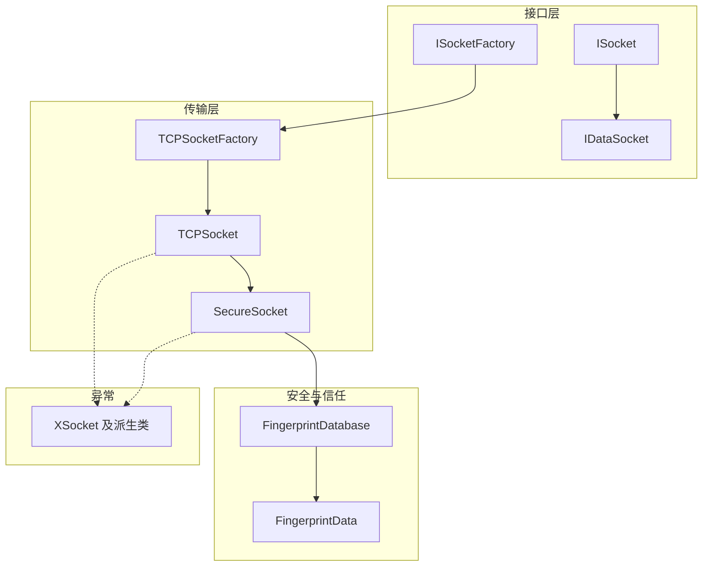
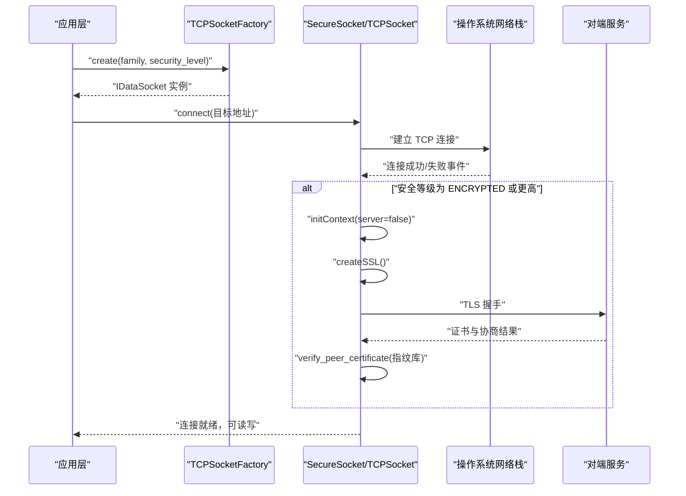
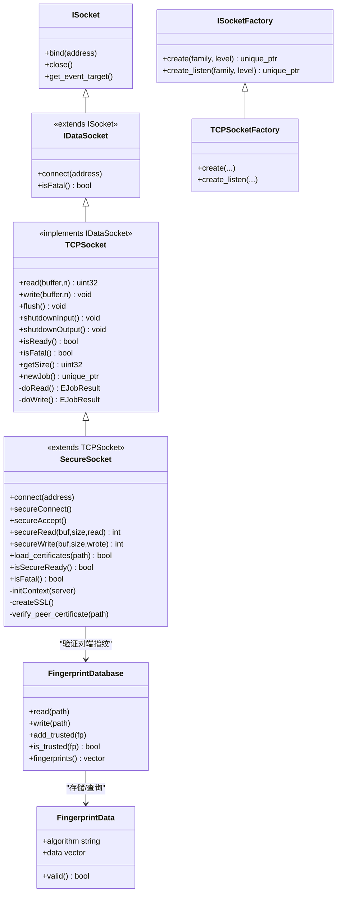
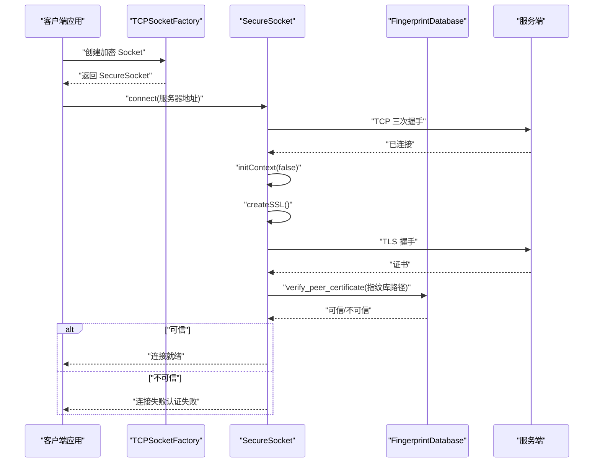
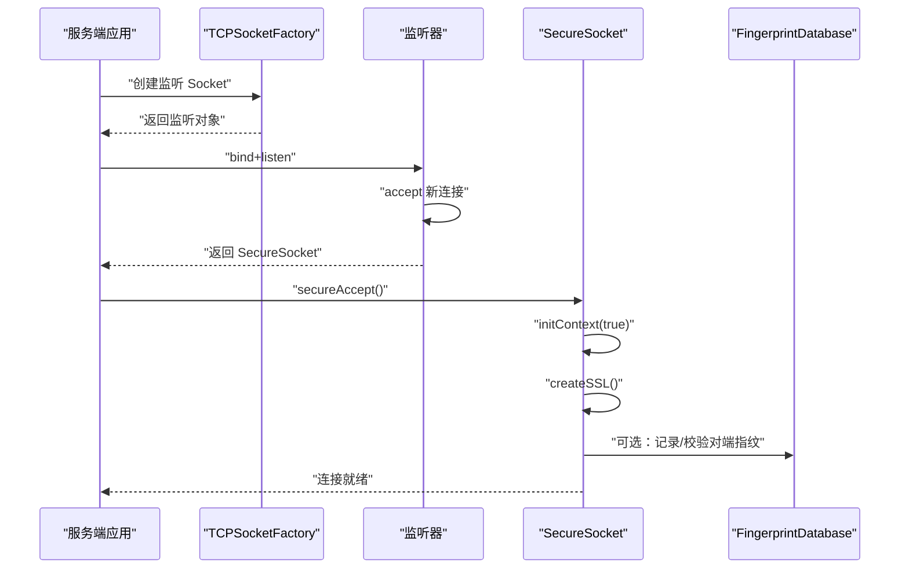
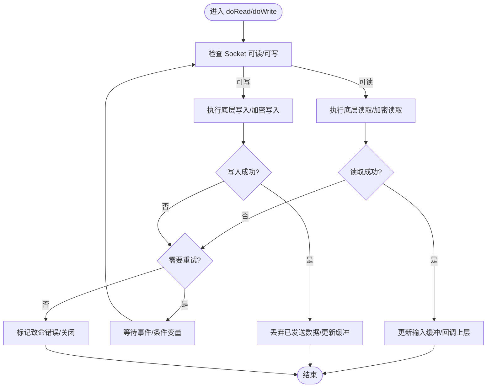
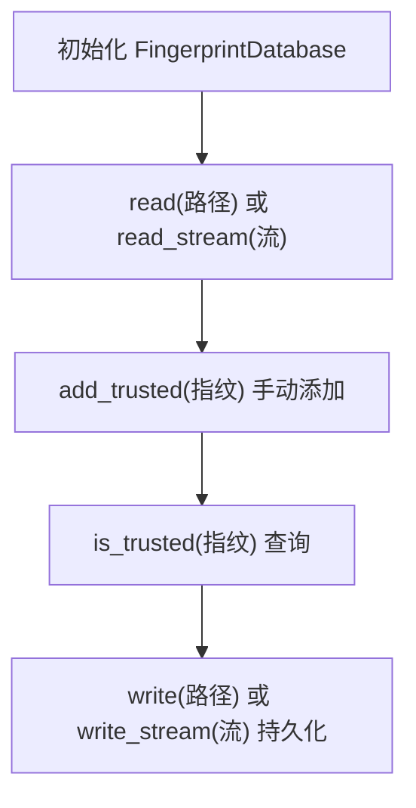
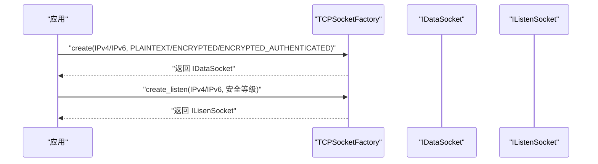
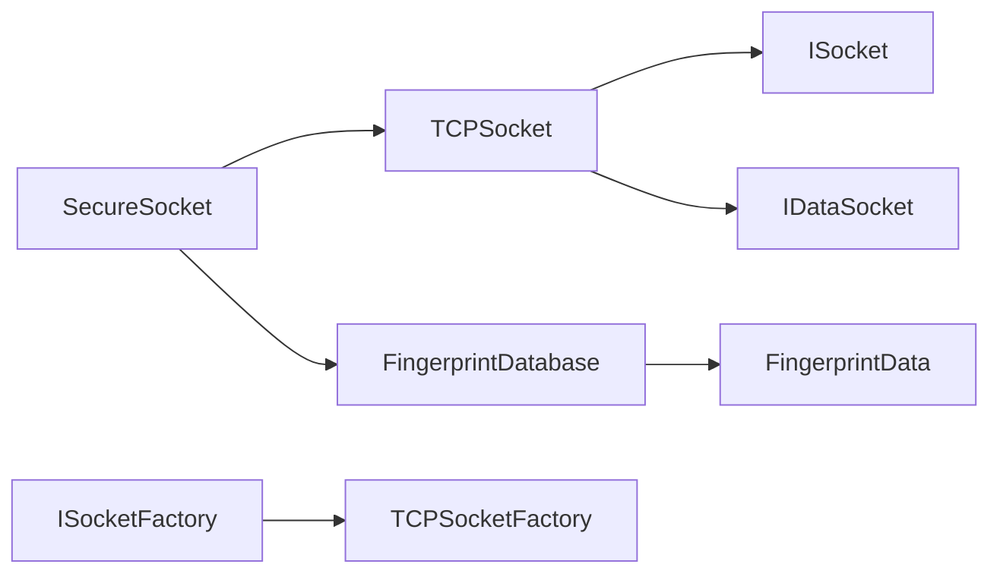

# 网络接口

<cite>
**本文引用的文件**   
- [SecureSocket.h](file://src/lib/net/SecureSocket.h)
- [SecureSocket.cpp](file://src/lib/net/SecureSocket.cpp)
- [TCPSocket.h](file://src/lib/net/TCPSocket.h)
- [TCPSocket.cpp](file://src/lib/net/TCPSocket.cpp)
- [FingerprintDatabase.h](file://src/lib/net/FingerprintDatabase.h)
- [FingerprintData.h](file://src/lib/net/FingerprintData.h)
- [ISocket.h](file://src/lib/net/ISocket.h)
- [IDataSocket.h](file://src/lib/net/IDataSocket.h)
- [ISocketFactory.h](file://src/lib/net/ISocketFactory.h)
- [TCPSocketFactory.h](file://src/lib/net/TCPSocketFactory.h)
- [ConnectionSecurityLevel.h](file://src/lib/net/ConnectionSecurityLevel.h)
- [XSocket.h](file://src/lib/net/XSocket.h)
</cite>

## 目录
1. [简介](#简介)
2. [项目结构](#项目结构)
3. [核心组件](#核心组件)
4. [架构总览](#架构总览)
5. [详细组件分析](#详细组件分析)
6. [依赖关系分析](#依赖关系分析)
7. [性能与可靠性](#性能与可靠性)
8. [故障排查指南](#故障排查指南)
9. [结论](#结论)
10. [附录：配置、超时与重连策略](#附录配置超时与重连策略)

## 简介
本文件为 Input Leap 的网络通信接口提供完整的 API 文档，重点覆盖以下能力：
- 安全套接字 SecureSocket：基于 SSL/TLS 的安全数据传输，支持证书加载与对端指纹校验。
- TCP 连接 TCPSocket：面向流的 TCP 数据通道，封装读写缓冲、事件驱动与多路复用。
- 指纹数据库 FingerprintDatabase：用于持久化与查询对端证书指纹，辅助安全认证流程。
- 工厂与抽象接口：ISocket、IDataSocket、ISocketFactory、TCPSocketFactory 等，统一创建与管理 Socket。
- 连接建立、数据传输、错误处理与安全认证的端到端流程说明。
- 客户端与服务端连接的使用方式（以步骤与路径引用代替代码片段）。
- 协议格式、数据帧结构与消息传递机制的概览说明。
- 网络配置选项、超时设置与重连策略的实现指南。

## 项目结构
Input Leap 的网络层位于 src/lib/net，采用“接口 + 实现 + 平台抽象”的分层组织：
- 接口层：ISocket、IDataSocket、ISocketFactory 定义通用能力。
- 传输层：TCPSocket 提供 TCP 流式 I/O；SecureSocket 在其之上叠加 SSL/TLS。
- 安全与信任：FingerprintDatabase/FingerprintData 管理证书指纹，配合 SecureSocket 完成对端身份校验。
- 工厂模式：TCPSocketFactory 根据地址族与安全级别创建具体 Socket 实例。
- 异常体系：XSocket 及其派生类表达底层系统调用失败语义。

图示来源
- [ISocket.h:1-65](file://src/lib/net/ISocket.h#L1-L65)
- [IDataSocket.h:1-70](file://src/lib/net/IDataSocket.h#L1-L70)
- [ISocketFactory.h:1-49](file://src/lib/net/ISocketFactory.h#L1-L49)
- [TCPSocketFactory.h:1-49](file://src/lib/net/TCPSocketFactory.h#L1-L49)
- [TCPSocket.h:1-117](file://src/lib/net/TCPSocket.h#L1-L117)
- [SecureSocket.h:1-114](file://src/lib/net/SecureSocket.h#L1-L114)
- [FingerprintDatabase.h:1-51](file://src/lib/net/FingerprintDatabase.h#L1-L51)
- [FingerprintData.h:1-45](file://src/lib/net/FingerprintData.h#L1-L45)
- [XSocket.h:1-99](file://src/lib/net/XSocket.h#L1-L99)

章节来源
- [ISocket.h:1-65](file://src/lib/net/ISocket.h#L1-L65)
- [IDataSocket.h:1-70](file://src/lib/net/IDataSocket.h#L1-L70)
- [ISocketFactory.h:1-49](file://src/lib/net/ISocketFactory.h#L1-L49)
- [TCPSocketFactory.h:1-49](file://src/lib/net/TCPSocketFactory.h#L1-L49)
- [TCPSocket.h:1-117](file://src/lib/net/TCPSocket.h#L1-L117)
- [SecureSocket.h:1-114](file://src/lib/net/SecureSocket.h#L1-L114)
- [FingerprintDatabase.h:1-51](file://src/lib/net/FingerprintDatabase.h#L1-L51)
- [FingerprintData.h:1-45](file://src/lib/net/FingerprintData.h#L1-L45)
- [XSocket.h:1-99](file://src/lib/net/XSocket.h#L1-L99)

## 核心组件
本节概述关键类的职责与对外接口要点（以方法名与行为描述为主，不直接粘贴源码）：

- ISocket：所有 Socket 的公共基类，定义 bind/close/get_event_target 等基础操作。
- IDataSocket：在 ISocket 基础上增加 connect 与 IStream 的读/写/flush/shutdown 等流式接口，并引入 isFatal 表示致命错误状态。
- TCPSocket：实现基于 TCP 的数据流，内部维护输入输出缓冲、事件目标、多路复用任务，提供 read/write/flush/isReady/isFatal 等。
- SecureSocket：继承自 TCPSocket，叠加 SSL/TLS 握手、加密读写、证书加载与对端指纹校验，暴露 secureConnect/secureAccept/secureRead/secureWrite 等方法。
- FingerprintDatabase：提供指纹库的读取/写入、清空、添加可信指纹、查询是否可信等能力，并与 FingerprintData 协作。
- FingerprintData：表示一个证书指纹（算法标识与字节序列），并提供类型转换工具函数。
- ISocketFactory/TCPSocketFactory：按地址族与安全级别创建 IDataSocket/IListenSocket 实例，便于上层按需选择明文或加密通道。
- ConnectionSecurityLevel：枚举明文、加密、加密且认证三种安全等级。
- XSocket 系列异常：封装底层系统调用失败的错误码与上下文信息。

章节来源
- [ISocket.h:1-65](file://src/lib/net/ISocket.h#L1-L65)
- [IDataSocket.h:1-70](file://src/lib/net/IDataSocket.h#L1-L70)
- [TCPSocket.h:1-117](file://src/lib/net/TCPSocket.h#L1-L117)
- [SecureSocket.h:1-114](file://src/lib/net/SecureSocket.h#L1-L114)
- [FingerprintDatabase.h:1-51](file://src/lib/net/FingerprintDatabase.h#L1-L51)
- [FingerprintData.h:1-45](file://src/lib/net/FingerprintData.h#L1-L45)
- [ISocketFactory.h:1-49](file://src/lib/net/ISocketFactory.h#L1-L49)
- [TCPSocketFactory.h:1-49](file://src/lib/net/TCPSocketFactory.h#L1-L49)
- [ConnectionSecurityLevel.h:1-25](file://src/lib/net/ConnectionSecurityLevel.h#L1-L25)
- [XSocket.h:1-99](file://src/lib/net/XSocket.h#L1-L99)

## 架构总览
下图展示从应用层到传输层的调用链与交互关系，包括工厂创建、TCP 连接、SSL 握手与指纹校验的关键节点。

图示来源
- [TCPSocketFactory.h:1-49](file://src/lib/net/TCPSocketFactory.h#L1-L49)
- [SecureSocket.h:1-114](file://src/lib/net/SecureSocket.h#L1-L114)
- [TCPSocket.h:1-117](file://src/lib/net/TCPSocket.h#L1-L117)

## 详细组件分析

### 类关系图（代码级）

图示来源
- [ISocket.h:1-65](file://src/lib/net/ISocket.h#L1-L65)
- [IDataSocket.h:1-70](file://src/lib/net/IDataSocket.h#L1-L70)
- [TCPSocket.h:1-117](file://src/lib/net/TCPSocket.h#L1-L117)
- [SecureSocket.h:1-114](file://src/lib/net/SecureSocket.h#L1-L114)
- [FingerprintDatabase.h:1-51](file://src/lib/net/FingerprintDatabase.h#L1-L51)
- [FingerprintData.h:1-45](file://src/lib/net/FingerprintData.h#L1-L45)
- [ISocketFactory.h:1-49](file://src/lib/net/ISocketFactory.h#L1-L49)
- [TCPSocketFactory.h:1-49](file://src/lib/net/TCPSocketFactory.h#L1-L49)

章节来源
- [ISocket.h:1-65](file://src/lib/net/ISocket.h#L1-L65)
- [IDataSocket.h:1-70](file://src/lib/net/IDataSocket.h#L1-L70)
- [TCPSocket.h:1-117](file://src/lib/net/TCPSocket.h#L1-L117)
- [SecureSocket.h:1-114](file://src/lib/net/SecureSocket.h#L1-L114)
- [FingerprintDatabase.h:1-51](file://src/lib/net/FingerprintDatabase.h#L1-L51)
- [FingerprintData.h:1-45](file://src/lib/net/FingerprintData.h#L1-L45)
- [ISocketFactory.h:1-49](file://src/lib/net/ISocketFactory.h#L1-L49)
- [TCPSocketFactory.h:1-49](file://src/lib/net/TCPSocketFactory.h#L1-L49)

### 安全连接建立流程（客户端）

图示来源
- [SecureSocket.h:1-114](file://src/lib/net/SecureSocket.h#L1-L114)
- [FingerprintDatabase.h:1-51](file://src/lib/net/FingerprintDatabase.h#L1-L51)
- [TCPSocketFactory.h:1-49](file://src/lib/net/TCPSocketFactory.h#L1-L49)

章节来源
- [SecureSocket.h:1-114](file://src/lib/net/SecureSocket.h#L1-L114)
- [FingerprintDatabase.h:1-51](file://src/lib/net/FingerprintDatabase.h#L1-L51)
- [TCPSocketFactory.h:1-49](file://src/lib/net/TCPSocketFactory.h#L1-L49)

### 安全连接建立流程（服务端）

图示来源
- [SecureSocket.h:1-114](file://src/lib/net/SecureSocket.h#L1-L114)
- [FingerprintDatabase.h:1-51](file://src/lib/net/FingerprintDatabase.h#L1-L51)
- [TCPSocketFactory.h:1-49](file://src/lib/net/TCPSocketFactory.h#L1-L49)

章节来源
- [SecureSocket.h:1-114](file://src/lib/net/SecureSocket.h#L1-L114)
- [FingerprintDatabase.h:1-51](file://src/lib/net/FingerprintDatabase.h#L1-L51)
- [TCPSocketFactory.h:1-49](file://src/lib/net/TCPSocketFactory.h#L1-L49)

### 数据传输与重试逻辑（读/写）

图示来源
- [TCPSocket.h:1-117](file://src/lib/net/TCPSocket.h#L1-L117)
- [SecureSocket.h:1-114](file://src/lib/net/SecureSocket.h#L1-L114)

章节来源
- [TCPSocket.h:1-117](file://src/lib/net/TCPSocket.h#L1-L117)
- [SecureSocket.h:1-114](file://src/lib/net/SecureSocket.h#L1-L114)

### 指纹数据库使用
- 读取/写入：支持从文件系统路径或流中加载/保存指纹条目。
- 可信集合：提供添加可信指纹与查询是否可信的方法。
- 数据结构：每条指纹包含算法标识与原始字节序列，支持字符串化与解析。

图示来源
- [FingerprintDatabase.h:1-51](file://src/lib/net/FingerprintDatabase.h#L1-L51)
- [FingerprintData.h:1-45](file://src/lib/net/FingerprintData.h#L1-L45)

章节来源
- [FingerprintDatabase.h:1-51](file://src/lib/net/FingerprintDatabase.h#L1-L51)
- [FingerprintData.h:1-45](file://src/lib/net/FingerprintData.h#L1-L45)

### 工厂与创建流程
- 通过 TCPSocketFactory::create 获取 IDataSocket 实例，传入地址族与安全等级。
- 通过 TCPSocketFactory::create_listen 获取监听 Socket 实例。
- 安全等级由 ConnectionSecurityLevel 控制，影响是否启用 TLS 与认证。

图示来源
- [ISocketFactory.h:1-49](file://src/lib/net/ISocketFactory.h#L1-L49)
- [TCPSocketFactory.h:1-49](file://src/lib/net/TCPSocketFactory.h#L1-L49)
- [ConnectionSecurityLevel.h:1-25](file://src/lib/net/ConnectionSecurityLevel.h#L1-L25)

章节来源
- [ISocketFactory.h:1-49](file://src/lib/net/ISocketFactory.h#L1-L49)
- [TCPSocketFactory.h:1-49](file://src/lib/net/TCPSocketFactory.h#L1-L49)
- [ConnectionSecurityLevel.h:1-25](file://src/lib/net/ConnectionSecurityLevel.h#L1-L25)

## 依赖关系分析
- 耦合与内聚：
  - SecureSocket 强依赖 TCPSocket 提供的流式 I/O 与事件循环，同时依赖 FingerprintDatabase 进行对端指纹校验。
  - TCPSocket 依赖底层 ArchSocket 与事件队列，负责缓冲与多路复用任务调度。
  - 工厂将创建细节与上层解耦，便于扩展新的传输实现。
- 外部依赖与集成点：
  - 操作系统网络栈（通过 IArchNetwork 与 ArchSocket）。
  - SSL/TLS 库（通过内部 Ssl 抽象）。
  - 文件系统（用于指纹库与证书文件的读写）。
- 潜在循环依赖：
  - 当前设计未见明显循环依赖；SecureSocket 仅向上依赖 TCPSocket，向下依赖系统/SSL/文件系统。

图示来源
- [SecureSocket.h:1-114](file://src/lib/net/SecureSocket.h#L1-L114)
- [TCPSocket.h:1-117](file://src/lib/net/TCPSocket.h#L1-L117)
- [FingerprintDatabase.h:1-51](file://src/lib/net/FingerprintDatabase.h#L1-L51)
- [FingerprintData.h:1-45](file://src/lib/net/FingerprintData.h#L1-L45)
- [ISocketFactory.h:1-49](file://src/lib/net/ISocketFactory.h#L1-L49)
- [TCPSocketFactory.h:1-49](file://src/lib/net/TCPSocketFactory.h#L1-L49)

章节来源
- [SecureSocket.h:1-114](file://src/lib/net/SecureSocket.h#L1-L114)
- [TCPSocket.h:1-117](file://src/lib/net/TCPSocket.h#L1-L117)
- [FingerprintDatabase.h:1-51](file://src/lib/net/FingerprintDatabase.h#L1-L51)
- [FingerprintData.h:1-45](file://src/lib/net/FingerprintData.h#L1-L45)
- [ISocketFactory.h:1-49](file://src/lib/net/ISocketFactory.h#L1-L49)
- [TCPSocketFactory.h:1-49](file://src/lib/net/TCPSocketFactory.h#L1-L49)

## 性能与可靠性
- 缓冲与批处理：
  - TCPSocket 内部维护输入/输出缓冲，减少系统调用次数，提高吞吐。
  - SecureSocket 在加密读写时可能产生额外拷贝与分片，建议上层合理批量写入。
- 事件驱动与多路复用：
  - 通过 SocketMultiplexer 与 Job 模型，避免阻塞线程，提升并发能力。
- 重试与退避：
  - 内部存在多种 retry 计数（如 secure_accept_retry_、secure_connect_retry_ 等），用于应对瞬态错误。
- 资源释放：
  - close/freeSSLResources 确保 SSL 资源及时释放，避免泄漏。

[本节为通用指导，无需特定文件引用]

## 故障排查指南
- 常见异常与含义：
  - XSocketAddress：主机名未知、无可用地址、端口无效等。
  - XSocketBind / XSocketAddressInUse：绑定失败或端口占用。
  - XSocketConnect：无法连接到远端。
  - XSocketCreate：系统无法创建 Socket。
- 定位步骤：
  - 捕获并打印异常类型与上下文（主机名、端口、错误码）。
  - 检查防火墙与路由，确认端口可达。
  - 若启用 TLS，核对证书链与指纹库一致性。
  - 观察 isFatal 状态与事件回调，判断是否为致命错误。
- 日志与调试：
  - 利用 showSecureLibInfo/showSecureCipherInfo 等辅助方法了解 TLS 环境。
  - 结合事件队列与 Job 状态，定位阻塞点。

章节来源
- [XSocket.h:1-99](file://src/lib/net/XSocket.h#L1-L99)
- [SecureSocket.h:1-114](file://src/lib/net/SecureSocket.h#L1-L114)
- [TCPSocket.h:1-117](file://src/lib/net/TCPSocket.h#L1-L117)

## 结论
Input Leap 的网络层以清晰的接口分层与工厂模式为基础，TCPSocket 提供高效可靠的流式 I/O，SecureSocket 在此基础上实现 TLS 加密与对端指纹校验，FingerprintDatabase 则支撑证书信任管理。整体架构具备良好的可扩展性与安全性，适合在多平台环境下构建稳定的远程输入共享服务。

[本节为总结性内容，无需特定文件引用]

## 附录：配置、超时与重连策略
- 网络配置选项
  - 地址族：IPv4/IPv6，通过工厂 create/create_listen 的参数指定。
  - 安全等级：PLAINTEXT/ENCRYPTED/ENCRYPTED_AUTHENTICATED，决定是否启用 TLS 与认证。
  - 证书与指纹库路径：通过 load_certificates 与 verify_peer_certificate 的路径参数配置。
- 超时设置
  - 建议在应用层围绕 connect/secureConnect 设置超时，并在失败后触发重连。
  - 对于长连接的心跳与空闲检测，可在上层基于 isReady/事件回调实现。
- 重连策略
  - 指数退避：首次失败立即重试，随后逐步增大间隔，避免雪崩。
  - 最大重试次数与熔断：达到阈值后暂停并重试周期更长，必要时告警。
  - 状态恢复：重连成功后重置缓冲与状态，重新发起 TLS 握手与指纹校验。
- 客户端与服务端连接示例（步骤与路径引用）
  - 客户端连接：
    - 使用工厂创建加密 Socket：参考 [TCPSocketFactory.h:1-49](file://src/lib/net/TCPSocketFactory.h#L1-L49)
    - 调用 connect 建立 TCP 连接：参考 [TCPSocket.h:1-117](file://src/lib/net/TCPSocket.h#L1-L117)
    - 触发 TLS 握手与指纹校验：参考 [SecureSocket.h:1-114](file://src/lib/net/SecureSocket.h#L1-L114)
  - 服务端监听：
    - 使用工厂创建监听 Socket：参考 [TCPSocketFactory.h:1-49](file://src/lib/net/TCPSocketFactory.h#L1-L49)
    - accept 新连接并执行 secureAccept：参考 [SecureSocket.h:1-114](file://src/lib/net/SecureSocket.h#L1-L114)
- 协议格式与数据帧结构
  - 传输层为 TCP 流，上层应用需自行定义帧头/长度字段与序列化格式。
  - 建议在帧头中包含版本、消息类型、载荷长度与校验和，以便可靠解析与容错。
- 安全认证最佳实践
  - 服务端生成自签名或 CA 签发的证书，客户端预置受信任根或指纹库。
  - 每次连接均校验对端证书指纹，拒绝未知或变更的证书。
  - 定期轮换证书与更新指纹库，最小化泄露风险。

章节来源
- [TCPSocketFactory.h:1-49](file://src/lib/net/TCPSocketFactory.h#L1-L49)
- [TCPSocket.h:1-117](file://src/lib/net/TCPSocket.h#L1-L117)
- [SecureSocket.h:1-114](file://src/lib/net/SecureSocket.h#L1-L114)
- [ConnectionSecurityLevel.h:1-25](file://src/lib/net/ConnectionSecurityLevel.h#L1-L25)
- [FingerprintDatabase.h:1-51](file://src/lib/net/FingerprintDatabase.h#L1-L51)
- [FingerprintData.h:1-45](file://src/lib/net/FingerprintData.h#L1-L45)