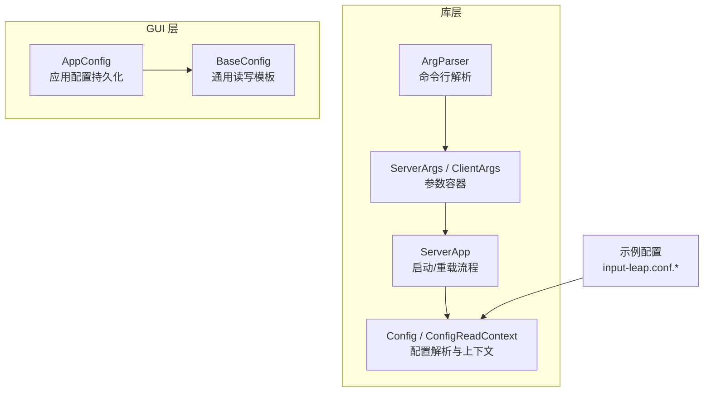
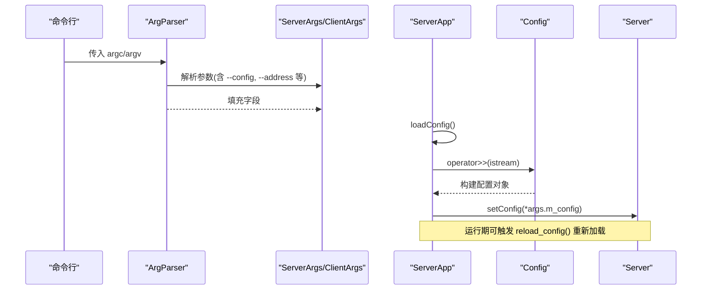
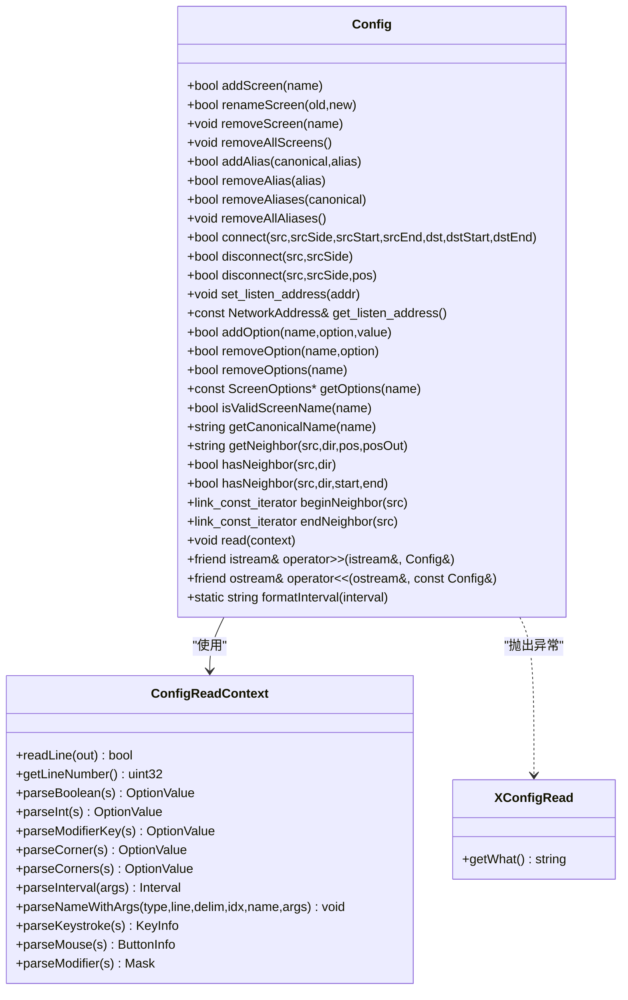
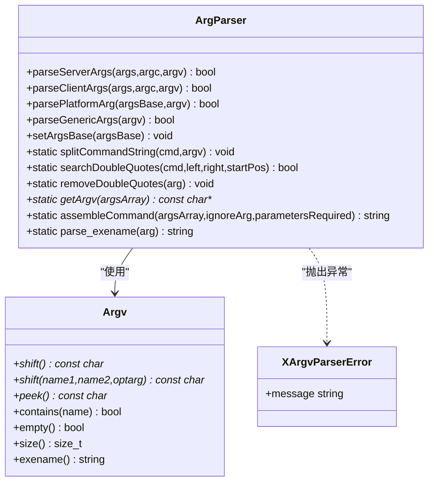
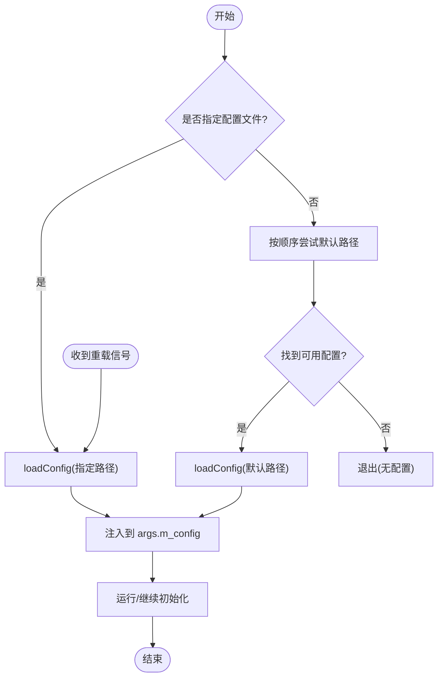
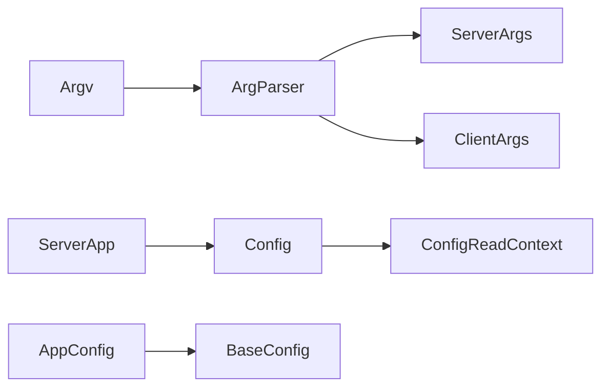

# 配置接口

<cite>
**本文引用的文件**   
- [Config.h](file://src/lib/server/Config.h)
- [Config.cpp](file://src/lib/server/Config.cpp)
- [ArgParser.h](file://src/lib/inputleap/ArgParser.h)
- [ArgParser.cpp](file://src/lib/inputleap/ArgParser.cpp)
- [ServerArgs.h](file://src/lib/inputleap/ServerArgs.h)
- [ClientArgs.h](file://src/lib/inputleap/ClientArgs.h)
- [ServerApp.cpp](file://src/lib/inputleap/ServerApp.cpp)
- [AppConfig.h](file://src/gui/src/AppConfig.h)
- [BaseConfig.h](file://src/gui/src/BaseConfig.h)
- [input-leap.conf.example](file://doc/input-leap.conf.example)
- [input-leap.conf.example-basic](file://doc/input-leap.conf.example-basic)
</cite>

## 目录
1. [简介](#简介)
2. [项目结构](#项目结构)
3. [核心组件](#核心组件)
4. [架构总览](#架构总览)
5. [详细组件分析](#详细组件分析)
6. [依赖关系分析](#依赖关系分析)
7. [性能考虑](#性能考虑)
8. [故障排查指南](#故障排查指南)
9. [结论](#结论)
10. [附录](#附录)

## 简介
本文件为 Input Leap 的配置管理系统提供完整的 API 文档，覆盖以下方面：
- Config 配置解析器：配置文件读取、校验与写入的编程接口
- ArgParser 命令行参数解析：服务器/客户端参数解析与错误处理
- AppConfig 应用程序配置（GUI）：持久化设置与运行时访问
- 配置文件格式、默认值与扩展机制
- 动态重载能力与变更处理流程
- 使用示例路径与最佳实践

## 项目结构
与配置管理相关的核心代码分布在库层与 GUI 层：
- 库层（server/inputleap）：负责服务端配置解析、命令行参数解析、运行时加载与热重载
- GUI 层（gui）：负责应用级设置持久化与界面交互

图表来源
- [ArgParser.h:68-106](file://src/lib/inputleap/ArgParser.h#L68-L106)
- [ArgParser.cpp:106-156](file://src/lib/inputleap/ArgParser.cpp#L106-L156)
- [ServerArgs.h:26-35](file://src/lib/inputleap/ServerArgs.h#L26-L35)
- [ClientArgs.h:24-30](file://src/lib/inputleap/ClientArgs.h#L24-L30)
- [Config.h:62-466](file://src/lib/server/Config.h#L62-L466)
- [Config.cpp:582-657](file://src/lib/server/Config.cpp#L582-L657)
- [ServerApp.cpp:178-272](file://src/lib/inputleap/ServerApp.cpp#L178-L272)
- [AppConfig.h:51-144](file://src/gui/src/AppConfig.h#L51-L144)
- [BaseConfig.h:25-123](file://src/gui/src/BaseConfig.h#L25-L123)
- [input-leap.conf.example:1-38](file://doc/input-leap.conf.example#L1-L38)

章节来源
- [ArgParser.h:68-106](file://src/lib/inputleap/ArgParser.h#L68-L106)
- [ArgParser.cpp:106-156](file://src/lib/inputleap/ArgParser.cpp#L106-L156)
- [ServerArgs.h:26-35](file://src/lib/inputleap/ServerArgs.h#L26-L35)
- [ClientArgs.h:24-30](file://src/lib/inputleap/ClientArgs.h#L24-L30)
- [Config.h:62-466](file://src/lib/server/Config.h#L62-L466)
- [Config.cpp:582-657](file://src/lib/server/Config.cpp#L582-L657)
- [ServerApp.cpp:178-272](file://src/lib/inputleap/ServerApp.cpp#L178-L272)
- [AppConfig.h:51-144](file://src/gui/src/AppConfig.h#L51-L144)
- [BaseConfig.h:25-123](file://src/gui/src/BaseConfig.h#L25-L123)
- [input-leap.conf.example:1-38](file://doc/input-leap.conf.example#L1-L38)

## 核心组件
本节概述配置相关类的职责与关键接口。

- Config 配置解析器
  - 负责解析 section: screens/links/aliases/options 等块
  - 提供屏幕名、别名、邻接连接、监听地址、选项等增删改查接口
  - 支持从流或上下文中读取，并抛出 XConfigRead 异常
  - 提供 read()/operator>>()/operator<<() 用于 I/O

- ConfigReadContext 配置读取上下文
  - 维护行号、流指针
  - 提供类型解析工具：布尔、整数、修饰键、角落、区间、按键、鼠标、修饰符等
  - 提供 parseNameWithArgs 统一解析“名称(参数)”语法

- ArgParser 命令行解析器
  - 封装 argc/argv 迭代与匹配
  - 提供 parseServerArgs/parseClientArgs 分别解析服务端/客户端参数
  - 平台特定参数分发与通用参数处理

- ServerArgs / ClientArgs 参数容器
  - 保存解析后的参数，如配置文件路径、监听地址、滚动行为等

- AppConfig 应用配置（GUI）
  - 基于 QSettings 的持久化配置，暴露常用属性与方法
  - 支持日志、语言、自动隐藏、自启动、最小化到托盘等设置

章节来源
- [Config.h:62-466](file://src/lib/server/Config.h#L62-L466)
- [Config.h:472-513](file://src/lib/server/Config.h#L472-L513)
- [Config.h:519-531](file://src/lib/server/Config.h#L519-L531)
- [ArgParser.h:28-106](file://src/lib/inputleap/ArgParser.h#L28-L106)
- [ServerArgs.h:26-35](file://src/lib/inputleap/ServerArgs.h#L26-L35)
- [ClientArgs.h:24-30](file://src/lib/inputleap/ClientArgs.h#L24-L30)
- [AppConfig.h:51-144](file://src/gui/src/AppConfig.h#L51-L144)

## 架构总览
下图展示从命令行到配置对象再到服务运行的整体流程，以及 GUI 应用配置的独立持久化路径。

图表来源
- [ArgParser.cpp:106-156](file://src/lib/inputleap/ArgParser.cpp#L106-L156)
- [ServerApp.cpp:178-272](file://src/lib/inputleap/ServerApp.cpp#L178-L272)
- [Config.h:417-425](file://src/lib/server/Config.h#L417-L425)

## 详细组件分析

### Config 配置解析器
- 主要职责
  - 维护屏幕集合、别名映射、邻接连接、监听地址、全局与屏幕级选项、输入过滤规则
  - 解析 section: screens/links/aliases/options 四个标准段
  - 提供统一的读/写接口与比较操作

- 关键接口
  - 屏幕与别名
    - addScreen/renameScreen/removeScreen/removeAllScreens
    - addAlias/removeAlias/removeAliases/removeAllAliases
  - 邻接连接
    - connect/disconnect(hasNeighbor/getNeighbor/beginNeighbor/endNeighbor)
  - 监听地址
    - set_listen_address/get_listen_address
  - 选项
    - addOption/removeOption/removeOptions/getOptions
  - 读取/写入
    - read(ConfigReadContext&)
    - operator>>(std::istream&, Config&)
    - operator<<(std::ostream&, const Config&)
  - 辅助
    - dirName/formatInterval/isValidScreenName/isCanonicalName/getCanonicalName

- 数据模型与复杂度
  - 内部以 map 存储屏幕与别名映射，邻接边按 CellEdge 排序与区间重叠检测
  - 典型查询时间复杂度 O(log N)，N 为屏幕数量；邻接遍历与区间判断为线性于边数

- 错误处理
  - 解析失败抛出 XConfigRead，包含行号与格式化错误信息

图表来源
- [Config.h:62-466](file://src/lib/server/Config.h#L62-L466)
- [Config.h:472-513](file://src/lib/server/Config.h#L472-L513)
- [Config.h:519-531](file://src/lib/server/Config.h#L519-L531)

章节来源
- [Config.h:62-466](file://src/lib/server/Config.h#L62-L466)
- [Config.cpp:582-657](file://src/lib/server/Config.cpp#L582-L657)
- [Config.cpp:2041-2143](file://src/lib/server/Config.cpp#L2041-L2143)
- [Config.cpp:2234-2252](file://src/lib/server/Config.cpp#L2234-L2252)

### ArgParser 命令行参数解析
- 主要职责
  - 封装 argc/argv 迭代与匹配
  - 解析通用参数与平台特定参数
  - 区分服务器与客户端参数集

- 关键接口
  - Argv
    - shift()/shift(name1,name2,optarg)/peek()/contains()/empty()/size()/exename()
  - ArgParser
    - parseServerArgs(ServerArgs&, int, const char* const*)
    - parseClientArgs(ClientArgs&, int, const char* const*)
    - parsePlatformArg(ArgsBase&, Argv&)
    - parseGenericArgs(Argv&)
    - 静态工具：splitCommandString/searchDoubleQuotes/removeDoubleQuotes/getArgv/assembleCommand/parse_exename

- 错误处理
  - 解析失败抛出 XArgvParserError，携带格式化消息

图表来源
- [ArgParser.h:28-106](file://src/lib/inputleap/ArgParser.h#L28-L106)

章节来源
- [ArgParser.h:28-106](file://src/lib/inputleap/ArgParser.h#L28-L106)
- [ArgParser.cpp:106-156](file://src/lib/inputleap/ArgParser.cpp#L106-L156)

### ServerApp 配置加载与动态重载
- 配置加载流程
  - 若显式指定配置文件，则直接加载
  - 否则按优先级尝试用户目录与系统目录下的默认文件名
  - 成功加载后，将配置对象注入到 Server

- 动态重载
  - 通过信号触发 reload_config()，再次读取同一配置文件并更新 Server 配置

图表来源
- [ServerApp.cpp:178-272](file://src/lib/inputleap/ServerApp.cpp#L178-L272)

章节来源
- [ServerApp.cpp:178-272](file://src/lib/inputleap/ServerApp.cpp#L178-L272)

### AppConfig 应用程序配置（GUI）
- 主要职责
  - 基于 QSettings 的持久化配置，提供常用属性的读写
  - 支持日志级别/文件、语言、自动隐藏、自启动、最小化到托盘、加密与证书要求等

- 关键接口
  - 读取：screenName()/port()/networkInterface()/logLevel()/logToFile()/logFilename()/language()/startedBefore()/autoConfig()/server_name()/client_name()/program_dir()/log_dir()
  - 写入：setAutoConfig()/persistLogDir()/saveSettings() 及各类 setter
  - 其他：elevateMode()/setCryptoEnabled()/setRequireClientCertificate() 等

章节来源
- [AppConfig.h:51-144](file://src/gui/src/AppConfig.h#L51-L144)
- [BaseConfig.h:25-123](file://src/gui/src/BaseConfig.h#L25-L123)

## 依赖关系分析
- ArgParser 依赖 Argv 进行参数迭代，解析结果填充至 ServerArgs/ClientArgs
- ServerApp 在启动阶段调用 loadConfig()，通过 operator>> 将流内容解析为 Config
- Config 依赖 ConfigReadContext 完成逐行解析与类型转换
- GUI 层 AppConfig 独立于服务端配置，仅负责应用自身设置持久化

图表来源
- [ArgParser.h:28-106](file://src/lib/inputleap/ArgParser.h#L28-L106)
- [ServerArgs.h:26-35](file://src/lib/inputleap/ServerArgs.h#L26-L35)
- [ClientArgs.h:24-30](file://src/lib/inputleap/ClientArgs.h#L24-L30)
- [ServerApp.cpp:178-272](file://src/lib/inputleap/ServerApp.cpp#L178-L272)
- [Config.h:62-466](file://src/lib/server/Config.h#L62-L466)
- [AppConfig.h:51-144](file://src/gui/src/AppConfig.h#L51-L144)

章节来源
- [ArgParser.h:28-106](file://src/lib/inputleap/ArgParser.h#L28-L106)
- [ServerArgs.h:26-35](file://src/lib/inputleap/ServerArgs.h#L26-L35)
- [ClientArgs.h:24-30](file://src/lib/inputleap/ClientArgs.h#L24-L30)
- [ServerApp.cpp:178-272](file://src/lib/inputleap/ServerApp.cpp#L178-L272)
- [Config.h:62-466](file://src/lib/server/Config.h#L62-L466)
- [AppConfig.h:51-144](file://src/gui/src/AppConfig.h#L51-L144)

## 性能考虑
- 配置解析采用流式读取与分块处理，避免一次性加载大文件带来的内存压力
- 邻接连接使用有序结构与区间重叠检测，适合频繁查询场景
- 动态重载会重建临时配置对象再替换，建议在生产环境谨慎使用，避免频繁切换导致抖动

[本节为通用指导，不直接分析具体文件]

## 故障排查指南
- 命令行参数错误
  - 现象：解析失败并输出错误消息
  - 定位：检查 XArgvParserError 抛出处与未识别选项分支
  - 参考路径：[ArgParser.cpp:106-156](file://src/lib/inputleap/ArgParser.cpp#L106-L156)

- 配置文件语法错误
  - 现象：XConfigRead 异常，包含行号与错误描述
  - 定位：检查 section 名称、分隔符、括号匹配与参数列表
  - 参考路径：
    - [Config.cpp:582-657](file://src/lib/server/Config.cpp#L582-L657)
    - [Config.cpp:2041-2143](file://src/lib/server/Config.cpp#L2041-L2143)
    - [Config.cpp:2234-2252](file://src/lib/server/Config.cpp#L2234-L2252)

- 找不到配置文件
  - 现象：提示无可用配置并退出
  - 定位：确认显式路径或默认路径是否存在且可读
  - 参考路径：[ServerApp.cpp:196-256](file://src/lib/inputleap/ServerApp.cpp#L196-L256)

章节来源
- [ArgParser.cpp:106-156](file://src/lib/inputleap/ArgParser.cpp#L106-L156)
- [Config.cpp:582-657](file://src/lib/server/Config.cpp#L582-L657)
- [Config.cpp:2041-2143](file://src/lib/server/Config.cpp#L2041-L2143)
- [Config.cpp:2234-2252](file://src/lib/server/Config.cpp#L2234-L2252)
- [ServerApp.cpp:196-256](file://src/lib/inputleap/ServerApp.cpp#L196-L256)

## 结论
Input Leap 的配置体系由命令行解析、配置文件解析与应用设置三部分组成：
- ArgParser 负责将命令行参数转换为结构化对象
- Config 负责解析与验证配置文件，并提供丰富的运行时查询接口
- AppConfig 负责 GUI 应用的持久化设置
- ServerApp 串联上述模块，实现启动与动态重载

该设计清晰分层、职责明确，便于扩展与维护。

[本节为总结性内容，不直接分析具体文件]

## 附录

### 配置文件语法规范
- 注释
  - 以 # 开头，行尾结束
- 区块
  - section: screens
    - 定义屏幕名称，每行一个名称
  - section: links
    - 定义屏幕间的邻接关系，支持 left/right/up/down 等方向
  - section: aliases
    - 定义屏幕别名映射
  - section: options
    - 定义全局或屏幕级选项，支持 name(value[,value...]) 形式
- 分隔符与参数
  - 名称后可跟 (arg1,arg2,...) 形式的参数列表
  - 值之间用逗号或分号分隔，行末换行也可作为分隔
- 示例文件
  - 基础示例：[input-leap.conf.example-basic](file://doc/input-leap.conf.example-basic)
  - 完整示例：[input-leap.conf.example](file://doc/input-leap.conf.example)

章节来源
- [input-leap.conf.example:1-38](file://doc/input-leap.conf.example#L1-L38)
- [input-leap.conf.example-basic:1-40](file://doc/input-leap.conf.example-basic#L1-L40)

### 编程接口使用示例（路径指引）
- 解析命令行参数
  - 服务器端：[ArgParser.cpp:106-156](file://src/lib/inputleap/ArgParser.cpp#L106-L156)
  - 客户端：[ArgParser.cpp:158-178](file://src/lib/inputleap/ArgParser.cpp#L158-L178)
- 读取配置文件
  - 流式读取：[Config.h:417-425](file://src/lib/server/Config.h#L417-L425)
  - 上下文解析：[Config.cpp:582-657](file://src/lib/server/Config.cpp#L582-L657)
- 动态重载配置
  - 重载入口：[ServerApp.cpp:185-194](file://src/lib/inputleap/ServerApp.cpp#L185-L194)
- GUI 应用配置读写
  - 属性访问与持久化：[AppConfig.h:51-144](file://src/gui/src/AppConfig.h#L51-L144)

[本节为路径指引，不包含具体代码片段]