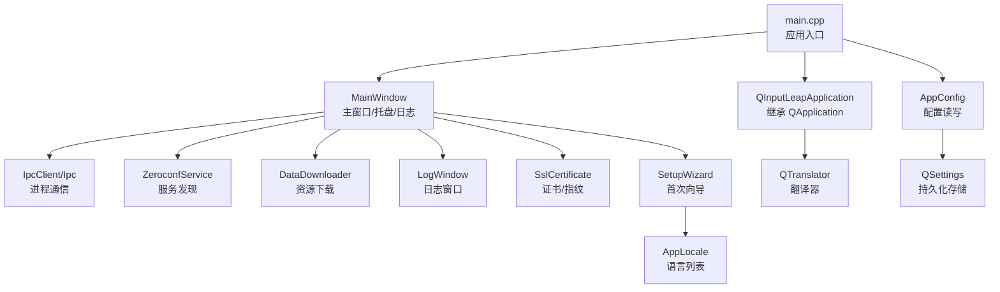
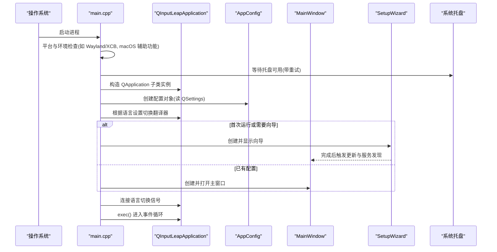
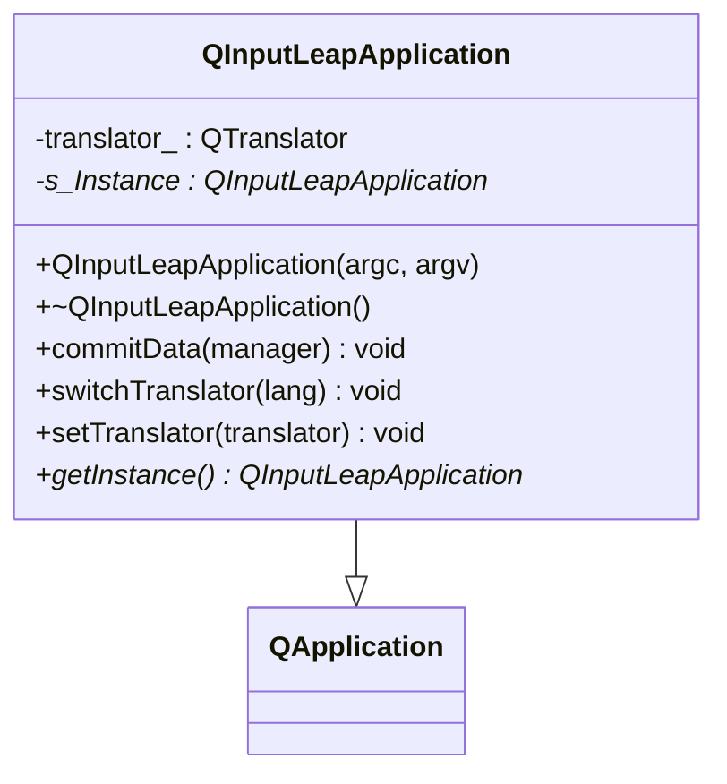
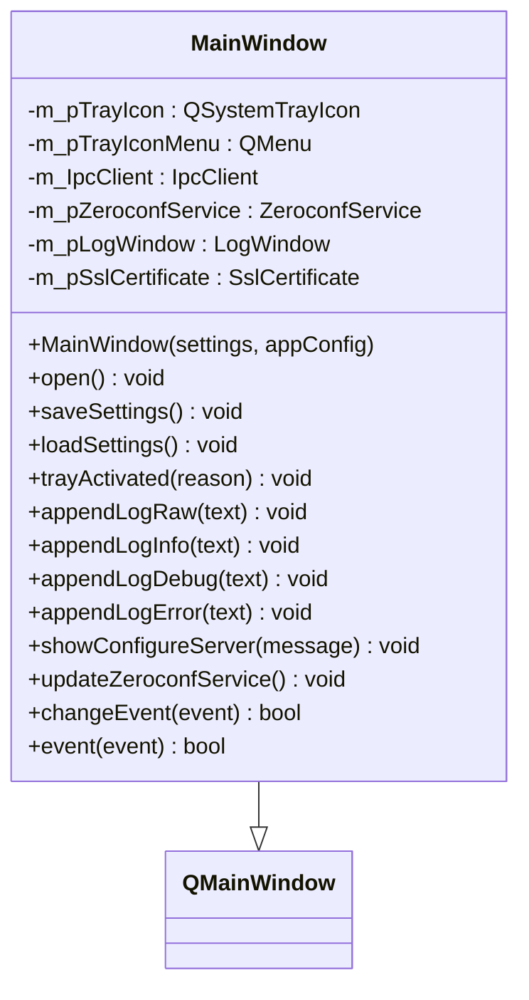
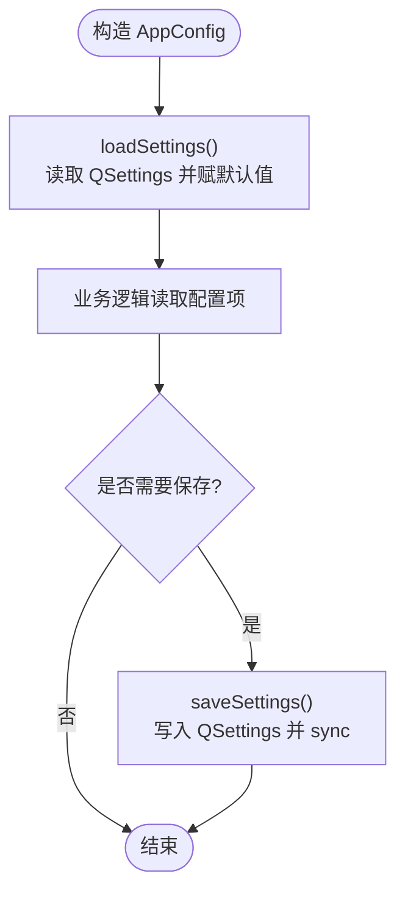
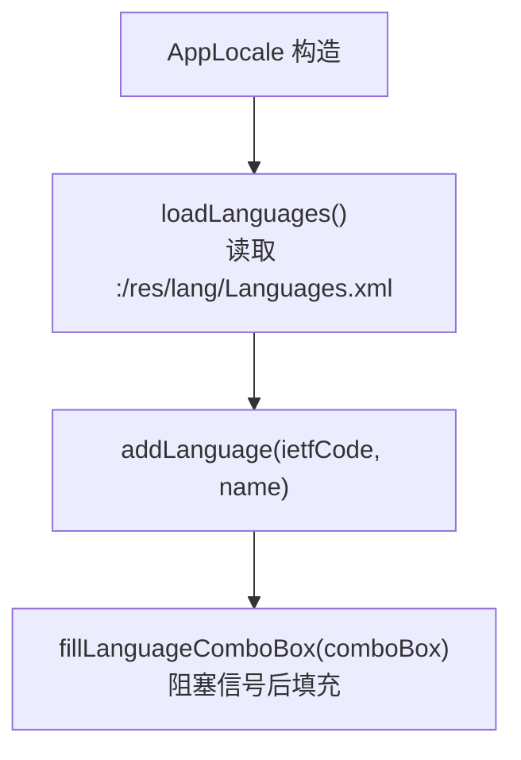
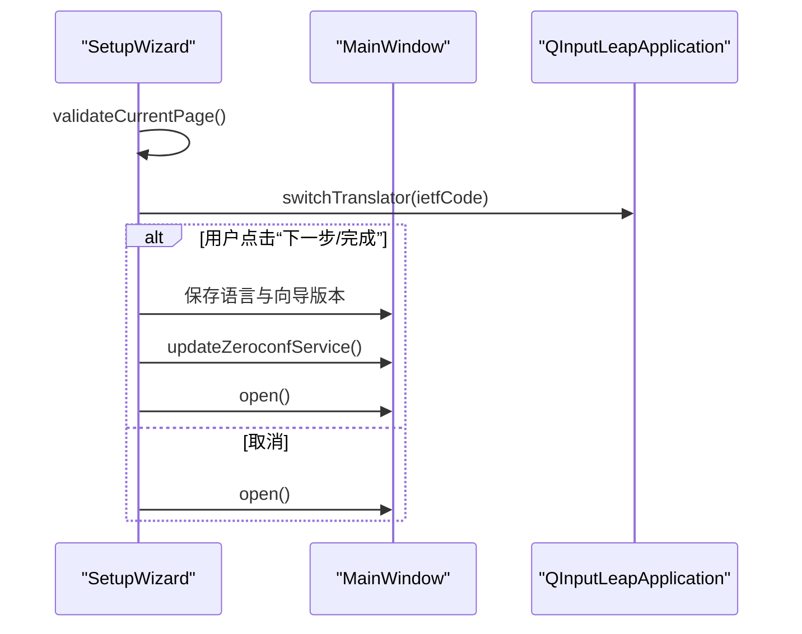
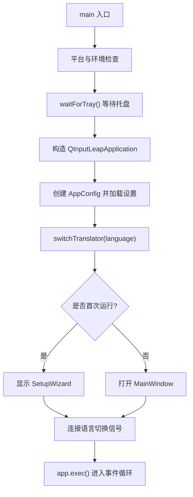
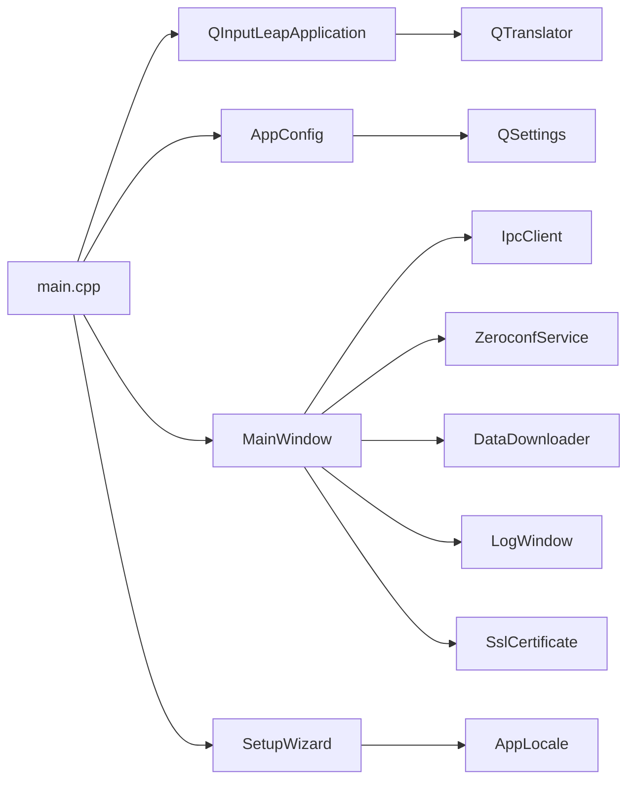

# GUI 架构设计

<cite>
**本文引用的文件**   
- [src/gui/src/main.cpp](file://src/gui/src/main.cpp)
- [src/gui/src/QInputLeapApplication.h](file://src/gui/src/QInputLeapApplication.h)
- [src/gui/src/QInputLeapApplication.cpp](file://src/gui/src/QInputLeapApplication.cpp)
- [src/gui/src/MainWindow.h](file://src/gui/src/MainWindow.h)
- [src/gui/src/MainWindow.cpp](file://src/gui/src/MainWindow.cpp)
- [src/gui/src/AppConfig.h](file://src/gui/src/AppConfig.h)
- [src/gui/src/AppConfig.cpp](file://src/gui/src/AppConfig.cpp)
- [src/gui/src/AppLocale.h](file://src/gui/src/AppLocale.h)
- [src/gui/src/AppLocale.cpp](file://src/gui/src/AppLocale.cpp)
- [src/gui/src/SetupWizard.h](file://src/gui/src/SetupWizard.h)
- [src/gui/src/SetupWizard.cpp](file://src/gui/src/SetupWizard.cpp)
- [src/gui/src/QUtility.h](file://src/gui/src/QUtility.h)
- [src/gui/src/QUtility.cpp](file://src/gui/src/QUtility.cpp)
- [src/gui/src/ElevateMode.h](file://src/gui/src/ElevateMode.h)
</cite>

## 目录
1. [简介](#简介)
2. [项目结构](#项目结构)
3. [核心组件](#核心组件)
4. [架构总览](#架构总览)
5. [详细组件分析](#详细组件分析)
6. [依赖关系分析](#依赖关系分析)
7. [性能与可维护性](#性能与可维护性)
8. [故障排查指南](#故障排查指南)
9. [结论](#结论)
10. [附录：扩展与自定义指南](#附录扩展与自定义指南)

## 简介
本文件面向 Input Leap 的 GUI 层，系统性阐述基于 Qt 的应用程序启动流程、应用程序类继承结构、事件循环机制与生命周期管理；重点解析 QInputLeapApplication 的扩展能力（翻译器切换、系统托盘集成、平台特定初始化等），并说明配置加载、设置管理与跨平台兼容性处理。同时覆盖启动参数相关行为、错误处理与调试支持，并提供架构扩展与自定义应用程序类的开发方法。

## 项目结构
GUI 代码位于 src/gui/src 下，围绕以下关键模块组织：
- 应用入口与生命周期：main.cpp、QInputLeapApplication
- 主界面与交互：MainWindow
- 配置与持久化：AppConfig、QSettings
- 国际化与语言选择：AppLocale、QTranslator
- 首次运行向导：SetupWizard
- 通用工具与平台差异：QUtility、ElevateMode

图表来源
- [src/gui/src/main.cpp:63-150](file://src/gui/src/main.cpp#L63-L150)
- [src/gui/src/QInputLeapApplication.h:26-44](file://src/gui/src/QInputLeapApplication.h#L26-L44)
- [src/gui/src/QInputLeapApplication.cpp:27-67](file://src/gui/src/QInputLeapApplication.cpp#L27-L67)
- [src/gui/src/MainWindow.h:67-205](file://src/gui/src/MainWindow.h#L67-L205)
- [src/gui/src/AppConfig.h:51-144](file://src/gui/src/AppConfig.h#L51-L144)
- [src/gui/src/AppLocale.h:24-48](file://src/gui/src/AppLocale.h#L24-L48)
- [src/gui/src/SetupWizard.h:32-58](file://src/gui/src/SetupWizard.h#L32-L58)

章节来源
- [src/gui/src/main.cpp:63-150](file://src/gui/src/main.cpp#L63-L150)
- [src/gui/src/QInputLeapApplication.h:26-44](file://src/gui/src/QInputLeapApplication.h#L26-L44)
- [src/gui/src/QInputLeapApplication.cpp:27-67](file://src/gui/src/QInputLeapApplication.cpp#L27-L67)
- [src/gui/src/MainWindow.h:67-205](file://src/gui/src/MainWindow.h#L67-L205)
- [src/gui/src/AppConfig.h:51-144](file://src/gui/src/AppConfig.h#L51-L144)
- [src/gui/src/AppLocale.h:24-48](file://src/gui/src/AppLocale.h#L24-L48)
- [src/gui/src/SetupWizard.h:32-58](file://src/gui/src/SetupWizard.h#L32-L58)

## 核心组件
- QInputLeapApplication：继承自 QApplication，提供全局实例访问、会话保存回调、翻译器动态切换与安装。
- MainWindow：承载主界面、系统托盘、菜单、日志输出、子对话框与后台服务（零配置、SSL 指纹、IPC）协调。
- AppConfig：封装所有 GUI 设置项的读取、写入与默认值策略，负责跨平台路径与模式差异。
- AppLocale：从资源中加载 Languages.xml，填充语言下拉框。
- SetupWizard：引导用户完成首次配置，联动语言切换与主窗口打开。
- QUtility：提供哈希、MAC 地址获取、处理器架构识别等工具函数。
- ElevateMode：Windows 提权策略枚举，影响服务模式与 IPC 行为。

章节来源
- [src/gui/src/QInputLeapApplication.h:26-44](file://src/gui/src/QInputLeapApplication.h#L26-L44)
- [src/gui/src/QInputLeapApplication.cpp:27-67](file://src/gui/src/QInputLeapApplication.cpp#L27-L67)
- [src/gui/src/MainWindow.h:67-205](file://src/gui/src/MainWindow.h#L67-L205)
- [src/gui/src/AppConfig.h:51-144](file://src/gui/src/AppConfig.h#L51-L144)
- [src/gui/src/AppConfig.cpp:50-191](file://src/gui/src/AppConfig.cpp#L50-L191)
- [src/gui/src/AppLocale.h:24-48](file://src/gui/src/AppLocale.h#L24-L48)
- [src/gui/src/AppLocale.cpp:24-67](file://src/gui/src/AppLocale.cpp#L24-L67)
- [src/gui/src/SetupWizard.h:32-58](file://src/gui/src/SetupWizard.h#L32-L58)
- [src/gui/src/SetupWizard.cpp:26-150](file://src/gui/src/SetupWizard.cpp#L26-L150)
- [src/gui/src/QUtility.h:27-31](file://src/gui/src/QUtility.h#L27-L31)
- [src/gui/src/QUtility.cpp:32-92](file://src/gui/src/QUtility.cpp#L32-L92)
- [src/gui/src/ElevateMode.h:35-41](file://src/gui/src/ElevateMode.h#L35-L41)

## 架构总览
下图展示 GUI 启动与主要交互流程，包括平台检查、托盘等待、配置加载、向导/主窗口显示、语言切换信号连接以及事件循环。

图表来源
- [src/gui/src/main.cpp:63-150](file://src/gui/src/main.cpp#L63-L150)
- [src/gui/src/QInputLeapApplication.cpp:50-67](file://src/gui/src/QInputLeapApplication.cpp#L50-L67)
- [src/gui/src/SetupWizard.cpp:104-150](file://src/gui/src/SetupWizard.cpp#L104-L150)

章节来源
- [src/gui/src/main.cpp:63-150](file://src/gui/src/main.cpp#L63-L150)

## 详细组件分析

### QInputLeapApplication：应用基类扩展
- 继承关系：继承 QApplication，持有静态全局实例指针，便于任意位置访问应用级能力。
- 会话保存：实现 commitData，遍历顶层窗口并调用 MainWindow::saveSettings，确保退出时持久化状态。
- 翻译器管理：
  - switchTranslator：卸载旧翻译器，从资源包加载对应 .qm，安装新翻译器。
  - setTranslator：允许外部注入自定义翻译器。
- 单例访问：getInstance 返回当前实例。

图表来源
- [src/gui/src/QInputLeapApplication.h:26-44](file://src/gui/src/QInputLeapApplication.h#L26-L44)
- [src/gui/src/QInputLeapApplication.cpp:27-67](file://src/gui/src/QInputLeapApplication.cpp#L27-L67)

章节来源
- [src/gui/src/QInputLeapApplication.h:26-44](file://src/gui/src/QInputLeapApplication.h#L26-L44)
- [src/gui/src/QInputLeapApplication.cpp:27-67](file://src/gui/src/QInputLeapApplication.cpp#L27-L67)

### MainWindow：主窗口与系统集成
- 职责：
  - 构建菜单栏、系统托盘图标与菜单。
  - 管理服务端/客户端模式切换、服务器配置编辑、自动配置提示。
  - 通过 IpcClient 与后台进程通信，接收日志并分发到 LogWindow。
  - 控制 ZeroconfService 进行局域网服务发现。
  - 管理 SSL 证书与指纹展示。
  - 响应语言切换信号，刷新界面文本。
- 事件与生命周期：
  - changeEvent/event 重载用于处理最小化、隐藏、语言变化等。
  - saveSettings/loadSettings 与 AppConfig 协作持久化。
  - trayActivated 处理托盘点击事件。
- 平台差异：
  - Windows 下强制启用 IPC 以支持桌面模式切换。
  - 不同平台使用不同的图标资源与窗口尺寸。

图表来源
- [src/gui/src/MainWindow.h:67-205](file://src/gui/src/MainWindow.h#L67-L205)
- [src/gui/src/MainWindow.cpp:114-198](file://src/gui/src/MainWindow.cpp#L114-L198)

章节来源
- [src/gui/src/MainWindow.h:67-205](file://src/gui/src/MainWindow.h#L67-L205)
- [src/gui/src/MainWindow.cpp:114-198](file://src/gui/src/MainWindow.cpp#L114-L198)

### AppConfig：配置加载与设置管理
- 配置项涵盖屏幕名、端口、网络接口、日志级别/文件、向导版本、语言、加密开关、提权模式、自动隐藏/启动/最小化到托盘等。
- 跨平台差异：
  - 二进制名称、日志目录、默认进程模式在 Windows/Linux 下不同。
  - 日志文件名在 Windows 上会加引号以兼容含空格路径。
- 持久化：
  - loadSettings/saveSettings 与 QSettings 双向同步。
  - persistLogDir 确保日志目录存在。
- 向后兼容：
  - 启动时若当前设置为空，尝试从旧 Barrier 设置位置复制。

图表来源
- [src/gui/src/AppConfig.cpp:50-191](file://src/gui/src/AppConfig.cpp#L50-L191)

章节来源
- [src/gui/src/AppConfig.h:51-144](file://src/gui/src/AppConfig.h#L51-L144)
- [src/gui/src/AppConfig.cpp:50-191](file://src/gui/src/AppConfig.cpp#L50-L191)

### AppLocale：语言列表与 UI 绑定
- 从资源包加载 Languages.xml，解析出语言条目（ietfCode 与 name）。
- 为 QComboBox 填充语言选项，并在向导中设置当前选中项。

图表来源
- [src/gui/src/AppLocale.cpp:24-67](file://src/gui/src/AppLocale.cpp#L24-L67)
- [src/gui/src/AppLocale.h:24-48](file://src/gui/src/AppLocale.h#L24-L48)

章节来源
- [src/gui/src/AppLocale.h:24-48](file://src/gui/src/AppLocale.h#L24-L48)
- [src/gui/src/AppLocale.cpp:24-67](file://src/gui/src/AppLocale.cpp#L24-L67)

### SetupWizard：首次运行向导
- 页面校验：确保选择节点类型（服务器或客户端）。
- 语言切换：根据下拉框选择即时切换翻译器。
- 接受/拒绝：
  - accept：保存语言与向导版本，记录组选择，必要时更新服务发现并打开主窗口。
  - reject：恢复语言并打开主窗口。

图表来源
- [src/gui/src/SetupWizard.cpp:62-150](file://src/gui/src/SetupWizard.cpp#L62-L150)
- [src/gui/src/SetupWizard.h:32-58](file://src/gui/src/SetupWizard.h#L32-L58)

章节来源
- [src/gui/src/SetupWizard.h:32-58](file://src/gui/src/SetupWizard.h#L32-L58)
- [src/gui/src/SetupWizard.cpp:62-150](file://src/gui/src/SetupWizard.cpp#L62-L150)

### 启动流程与事件循环
- 平台与环境：
  - 检测 X11/Wayland 并给出提示。
  - macOS 要求应用位于 /Applications，并检查辅助功能权限。
- 托盘可用性：
  - waitForTray 循环检测系统托盘，失败则禁用自动隐藏。
- 应用标识：
  - 设置组织名、域名与应用名，Qt >= 5.15 设置桌面文件名。
- 配置迁移：
  - 若当前设置为空，尝试从旧 Barrier 设置位置复制。
- 语言与界面：
  - 根据 AppConfig.language 切换翻译器。
  - 根据 wizardShouldRun 决定显示向导或直接打开主窗口。
- 信号连接：
  - 将主窗口的语言切换请求连接到应用的翻译器切换槽。
- 事件循环：
  - 调用 app.exec() 进入 Qt 事件循环。

图表来源
- [src/gui/src/main.cpp:63-150](file://src/gui/src/main.cpp#L63-L150)

章节来源
- [src/gui/src/main.cpp:63-150](file://src/gui/src/main.cpp#L63-L150)

### 错误处理与调试支持
- 错误提示：
  - macOS 辅助功能未授权时弹出提示并终止。
  - 托盘不可用时强制关闭自动隐藏以避免无法找回界面。
- 日志：
  - MainWindow 通过 IpcClient 接收日志行，分发给 LogWindow 显示。
  - AppConfig 提供日志级别、是否写文件、日志文件名等配置。
- 调试：
  - 日志级别包含 DEBUG/DEBUG1/DEBUG2 等多级，便于定位问题。
  - 可通过设置日志文件路径查看运行时信息。

章节来源
- [src/gui/src/main.cpp:95-113](file://src/gui/src/main.cpp#L95-L113)
- [src/gui/src/main.cpp:128-133](file://src/gui/src/main.cpp#L128-L133)
- [src/gui/src/MainWindow.cpp:154-160](file://src/gui/src/MainWindow.cpp#L154-L160)
- [src/gui/src/AppConfig.cpp:126-129](file://src/gui/src/AppConfig.cpp#L126-L129)

## 依赖关系分析
- 组件耦合：
  - main.cpp 强依赖 QInputLeapApplication、AppConfig、MainWindow、SetupWizard。
  - MainWindow 依赖 IpcClient、ZeroconfService、DataDownloader、LogWindow、SslCertificate 等。
  - QInputLeapApplication 依赖 QTranslator 与 MainWindow（用于会话保存）。
  - SetupWizard 依赖 AppLocale 与 QInputLeapApplication。
- 外部依赖：
  - QSettings 用于跨平台设置持久化。
  - QResource 用于加载资源包中的 .qm 与 XML。
  - 平台 API（macOS Accessibility、Windows 系统信息）用于平台特性。

图表来源
- [src/gui/src/main.cpp:63-150](file://src/gui/src/main.cpp#L63-L150)
- [src/gui/src/MainWindow.h:67-205](file://src/gui/src/MainWindow.h#L67-L205)
- [src/gui/src/SetupWizard.h:32-58](file://src/gui/src/SetupWizard.h#L32-L58)
- [src/gui/src/QInputLeapApplication.h:26-44](file://src/gui/src/QInputLeapApplication.h#L26-L44)
- [src/gui/src/AppConfig.h:51-144](file://src/gui/src/AppConfig.h#L51-L144)

章节来源
- [src/gui/src/main.cpp:63-150](file://src/gui/src/main.cpp#L63-L150)
- [src/gui/src/MainWindow.h:67-205](file://src/gui/src/MainWindow.h#L67-L205)
- [src/gui/src/SetupWizard.h:32-58](file://src/gui/src/SetupWizard.h#L32-L58)
- [src/gui/src/QInputLeapApplication.h:26-44](file://src/gui/src/QInputLeapApplication.h#L26-L44)
- [src/gui/src/AppConfig.h:51-144](file://src/gui/src/AppConfig.h#L51-L144)

## 性能与可维护性
- 托盘等待采用有限次重试与睡眠，避免长时间阻塞启动。
- 语言切换通过资源包加载 .qm，减少磁盘 IO 与路径依赖。
- 配置读写集中在 AppConfig，降低散落的 QSettings 调用带来的不一致风险。
- 建议：
  - 对频繁调用的设置项增加缓存或批量写入策略。
  - 将平台差异进一步抽象为策略类，提升可测试性与可移植性。

[本节为通用指导，不直接分析具体文件]

## 故障排查指南
- 无法看到托盘图标：
  - 检查 waitForTray 是否超时，确认桌面环境托盘服务已就绪。
- 语言未生效：
  - 确认资源包中包含对应语言的 .qm 文件，且 ietfCode 匹配。
  - 检查语言切换信号是否正确连接至 QInputLeapApplication::switchTranslator。
- 首次向导不出现：
  - 检查 AppConfig.wizardShouldRun 返回值与 kWizardVersion 的设置。
- 日志无输出：
  - 确认日志级别与是否开启日志文件，检查日志目录是否存在与可写。
- macOS 辅助功能未授权：
  - 按提示前往系统偏好设置授权，或在较新版本系统中通过选项弹窗授权。

章节来源
- [src/gui/src/main.cpp:152-173](file://src/gui/src/main.cpp#L152-L173)
- [src/gui/src/QInputLeapApplication.cpp:50-67](file://src/gui/src/QInputLeapApplication.cpp#L50-L67)
- [src/gui/src/AppConfig.cpp:141-191](file://src/gui/src/AppConfig.cpp#L141-L191)
- [src/gui/src/main.cpp:95-113](file://src/gui/src/main.cpp#L95-L113)

## 结论
Input Leap 的 GUI 架构以 QInputLeapApplication 为核心扩展点，结合 MainWindow 的系统集成能力、AppConfig 的统一配置管理、AppLocale 的语言支持与 SetupWizard 的首次引导，形成清晰的分层与职责划分。启动流程稳健，具备跨平台适配与完善的错误处理与调试支持。通过合理的扩展点与信号槽机制，开发者可以便捷地添加新功能或定制行为。

[本节为总结，不直接分析具体文件]

## 附录：扩展与自定义指南
- 自定义应用程序类
  - 继承 QInputLeapApplication，重写需要的生命周期钩子（如 commitData）。
  - 通过 getInstance 获取全局实例，以便在其他模块访问应用级能力。
  - 如需自定义翻译器，可使用 setTranslator 注入，或通过 switchTranslator 动态切换。
- 扩展主窗口功能
  - 在 MainWindow 中添加新的菜单项或托盘操作，并通过信号槽与后端服务交互。
  - 复用 IpcClient 与 ZeroconfService 的能力，保持与现有架构一致。
- 新增配置项
  - 在 AppConfig 中声明 getter/setter，并在 loadSettings/saveSettings 中读写。
  - 为新字段提供合理默认值，考虑跨平台差异。
- 国际化扩展
  - 在 Languages.xml 中添加新语言条目，并确保资源包包含对应的 .qm 文件。
  - 在向导中绑定语言切换信号，实时预览效果。
- 平台特定初始化
  - 在 main.cpp 中按平台条件执行必要的环境检查与提示。
  - 将平台差异逻辑尽量下沉到独立模块，避免污染主流程。

章节来源
- [src/gui/src/QInputLeapApplication.h:26-44](file://src/gui/src/QInputLeapApplication.h#L26-L44)
- [src/gui/src/QInputLeapApplication.cpp:27-67](file://src/gui/src/QInputLeapApplication.cpp#L27-L67)
- [src/gui/src/MainWindow.h:67-205](file://src/gui/src/MainWindow.h#L67-L205)
- [src/gui/src/AppConfig.h:51-144](file://src/gui/src/AppConfig.h#L51-L144)
- [src/gui/src/AppConfig.cpp:141-191](file://src/gui/src/AppConfig.cpp#L141-L191)
- [src/gui/src/AppLocale.cpp:24-67](file://src/gui/src/AppLocale.cpp#L24-L67)
- [src/gui/src/main.cpp:63-150](file://src/gui/src/main.cpp#L63-L150)