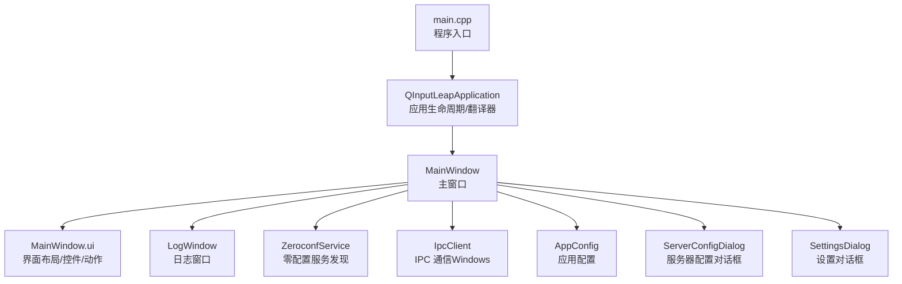
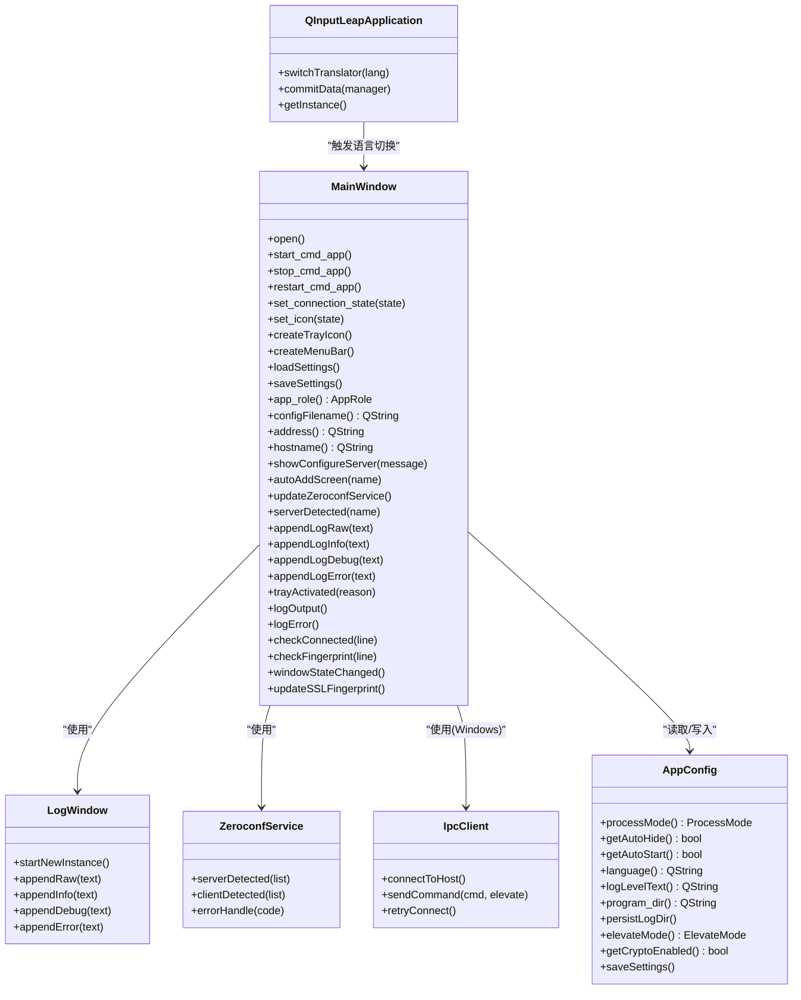
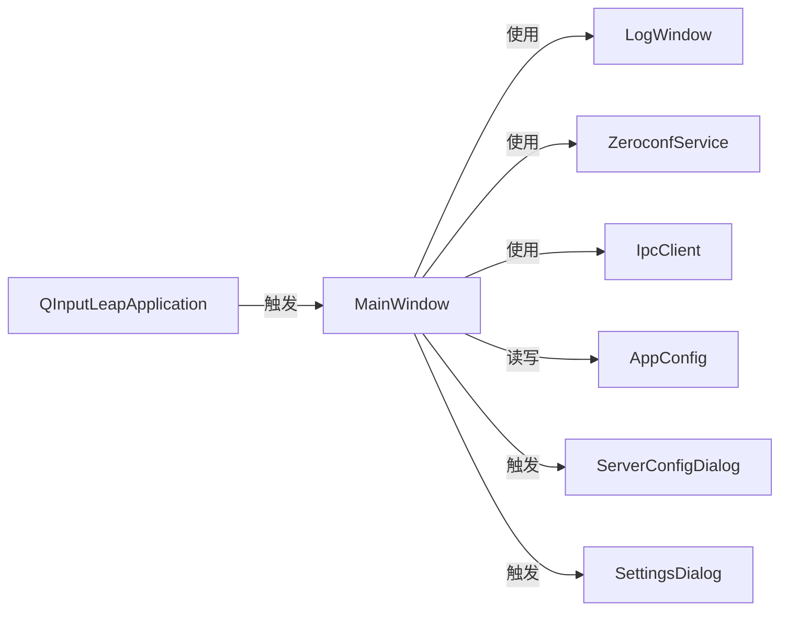

# 主窗口组件

<cite>
**本文引用的文件**   
- [MainWindow.h](file://src/gui/src/MainWindow.h)
- [MainWindow.cpp](file://src/gui/src/MainWindow.cpp)
- [MainWindow.ui](file://src/gui/src/MainWindow.ui)
- [QInputLeapApplication.h](file://src/gui/src/QInputLeapApplication.h)
- [QInputLeapApplication.cpp](file://src/gui/src/QInputLeapApplication.cpp)
- [AppConnectionState.h](file://src/gui/src/AppConnectionState.h)
- [LogWindow.h](file://src/gui/src/LogWindow.h)
- [ZeroconfService.h](file://src/gui/src/ZeroconfService.h)
- [IpcClient.h](file://src/gui/src/IpcClient.h)
- [main.cpp](file://src/gui/src/main.cpp)
- [AppConfig.h](file://src/gui/src/AppConfig.h)
- [ServerConfigDialog.h](file://src/gui/src/ServerConfigDialog.h)
- [SettingsDialog.h](file://src/gui/src/SettingsDialog.h)
</cite>

## 目录
1. [简介](#简介)
2. [项目结构](#项目结构)
3. [核心组件](#核心组件)
4. [架构总览](#架构总览)
5. [详细组件分析](#详细组件分析)
6. [依赖关系分析](#依赖关系分析)
7. [性能与用户体验优化](#性能与用户体验优化)
8. [故障排查指南](#故障排查指南)
9. [结论](#结论)
10. [附录：界面定制与扩展开发指南](#附录界面定制与扩展开发指南)

## 简介
本文件聚焦于 Input Leap 的图形界面主窗口组件，围绕 MainWindow 类展开，系统阐述其界面布局设计、用户交互逻辑与状态管理机制。文档覆盖服务器/客户端模式切换、连接状态显示、系统托盘集成、事件处理、菜单操作、工具栏功能与快捷键绑定，以及窗口大小调整、最小化到托盘、自动隐藏等体验优化点。同时提供界面定制方法与扩展开发建议，帮助开发者快速理解并二次开发主窗口。

## 项目结构
主窗口位于 GUI 模块中，采用 Qt UI 描述文件与 C++ 实现分离的组织方式。UI 定义在 .ui 文件中，C++ 逻辑在 .h/.cpp 中；应用生命周期由自定义 QApplication 子类管理，负责翻译器切换与设置持久化。

图表来源
- [main.cpp:63-150](file://src/gui/src/main.cpp#L63-L150)
- [QInputLeapApplication.cpp:27-68](file://src/gui/src/QInputLeapApplication.cpp#L27-L68)
- [MainWindow.cpp:114-198](file://src/gui/src/MainWindow.cpp#L114-L198)
- [MainWindow.ui:1-554](file://src/gui/src/MainWindow.ui#L1-L554)

章节来源
- [main.cpp:63-150](file://src/gui/src/main.cpp#L63-L150)
- [QInputLeapApplication.cpp:27-68](file://src/gui/src/QInputLeapApplication.cpp#L27-L68)
- [MainWindow.cpp:114-198](file://src/gui/src/MainWindow.cpp#L114-L198)
- [MainWindow.ui:1-554](file://src/gui/src/MainWindow.ui#L1-L554)

## 核心组件
- MainWindow：主窗口，承载界面、状态机、进程控制、托盘、菜单、日志、SSL 指纹校验、零配置服务等。
- QInputLeapApplication：继承自 QApplication，负责会话提交时保存设置、动态切换语言翻译器。
- LogWindow：独立日志窗口，支持按级别输出与清空。
- ZeroconfService：局域网服务发现，用于自动配置客户端连接目标。
- IpcClient：通过 TCP 与守护进程通信，发送命令、接收日志与消息。
- AppConfig：集中管理应用配置项（端口、网络接口、日志、加密、自动启动/隐藏等）。
- ServerConfigDialog / SettingsDialog：辅助对话框，分别用于服务器配置与应用设置。

章节来源
- [MainWindow.h:67-206](file://src/gui/src/MainWindow.h#L67-L206)
- [QInputLeapApplication.h:26-45](file://src/gui/src/QInputLeapApplication.h#L26-L45)
- [LogWindow.h:28-52](file://src/gui/src/LogWindow.h#L28-L52)
- [ZeroconfService.h:33-59](file://src/gui/src/ZeroconfService.h#L33-L59)
- [IpcClient.h:29-64](file://src/gui/src/IpcClient.h#L29-L64)
- [AppConfig.h:51-145](file://src/gui/src/AppConfig.h#L51-L145)
- [ServerConfigDialog.h:32-68](file://src/gui/src/ServerConfigDialog.h#L32-L68)
- [SettingsDialog.h:32-56](file://src/gui/src/SettingsDialog.h#L32-L56)

## 架构总览
主窗口作为 GUI 层的核心，协调以下子系统：
- 进程管理：根据桌面或服务模式启动/停止 core 进程，或通过 IPC 向守护进程下发命令。
- 状态机：维护连接状态（断开、连接中、已连接、传输中），驱动图标与状态栏更新。
- 配置管理：内部交互式配置或外部配置文件两种模式；自动配置基于零配置服务发现。
- 安全与信任：解析对端 SSL 指纹，提示用户确认并持久化受信任列表。
- 国际化：运行时切换语言翻译器。
- 系统托盘：常驻托盘，提供快捷操作与双击显隐。

图表来源
- [MainWindow.h:67-206](file://src/gui/src/MainWindow.h#L67-L206)
- [MainWindow.cpp:114-198](file://src/gui/src/MainWindow.cpp#L114-L198)
- [QInputLeapApplication.cpp:50-68](file://src/gui/src/QInputLeapApplication.cpp#L50-L68)
- [LogWindow.h:28-52](file://src/gui/src/LogWindow.h#L28-L52)
- [ZeroconfService.h:33-59](file://src/gui/src/ZeroconfService.h#L33-L59)
- [IpcClient.h:29-64](file://src/gui/src/IpcClient.h#L29-L64)
- [AppConfig.h:51-145](file://src/gui/src/AppConfig.h#L51-L145)

## 详细组件分析

### 界面布局与元素
- 顶部区域：服务器组框（m_pGroupServer）包含 IP 地址展示、交互式配置按钮、外部配置文件选择区。
- 中部区域：客户端组框（m_pGroupClient）包含屏幕名称、服务器 IP 输入框、自动配置复选框与服务发现下拉框。
- 底部区域：SSL 指纹展示与可折叠详情面板；状态栏（锁图标+状态文本）、重载按钮、开始/停止按钮。
- 菜单栏与动作：文件/帮助菜单，包含“显示日志”、“设置”、“隐藏/显示”、“保存配置”、“退出”等动作，部分动作绑定快捷键。
- 系统托盘：右键菜单复用相同动作，双击托盘图标可显隐窗口。

章节来源
- [MainWindow.ui:1-554](file://src/gui/src/MainWindow.ui#L1-L554)
- [MainWindow.cpp:289-321](file://src/gui/src/MainWindow.cpp#L289-L321)
- [MainWindow.cpp:251-275](file://src/gui/src/MainWindow.cpp#L251-L275)

### 用户交互逻辑与事件处理
- 模式切换：通过服务器/客户端单选组框切换 app_role()，影响后续参数构建与启动流程。
- 启动/停止/重载：
  - start_cmd_app：组装命令行参数，区分桌面/服务模式，必要时启用 IPC；根据角色调用 clientArgs/serverArgs 生成目标地址；启动子进程或发送 IPC 命令。
  - stop_cmd_app/restart_cmd_app：停止当前实例后重启。
- 日志输出：
  - logOutput/logError：从子进程标准输出/错误流读取并按行分发至 appendLogRaw。
  - appendLogRaw：将原始日志行追加到 LogWindow，并触发 updateFromLogLine 进行状态解析。
- 连接状态检测：
  - checkConnected：匹配关键日志片段，更新连接状态为 CONNECTED，并在首次连接成功时弹出提示并标记“已启动过”。
- 自动配置：
  - 当勾选自动配置且存在可用服务器时，优先使用下拉列表中的条目；否则回退到手动输入的服务器主机名。
- 托盘交互：
  - trayActivated：双击托盘图标切换窗口可见性并激活窗口。

章节来源
- [MainWindow.cpp:565-671](file://src/gui/src/MainWindow.cpp#L565-L671)
- [MainWindow.cpp:679-722](file://src/gui/src/MainWindow.cpp#L679-L722)
- [MainWindow.cpp:783-800](file://src/gui/src/MainWindow.cpp#L783-L800)
- [MainWindow.cpp:390-415](file://src/gui/src/MainWindow.cpp#L390-L415)
- [MainWindow.cpp:435-455](file://src/gui/src/MainWindow.cpp#L435-L455)
- [MainWindow.cpp:457-477](file://src/gui/src/MainWindow.cpp#L457-L477)
- [MainWindow.cpp:374-388](file://src/gui/src/MainWindow.cpp#L374-L388)

### 状态管理机制
- 连接状态枚举：DISCONNECTED、CONNECTING、CONNECTED、TRANSFERRING。
- set_connection_state：更新内部状态并刷新托盘图标与状态栏。
- set_icon：根据状态映射到对应主题/资源图标，平台差异（如 macOS 遮罩）已处理。
- 状态更新时机：
  - 启动时置为 CONNECTING。
  - 解析日志关键字后更新为 CONNECTED。
  - 其他状态可由底层日志或未来 IPC 消息驱动。

章节来源
- [AppConnectionState.h:20-26](file://src/gui/src/AppConnectionState.h#L20-L26)
- [MainWindow.cpp:362-372](file://src/gui/src/MainWindow.cpp#L362-L372)
- [MainWindow.cpp:565-573](file://src/gui/src/MainWindow.cpp#L565-L573)
- [MainWindow.cpp:457-477](file://src/gui/src/MainWindow.cpp#L457-L477)

### 服务器/客户端模式切换与参数构建
- app_role：根据界面单选框返回 Client 或 Server。
- clientArgs：
  - 校验客户端可执行文件路径。
  - 若启用自动配置且检测到服务器，则使用下拉列表项；否则要求填写服务器主机名。
  - 拼接端口与地址格式。
- serverArgs：
  - 校验服务端可执行文件路径。
  - 根据日志输出选项附加日志参数。
- configFilename：
  - 内部配置：生成临时配置文件并保存 ServerConfig。
  - 外部配置：校验文件存在性，不存在则引导浏览选择。

章节来源
- [MainWindow.cpp:760-763](file://src/gui/src/MainWindow.cpp#L760-L763)
- [MainWindow.cpp:679-722](file://src/gui/src/MainWindow.cpp#L679-L722)
- [MainWindow.cpp:783-800](file://src/gui/src/MainWindow.cpp#L783-L800)
- [MainWindow.cpp:724-758](file://src/gui/src/MainWindow.cpp#L724-L758)

### 连接状态显示与托盘集成
- createTrayIcon：创建托盘菜单，绑定“开始/停止/显示日志/重载/隐藏/显示/退出”等动作。
- set_icon：依据连接状态设置托盘图标。
- trayActivated：双击托盘图标切换窗口可见性。
- 状态栏：setStatus 更新 m_pStatusLabel 文本。

章节来源
- [MainWindow.cpp:251-275](file://src/gui/src/MainWindow.cpp#L251-L275)
- [MainWindow.cpp:362-372](file://src/gui/src/MainWindow.cpp#L362-L372)
- [MainWindow.cpp:374-388](file://src/gui/src/MainWindow.cpp#L374-L388)
- [MainWindow.cpp:246-249](file://src/gui/src/MainWindow.cpp#L246-L249)

### 系统托盘、自动隐藏与最小化行为
- open：根据 auto_hide 配置决定是否默认隐藏；首次运行未配置时提示自动配置。
- main.cpp：等待系统托盘可用，若不可用则强制禁用自动隐藏，避免用户无法找回窗口。
- 动作绑定：
  - 隐藏/显示动作与 hide/showNormal 关联。
  - 托盘菜单与主菜单共享动作，保证一致性。

章节来源
- [MainWindow.cpp:222-244](file://src/gui/src/MainWindow.cpp#L222-L244)
- [main.cpp:115-133](file://src/gui/src/main.cpp#L115-L133)
- [MainWindow.cpp:337-347](file://src/gui/src/MainWindow.cpp#L337-L347)
- [MainWindow.cpp:251-275](file://src/gui/src/MainWindow.cpp#L251-L275)

### 菜单操作、工具栏与快捷键
- 菜单项：
  - “显示日志”：打开 LogWindow。
  - “设置”：打开 SettingsDialog。
  - “隐藏/显示”：控制窗口显隐。
  - “保存配置”：保存交互式生成的服务器配置。
  - “退出”：退出应用。
- 快捷键：
  - Ctrl+Q：退出。
  - Ctrl+S：开始。
  - Ctrl+T：停止。
  - F5：隐藏。
  - F2：显示日志。
  - F4：设置。
- 工具栏：主窗口底部按钮“开始/停止/重载”与菜单动作联动。

章节来源
- [MainWindow.ui:364-483](file://src/gui/src/MainWindow.ui#L364-L483)
- [MainWindow.cpp:289-321](file://src/gui/src/MainWindow.cpp#L289-L321)
- [MainWindow.cpp:337-347](file://src/gui/src/MainWindow.cpp#L337-L347)

### 日志系统与 SSL 指纹校验
- 日志：
  - 子进程输出经 logOutput/logError 收集，appendLogRaw 分发到 LogWindow。
  - 不同级别（info/debug/error）根据配置过滤输出。
- SSL 指纹：
  - checkFingerprint：解析日志中的 SHA1/SHA256 指纹，比对本地受信任数据库，若未信任则弹出确认对话框；确认后写入数据库并根据角色决定是否重启客户端。
  - 界面提供可折叠的指纹详情面板，便于用户核对。

章节来源
- [MainWindow.cpp:390-415](file://src/gui/src/MainWindow.cpp#L390-L415)
- [MainWindow.cpp:435-455](file://src/gui/src/MainWindow.cpp#L435-L455)
- [MainWindow.cpp:479-550](file://src/gui/src/MainWindow.cpp#L479-L550)
- [MainWindow.ui:210-306](file://src/gui/src/MainWindow.ui#L210-L306)

### 自动配置与零配置服务
- ZeroconfService：注册/浏览本机服务，发现局域网内 InputLeap 服务器/客户端。
- 自动配置：
  - 勾选“自动配置”时，优先使用服务发现结果；若无结果则回退到手动输入。
  - 主窗口提供“自动添加屏幕”和“更新零配置服务”等方法以配合服务发现。

章节来源
- [ZeroconfService.h:33-59](file://src/gui/src/ZeroconfService.h#L33-L59)
- [MainWindow.cpp:704-717](file://src/gui/src/MainWindow.cpp#L704-L717)
- [MainWindow.h:102-104](file://src/gui/src/MainWindow.h#L102-L104)

### IPC 通信（Windows）
- IpcClient：建立与守护进程的 TCP 连接，发送 hello 与命令，接收日志行与消息。
- Windows 模式下，GUI 始终启用 IPC，以便在桌面/服务模式间切换时统一控制核心进程。

章节来源
- [IpcClient.h:29-64](file://src/gui/src/IpcClient.h#L29-L64)
- [MainWindow.cpp:154-160](file://src/gui/src/MainWindow.cpp#L154-L160)
- [MainWindow.cpp:666-671](file://src/gui/src/MainWindow.cpp#L666-L671)

### 应用生命周期与设置持久化
- QInputLeapApplication：
  - commitData：在会话结束时遍历顶级窗口，保存 MainWindow 的设置。
  - switchTranslator：加载并安装指定语言的翻译器。
- main.cpp：
  - 初始化组织信息、应用名称。
  - 检查系统托盘可用性，必要时禁用自动隐藏。
  - 加载语言翻译器，创建主窗口与向导，进入事件循环。

章节来源
- [QInputLeapApplication.cpp:35-68](file://src/gui/src/QInputLeapApplication.cpp#L35-L68)
- [main.cpp:63-150](file://src/gui/src/main.cpp#L63-L150)

## 依赖关系分析
- 组件耦合：
  - MainWindow 强依赖 UI 控件、配置对象、日志窗口、零配置服务与 IPC 客户端。
  - QInputLeapApplication 与 MainWindow 松耦合，仅通过信号/方法触发语言切换与设置保存。
- 外部依赖：
  - Qt 框架（QMainWindow、QSystemTrayIcon、QProcess、QMenu、QAction 等）。
  - 平台相关 API（Windows 桌面切换、macOS 辅助功能权限检查）。
- 潜在循环依赖：
  - MainWindow 与 ZeroconfService 通过回调解耦，未见直接循环引用。
  - IpcClient 与 MainWindow 通过信号槽解耦。

图表来源
- [MainWindow.h:67-206](file://src/gui/src/MainWindow.h#L67-L206)
- [QInputLeapApplication.cpp:50-68](file://src/gui/src/QInputLeapApplication.cpp#L50-L68)
- [ServerConfigDialog.h:32-68](file://src/gui/src/ServerConfigDialog.h#L32-L68)
- [SettingsDialog.h:32-56](file://src/gui/src/SettingsDialog.h#L32-L56)

## 性能与用户体验优化
- 窗口尺寸：
  - 根据不同平台设置初始大小与最小高度，确保内容完整显示。
- 自动隐藏与托盘：
  - 首次运行且未配置时不自动隐藏，避免用户困惑；托盘不可用时强制禁用自动隐藏。
- 日志缓冲与分级：
  - 根据日志级别过滤输出，减少不必要的 UI 刷新开销。
- 图标与主题：
  - 使用系统主题图标与资源图标回退策略，提升跨平台一致性。
- 语言切换：
  - 运行时切换翻译器，无需重启应用。

[本节为通用指导，不直接分析具体文件]

## 故障排查指南
- 无法启动核心进程：
  - 检查可执行文件路径是否存在，权限是否足够；桌面模式下会弹出警告提示。
- 主机名为空：
  - 客户端模式下需填写服务器主机名或未启用自动配置且无可用服务器时会提示。
- 配置文件无效：
  - 外部配置文件不存在时引导用户浏览选择；内部配置写入失败会提示。
- 托盘不可用：
  - 启动阶段检测托盘可用性，不可用时禁用自动隐藏，防止用户无法找回窗口。
- 日志问题：
  - 查看“显示日志”窗口，确认日志级别与输出目标；必要时开启文件日志。

章节来源
- [MainWindow.cpp:683-694](file://src/gui/src/MainWindow.cpp#L683-L694)
- [MainWindow.cpp:710-717](file://src/gui/src/MainWindow.cpp#L710-L717)
- [MainWindow.cpp:731-758](file://src/gui/src/MainWindow.cpp#L731-L758)
- [main.cpp:115-133](file://src/gui/src/main.cpp#L115-L133)
- [MainWindow.cpp:390-415](file://src/gui/src/MainWindow.cpp#L390-L415)

## 结论
MainWindow 作为 Input Leap 的 GUI 核心，整合了模式切换、进程控制、状态显示、托盘集成、日志与 SSL 指纹校验等功能。其设计遵循清晰的职责划分与信号槽解耦，具备良好的可扩展性与跨平台适配能力。通过合理的用户体验优化（自动隐藏、托盘、语言切换、日志分级），为用户提供了直观易用的操作体验。

[本节为总结，不直接分析具体文件]

## 附录：界面定制与扩展开发指南

### 界面定制方法
- 修改布局与控件：
  - 编辑 MainWindow.ui，增删控件、调整布局、绑定动作与快捷键。
  - 注意保持控件命名约定，便于在 C++ 中通过 ui_ 访问。
- 新增菜单/工具栏项：
  - 在 .ui 中定义 QAction，或在代码中动态创建；在 createTrayIcon/createMenuBar 中添加到相应菜单。
- 主题与图标：
  - 替换 res 下的图标资源，或在 icon_file_for_connection_state/icon_name_for_connection_state 中映射新状态。

章节来源
- [MainWindow.ui:1-554](file://src/gui/src/MainWindow.ui#L1-L554)
- [MainWindow.cpp:289-321](file://src/gui/src/MainWindow.cpp#L289-L321)
- [MainWindow.cpp:251-275](file://src/gui/src/MainWindow.cpp#L251-L275)
- [MainWindow.cpp:78-108](file://src/gui/src/MainWindow.cpp#L78-L108)

### 扩展开发指南
- 新增连接状态：
  - 在 AppConnectionState 中添加新状态，并在 set_icon/set_connection_state 中处理图标与状态栏更新。
- 新增日志事件：
  - 在 appendLogInfo/appendLogDebug/appendLogError 中增加新的日志级别处理；在 updateFromLogLine 中解析新关键字以驱动状态变化。
- 新增自动配置规则：
  - 在 clientArgs 中扩展自动配置逻辑，结合 ZeroconfService 的发现结果。
- 新增 IPC 命令：
  - 在 IpcClient 中定义新命令类型，在 MainWindow.start_cmd_app 中组装参数并通过 sendCommand 发送。
- 新增设置项：
  - 在 AppConfig 中增加属性与持久化逻辑，在 SettingsDialog 中暴露 UI 控件，在 MainWindow.loadSettings/saveSettings 中读写。

章节来源
- [AppConnectionState.h:20-26](file://src/gui/src/AppConnectionState.h#L20-L26)
- [MainWindow.cpp:362-372](file://src/gui/src/MainWindow.cpp#L362-L372)
- [MainWindow.cpp:417-433](file://src/gui/src/MainWindow.cpp#L417-L433)
- [MainWindow.cpp:450-455](file://src/gui/src/MainWindow.cpp#L450-L455)
- [MainWindow.cpp:704-717](file://src/gui/src/MainWindow.cpp#L704-L717)
- [IpcClient.h:37-40](file://src/gui/src/IpcClient.h#L37-L40)
- [MainWindow.cpp:666-671](file://src/gui/src/MainWindow.cpp#L666-L671)
- [AppConfig.h:51-145](file://src/gui/src/AppConfig.h#L51-L145)
- [SettingsDialog.h:32-56](file://src/gui/src/SettingsDialog.h#L32-L56)