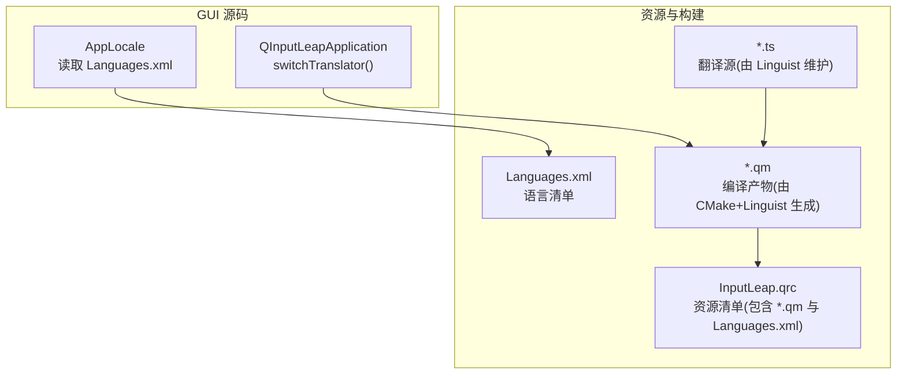
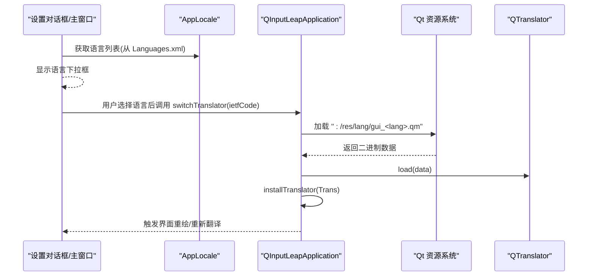
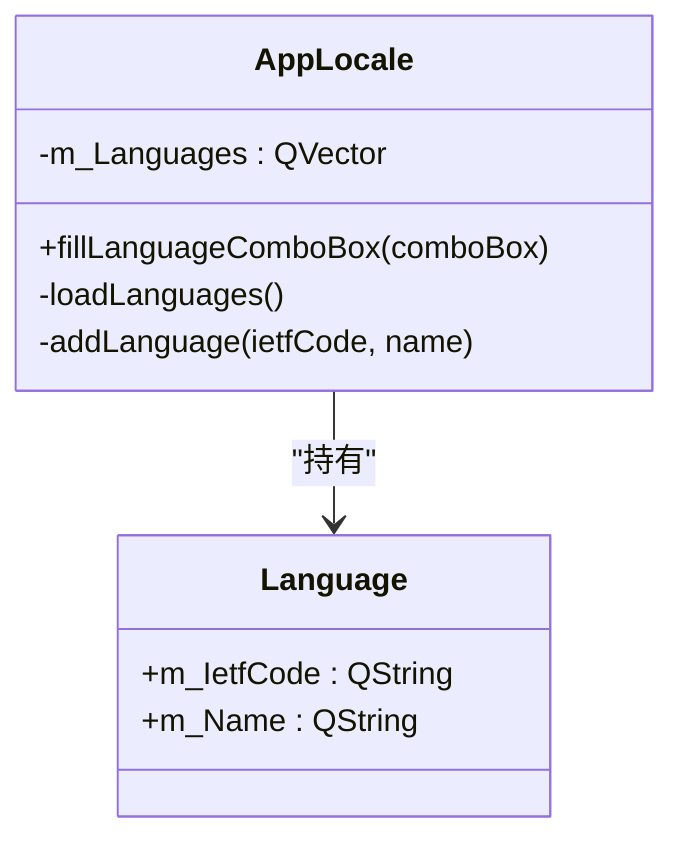
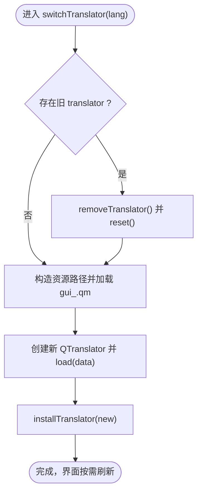
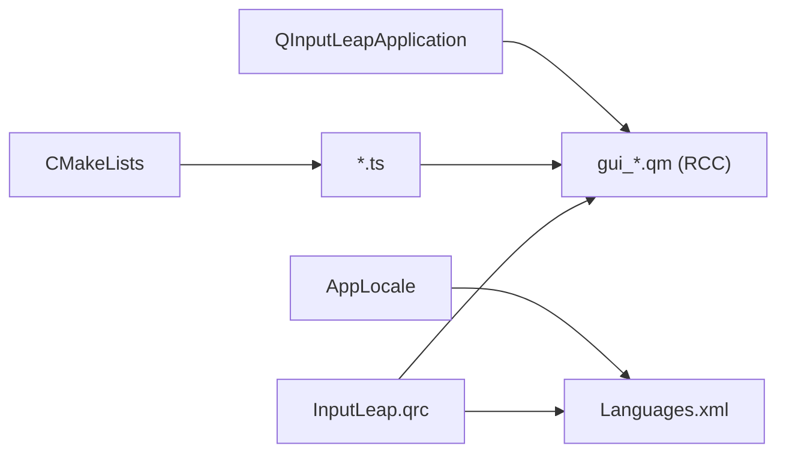

# 国际化支持

<cite>
**本文引用的文件**   
- [src/gui/src/AppLocale.h](file://src/gui/src/AppLocale.h)
- [src/gui/src/AppLocale.cpp](file://src/gui/src/AppLocale.cpp)
- [src/gui/src/QInputLeapApplication.h](file://src/gui/src/QInputLeapApplication.h)
- [src/gui/src/QInputLeapApplication.cpp](file://src/gui/src/QInputLeapApplication.cpp)
- [src/gui/res/InputLeap.qrc](file://src/gui/res/InputLeap.qrc)
- [src/gui/res/lang/Languages.xml](file://src/gui/res/lang/Languages.xml)
- [src/gui/CMakeLists.txt](file://src/gui/CMakeLists.txt)
- [doc/newsfragments/fix_multilang_cannot_load.bugfix](file://doc/newsfragments/fix_multilang_cannot_load.bugfix)
</cite>

## 目录
1. [简介](#简介)
2. [项目结构](#项目结构)
3. [核心组件](#核心组件)
4. [架构总览](#架构总览)
5. [详细组件分析](#详细组件分析)
6. [依赖关系分析](#依赖关系分析)
7. [性能与资源管理](#性能与资源管理)
8. [故障排查指南](#故障排查指南)
9. [结论](#结论)
10. [附录：翻译工作流与最佳实践](#附录翻译工作流与最佳实践)

## 简介
本文件面向开发者与维护者，系统化说明 Input Leap GUI 的国际化（i18n）机制，包括多语言切换、翻译文件管理、语言包加载流程、Qt Linguist 工具使用、字符串提取与更新、动态语言切换、字体适配与本地化资源管理。同时提供新语言添加指南、翻译质量检查与贡献流程，以及跨文化界面设计建议。

## 项目结构
GUI 的国际化相关资源与代码集中在 gui 模块中：
- 运行时语言列表由内嵌 XML 描述，应用启动时解析并填充到下拉框。
- 编译期通过 CMake + Qt Linguist 将 .ts 翻译源转换为 .qm 二进制包。
- 打包期通过 Qt Resource System 将 .qm 与 Languages.xml 等资源嵌入可执行文件。
- 运行期通过 QTranslator 动态加载对应语言的 .qm，实现即时切换。

图表来源
- [src/gui/src/AppLocale.cpp:29-52](file://src/gui/src/AppLocale.cpp#L29-L52)
- [src/gui/src/QInputLeapApplication.cpp:50-61](file://src/gui/src/QInputLeapApplication.cpp#L50-L61)
- [src/gui/res/InputLeap.qrc:1-60](file://src/gui/res/InputLeap.qrc#L1-L60)
- [src/gui/CMakeLists.txt:116-171](file://src/gui/CMakeLists.txt#L116-L171)

章节来源
- [src/gui/src/AppLocale.h:24-48](file://src/gui/src/AppLocale.h#L24-L48)
- [src/gui/src/AppLocale.cpp:24-67](file://src/gui/src/AppLocale.cpp#L24-L67)
- [src/gui/src/QInputLeapApplication.cpp:50-67](file://src/gui/src/QInputLeapApplication.cpp#L50-L67)
- [src/gui/res/InputLeap.qrc:1-60](file://src/gui/res/InputLeap.qrc#L1-L60)
- [src/gui/CMakeLists.txt:116-171](file://src/gui/CMakeLists.txt#L116-L171)

## 核心组件
- AppLocale：负责从内嵌的 Languages.xml 解析可用语言列表，并提供方法将语言项填充到 UI 下拉框。
- QInputLeapApplication：封装全局 QTranslator 生命周期，提供 switchTranslator(lang) 以在运行期按 ietfCode 动态加载对应的 gui_<lang>.qm。
- CMake 构建脚本：声明 TS 文件集合，调用 qt_add_translation/qt5_add_translation 生成 QM 文件，供后续资源打包。
- Qt 资源系统（InputLeap.qrc）：将 Languages.xml 与各语言 .qm 统一打包进可执行文件，便于分发与访问。

章节来源
- [src/gui/src/AppLocale.h:24-48](file://src/gui/src/AppLocale.h#L24-L48)
- [src/gui/src/AppLocale.cpp:24-67](file://src/gui/src/AppLocale.cpp#L24-L67)
- [src/gui/src/QInputLeapApplication.cpp:50-67](file://src/gui/src/QInputLeapApplication.cpp#L50-L67)
- [src/gui/CMakeLists.txt:116-171](file://src/gui/CMakeLists.txt#L116-L171)
- [src/gui/res/InputLeap.qrc:1-60](file://src/gui/res/InputLeap.qrc#L1-L60)

## 架构总览
下图展示了“语言选择 → 语言包加载 → 界面刷新”的整体流程。

图表来源
- [src/gui/src/AppLocale.cpp:29-52](file://src/gui/src/AppLocale.cpp#L29-L52)
- [src/gui/src/QInputLeapApplication.cpp:50-61](file://src/gui/src/QInputLeapApplication.cpp#L50-L61)
- [src/gui/res/InputLeap.qrc:1-60](file://src/gui/res/InputLeap.qrc#L1-L60)

## 详细组件分析

### 语言清单与下拉框填充（AppLocale）
- 职责
  - 启动时从内嵌资源读取 Languages.xml，解析每个 <language> 节点的 ietfCode 与 name。
  - 将语言项存入内部容器，并提供 fillLanguageComboBox 将列表注入到 UI 控件。
- 关键点
  - 使用 QResource 访问 :/res/lang/Languages.xml。
  - 使用 QXmlStreamReader 逐条解析，遇到错误输出诊断信息。
  - 为下拉框填充时阻塞信号，避免重复处理事件。

图表来源
- [src/gui/src/AppLocale.h:24-48](file://src/gui/src/AppLocale.h#L24-L48)
- [src/gui/src/AppLocale.cpp:24-67](file://src/gui/src/AppLocale.cpp#L24-L67)

章节来源
- [src/gui/src/AppLocale.h:24-48](file://src/gui/src/AppLocale.h#L24-L48)
- [src/gui/src/AppLocale.cpp:24-67](file://src/gui/src/AppLocale.cpp#L24-L67)
- [src/gui/res/lang/Languages.xml:1-46](file://src/gui/res/lang/Languages.xml#L1-L46)

### 动态语言切换（QInputLeapApplication）
- 职责
  - 维护全局 QTranslator 实例。
  - 根据传入的 ietfCode 构造资源路径 ":/res/lang/gui_<lang>.qm"，加载并安装新的翻译器。
- 关键点
  - 切换前移除旧 translator，避免内存泄漏或冲突。
  - 使用 QResource 直接加载已打包的 .qm 二进制数据。
  - 安装新 translator 后，Qt 框架会基于 tr()/trUtf8() 等机制自动刷新可见文本。

图表来源
- [src/gui/src/QInputLeapApplication.cpp:50-61](file://src/gui/src/QInputLeapApplication.cpp#L50-L61)

章节来源
- [src/gui/src/QInputLeapApplication.cpp:50-67](file://src/gui/src/QInputLeapApplication.cpp#L50-L67)

### 构建与资源打包（CMake + Qt Linguist + RCC）
- 构建阶段
  - CMake 列出所有 .ts 文件，调用 qt_add_translation/qt5_add_translation 生成对应的 .qm。
  - 输出目录指向 res/lang，便于后续资源引用。
- 资源阶段
  - InputLeap.qrc 将所有 .qm 与 Languages.xml 纳入 /res 命名空间，随程序一起发布。
- 影响
  - 新增语言需同步更新 CMake 中的 TS 列表与 qrc 中的 QM 条目，确保构建与运行一致。

章节来源
- [src/gui/CMakeLists.txt:116-171](file://src/gui/CMakeLists.txt#L116-L171)
- [src/gui/res/InputLeap.qrc:1-60](file://src/gui/res/InputLeap.qrc#L1-L60)

## 依赖关系分析
- 组件耦合
  - AppLocale 仅依赖 Qt 资源与 XML 解析，低耦合，职责单一。
  - QInputLeapApplication 集中管理 QTranslator，对上层 UI 透明。
- 外部依赖
  - Qt Core/Widgets/Network（构建脚本声明）。
  - OpenSSL（安全相关功能，非 i18n 核心）。
- 潜在风险
  - 若 qrc 未包含某 .qm，运行期将无法找到对应语言包。
  - 若 TS 未加入 CMake 列表，则不会生成 .qm，导致语言缺失。

图表来源
- [src/gui/CMakeLists.txt:116-171](file://src/gui/CMakeLists.txt#L116-L171)
- [src/gui/res/InputLeap.qrc:1-60](file://src/gui/res/InputLeap.qrc#L1-L60)
- [src/gui/src/AppLocale.cpp:29-52](file://src/gui/src/AppLocale.cpp#L29-L52)
- [src/gui/src/QInputLeapApplication.cpp:50-61](file://src/gui/src/QInputLeapApplication.cpp#L50-L61)

章节来源
- [src/gui/CMakeLists.txt:116-171](file://src/gui/CMakeLists.txt#L116-L171)
- [src/gui/res/InputLeap.qrc:1-60](file://src/gui/res/InputLeap.qrc#L1-L60)

## 性能与资源管理
- 资源体积
  - 所有 .qm 均被打包进可执行文件，语言越多，安装包越大。建议按需裁剪不需要的语言。
- 切换开销
  - 切换语言时仅替换 QTranslator，无需重启进程；但大量 UI 文本刷新可能带来短暂卡顿。可在切换前后禁用不必要的动画或延迟渲染。
- 内存管理
  - 切换前移除旧 translator 并 reset，避免重复安装导致的内存增长。
- 字体与排版
  - 不同语言字符集差异较大（如阿拉伯语、中文、日文），应确保 UI 布局能自适应宽度变化，必要时启用自动换行与最小尺寸约束。

[本节为通用指导，不涉及具体文件]

## 故障排查指南
- 现象：语言名称或 UI 路径不正确，导致界面显示异常
  - 参考修复记录：修复了 UI 名称和 '.ui' 路径在语言文件中不正确的问题。
  - 建议检查 Languages.xml 的 ietfCode 是否与 .qm 文件名后缀一致，且 qrc 中包含对应 .qm。
- 现象：切换语言无效
  - 确认 qrc 是否包含目标 .qm；确认 CMake 已将对应 .ts 加入构建；确认 switchTranslator 被正确调用。
- 现象：部分文本未翻译
  - 检查源代码中是否使用了 tr()/trUtf8() 包裹；确认 .ts 已更新并重新生成 .qm。

章节来源
- [doc/newsfragments/fix_multilang_cannot_load.bugfix:1-1](file://doc/newsfragments/fix_multilang_cannot_load.bugfix#L1-L1)
- [src/gui/res/InputLeap.qrc:1-60](file://src/gui/res/InputLeap.qrc#L1-L60)
- [src/gui/CMakeLists.txt:116-171](file://src/gui/CMakeLists.txt#L116-L171)
- [src/gui/src/QInputLeapApplication.cpp:50-61](file://src/gui/src/QInputLeapApplication.cpp#L50-L61)

## 结论
Input Leap 的国际化体系围绕“XML 语言清单 + Qt Linguist 翻译管线 + Qt 资源系统 + QTranslator 动态加载”展开。该方案具备以下优势：
- 运行期可热切换语言，无需重启。
- 构建期自动化生成 .qm，减少人工干预。
- 资源集中打包，便于分发与版本控制。
为确保质量与一致性，建议在 CI 中增加 .ts/.qm 一致性校验，并在文档中明确新增语言的标准流程。

[本节为总结性内容，不涉及具体文件]

## 附录：翻译工作流与最佳实践

### 新增语言步骤
- 准备语言清单
  - 在 Languages.xml 中添加新语言条目，包含 ietfCode 与本地化名称。
- 初始化翻译源
  - 在 CMakeLists.txt 的 TS_FILES 列表中加入新的 gui_<lang>.ts。
  - 首次可从现有 .ts 复制模板，或使用 lupdate 抽取字符串生成。
- 生成与打包
  - 构建时将自动生成 gui_<lang>.qm；确保 InputLeap.qrc 包含该 .qm（通常由构建系统或手动维护）。
- 验证
  - 在设置中选择新语言，确认界面文本、提示、菜单均已翻译。

章节来源
- [src/gui/res/lang/Languages.xml:1-46](file://src/gui/res/lang/Languages.xml#L1-L46)
- [src/gui/CMakeLists.txt:116-171](file://src/gui/CMakeLists.txt#L116-L171)
- [src/gui/res/InputLeap.qrc:1-60](file://src/gui/res/InputLeap.qrc#L1-L60)

### Qt Linguist 使用要点
- 提取字符串
  - 使用 lupdate 扫描源码与 .ui，生成或更新 .ts。
- 编辑翻译
  - 使用 linguist 打开 .ts，进行翻译与上下文标注。
- 生成二进制包
  - 使用 lrelease 或通过 CMake 的 qt_add_translation 生成 .qm。
- 提交与合并
  - 将 .ts 提交至仓库；CI 构建时应生成 .qm 并打包进资源。

[本节为通用指导，不涉及具体文件]

### 翻译质量检查
- 完整性
  - 对比 .ts 与 .qm 的条目数量，确保无遗漏。
- 一致性
  - 术语表统一；复数形式、占位符、HTML 标签保持一致。
- 可读性
  - 长文本考虑换行；避免硬编码长度；注意 RTL 语言布局。
- 回归测试
  - 在关键页面进行语言切换演练，覆盖弹窗、菜单、状态栏等。

[本节为通用指导，不涉及具体文件]

### 贡献流程建议
- Fork 仓库并创建分支。
- 修改 Languages.xml、TS 列表与对应 .ts。
- 本地构建并验证 .qm 生成与资源打包。
- 提交 PR，附带变更说明与截图（可选）。
- 维护者审查通过后合并。

[本节为通用指导，不涉及具体文件]

### 跨文化界面设计建议
- 文本扩展预留空间：德语、俄语等通常比英文更长。
- 图标与文案分离：避免用图片承载文字。
- 日期/时间/数字格式：尽量使用 Qt 本地化工具格式化。
- 方向性与对齐：阿拉伯语/希伯来语采用 RTL，需测试布局镜像。
- 颜色与符号：避免具有特定文化含义的颜色或手势。

[本节为通用指导，不涉及具体文件]