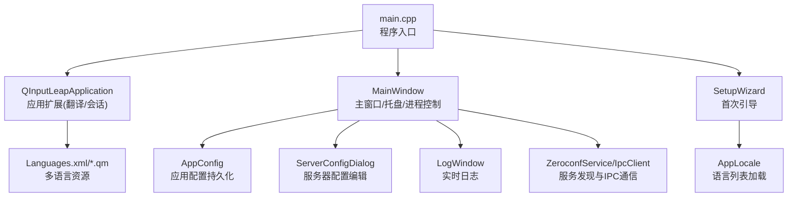
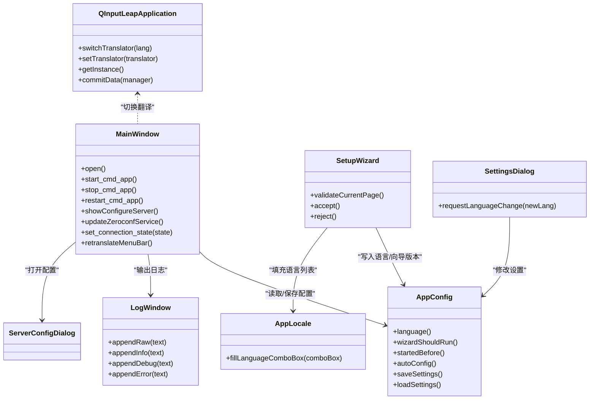
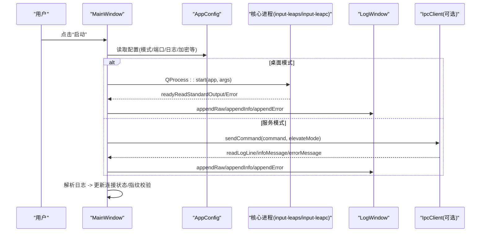
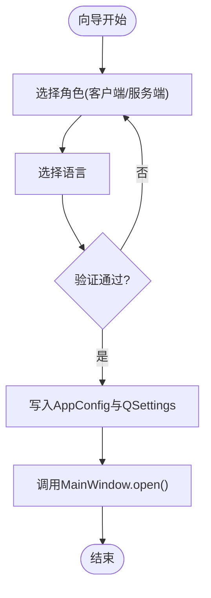
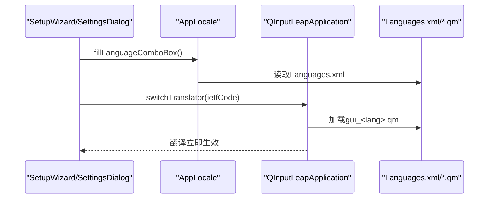
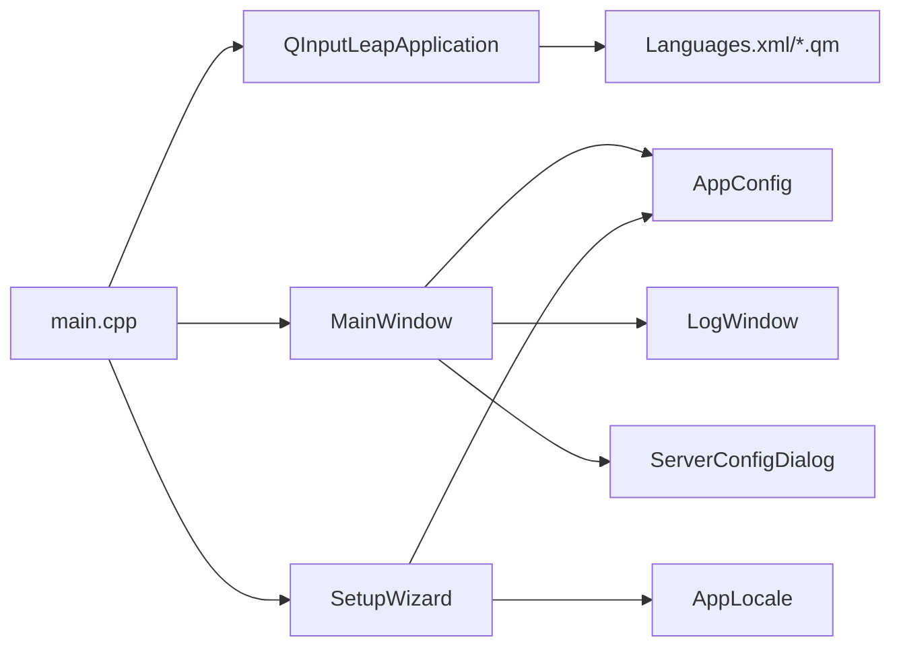

# 图形界面应用

<cite>
**本文引用的文件**   
- [main.cpp](file://src/gui/src/main.cpp)
- [MainWindow.h](file://src/gui/src/MainWindow.h)
- [MainWindow.cpp](file://src/gui/src/MainWindow.cpp)
- [SetupWizard.h](file://src/gui/src/SetupWizard.h)
- [SetupWizard.cpp](file://src/gui/src/SetupWizard.cpp)
- [AppConfig.h](file://src/gui/src/AppConfig.h)
- [AppConfig.cpp](file://src/gui/src/AppConfig.cpp)
- [QInputLeapApplication.h](file://src/gui/src/QInputLeapApplication.h)
- [QInputLeapApplication.cpp](file://src/gui/src/QInputLeapApplication.cpp)
- [AppLocale.h](file://src/gui/src/AppLocale.h)
- [AppLocale.cpp](file://src/gui/src/AppLocale.cpp)
- [SettingsDialog.h](file://src/gui/src/SettingsDialog.h)
- [ServerConfigDialog.h](file://src/gui/src/ServerConfigDialog.h)
- [LogWindow.h](file://src/gui/src/LogWindow.h)
- [Languages.xml](file://src/gui/res/lang/Languages.xml)
</cite>

## 目录
1. [简介](#简介)
2. [项目结构](#项目结构)
3. [核心组件](#核心组件)
4. [架构总览](#架构总览)
5. [详细组件分析](#详细组件分析)
6. [依赖关系分析](#依赖关系分析)
7. [性能与响应式考虑](#性能与响应式考虑)
8. [故障排查指南](#故障排查指南)
9. [结论](#结论)
10. [附录：API 参考与扩展指南](#附录api-参考与扩展指南)

## 简介
本文件面向 Input Leap 的 Qt 图形界面应用，系统性梳理基于 Qt 的 GUI 架构设计、主窗口与设置向导等核心界面组件的职责与交互流程，解释多语言支持、主题与图标策略、状态管理与事件处理机制，并提供 API 参考、样式定制建议、扩展开发方法与测试策略。目标是帮助开发者快速理解并高效扩展该 GUI 子系统。

## 项目结构
GUI 子工程位于 src/gui，采用“功能模块 + UI 资源”的组织方式：
- 入口与生命周期：main.cpp、QInputLeapApplication
- 主界面与系统托盘：MainWindow
- 首次运行引导：SetupWizard
- 配置管理：AppConfig（持久化）、ServerConfigDialog（服务器配置）
- 设置对话框：SettingsDialog（日志、语言等）
- 国际化：AppLocale、Languages.xml、*.ts/qm 资源
- 日志窗口：LogWindow
- 平台相关逻辑：Windows/macOS/Linux 差异处理

图表来源
- [main.cpp:63-150](file://src/gui/src/main.cpp#L63-L150)
- [QInputLeapApplication.cpp:27-68](file://src/gui/src/QInputLeapApplication.cpp#L27-L68)
- [MainWindow.cpp:114-198](file://src/gui/src/MainWindow.cpp#L114-L198)
- [SetupWizard.cpp:26-58](file://src/gui/src/SetupWizard.cpp#L26-L58)
- [AppConfig.cpp:50-69](file://src/gui/src/AppConfig.cpp#L50-L69)
- [AppLocale.cpp:24-68](file://src/gui/src/AppLocale.cpp#L24-L68)
- [Languages.xml:1-47](file://src/gui/res/lang/Languages.xml#L1-L47)

章节来源
- [main.cpp:63-150](file://src/gui/src/main.cpp#L63-L150)
- [MainWindow.h:67-206](file://src/gui/src/MainWindow.h#L67-L206)
- [SetupWizard.h:32-59](file://src/gui/src/SetupWizard.h#L32-L59)
- [AppConfig.h:51-145](file://src/gui/src/AppConfig.h#L51-L145)
- [QInputLeapApplication.h:26-45](file://src/gui/src/QInputLeapApplication.h#L26-L45)
- [AppLocale.h:24-49](file://src/gui/src/AppLocale.h#L24-49)

## 核心组件
- QInputLeapApplication：继承 QApplication，提供全局单例、会话保存回调、动态切换翻译器能力。
- MainWindow：主窗口，负责模式选择（客户端/服务端）、启动/停止核心进程、系统托盘、菜单、日志窗口、自动配置提示、SSL 指纹校验等。
- SetupWizard：首次运行向导，引导用户选择角色、设置语言，并将结果写入 AppConfig 和 QSettings。
- AppConfig：集中管理应用级配置项（屏幕名、端口、接口、日志级别、是否首次运行、语言、自动隐藏/启动、最小化到托盘等），读写 QSettings。
- AppLocale：从 Languages.xml 解析可用语言列表，填充下拉框。
- SettingsDialog：设置对话框，提供语言切换、日志开关与路径浏览等。
- ServerConfigDialog：服务器端屏幕布局与动作/热键配置。
- LogWindow：独立日志窗口，支持按级别输出与清空。

章节来源
- [QInputLeapApplication.h:26-45](file://src/gui/src/QInputLeapApplication.h#L26-L45)
- [QInputLeapApplication.cpp:27-68](file://src/gui/src/QInputLeapApplication.cpp#L27-L68)
- [MainWindow.h:67-206](file://src/gui/src/MainWindow.h#L67-L206)
- [MainWindow.cpp:114-198](file://src/gui/src/MainWindow.cpp#L114-L198)
- [SetupWizard.h:32-59](file://src/gui/src/SetupWizard.h#L32-L59)
- [SetupWizard.cpp:26-58](file://src/gui/src/SetupWizard.cpp#L26-L58)
- [AppConfig.h:51-145](file://src/gui/src/AppConfig.h#L51-L145)
- [AppConfig.cpp:50-69](file://src/gui/src/AppConfig.cpp#L50-L69)
- [AppLocale.h:24-49](file://src/gui/src/AppLocale.h#L24-49)
- [AppLocale.cpp:24-68](file://src/gui/src/AppLocale.cpp#L24-L68)
- [SettingsDialog.h:32-56](file://src/gui/src/SettingsDialog.h#L32-L56)
- [ServerConfigDialog.h:32-68](file://src/gui/src/ServerConfigDialog.h#L32-L68)
- [LogWindow.h:28-52](file://src/gui/src/LogWindow.h#L28-L52)

## 架构总览
下图展示 GUI 层关键对象及其职责边界与交互关系。

图表来源
- [QInputLeapApplication.h:26-45](file://src/gui/src/QInputLeapApplication.h#L26-L45)
- [QInputLeapApplication.cpp:27-68](file://src/gui/src/QInputLeapApplication.cpp#L27-L68)
- [MainWindow.h:67-206](file://src/gui/src/MainWindow.h#L67-L206)
- [MainWindow.cpp:114-198](file://src/gui/src/MainWindow.cpp#L114-L198)
- [SetupWizard.h:32-59](file://src/gui/src/SetupWizard.h#L32-L59)
- [SetupWizard.cpp:26-58](file://src/gui/src/SetupWizard.cpp#L26-L58)
- [AppConfig.h:51-145](file://src/gui/src/AppConfig.h#L51-L145)
- [AppConfig.cpp:50-69](file://src/gui/src/AppConfig.cpp#L50-L69)
- [AppLocale.h:24-49](file://src/gui/src/AppLocale.h#L24-49)
- [AppLocale.cpp:24-68](file://src/gui/src/AppLocale.cpp#L24-L68)
- [SettingsDialog.h:32-56](file://src/gui/src/SettingsDialog.h#L32-L56)
- [ServerConfigDialog.h:32-68](file://src/gui/src/ServerConfigDialog.h#L32-L68)
- [LogWindow.h:28-52](file://src/gui/src/LogWindow.h#L28-L52)

## 详细组件分析

### 主窗口（MainWindow）
- 职责
  - 维护应用连接状态（断开/连接中/已连接/传输中），更新托盘图标与状态栏。
  - 根据当前模式（客户端/服务端）组装命令行参数并启动对应可执行。
  - 通过 IPC 或标准输出/错误管道接收日志，分发至 LogWindow。
  - 管理系统托盘菜单、菜单栏、自动隐藏/启动行为。
  - 触发 SSL 指纹校验弹窗，信任后重启客户端以继续连接。
  - 与 Zeroconf 服务集成，实现自动发现服务器。
- 关键流程
  - 启动核心进程：根据模式生成参数，桌面模式直接 QProcess 启动；服务模式下通过 IPC 命令交由守护进程拉起。
  - 日志聚合：将原始行拆分并按级别追加到日志窗口，同时解析连接状态与指纹信息。
  - 托盘交互：双击显示/隐藏主窗口，菜单提供启动/停止/重载/退出等操作。
- 事件与信号
  - 菜单栏/工具栏动作触发启动、停止、重载、显示日志、保存配置等。
  - 语言变更信号 requestLanguageChange 通知应用层切换翻译器。

图表来源
- [MainWindow.cpp:565-671](file://src/gui/src/MainWindow.cpp#L565-L671)
- [MainWindow.cpp:390-448](file://src/gui/src/MainWindow.cpp#L390-L448)
- [MainWindow.cpp:450-550](file://src/gui/src/MainWindow.cpp#L450-L550)
- [MainWindow.cpp:251-275](file://src/gui/src/MainWindow.cpp#L251-L275)

章节来源
- [MainWindow.h:67-206](file://src/gui/src/MainWindow.h#L67-L206)
- [MainWindow.cpp:114-198](file://src/gui/src/MainWindow.cpp#L114-L198)
- [MainWindow.cpp:251-275](file://src/gui/src/MainWindow.cpp#L251-L275)
- [MainWindow.cpp:390-448](file://src/gui/src/MainWindow.cpp#L390-L448)
- [MainWindow.cpp:450-550](file://src/gui/src/MainWindow.cpp#L450-L550)
- [MainWindow.cpp:565-671](file://src/gui/src/MainWindow.cpp#L565-L671)

### 设置向导（SetupWizard）
- 职责
  - 首次运行引导：选择角色（客户端/服务端）、设置语言。
  - 将语言与向导完成标记写入 AppConfig，并同步到 QSettings。
  - 完成后调用 MainWindow.open() 进入主界面。
- 交互要点
  - 语言切换即时生效：通过 QInputLeapApplication::switchTranslator 动态加载 .qm。
  - 页面验证：确保至少选择一个角色。

图表来源
- [SetupWizard.cpp:62-82](file://src/gui/src/SetupWizard.cpp#L62-L82)
- [SetupWizard.cpp:104-132](file://src/gui/src/SetupWizard.cpp#L104-L132)
- [SetupWizard.cpp:146-150](file://src/gui/src/SetupWizard.cpp#L146-L150)

章节来源
- [SetupWizard.h:32-59](file://src/gui/src/SetupWizard.h#L32-L59)
- [SetupWizard.cpp:26-58](file://src/gui/src/SetupWizard.cpp#L26-L58)
- [SetupWizard.cpp:62-82](file://src/gui/src/SetupWizard.cpp#L62-L82)
- [SetupWizard.cpp:104-132](file://src/gui/src/SetupWizard.cpp#L104-L132)
- [SetupWizard.cpp:146-150](file://src/gui/src/SetupWizard.cpp#L146-L150)

### 配置管理（AppConfig）
- 职责
  - 集中管理应用级配置项，包括屏幕名、端口、网络接口、日志级别/文件、向导版本、语言、自动隐藏/启动、最小化到托盘、加密与证书要求等。
  - 提供 loadSettings/saveSettings 与便捷访问器。
- 关键点
  - 默认值与平台差异：Windows 默认服务模式与非 Windows 默认桌面模式。
  - 向后兼容：迁移旧 Barrier 设置位置。
  - 向导版本控制：kWizardVersion 决定是否需要再次显示向导。

章节来源
- [AppConfig.h:51-145](file://src/gui/src/AppConfig.h#L51-L145)
- [AppConfig.cpp:50-69](file://src/gui/src/AppConfig.cpp#L50-L69)
- [AppConfig.cpp:141-191](file://src/gui/src/AppConfig.cpp#L141-L191)
- [AppConfig.cpp:221-246](file://src/gui/src/AppConfig.cpp#L221-L246)

### 多语言支持（AppLocale + QInputLeapApplication）
- 语言清单
  - 从 Languages.xml 解析 ietfCode 与本地名称，填充到下拉框。
- 运行时切换
  - 通过 QInputLeapApplication::switchTranslator 卸载旧翻译器，加载对应 gui_*.qm 并安装新翻译器。
  - 向导与设置对话框在语言变化时触发切换。

图表来源
- [AppLocale.cpp:24-68](file://src/gui/src/AppLocale.cpp#L24-L68)
- [QInputLeapApplication.cpp:50-61](file://src/gui/src/QInputLeapApplication.cpp#L50-L61)
- [Languages.xml:1-47](file://src/gui/res/lang/Languages.xml#L1-L47)

章节来源
- [AppLocale.h:24-49](file://src/gui/src/AppLocale.h#L24-49)
- [AppLocale.cpp:24-68](file://src/gui/src/AppLocale.cpp#L24-L68)
- [QInputLeapApplication.h:26-45](file://src/gui/src/QInputLeapApplication.h#L26-L45)
- [QInputLeapApplication.cpp:27-68](file://src/gui/src/QInputLeapApplication.cpp#L27-L68)
- [Languages.xml:1-47](file://src/gui/res/lang/Languages.xml#L1-L47)

### 设置对话框（SettingsDialog）
- 职责
  - 提供语言切换、日志开关与日志路径浏览等功能。
  - 通过信号 requestLanguageChange 通知应用层切换翻译器。
- 交互
  - 接受/拒绝时回写配置或恢复原状。

章节来源
- [SettingsDialog.h:32-56](file://src/gui/src/SettingsDialog.h#L32-L56)

### 服务器配置对话框（ServerConfigDialog）
- 职责
  - 可视化编辑服务器端屏幕布局、动作与热键。
  - 内部持有 ServerConfig 副本，提交时合并到实际配置。

章节来源
- [ServerConfigDialog.h:32-68](file://src/gui/src/ServerConfigDialog.h#L32-L68)

### 日志窗口（LogWindow）
- 职责
  - 独立于主窗口的日志查看器，支持按级别追加与清空。
  - 主窗口将核心进程输出与 IPC 消息转发至此。

章节来源
- [LogWindow.h:28-52](file://src/gui/src/LogWindow.h#L28-L52)

## 依赖关系分析
- 入口依赖
  - main.cpp 创建 QInputLeapApplication、AppConfig、MainWindow、SetupWizard，并根据 AppConfig.wizardShouldRun 决定优先显示向导还是主窗口。
- 组件耦合
  - MainWindow 强依赖 AppConfig（读/写配置）、LogWindow（日志输出）、ServerConfigDialog（配置编辑）。
  - SetupWizard 依赖 AppLocale 与 AppConfig。
  - QInputLeapApplication 为全局单例，被多处用于切换翻译器。
- 外部资源
  - 语言包 gui_*.qm 与 Languages.xml 由 QResource 加载。
  - 图标资源通过 Qt 资源系统引用。

图表来源
- [main.cpp:63-150](file://src/gui/src/main.cpp#L63-L150)
- [QInputLeapApplication.cpp:50-61](file://src/gui/src/QInputLeapApplication.cpp#L50-L61)
- [MainWindow.cpp:114-198](file://src/gui/src/MainWindow.cpp#L114-L198)
- [SetupWizard.cpp:26-58](file://src/gui/src/SetupWizard.cpp#L26-L58)
- [AppLocale.cpp:24-68](file://src/gui/src/AppLocale.cpp#L24-L68)

章节来源
- [main.cpp:63-150](file://src/gui/src/main.cpp#L63-L150)
- [MainWindow.cpp:114-198](file://src/gui/src/MainWindow.cpp#L114-L198)
- [SetupWizard.cpp:26-58](file://src/gui/src/SetupWizard.cpp#L26-L58)
- [AppLocale.cpp:24-68](file://src/gui/src/AppLocale.cpp#L24-L68)
- [QInputLeapApplication.cpp:50-61](file://src/gui/src/QInputLeapApplication.cpp#L50-L61)

## 性能与响应式考虑
- 托盘可用性检测：Linux 下系统托盘可能延迟可用，使用重试机制避免 GUI 不可用。
- 日志批处理：对标准输出进行行分割后再追加，避免频繁 UI 刷新。
- 按需加载翻译器：仅在语言切换时卸载并重新安装翻译器，减少初始化开销。
- 平台差异化尺寸：针对不同平台设置初始大小与最小尺寸，提升首屏体验。
- 自动隐藏与自动启动：结合 AppConfig 控制，减少不必要的窗口占用与后台进程开销。

[本节为通用指导，不直接分析具体文件]

## 故障排查指南
- 无法启动核心进程
  - 检查可执行路径是否存在、权限是否足够；桌面模式下若启动失败会弹出警告。
- Wayland 兼容性提示
  - 在 XCB/Wayland 环境下会给出提示信息，部分桌面环境/窗口管理器支持度有限。
- macOS 辅助功能权限
  - 首次运行需授予辅助功能权限，否则提示并退出。
- 系统托盘不可用
  - Linux 登录初期托盘可能未就绪，应用会重试若干次；若仍不可用则禁用自动隐藏。
- SSL 指纹校验
  - 当检测到未知对端指纹时会暂停连接并弹出确认框，确认后写入受信任数据库并重启客户端。

章节来源
- [main.cpp:63-150](file://src/gui/src/main.cpp#L63-L150)
- [main.cpp:152-173](file://src/gui/src/main.cpp#L152-L173)
- [main.cpp:175-213](file://src/gui/src/main.cpp#L175-L213)
- [MainWindow.cpp:655-671](file://src/gui/src/MainWindow.cpp#L655-L671)
- [MainWindow.cpp:479-550](file://src/gui/src/MainWindow.cpp#L479-L550)

## 结论
Input Leap 的 GUI 采用清晰的 Qt 分层与模块化设计：入口负责生命周期与初始化，主窗口承担核心交互与进程控制，向导负责首次引导，配置集中于 AppConfig，多语言通过 QResource 与 QTranslator 实现动态切换。整体架构易于扩展与维护，适合在此基础上增加新的设置项、界面组件与平台适配。

[本节为总结性内容，不直接分析具体文件]

## 附录：API 参考与扩展指南

### 关键类与方法参考
- QInputLeapApplication
  - switchTranslator(lang): 切换当前翻译器
  - setTranslator(translator): 设置自定义翻译器
  - getInstance(): 获取全局实例
  - commitData(manager): 会话保存回调，触发主窗口保存设置
- MainWindow
  - open(): 创建托盘、根据配置决定是否自动隐藏/启动
  - start_cmd_app()/stop_cmd_app()/restart_cmd_app(): 启动/停止/重启核心进程
  - showConfigureServer(): 打开服务器配置对话框
  - updateZeroconfService(): 更新零配置服务
  - set_connection_state(state): 更新连接状态并刷新图标
  - retranslateMenuBar(): 重绘菜单标题（多语言）
- SetupWizard
  - validateCurrentPage(): 页面验证
  - accept()/reject(): 完成/取消向导，保存语言与角色
- AppConfig
  - language()/setLanguage(): 语言读写
  - wizardShouldRun(): 判断是否需要显示向导
  - startedBefore()/setStartedBefore(): 记录是否已启动过
  - autoConfig()/setAutoConfig(): 自动配置开关
  - saveSettings()/loadSettings(): 持久化配置
- AppLocale
  - fillLanguageComboBox(comboBox): 从 Languages.xml 填充语言列表
- SettingsDialog
  - requestLanguageChange(newLang): 请求切换语言
- ServerConfigDialog
  - accept(): 提交服务器配置
- LogWindow
  - appendRaw/appendInfo/appendDebug/appendError: 追加不同级别日志

章节来源
- [QInputLeapApplication.h:26-45](file://src/gui/src/QInputLeapApplication.h#L26-L45)
- [QInputLeapApplication.cpp:27-68](file://src/gui/src/QInputLeapApplication.cpp#L27-L68)
- [MainWindow.h:67-206](file://src/gui/src/MainWindow.h#L67-L206)
- [MainWindow.cpp:114-198](file://src/gui/src/MainWindow.cpp#L114-L198)
- [SetupWizard.h:32-59](file://src/gui/src/SetupWizard.h#L32-L59)
- [SetupWizard.cpp:26-58](file://src/gui/src/SetupWizard.cpp#L26-L58)
- [AppConfig.h:51-145](file://src/gui/src/AppConfig.h#L51-L145)
- [AppConfig.cpp:50-69](file://src/gui/src/AppConfig.cpp#L50-L69)
- [AppLocale.h:24-49](file://src/gui/src/AppLocale.h#L24-49)
- [AppLocale.cpp:24-68](file://src/gui/src/AppLocale.cpp#L24-L68)
- [SettingsDialog.h:32-56](file://src/gui/src/SettingsDialog.h#L32-L56)
- [ServerConfigDialog.h:32-68](file://src/gui/src/ServerConfigDialog.h#L32-L68)
- [LogWindow.h:28-52](file://src/gui/src/LogWindow.h#L28-L52)

### 自定义样式与主题
- 图标与主题
  - 托盘图标根据连接状态动态切换，优先使用系统主题图标，回退到内置资源。
  - macOS 上设置 mask 以适配系统风格。
- 字体与缩放
  - 根据平台设置初始尺寸与最小尺寸，保证在不同 DPI 下的可读性。
- 建议
  - 使用 Qt 样式表统一外观，避免硬编码颜色；遵循系统主题与高对比度模式。

章节来源
- [MainWindow.cpp:78-112](file://src/gui/src/MainWindow.cpp#L78-L112)
- [MainWindow.cpp:362-372](file://src/gui/src/MainWindow.cpp#L362-L372)
- [MainWindow.cpp:162-170](file://src/gui/src/MainWindow.cpp#L162-L170)

### 扩展开发方法
- 新增设置项
  - 在 AppConfig 中添加属性与存取方法，并在 loadSettings/saveSettings 中读写。
  - 在 SettingsDialog 中暴露 UI 控件，绑定信号槽更新 AppConfig。
- 新增界面页签/对话框
  - 新建 QDialog 子类，复用 AppConfig 与 AppLocale 能力，必要时发出 requestLanguageChange 信号。
- 新增语言
  - 在 Languages.xml 添加条目，准备对应的 gui_<lang>.qm 资源，即可在向导/设置中选择。
- 扩展日志级别
  - 在 AppConfig 中调整默认日志级别，或在设置对话框中暴露更细粒度选项。

章节来源
- [AppConfig.h:51-145](file://src/gui/src/AppConfig.h#L51-L145)
- [AppConfig.cpp:141-191](file://src/gui/src/AppConfig.cpp#L141-L191)
- [SettingsDialog.h:32-56](file://src/gui/src/SettingsDialog.h#L32-L56)
- [AppLocale.cpp:24-68](file://src/gui/src/AppLocale.cpp#L24-L68)
- [Languages.xml:1-47](file://src/gui/res/lang/Languages.xml#L1-L47)

### 界面测试策略
- 单元测试
  - 针对 AppConfig 的读写与默认值进行断言；覆盖平台差异分支。
  - 针对 AppLocale 的语言列表解析进行断言。
- 集成测试
  - 模拟向导流程：选择角色与语言，验证配置持久化与主窗口行为。
  - 模拟主窗口启动/停止流程：验证参数拼装、进程启动与日志输出。
- 用户体验测试
  - 多语言切换流畅性与一致性。
  - 托盘可用性、自动隐藏/启动、最小化到托盘等行为在不同平台验证。
  - SSL 指纹校验流程的用户提示与后续行为。

[本节为方法论说明，不直接分析具体文件]