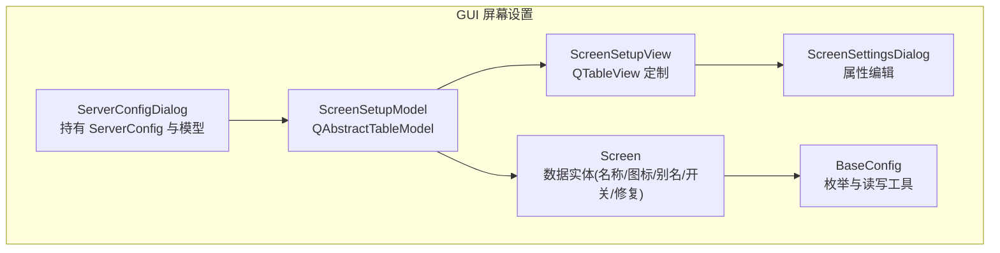
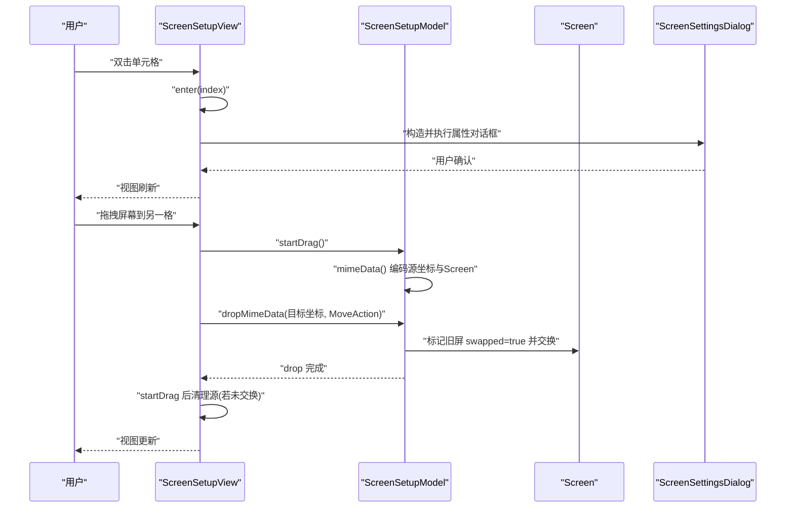
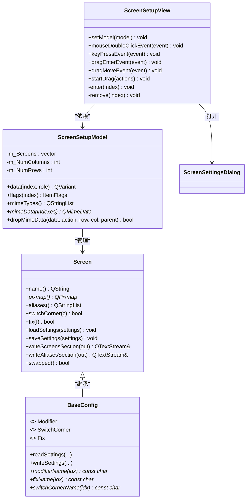
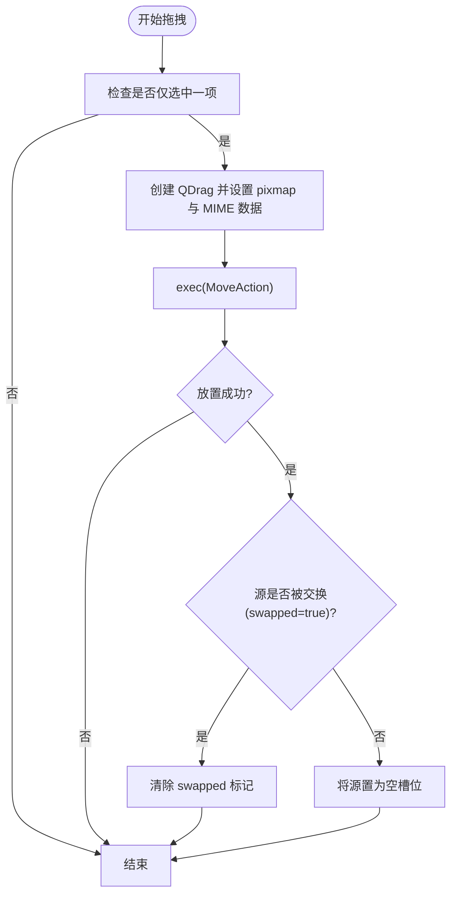
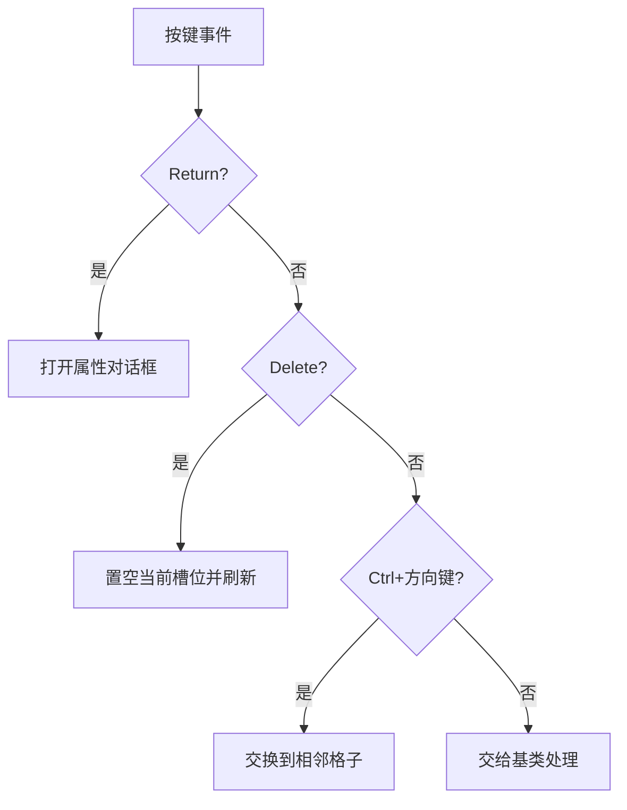
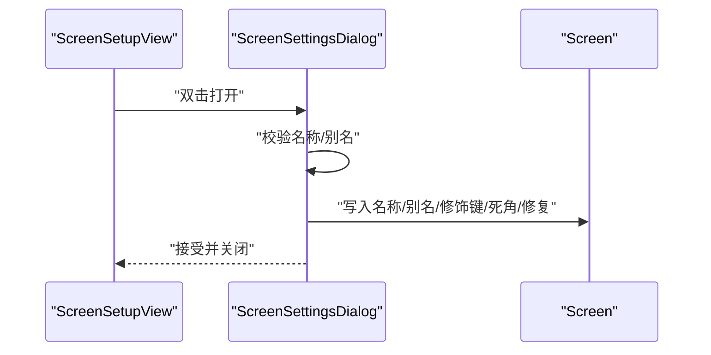
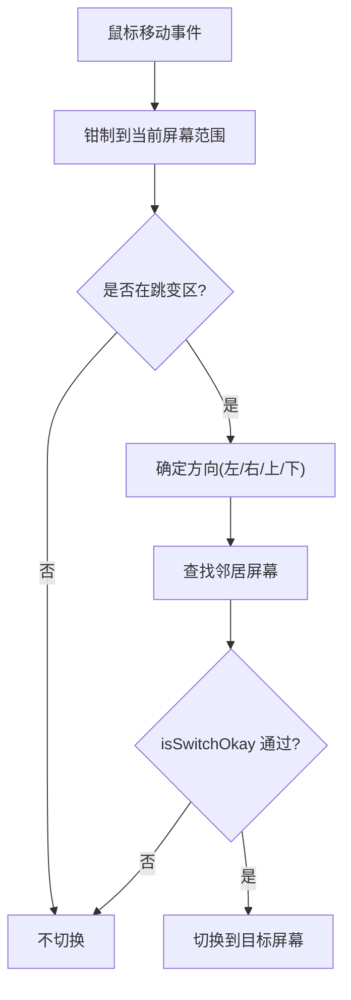
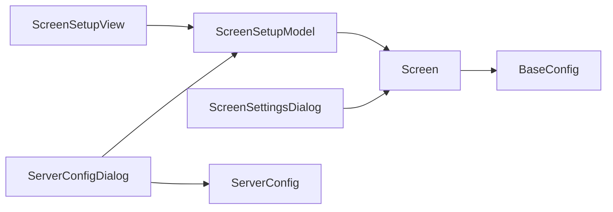

# 屏幕设置界面

<cite>
**本文引用的文件**   
- [ScreenSetupModel.h](file://src/gui/src/ScreenSetupModel.h)
- [ScreenSetupModel.cpp](file://src/gui/src/ScreenSetupModel.cpp)
- [ScreenSetupView.h](file://src/gui/src/ScreenSetupView.h)
- [ScreenSetupView.cpp](file://src/gui/src/ScreenSetupView.cpp)
- [ScreenSettingsDialog.h](file://src/gui/src/ScreenSettingsDialog.h)
- [ScreenSettingsDialog.cpp](file://src/gui/src/ScreenSettingsDialog.cpp)
- [ScreenSettingsDialog.ui](file://src/gui/src/ScreenSettingsDialog.ui)
- [Screen.h](file://src/gui/src/Screen.h)
- [Screen.cpp](file://src/gui/src/Screen.cpp)
- [BaseConfig.h](file://src/gui/src/BaseConfig.h)
- [ServerConfigDialog.h](file://src/gui/src/ServerConfigDialog.h)
- [ServerConfigDialog.cpp](file://src/gui/src/ServerConfigDialog.cpp)
</cite>

## 目录
1. [简介](#简介)
2. [项目结构](#项目结构)
3. [核心组件](#核心组件)
4. [架构总览](#架构总览)
5. [详细组件分析](#详细组件分析)
6. [依赖关系分析](#依赖关系分析)
7. [性能与交互特性](#性能与交互特性)
8. [故障排查指南](#故障排查指南)
9. [结论](#结论)
10. [附录：扩展与自定义指南](#附录扩展与自定义指南)

## 简介
本文件面向 Input Leap GUI 的“屏幕设置界面”，聚焦于屏幕布局可视化编辑器的模型-视图架构、拖拽交互与实时预览。文档覆盖以下主题：
- 屏幕添加、删除、重排与属性设置的界面实现
- 屏幕缩略图生成与显示机制
- 拖拽交换与键盘重排的算法流程
- 布局保存/加载与模板化思路（基于现有配置与持久化接口）
- 屏幕切换边界检测与碰撞处理（运行时服务器侧联动说明）
- 扩展方法与自定义屏幕控件开发指南

## 项目结构
屏幕设置界面位于 GUI 模块，采用 Qt Model/View 架构：
- 数据模型：ScreenSetupModel（二维网格模型，承载 Screen 对象集合）
- 视图层：ScreenSetupView（QTableView 定制，支持拖放、双击编辑、键盘导航）
- 属性对话框：ScreenSettingsDialog（名称、别名、修饰键映射、死角开关、修复项等）
- 数据实体：Screen（名称、图标、别名、修饰键映射、死角开关、修复项、序列化）
- 容器入口：ServerConfigDialog（持有 ServerConfig 与 ScreenSetupModel，负责初始化与提交）

图表来源
- [ServerConfigDialog.h:32-67](file://src/gui/src/ServerConfigDialog.h#L32-L67)
- [ServerConfigDialog.cpp:30-75](file://src/gui/src/ServerConfigDialog.cpp#L30-L75)
- [ScreenSetupModel.h:31-66](file://src/gui/src/ScreenSetupModel.h#L31-L66)
- [ScreenSetupView.h:32-60](file://src/gui/src/ScreenSetupView.h#L32-L60)
- [ScreenSettingsDialog.h:33-53](file://src/gui/src/ScreenSettingsDialog.h#L33-L53)
- [Screen.h:33-100](file://src/gui/src/Screen.h#L33-L100)
- [BaseConfig.h:25-123](file://src/gui/src/BaseConfig.h#L25-L123)

章节来源
- [ServerConfigDialog.h:32-67](file://src/gui/src/ServerConfigDialog.h#L32-L67)
- [ServerConfigDialog.cpp:30-75](file://src/gui/src/ServerConfigDialog.cpp#L30-L75)
- [ScreenSetupModel.h:31-66](file://src/gui/src/ScreenSetupModel.h#L31-L66)
- [ScreenSetupView.h:32-60](file://src/gui/src/ScreenSetupView.h#L32-L60)
- [ScreenSettingsDialog.h:33-53](file://src/gui/src/ScreenSettingsDialog.h#L33-L53)
- [Screen.h:33-100](file://src/gui/src/Screen.h#L33-L100)
- [BaseConfig.h:25-123](file://src/gui/src/BaseConfig.h#L25-L123)

## 核心组件
- ScreenSetupModel
  - 职责：维护二维网格中的 Screen 列表；提供拖放 MIME 数据；响应 drop 进行位置交换；为视图提供图标、提示文本与显示名。
  - 关键能力：data() 返回图标与名称；flags() 启用拖放与选择；mimeData()/dropMimeData() 实现拖拽交换；supportedDropActions() 允许移动/复制。
- ScreenSetupView
  - 职责：渲染网格；处理双击打开属性对话框；处理键盘重排（Ctrl+方向键）；实现拖拽进入/移动/开始拖拽；自适应列宽行高。
  - 关键能力：mouseDoubleClickEvent() 打开属性；keyPressEvent() 支持 Ctrl+方向键交换；startDrag() 创建拖拽图像并清理源；dragEnter/dragMove() 校验目标空位。
- ScreenSettingsDialog
  - 职责：编辑单个屏幕的属性（名称、别名、修饰键映射、死角开关、修复项）。
  - 关键能力：accept() 写入 Screen；别名去重与冲突检查；正则校验名称；UI 绑定到 Screen 字段。
- Screen
  - 职责：封装屏幕元数据与默认图标；提供 QDataStream 序列化；提供 load/saveSettings 与配置文件输出接口。
  - 关键能力：pixmap() 返回缩略图；isNull() 判断空槽位；swapped() 用于拖拽交换标记；writeScreensSection/writeAliasesSection 输出配置。
- BaseConfig
  - 职责：定义 Modifier/SwitchCorner/Fix 枚举；提供 read/writeSettings 模板方法；提供名称映射常量。
- ServerConfigDialog
  - 职责：作为屏幕设置主窗口，持有 ServerConfig 与 ScreenSetupModel；初始化网格中心屏幕；接受时回写全局配置。

章节来源
- [ScreenSetupModel.cpp:27-150](file://src/gui/src/ScreenSetupModel.cpp#L27-L150)
- [ScreenSetupView.cpp:27-241](file://src/gui/src/ScreenSetupView.cpp#L27-L241)
- [ScreenSettingsDialog.cpp:50-175](file://src/gui/src/ScreenSettingsDialog.cpp#L50-L175)
- [Screen.cpp:24-175](file://src/gui/src/Screen.cpp#L24-L175)
- [BaseConfig.h:25-123](file://src/gui/src/BaseConfig.h#L25-L123)
- [ServerConfigDialog.cpp:30-111](file://src/gui/src/ServerConfigDialog.cpp#L30-L111)

## 架构总览
下图展示从用户操作到数据变更的完整链路，包括拖拽交换与属性编辑。

图表来源
- [ScreenSetupView.cpp:139-221](file://src/gui/src/ScreenSetupView.cpp#L139-L221)
- [ScreenSetupModel.cpp:94-150](file://src/gui/src/ScreenSetupModel.cpp#L94-L150)
- [ScreenSettingsDialog.cpp:93-146](file://src/gui/src/ScreenSettingsDialog.cpp#L93-L146)

## 详细组件分析

### 模型-视图与数据流
- 模型：ScreenSetupModel 继承自 QAbstractTableModel，以 std::vector<Screen> 为一维存储，按行列索引映射。
- 视图：ScreenSetupView 继承自 QTableView，隐藏表头、关闭滚动条、固定图标尺寸，实现拖放与键盘重排。
- 数据流：
  - data() 根据角色返回图标或名称；tooltip 提供操作提示。
  - flags() 对非空项启用拖放与选择；空项仅可放置。
  - mimeData()/dropMimeData() 使用自定义 MIME 类型传输源坐标与 Screen 副本，实现交换。

图表来源
- [ScreenSetupModel.h:31-66](file://src/gui/src/ScreenSetupModel.h#L31-L66)
- [ScreenSetupView.h:32-60](file://src/gui/src/ScreenSetupView.h#L32-L60)
- [Screen.h:33-100](file://src/gui/src/Screen.h#L33-L100)
- [BaseConfig.h:25-123](file://src/gui/src/BaseConfig.h#L25-L123)

章节来源
- [ScreenSetupModel.cpp:37-150](file://src/gui/src/ScreenSetupModel.cpp#L37-L150)
- [ScreenSetupView.cpp:43-241](file://src/gui/src/ScreenSetupView.cpp#L43-L241)
- [Screen.cpp:24-175](file://src/gui/src/Screen.cpp#L24-L175)
- [BaseConfig.h:25-123](file://src/gui/src/BaseConfig.h#L25-L123)

### 拖拽交互与实时预览
- 拖拽开始：startDrag() 从选中项获取 Screen 的 pixmap 作为拖拽图像，设置热点为中心点，并以 MoveAction 启动拖拽。
- 拖拽进入/移动：dragEnterEvent() 校验 MIME 类型；dragMoveEvent() 区分自身拖拽（强制 MoveAction）与外部拖拽（仅允许放入空位）。
- 放置处理：dropMimeData() 解码源坐标与目标坐标，避免自落；若目标已有屏幕且源有效，则标记旧屏 swapped=true 并交换两格内容；最终将目标替换为拖入的屏幕。
- 拖拽结束：startDrag() 在成功 MoveAction 后清空选择；若源未被交换（swapped=false），则将源置为空槽位，否则清除 swapped 标记。

图表来源
- [ScreenSetupView.cpp:193-221](file://src/gui/src/ScreenSetupView.cpp#L193-L221)
- [ScreenSetupModel.cpp:111-150](file://src/gui/src/ScreenSetupModel.cpp#L111-L150)

章节来源
- [ScreenSetupView.cpp:151-221](file://src/gui/src/ScreenSetupView.cpp#L151-L221)
- [ScreenSetupModel.cpp:84-150](file://src/gui/src/ScreenSetupModel.cpp#L84-L150)

### 键盘重排与删除
- 键盘重排：当按下 Ctrl+方向键时，计算相邻目标索引，若有效且不等于源，则直接交换两个位置的 Screen。
- 删除：选中单个屏幕并按 Delete 键，将其置为空槽位并触发 dataChanged 刷新视图。
- 回车键：打开属性对话框，避免基类继续处理导致父对话框提前关闭。

图表来源
- [ScreenSetupView.cpp:91-137](file://src/gui/src/ScreenSetupView.cpp#L91-L137)

章节来源
- [ScreenSetupView.cpp:91-137](file://src/gui/src/ScreenSetupView.cpp#L91-L137)

### 屏幕属性设置与验证
- 名称输入：正则校验合法字符集，国际化默认名会被规范化；空名拒绝提交。
- 别名管理：支持添加/删除，禁止与主名称重复；输入框非空才启用添加按钮。
- 修饰键映射：Shift/Ctrl/Alt/Meta/Super 各自可映射到其他修饰键或 None。
- 死角开关：四角可选，支持设置死角大小。
- 修复项：CapsLock/NumLock/ScrollLock/XTest/PreserveFocus 等开关。
- 提交：调用 Screen::init() 重置内部数组长度，再逐项写入。

图表来源
- [ScreenSettingsDialog.cpp:50-146](file://src/gui/src/ScreenSettingsDialog.cpp#L50-L146)
- [Screen.cpp:39-90](file://src/gui/src/Screen.cpp#L39-L90)

章节来源
- [ScreenSettingsDialog.cpp:50-175](file://src/gui/src/ScreenSettingsDialog.cpp#L50-L175)
- [Screen.cpp:39-90](file://src/gui/src/Screen.cpp#L39-L90)

### 屏幕缩略图生成与显示
- 默认缩略图：Screen 构造函数中加载内置图标资源作为默认 pixmap。
- 视图显示：model.data() 在 DecorationRole 下返回 QIcon(*screen.pixmap())；viewOptions/initViewItemOption 控制装饰位置与对齐方式。
- 可扩展性：可在 Screen 中增加自定义图片加载逻辑（例如从系统显示器截图），并在 data() 中返回新图标。

章节来源
- [Screen.cpp:24-37](file://src/gui/src/Screen.cpp#L24-L37)
- [ScreenSetupModel.cpp:37-66](file://src/gui/src/ScreenSetupModel.cpp#L37-L66)
- [ScreenSetupView.cpp:223-241](file://src/gui/src/ScreenSetupView.cpp#L223-L241)

### 布局保存、加载与模板
- 单屏配置持久化：Screen::saveSettings/loadSettings 通过 QSettings 读写 name、switchCornerSize、alias/modifier/switchCorner/fix 等数组。
- 配置文件输出：Screen::writeScreensSection/writeAliasesSection 输出到文本流，供服务端配置使用。
- 模板化建议：
  - 基于现有 writeScreensSection 与 writeAliasesSection 的输出格式，结合 ServerConfig 的 numScreens/numColumns/numRows，可导出标准模板。
  - 也可将一组 Screen 序列化为二进制（利用 QDataStream 重载），便于快速导入预设布局。

章节来源
- [Screen.cpp:60-134](file://src/gui/src/Screen.cpp#L60-L134)
- [Screen.cpp:136-175](file://src/gui/src/Screen.cpp#L136-L175)

### 屏幕位置计算、边界检测与碰撞处理（运行时）
注意：GUI 编辑器仅提供拓扑布局（邻接关系与死角开关），实际的位置计算、边界检测与碰撞发生在服务端运行期。
- 位置映射：mapToFraction/mapToPixel 将像素坐标映射为相对比例，用于跨屏跳转定位。
- 邻居查找与跳变：mapToNeighbor/isSwitchOkay 依据配置的邻接关系与跳变区域大小决定目标屏幕。
- 边界钳制：在边缘附近将光标钳制到屏幕内，防止误触发跳变。
- 死角与等待：在角落区域可能同时存在水平/垂直邻居，需分别检查；等待状态会在离开边界时取消。

图表来源
- [Server.cpp:494-533](file://src/lib/server/Server.cpp#L494-L533)
- [Server.cpp:613-751](file://src/lib/server/Server.cpp#L613-L751)
- [Server.cpp:1666-1967](file://src/lib/server/Server.cpp#L1666-L1967)

章节来源
- [Server.cpp:494-533](file://src/lib/server/Server.cpp#L494-L533)
- [Server.cpp:613-751](file://src/lib/server/Server.cpp#L613-L751)
- [Server.cpp:1666-1967](file://src/lib/server/Server.cpp#L1666-L1967)

## 依赖关系分析
- 耦合关系
  - ScreenSetupView 强依赖 ScreenSetupModel（访问 screen() 私有接口需友元声明）。
  - ScreenSetupModel 与 Screen 紧密耦合（序列化与拖拽交换）。
  - ScreenSettingsDialog 与 Screen 双向协作（读取/写入属性）。
  - ServerConfigDialog 聚合 ScreenSetupModel 与 ServerConfig，负责生命周期与提交。
- 外部依赖
  - Qt 框架：QAbstractTableModel、QTableView、QDialog、QSettings、QPixmap、QMimeData 等。
  - 服务端：运行时位置计算与碰撞处理由 lib/server/Server.cpp 实现。

图表来源
- [ScreenSetupView.h:32-60](file://src/gui/src/ScreenSetupView.h#L32-L60)
- [ScreenSetupModel.h:31-66](file://src/gui/src/ScreenSetupModel.h#L31-L66)
- [Screen.h:33-100](file://src/gui/src/Screen.h#L33-L100)
- [ScreenSettingsDialog.h:33-53](file://src/gui/src/ScreenSettingsDialog.h#L33-L53)
- [ServerConfigDialog.h:32-67](file://src/gui/src/ServerConfigDialog.h#L32-L67)
- [BaseConfig.h:25-123](file://src/gui/src/BaseConfig.h#L25-L123)

章节来源
- [ScreenSetupView.h:32-60](file://src/gui/src/ScreenSetupView.h#L32-L60)
- [ScreenSetupModel.h:31-66](file://src/gui/src/ScreenSetupModel.h#L31-L66)
- [Screen.h:33-100](file://src/gui/src/Screen.h#L33-L100)
- [ScreenSettingsDialog.h:33-53](file://src/gui/src/ScreenSettingsDialog.h#L33-L53)
- [ServerConfigDialog.h:32-67](file://src/gui/src/ServerConfigDialog.h#L32-L67)
- [BaseConfig.h:25-123](file://src/gui/src/BaseConfig.h#L25-L123)

## 性能与交互特性
- 视图渲染
  - 隐藏滚动条与表头，固定图标尺寸，减少重绘开销。
  - viewOptions/initViewItemOption 控制装饰位置与文本省略策略，提升可读性。
- 拖拽性能
  - 仅在选中一项时允许拖拽，避免复杂多对象交换。
  - 使用 QDataStream 序列化轻量数据（坐标与 Screen 值），降低内存拷贝成本。
- 键盘交互
  - Ctrl+方向键直接交换，O(1) 时间复杂度，即时反馈。
- 可扩展性
  - 可通过重写 data() 与 startDrag() 自定义缩略图与拖拽外观。
  - 通过扩展 Screen 的持久化接口，支持更多属性与模板。

[本节为通用指导，无需源码引用]

## 故障排查指南
- 无法拖拽或放置失败
  - 检查 MIME 类型是否匹配；确保目标格子为空（外部拖拽场景）。
  - 参考：dragEnterEvent/dragMoveEvent 的校验逻辑。
- 拖拽后源未清空
  - 确认 swapped 标记是否正确设置与清除；查看 dropMimeData 与 startDrag 的交换路径。
- 名称或别名无效
  - 名称需符合正则；别名不可与名称相同；提交前会弹出警告。
- 属性未生效
  - 确认 accept() 已调用 Screen::init() 并正确写入各字段。

章节来源
- [ScreenSetupView.cpp:151-190](file://src/gui/src/ScreenSetupView.cpp#L151-L190)
- [ScreenSetupModel.cpp:111-150](file://src/gui/src/ScreenSetupModel.cpp#L111-L150)
- [ScreenSettingsDialog.cpp:93-146](file://src/gui/src/ScreenSettingsDialog.cpp#L93-L146)

## 结论
屏幕设置界面采用清晰的模型-视图分离，配合自定义拖放与键盘重排，提供了直观的屏幕布局编辑体验。Screen 实体承载了丰富的属性与持久化能力，便于导出/导入与模板化。运行时位置计算与碰撞处理在服务端完成，GUI 专注拓扑与属性配置。整体设计易于扩展，适合新增屏幕属性与自定义控件。

[本节为总结，无需源码引用]

## 附录：扩展与自定义指南
- 扩展屏幕属性
  - 在 Screen 中添加新字段与对应的读写接口；在 ScreenSettingsDialog 中增加 UI 控件与绑定；在 saveSettings/loadSettings 中持久化。
  - 如需输出到配置文件，扩展 writeScreensSection/writeAliasesSection。
- 自定义缩略图
  - 在 Screen 中增加图片加载逻辑（如系统显示器截图），并在 model.data() 的 DecorationRole 返回新图标。
  - 调整 viewOptions/initViewItemOption 以适配新的图标尺寸与对齐。
- 自定义拖拽行为
  - 重写 startDrag() 自定义拖拽图像与热点；在 dropMimeData() 中实现更复杂的交换或合并逻辑。
- 布局模板
  - 基于 writeScreensSection/writeAliasesSection 的输出格式，编写模板解析器，批量生成预设布局。
  - 或使用 QDataStream 序列化一组 Screen，实现二进制模板的快速导入。

章节来源
- [Screen.cpp:60-134](file://src/gui/src/Screen.cpp#L60-L134)
- [Screen.cpp:136-175](file://src/gui/src/Screen.cpp#L136-L175)
- [ScreenSetupModel.cpp:37-66](file://src/gui/src/ScreenSetupModel.cpp#L37-L66)
- [ScreenSetupView.cpp:223-241](file://src/gui/src/ScreenSetupView.cpp#L223-L241)