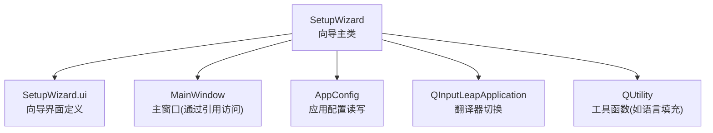
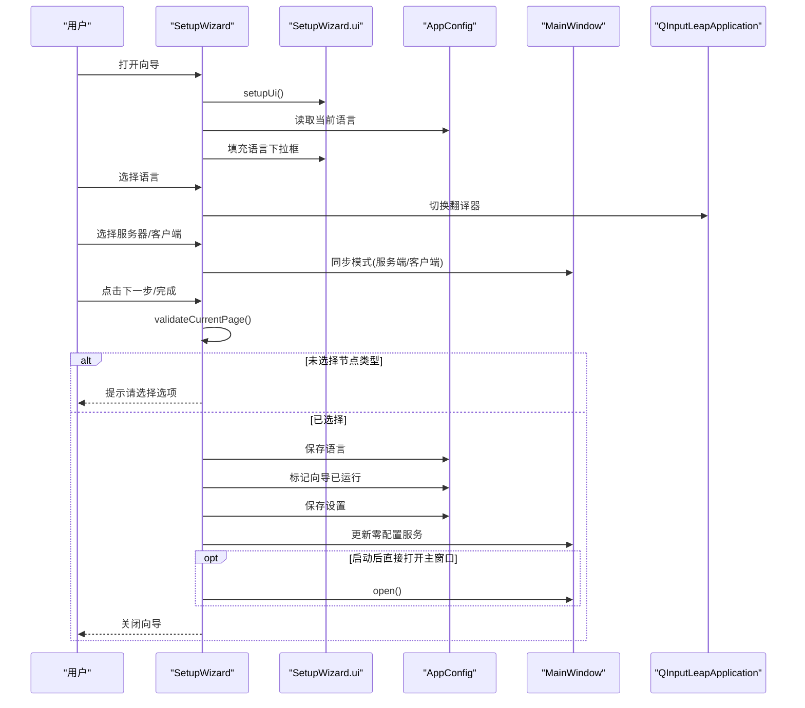
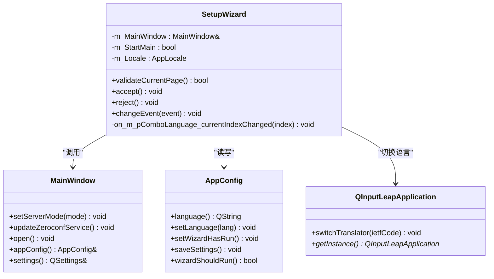
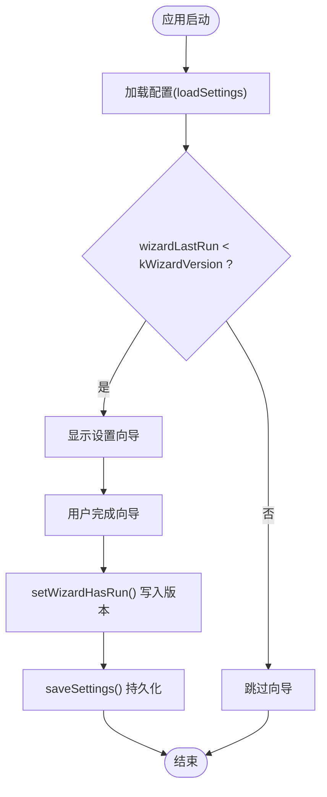
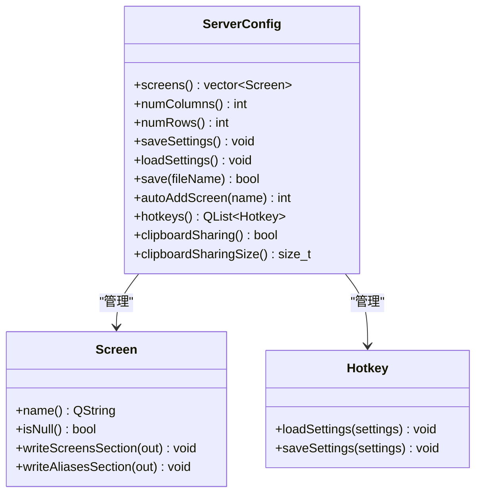
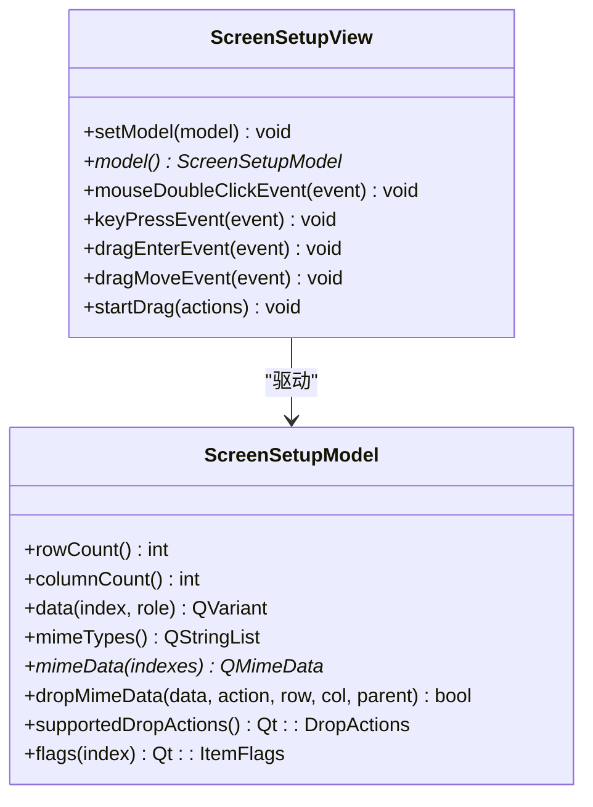
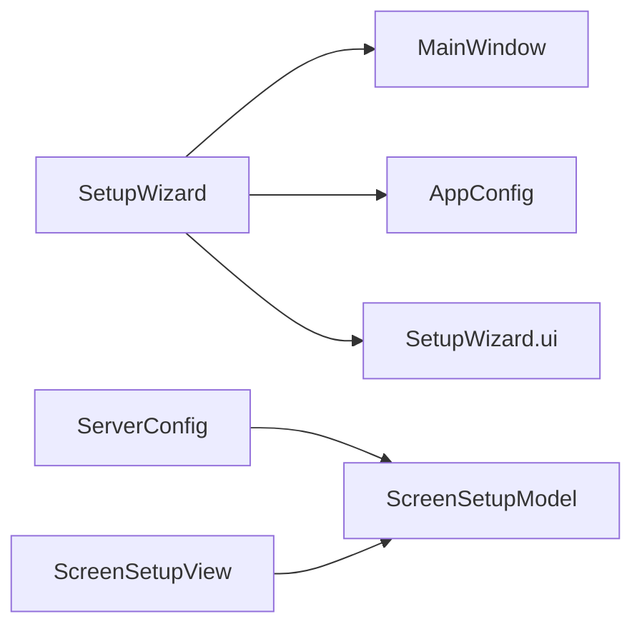

# 设置向导

<cite>
**本文引用的文件**   
- [SetupWizard.h](file://src/gui/src/SetupWizard.h)
- [SetupWizard.cpp](file://src/gui/src/SetupWizard.cpp)
- [SetupWizard.ui](file://src/gui/src/SetupWizard.ui)
- [AppConfig.h](file://src/gui/src/AppConfig.h)
- [AppConfig.cpp](file://src/gui/src/AppConfig.cpp)
- [ServerConfig.h](file://src/gui/src/ServerConfig.h)
- [ServerConfig.cpp](file://src/gui/src/ServerConfig.cpp)
- [ScreenSetupModel.h](file://src/gui/src/ScreenSetupModel.h)
- [ScreenSetupView.h](file://src/gui/src/ScreenSetupView.h)
</cite>

## 目录
1. [简介](#简介)
2. [项目结构](#项目结构)
3. [核心组件](#核心组件)
4. [架构总览](#架构总览)
5. [详细组件分析](#详细组件分析)
6. [依赖关系分析](#依赖关系分析)
7. [性能与可用性考虑](#性能与可用性考虑)
8. [故障排查指南](#故障排查指南)
9. [结论](#结论)
10. [附录：扩展与自定义开发指南](#附录扩展与自定义开发指南)

## 简介
本文件面向 Input Leap GUI 中的“设置向导”组件，系统性说明其多步骤流程、页面导航逻辑、用户引导机制，以及与服务器配置、客户端连接、屏幕布局等配置的关联。文档还覆盖数据验证、错误提示、配置预览、状态持久化、中断恢复、批量导入导出能力，以及向导扩展方法与自定义配置页面的开发指南。

## 项目结构
设置向导位于 GUI 模块中，基于 Qt 的 QWizard 实现，包含欢迎页与节点角色选择页（服务器/客户端）。向导完成后将语言设置写入应用配置，并记录向导已运行版本，以便后续启动时决定是否再次显示向导。

图表来源
- [SetupWizard.h:32-58](file://src/gui/src/SetupWizard.h#L32-L58)
- [SetupWizard.cpp:26-58](file://src/gui/src/SetupWizard.cpp#L26-L58)
- [SetupWizard.ui:28-236](file://src/gui/src/SetupWizard.ui#L28-L236)
- [AppConfig.h:51-144](file://src/gui/src/AppConfig.h#L51-L144)
- [AppConfig.cpp:141-191](file://src/gui/src/AppConfig.cpp#L141-L191)

章节来源
- [SetupWizard.h:32-58](file://src/gui/src/SetupWizard.h#L32-L58)
- [SetupWizard.cpp:26-58](file://src/gui/src/SetupWizard.cpp#L26-L58)
- [SetupWizard.ui:28-236](file://src/gui/src/SetupWizard.ui#L28-L236)
- [AppConfig.h:51-144](file://src/gui/src/AppConfig.h#L51-L144)
- [AppConfig.cpp:141-191](file://src/gui/src/AppConfig.cpp#L141-L191)

## 核心组件
- 向导主类 SetupWizard：继承自 QWizard，负责页面校验、接受/拒绝处理、语言切换、模式选择联动等。
- 应用配置 AppConfig：提供向导版本控制、语言设置、是否已运行过向导的判断与持久化。
- 服务器配置 ServerConfig：管理屏幕网格、链接、热键、剪贴板共享等，支持保存为配置文件。
- 屏幕布局模型与视图 ScreenSetupModel / ScreenSetupView：用于可视化编辑屏幕网格与拖拽操作。

章节来源
- [SetupWizard.h:32-58](file://src/gui/src/SetupWizard.h#L32-L58)
- [SetupWizard.cpp:62-151](file://src/gui/src/SetupWizard.cpp#L62-L151)
- [AppConfig.h:51-144](file://src/gui/src/AppConfig.h#L51-L144)
- [AppConfig.cpp:141-191](file://src/gui/src/AppConfig.cpp#L141-L191)
- [ServerConfig.h:34-141](file://src/gui/src/ServerConfig.h#L34-L141)
- [ServerConfig.cpp:102-195](file://src/gui/src/ServerConfig.cpp#L102-L195)
- [ScreenSetupModel.h:31-66](file://src/gui/src/ScreenSetupModel.h#L31-L66)
- [ScreenSetupView.h:32-60](file://src/gui/src/ScreenSetupView.h#L32-L60)

## 架构总览
下图展示向导与相关组件的交互关系：向导在“欢迎页”加载语言列表并绑定事件；在“节点选择页”校验用户选择；接受时将语言写入 AppConfig 并标记向导已运行，同时根据选择更新主窗口的服务器/客户端模式；若需要则打开主窗口并刷新零配置服务。

图表来源
- [SetupWizard.cpp:56-58](file://src/gui/src/SetupWizard.cpp#L56-L58)
- [SetupWizard.cpp:62-82](file://src/gui/src/SetupWizard.cpp#L62-L82)
- [SetupWizard.cpp:104-132](file://src/gui/src/SetupWizard.cpp#L104-L132)
- [SetupWizard.cpp:146-150](file://src/gui/src/SetupWizard.cpp#L146-L150)
- [AppConfig.cpp:168-191](file://src/gui/src/AppConfig.cpp#L168-L191)

## 详细组件分析

### 向导主类 SetupWizard
- 生命周期与初始化
  - 构造时加载界面、平台尺寸适配、连接单选按钮到主窗口模式切换、填充语言下拉框并设置默认语言。
- 页面校验
  - 重写 validateCurrentPage()，对“节点选择页”进行必填校验，未选择服务器或客户端时弹出信息提示并阻止前进。
- 接受/拒绝处理
  - accept() 中保存语言、标记向导已运行、保存设置，并根据选择更新主窗口模式；若允许启动后直接进入主窗口，则刷新零配置服务并打开主窗口。
  - reject() 中确保语言切换生效，必要时打开主窗口。
- 语言切换
  - 监听语言下拉框变化，实时切换应用翻译器。

图表来源
- [SetupWizard.h:32-58](file://src/gui/src/SetupWizard.h#L32-L58)
- [SetupWizard.cpp:26-58](file://src/gui/src/SetupWizard.cpp#L26-L58)
- [SetupWizard.cpp:62-82](file://src/gui/src/SetupWizard.cpp#L62-L82)
- [SetupWizard.cpp:104-132](file://src/gui/src/SetupWizard.cpp#L104-L132)
- [SetupWizard.cpp:146-150](file://src/gui/src/SetupWizard.cpp#L146-L150)
- [AppConfig.h:51-144](file://src/gui/src/AppConfig.h#L51-L144)
- [AppConfig.cpp:168-191](file://src/gui/src/AppConfig.cpp#L168-L191)

章节来源
- [SetupWizard.h:32-58](file://src/gui/src/SetupWizard.h#L32-L58)
- [SetupWizard.cpp:26-58](file://src/gui/src/SetupWizard.cpp#L26-L58)
- [SetupWizard.cpp:62-82](file://src/gui/src/SetupWizard.cpp#L62-L82)
- [SetupWizard.cpp:104-132](file://src/gui/src/SetupWizard.cpp#L104-L132)
- [SetupWizard.cpp:146-150](file://src/gui/src/SetupWizard.cpp#L146-L150)

### 应用配置 AppConfig（向导状态持久化）
- 向导版本控制
  - kWizardVersion 常量用于判断是否需要再次显示向导；当上次运行版本小于当前版本时，向导应再次出现。
- 语言设置
  - language()/setLanguage() 配合 saveSettings()/loadSettings() 持久化语言。
- 向导已运行标记
  - setWizardHasRun() 将向导版本写回设置，避免重复引导。
- 其他相关开关
  - autoConfig、autoStart、minimizeToTray 等由设置对话框维护，但向导会参与语言与首次运行流程。

图表来源
- [AppConfig.h:41-41](file://src/gui/src/AppConfig.h#L41-L41)
- [AppConfig.cpp:133-133](file://src/gui/src/AppConfig.cpp#L133-L133)
- [AppConfig.cpp:141-191](file://src/gui/src/AppConfig.cpp#L141-L191)
- [SetupWizard.cpp:104-132](file://src/gui/src/SetupWizard.cpp#L104-L132)

章节来源
- [AppConfig.h:41-41](file://src/gui/src/AppConfig.h#L41-L41)
- [AppConfig.cpp:133-133](file://src/gui/src/AppConfig.cpp#L133-L133)
- [AppConfig.cpp:141-191](file://src/gui/src/AppConfig.cpp#L141-L191)
- [SetupWizard.cpp:104-132](file://src/gui/src/SetupWizard.cpp#L104-L132)

### 服务器配置 ServerConfig（屏幕布局与链接）
- 屏幕网格
  - 以列数与行数构建二维网格，每个单元格对应一个 Screen；空名称表示未使用。
- 自动添加客户端
  - autoAddScreen() 根据已有服务器位置与方向偏好，尝试在相邻空位放置新客户端；若无合适位置则放入首个空位。
- 配置持久化与导出
  - saveSettings()/loadSettings() 读写内部配置；operator<< 重载可将 screens/aliases/links/options 等节输出为文本配置。
- 剪贴板与热键
  - 支持剪贴板共享大小、开关及热键集合的持久化。

图表来源
- [ServerConfig.h:34-141](file://src/gui/src/ServerConfig.h#L34-L141)
- [ServerConfig.cpp:102-195](file://src/gui/src/ServerConfig.cpp#L102-L195)
- [ServerConfig.cpp:215-288](file://src/gui/src/ServerConfig.cpp#L215-L288)
- [ServerConfig.cpp:302-367](file://src/gui/src/ServerConfig.cpp#L302-L367)

章节来源
- [ServerConfig.h:34-141](file://src/gui/src/ServerConfig.h#L34-L141)
- [ServerConfig.cpp:102-195](file://src/gui/src/ServerConfig.cpp#L102-L195)
- [ServerConfig.cpp:215-288](file://src/gui/src/ServerConfig.cpp#L215-L288)
- [ServerConfig.cpp:302-367](file://src/gui/src/ServerConfig.cpp#L302-L367)

### 屏幕布局模型与视图（拖拽与交互）
- ScreenSetupModel
  - 基于 QAbstractTableModel 提供二维表格数据，支持 MIME 类型与拖放操作，用于移动屏幕图标。
- ScreenSetupView
  - 基于 QTableView 增强双击、键盘、拖拽进入/移动、开始拖拽等行为，提升布局编辑体验。

图表来源
- [ScreenSetupModel.h:31-66](file://src/gui/src/ScreenSetupModel.h#L31-L66)
- [ScreenSetupView.h:32-60](file://src/gui/src/ScreenSetupView.h#L32-L60)

章节来源
- [ScreenSetupModel.h:31-66](file://src/gui/src/ScreenSetupModel.h#L31-L66)
- [ScreenSetupView.h:32-60](file://src/gui/src/ScreenSetupView.h#L32-L60)

## 依赖关系分析
- 组件耦合
  - SetupWizard 与 MainWindow 强耦合（通过引用），用于模式切换与窗口控制。
  - SetupWizard 与 AppConfig 松耦合（通过接口方法），仅读写必要字段。
  - ServerConfig 独立于向导，主要服务于服务器配置与屏幕布局。
- 外部依赖
  - Qt 框架：QWizard、QSettings、QMessageBox、QComboBox 等。
  - 本地化：AppLocale 与 QInputLeapApplication 的翻译器切换。

图表来源
- [SetupWizard.h:32-58](file://src/gui/src/SetupWizard.h#L32-L58)
- [SetupWizard.cpp:26-58](file://src/gui/src/SetupWizard.cpp#L26-L58)
- [ServerConfig.h:34-141](file://src/gui/src/ServerConfig.h#L34-L141)
- [ScreenSetupModel.h:31-66](file://src/gui/src/ScreenSetupModel.h#L31-L66)
- [ScreenSetupView.h:32-60](file://src/gui/src/ScreenSetupView.h#L32-L60)

章节来源
- [SetupWizard.h:32-58](file://src/gui/src/SetupWizard.h#L32-L58)
- [SetupWizard.cpp:26-58](file://src/gui/src/SetupWizard.cpp#L26-L58)
- [ServerConfig.h:34-141](file://src/gui/src/ServerConfig.h#L34-L141)
- [ScreenSetupModel.h:31-66](file://src/gui/src/ScreenSetupModel.h#L31-L66)
- [ScreenSetupView.h:32-60](file://src/gui/src/ScreenSetupView.h#L32-L60)

## 性能与可用性考虑
- 向导页面数量与复杂度
  - 当前向导仅含欢迎页与节点选择页，轻量高效；如需新增复杂页面，建议异步加载与懒渲染。
- 语言切换
  - 切换翻译器为即时操作，注意避免频繁触发导致 UI 抖动；当前实现通过 blockSignals 保护组合框信号。
- 配置持久化
  - 仅在向导接受时写入一次，减少 I/O 开销；ServerConfig 的保存策略也遵循变更触发保存。

[本节为通用指导，不直接分析具体文件]

## 故障排查指南
- 向导无法前进
  - 检查“节点选择页”是否选择了服务器或客户端；未选择时会弹出提示信息并阻止前进。
- 语言未生效
  - 确认语言下拉框的 currentIndexChanged 信号已连接到翻译器切换；检查 AppConfig.language 是否正确保存与读取。
- 向导反复出现
  - 检查 AppConfig.wizardShouldRun() 与 wizardLastRun 值；确认 setWizardHasRun() 与 saveSettings() 是否被调用。
- 服务器/客户端模式不同步
  - 检查单选按钮 toggled 信号是否正确映射到 MainWindow.setServerMode()。

章节来源
- [SetupWizard.cpp:62-82](file://src/gui/src/SetupWizard.cpp#L62-L82)
- [SetupWizard.cpp:146-150](file://src/gui/src/SetupWizard.cpp#L146-L150)
- [AppConfig.cpp:133-133](file://src/gui/src/AppConfig.cpp#L133-L133)
- [SetupWizard.cpp:104-132](file://src/gui/src/SetupWizard.cpp#L104-L132)

## 结论
设置向导以最小可用原则提供初始引导，涵盖语言选择与服务器/客户端角色选择，并通过 AppConfig 实现向导状态持久化与版本控制。服务器配置与屏幕布局由独立的 ServerConfig 与模型/视图组件管理，便于扩展与维护。整体设计清晰、职责分离良好，适合进一步扩展更多配置步骤与高级功能。

[本节为总结性内容，不直接分析具体文件]

## 附录：扩展与自定义开发指南

### 新增向导步骤
- 在 SetupWizard.ui 中添加新的 QWizardPage，并在向导中注册该页面。
- 在 validateCurrentPage() 中为该页面增加输入校验逻辑，必要时使用 QMessageBox 提示错误。
- 在 accept() 中将新页面数据写入 AppConfig 或 ServerConfig，并调用 saveSettings()。

章节来源
- [SetupWizard.cpp:62-82](file://src/gui/src/SetupWizard.cpp#L62-L82)
- [SetupWizard.cpp:104-132](file://src/gui/src/SetupWizard.cpp#L104-L132)
- [AppConfig.cpp:168-191](file://src/gui/src/AppConfig.cpp#L168-L191)

### 向导状态与版本管理
- 如需引入破坏性变更或新增必须引导的步骤，递增 kWizardVersion 并在注释中描述变更。
- 确保 setWizardHasRun() 与 saveSettings() 在向导最终接受时执行。

章节来源
- [AppConfig.h:41-41](file://src/gui/src/AppConfig.h#L41-L41)
- [AppConfig.cpp:133-133](file://src/gui/src/AppConfig.cpp#L133-L133)
- [AppConfig.cpp:168-191](file://src/gui/src/AppConfig.cpp#L168-L191)

### 配置预览与批量导入导出
- 配置预览
  - 可复用 ServerConfig 的 operator<< 输出能力，将当前配置序列化为文本，供用户在向导中预览。
- 批量导入
  - 解析外部配置文件，填充 ServerConfig 的 screens/aliases/links/options 等节，再调用 saveSettings() 持久化。
- 批量导出
  - 通过 save(fileName) 或 save(QFile&) 将当前配置导出为文本文件。

章节来源
- [ServerConfig.cpp:215-288](file://src/gui/src/ServerConfig.cpp#L215-L288)
- [ServerConfig.cpp:68-84](file://src/gui/src/ServerConfig.cpp#L68-L84)

### 自定义配置页面开发要点
- 数据绑定
  - 使用信号槽将 UI 控件与 AppConfig/ServerConfig 的属性双向绑定，避免手动同步。
- 错误提示
  - 在 validateCurrentPage() 中集中校验，统一使用 QMessageBox 提示，保持用户体验一致。
- 国际化
  - 为新页面文本提供翻译条目，并在 changeEvent 中处理语言切换时的重翻译。

章节来源
- [SetupWizard.cpp:84-102](file://src/gui/src/SetupWizard.cpp#L84-L102)
- [SetupWizard.cpp:62-82](file://src/gui/src/SetupWizard.cpp#L62-L82)