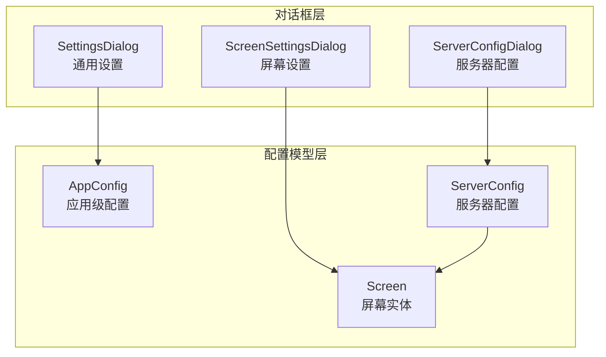
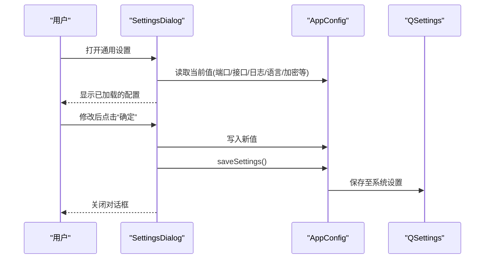
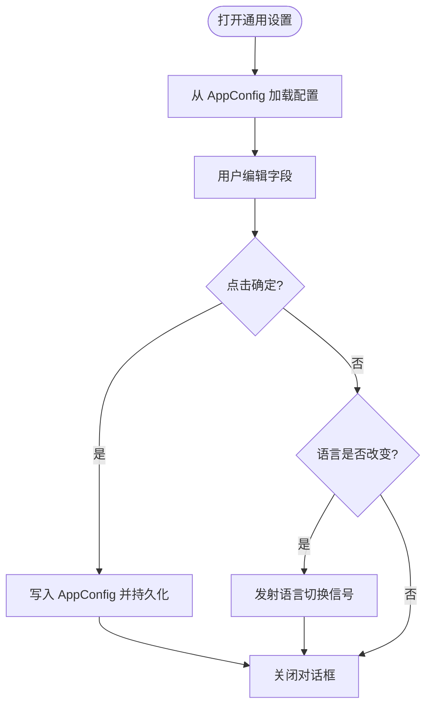
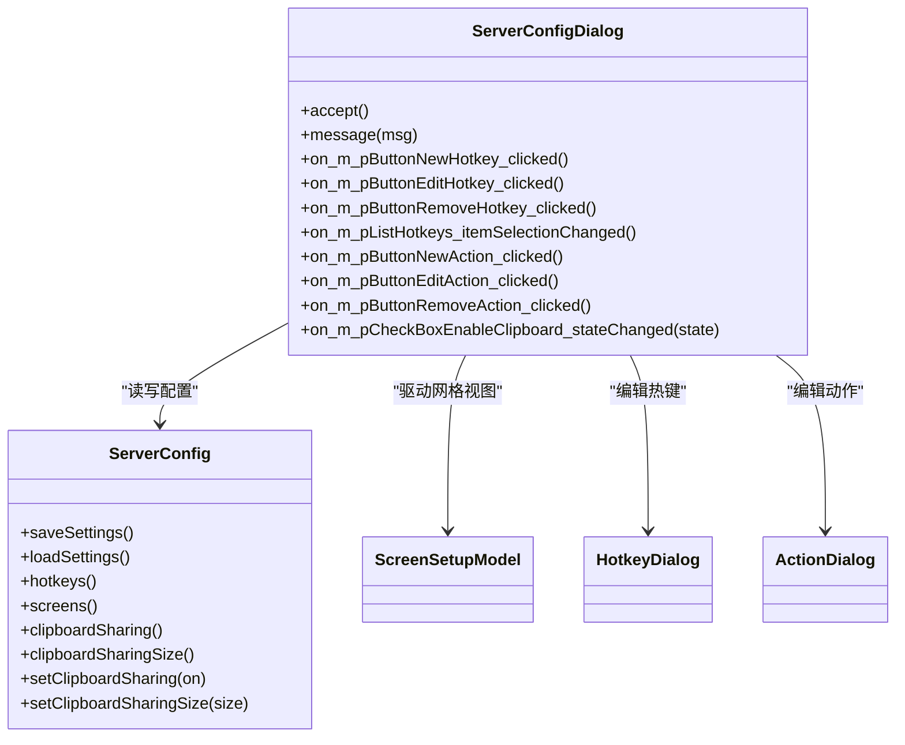
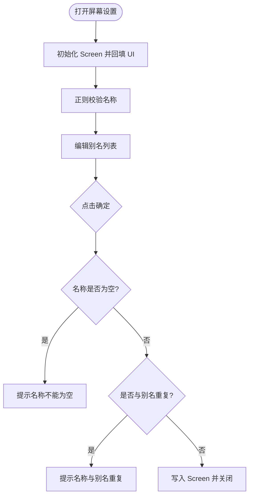
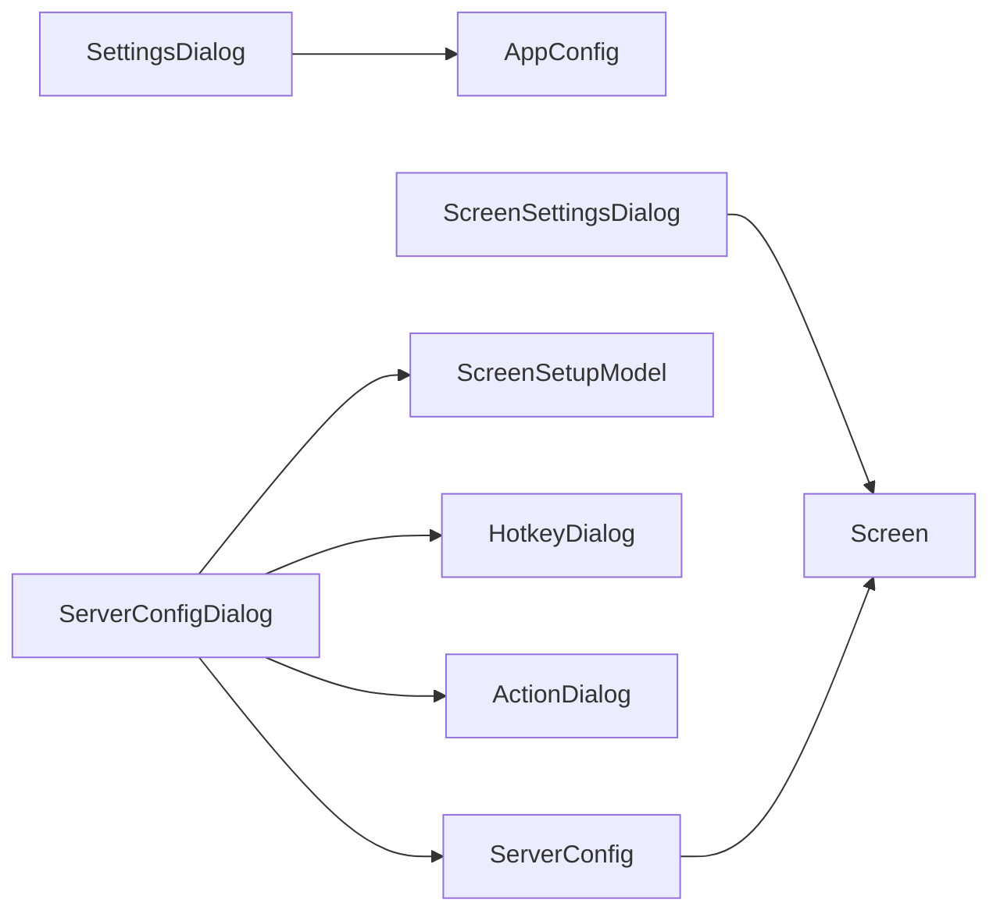

# 设置对话框

<cite>
**本文引用的文件**   
- [SettingsDialog.cpp](file://src/gui/src/SettingsDialog.cpp)
- [SettingsDialog.h](file://src/gui/src/SettingsDialog.h)
- [ServerConfigDialog.cpp](file://src/gui/src/ServerConfigDialog.cpp)
- [ServerConfigDialog.h](file://src/gui/src/ServerConfigDialog.h)
- [ScreenSettingsDialog.cpp](file://src/gui/src/ScreenSettingsDialog.cpp)
- [ScreenSettingsDialog.h](file://src/gui/src/ScreenSettingsDialog.h)
- [AppConfig.cpp](file://src/gui/src/AppConfig.cpp)
- [AppConfig.h](file://src/gui/src/AppConfig.h)
- [ServerConfig.cpp](file://src/gui/src/ServerConfig.cpp)
- [ServerConfig.h](file://src/gui/src/ServerConfig.h)
- [Screen.cpp](file://src/gui/src/Screen.cpp)
- [Screen.h](file://src/gui/src/Screen.h)
</cite>

## 目录
1. [简介](#简介)
2. [项目结构](#项目结构)
3. [核心组件](#核心组件)
4. [架构总览](#架构总览)
5. [详细组件分析](#详细组件分析)
6. [依赖关系分析](#依赖关系分析)
7. [性能与交互特性](#性能与交互特性)
8. [故障排查指南](#故障排查指南)
9. [结论](#结论)
10. [附录：扩展与自定义指南](#附录扩展与自定义指南)

## 简介
本文件聚焦于 Input Leap GUI 中的“设置对话框”相关组件，覆盖通用设置、服务器配置、屏幕（客户端）设置三类对话框的界面设计、表单验证、用户输入处理、数据绑定与持久化同步机制。同时提供样式定制、主题支持、响应式布局建议，以及扩展方法与自定义设置面板的开发指南。

## 项目结构
与设置对话框直接相关的代码位于 src/gui/src 目录下，采用 Qt 的 UI 分离模式（.ui + .cpp/.h），并通过 AppConfig / ServerConfig / Screen 等模型类完成数据绑定与持久化。

图表来源
- [SettingsDialog.cpp:33-76](file://src/gui/src/SettingsDialog.cpp#L33-L76)
- [ServerConfigDialog.cpp:30-75](file://src/gui/src/ServerConfigDialog.cpp#L30-L75)
- [ScreenSettingsDialog.cpp:50-91](file://src/gui/src/ScreenSettingsDialog.cpp#L50-L91)
- [AppConfig.cpp:50-69](file://src/gui/src/AppConfig.cpp#L50-L69)
- [ServerConfig.cpp:45-61](file://src/gui/src/ServerConfig.cpp#L45-L61)
- [Screen.cpp:24-37](file://src/gui/src/Screen.cpp#L24-L37)

章节来源
- [SettingsDialog.cpp:33-76](file://src/gui/src/SettingsDialog.cpp#L33-L76)
- [ServerConfigDialog.cpp:30-75](file://src/gui/src/ServerConfigDialog.cpp#L30-L75)
- [ScreenSettingsDialog.cpp:50-91](file://src/gui/src/ScreenSettingsDialog.cpp#L50-L91)
- [AppConfig.cpp:50-69](file://src/gui/src/AppConfig.cpp#L50-L69)
- [ServerConfig.cpp:45-61](file://src/gui/src/ServerConfig.cpp#L45-L61)
- [Screen.cpp:24-37](file://src/gui/src/Screen.cpp#L24-L37)

## 核心组件
- SettingsDialog：负责通用设置（语言、端口、网络接口、日志级别与输出、加密开关、自动隐藏/启动/最小化到托盘、Windows 提升模式等）。
- ServerConfigDialog：负责服务器端全局选项（心跳、相对鼠标移动、屏保同步、Win32 前台保持、切换延迟/双击切换、四角切换阈值、忽略自动配置客户端、拖放、剪贴板共享及大小限制）、屏幕网格布局、热键与动作管理。
- ScreenSettingsDialog：负责单个屏幕（客户端）的设置（名称与别名、修饰键映射、四角切换、修复项如 CapsLock/NumLock/ScrollLock/XTest/保留焦点等）。
- AppConfig / ServerConfig / Screen：分别承载应用级、服务器级、屏幕级的配置数据，并提供 QSettings 持久化读写。

章节来源
- [SettingsDialog.h:32-55](file://src/gui/src/SettingsDialog.h#L32-L55)
- [ServerConfigDialog.h:32-67](file://src/gui/src/ServerConfigDialog.h#L32-L67)
- [ScreenSettingsDialog.h:33-53](file://src/gui/src/ScreenSettingsDialog.h#L33-L53)
- [AppConfig.h:51-144](file://src/gui/src/AppConfig.h#L51-L144)
- [ServerConfig.h:34-131](file://src/gui/src/ServerConfig.h#L34-L131)
- [Screen.h:33-100](file://src/gui/src/Screen.h#L33-L100)

## 架构总览
设置对话框通过 Qt 信号槽将 UI 控件状态与配置模型进行双向绑定；在“接受”时统一写入模型并持久化；在“拒绝”或语言切换时触发必要的运行时更新。

图表来源
- [SettingsDialog.cpp:78-95](file://src/gui/src/SettingsDialog.cpp#L78-L95)
- [AppConfig.cpp:168-191](file://src/gui/src/AppConfig.cpp#L168-L191)

章节来源
- [SettingsDialog.cpp:78-95](file://src/gui/src/SettingsDialog.cpp#L78-L95)
- [AppConfig.cpp:168-191](file://src/gui/src/AppConfig.cpp#L168-L191)

## 详细组件分析

### 通用设置对话框（SettingsDialog）
- 界面与功能
  - 语言选择：下拉框填充多语言列表，选择后立即发出语言变更请求，由上层应用重载翻译。
  - 基本运行参数：屏幕名、端口、网络接口。
  - 日志：级别、是否输出到文件、日志文件名（可浏览选择）。
  - 安全：启用加密、是否要求客户端证书。
  - 行为：自动隐藏、开机自启、最小化到托盘。
  - Windows 专属：进程提升模式。
- 数据绑定与实时更新
  - 构造时从 AppConfig 读取各项值并回填 UI。
  - “确定”时将所有 UI 值写回 AppConfig 并调用 saveSettings() 持久化。
  - 语言切换：reject 时若语言变化则发射 requestLanguageChange 信号，供主窗口切换语言。
- 表单验证与交互
  - 日志文件路径通过文件对话框获取，无额外校验逻辑。
  - 平台差异：非 Windows 下隐藏提升相关控件。
- 关键流程
  - 接受：集中写入配置并持久化。
  - 拒绝：检测语言是否改变，必要时触发语言切换。

图表来源
- [SettingsDialog.cpp:33-76](file://src/gui/src/SettingsDialog.cpp#L33-L76)
- [SettingsDialog.cpp:78-103](file://src/gui/src/SettingsDialog.cpp#L78-L103)
- [SettingsDialog.cpp:129-152](file://src/gui/src/SettingsDialog.cpp#L129-L152)

章节来源
- [SettingsDialog.cpp:33-76](file://src/gui/src/SettingsDialog.cpp#L33-L76)
- [SettingsDialog.cpp:78-103](file://src/gui/src/SettingsDialog.cpp#L78-L103)
- [SettingsDialog.cpp:129-152](file://src/gui/src/SettingsDialog.cpp#L129-L152)
- [SettingsDialog.h:32-55](file://src/gui/src/SettingsDialog.h#L32-L55)
- [AppConfig.cpp:141-191](file://src/gui/src/AppConfig.cpp#L141-L191)

### 服务器配置对话框（ServerConfigDialog）
- 界面与功能
  - 全局选项：心跳、相对鼠标移动、屏保同步、Win32 前台保持、切换延迟/双击切换、四角切换阈值、忽略自动配置客户端、拖放、剪贴板共享及大小限制。
  - 屏幕网格：基于 ScreenSetupModel 展示与编辑屏幕布局。
  - 热键与动作：新增/编辑/删除热键，为每个热键添加/编辑/删除动作。
- 数据绑定与实时更新
  - 构造时将 ServerConfig 的值回填到 UI。
  - 接受时一次性将 UI 值写回 ServerConfig，并将副本拷贝回原始引用，确保主窗口持有最新配置。
  - 剪贴板大小限制随“启用剪贴板”复选框动态启用/禁用。
- 表单验证与交互
  - 热键/动作列表联动：选中项控制编辑/删除按钮可用状态。
  - 列表项删除后存在索引越界保护逻辑，避免异常。
- 关键流程
  - 接受：批量更新 ServerConfig 并持久化（由 ServerConfig.saveSettings 负责）。
  - 热键/动作：通过子对话框（HotkeyDialog/ActionDialog）编辑，完成后刷新列表文本。

图表来源
- [ServerConfigDialog.h:32-67](file://src/gui/src/ServerConfigDialog.h#L32-L67)
- [ServerConfigDialog.cpp:77-111](file://src/gui/src/ServerConfigDialog.cpp#L77-L111)
- [ServerConfigDialog.cpp:113-226](file://src/gui/src/ServerConfigDialog.cpp#L113-L226)
- [ServerConfig.cpp:102-195](file://src/gui/src/ServerConfig.cpp#L102-L195)

章节来源
- [ServerConfigDialog.cpp:30-75](file://src/gui/src/ServerConfigDialog.cpp#L30-L75)
- [ServerConfigDialog.cpp:77-111](file://src/gui/src/ServerConfigDialog.cpp#L77-L111)
- [ServerConfigDialog.cpp:113-226](file://src/gui/src/ServerConfigDialog.cpp#L113-L226)
- [ServerConfigDialog.h:32-67](file://src/gui/src/ServerConfigDialog.h#L32-L67)
- [ServerConfig.cpp:102-195](file://src/gui/src/ServerConfig.cpp#L102-L195)

### 屏幕设置对话框（ScreenSettingsDialog）
- 界面与功能
  - 屏幕名称与别名：名称必填且需符合正则规则；别名列表可增删，不允许与名称重复。
  - 修饰键映射：Shift/Ctrl/Alt/Meta/Super 映射到目标修饰键。
  - 四角切换：四个角落开关与阈值。
  - 修复项：CapsLock/NumLock/ScrollLock/XTest/保留焦点。
- 表单验证与交互
  - 名称使用正则校验器，非法字符即时提示不可提交。
  - 提交前检查名称非空且不与别名冲突。
  - 别名输入框实时控制“添加”按钮可用性。
- 数据绑定与实时更新
  - 构造时初始化 Screen 并回填 UI。
  - 接受时先 init()，再批量写入 Screen 的各项属性。

图表来源
- [ScreenSettingsDialog.cpp:50-91](file://src/gui/src/ScreenSettingsDialog.cpp#L50-L91)
- [ScreenSettingsDialog.cpp:93-146](file://src/gui/src/ScreenSettingsDialog.cpp#L93-L146)
- [ScreenSettingsDialog.cpp:148-173](file://src/gui/src/ScreenSettingsDialog.cpp#L148-L173)
- [Screen.cpp:39-58](file://src/gui/src/Screen.cpp#L39-L58)

章节来源
- [ScreenSettingsDialog.cpp:50-91](file://src/gui/src/ScreenSettingsDialog.cpp#L50-L91)
- [ScreenSettingsDialog.cpp:93-146](file://src/gui/src/ScreenSettingsDialog.cpp#L93-L146)
- [ScreenSettingsDialog.cpp:148-173](file://src/gui/src/ScreenSettingsDialog.cpp#L148-L173)
- [Screen.cpp:39-58](file://src/gui/src/Screen.cpp#L39-L58)

## 依赖关系分析
- 组件耦合
  - SettingsDialog 仅依赖 AppConfig，职责单一，低耦合。
  - ServerConfigDialog 依赖 ServerConfig、ScreenSetupModel，并通过子对话框操作 Hotkey/Action。
  - ScreenSettingsDialog 依赖 Screen，专注单屏配置。
- 外部依赖
  - 所有持久化均通过 QSettings 完成。
  - 国际化通过 AppLocale 与 Qt 翻译系统协作。
- 潜在循环依赖
  - 对话框与模型之间为单向依赖，未见循环引用。

图表来源
- [SettingsDialog.cpp:33-76](file://src/gui/src/SettingsDialog.cpp#L33-L76)
- [ServerConfigDialog.cpp:30-75](file://src/gui/src/ServerConfigDialog.cpp#L30-L75)
- [ScreenSettingsDialog.cpp:50-91](file://src/gui/src/ScreenSettingsDialog.cpp#L50-L91)
- [ServerConfig.cpp:45-61](file://src/gui/src/ServerConfig.cpp#L45-L61)

章节来源
- [SettingsDialog.cpp:33-76](file://src/gui/src/SettingsDialog.cpp#L33-L76)
- [ServerConfigDialog.cpp:30-75](file://src/gui/src/ServerConfigDialog.cpp#L30-L75)
- [ScreenSettingsDialog.cpp:50-91](file://src/gui/src/ScreenSettingsDialog.cpp#L50-L91)
- [ServerConfig.cpp:45-61](file://src/gui/src/ServerConfig.cpp#L45-L61)

## 性能与交互特性
- 数据持久化
  - 通用设置与服务器配置均在“确定”时集中写入，减少频繁 I/O。
  - AppConfig::saveSettings 内部调用 QSettings::sync，确保落盘。
- 实时性
  - 语言切换通过信号触发，避免阻塞 UI。
  - 剪贴板大小限制随开关即时启用/禁用，提升体验。
- 可扩展性
  - 各对话框遵循“构造加载—用户编辑—接受写入”的统一模式，便于新增字段。

章节来源
- [AppConfig.cpp:168-191](file://src/gui/src/AppConfig.cpp#L168-L191)
- [ServerConfigDialog.cpp:223-226](file://src/gui/src/ServerConfigDialog.cpp#L223-L226)
- [SettingsDialog.cpp:149-152](file://src/gui/src/SettingsDialog.cpp#L149-L152)

## 故障排查指南
- 语言未生效
  - 确认 SettingsDialog 在 reject 时是否正确发射语言切换信号，上层是否监听并重新加载翻译。
- 日志文件无法写入
  - 检查日志路径是否有效，Windows 下注意路径包含空格时的引号包裹逻辑。
- 屏幕名称无效
  - 名称不符合正则或被别名占用会导致提交失败，请修正后再试。
- 热键/动作列表异常
  - 删除项后索引可能越界，代码中已有保护逻辑；若仍出现异常，检查列表项数量与选中行一致性。

章节来源
- [SettingsDialog.cpp:97-103](file://src/gui/src/SettingsDialog.cpp#L97-L103)
- [AppConfig.cpp:116-124](file://src/gui/src/AppConfig.cpp#L116-L124)
- [ScreenSettingsDialog.cpp:93-118](file://src/gui/src/ScreenSettingsDialog.cpp#L93-L118)
- [ServerConfigDialog.cpp:156-170](file://src/gui/src/ServerConfigDialog.cpp#L156-L170)

## 结论
三类设置对话框围绕 AppConfig/ServerConfig/Screen 三个模型展开，采用统一的“加载—编辑—持久化”模式，配合 Qt 的信号槽实现实时交互与语言切换。整体结构清晰、职责明确，易于扩展与维护。

## 附录：扩展与自定义指南
- 新增设置项
  - 在对应对话框的 UI 中添加控件，并在构造函数中从模型加载默认值。
  - 在 accept() 中将新值写回模型并持久化。
  - 如需实时生效，连接控件信号到相应处理函数。
- 表单验证
  - 使用 QRegularExpressionValidator/QRegExpValidator 对输入进行约束。
  - 在 accept() 中进行业务级校验（如唯一性、范围等），失败时给出提示并阻止关闭。
- 样式与主题
  - 通过 Qt 样式表（QSS）或平台原生主题适配控件外观。
  - 图标资源通过 Qt 资源系统统一管理，便于替换与多分辨率适配。
- 响应式布局
  - 使用 Qt 布局管理器（QVBoxLayout/QHBoxLayout/QGridLayout）自适应不同屏幕尺寸。
  - 对复杂页面可采用 QTabWidget 分栏组织，提升可读性。
- 自定义设置面板
  - 新建 QDialog 子类，复用现有模型（AppConfig/ServerConfig/Screen）进行读写。
  - 通过信号与主窗口通信，实现跨模块联动（如语言切换、服务重启提示等）。

章节来源
- [SettingsDialog.cpp:33-76](file://src/gui/src/SettingsDialog.cpp#L33-L76)
- [SettingsDialog.cpp:78-95](file://src/gui/src/SettingsDialog.cpp#L78-L95)
- [ScreenSettingsDialog.cpp:50-91](file://src/gui/src/ScreenSettingsDialog.cpp#L50-L91)
- [ServerConfigDialog.cpp:77-111](file://src/gui/src/ServerConfigDialog.cpp#L77-L111)
- [AppConfig.cpp:141-191](file://src/gui/src/AppConfig.cpp#L141-L191)
- [ServerConfig.cpp:102-195](file://src/gui/src/ServerConfig.cpp#L102-L195)