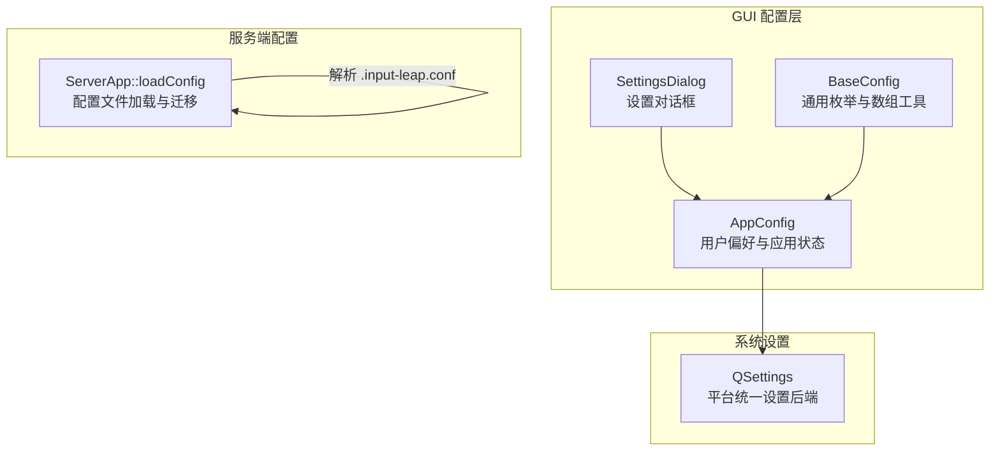
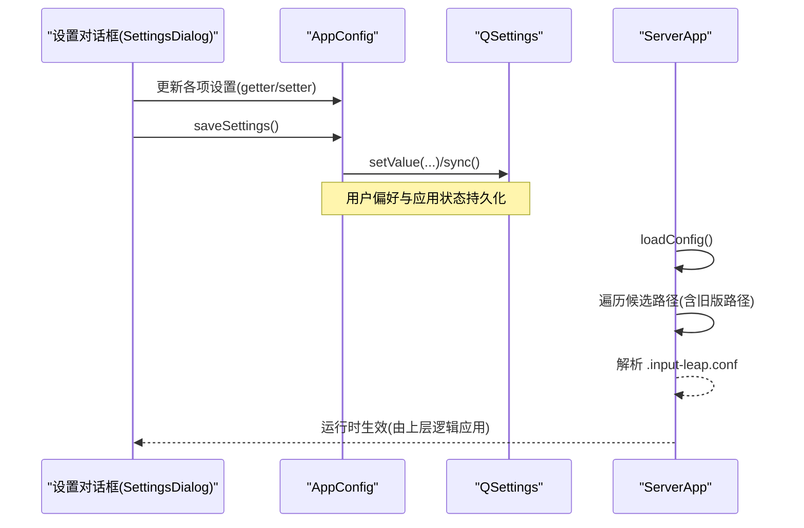
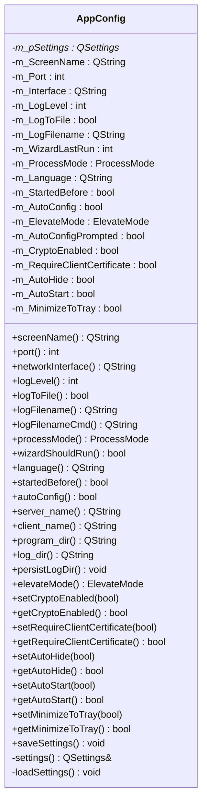
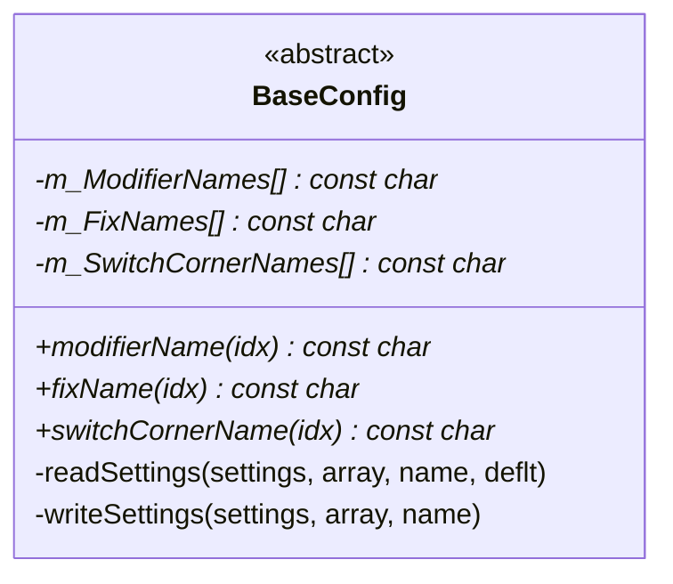
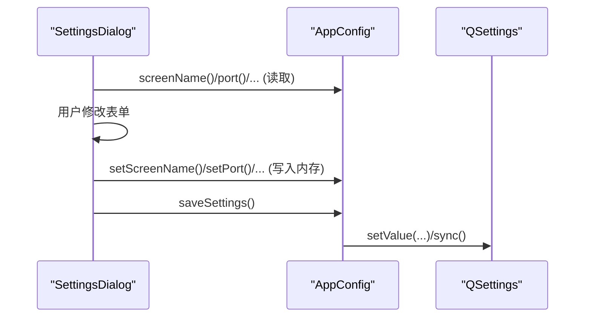
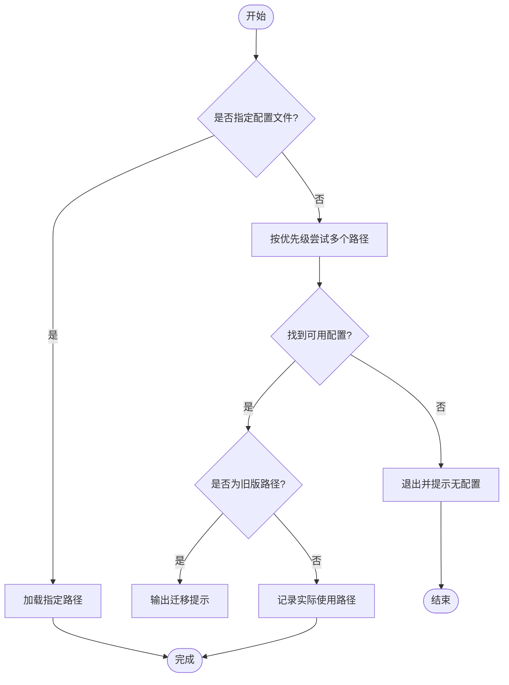
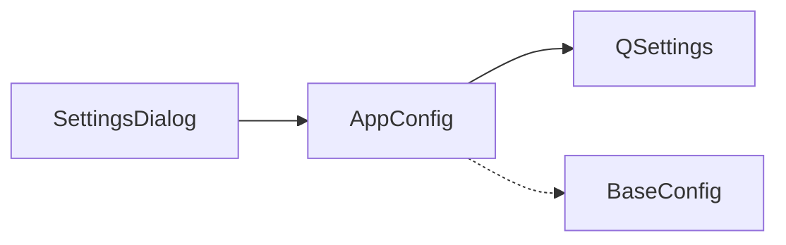

# 配置管理

<cite>
**本文引用的文件**   
- [AppConfig.h](file://src/gui/src/AppConfig.h)
- [AppConfig.cpp](file://src/gui/src/AppConfig.cpp)
- [BaseConfig.h](file://src/gui/src/BaseConfig.h)
- [BaseConfig.cpp](file://src/gui/src/BaseConfig.cpp)
- [SettingsDialog.h](file://src/gui/src/SettingsDialog.h)
- [SettingsDialog.cpp](file://src/gui/src/SettingsDialog.cpp)
- [ServerApp.cpp](file://src/lib/inputleap/ServerApp.cpp)
</cite>

## 目录
1. [简介](#简介)
2. [项目结构](#项目结构)
3. [核心组件](#核心组件)
4. [架构总览](#架构总览)
5. [详细组件分析](#详细组件分析)
6. [依赖关系分析](#依赖关系分析)
7. [性能考虑](#性能考虑)
8. [故障排查指南](#故障排查指南)
9. [结论](#结论)
10. [附录](#附录)

## 简介
本文件面向 Input Leap 的配置管理系统，聚焦 GUI 侧的用户偏好与应用状态持久化机制。文档围绕 AppConfig 与 BaseConfig 两个核心类展开，说明其配置存储机制、数据模型设计、默认值与验证策略、版本兼容处理、动态加载与热重载路径，并给出备份恢复、模板扩展与自定义配置项的开发指南。同时补充服务端配置文件加载与迁移行为，帮助读者理解端到端的配置生命周期。

## 项目结构
GUI 配置相关代码位于 src/gui/src 下，核心为：
- AppConfig：封装用户偏好与应用运行期状态的读写（基于 QSettings）
- BaseConfig：提供通用枚举与数组序列化辅助方法
- SettingsDialog：将 UI 变更同步到 AppConfig 并触发保存

图表来源
- [AppConfig.h:51-144](file://src/gui/src/AppConfig.h#L51-L144)
- [AppConfig.cpp:141-191](file://src/gui/src/AppConfig.cpp#L141-L191)
- [BaseConfig.h:25-123](file://src/gui/src/BaseConfig.h#L25-L123)
- [SettingsDialog.cpp:78-95](file://src/gui/src/SettingsDialog.cpp#L78-L95)
- [ServerApp.cpp:196-282](file://src/lib/inputleap/ServerApp.cpp#L196-L282)

章节来源
- [AppConfig.h:51-144](file://src/gui/src/AppConfig.h#L51-L144)
- [AppConfig.cpp:141-191](file://src/gui/src/AppConfig.cpp#L141-L191)
- [BaseConfig.h:25-123](file://src/gui/src/BaseConfig.h#L25-L123)
- [SettingsDialog.cpp:78-95](file://src/gui/src/SettingsDialog.cpp#L78-L95)
- [ServerApp.cpp:196-282](file://src/lib/inputleap/ServerApp.cpp#L196-L282)

## 核心组件
本节概述 AppConfig 与 BaseConfig 的职责边界与交互方式。

- AppConfig
  - 负责用户偏好与应用状态（如屏幕名、端口、日志级别、语言、自动启动等）的读取、写入与持久化
  - 通过 QSettings 访问平台统一的设置存储
  - 提供 getter/setter 与 saveSettings/loadSettings 接口
  - 维护向导版本 kWizardVersion，用于控制首次引导流程
- BaseConfig
  - 定义通用枚举（修饰键、修复项、切换角）及其名称映射
  - 提供模板化的数组读写辅助方法，便于后续扩展更多列表型配置

章节来源
- [AppConfig.h:51-144](file://src/gui/src/AppConfig.h#L51-L144)
- [AppConfig.cpp:50-69](file://src/gui/src/AppConfig.cpp#L50-L69)
- [BaseConfig.h:25-123](file://src/gui/src/BaseConfig.h#L25-L123)

## 架构总览
下图展示了 GUI 配置从 UI 到持久化的调用链，以及服务端配置文件的加载与迁移路径。

图表来源
- [SettingsDialog.cpp:78-95](file://src/gui/src/SettingsDialog.cpp#L78-L95)
- [AppConfig.cpp:168-191](file://src/gui/src/AppConfig.cpp#L168-L191)
- [ServerApp.cpp:196-282](file://src/lib/inputleap/ServerApp.cpp#L196-L282)

## 详细组件分析

### AppConfig 类分析
- 职责
  - 封装所有 GUI 相关的用户偏好与应用状态字段
  - 提供默认值、加载与保存逻辑
  - 暴露只读/可写接口供 UI 与业务模块使用
- 关键特性
  - 默认值集中初始化于构造函数与 loadSettings
  - 保存时显式写入各键并调用 sync 确保落盘
  - 向导版本常量 kWizardVersion 控制是否显示引导页
  - 跨平台差异处理（进程模式、日志目录、可执行文件名）
- 数据模型与键名
  - 屏幕名、端口、网络接口、日志级别、日志开关、日志文件路径
  - 向导最后运行版本、语言、是否已启动过
  - 自动配置开关、提权模式、自动配置提示标记
  - 加密开关、客户端证书要求、自动隐藏、开机自启、最小化到托盘
- 验证规则
  - 当前实现以默认值兜底为主，未对输入进行强校验
  - 建议对端口范围、路径合法性等进行增强校验
- 版本兼容
  - 通过 kWizardVersion 与 wizardLastRun 比较决定是否再次运行向导
  - elevateMode 同时保留布尔与整型键以兼容历史版本
- 动态加载与热重载
  - GUI 侧无监听 QSettings 变化的热重载机制；修改后需关闭并重启或重新打开设置窗口以刷新界面
  - 服务端支持在运行期重载配置文件（见 ServerApp），但 GUI 偏好不直接参与该流程

图表来源
- [AppConfig.h:51-144](file://src/gui/src/AppConfig.h#L51-L144)
- [AppConfig.cpp:141-191](file://src/gui/src/AppConfig.cpp#L141-L191)

章节来源
- [AppConfig.h:51-144](file://src/gui/src/AppConfig.h#L51-L144)
- [AppConfig.cpp:50-69](file://src/gui/src/AppConfig.cpp#L50-L69)
- [AppConfig.cpp:141-191](file://src/gui/src/AppConfig.cpp#L141-L191)
- [AppConfig.cpp:116-129](file://src/gui/src/AppConfig.cpp#L116-L129)

### BaseConfig 类分析
- 职责
  - 定义通用枚举及名称映射，便于 UI 展示与配置序列化
  - 提供模板化数组读写方法，简化 QList<T> 与 QSettings 数组的互转
- 关键特性
  - Modifier/Fix/SwitchCorner 三类枚举及其静态名称表
  - readSettings/writeSettings 模板方法，支持可变长度与固定长度两种场景
- 复杂度
  - 数组读写为 O(n)，n 为元素个数
  - 空间开销与数组规模线性相关

图表来源
- [BaseConfig.h:25-123](file://src/gui/src/BaseConfig.h#L25-L123)
- [BaseConfig.cpp:21-46](file://src/gui/src/BaseConfig.cpp#L21-L46)

章节来源
- [BaseConfig.h:25-123](file://src/gui/src/BaseConfig.h#L25-L123)
- [BaseConfig.cpp:21-46](file://src/gui/src/BaseConfig.cpp#L21-L46)

### 设置对话框与配置同步
- 入口
  - SettingsDialog 构造时从 AppConfig 读取当前值填充 UI
  - 接受时调用 AppConfig 的 setter 批量写入内存，再调用 saveSettings 持久化
- 语言切换
  - 通过信号 requestLanguageChange 通知上层，避免在对话框内直接切换全局语言
- 日志文件选择
  - 提供浏览按钮选择保存路径，启用/禁用联动

图表来源
- [SettingsDialog.cpp:33-76](file://src/gui/src/SettingsDialog.cpp#L33-L76)
- [SettingsDialog.cpp:78-95](file://src/gui/src/SettingsDialog.cpp#L78-L95)
- [AppConfig.cpp:168-191](file://src/gui/src/AppConfig.cpp#L168-L191)

章节来源
- [SettingsDialog.h:32-55](file://src/gui/src/SettingsDialog.h#L32-L55)
- [SettingsDialog.cpp:33-76](file://src/gui/src/SettingsDialog.cpp#L33-L76)
- [SettingsDialog.cpp:78-95](file://src/gui/src/SettingsDialog.cpp#L78-L95)

### 服务端配置加载与迁移
- 加载顺序
  - 若命令行指定配置文件则直接加载
  - 否则按优先级尝试：用户 profile 下的标准文件名、旧版隐藏文件名、系统配置目录
- 兼容性
  - 明确标注旧版路径并输出迁移提示
  - 成功加载后将实际使用的路径记录到参数对象中
- 错误处理
  - 无法打开文件或解析失败时记录日志并返回失败
- 热重载
  - 存在“reloaded configuration”日志点，表明运行期可重载配置（具体事件驱动逻辑在上层）

图表来源
- [ServerApp.cpp:196-282](file://src/lib/inputleap/ServerApp.cpp#L196-L282)

章节来源
- [ServerApp.cpp:196-282](file://src/lib/inputleap/ServerApp.cpp#L196-L282)

## 依赖关系分析
- 组件耦合
  - SettingsDialog 依赖 AppConfig 作为唯一配置源
  - AppConfig 依赖 QSettings 进行持久化
  - BaseConfig 被 AppConfig 复用（枚举与数组工具）
- 外部依赖
  - QSettings 抽象了平台差异（Windows 注册表、macOS plist、Linux 配置文件等）
- 潜在循环
  - 当前未见循环依赖；AppConfig 与 SettingsDialog 为单向依赖

图表来源
- [SettingsDialog.cpp:78-95](file://src/gui/src/SettingsDialog.cpp#L78-L95)
- [AppConfig.cpp:168-191](file://src/gui/src/AppConfig.cpp#L168-L191)
- [BaseConfig.h:25-123](file://src/gui/src/BaseConfig.h#L25-L123)

章节来源
- [SettingsDialog.cpp:78-95](file://src/gui/src/SettingsDialog.cpp#L78-L95)
- [AppConfig.cpp:168-191](file://src/gui/src/AppConfig.cpp#L168-L191)
- [BaseConfig.h:25-123](file://src/gui/src/BaseConfig.h#L25-L123)

## 性能考虑
- 读写频率
  - 设置保存仅在用户确认时触发，且调用一次 sync，I/O 开销可控
- 数组操作
  - BaseConfig 的数组读写为线性复杂度，适合小量配置项
- 可扩展性
  - 如需频繁热重载 GUI 偏好，可引入 QSettings 变化监听并在内存模型上增量更新，避免全量重建

[本节为通用指导，无需源码引用]

## 故障排查指南
- 常见问题
  - 修改语言后界面未立即刷新：需在顶层应用语言切换信号后再重启或重绘
  - 日志文件路径无效：检查平台默认路径与权限，必要时使用浏览按钮选择有效路径
  - 向导重复出现：检查 wizardLastRun 与 kWizardVersion 的比较逻辑
- 定位手段
  - 查看 saveSettings 写入的键名是否正确
  - 核对 SettingsDialog 的 accept 流程是否调用了 saveSettings
  - 服务端加载失败时关注日志中的路径与解析错误信息

章节来源
- [AppConfig.cpp:168-191](file://src/gui/src/AppConfig.cpp#L168-L191)
- [SettingsDialog.cpp:78-95](file://src/gui/src/SettingsDialog.cpp#L78-L95)
- [ServerApp.cpp:258-282](file://src/lib/inputleap/ServerApp.cpp#L258-L282)

## 结论
AppConfig 与 BaseConfig 构成了 Input Leap GUI 配置管理的基石：前者负责用户偏好与应用状态的持久化，后者提供通用枚举与数组工具。配合 SettingsDialog 完成人机交互与落盘，服务端则独立负责 .input-leap.conf 的加载与迁移。整体设计清晰、职责单一，具备良好的可维护性与扩展性。

[本节为总结性内容，无需源码引用]

## 附录

### 配置项清单与默认值
- 屏幕名：默认取自本地主机名
- 端口：默认 24800
- 网络接口：空表示默认
- 日志级别：默认 INFO
- 日志开关：默认关闭
- 日志文件路径：默认平台日志目录下的 input-leap.log
- 向导最后运行版本：初始 0，保存时更新为 kWizardVersion
- 语言：默认系统语言
- 是否已启动过：默认 false
- 自动配置：默认 true
- 提权模式：平台相关默认值
- 自动配置提示标记：默认 false
- 加密开关：默认 true
- 客户端证书要求：默认 false（未来版本可能调整）
- 自动隐藏：默认 false
- 开机自启：默认 false
- 最小化到托盘：默认 false

章节来源
- [AppConfig.cpp:141-166](file://src/gui/src/AppConfig.cpp#L141-L166)
- [AppConfig.cpp:168-191](file://src/gui/src/AppConfig.cpp#L168-L191)

### 配置备份与恢复
- 备份
  - GUI 偏好：导出 QSettings 所在平台的存储位置（例如 Windows 注册表项、macOS plist、Linux 配置文件）
  - 服务端配置：复制 .input-leap.conf 至安全位置
- 恢复
  - GUI 偏好：导入对应平台存储
  - 服务端配置：覆盖目标路径后重启服务或触发重载

[本节为通用指导，无需源码引用]

### 默认值管理与验证规则
- 默认值
  - 集中在 AppConfig 的 loadSettings 与构造函数初始化处
- 验证规则
  - 当前以默认值兜底为主，未做严格校验
  - 建议增加：端口范围校验、路径存在性与可写性检查、枚举值边界检查

章节来源
- [AppConfig.cpp:141-166](file://src/gui/src/AppConfig.cpp#L141-L166)

### 配置文件格式与版本兼容
- GUI 偏好
  - 使用 QSettings 键值对存储，键名为字符串，值为基本类型
- 服务端配置
  - 使用 .input-leap.conf，支持多路径查找与旧版路径兼容提示
- 版本兼容
  - GUI：kWizardVersion 控制向导显示；elevateMode 兼容旧布尔键
  - 服务端：优先新路径，其次旧路径，并输出迁移提示

章节来源
- [AppConfig.cpp:141-191](file://src/gui/src/AppConfig.cpp#L141-L191)
- [ServerApp.cpp:196-282](file://src/lib/inputleap/ServerApp.cpp#L196-L282)

### 动态加载与热重载
- GUI 偏好
  - 当前未实现 QSettings 监听；建议在需要时添加监听并在内存模型上增量更新
- 服务端配置
  - 支持运行期重载（存在“reloaded configuration”日志点）

章节来源
- [ServerApp.cpp:190-194](file://src/lib/inputleap/ServerApp.cpp#L190-L194)

### 配置模板系统与扩展方法
- 模板系统
  - 可在 GUI 侧提供预设模板（JSON/INI），在首次启动或重置时合并到 QSettings
- 自定义配置项开发指南
  - 新增字段步骤
    - 在 AppConfig 头文件中声明成员变量与 getter/setter
    - 在 loadSettings 中读取默认值与已有值
    - 在 saveSettings 中写入新键
    - 在 SettingsDialog 中添加 UI 控件并绑定到 setter/getter
  - 使用 BaseConfig 的数组工具
    - 对于列表型配置，使用 readSettings/writeSettings 模板方法进行序列化
  - 版本兼容
    - 为新字段提供合理默认值，必要时保留旧键名以平滑过渡

章节来源
- [AppConfig.h:51-144](file://src/gui/src/AppConfig.h#L51-L144)
- [AppConfig.cpp:141-191](file://src/gui/src/AppConfig.cpp#L141-L191)
- [BaseConfig.h:61-102](file://src/gui/src/BaseConfig.h#L61-L102)
- [SettingsDialog.cpp:78-95](file://src/gui/src/SettingsDialog.cpp#L78-L95)