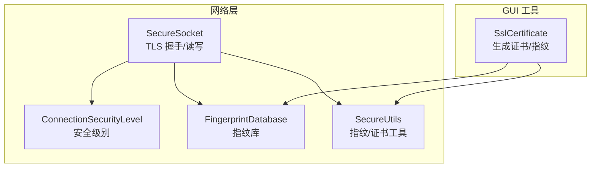
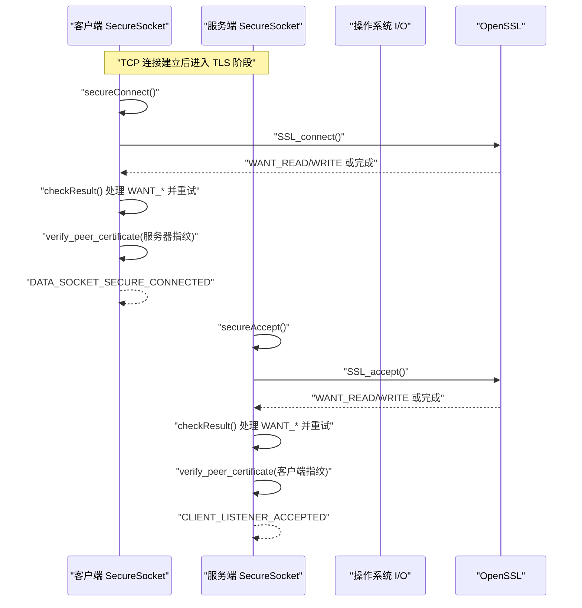
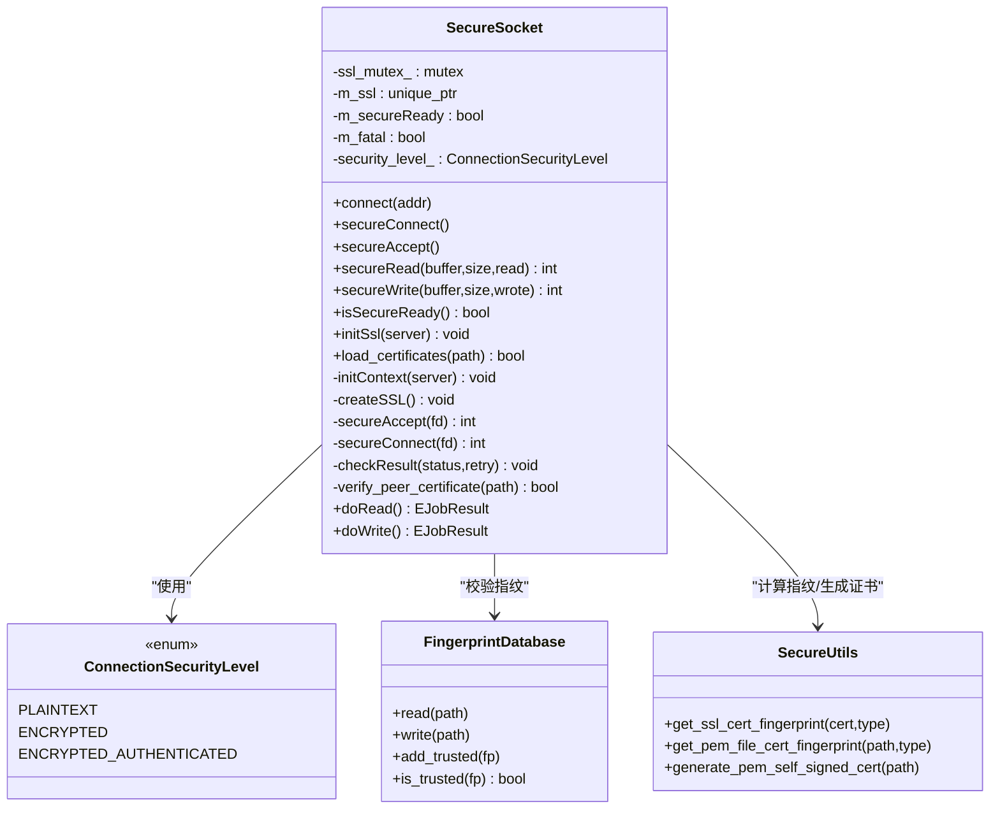
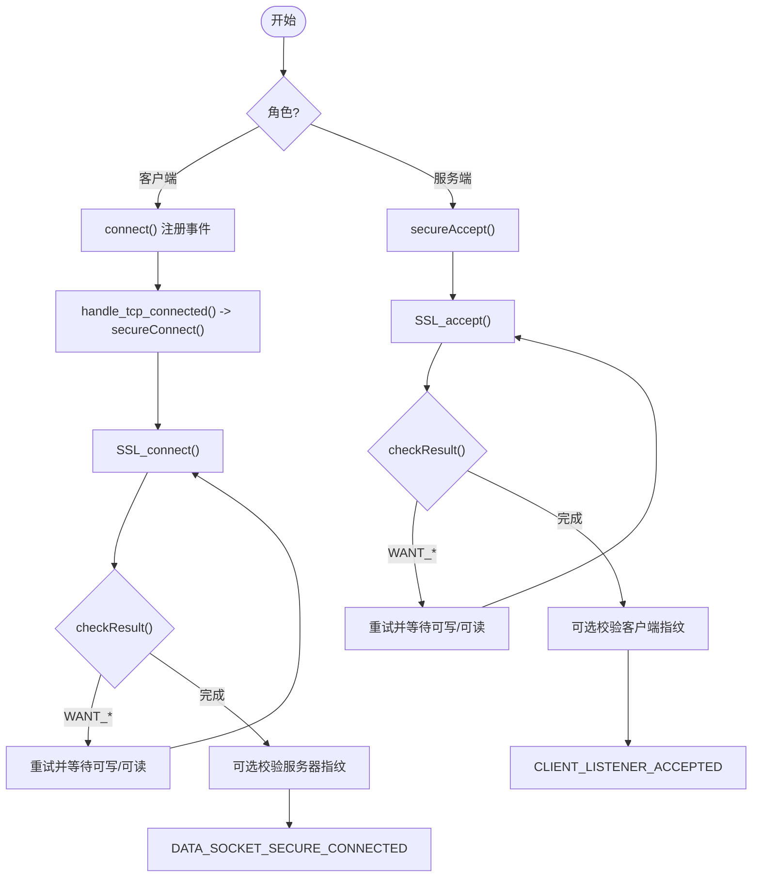
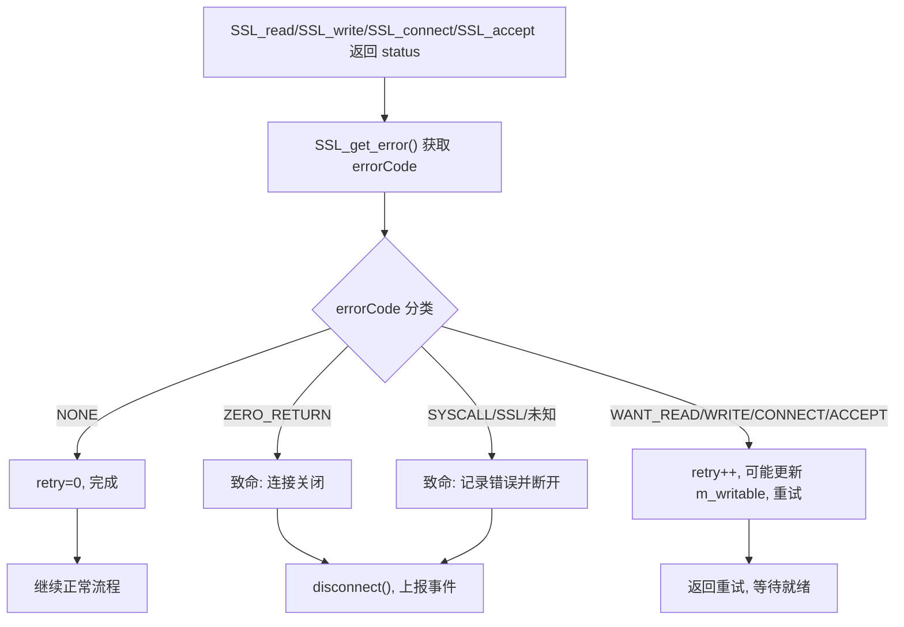
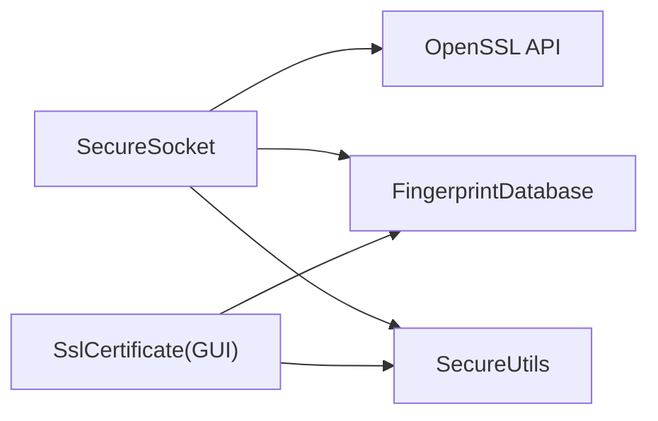

# SSL/TLS 加密通信

<cite>
**本文引用的文件**   
- [SecureSocket.h](file://src/lib/net/SecureSocket.h)
- [SecureSocket.cpp](file://src/lib/net/SecureSocket.cpp)
- [ConnectionSecurityLevel.h](file://src/lib/net/ConnectionSecurityLevel.h)
- [FingerprintDatabase.h](file://src/lib/net/FingerprintDatabase.h)
- [FingerprintDatabase.cpp](file://src/lib/net/FingerprintDatabase.cpp)
- [SecureUtils.h](file://src/lib/net/SecureUtils.h)
- [SslCertificate.h](file://src/gui/src/SslCertificate.h)
- [SslCertificate.cpp](file://src/gui/src/SslCertificate.cpp)
</cite>

## 目录
1. [简介](#简介)
2. [项目结构](#项目结构)
3. [核心组件](#核心组件)
4. [架构总览](#架构总览)
5. [详细组件分析](#详细组件分析)
6. [依赖关系分析](#依赖关系分析)
7. [性能考虑](#性能考虑)
8. [故障排查指南](#故障排查指南)
9. [结论](#结论)
10. [附录：配置与使用示例](#附录配置与使用示例)

## 简介
本文件面向 Input Leap 的 SSL/TLS 加密通信机制，重点围绕 SecureSocket 类的实现原理展开，涵盖 TLS 握手、加密算法选择、连接建立流程（客户端与服务端差异）、错误处理与重试策略、缓冲区管理与读写安全实现，以及性能优化建议。同时提供基于 GUI 的证书生成与指纹管理说明，帮助读者正确配置和使用安全连接。

## 项目结构
与 SSL/TLS 相关的关键代码位于网络层与 GUI 工具模块中：
- 网络层核心：SecureSocket（封装 OpenSSL 的 SSL/TLS 能力）
- 安全级别枚举：ConnectionSecurityLevel
- 指纹数据库：FingerprintDatabase（用于信任锚校验）
- 安全工具：SecureUtils（指纹计算、证书生成等）
- GUI 证书工具：SslCertificate（生成自签名证书与本地指纹库）

图表来源
- [SecureSocket.h:35-111](file://src/lib/net/SecureSocket.h#L35-L111)
- [SecureSocket.cpp:311-406](file://src/lib/net/SecureSocket.cpp#L311-L406)
- [ConnectionSecurityLevel.h:20-24](file://src/lib/net/ConnectionSecurityLevel.h#L20-L24)
- [FingerprintDatabase.h:28-48](file://src/lib/net/FingerprintDatabase.h#L28-L48)
- [SecureUtils.h:28-38](file://src/lib/net/SecureUtils.h#L28-L38)
- [SslCertificate.h:24-43](file://src/gui/src/SslCertificate.h#L24-L43)

章节来源
- [SecureSocket.h:35-111](file://src/lib/net/SecureSocket.h#L35-L111)
- [SecureSocket.cpp:311-406](file://src/lib/net/SecureSocket.cpp#L311-L406)
- [ConnectionSecurityLevel.h:20-24](file://src/lib/net/ConnectionSecurityLevel.h#L20-L24)
- [FingerprintDatabase.h:28-48](file://src/lib/net/FingerprintDatabase.h#L28-L48)
- [SecureUtils.h:28-38](file://src/lib/net/SecureUtils.h#L28-L38)
- [SslCertificate.h:24-43](file://src/gui/src/SslCertificate.h#L24-L43)

## 核心组件
- SecureSocket：在 TCP 之上封装 OpenSSL，负责初始化上下文、创建 SSL 对象、执行握手、读写数据、错误处理与资源释放。支持客户端与服务端两种模式，并可根据安全级别决定是否进行对端证书指纹校验。
- ConnectionSecurityLevel：定义明文、仅加密、加密且认证三种安全级别。
- FingerprintDatabase：持久化存储受信任的对端证书指纹，支持 v1/v2 格式解析与写入。
- SecureUtils：提供指纹格式化、从 X509/PEM 计算指纹、生成自签名证书等工具函数。
- SslCertificate（GUI）：提供一键生成自签名证书与本地指纹库的能力，便于用户快速启用安全连接。

章节来源
- [SecureSocket.h:35-111](file://src/lib/net/SecureSocket.h#L35-L111)
- [SecureSocket.cpp:311-406](file://src/lib/net/SecureSocket.cpp#L311-L406)
- [ConnectionSecurityLevel.h:20-24](file://src/lib/net/ConnectionSecurityLevel.h#L20-L24)
- [FingerprintDatabase.h:28-48](file://src/lib/net/FingerprintDatabase.h#L28-L48)
- [FingerprintDatabase.cpp:26-89](file://src/lib/net/FingerprintDatabase.cpp#L26-L89)
- [SecureUtils.h:28-38](file://src/lib/net/SecureUtils.h#L28-L38)
- [SslCertificate.h:24-43](file://src/gui/src/SslCertificate.h#L24-L43)
- [SslCertificate.cpp:39-84](file://src/gui/src/SslCertificate.cpp#L39-L84)

## 架构总览
下图展示了客户端与服务端在建立安全连接时的关键交互与状态流转。

图表来源
- [SecureSocket.cpp:422-481](file://src/lib/net/SecureSocket.cpp#L422-L481)
- [SecureSocket.cpp:484-536](file://src/lib/net/SecureSocket.cpp#L484-L536)
- [SecureSocket.cpp:539-620](file://src/lib/net/SecureSocket.cpp#L539-L620)
- [SecureSocket.cpp:711-782](file://src/lib/net/SecureSocket.cpp#L711-L782)

## 详细组件分析

### SecureSocket 类设计与职责
- 继承自 TCPSocket，复用底层 socket 多路复用与事件模型。
- 通过 initSsl(server) 初始化 SSL_CTX（区分服务端/客户端方法），并根据安全级别设置是否请求对端证书。
- createSSL() 为每个连接创建 SSL 对象并绑定到已连接的 fd。
- secureConnect()/secureAccept() 分别驱动客户端与服务端的握手流程。
- doRead()/doWrite() 将 SSL_read/SSL_write 与输入输出缓冲结合，保证非阻塞与重试语义。
- checkResult() 统一处理 SSL_ERROR_*，包括 WANT_READ/WRITE/CONNECT/ACCEPT 的重试逻辑与致命错误的清理。
- verify_peer_certificate() 在 ENCRYPTED_AUTHENTICATED 模式下校验对端证书指纹。

图表来源
- [SecureSocket.h:35-111](file://src/lib/net/SecureSocket.h#L35-L111)
- [ConnectionSecurityLevel.h:20-24](file://src/lib/net/ConnectionSecurityLevel.h#L20-L24)
- [FingerprintDatabase.h:28-48](file://src/lib/net/FingerprintDatabase.h#L28-L48)
- [SecureUtils.h:28-38](file://src/lib/net/SecureUtils.h#L28-L38)

章节来源
- [SecureSocket.h:35-111](file://src/lib/net/SecureSocket.h#L35-L111)
- [SecureSocket.cpp:311-406](file://src/lib/net/SecureSocket.cpp#L311-L406)
- [SecureSocket.cpp:422-481](file://src/lib/net/SecureSocket.cpp#L422-L481)
- [SecureSocket.cpp:484-536](file://src/lib/net/SecureSocket.cpp#L484-L536)
- [SecureSocket.cpp:539-620](file://src/lib/net/SecureSocket.cpp#L539-L620)
- [SecureSocket.cpp:251-302](file://src/lib/net/SecureSocket.cpp#L251-L302)
- [SecureSocket.cpp:145-249](file://src/lib/net/SecureSocket.cpp#L145-L249)

### TLS 握手与加密算法选择
- 上下文初始化：根据 server 标志选择服务端/客户端方法；禁用 SSLv3；在 ENCRYPTED_AUTHENTICATED 模式下强制请求对端证书但不做系统级验证（回调忽略）。
- 握手流程：客户端调用 SSL_connect，服务端调用 SSL_accept；两者均通过 checkResult 处理 WANT_* 状态并循环重试。
- 算法协商：由 OpenSSL 自动协商，当前实现未显式限制套件列表；可通过 showSecureCipherInfo 打印双方可用套件与最终选中的套件。

章节来源
- [SecureSocket.cpp:362-406](file://src/lib/net/SecureSocket.cpp#L362-L406)
- [SecureSocket.cpp:422-481](file://src/lib/net/SecureSocket.cpp#L422-L481)
- [SecureSocket.cpp:484-536](file://src/lib/net/SecureSocket.cpp#L484-L536)
- [SecureSocket.cpp:804-834](file://src/lib/net/SecureSocket.cpp#L804-L834)

### 客户端与服务端连接建立差异
- 客户端路径：
  - connect() 注册 DATA_SOCKET_CONNECTED 事件，触发 handle_tcp_connected() 后调用 secureConnect()。
  - secureConnect() 加载本地证书（若需要），SSL_set_fd，SSL_connect，checkResult 处理重试，成功后可选校验服务器指纹。
- 服务端路径：
  - secureAccept() 直接对已接受的 fd 执行 SSL_accept，checkResult 处理重试，成功后可选校验客户端指纹。
- 事件通知：
  - 客户端成功：DATA_SOCKET_SECURE_CONNECTED
  - 服务端成功：CLIENT_LISTENER_ACCEPTED

图表来源
- [SecureSocket.cpp:110-116](file://src/lib/net/SecureSocket.cpp#L110-L116)
- [SecureSocket.cpp:862-871](file://src/lib/net/SecureSocket.cpp#L862-L871)
- [SecureSocket.cpp:484-536](file://src/lib/net/SecureSocket.cpp#L484-L536)
- [SecureSocket.cpp:422-481](file://src/lib/net/SecureSocket.cpp#L422-L481)
- [SecureSocket.cpp:711-782](file://src/lib/net/SecureSocket.cpp#L711-L782)

章节来源
- [SecureSocket.cpp:110-116](file://src/lib/net/SecureSocket.cpp#L110-L116)
- [SecureSocket.cpp:862-871](file://src/lib/net/SecureSocket.cpp#L862-L871)
- [SecureSocket.cpp:484-536](file://src/lib/net/SecureSocket.cpp#L484-L536)
- [SecureSocket.cpp:422-481](file://src/lib/net/SecureSocket.cpp#L422-L481)
- [SecureSocket.cpp:711-782](file://src/lib/net/SecureSocket.cpp#L711-L782)

### 错误处理与重试逻辑
- checkResult() 统一处理 SSL_get_error 返回码：
  - SSL_ERROR_NONE：操作完成，重置重试计数。
  - SSL_ERROR_ZERO_RETURN：连接关闭，标记致命错误。
  - SSL_ERROR_WANT_READ/WRITE/CONNECT/ACCEPT：增加重试计数，必要时更新 m_writable 以触发多路复用事件，随后返回重试。
  - SSL_ERROR_SYSCALL/SSL_ERROR_SSL/未知：记录错误、标记致命、断开连接。
- 重试策略：
  - 握手阶段：serviceConnect/serviceAccept 内部循环调度，短延迟重试。
  - 读写阶段：secureRead/secureWrite 内部通过 retry 计数器控制是否继续尝试。
- 致命错误：
  - disconnect() 发送停止重试与断开事件，确保上层及时感知。

图表来源
- [SecureSocket.cpp:539-620](file://src/lib/net/SecureSocket.cpp#L539-L620)
- [SecureSocket.cpp:251-302](file://src/lib/net/SecureSocket.cpp#L251-L302)
- [SecureSocket.cpp:711-782](file://src/lib/net/SecureSocket.cpp#L711-L782)

章节来源
- [SecureSocket.cpp:539-620](file://src/lib/net/SecureSocket.cpp#L539-L620)
- [SecureSocket.cpp:251-302](file://src/lib/net/SecureSocket.cpp#L251-L302)
- [SecureSocket.cpp:711-782](file://src/lib/net/SecureSocket.cpp#L711-L782)

### 缓冲区管理与读写安全
- 读路径：
  - doRead() 在 isSecureReady() 时调用 secureRead()，将解密后的数据追加到输入缓冲，超过最大阈值则停止读取，避免内存膨胀。
  - 当远端关闭写端时，发送 STREAM_INPUT_SHUTDOWN，并在无待写任务且缓冲为空时发送 SOCKET_DISCONNECTED。
- 写路径：
  - doWrite() 维护一个重试缓冲（do_write_retry_buffer_），避免重复分配；优先从输出缓冲拷贝数据，调用 secureWrite() 发送。
  - 若 SSL_write 返回 0，表示需要再次尝试，保持重试状态；bytesWrote > 0 则丢弃已发送数据并继续。
- 线程安全：
  - 所有 SSL 访问通过 ssl_mutex_ 保护，避免多线程竞争。

章节来源
- [SecureSocket.cpp:145-202](file://src/lib/net/SecureSocket.cpp#L145-L202)
- [SecureSocket.cpp:204-249](file://src/lib/net/SecureSocket.cpp#L204-L249)
- [SecureSocket.cpp:251-302](file://src/lib/net/SecureSocket.cpp#L251-L302)
- [SecureSocket.cpp:93-107](file://src/lib/net/SecureSocket.cpp#L93-L107)

### 证书与指纹校验
- 客户端：
  - secureConnect() 加载本地证书（如存在），完成后调用 verify_peer_certificate() 校验服务器指纹。
- 服务端：
  - secureAccept() 完成后调用 verify_peer_certificate() 校验客户端指纹。
- 指纹库：
  - FingerprintDatabase 支持 v1/v2 格式，提供 add_trusted/is_trusted/read/write 等方法。
- GUI 工具：
  - SslCertificate::generateCertificate() 自动生成 PEM 自签名证书，并生成 SHA1/SHA256 指纹写入本地指纹库。

章节来源
- [SecureSocket.cpp:484-536](file://src/lib/net/SecureSocket.cpp#L484-L536)
- [SecureSocket.cpp:422-481](file://src/lib/net/SecureSocket.cpp#L422-L481)
- [SecureSocket.cpp:656-709](file://src/lib/net/SecureSocket.cpp#L656-L709)
- [FingerprintDatabase.cpp:26-89](file://src/lib/net/FingerprintDatabase.cpp#L26-L89)
- [SslCertificate.cpp:39-84](file://src/gui/src/SslCertificate.cpp#L39-L84)

## 依赖关系分析
- SecureSocket 依赖 OpenSSL API（SSL_CTX_new、SSL_new、SSL_connect/accept、SSL_read/write、SSL_get_ciphers 等）。
- 与 FingerprintDatabase 协作完成指纹校验。
- 与 SecureUtils 协作完成指纹计算与证书生成。
- 与 GUI 的 SslCertificate 协作简化证书与指纹的初始化管理。

图表来源
- [SecureSocket.cpp:311-406](file://src/lib/net/SecureSocket.cpp#L311-L406)
- [SecureSocket.cpp:804-834](file://src/lib/net/SecureSocket.cpp#L804-L834)
- [FingerprintDatabase.h:28-48](file://src/lib/net/FingerprintDatabase.h#L28-L48)
- [SecureUtils.h:28-38](file://src/lib/net/SecureUtils.h#L28-L38)
- [SslCertificate.cpp:39-84](file://src/gui/src/SslCertificate.cpp#L39-L84)

章节来源
- [SecureSocket.cpp:311-406](file://src/lib/net/SecureSocket.cpp#L311-L406)
- [SecureSocket.cpp:804-834](file://src/lib/net/SecureSocket.cpp#L804-L834)
- [FingerprintDatabase.h:28-48](file://src/lib/net/FingerprintDatabase.h#L28-L48)
- [SecureUtils.h:28-38](file://src/lib/net/SecureUtils.h#L28-L38)
- [SslCertificate.cpp:39-84](file://src/gui/src/SslCertificate.cpp#L39-L84)

## 性能考虑
- 非阻塞与重试：
  - 通过 WANT_* 状态与短延迟重试，避免忙轮询，提高 CPU 利用率。
- 缓冲优化：
  - 读路径限制最大输入缓冲大小，防止内存暴涨。
  - 写路径复用重试缓冲，减少动态分配开销。
- 日志与调试：
  - 仅在较高日志级别打印密码套件信息，降低常规运行开销。
- 并发安全：
  - 使用互斥锁保护 SSL 对象访问，避免竞态条件。

[本节为通用性能指导，不直接分析具体文件]

## 故障排查指南
- 常见问题定位：
  - 握手失败：检查 checkResult() 日志，关注 WANT_* 重试次数与是否出现 SYSCALL/SSL 错误。
  - 证书问题：确认 load_certificates() 是否成功，PEM 文件是否存在且私钥匹配。
  - 指纹不匹配：查看 verify_peer_certificate() 输出的指纹与本地指纹库内容。
- 诊断步骤：
  - 启用更高级别日志，观察 showSecureLibInfo/showSecureCipherInfo/showSecureConnectInfo 的输出。
  - 使用 GUI 工具重新生成证书与指纹，确保本地指纹库包含最新指纹。
  - 检查防火墙与端口连通性，确认 TCP 连接能建立后再进入 TLS 阶段。

章节来源
- [SecureSocket.cpp:539-620](file://src/lib/net/SecureSocket.cpp#L539-L620)
- [SecureSocket.cpp:319-354](file://src/lib/net/SecureSocket.cpp#L319-L354)
- [SecureSocket.cpp:656-709](file://src/lib/net/SecureSocket.cpp#L656-L709)
- [SecureSocket.cpp:837-860](file://src/lib/net/SecureSocket.cpp#L837-L860)
- [SslCertificate.cpp:39-84](file://src/gui/src/SslCertificate.cpp#L39-L84)

## 结论
Input Leap 的 SecureSocket 在 TCP 之上提供了稳健的 TLS 加密通道，具备完善的错误处理与重试机制，并通过指纹校验增强了对端身份可信度。配合 GUI 的证书与指纹管理工具，用户可以便捷地启用安全连接。建议在生产环境中开启 ENCRYPTED_AUTHENTICATED 模式，并确保指纹库正确维护。

[本节为总结性内容，不直接分析具体文件]

## 附录：配置与使用示例
- 启用安全连接（概念性步骤）：
  - 在服务端与客户端配置文件中指定安全级别为“加密且认证”。
  - 使用 GUI 工具生成自签名证书与本地指纹库，或将受信任的指纹添加到对应指纹库文件。
  - 启动服务与客户端，观察日志中的握手与指纹校验结果。
- 参考实现位置：
  - 安全级别定义：ConnectionSecurityLevel
  - 证书加载与校验：SecureSocket::load_certificates / verify_peer_certificate
  - 指纹库读写：FingerprintDatabase
  - 证书生成与指纹导出：SslCertificate

章节来源
- [ConnectionSecurityLevel.h:20-24](file://src/lib/net/ConnectionSecurityLevel.h#L20-L24)
- [SecureSocket.cpp:319-354](file://src/lib/net/SecureSocket.cpp#L319-L354)
- [SecureSocket.cpp:656-709](file://src/lib/net/SecureSocket.cpp#L656-L709)
- [FingerprintDatabase.cpp:26-89](file://src/lib/net/FingerprintDatabase.cpp#L26-L89)
- [SslCertificate.cpp:39-84](file://src/gui/src/SslCertificate.cpp#L39-L84)