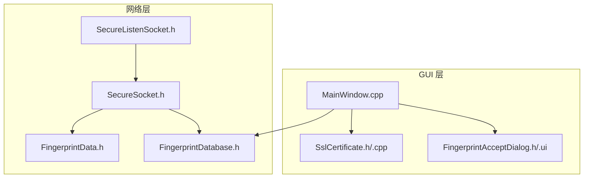
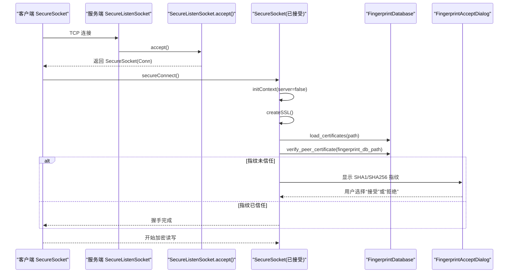
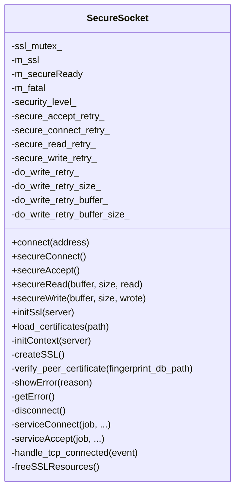
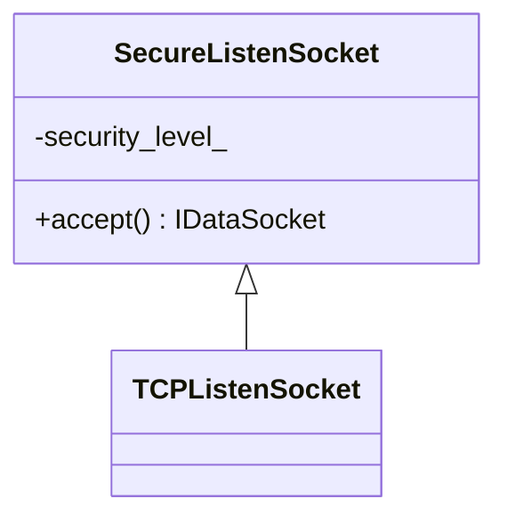
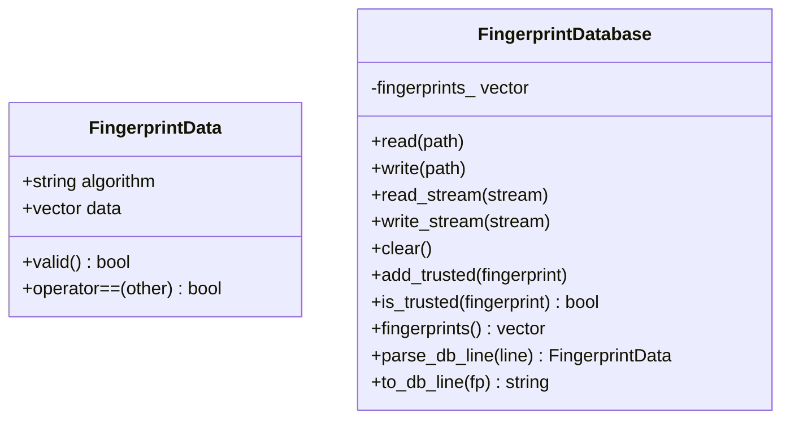
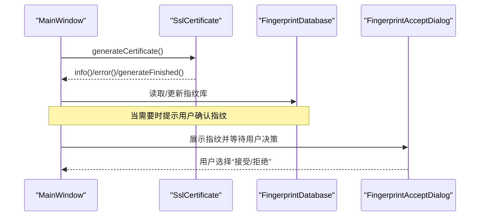
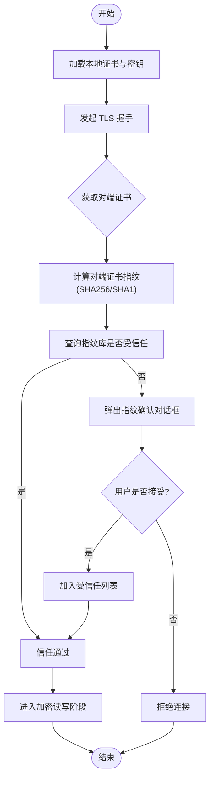
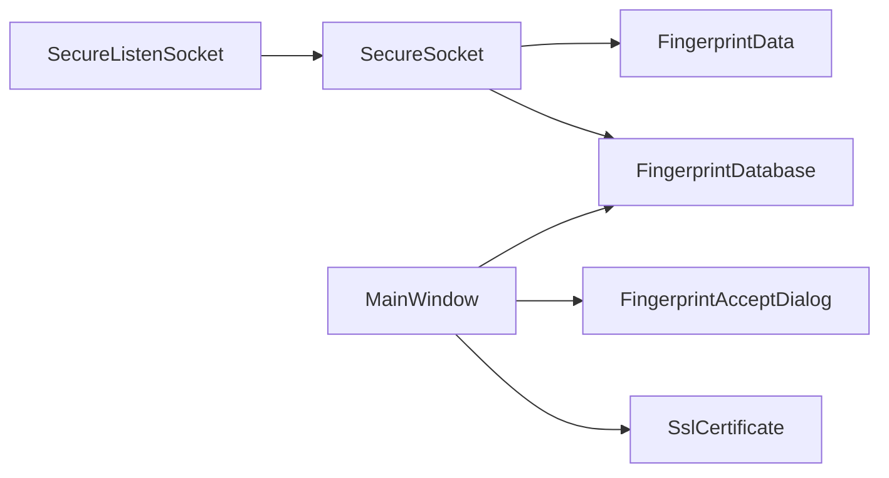

# 安全机制

<cite>
**本文引用的文件**   
- [SecureSocket.h](file://src/lib/net/SecureSocket.h)
- [SecureListenSocket.h](file://src/lib/net/SecureListenSocket.h)
- [FingerprintData.h](file://src/lib/net/FingerprintData.h)
- [FingerprintDatabase.h](file://src/lib/net/FingerprintDatabase.h)
- [FingerprintAcceptDialog.h](file://src/gui/src/FingerprintAcceptDialog.h)
- [SslCertificate.h](file://src/gui/src/SslCertificate.h)
- [MainWindow.cpp](file://src/gui/src/MainWindow.cpp)
</cite>

## 目录
1. [简介](#简介)
2. [项目结构](#项目结构)
3. [核心组件](#核心组件)
4. [架构总览](#架构总览)
5. [详细组件分析](#详细组件分析)
6. [依赖关系分析](#依赖关系分析)
7. [性能与安全特性](#性能与安全特性)
8. [故障排查指南](#故障排查指南)
9. [结论](#结论)
10. [附录：部署与配置最佳实践](#附录部署与配置最佳实践)

## 简介
本文件面向安全敏感用户，系统化阐述 Input Leap 的安全机制，重点覆盖以下方面：
- SSL/TLS 加密通信实现（握手、证书加载、指纹校验）
- 连接认证机制（对端证书指纹信任库、交互式确认）
- 数据传输加密（基于 TLS 的可靠传输）
- 网络安全防护策略（最小权限、错误处理、重试与回退）
- 权限管理系统（无障碍访问、系统托盘、网络访问控制）
- 安全配置最佳实践、漏洞防护措施与安全审计指南
- 完整的安全部署指导

## 项目结构
与安全相关的代码主要分布在以下位置：
- 网络层：lib/net 下的 SecureSocket、SecureListenSocket、Fingerprint* 等
- GUI 层：gui/src 下的 SslCertificate、FingerprintAcceptDialog、MainWindow 等

图表来源
- [SecureListenSocket.h:1-39](file://src/lib/net/SecureListenSocket.h#L1-L39)
- [SecureSocket.h:1-114](file://src/lib/net/SecureSocket.h#L1-L114)
- [FingerprintData.h:1-45](file://src/lib/net/FingerprintData.h#L1-L45)
- [FingerprintDatabase.h:1-51](file://src/lib/net/FingerprintDatabase.h#L1-L51)
- [FingerprintAcceptDialog.h:1-43](file://src/gui/src/FingerprintAcceptDialog.h#L1-L43)
- [SslCertificate.h:1-44](file://src/gui/src/SslCertificate.h#L1-L44)
- [MainWindow.cpp:1080-1110](file://src/gui/src/MainWindow.cpp#L1080-L1110)

章节来源
- [SecureListenSocket.h:1-39](file://src/lib/net/SecureListenSocket.h#L1-L39)
- [SecureSocket.h:1-114](file://src/lib/net/SecureSocket.h#L1-L114)
- [FingerprintData.h:1-45](file://src/lib/net/FingerprintData.h#L1-L45)
- [FingerprintDatabase.h:1-51](file://src/lib/net/FingerprintDatabase.h#L1-L51)
- [FingerprintAcceptDialog.h:1-43](file://src/gui/src/FingerprintAcceptDialog.h#L1-L43)
- [SslCertificate.h:1-44](file://src/gui/src/SslCertificate.h#L1-L44)
- [MainWindow.cpp:1080-1110](file://src/gui/src/MainWindow.cpp#L1080-L1110)

## 核心组件
- 安全监听套接字 SecureListenSocket：负责在服务器侧接受新连接，并根据安全级别创建安全数据通道。
- 安全套接字 SecureSocket：封装 TLS 上下文、证书加载、握手流程、读写 I/O 以及错误处理。
- 指纹数据结构与数据库：FingerprintData 表示算法与摘要数据；FingerprintDatabase 提供持久化与信任判断。
- GUI 交互：SslCertificate 负责证书生成与指纹计算；FingerprintAcceptDialog 用于首次连接时展示指纹并请求用户确认；MainWindow 协调证书生成与指纹库管理。

章节来源
- [SecureListenSocket.h:1-39](file://src/lib/net/SecureListenSocket.h#L1-L39)
- [SecureSocket.h:1-114](file://src/lib/net/SecureSocket.h#L1-L114)
- [FingerprintData.h:1-45](file://src/lib/net/FingerprintData.h#L1-L45)
- [FingerprintDatabase.h:1-51](file://src/lib/net/FingerprintDatabase.h#L1-L51)
- [SslCertificate.h:1-44](file://src/gui/src/SslCertificate.h#L1-L44)
- [FingerprintAcceptDialog.h:1-43](file://src/gui/src/FingerprintAcceptDialog.h#L1-L43)
- [MainWindow.cpp:1080-1110](file://src/gui/src/MainWindow.cpp#L1080-L1110)

## 架构总览
下图展示了客户端与服务端通过 TLS 建立安全连接的端到端流程，包括证书加载、握手、指纹验证与用户确认。

图表来源
- [SecureListenSocket.h:26-36](file://src/lib/net/SecureListenSocket.h#L26-L36)
- [SecureSocket.h:35-111](file://src/lib/net/SecureSocket.h#L35-L111)
- [FingerprintDatabase.h:28-48](file://src/lib/net/FingerprintDatabase.h#L28-L48)
- [FingerprintAcceptDialog.h:29-42](file://src/gui/src/FingerprintAcceptDialog.h#L29-L42)

## 详细组件分析

### 安全套接字 SecureSocket
职责与要点：
- 继承自 TCP 套接字，封装 TLS 生命周期（初始化上下文、创建 SSL 对象、握手、读写）。
- 支持加载本地证书与对端证书指纹校验。
- 提供安全读/写接口，内部维护重试状态与致命错误标记。
- 关键方法：secureConnect、secureAccept、secureRead、secureWrite、initSsl、load_certificates、verify_peer_certificate。

图表来源
- [SecureSocket.h:35-111](file://src/lib/net/SecureSocket.h#L35-L111)

章节来源
- [SecureSocket.h:35-111](file://src/lib/net/SecureSocket.h#L35-L111)

### 安全监听套接字 SecureListenSocket
职责与要点：
- 在服务器侧监听端口，accept 后返回一个 SecureSocket 实例，供后续 TLS 握手使用。
- 持有 ConnectionSecurityLevel 以决定安全策略。

图表来源
- [SecureListenSocket.h:26-36](file://src/lib/net/SecureListenSocket.h#L26-L36)

章节来源
- [SecureListenSocket.h:26-36](file://src/lib/net/SecureListenSocket.h#L26-L36)

### 指纹数据结构与数据库
- FingerprintData：包含算法标识与摘要字节序列，提供有效性判断与比较操作。
- FingerprintDatabase：提供从路径/流读取与写入指纹库的能力，支持添加受信任指纹与查询是否受信任。

图表来源
- [FingerprintData.h:24-44](file://src/lib/net/FingerprintData.h#L24-L44)
- [FingerprintDatabase.h:28-48](file://src/lib/net/FingerprintDatabase.h#L28-L48)

章节来源
- [FingerprintData.h:24-44](file://src/lib/net/FingerprintData.h#L24-L44)
- [FingerprintDatabase.h:28-48](file://src/lib/net/FingerprintDatabase.h#L28-L48)

### GUI 中的证书与指纹交互
- SslCertificate：提供证书生成与指纹计算能力，并在完成后发出信号通知上层。
- FingerprintAcceptDialog：在首次连接时展示对端指纹（含 SHA1/SHA256），由用户决定是否信任。
- MainWindow：在启用加密时自动触发证书生成，并管理指纹库。

图表来源
- [SslCertificate.h:24-43](file://src/gui/src/SslCertificate.h#L24-L43)
- [FingerprintAcceptDialog.h:29-42](file://src/gui/src/FingerprintAcceptDialog.h#L29-L42)
- [MainWindow.cpp:1080-1110](file://src/gui/src/MainWindow.cpp#L1080-L1110)

章节来源
- [SslCertificate.h:24-43](file://src/gui/src/SslCertificate.h#L24-L43)
- [FingerprintAcceptDialog.h:29-42](file://src/gui/src/FingerprintAcceptDialog.h#L29-L42)
- [MainWindow.cpp:1080-1110](file://src/gui/src/MainWindow.cpp#L1080-L1110)

### 连接认证与指纹校验流程

图表来源
- [SecureSocket.h:59-76](file://src/lib/net/SecureSocket.h#L59-L76)
- [FingerprintDatabase.h:36-43](file://src/lib/net/FingerprintDatabase.h#L36-L43)
- [FingerprintAcceptDialog.h:34-42](file://src/gui/src/FingerprintAcceptDialog.h#L34-L42)

## 依赖关系分析
- SecureSocket 依赖 FingerprintDatabase 进行指纹校验，依赖底层 TLS 库进行加解密。
- SecureListenSocket 作为监听入口，将新连接包装为 SecureSocket。
- GUI 层通过 SslCertificate 和 FingerprintAcceptDialog 与网络层协作，完成证书管理与用户确认。

图表来源
- [SecureListenSocket.h:26-36](file://src/lib/net/SecureListenSocket.h#L26-L36)
- [SecureSocket.h:35-111](file://src/lib/net/SecureSocket.h#L35-L111)
- [FingerprintDatabase.h:28-48](file://src/lib/net/FingerprintDatabase.h#L28-L48)
- [FingerprintData.h:24-44](file://src/lib/net/FingerprintData.h#L24-L44)
- [MainWindow.cpp:1080-1110](file://src/gui/src/MainWindow.cpp#L1080-L1110)

章节来源
- [SecureListenSocket.h:26-36](file://src/lib/net/SecureListenSocket.h#L26-L36)
- [SecureSocket.h:35-111](file://src/lib/net/SecureSocket.h#L35-L111)
- [FingerprintDatabase.h:28-48](file://src/lib/net/FingerprintDatabase.h#L28-L48)
- [FingerprintData.h:24-44](file://src/lib/net/FingerprintData.h#L24-L44)
- [MainWindow.cpp:1080-1110](file://src/gui/src/MainWindow.cpp#L1080-L1110)

## 性能与安全特性
- 并发与线程安全：SecureSocket 内部使用互斥量保护 SSL 资源访问，避免多线程竞争。
- 重试与回退：针对握手与 I/O 场景维护重试计数与缓冲，提升弱网环境稳定性。
- 致命错误标记：isFatal/isFatal(bool) 暴露致命错误状态，便于上层快速失败与清理。
- 安全级别：通过 ConnectionSecurityLevel 控制安全策略，确保在不同部署环境下满足最低安全要求。

章节来源
- [SecureSocket.h:90-111](file://src/lib/net/SecureSocket.h#L90-L111)

## 故障排查指南
常见问题与定位建议：
- 握手失败或证书错误
  - 检查本地证书与密钥是否正确加载（参考 load_certificates 调用点）。
  - 查看错误信息输出（参考 showError/getError 相关逻辑）。
- 指纹不匹配或被拒绝
  - 确认指纹库路径与内容正确（参考 is_trusted/add_trusted）。
  - 若为首次连接，确认用户已通过 FingerprintAcceptDialog 接受指纹。
- 连接中断或频繁重试
  - 关注重试计数与 do_write_retry_* 状态，必要时调整超时与缓冲区大小。
  - 检查网络环境与防火墙策略，确保端口可达且未被拦截。

章节来源
- [SecureSocket.h:69-87](file://src/lib/net/SecureSocket.h#L69-L87)
- [FingerprintDatabase.h:36-43](file://src/lib/net/FingerprintDatabase.h#L36-L43)
- [FingerprintAcceptDialog.h:34-42](file://src/gui/src/FingerprintAcceptDialog.h#L34-L42)

## 结论
Input Leap 的安全机制围绕 TLS 加密与证书指纹信任展开，结合 GUI 的用户确认流程，实现了既安全又易用的连接认证体系。通过可配置的 ConnectionSecurityLevel、完善的错误处理与重试机制，系统在保障数据安全的同时兼顾了可用性。对于高安全需求场景，建议严格管理证书与指纹库，遵循本文的最佳实践与审计指南。

## 附录：部署与配置最佳实践
- 证书管理
  - 使用强随机私钥与合适的证书有效期。
  - 定期轮换证书，保留历史指纹以便平滑过渡。
  - 将证书与密钥存放于受限权限目录，仅允许服务账户访问。
- 指纹验证
  - 优先采用 SHA256 指纹，避免使用已弃用算法（如 SHA1）。
  - 在生产环境中预置受信任指纹库，减少首次连接交互。
  - 对指纹变更进行告警与人工复核。
- 安全级别配置
  - 默认启用加密模式，禁止降级到明文。
  - 根据网络边界与合规要求调整 ConnectionSecurityLevel。
- 权限管理
  - 无障碍访问权限：仅在需要捕获输入事件时授予，最小化权限范围。
  - 系统托盘权限：按需启用，避免不必要的系统级交互。
  - 网络访问控制：限制监听端口与源地址白名单，关闭不必要的服务。
- 漏洞防护
  - 保持依赖库与 TLS 版本最新，及时修补已知漏洞。
  - 禁用不安全密码套件与协议版本。
  - 对异常输入与错误路径进行健壮性测试。
- 安全审计
  - 记录握手结果、指纹校验结果与用户确认日志（脱敏）。
  - 定期审查指纹库与证书清单，核对变更原因与审批记录。
  - 对生产环境进行渗透测试与基线核查。

[本节为通用指导，不直接分析具体源码文件]