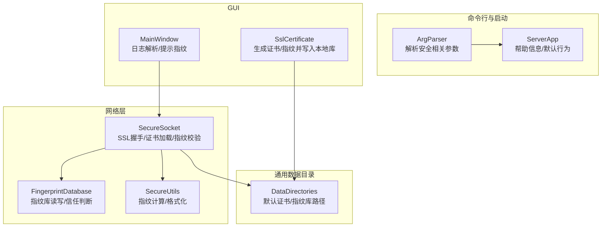
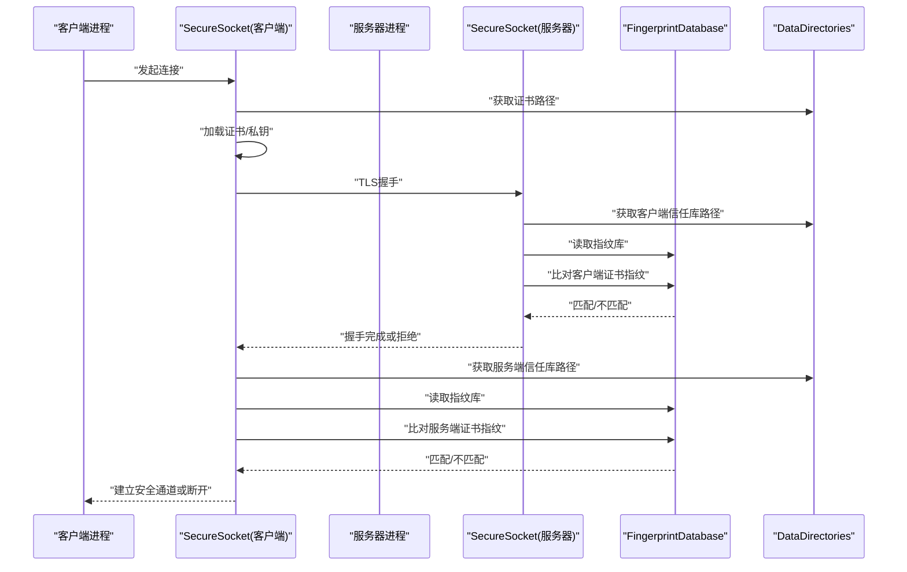
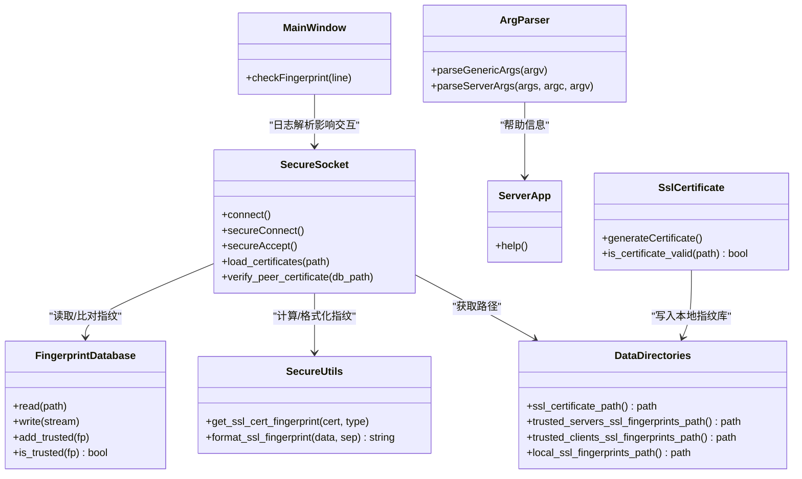

# 安全配置

<cite>
**本文引用的文件**   
- [SecureSocket.cpp](file://src/lib/net/SecureSocket.cpp)
- [SecureSocket.h](file://src/lib/net/SecureSocket.h)
- [FingerprintDatabase.cpp](file://src/lib/net/FingerprintDatabase.cpp)
- [SecureUtils.h](file://src/lib/net/SecureUtils.h)
- [DataDirectories_static.cpp](file://src/lib/common/DataDirectories_static.cpp)
- [DataDirectories.h](file://src/lib/common/DataDirectories.h)
- [ArgParser.cpp](file://src/lib/inputleap/ArgParser.cpp)
- [ServerApp.cpp](file://src/lib/inputleap/ServerApp.cpp)
- [MainWindow.cpp](file://src/gui/src/MainWindow.cpp)
- [SslCertificate.cpp](file://src/gui/src/SslCertificate.cpp)
- [input-leap.conf.example](file://doc/input-leap.conf.example)
</cite>

## 目录
1. [简介](#简介)
2. [项目结构](#项目结构)
3. [核心组件](#核心组件)
4. [架构总览](#架构总览)
5. [详细组件分析](#详细组件分析)
6. [依赖关系分析](#依赖关系分析)
7. [性能与超时特性](#性能与超时特性)
8. [故障排查指南](#故障排查指南)
9. [结论](#结论)
10. [附录：配置模板与安全审计清单](#附录配置模板与安全审计清单)

## 简介
本文件为 Input Leap 的安全配置参考，聚焦于以下方面：
- SSL 证书路径、指纹数据库位置与安全级别设置
- 命令行参数中的安全选项（如 --disable-crypto、--disable-client-cert-checking、--profile-dir）及其优先级规则
- 不同部署场景（开发、测试、生产）的推荐配置模板
- 配置文件语法规范、参数验证与错误处理机制
- 安全审计清单与配置检查工具使用方法
- 常见安全配置错误的诊断与修复

## 项目结构
与安全相关的实现主要分布在网络层、通用数据目录、GUI 辅助模块以及命令行解析器中。下图展示了与安全相关的关键文件与职责划分。

图表来源
- [SecureSocket.cpp:316-533](file://src/lib/net/SecureSocket.cpp#L316-L533)
- [FingerprintDatabase.cpp:41-97](file://src/lib/net/FingerprintDatabase.cpp#L41-L97)
- [SecureUtils.h:28-40](file://src/lib/net/SecureUtils.h#L28-L40)
- [DataDirectories_static.cpp:26-54](file://src/lib/common/DataDirectories_static.cpp#L26-L54)
- [ArgParser.cpp:436-444](file://src/lib/inputleap/ArgParser.cpp#L436-L444)
- [ServerApp.cpp:144-148](file://src/lib/inputleap/ServerApp.cpp#L144-L148)
- [MainWindow.cpp:479-513](file://src/gui/src/MainWindow.cpp#L479-L513)
- [SslCertificate.cpp:75-109](file://src/gui/src/SslCertificate.cpp#L75-L109)

章节来源
- [SecureSocket.cpp:316-533](file://src/lib/net/SecureSocket.cpp#L316-L533)
- [FingerprintDatabase.cpp:41-97](file://src/lib/net/FingerprintDatabase.cpp#L41-L97)
- [SecureUtils.h:28-40](file://src/lib/net/SecureUtils.h#L28-L40)
- [DataDirectories_static.cpp:26-54](file://src/lib/common/DataDirectories_static.cpp#L26-L54)
- [ArgParser.cpp:436-444](file://src/lib/inputleap/ArgParser.cpp#L436-L444)
- [ServerApp.cpp:144-148](file://src/lib/inputleap/ServerApp.cpp#L144-L148)
- [MainWindow.cpp:479-513](file://src/gui/src/MainWindow.cpp#L479-L513)
- [SslCertificate.cpp:75-109](file://src/gui/src/SslCertificate.cpp#L75-L109)

## 核心组件
- SecureSocket：负责 TLS 上下文初始化、证书加载、握手、对端证书指纹校验、重试与错误处理。
- FingerprintDatabase：管理可信指纹集合，支持读取/写入与去重添加。
- SecureUtils：提供证书指纹计算、格式化与随机图生成等工具函数。
- DataDirectories：集中定义默认证书与指纹库路径（包括本地、服务端、客户端信任库）。
- ArgParser/ServerApp：解析命令行参数，控制是否启用加密、是否禁用客户端证书校验、指定 profile 目录等。
- GUI（MainWindow/SslCertificate）：从日志中提取对端指纹并提示用户确认；支持从 PEM 生成指纹并写入本地库。

章节来源
- [SecureSocket.h:35-114](file://src/lib/net/SecureSocket.h#L35-L114)
- [FingerprintDatabase.cpp:77-97](file://src/lib/net/FingerprintDatabase.cpp#L77-L97)
- [SecureUtils.h:28-40](file://src/lib/net/SecureUtils.h#L28-L40)
- [DataDirectories.h:36-41](file://src/lib/common/DataDirectories.h#L36-L41)
- [ArgParser.cpp:436-444](file://src/lib/inputleap/ArgParser.cpp#L436-L444)
- [ServerApp.cpp:144-148](file://src/lib/inputleap/ServerApp.cpp#L144-L148)
- [MainWindow.cpp:479-513](file://src/gui/src/MainWindow.cpp#L479-L513)
- [SslCertificate.cpp:75-109](file://src/gui/src/SslCertificate.cpp#L75-L109)

## 架构总览
下图展示一次客户端到服务器的安全连接流程，包括证书加载、TLS 握手、指纹校验与结果处理。

图表来源
- [SecureSocket.cpp:483-533](file://src/lib/net/SecureSocket.cpp#L483-L533)
- [SecureSocket.cpp:450-468](file://src/lib/net/SecureSocket.cpp#L450-L468)
- [SecureSocket.cpp:668-709](file://src/lib/net/SecureSocket.cpp#L668-L709)
- [DataDirectories_static.cpp:31-49](file://src/lib/common/DataDirectories_static.cpp#L31-L49)
- [FingerprintDatabase.cpp:61-89](file://src/lib/net/FingerprintDatabase.cpp#L61-L89)

## 详细组件分析

### 安全级别与加密开关
- 默认行为：加密默认启用。若显式使用 --disable-crypto，则关闭加密能力。
- 客户端证书校验：服务器侧可通过 --disable-client-cert-checking 禁用客户端证书校验（已标记为废弃）。
- 安全级别字段：SecureSocket 内部维护 ConnectionSecurityLevel，用于表示当前连接的安全等级。

章节来源
- [ArgParser.cpp:436-441](file://src/lib/inputleap/ArgParser.cpp#L436-L441)
- [ArgParser.cpp:144-146](file://src/lib/inputleap/ArgParser.cpp#L144-L146)
- [ServerApp.cpp:147-148](file://src/lib/inputleap/ServerApp.cpp#L147-L148)
- [SecureSocket.h:98](file://src/lib/net/SecureSocket.h#L98)

### SSL 证书路径与加载
- 默认证书路径：由 DataDirectories 提供，位于 profile/SSL/InputLeap.pem。
- 加载流程：校验路径非空且存在，分别加载证书与私钥，并进行私钥一致性检查。任一失败将返回错误。

章节来源
- [DataDirectories_static.cpp:51-54](file://src/lib/common/DataDirectories_static.cpp#L51-L54)
- [SecureSocket.cpp:319-354](file://src/lib/net/SecureSocket.cpp#L319-L354)

### 指纹数据库位置与格式
- 目录与文件：
  - 本地指纹库：profile/SSL/Fingerprints/Local.txt
  - 服务端信任库：profile/SSL/Fingerprints/TrustedServers.txt
  - 客户端信任库：profile/SSL/Fingerprints/TrustedClients.txt
- 文件格式：每行一个指纹条目；支持旧版 v1 格式兼容解析；重复项会被去重。
- 用途：
  - 客户端连接时，与服务端信任库比对以验证服务端证书指纹。
  - 服务器接受连接时，与客户端信任库比对以验证客户端证书指纹。

章节来源
- [DataDirectories_static.cpp:26-49](file://src/lib/common/DataDirectories_static.cpp#L26-L49)
- [FingerprintDatabase.cpp:41-97](file://src/lib/net/FingerprintDatabase.cpp#L41-L97)
- [SecureSocket.cpp:668-709](file://src/lib/net/SecureSocket.cpp#L668-L709)

### 指纹计算与可视化
- 计算与格式化：通过 SecureUtils 提供的接口计算 SHA1/SHA256 指纹，并以冒号分隔十六进制字符串输出。
- 随机图：可生成便于人工核对的指纹随机图。
- GUI 集成：从日志中解析“peer fingerprint (SHA1): ... (SHA256): ...”行，提取指纹供用户确认。

章节来源
- [SecureUtils.h:28-40](file://src/lib/net/SecureUtils.h#L28-L40)
- [MainWindow.cpp:479-513](file://src/gui/src/MainWindow.cpp#L479-L513)

### 证书生成与指纹入库
- GUI 支持从 PEM 文件生成指纹并写入本地指纹库（Local.txt），便于后续自动信任。
- 校验 PEM 有效性：确保包含有效公钥。

章节来源
- [SslCertificate.cpp:75-109](file://src/gui/src/SslCertificate.cpp#L75-L109)

### 连接握手与重试逻辑
- 握手阶段：创建 SSL 上下文、附加套接字、执行握手。
- 重试策略：在握手/读/写过程中遇到需要重试的状态会进行有限次重试，并在达到上限后返回错误或断开。
- 日志输出：记录对端证书信息与指纹，便于调试与人工核验。

章节来源
- [SecureSocket.cpp:483-533](file://src/lib/net/SecureSocket.cpp#L483-L533)
- [SecureSocket.cpp:251-270](file://src/lib/net/SecureSocket.cpp#L251-L270)
- [SecureSocket.cpp:668-709](file://src/lib/net/SecureSocket.cpp#L668-L709)

### 配置文件语法与参数验证
- 配置文件示例：screens/links/aliases 等节用于描述屏幕布局与别名映射。
- 语法要点：
  - 注释以 # 开头至行尾。
  - 行首空白被忽略，行内注释与尾部空白会被剥离。
  - 非法字符将被拒绝并抛出配置读取异常。
- 注意：安全相关参数主要通过命令行参数控制，而非配置文件。

章节来源
- [input-leap.conf.example:1-38](file://doc/input-leap.conf.example#L1-L38)
- [ConfigReadContext::readLine 行为（参考源码片段）:1824-1860](file://src/lib/server/Config.cpp#L1824-L1860)

## 依赖关系分析
- SecureSocket 依赖：
  - DataDirectories：获取证书与指纹库路径
  - FingerprintDatabase：读取/比对指纹
  - SecureUtils：计算/格式化指纹
- GUI 依赖：
  - MainWindow：解析日志中的指纹信息
  - SslCertificate：生成指纹并写入本地库
- 命令行解析：
  - ArgParser：解析 --disable-crypto、--disable-client-cert-checking、--profile-dir 等
  - ServerApp：打印帮助信息，包含安全相关选项说明

图表来源
- [SecureSocket.h:35-114](file://src/lib/net/SecureSocket.h#L35-L114)
- [FingerprintDatabase.cpp:61-89](file://src/lib/net/FingerprintDatabase.cpp#L61-L89)
- [SecureUtils.h:28-40](file://src/lib/net/SecureUtils.h#L28-L40)
- [DataDirectories.h:36-41](file://src/lib/common/DataDirectories.h#L36-L41)
- [ArgParser.cpp:436-444](file://src/lib/inputleap/ArgParser.cpp#L436-L444)
- [ServerApp.cpp:144-148](file://src/lib/inputleap/ServerApp.cpp#L144-L148)
- [MainWindow.cpp:479-513](file://src/gui/src/MainWindow.cpp#L479-L513)
- [SslCertificate.cpp:75-109](file://src/gui/src/SslCertificate.cpp#L75-L109)

## 性能与超时特性
- 重试延迟：内部使用固定短延迟进行重试，避免忙等。
- 缓冲区与重试：读写过程支持部分写入/读取的重试缓冲，提升稳定性。
- 超时配置：在当前代码中未发现显式的网络超时配置参数；如需调整，需关注底层平台网络栈或事件循环配置。

章节来源
- [SecureSocket.cpp:45-46](file://src/lib/net/SecureSocket.cpp#L45-L46)
- [SecureSocket.cpp:221-249](file://src/lib/net/SecureSocket.cpp#L221-L249)

## 故障排查指南
常见问题与定位步骤：
- 无法加载证书/私钥
  - 现象：报错“未指定证书”、“证书不存在”、“无法使用证书/私钥”、“无法验证私钥”。
  - 排查：确认默认证书路径是否存在且可读；PEM 格式是否正确；私钥与证书匹配。
  - 参考路径：[SecureSocket.cpp:319-354](file://src/lib/net/SecureSocket.cpp#L319-L354)
- 指纹校验失败
  - 现象：日志显示“未能验证客户端/服务端证书指纹”，并断开连接。
  - 排查：确认对应信任库文件（TrustedServers.txt/TrustedClients.txt）中包含正确的 SHA256 指纹；必要时通过 GUI 从日志提取指纹并手动加入 Local.txt。
  - 参考路径：[SecureSocket.cpp:450-468](file://src/lib/net/SecureSocket.cpp#L450-L468)、[SecureSocket.cpp:668-709](file://src/lib/net/SecureSocket.cpp#L668-L709)
- 加密被关闭导致连接不安全
  - 现象：使用 --disable-crypto 后，连接不再加密。
  - 排查：移除该参数或改用默认加密模式。
  - 参考路径：[ArgParser.cpp:436-441](file://src/lib/inputleap/ArgParser.cpp#L436-L441)
- 客户端证书校验被禁用
  - 现象：服务器允许未知客户端连接。
  - 排查：移除 --disable-client-cert-checking，并确保客户端指纹已加入服务端信任库。
  - 参考路径：[ArgParser.cpp:144-146](file://src/lib/inputleap/ArgParser.cpp#L144-L146)、[ServerApp.cpp:147-148](file://src/lib/inputleap/ServerApp.cpp#L147-L148)
- 配置文件语法错误
  - 现象：启动时报配置读取异常，指出非法字符或缺少分隔符。
  - 排查：检查行内注释、空白与非法字符；遵循示例配置语法。
  - 参考路径：[input-leap.conf.example:1-38](file://doc/input-leap.conf.example#L1-L38)、[ConfigReadContext::readLine 行为（参考源码片段）:1824-1860](file://src/lib/server/Config.cpp#L1824-L1860)

章节来源
- [SecureSocket.cpp:319-354](file://src/lib/net/SecureSocket.cpp#L319-L354)
- [SecureSocket.cpp:450-468](file://src/lib/net/SecureSocket.cpp#L450-L468)
- [SecureSocket.cpp:668-709](file://src/lib/net/SecureSocket.cpp#L668-L709)
- [ArgParser.cpp:436-441](file://src/lib/inputleap/ArgParser.cpp#L436-L441)
- [ArgParser.cpp:144-146](file://src/lib/inputleap/ArgParser.cpp#L144-L146)
- [ServerApp.cpp:147-148](file://src/lib/inputleap/ServerApp.cpp#L147-L148)
- [input-leap.conf.example:1-38](file://doc/input-leap.conf.example#L1-L38)
- [Config.cpp:1824-1860](file://src/lib/server/Config.cpp#L1824-L1860)

## 结论
Input Leap 的安全体系围绕“证书+指纹”的双因子信任模型展开：通过 OpenSSL 实现 TLS 加密，结合指纹数据库进行对端身份校验。默认情况下加密开启，建议在生产环境保持开启并严格管理指纹库。命令行参数提供了必要的开关与路径覆盖能力，GUI 则提供了便捷的指纹提取与入库操作。对于网络超时等高级特性，当前版本未暴露配置项，需依赖底层平台或事件循环策略。

## 附录：配置模板与安全审计清单

### 安全配置模板（按部署场景）
- 开发环境
  - 加密：默认开启（不使用 --disable-crypto）
  - 客户端证书校验：可暂时禁用（--disable-client-cert-checking），但应记录风险
  - 指纹库：使用 GUI 从日志提取指纹并写入 Local.txt，快速打通连接
  - Profile 目录：可使用默认路径或通过 --profile-dir 指定独立目录隔离数据
- 测试环境
  - 加密：必须开启
  - 客户端证书校验：开启，并将所有受测客户端指纹加入服务端信任库
  - 指纹库：集中管理 TrustedClients.txt/TrustedServers.txt，纳入版本控制
  - Profile 目录：建议使用专用目录并通过 --profile-dir 明确指定
- 生产环境
  - 加密：必须开启
  - 客户端证书校验：必须开启，禁止使用 --disable-client-cert-checking
  - 指纹库：仅保留经审批的指纹，定期轮换与审计
  - Profile 目录：使用受控目录，限制访问权限，避免写入不可信数据

### 安全审计清单
- 证书与密钥
  - 确认默认证书路径存在且可读
  - 确保证书与私钥匹配且未过期
  - 限制证书文件访问权限
- 指纹库
  - 确认 TrustedServers.txt/TrustedClients.txt 内容准确
  - 禁止包含通配或过宽匹配的指纹
  - 定期清理无效指纹
- 命令行参数
  - 确认未使用 --disable-crypto
  - 确认未使用 --disable-client-cert-checking（除非有明确审批）
  - 确认 --profile-dir 指向受控目录
- 日志与监控
  - 监控“未能验证指纹”等关键日志
  - 记录指纹变更与证书更新事件
- 配置与文档
  - 配置文件遵循语法规范，无非法字符
  - 变更记录与审批流程完备

### 配置检查工具使用方法（基于现有功能）
- 使用 GUI 提取指纹
  - 运行客户端/服务器，观察日志窗口中“peer fingerprint (SHA1): ... (SHA256): ...”行
  - 根据角色选择对应的信任库路径（客户端或服务端）
  - 将指纹添加到 Local.txt 或相应信任库文件
- 使用命令行参数覆盖路径
  - 使用 --profile-dir 指定自定义 profile 目录，便于隔离与审计
  - 使用 --disable-crypto/--disable-client-cert-checking 仅在受控环境下临时使用

章节来源
- [DataDirectories_static.cpp:31-49](file://src/lib/common/DataDirectories_static.cpp#L31-L49)
- [MainWindow.cpp:479-513](file://src/gui/src/MainWindow.cpp#L479-L513)
- [ArgParser.cpp:436-444](file://src/lib/inputleap/ArgParser.cpp#L436-L444)
- [ServerApp.cpp:144-148](file://src/lib/inputleap/ServerApp.cpp#L144-L148)