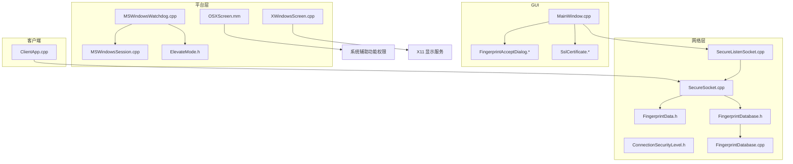
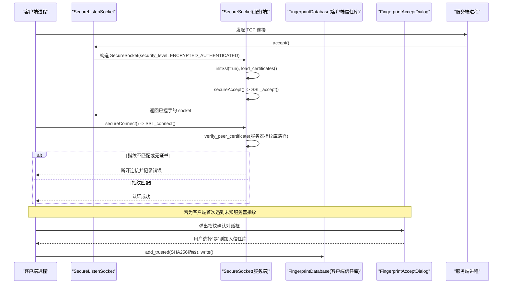
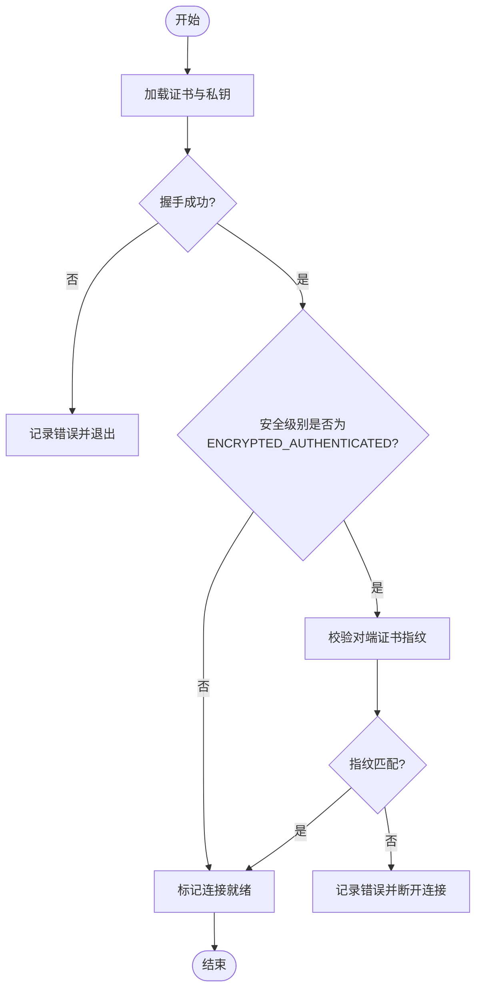
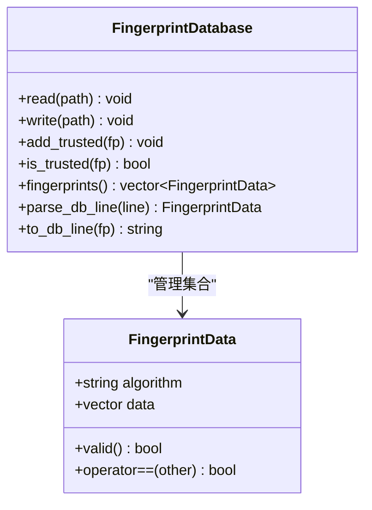
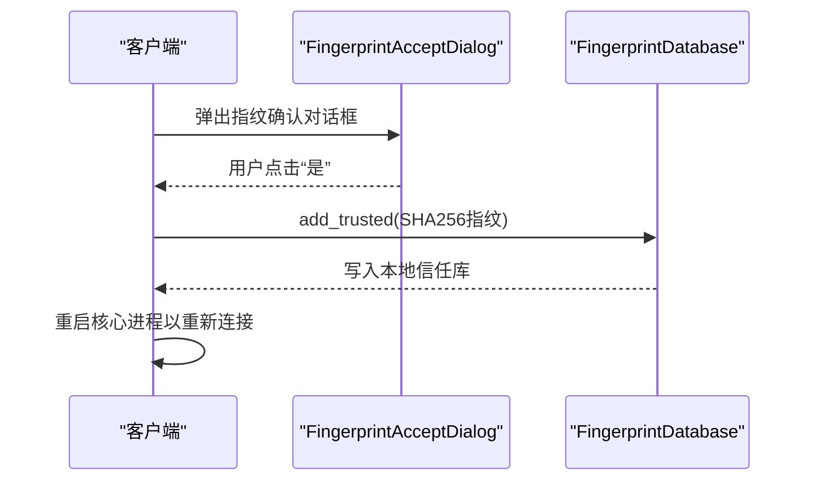
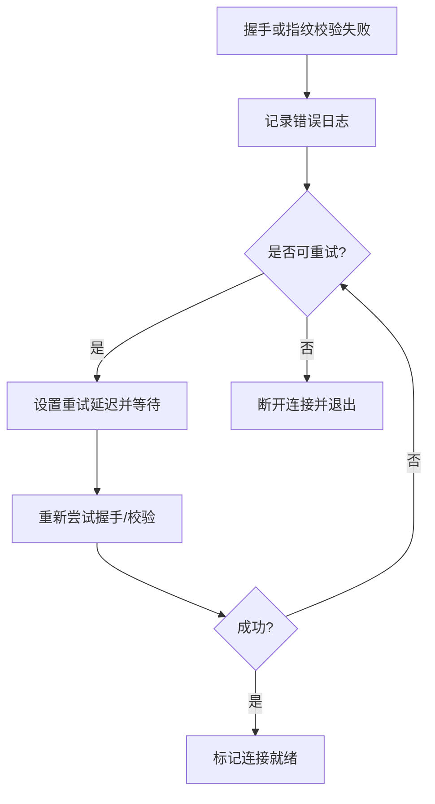
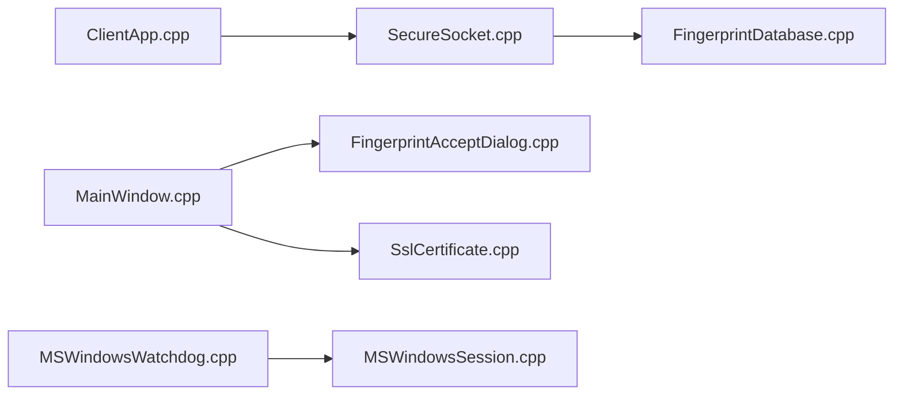

# 认证与授权

<cite>
**本文引用的文件列表**
- [ConnectionSecurityLevel.h](file://src/lib/net/ConnectionSecurityLevel.h)
- [SecureSocket.cpp](file://src/lib/net/SecureSocket.cpp)
- [SecureListenSocket.cpp](file://src/lib/net/SecureListenSocket.cpp)
- [FingerprintData.h](file://src/lib/net/FingerprintData.h)
- [FingerprintDatabase.h](file://src/lib/net/FingerprintDatabase.h)
- [FingerprintDatabase.cpp](file://src/lib/net/FingerprintDatabase.cpp)
- [MainWindow.cpp](file://src/gui/src/MainWindow.cpp)
- [FingerprintAcceptDialog.h](file://src/gui/src/FingerprintAcceptDialog.h)
- [FingerprintAcceptDialog.cpp](file://src/gui/src/FingerprintAcceptDialog.cpp)
- [SslCertificate.h](file://src/gui/src/SslCertificate.h)
- [SslCertificate.cpp](file://src/gui/src/SslCertificate.cpp)
- [MSWindowsWatchdog.cpp](file://src/lib/platform/MSWindowsWatchdog.cpp)
- [MSWindowsSession.cpp](file://src/lib/platform/MSWindowsSession.cpp)
- [ElevateMode.h](file://src/gui/src/ElevateMode.h)
- [OSXScreen.mm](file://src/lib/platform/OSXScreen.mm)
- [XWindowsScreen.cpp](file://src/lib/platform/XWindowsScreen.cpp)
- [ClientApp.cpp](file://src/lib/inputleap/ClientApp.cpp)
</cite>

## 目录
1. [简介](#简介)
2. [项目结构](#项目结构)
3. [核心组件](#核心组件)
4. [架构总览](#架构总览)
5. [详细组件分析](#详细组件分析)
6. [依赖关系分析](#依赖关系分析)
7. [性能与安全考量](#性能与安全考量)
8. [故障排查指南](#故障排查指南)
9. [结论](#结论)
10. [附录](#附录)

## 简介
本文件聚焦 Input Leap 的认证与授权机制，系统性阐述连接安全级别、双向证书认证流程（ENCRYPTED_AUTHENTICATED）、指纹校验与用户交互、失败处理与重试策略，以及 Windows/macOS/Linux 平台权限模型。文档旨在帮助开发者与运维人员正确配置并理解安全行为，降低中间人攻击风险，提升跨设备输入共享的安全性。

## 项目结构
与认证和授权相关的代码主要分布在以下模块：
- 网络层：SSL/TLS 握手、证书加载、对端证书指纹验证、错误与重试
- GUI 层：指纹确认对话框、证书生成与校验、信任库写入
- 平台层：Windows UAC 提权、macOS 辅助功能权限、Linux X11 访问控制
- 客户端应用：连接失败处理与自动重连

图表来源
- [SecureListenSocket.cpp:38-71](file://src/lib/net/SecureListenSocket.cpp#L38-L71)
- [SecureSocket.cpp:421-530](file://src/lib/net/SecureSocket.cpp#L421-L530)
- [FingerprintDatabase.h:28-48](file://src/lib/net/FingerprintDatabase.h#L28-L48)
- [FingerprintDatabase.cpp:26-89](file://src/lib/net/FingerprintDatabase.cpp#L26-L89)
- [FingerprintData.h:26-39](file://src/lib/net/FingerprintData.h#L26-L39)
- [MainWindow.cpp:511-551](file://src/gui/src/MainWindow.cpp#L511-L551)
- [FingerprintAcceptDialog.cpp:22-65](file://src/gui/src/FingerprintAcceptDialog.cpp#L22-L65)
- [SslCertificate.cpp:75-109](file://src/gui/src/SslCertificate.cpp#L75-L109)
- [MSWindowsWatchdog.cpp:136-157](file://src/lib/platform/MSWindowsWatchdog.cpp#L136-L157)
- [MSWindowsSession.cpp:124-144](file://src/lib/platform/MSWindowsSession.cpp#L124-L144)
- [ElevateMode.h:20-39](file://src/gui/src/ElevateMode.h#L20-L39)
- [OSXScreen.mm:111-122](file://src/lib/platform/OSXScreen.mm#L111-L122)
- [XWindowsScreen.cpp:859-886](file://src/lib/platform/XWindowsScreen.cpp#L859-L886)
- [ClientApp.cpp:282-297](file://src/lib/inputleap/ClientApp.cpp#L282-L297)

章节来源
- [ConnectionSecurityLevel.h:20-24](file://src/lib/net/ConnectionSecurityLevel.h#L20-L24)
- [SecureListenSocket.cpp:38-71](file://src/lib/net/SecureListenSocket.cpp#L38-L71)
- [SecureSocket.cpp:421-530](file://src/lib/net/SecureSocket.cpp#L421-L530)
- [FingerprintDatabase.h:28-48](file://src/lib/net/FingerprintDatabase.h#L28-L48)
- [FingerprintDatabase.cpp:26-89](file://src/lib/net/FingerprintDatabase.cpp#L26-L89)
- [FingerprintData.h:26-39](file://src/lib/net/FingerprintData.h#L26-L39)
- [MainWindow.cpp:511-551](file://src/gui/src/MainWindow.cpp#L511-L551)
- [FingerprintAcceptDialog.cpp:22-65](file://src/gui/src/FingerprintAcceptDialog.cpp#L22-L65)
- [SslCertificate.cpp:75-109](file://src/gui/src/SslCertificate.cpp#L75-L109)
- [MSWindowsWatchdog.cpp:136-157](file://src/lib/platform/MSWindowsWatchdog.cpp#L136-L157)
- [MSWindowsSession.cpp:124-144](file://src/lib/platform/MSWindowsSession.cpp#L124-L144)
- [ElevateMode.h:20-39](file://src/gui/src/ElevateMode.h#L20-L39)
- [OSXScreen.mm:111-122](file://src/lib/platform/OSXScreen.mm#L111-L122)
- [XWindowsScreen.cpp:859-886](file://src/lib/platform/XWindowsScreen.cpp#L859-L886)
- [ClientApp.cpp:282-297](file://src/lib/inputleap/ClientApp.cpp#L282-L297)

## 核心组件
- 连接安全级别枚举：定义明文、仅加密、加密且双向认证三种模式。
- 安全套接字实现：负责 TLS 上下文初始化、证书加载、握手、对端证书指纹校验、错误与重试。
- 指纹数据库：持久化受信任的对端证书指纹，支持 v2 格式与兼容旧版 SHA1 格式。
- GUI 交互：首次未知指纹时弹出确认对话框，用户确认后写入信任库；提供证书生成与校验工具。
- 平台权限：Windows UAC 提权、macOS 辅助功能权限、Linux X11 访问控制。
- 客户端重连：连接失败时的日志记录与指数退避式重试。

章节来源
- [ConnectionSecurityLevel.h:20-24](file://src/lib/net/ConnectionSecurityLevel.h#L20-L24)
- [SecureSocket.cpp:316-354](file://src/lib/net/SecureSocket.cpp#L316-L354)
- [SecureSocket.cpp:421-530](file://src/lib/net/SecureSocket.cpp#L421-L530)
- [FingerprintDatabase.h:28-48](file://src/lib/net/FingerprintDatabase.h#L28-L48)
- [FingerprintDatabase.cpp:26-89](file://src/lib/net/FingerprintDatabase.cpp#L26-L89)
- [MainWindow.cpp:511-551](file://src/gui/src/MainWindow.cpp#L511-L551)
- [FingerprintAcceptDialog.cpp:22-65](file://src/gui/src/FingerprintAcceptDialog.cpp#L22-L65)
- [SslCertificate.cpp:75-109](file://src/gui/src/SslCertificate.cpp#L75-L109)
- [MSWindowsWatchdog.cpp:136-157](file://src/lib/platform/MSWindowsWatchdog.cpp#L136-L157)
- [OSXScreen.mm:111-122](file://src/lib/platform/OSXScreen.mm#L111-L122)
- [XWindowsScreen.cpp:859-886](file://src/lib/platform/XWindowsScreen.cpp#L859-L886)
- [ClientApp.cpp:282-297](file://src/lib/inputleap/ClientApp.cpp#L282-L297)

## 架构总览
下图展示了 ENCRYPTED_AUTHENTICATED 模式下服务端接受连接与客户端建立连接的端到端流程，包括证书加载、TLS 握手、指纹校验和用户交互。

图表来源
- [SecureListenSocket.cpp:38-71](file://src/lib/net/SecureListenSocket.cpp#L38-L71)
- [SecureSocket.cpp:421-530](file://src/lib/net/SecureSocket.cpp#L421-L530)
- [MainWindow.cpp:511-551](file://src/gui/src/MainWindow.cpp#L511-L551)
- [FingerprintDatabase.cpp:77-89](file://src/lib/net/FingerprintDatabase.cpp#L77-L89)

## 详细组件分析

### 连接安全级别与认证策略
- PLAINTEXT：明文传输，不进行任何加密或认证。
- ENCRYPTED：启用 TLS 加密，但不强制对端证书认证。
- ENCRYPTED_AUTHENTICATED：启用 TLS 加密并对端证书进行指纹校验，确保双向身份可信。

在 ENCRYPTED_AUTHENTICATED 模式下：
- 服务端侧：接受连接后检查对端是否提供证书，并比对客户端指纹库。
- 客户端侧：连接成功后校验服务端证书指纹，若不在信任库则触发用户交互。

章节来源
- [ConnectionSecurityLevel.h:20-24](file://src/lib/net/ConnectionSecurityLevel.h#L20-L24)
- [SecureSocket.cpp:447-468](file://src/lib/net/SecureSocket.cpp#L447-L468)
- [SecureSocket.cpp:521-530](file://src/lib/net/SecureSocket.cpp#L521-L530)

### ENCRYPTED_AUTHENTICATED 双向认证流程
- 服务端接受流程：
  - 创建 SSL 上下文并加载自身证书与私钥。
  - 执行 SSL_accept 完成握手。
  - 若安全级别为 ENCRYPTED_AUTHENTICATED，调用 verify_peer_certificate 读取客户端指纹库并校验对端证书指纹。
  - 校验失败则记录错误并断开连接。
- 客户端连接流程：
  - 加载本地证书（用于双向认证）。
  - 执行 SSL_connect 完成握手。
  - 校验服务端证书指纹，若不在信任库则断开连接。
  - 若为客户端首次遇到未知指纹，GUI 弹出确认对话框，用户确认后写入信任库并重启核心进程以继续连接。

图表来源
- [SecureSocket.cpp:316-354](file://src/lib/net/SecureSocket.cpp#L316-L354)
- [SecureSocket.cpp:421-530](file://src/lib/net/SecureSocket.cpp#L421-L530)

章节来源
- [SecureSocket.cpp:316-354](file://src/lib/net/SecureSocket.cpp#L316-L354)
- [SecureSocket.cpp:421-530](file://src/lib/net/SecureSocket.cpp#L421-L530)

### 指纹数据库与数据结构
- 指纹类型：支持 SHA1（已弃用）与 SHA256。
- 存储格式：v2 行格式包含算法与十六进制数据，兼容旧版 SHA1 冒号分隔格式。
- 操作接口：读/写文件、追加受信任指纹、去重、查询是否受信任。

图表来源
- [FingerprintData.h:26-39](file://src/lib/net/FingerprintData.h#L26-L39)
- [FingerprintDatabase.h:28-48](file://src/lib/net/FingerprintDatabase.h#L28-L48)
- [FingerprintDatabase.cpp:26-89](file://src/lib/net/FingerprintDatabase.cpp#L26-L89)

章节来源
- [FingerprintData.h:26-39](file://src/lib/net/FingerprintData.h#L26-L39)
- [FingerprintDatabase.h:28-48](file://src/lib/net/FingerprintDatabase.h#L28-L48)
- [FingerprintDatabase.cpp:26-89](file://src/lib/net/FingerprintDatabase.cpp#L26-L89)

### 用户交互流程：指纹确认对话框
- 触发条件：客户端首次遇到未知服务器指纹。
- 交互内容：展示 SHA1 与 SHA256 指纹，提示用户与服务端屏幕核对。
- 用户选择：
  - “是”：将 SHA256 指纹加入信任库并持久化，随后重启核心进程继续连接。
  - “否”：拒绝连接并断开。

图表来源
- [MainWindow.cpp:511-551](file://src/gui/src/MainWindow.cpp#L511-L551)
- [FingerprintAcceptDialog.cpp:22-65](file://src/gui/src/FingerprintAcceptDialog.cpp#L22-L65)
- [FingerprintDatabase.cpp:77-89](file://src/lib/net/FingerprintDatabase.cpp#L77-L89)

章节来源
- [MainWindow.cpp:511-551](file://src/gui/src/MainWindow.cpp#L511-L551)
- [FingerprintAcceptDialog.cpp:22-65](file://src/gui/src/FingerprintAcceptDialog.cpp#L22-L65)

### 证书生成与校验
- 生成指纹：从 PEM 证书计算 SHA1 与 SHA256 指纹，写入本地信任库。
- 校验证书：验证证书文件可读、可解析、包含有效公钥。

章节来源
- [SslCertificate.cpp:75-109](file://src/gui/src/SslCertificate.cpp#L75-L109)
- [SslCertificate.h:24-43](file://src/gui/src/SslCertificate.h#L24-L43)

### 认证失败处理机制
- 连接拒绝：当对端未提供证书或指纹不匹配时，立即断开连接。
- 错误日志：记录具体错误原因与 OpenSSL 错误信息。
- 重试策略：
  - 服务端侧：在握手阶段根据状态决定是否重试并接受延迟。
  - 客户端侧：连接失败时根据是否可重启与是否允许重试，安排定时器进行指数退避式重连。

图表来源
- [SecureSocket.cpp:436-481](file://src/lib/net/SecureSocket.cpp#L436-L481)
- [SecureSocket.cpp:505-530](file://src/lib/net/SecureSocket.cpp#L505-L530)
- [ClientApp.cpp:282-297](file://src/lib/inputleap/ClientApp.cpp#L282-L297)

章节来源
- [SecureSocket.cpp:436-481](file://src/lib/net/SecureSocket.cpp#L436-L481)
- [SecureSocket.cpp:505-530](file://src/lib/net/SecureSocket.cpp#L505-L530)
- [ClientApp.cpp:282-297](file://src/lib/inputleap/ClientApp.cpp#L282-L297)

### 平台权限模型
- Windows UAC 提权：
  - 通过监视器在登录会话中获取用户令牌，必要时以更高权限启动进程。
  - 支持 UIAccess 标志以改善 GUI 交互。
  - 提供多种提权模式（按需、始终、从不），影响桌面切换时的行为。
- macOS 辅助功能权限：
  - 作为主服务器时需要系统辅助功能信任，否则抛出异常。
- Linux X11 访问控制：
  - 打开 DISPLAY 并检查 XTest 扩展可用性，失败则抛出屏幕不可用异常。

章节来源
- [MSWindowsWatchdog.cpp:136-157](file://src/lib/platform/MSWindowsWatchdog.cpp#L136-L157)
- [MSWindowsSession.cpp:124-144](file://src/lib/platform/MSWindowsSession.cpp#L124-L144)
- [ElevateMode.h:20-39](file://src/gui/src/ElevateMode.h#L20-L39)
- [OSXScreen.mm:111-122](file://src/lib/platform/OSXScreen.mm#L111-L122)
- [XWindowsScreen.cpp:859-886](file://src/lib/platform/XWindowsScreen.cpp#L859-L886)

## 依赖关系分析
- SecureSocket 依赖 FingerprintDatabase 进行指纹校验。
- GUI 层 MainWindow 与 FingerprintAcceptDialog 协作完成用户确认与信任库更新。
- 平台层 Watchdog/Session 负责进程生命周期与权限提升。
- 客户端应用 ClientApp 协调连接失败后的重试逻辑。

图表来源
- [SecureSocket.cpp:421-530](file://src/lib/net/SecureSocket.cpp#L421-L530)
- [FingerprintDatabase.cpp:26-89](file://src/lib/net/FingerprintDatabase.cpp#L26-L89)
- [MainWindow.cpp:511-551](file://src/gui/src/MainWindow.cpp#L511-L551)
- [FingerprintAcceptDialog.cpp:22-65](file://src/gui/src/FingerprintAcceptDialog.cpp#L22-L65)
- [SslCertificate.cpp:75-109](file://src/gui/src/SslCertificate.cpp#L75-L109)
- [MSWindowsWatchdog.cpp:136-157](file://src/lib/platform/MSWindowsWatchdog.cpp#L136-L157)
- [MSWindowsSession.cpp:124-144](file://src/lib/platform/MSWindowsSession.cpp#L124-L144)
- [ClientApp.cpp:282-297](file://src/lib/inputleap/ClientApp.cpp#L282-L297)

章节来源
- [SecureSocket.cpp:421-530](file://src/lib/net/SecureSocket.cpp#L421-L530)
- [FingerprintDatabase.cpp:26-89](file://src/lib/net/FingerprintDatabase.cpp#L26-L89)
- [MainWindow.cpp:511-551](file://src/gui/src/MainWindow.cpp#L511-L551)
- [FingerprintAcceptDialog.cpp:22-65](file://src/gui/src/FingerprintAcceptDialog.cpp#L22-L65)
- [SslCertificate.cpp:75-109](file://src/gui/src/SslCertificate.cpp#L75-L109)
- [MSWindowsWatchdog.cpp:136-157](file://src/lib/platform/MSWindowsWatchdog.cpp#L136-L157)
- [MSWindowsSession.cpp:124-144](file://src/lib/platform/MSWindowsSession.cpp#L124-L144)
- [ClientApp.cpp:282-297](file://src/lib/inputleap/ClientApp.cpp#L282-L297)

## 性能与安全考量
- 性能
  - 证书加载与指纹校验仅在握手阶段执行，开销可控。
  - 重试延迟避免频繁握手导致的资源消耗。
- 安全
  - 优先使用 SHA256 指纹，SHA1 仅保留兼容性。
  - 严格拒绝无证书或指纹不匹配的节点，防止中间人攻击。
  - 用户交互确保人工核验，避免静默信任未知对端。

[本节为通用指导，无需特定文件引用]

## 故障排查指南
- 常见问题
  - 证书路径错误或无法读取：检查证书文件存在性与权限。
  - 私钥与证书不匹配：确保证书与私钥配对一致。
  - 指纹不匹配：核对服务端与客户端显示的指纹是否一致。
  - 平台权限不足：
    - Windows：确认 UAC 提权模式与 UIAccess 设置。
    - macOS：在系统设置中授予辅助功能权限。
    - Linux：确保 X11 显示服务可用且具备 XTest 扩展。
- 日志定位
  - 查看握手与指纹校验阶段的错误日志。
  - 关注客户端连接失败的重试与退出事件。

章节来源
- [SecureSocket.cpp:622-654](file://src/lib/net/SecureSocket.cpp#L622-L654)
- [ClientApp.cpp:282-297](file://src/lib/inputleap/ClientApp.cpp#L282-L297)
- [OSXScreen.mm:111-122](file://src/lib/platform/OSXScreen.mm#L111-L122)
- [XWindowsScreen.cpp:859-886](file://src/lib/platform/XWindowsScreen.cpp#L859-L886)

## 结论
Input Leap 的认证与授权体系围绕 TLS 与证书指纹展开，在 ENCRYPTED_AUTHENTICATED 模式下实现了严格的对端身份校验与用户参与的安全决策。结合平台权限模型与稳健的错误处理与重试机制，能够在多平台上提供可靠且安全的跨设备输入共享体验。建议在生产环境中默认启用 ENCRYPTED_AUTHENTICATED，并通过 GUI 或自动化流程预先分发受信任指纹，减少首次连接的用户交互成本。

[本节为总结性内容，无需特定文件引用]

## 附录
- 最佳实践
  - 使用独立证书与强哈希算法（SHA256）。
  - 集中管理并定期轮换证书与指纹。
  - 在受限网络中使用 ENCRYPTED_AUTHENTICATED，避免降级到仅加密或明文。
  - 在 Windows 上合理配置 UAC 提权模式，确保服务稳定运行。
  - 在 macOS 上提前授予辅助功能权限，避免运行时异常。
  - 在 Linux 上确保 X11 访问控制与 XTest 扩展可用。
- 常见威胁防护
  - 中间人攻击：通过指纹校验与用户确认阻断。
  - 证书伪造：严格校验证书链与指纹一致性。
  - 权限滥用：最小权限原则，按需提权。

[本节为通用指导，无需特定文件引用]