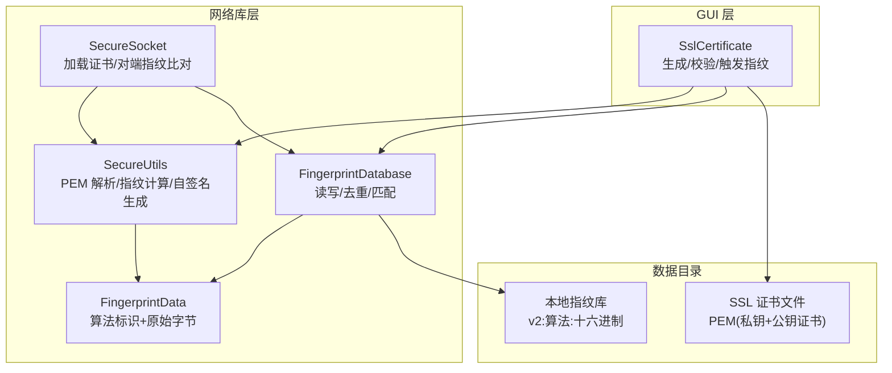
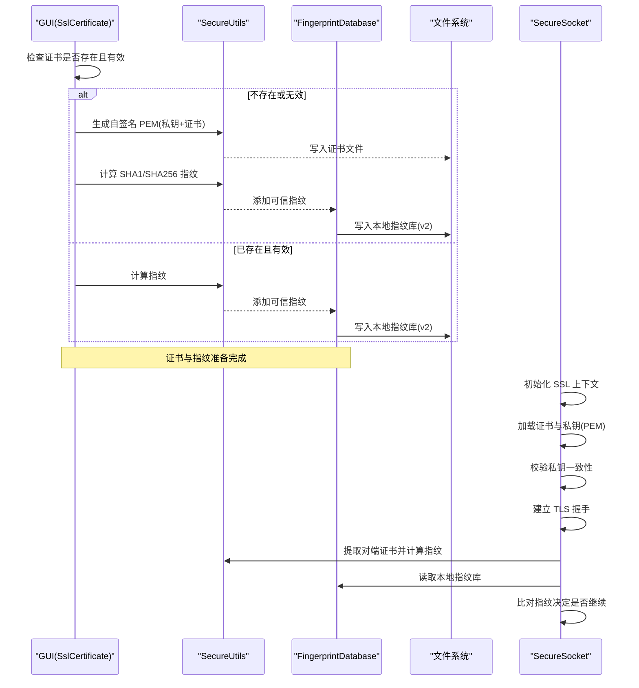
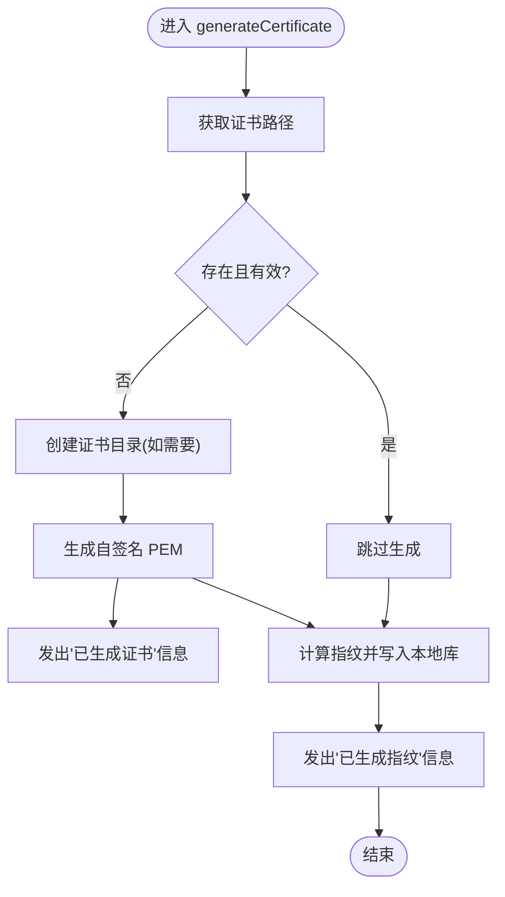
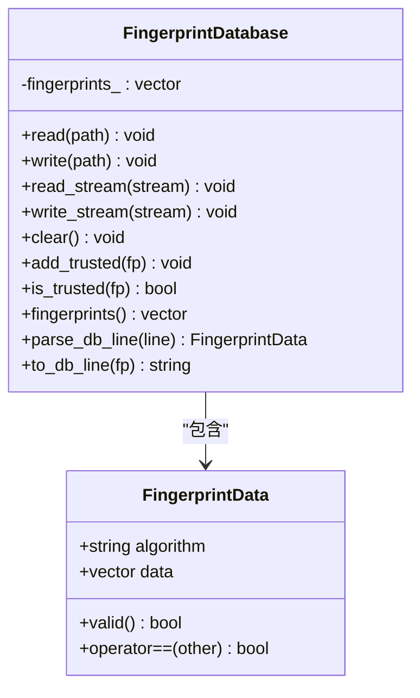
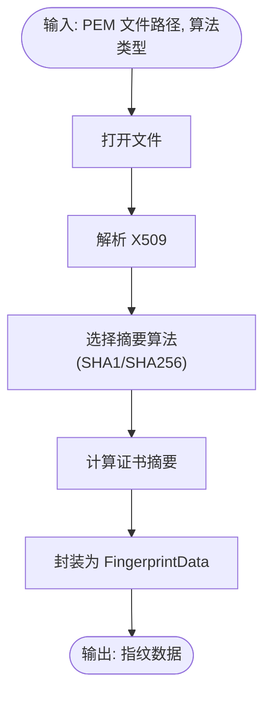
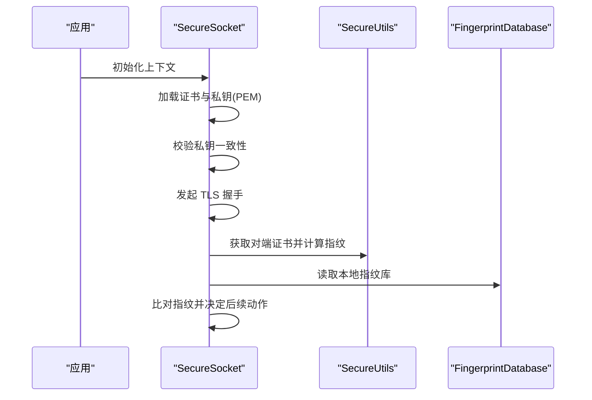
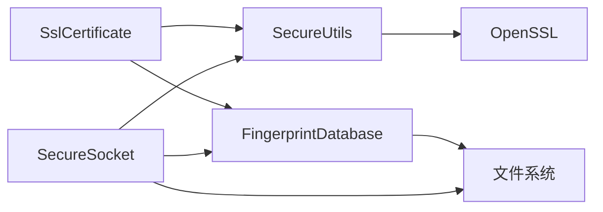

# 证书管理

<cite>
**本文引用的文件**   
- [SslCertificate.h](file://src/gui/src/SslCertificate.h)
- [SslCertificate.cpp](file://src/gui/src/SslCertificate.cpp)
- [FingerprintDatabase.h](file://src/lib/net/FingerprintDatabase.h)
- [FingerprintDatabase.cpp](file://src/lib/net/FingerprintDatabase.cpp)
- [SecureUtils.h](file://src/lib/net/SecureUtils.h)
- [SecureUtils.cpp](file://src/lib/net/SecureUtils.cpp)
- [FingerprintData.h](file://src/lib/net/FingerprintData.h)
- [SecureSocket.cpp](file://src/lib/net/SecureSocket.cpp)
- [DataDirectoriesCommon.cpp](file://src/lib/common/DataDirectoriesCommon.cpp)
</cite>

## 目录
1. [简介](#简介)
2. [项目结构](#项目结构)
3. [核心组件](#核心组件)
4. [架构总览](#架构总览)
5. [详细组件分析](#详细组件分析)
6. [依赖关系分析](#依赖关系分析)
7. [性能与安全性考虑](#性能与安全性考虑)
8. [故障排查指南](#故障排查指南)
9. [结论](#结论)
10. [附录](#附录)

## 简介
本技术文档聚焦 Input Leap 的证书管理系统，围绕以下目标展开：
- 详细说明 SslCertificate 类的设计与功能，包括证书的生成、加载、验证与管理操作。
- 解释指纹数据库 FingerprintDatabase 的工作原理，涵盖 SHA1 与 SHA256 指纹的计算、存储与比对机制。
- 说明证书文件格式要求、路径配置与权限设置。
- 详细描述证书验证流程，包括对端证书获取、解析与信任链验证策略。
- 提供证书管理的最佳实践（轮换、过期处理、故障恢复）。
- 给出配置文件示例与命令行工具使用建议。

## 项目结构
与证书管理相关的代码主要分布在 GUI 层与网络库层：
- GUI 层负责用户交互与证书生命周期管理（生成、校验、指纹写入）。
- 网络库层提供底层安全能力（PEM 解析、指纹计算、自签名证书生成）以及连接建立时的证书加载与对端指纹比对。

图表来源
- [SslCertificate.cpp:39-84](file://src/gui/src/SslCertificate.cpp#L39-L84)
- [SecureUtils.cpp:138-212](file://src/lib/net/SecureUtils.cpp#L138-L212)
- [FingerprintDatabase.cpp:26-133](file://src/lib/net/FingerprintDatabase.cpp#L26-L133)
- [SecureSocket.cpp:319-354](file://src/lib/net/SecureSocket.cpp#L319-L354)
- [SecureSocket.cpp:668-697](file://src/lib/net/SecureSocket.cpp#L668-L697)

章节来源
- [SslCertificate.h:24-43](file://src/gui/src/SslCertificate.h#L24-L43)
- [SslCertificate.cpp:39-84](file://src/gui/src/SslCertificate.cpp#L39-L84)
- [FingerprintDatabase.h:28-48](file://src/lib/net/FingerprintDatabase.h#L28-L48)
- [FingerprintDatabase.cpp:26-133](file://src/lib/net/FingerprintDatabase.cpp#L26-L133)
- [SecureUtils.h:28-38](file://src/lib/net/SecureUtils.h#L28-L38)
- [SecureUtils.cpp:117-212](file://src/lib/net/SecureUtils.cpp#L117-L212)
- [SecureSocket.cpp:319-354](file://src/lib/net/SecureSocket.cpp#L319-L354)
- [SecureSocket.cpp:668-697](file://src/lib/net/SecureSocket.cpp#L668-L697)

## 核心组件
- SslCertificate：面向 GUI 的证书管理入口，负责检测/生成 PEM 证书、校验证书有效性、计算并持久化指纹到本地数据库。
- SecureUtils：封装 OpenSSL 调用，提供 PEM 证书读取、X509 指纹计算（SHA1/SHA256）、自签名证书生成、指纹格式化与随机图生成等。
- FingerprintDatabase：本地指纹库的读写容器，支持 v2 行格式与旧版兼容，提供添加、去重、存在性判断。
- FingerprintData：指纹数据结构，包含算法名称与原始字节序列。
- SecureSocket：在建立 TLS 连接时加载服务端证书与私钥，并在握手后计算对端证书指纹并与本地指纹库比对。

章节来源
- [SslCertificate.h:24-43](file://src/gui/src/SslCertificate.h#L24-L43)
- [SslCertificate.cpp:39-84](file://src/gui/src/SslCertificate.cpp#L39-L84)
- [SecureUtils.h:28-38](file://src/lib/net/SecureUtils.h#L28-L38)
- [SecureUtils.cpp:117-212](file://src/lib/net/SecureUtils.cpp#L117-L212)
- [FingerprintDatabase.h:28-48](file://src/lib/net/FingerprintDatabase.h#L28-L48)
- [FingerprintDatabase.cpp:26-133](file://src/lib/net/FingerprintDatabase.cpp#L26-L133)
- [FingerprintData.h:26-44](file://src/lib/net/FingerprintData.h#L26-L44)
- [SecureSocket.cpp:319-354](file://src/lib/net/SecureSocket.cpp#L319-L354)
- [SecureSocket.cpp:668-697](file://src/lib/net/SecureSocket.cpp#L668-L697)

## 架构总览
下图展示了从“证书生成”到“连接建立与对端指纹比对”的整体流程。

图表来源
- [SslCertificate.cpp:39-84](file://src/gui/src/SslCertificate.cpp#L39-L84)
- [SecureUtils.cpp:138-212](file://src/lib/net/SecureUtils.cpp#L138-L212)
- [FingerprintDatabase.cpp:26-133](file://src/lib/net/FingerprintDatabase.cpp#L26-L133)
- [SecureSocket.cpp:319-354](file://src/lib/net/SecureSocket.cpp#L319-L354)
- [SecureSocket.cpp:668-697](file://src/lib/net/SecureSocket.cpp#L668-L697)

## 详细组件分析

### SslCertificate 类设计与实现
- 职责
  - 定位证书路径，若缺失或无效则生成自签名 PEM。
  - 校验现有证书的有效性（可解析、含合法公钥、密钥长度满足最低要求）。
  - 计算并持久化 SHA1/SHA256 指纹至本地指纹库。
- 关键流程
  - 生成：确保目录存在→调用底层生成 PEM→发出信息信号。
  - 校验：打开 PEM→解析 X509→提取公钥→校验类型与位数→返回布尔结果。
  - 指纹：读取 PEM→分别计算 SHA1/SHA256→写入本地指纹库→发出信息信号。
- 异常与信号
  - 通过 error/info/generateFinished 信号向 GUI 反馈状态。
  - 捕获底层异常并转换为友好提示。

图表来源
- [SslCertificate.cpp:39-84](file://src/gui/src/SslCertificate.cpp#L39-L84)
- [SslCertificate.cpp:86-126](file://src/gui/src/SslCertificate.cpp#L86-L126)

章节来源
- [SslCertificate.h:24-43](file://src/gui/src/SslCertificate.h#L24-L43)
- [SslCertificate.cpp:39-84](file://src/gui/src/SslCertificate.cpp#L39-L84)
- [SslCertificate.cpp:86-126](file://src/gui/src/SslCertificate.cpp#L86-L126)

### 指纹数据库 FingerprintDatabase
- 数据结构
  - 内部维护 FingerprintData 列表，每条记录包含算法字符串与原始字节。
- 文件格式
  - v2 行格式：以版本前缀开头，随后为算法名与十六进制数据，字段间以冒号分隔。
  - 兼容旧版：当行仅由 40 位十六进制组成且符合特定结构时，按 SHA1 解析。
- 核心 API
  - read/write：基于 UTF-8 路径的文件 I/O。
  - read_stream/write_stream：流式读写，便于扩展。
  - add_trusted/is_trusted：添加与存在性判断（自动去重）。
  - parse_db_line/to_db_line：行级序列化/反序列化。
- 复杂度
  - is_trusted 为线性查找 O(n)，n 为指纹条目数；通常 n 较小，开销可忽略。

图表来源
- [FingerprintDatabase.h:28-48](file://src/lib/net/FingerprintDatabase.h#L28-L48)
- [FingerprintDatabase.cpp:26-133](file://src/lib/net/FingerprintDatabase.cpp#L26-L133)
- [FingerprintData.h:26-44](file://src/lib/net/FingerprintData.h#L26-L44)

章节来源
- [FingerprintDatabase.h:28-48](file://src/lib/net/FingerprintDatabase.h#L28-L48)
- [FingerprintDatabase.cpp:26-133](file://src/lib/net/FingerprintDatabase.cpp#L26-L133)
- [FingerprintData.h:26-44](file://src/lib/net/FingerprintData.h#L26-L44)

### 安全工具 SecureUtils
- 能力概览
  - 从 PEM 文件解析 X509 证书。
  - 计算证书指纹（SHA1/SHA256），并以标准十六进制格式输出。
  - 生成自签名 PEM（包含私钥与证书），默认有效期一年，最小密钥长度 2048。
  - 生成指纹随机图（便于人工比对）。
- 关键点
  - 错误处理：文件不可读、解析失败、摘要计算失败均抛出异常。
  - 资源释放：使用 RAII 包装确保句柄与对象正确释放。

图表来源
- [SecureUtils.cpp:138-153](file://src/lib/net/SecureUtils.cpp#L138-L153)
- [SecureUtils.cpp:117-136](file://src/lib/net/SecureUtils.cpp#L117-L136)
- [SecureUtils.cpp:155-212](file://src/lib/net/SecureUtils.cpp#L155-L212)

章节来源
- [SecureUtils.h:28-38](file://src/lib/net/SecureUtils.h#L28-L38)
- [SecureUtils.cpp:117-212](file://src/lib/net/SecureUtils.cpp#L117-L212)

### 连接建立与对端证书验证（SecureSocket）
- 证书加载
  - 指定 PEM 路径后，依次加载证书与私钥，并进行私钥一致性检查。
- 对端指纹比对
  - 握手成功后，提取对端证书，计算 SHA1/SHA256 指纹。
  - 读取本地指纹库，若库非空则进行匹配；日志中会输出指纹与指纹库路径以便调试。
- 信任策略
  - 当前实现未启用严格的 CA 链验证回调（回调恒返回成功），实际信任判定依赖于本地指纹库匹配。

图表来源
- [SecureSocket.cpp:319-354](file://src/lib/net/SecureSocket.cpp#L319-L354)
- [SecureSocket.cpp:668-697](file://src/lib/net/SecureSocket.cpp#L668-L697)

章节来源
- [SecureSocket.cpp:319-354](file://src/lib/net/SecureSocket.cpp#L319-L354)
- [SecureSocket.cpp:668-697](file://src/lib/net/SecureSocket.cpp#L668-L697)

## 依赖关系分析
- 模块耦合
  - SslCertificate 依赖 SecureUtils 与 FingerprintDatabase，间接依赖文件系统与 OpenSSL。
  - SecureSocket 依赖 SecureUtils 与 FingerprintDatabase，用于运行时对端指纹比对。
- 外部依赖
  - OpenSSL：PEM 解析、X509 操作、摘要计算、RSA 密钥生成。
  - 平台无关文件系统抽象：UTF-8 路径、目录创建、文件读写。
- 潜在风险
  - 指纹库线性查找在小规模下可接受，但应监控条目增长。
  - 自签名证书无 CA 链验证，需依赖指纹库与人工确认。

图表来源
- [SslCertificate.cpp:39-84](file://src/gui/src/SslCertificate.cpp#L39-L84)
- [SecureSocket.cpp:319-354](file://src/lib/net/SecureSocket.cpp#L319-L354)
- [SecureSocket.cpp:668-697](file://src/lib/net/SecureSocket.cpp#L668-L697)

章节来源
- [SslCertificate.cpp:39-84](file://src/gui/src/SslCertificate.cpp#L39-L84)
- [SecureSocket.cpp:319-354](file://src/lib/net/SecureSocket.cpp#L319-L354)
- [SecureSocket.cpp:668-697](file://src/lib/net/SecureSocket.cpp#L668-L697)

## 性能与安全性考虑
- 性能
  - 指纹库写入与读取为顺序 I/O，条目较少时延迟极低。
  - 证书生成涉及 RSA 2048 位密钥生成与自签名，首次执行耗时较高，建议在后台线程或启动阶段预生成。
- 安全性
  - 最小密钥长度 2048 位，避免弱密钥。
  - 指纹算法优先使用 SHA256，SHA1 保留仅为兼容旧库。
  - 当前未启用严格 CA 链验证，信任边界由本地指纹库控制，需配合访问控制与备份策略。

[本节为通用指导，不直接分析具体文件]

## 故障排查指南
- 常见问题
  - 无法读取证书文件：检查路径是否存在、权限是否允许读取。
  - 证书无效：确保证书为 PEM 格式，包含合法的公钥与私钥，且私钥与证书匹配。
  - 指纹库为空或不匹配：确认指纹库路径是否正确，条目是否为 v2 格式。
- 诊断要点
  - 关注日志中的“peer fingerprint (SHA1): ... (SHA256): ...”与“fingerprint_db_path: ...”，用于核对对端指纹与使用的指纹库路径。
  - 若生成失败，检查目标目录是否存在及可写权限。

章节来源
- [SecureSocket.cpp:668-697](file://src/lib/net/SecureSocket.cpp#L668-L697)
- [SslCertificate.cpp:86-126](file://src/gui/src/SslCertificate.cpp#L86-L126)

## 结论
Input Leap 的证书管理采用“GUI 驱动 + 网络库支撑”的分层设计：GUI 负责证书生命周期管理与指纹入库，网络库负责运行时证书加载与对端指纹比对。通过 v2 格式的本地指纹库与 SHA256 优先策略，系统在易用性与安全性之间取得平衡。生产环境建议结合定期轮换、过期提醒与严格的目录权限控制，以确保长期稳定与安全。

[本节为总结性内容，不直接分析具体文件]

## 附录

### 证书文件格式与路径
- 证书文件
  - 格式：PEM，同时包含私钥与 X509 证书。
  - 位置：由 DataDirectories 提供的 ssl_certificate_path 确定，通常为 profile/SSL/InputLeap.pem。
- 指纹库文件
  - 格式：每行一条记录，v2 行格式为“v2:算法:十六进制数据”。
  - 位置：由 DataDirectories 提供的 local_ssl_fingerprints_path 确定。
- 历史迁移
  - 系统会在必要时将旧版 Barrier.pem 迁移为新文件名，并复制旧 SSL 目录到新 profile。

章节来源
- [DataDirectoriesCommon.cpp:21-60](file://src/lib/common/DataDirectoriesCommon.cpp#L21-L60)
- [FingerprintDatabase.cpp:91-133](file://src/lib/net/FingerprintDatabase.cpp#L91-L133)

### 配置文件示例与命令行使用建议
- 配置文件
  - 基础示例参考 doc/input-leap.conf.example，其中不包含证书相关参数。
  - 证书路径与指纹库路径由程序根据 profile 目录自动推导，无需在配置文件中显式声明。
- 命令行工具
  - 可通过 GUI 触发证书生成与指纹更新；或在服务/客户端启动时自动加载证书与指纹库。
  - 若需手动干预，请确保 PEM 文件与指纹库文件位于正确的 profile 目录下，并保持可读/可写权限。

章节来源
- [doc/input-leap.conf.example:1-38](file://doc/input-leap.conf.example#L1-L38)
- [SslCertificate.cpp:39-84](file://src/gui/src/SslCertificate.cpp#L39-L84)
- [SecureSocket.cpp:319-354](file://src/lib/net/SecureSocket.cpp#L319-L354)

### 最佳实践
- 证书轮换
  - 定期重新生成自签名证书，并同步更新指纹库。
  - 在切换期间，先部署新证书与指纹库，再重启服务，减少中断时间。
- 过期处理
  - 自签名证书默认有效期一年，应在到期前轮换。
  - 可在启动时检查证书有效期并告警。
- 故障恢复
  - 备份指纹库与证书文件，防止误删。
  - 若对端指纹不匹配，先核对指纹库路径与内容，再决定是否重新信任。
- 权限控制
  - 限制证书与指纹库文件的访问权限，仅允许受信任用户/进程读写。

[本节为通用指导，不直接分析具体文件]