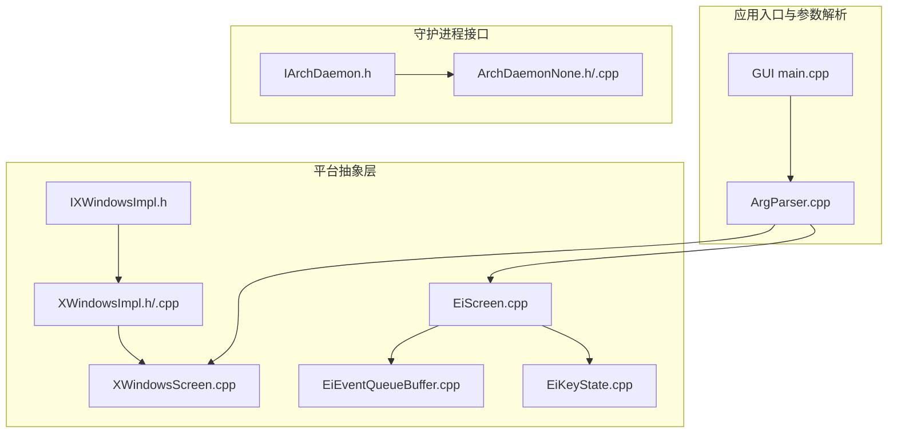
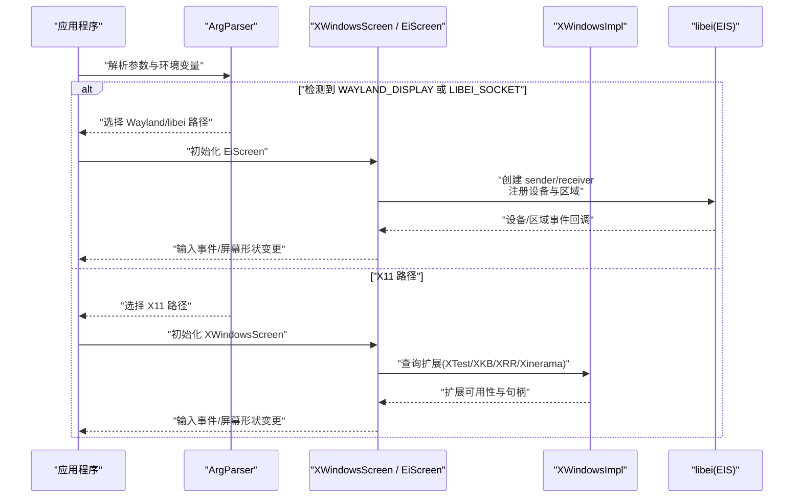
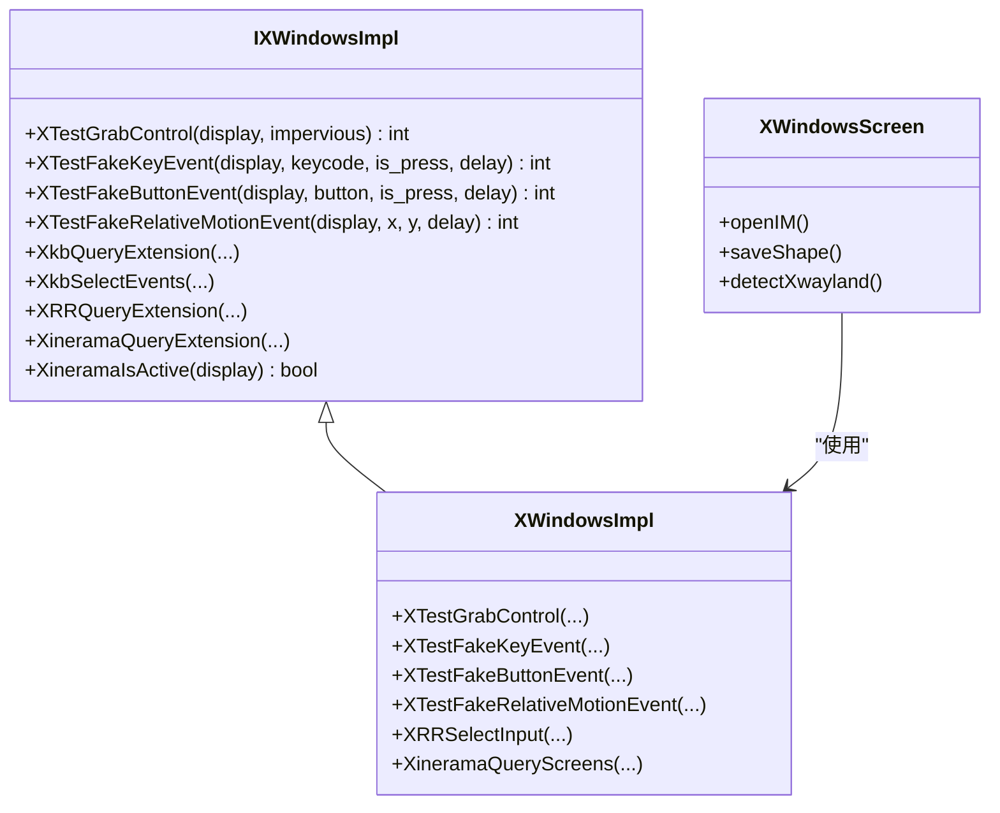
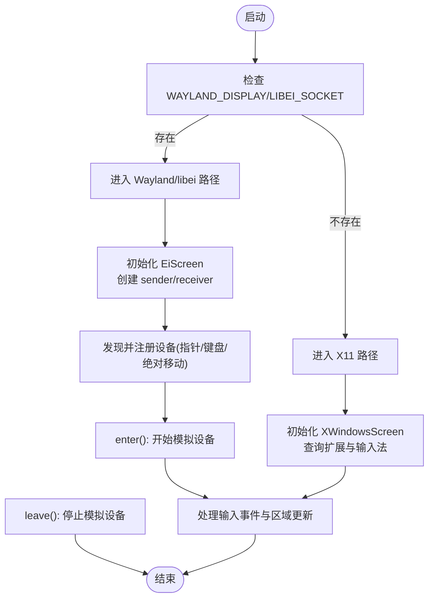
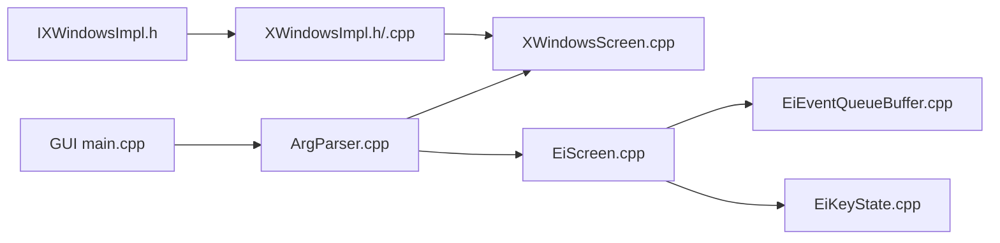

# Linux 平台支持

<cite>
**本文引用的文件**   
- [IXWindowsImpl.h](file://src/lib/platform/IXWindowsImpl.h)
- [XWindowsImpl.h](file://src/lib/platform/XWindowsImpl.h)
- [XWindowsImpl.cpp](file://src/lib/platform/XWindowsImpl.cpp)
- [XWindowsScreen.cpp](file://src/lib/platform/XWindowsScreen.cpp)
- [EiScreen.cpp](file://src/lib/platform/EiScreen.cpp)
- [EiEventQueueBuffer.cpp](file://src/lib/platform/EiEventQueueBuffer.cpp)
- [EiKeyState.cpp](file://src/lib/platform/EiKeyState.cpp)
- [ArgParser.cpp](file://src/lib/inputleap/ArgParser.cpp)
- [main.cpp（GUI）](file://src/gui/src/main.cpp)
- [README.md](file://README.md)
- [index.md（发行说明）](file://doc/release_notes/index.md)
- [ArchDaemonNone.h](file://src/lib/arch/ArchDaemonNone.h)
- [ArchDaemonNone.cpp](file://src/lib/arch/ArchDaemonNone.cpp)
- [IArchDaemon.h](file://src/lib/arch/IArchDaemon.h)
</cite>

## 目录
1. [简介](#简介)
2. [项目结构](#项目结构)
3. [核心组件](#核心组件)
4. [架构总览](#架构总览)
5. [详细组件分析](#详细组件分析)
6. [依赖关系分析](#依赖关系分析)
7. [性能与延迟优化](#性能与延迟优化)
8. [故障排除指南](#故障排除指南)
9. [结论](#结论)
10. [附录：桌面环境与包管理集成](#附录桌面环境与包管理集成)

## 简介
本文件聚焦 Input Leap 在 Linux 平台的实现与集成，重点覆盖以下方面：
- X11 协议使用：XTest 扩展输入模拟、XInput 2.0 高级设备支持、XFixes/XRandR/Xinerama 多显示器与屏幕几何、XKB 键盘布局。
- Wayland 兼容性与 libei 支持：通过 libei 进行输入事件发送/接收，Wayland 下剪贴板共享的限制与现状。
- 现代桌面环境集成：GNOME、KDE、XFCE 等环境下的行为差异与注意事项。
- 安装与服务化：不同发行版的包管理器状态、systemd 服务配置建议、udev 规则设置建议。
- 性能对比与优化：X11 vs Wayland 的输入延迟特性、多显示器场景优化策略。

## 项目结构
Linux 平台相关代码主要位于 src/lib/platform 与 src/lib/inputleap 中，GUI 启动逻辑在 src/gui/src/main.cpp，构建与依赖在顶层 CMakeLists.txt 中。

图表来源
- [IXWindowsImpl.h:1-192](file://src/lib/platform/IXWindowsImpl.h#L1-L192)
- [XWindowsImpl.h:1-65](file://src/lib/platform/XWindowsImpl.h#L1-L65)
- [XWindowsImpl.cpp:249-285](file://src/lib/platform/XWindowsImpl.cpp#L249-L285)
- [XWindowsScreen.cpp:895-935](file://src/lib/platform/XWindowsScreen.cpp#L895-L935)
- [EiScreen.cpp:114-457](file://src/lib/platform/EiScreen.cpp#L114-L457)
- [EiEventQueueBuffer.cpp:78-108](file://src/lib/platform/EiEventQueueBuffer.cpp#L78-L108)
- [EiKeyState.cpp:177-177](file://src/lib/platform/EiKeyState.cpp#L177-L177)
- [ArgParser.cpp:115-315](file://src/lib/inputleap/ArgParser.cpp#L115-L315)
- [main.cpp（GUI）:70-78](file://src/gui/src/main.cpp#L70-L78)
- [IArchDaemon.h:1-74](file://src/lib/arch/IArchDaemon.h#L1-L74)
- [ArchDaemonNone.h:37-51](file://src/lib/arch/ArchDaemonNone.h#L37-L51)
- [ArchDaemonNone.cpp:1-85](file://src/lib/arch/ArchDaemonNone.cpp#L1-L85)

章节来源
- [IXWindowsImpl.h:1-192](file://src/lib/platform/IXWindowsImpl.h#L1-L192)
- [XWindowsImpl.h:1-65](file://src/lib/platform/XWindowsImpl.h#L1-L65)
- [XWindowsImpl.cpp:249-285](file://src/lib/platform/XWindowsImpl.cpp#L249-L285)
- [XWindowsScreen.cpp:895-935](file://src/lib/platform/XWindowsScreen.cpp#L895-L935)
- [EiScreen.cpp:114-457](file://src/lib/platform/EiScreen.cpp#L114-L457)
- [EiEventQueueBuffer.cpp:78-108](file://src/lib/platform/EiEventQueueBuffer.cpp#L78-L108)
- [EiKeyState.cpp:177-177](file://src/lib/platform/EiKeyState.cpp#L177-L177)
- [ArgParser.cpp:115-315](file://src/lib/inputleap/ArgParser.cpp#L115-L315)
- [main.cpp（GUI）:70-78](file://src/gui/src/main.cpp#L70-L78)
- [IArchDaemon.h:1-74](file://src/lib/arch/IArchDaemon.h#L1-L74)
- [ArchDaemonNone.h:37-51](file://src/lib/arch/ArchDaemonNone.h#L37-L51)
- [ArchDaemonNone.cpp:1-85](file://src/lib/arch/ArchDaemonNone.cpp#L1-L85)

## 核心组件
- X11 平台抽象与实现
  - IXWindowsImpl 定义 X11 能力接口，包含 XTest、XKB、XRandR、Xinerama、XInput2 等扩展方法声明。
  - XWindowsImpl 提供具体实现，封装对底层 Xlib/XTest/XKB/XRR/Xinerama 的调用。
  - XWindowsScreen 负责窗口、输入法（XIM）、屏幕形状、XKB 状态、XRR 事件监听、XTest 输入模拟等。
- Wayland/libei 平台实现
  - EiScreen 基于 libei 完成指针、键盘、绝对移动设备的模拟与区域计算。
  - EiEventQueueBuffer 将 libei 事件适配到内部事件队列。
  - EiKeyState 处理 evdev keycode 到 X keycode 的映射。
- 平台检测与运行模式选择
  - ArgParser 根据 WAYLAND_DISPLAY/LIBEI_SOCKET 等环境变量判断是否进入 Wayland/libei 路径。
  - GUI main.cpp 在检测到 Wayland 时给出提示，说明当前支持范围与限制。

章节来源
- [IXWindowsImpl.h:1-192](file://src/lib/platform/IXWindowsImpl.h#L1-L192)
- [XWindowsImpl.h:1-65](file://src/lib/platform/XWindowsImpl.h#L1-L65)
- [XWindowsImpl.cpp:249-285](file://src/lib/platform/XWindowsImpl.cpp#L249-L285)
- [XWindowsScreen.cpp:895-935](file://src/lib/platform/XWindowsScreen.cpp#L895-L935)
- [EiScreen.cpp:114-457](file://src/lib/platform/EiScreen.cpp#L114-L457)
- [EiEventQueueBuffer.cpp:78-108](file://src/lib/platform/EiEventQueueBuffer.cpp#L78-L108)
- [EiKeyState.cpp:177-177](file://src/lib/platform/EiKeyState.cpp#L177-L177)
- [ArgParser.cpp:115-315](file://src/lib/inputleap/ArgParser.cpp#L115-L315)
- [main.cpp（GUI）:70-78](file://src/gui/src/main.cpp#L70-L78)

## 架构总览
下图展示 X11 与 Wayland/libei 两条路径在运行时如何被选择与执行。

图表来源
- [ArgParser.cpp:115-315](file://src/lib/inputleap/ArgParser.cpp#L115-L315)
- [XWindowsScreen.cpp:895-935](file://src/lib/platform/XWindowsScreen.cpp#L895-L935)
- [EiScreen.cpp:114-457](file://src/lib/platform/EiScreen.cpp#L114-L457)

## 详细组件分析

### X11 输入模拟与扩展使用
- XTest 扩展
  - 用于注入按键、鼠标按钮与相对/绝对运动事件；XWindowsImpl 提供 XTestFakeKeyEvent、XTestFakeButtonEvent、XTestFakeRelativeMotionEvent 等封装。
  - XWindowsScreen 在启用/禁用阶段会抓取控制并触发模拟事件。
- XKB 键盘布局与状态
  - 通过 XkbQueryExtension、XkbSelectEvents 订阅键位图与状态变化，维护全局键盘状态。
- XRandR 与 Xinerama 多显示器
  - 查询并监听屏幕变化事件，更新逻辑屏幕尺寸与中心点，确保跨屏移动与坐标转换正确。
- XInput 2.0
  - 接口中包含 XInput2 头文件引用，表明具备高级输入设备能力的基础设施；实际使用需结合具体设备枚举与事件处理。
- XFixes
  - 虽未在关键片段直接出现，但 XFixes 常用于光标/选区等图形修复，若需要可在此抽象层增加对应封装。

图表来源
- [IXWindowsImpl.h:1-192](file://src/lib/platform/IXWindowsImpl.h#L1-L192)
- [XWindowsImpl.h:1-65](file://src/lib/platform/XWindowsImpl.h#L1-L65)
- [XWindowsImpl.cpp:249-285](file://src/lib/platform/XWindowsImpl.cpp#L249-L285)
- [XWindowsScreen.cpp:895-935](file://src/lib/platform/XWindowsScreen.cpp#L895-L935)

章节来源
- [IXWindowsImpl.h:1-192](file://src/lib/platform/IXWindowsImpl.h#L1-L192)
- [XWindowsImpl.h:1-65](file://src/lib/platform/XWindowsImpl.h#L1-L65)
- [XWindowsImpl.cpp:249-285](file://src/lib/platform/XWindowsImpl.cpp#L249-L285)
- [XWindowsScreen.cpp:895-935](file://src/lib/platform/XWindowsScreen.cpp#L895-L935)

### Wayland 兼容性与 libei 支持
- 运行模式选择
  - 当存在 WAYLAND_DISPLAY 或 LIBEI_SOCKET 时，程序进入 Wayland/libei 路径。
- libei 事件流
  - EiScreen 初始化 receiver/sender，注册 seat 与设备（指针、键盘、绝对移动），并在 enter/leave 生命周期内启停模拟。
  - 键盘事件将 evdev keycode 转换为 X keycode 后上报。
- 剪贴板
  - README 明确 Linux/Wayland 下剪贴板共享不受支持。
- GUI 提示
  - 在 Wayland 环境下启动 GUI 时会弹出提示，说明支持范围与兼容性可能因桌面环境而异。

图表来源
- [ArgParser.cpp:115-315](file://src/lib/inputleap/ArgParser.cpp#L115-L315)
- [EiScreen.cpp:114-457](file://src/lib/platform/EiScreen.cpp#L114-L457)
- [EiEventQueueBuffer.cpp:78-108](file://src/lib/platform/EiEventQueueBuffer.cpp#L78-L108)
- [EiKeyState.cpp:177-177](file://src/lib/platform/EiKeyState.cpp#L177-L177)
- [main.cpp（GUI）:70-78](file://src/gui/src/main.cpp#L70-L78)
- [README.md:30-30](file://README.md#L30-L30)

章节来源
- [ArgParser.cpp:115-315](file://src/lib/inputleap/ArgParser.cpp#L115-L315)
- [EiScreen.cpp:114-457](file://src/lib/platform/EiScreen.cpp#L114-L457)
- [EiEventQueueBuffer.cpp:78-108](file://src/lib/platform/EiEventQueueBuffer.cpp#L78-L108)
- [EiKeyState.cpp:177-177](file://src/lib/platform/EiKeyState.cpp#L177-L177)
- [main.cpp（GUI）:70-78](file://src/gui/src/main.cpp#L70-L78)
- [README.md:30-30](file://README.md#L30-L30)

### XWayland 支持状态
- XWindowsScreen 在连接显示服务器后会尝试检测 XWAYLAND 扩展，若发现运行于 XWayland，则记录警告日志，提示“不会按预期工作”。
- 这意味着在纯 Wayland 会话中通过 XWayland 运行 X11 客户端并非推荐路径，应优先使用原生 Wayland/libei 路径。

章节来源
- [XWindowsScreen.cpp:121-122](file://src/lib/platform/XWindowsScreen.cpp#L121-L122)
- [XWindowsScreen.cpp:2030-2033](file://src/lib/platform/XWindowsScreen.cpp#L2030-L2033)

### 守护进程与系统服务
- 守护进程接口
  - IArchDaemon 定义了安装/卸载与 daemonize 的抽象接口。
  - ArchDaemonNone 为非守护进程实现，Linux 默认不提供内置 systemd 集成，通常由发行版打包脚本或服务单元负责。
- 建议的系统服务配置
  - 使用 systemd user service 以当前用户身份启动 input-leaps（服务端）与 input-leapc（客户端）。
  - 在 Wayland 下确保 WAYLAND_DISPLAY 或 LIBEI_SOCKET 环境变量可用；在 X11 下确保 DISPLAY 已设置。
  - 如需访问原始输入设备（例如某些高级功能），考虑 udev 规则授予权限（见附录）。

章节来源
- [IArchDaemon.h:1-74](file://src/lib/arch/IArchDaemon.h#L1-L74)
- [ArchDaemonNone.h:37-51](file://src/lib/arch/ArchDaemonNone.h#L37-L51)
- [ArchDaemonNone.cpp:1-85](file://src/lib/arch/ArchDaemonNone.cpp#L1-L85)

## 依赖关系分析
- 平台抽象与实现解耦
  - IXWindowsImpl 作为接口，XWindowsImpl 提供具体实现，XWindowsScreen 依赖该实现进行 X11 交互。
- Wayland/libei 独立路径
  - EiScreen 及其缓冲与键态模块构成独立的 Wayland 输入栈，不依赖 X11 抽象。
- 运行时选择
  - ArgParser 依据环境变量决定采用哪条路径，GUI 在 Wayland 下给出提示。

图表来源
- [IXWindowsImpl.h:1-192](file://src/lib/platform/IXWindowsImpl.h#L1-L192)
- [XWindowsImpl.h:1-65](file://src/lib/platform/XWindowsImpl.h#L1-L65)
- [XWindowsImpl.cpp:249-285](file://src/lib/platform/XWindowsImpl.cpp#L249-L285)
- [XWindowsScreen.cpp:895-935](file://src/lib/platform/XWindowsScreen.cpp#L895-L935)
- [EiScreen.cpp:114-457](file://src/lib/platform/EiScreen.cpp#L114-L457)
- [EiEventQueueBuffer.cpp:78-108](file://src/lib/platform/EiEventQueueBuffer.cpp#L78-L108)
- [EiKeyState.cpp:177-177](file://src/lib/platform/EiKeyState.cpp#L177-L177)
- [ArgParser.cpp:115-315](file://src/lib/inputleap/ArgParser.cpp#L115-L315)
- [main.cpp（GUI）:70-78](file://src/gui/src/main.cpp#L70-L78)

章节来源
- [IXWindowsImpl.h:1-192](file://src/lib/platform/IXWindowsImpl.h#L1-L192)
- [XWindowsImpl.h:1-65](file://src/lib/platform/XWindowsImpl.h#L1-L65)
- [XWindowsImpl.cpp:249-285](file://src/lib/platform/XWindowsImpl.cpp#L249-L285)
- [XWindowsScreen.cpp:895-935](file://src/lib/platform/XWindowsScreen.cpp#L895-L935)
- [EiScreen.cpp:114-457](file://src/lib/platform/EiScreen.cpp#L114-L457)
- [EiEventQueueBuffer.cpp:78-108](file://src/lib/platform/EiEventQueueBuffer.cpp#L78-L108)
- [EiKeyState.cpp:177-177](file://src/lib/platform/EiKeyState.cpp#L177-L177)
- [ArgParser.cpp:115-315](file://src/lib/inputleap/ArgParser.cpp#L115-L315)
- [main.cpp（GUI）:70-78](file://src/gui/src/main.cpp#L70-L78)

## 性能与延迟优化
- X11 路径
  - XTest 注入事件通常具有较低开销，适合低延迟需求；在多显示器场景下，合理配置 Xinerama/XRandR 可减少不必要的坐标重算。
  - 避免频繁切换焦点与窗口层级，减少 XServer 往返。
- Wayland/libei 路径
  - 事件经 EIS 转发，延迟受桌面环境实现影响；部分 WM/DE 对 libei 的支持仍在完善中。
  - 建议在支持的 DE（如较新 GNOME/KDE）下测试，以获得更稳定的延迟表现。
- 通用优化建议
  - 减少不必要的屏幕形状查询与事件处理频率。
  - 在 Wayland 下确保仅启用必要的设备能力，避免多余的设备枚举与区域计算。
  - 对于高刷新率显示器，关注事件帧率与节流策略，避免过载。

[本节为通用指导，无需特定文件来源]

## 故障排除指南
- Wayland 剪贴板不可用
  - 现象：复制粘贴无效。
  - 原因：README 明确 Linux/Wayland 下剪贴板共享不受支持。
  - 解决：在 X11 会话中使用，或等待后续支持。
- 运行在 XWayland 下导致异常
  - 现象：行为不符合预期。
  - 原因：XWindowsScreen 检测到 XWAYLAND 扩展并记录警告。
  - 解决：切换到原生 Wayland 并使用 libei 路径，或回到 X11 会话。
- Wayland 下 GUI 提示兼容性差异
  - 现象：启动 GUI 时弹出 Wayland 支持提示。
  - 原因：不同桌面环境对 libei 支持程度不一。
  - 解决：参考附录中的桌面环境建议，必要时回退至 X11 会话验证问题。
- 无法连接到显示服务器
  - 现象：X11 无法打开 DISPLAY，Wayland 无法获取 WAYLAND_DISPLAY/LIBEI_SOCKET。
  - 解决：确认环境变量与用户会话；systemd user service 中显式导出所需变量。

章节来源
- [README.md:30-30](file://README.md#L30-L30)
- [XWindowsScreen.cpp:121-122](file://src/lib/platform/XWindowsScreen.cpp#L121-L122)
- [XWindowsScreen.cpp:2030-2033](file://src/lib/platform/XWindowsScreen.cpp#L2030-L2033)
- [main.cpp（GUI）:70-78](file://src/gui/src/main.cpp#L70-L78)

## 结论
Input Leap 在 Linux 上提供了双轨方案：成熟的 X11 路径（XTest/XKB/XRandR/Xinerama/XInput2）与面向未来的 Wayland/libei 路径。X11 在输入模拟与多显示器支持方面较为稳定；Wayland 路径在剪贴板等方面仍有局限，且依赖桌面环境的 libei 支持质量。生产部署建议优先评估目标桌面对 libei 的支持情况，并结合 systemd 与必要的环境变量进行服务化配置。

[本节为总结性内容，无需特定文件来源]

## 附录：桌面环境与包管理集成
- 发行版包管理器
  - 官方 README 指向 repology 页面汇总各发行版打包状态，便于查找 deb/rpm 等包信息。
- systemd 服务配置建议
  - 使用 user service 启动 input-leaps 与 input-leapc。
  - Wayland 下确保 WAYLAND_DISPLAY 或 LIBEI_SOCKET 可用；X11 下确保 DISPLAY 可用。
  - 若需要访问原始输入设备（例如某些高级功能），可为相应设备节点添加 udev 规则，使服务用户具备读取权限。
- 桌面环境集成要点
  - GNOME/KDE/XFCE：在 Wayland 下优先使用 libei 路径；若遇到兼容性问题，可临时切换至 X11 会话定位问题。
  - 注意：Wayland 下剪贴板共享目前不受支持（参见 README）。

章节来源
- [README.md:94-97](file://README.md#L94-L97)
- [index.md（发行说明）:39-44](file://doc/release_notes/index.md#L39-L44)
- [ArgParser.cpp:308-315](file://src/lib/inputleap/ArgParser.cpp#L308-L315)