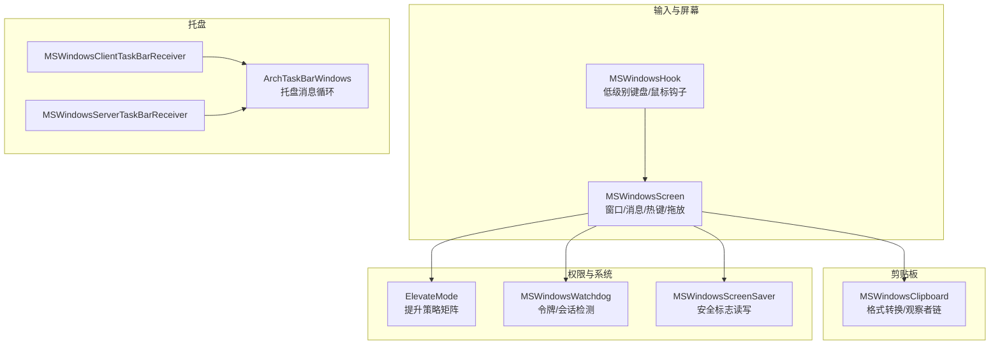
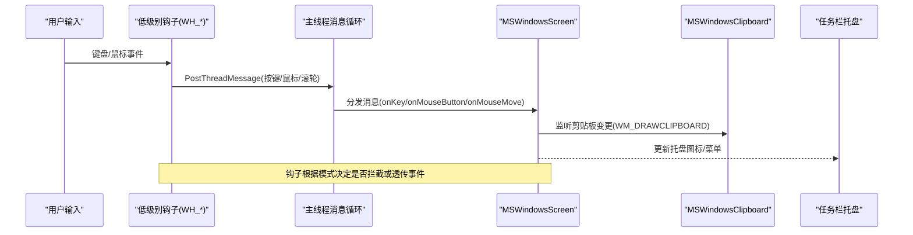
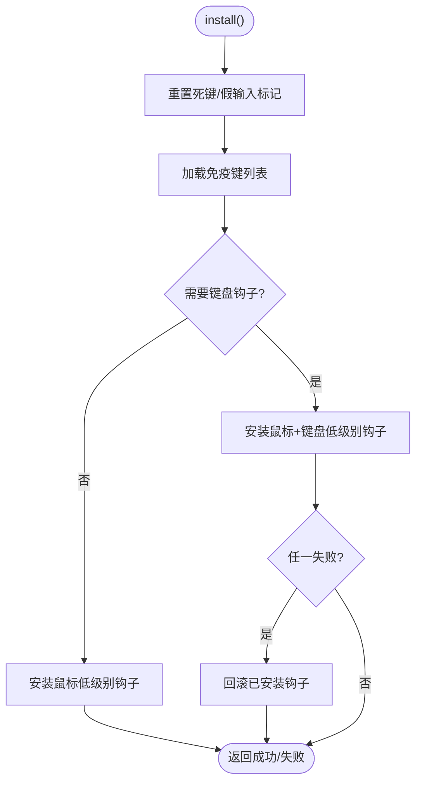
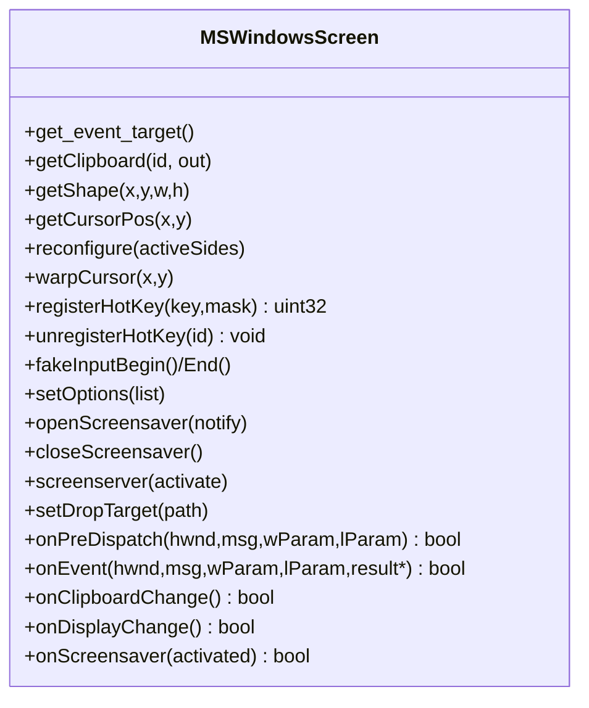
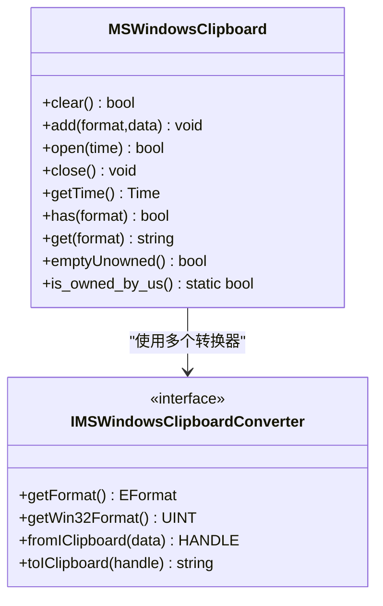
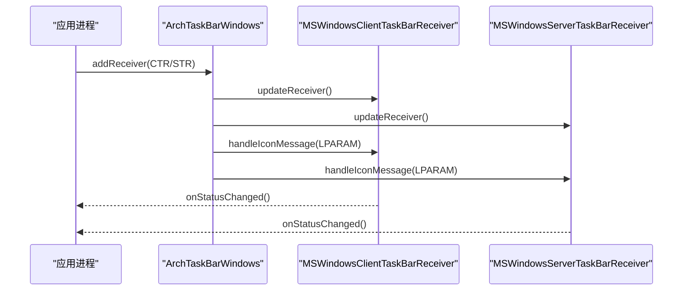
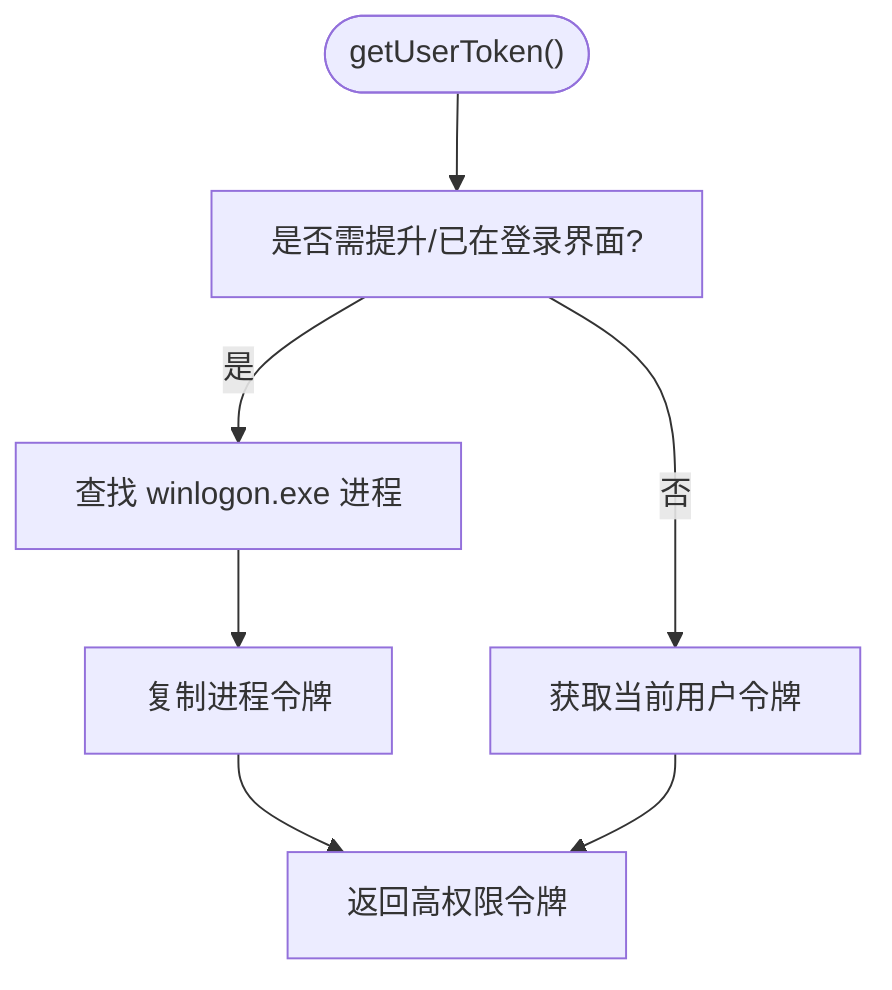
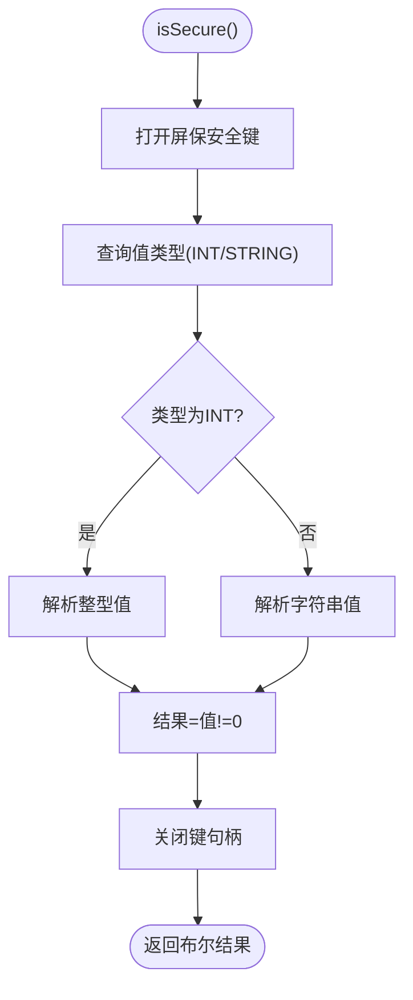
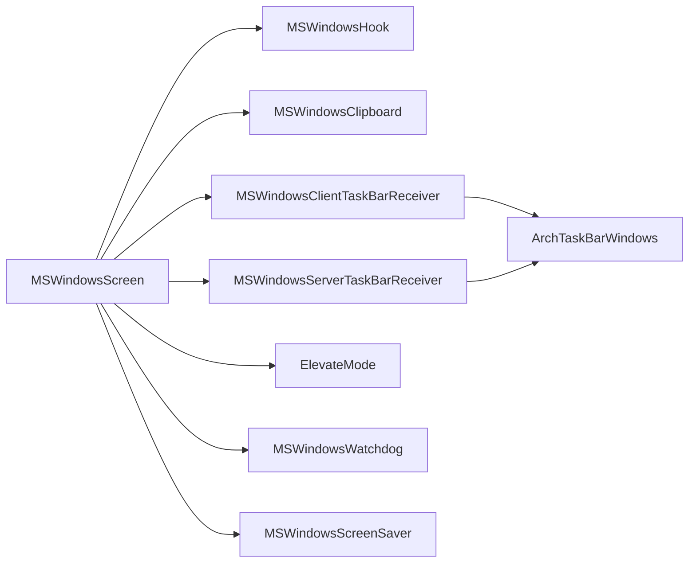

# Windows 平台支持

<cite>
**本文引用的文件**   
- [MSWindowsHook.h](file://src/lib/platform/MSWindowsHook.h)
- [MSWindowsHook.cpp](file://src/lib/platform/MSWindowsHook.cpp)
- [synwinhk.h](file://src/lib/platform/synwinhk.h)
- [MSWindowsScreen.h](file://src/lib/platform/MSWindowsScreen.h)
- [MSWindowsClipboard.h](file://src/lib/platform/MSWindowsClipboard.h)
- [MSWindowsClientTaskBarReceiver.h](file://src/client/MSWindowsClientTaskBarReceiver.h)
- [MSWindowsServerTaskBarReceiver.h](file://src/server/MSWindowsServerTaskBarReceiver.h)
- [ArchTaskBarWindows.h](file://src/lib/arch/win32/ArchTaskBarWindows.h)
- [ElevateMode.h](file://src/gui/src/ElevateMode.h)
- [MSWindowsWatchdog.cpp](file://src/lib/platform/MSWindowsWatchdog.cpp)
- [MSWindowsScreenSaver.cpp](file://src/lib/platform/MSWindowsScreenSaver.cpp)
</cite>

## 目录
1. [简介](#简介)
2. [项目结构](#项目结构)
3. [核心组件](#核心组件)
4. [架构总览](#架构总览)
5. [详细组件分析](#详细组件分析)
6. [依赖关系分析](#依赖关系分析)
7. [性能考虑](#性能考虑)
8. [故障排除指南](#故障排除指南)
9. [结论](#结论)
10. [附录](#附录)

## 简介
本文件面向在 Windows 平台上集成与扩展 Input Leap 的开发者与维护者，系统性阐述 Windows 特定的输入捕获机制、系统托盘集成、热键注册、剪贴板监控、权限管理与系统集成（UAC、无障碍访问、防火墙）等关键主题。文档同时提供代码级架构图、序列图与流程图，帮助读者快速理解实现细节并指导新功能适配。

## 项目结构
Input Leap 在 Windows 上的关键实现分布在以下位置：
- 输入钩子与屏幕事件处理：src/lib/platform/MSWindowsHook.*、src/lib/platform/MSWindowsScreen.h
- 剪贴板子系统：src/lib/platform/MSWindowsClipboard.h
- 任务栏托盘：src/client/MSWindowsClientTaskBarReceiver.h、src/server/MSWindowsServerTaskBarReceiver.h、src/lib/arch/win32/ArchTaskBarWindows.h
- 权限与提升策略：src/gui/src/ElevateMode.h、src/lib/platform/MSWindowsWatchdog.cpp
- 屏保与安全状态：src/lib/platform/MSWindowsScreenSaver.cpp

图表来源
- [MSWindowsHook.h:1-45](file://src/lib/platform/MSWindowsHook.h#L1-L45)
- [MSWindowsScreen.h:1-349](file://src/lib/platform/MSWindowsScreen.h#L1-L349)
- [MSWindowsClipboard.h:1-120](file://src/lib/platform/MSWindowsClipboard.h#L1-L120)
- [MSWindowsClientTaskBarReceiver.h:1-66](file://src/client/MSWindowsClientTaskBarReceiver.h#L1-L66)
- [MSWindowsServerTaskBarReceiver.h:1-70](file://src/server/MSWindowsServerTaskBarReceiver.h#L1-L70)
- [ArchTaskBarWindows.h:1-115](file://src/lib/arch/win32/ArchTaskBarWindows.h#L1-L115)
- [ElevateMode.h:1-42](file://src/gui/src/ElevateMode.h#L1-L42)
- [MSWindowsWatchdog.cpp:130-170](file://src/lib/platform/MSWindowsWatchdog.cpp#L130-L170)
- [MSWindowsScreenSaver.cpp:305-359](file://src/lib/platform/MSWindowsScreenSaver.cpp#L305-L359)

章节来源
- [MSWindowsHook.h:1-45](file://src/lib/platform/MSWindowsHook.h#L1-L45)
- [MSWindowsScreen.h:1-349](file://src/lib/platform/MSWindowsScreen.h#L1-L349)
- [MSWindowsClipboard.h:1-120](file://src/lib/platform/MSWindowsClipboard.h#L1-L120)
- [MSWindowsClientTaskBarReceiver.h:1-66](file://src/client/MSWindowsClientTaskBarReceiver.h#L1-L66)
- [MSWindowsServerTaskBarReceiver.h:1-70](file://src/server/MSWindowsServerTaskBarReceiver.h#L1-L70)
- [ArchTaskBarWindows.h:1-115](file://src/lib/arch/win32/ArchTaskBarWindows.h#L1-L115)
- [ElevateMode.h:1-42](file://src/gui/src/ElevateMode.h#L1-L42)
- [MSWindowsWatchdog.cpp:130-170](file://src/lib/platform/MSWindowsWatchdog.cpp#L130-L170)
- [MSWindowsScreenSaver.cpp:305-359](file://src/lib/platform/MSWindowsScreenSaver.cpp#L305-L359)

## 核心组件
- 输入钩子系统
  - 通过 WH_KEYBOARD_LL 与 WH_MOUSE_LL 低级别钩子捕获全局键盘与鼠标事件，内部维护死键状态、免疫键列表、假输入标记，并将事件投递到主线程消息队列供上层处理。
  - 支持“仅鼠标”模式与“键盘+鼠标”模式，失败时回滚已安装的钩子。
- 屏幕与消息中心
  - 作为主窗口消息分发中枢，处理热键、显示变化、电源事件、剪贴板变更、屏保通知等；负责光标定位、跳区判断、按键模拟与拖放目标管理。
- 剪贴板子系统
  - 基于 Win32 剪贴板 API 与观察者链，提供多格式转换器接口，统一抽象 IClipboard 能力。
- 任务栏托盘
  - 客户端与服务端各自实现托盘接收器，统一由 ArchTaskBarWindows 管理图标、菜单与消息循环。
- 权限与提升
  - 提供三种提升模式矩阵（按需/总是/从不），结合会话与登录界面检测决定是否需要以管理员令牌运行。
- 屏保与安全状态
  - 读取/写入用户配置项以判断屏保是否启用密码保护，兼容不同 Windows 版本的值类型差异。

章节来源
- [MSWindowsHook.cpp:565-643](file://src/lib/platform/MSWindowsHook.cpp#L565-L643)
- [MSWindowsScreen.h:100-126](file://src/lib/platform/MSWindowsScreen.h#L100-L126)
- [MSWindowsClipboard.h:35-88](file://src/lib/platform/MSWindowsClipboard.h#L35-L88)
- [MSWindowsClientTaskBarReceiver.h:27-66](file://src/client/MSWindowsClientTaskBarReceiver.h#L27-L66)
- [MSWindowsServerTaskBarReceiver.h:27-70](file://src/server/MSWindowsServerTaskBarReceiver.h#L27-L70)
- [ArchTaskBarWindows.h:35-115](file://src/lib/arch/win32/ArchTaskBarWindows.h#L35-L115)
- [ElevateMode.h:20-41](file://src/gui/src/ElevateMode.h#L20-L41)
- [MSWindowsScreenSaver.cpp:305-359](file://src/lib/platform/MSWindowsScreenSaver.cpp#L305-L359)

## 架构总览
下图展示了 Windows 平台下输入捕获、事件分发与系统集成的整体交互。

图表来源
- [MSWindowsHook.cpp:440-563](file://src/lib/platform/MSWindowsHook.cpp#L440-L563)
- [MSWindowsScreen.h:155-174](file://src/lib/platform/MSWindowsScreen.h#L155-L174)
- [MSWindowsClipboard.h:35-88](file://src/lib/platform/MSWindowsClipboard.h#L35-L88)
- [MSWindowsClientTaskBarReceiver.h:27-66](file://src/client/MSWindowsClientTaskBarReceiver.h#L27-L66)
- [MSWindowsServerTaskBarReceiver.h:27-70](file://src/server/MSWindowsServerTaskBarReceiver.h#L27-L70)

## 详细组件分析

### 输入钩子系统（键盘与鼠标）
- 安装与卸载
  - install() 会加载“免疫键”列表，重置死键与假输入标记，按编译选项选择仅鼠标或键盘+鼠标双钩子；任一失败则回滚。
  - uninstall() 清理状态并卸载所有钩子。
- 键盘钩子
  - 使用 ToUnicode/ToAscii 将虚拟键码映射为字符，处理死键组合、AltGr 特殊路径、大小写/数字锁定状态同步。
  - 通过 PostThreadMessage 将按键事件投递给主线程，屏蔽非动作键或免疫键。
- 鼠标钩子
  - 处理按钮按下/释放、双击、滚轮（垂直/水平）、移动事件；在“监视跳区”模式下对越界坐标进行钳制并计算是否在跳区内。
- 屏保消息钩子
  - 安装 WH_GETMESSAGE 钩子以捕获 WM_SYSCOMMAND(SC_SCREENSAVE)，向主线程广播屏保启动消息。

图表来源
- [MSWindowsHook.cpp:565-643](file://src/lib/platform/MSWindowsHook.cpp#L565-L643)
- [MSWindowsHook.cpp:440-563](file://src/lib/platform/MSWindowsHook.cpp#L440-L563)
- [MSWindowsHook.cpp:610-640](file://src/lib/platform/MSWindowsHook.cpp#L610-L640)

章节来源
- [MSWindowsHook.cpp:565-643](file://src/lib/platform/MSWindowsHook.cpp#L565-L643)
- [MSWindowsHook.cpp:440-563](file://src/lib/platform/MSWindowsHook.cpp#L440-L563)
- [MSWindowsHook.cpp:610-640](file://src/lib/platform/MSWindowsHook.cpp#L610-L640)

### 屏幕与消息中心（MSWindowsScreen）
- 职责
  - 创建窗口类与窗口，注册热键，处理显示变化、电源广播、剪贴板观察者链、屏保通知。
  - 维护光标位置、跳区尺寸、按键状态、拖放目标、鼠标可见性修复。
- 热键注册
  - 提供 registerHotKey/unregisterHotKey 接口，内部维护 HotKeyMap 与 ID 映射。
- 剪贴板监听
  - 作为剪贴板查看器链节点，处理 WM_DRAWCLIPBOARD 与 WM_CHANGECBCHAIN，转发并调用 onClipboardChange。
- 屏保与电源
  - 处理 WM_POWERBROADCAST 的挂起/恢复事件，触发屏幕挂起/恢复事件。

图表来源
- [MSWindowsScreen.h:42-126](file://src/lib/platform/MSWindowsScreen.h#L42-L126)
- [MSWindowsScreen.h:155-174](file://src/lib/platform/MSWindowsScreen.h#L155-L174)

章节来源
- [MSWindowsScreen.h:42-126](file://src/lib/platform/MSWindowsScreen.h#L42-L126)
- [MSWindowsScreen.h:155-174](file://src/lib/platform/MSWindowsScreen.h#L155-L174)

### 剪贴板子系统（MSWindowsClipboard）
- 设计要点
  - 封装 Win32 剪贴板 API，暴露统一的 IClipboard 接口。
  - 通过 IMSWindowsClipboardConverter 抽象多种格式转换器（文本、HTML、位图等）。
  - 支持“无所有权清空”操作，用于区分数据源以避免回环。
- 观察者链
  - 作为剪贴板查看器链的一部分，正确转发 WM_DRAWCLIPBOARD 与 WM_CHANGECBCHAIN，确保与其他应用共存。

图表来源
- [MSWindowsClipboard.h:35-117](file://src/lib/platform/MSWindowsClipboard.h#L35-L117)

章节来源
- [MSWindowsClipboard.h:35-117](file://src/lib/platform/MSWindowsClipboard.h#L35-L117)

### 任务栏托盘集成
- 客户端与服务端托盘接收器
  - 分别继承 ClientTaskBarReceiver / ServerTaskBarReceiver，实现 showStatus、runMenu、primaryAction、getIcon 等。
  - 维护图标数组与日志缓冲，响应状态变化更新托盘图标。
- 托盘消息循环
  - ArchTaskBarWindows 统一管理托盘图标、菜单与消息分发，支持对话框消息处理与线程间协调。

图表来源
- [MSWindowsClientTaskBarReceiver.h:27-66](file://src/client/MSWindowsClientTaskBarReceiver.h#L27-L66)
- [MSWindowsServerTaskBarReceiver.h:27-70](file://src/server/MSWindowsServerTaskBarReceiver.h#L27-L70)
- [ArchTaskBarWindows.h:35-115](file://src/lib/arch/win32/ArchTaskBarWindows.h#L35-L115)

章节来源
- [MSWindowsClientTaskBarReceiver.h:27-66](file://src/client/MSWindowsClientTaskBarReceiver.h#L27-L66)
- [MSWindowsServerTaskBarReceiver.h:27-70](file://src/server/MSWindowsServerTaskBarReceiver.h#L27-L70)
- [ArchTaskBarWindows.h:35-115](file://src/lib/arch/win32/ArchTaskBarWindows.h#L35-L115)

### 权限管理与 UAC 提升
- 提升模式矩阵
  - 三种模式：按需(ElevateAsNeeded)、总是(ElevateAlways)、从不(ElevateNever)。
  - 与桌面切换行为（SodS）组合，决定服务器重启与是否以管理员令牌启动。
- 令牌与会话检测
  - 在登录界面或需要提升时，尝试从 winlogon.exe 进程复制令牌；否则获取当前用户令牌。
  - 主循环中可调用 SAS 功能（SendSAS）以处理安全注意序列。

图表来源
- [ElevateMode.h:20-41](file://src/gui/src/ElevateMode.h#L20-L41)
- [MSWindowsWatchdog.cpp:130-170](file://src/lib/platform/MSWindowsWatchdog.cpp#L130-L170)

章节来源
- [ElevateMode.h:20-41](file://src/gui/src/ElevateMode.h#L20-L41)
- [MSWindowsWatchdog.cpp:130-170](file://src/lib/platform/MSWindowsWatchdog.cpp#L130-L170)

### 屏保与安全状态
- 安全标志读写
  - 读取 HKEY_CURRENT_USER 下的屏保安全设置，兼容整型与字符串两种值类型。
  - 根据返回值判断是否启用密码保护，并在必要时调整内部状态。

图表来源
- [MSWindowsScreenSaver.cpp:305-359](file://src/lib/platform/MSWindowsScreenSaver.cpp#L305-L359)

章节来源
- [MSWindowsScreenSaver.cpp:305-359](file://src/lib/platform/MSWindowsScreenSaver.cpp#L305-L359)

## 依赖关系分析
- 模块耦合
  - MSWindowsScreen 依赖 MSWindowsHook 进行输入捕获，依赖 MSWindowsClipboard 进行剪贴板同步，依赖托盘接收器进行 UI 状态展示。
  - 托盘接收器依赖 ArchTaskBarWindows 的消息循环与图标管理。
  - 权限相关逻辑由 ElevateMode 与 MSWindowsWatchdog 共同协作。
- 外部依赖
  - 大量使用 Win32 API（钩子、剪贴板、注册表、进程令牌、消息循环等）。
  - 通过 synwinhk.h 定义跨模块消息常量，避免硬编码冲突。

图表来源
- [MSWindowsScreen.h:1-349](file://src/lib/platform/MSWindowsScreen.h#L1-L349)
- [MSWindowsHook.h:1-45](file://src/lib/platform/MSWindowsHook.h#L1-L45)
- [MSWindowsClipboard.h:1-120](file://src/lib/platform/MSWindowsClipboard.h#L1-L120)
- [MSWindowsClientTaskBarReceiver.h:1-66](file://src/client/MSWindowsClientTaskBarReceiver.h#L1-L66)
- [MSWindowsServerTaskBarReceiver.h:1-70](file://src/server/MSWindowsServerTaskBarReceiver.h#L1-L70)
- [ArchTaskBarWindows.h:1-115](file://src/lib/arch/win32/ArchTaskBarWindows.h#L1-L115)
- [ElevateMode.h:1-42](file://src/gui/src/ElevateMode.h#L1-L42)
- [MSWindowsWatchdog.cpp:130-170](file://src/lib/platform/MSWindowsWatchdog.cpp#L130-L170)
- [MSWindowsScreenSaver.cpp:305-359](file://src/lib/platform/MSWindowsScreenSaver.cpp#L305-L359)

章节来源
- [MSWindowsScreen.h:1-349](file://src/lib/platform/MSWindowsScreen.h#L1-L349)
- [MSWindowsHook.h:1-45](file://src/lib/platform/MSWindowsHook.h#L1-L45)
- [MSWindowsClipboard.h:1-120](file://src/lib/platform/MSWindowsClipboard.h#L1-L120)
- [MSWindowsClientTaskBarReceiver.h:1-66](file://src/client/MSWindowsClientTaskBarReceiver.h#L1-L66)
- [MSWindowsServerTaskBarReceiver.h:1-70](file://src/server/MSWindowsServerTaskBarReceiver.h#L1-L70)
- [ArchTaskBarWindows.h:1-115](file://src/lib/arch/win32/ArchTaskBarWindows.h#L1-L115)
- [ElevateMode.h:1-42](file://src/gui/src/ElevateMode.h#L1-L42)
- [MSWindowsWatchdog.cpp:130-170](file://src/lib/platform/MSWindowsWatchdog.cpp#L130-L170)
- [MSWindowsScreenSaver.cpp:305-359](file://src/lib/platform/MSWindowsScreenSaver.cpp#L305-L359)

## 性能考虑
- 钩子回调最小化
  - 在低级别钩子中只做轻量解码与消息投递，避免阻塞；复杂逻辑在主线程处理。
- 事件过滤与免疫键
  - 使用免疫键列表减少不必要的事件转发，降低 CPU 占用。
- 死键与字符映射优化
  - 复用 ToUnicode 的结果，仅在必要时进行 AltGr 分支重试，避免重复状态查询。
- 剪贴板观察者链
  - 正确处理 WM_CHANGECBCHAIN，避免链断裂导致的重复扫描与内存泄漏。
- 托盘消息循环
  - 集中处理托盘消息，减少跨线程调用开销；对话框消息单独调度，避免阻塞图标更新。

[本节为通用性能建议，不直接分析具体文件]

## 故障排除指南
- 钩子安装失败
  - 检查是否缺少必要的权限或已被其他程序占用；确认只装鼠标或键盘+鼠标模式的兼容性。
  - 参考安装流程与回滚逻辑，定位失败点。
- 键盘映射异常
  - 检查死键状态与 AltGr 分支；核对 ToUnicode 返回值与修饰键状态。
- 剪贴板不同步
  - 验证 WM_DRAWCLIPBOARD 与 WM_CHANGECBCHAIN 的处理顺序；确认观察者链未断裂。
- 托盘图标不更新
  - 确认托盘接收器是否正确注册与更新；检查消息循环是否正常处理图标消息。
- 权限不足导致功能受限
  - 评估提升模式矩阵与当前会话状态；必要时以管理员身份运行或调整 UAC 策略。
- 屏保/电源事件未触发
  - 检查 WM_POWERBROADCAST 与 SC_SCREENSAVE 消息是否被正确捕获与转发。

章节来源
- [MSWindowsHook.cpp:565-643](file://src/lib/platform/MSWindowsHook.cpp#L565-L643)
- [MSWindowsScreen.h:155-174](file://src/lib/platform/MSWindowsScreen.h#L155-L174)
- [MSWindowsClipboard.h:35-88](file://src/lib/platform/MSWindowsClipboard.h#L35-L88)
- [ArchTaskBarWindows.h:35-115](file://src/lib/arch/win32/ArchTaskBarWindows.h#L35-L115)
- [ElevateMode.h:20-41](file://src/gui/src/ElevateMode.h#L20-L41)

## 结论
Input Leap 在 Windows 平台通过低级别钩子、消息中心、剪贴板观察者链与托盘集成实现了稳定高效的跨设备输入共享。权限管理与屏保/电源事件处理进一步增强了系统兼容性。遵循本文档的架构说明与最佳实践，可在现有基础上平滑扩展新功能并保持高性能与稳定性。

[本节为总结性内容，不直接分析具体文件]

## 附录

### Windows 版本兼容性矩阵（基于源码观察）
- 钩子系统
  - 低级别键盘/鼠标钩子：WH_KEYBOARD_LL、WH_MOUSE_LL（广泛支持）
  - 消息钩子：WH_GETMESSAGE（用于屏保通知）
- 剪贴板
  - 标准格式与自定义格式（通过 atom）均受支持；观察者链需正确维护
- 权限与令牌
  - 支持在不同会话与登录界面场景下复制令牌
- 屏保与安全
  - 兼容注册表中整型与字符串类型的屏保安全标志

章节来源
- [MSWindowsHook.cpp:565-643](file://src/lib/platform/MSWindowsHook.cpp#L565-L643)
- [MSWindowsScreenSaver.cpp:305-359](file://src/lib/platform/MSWindowsScreenSaver.cpp#L305-L359)
- [MSWindowsClipboard.h:35-117](file://src/lib/platform/MSWindowsClipboard.h#L35-L117)
- [MSWindowsWatchdog.cpp:130-170](file://src/lib/platform/MSWindowsWatchdog.cpp#L130-L170)

### 常见问题排查清单
- 无法捕获输入
  - 检查钩子安装日志与免疫键配置；确认未被其他钩子抢占。
- 字符输入不正确
  - 核对键盘布局与死键组合；检查 AltGr 分支逻辑。
- 剪贴板冲突
  - 确认剪贴板查看器链完整；避免频繁清空导致的数据丢失。
- 托盘无响应
  - 检查托盘消息循环与对话框消息分发；确认图标资源可用。
- 权限问题
  - 评估提升模式；在登录界面或 UAC 弹窗时可能需要管理员令牌。

章节来源
- [MSWindowsHook.cpp:440-563](file://src/lib/platform/MSWindowsHook.cpp#L440-L563)
- [MSWindowsClipboard.h:35-88](file://src/lib/platform/MSWindowsClipboard.h#L35-L88)
- [ArchTaskBarWindows.h:35-115](file://src/lib/arch/win32/ArchTaskBarWindows.h#L35-L115)
- [ElevateMode.h:20-41](file://src/gui/src/ElevateMode.h#L20-L41)

### 新功能适配开发指南（Windows）
- 新增输入事件类型
  - 在低级别钩子中添加对应消息常量与处理分支，保持最小化处理并在主线程完成业务逻辑。
- 扩展剪贴板格式
  - 实现 IMSWindowsClipboardConverter 接口，注册新格式转换器；确保 fromIClipboard/toIClipboard 正确分配/释放内存。
- 增加托盘功能
  - 在托盘接收器中新增菜单项与处理函数；通过 ArchTaskBarWindows 更新图标与消息分发。
- 引入新的系统事件
  - 在屏幕消息中心添加相应消息处理（如电源、显示变化、屏保），并通过事件队列向上层传递。
- 权限与提升
  - 根据需求调整 ElevateMode 矩阵；在需要时通过 Watchdog 获取合适令牌。

章节来源
- [synwinhk.h:24-36](file://src/lib/platform/synwinhk.h#L24-L36)
- [MSWindowsClipboard.h:90-117](file://src/lib/platform/MSWindowsClipboard.h#L90-L117)
- [MSWindowsClientTaskBarReceiver.h:27-66](file://src/client/MSWindowsClientTaskBarReceiver.h#L27-L66)
- [MSWindowsServerTaskBarReceiver.h:27-70](file://src/server/MSWindowsServerTaskBarReceiver.h#L27-L70)
- [MSWindowsScreen.h:155-174](file://src/lib/platform/MSWindowsScreen.h#L155-L174)
- [ElevateMode.h:20-41](file://src/gui/src/ElevateMode.h#L20-L41)