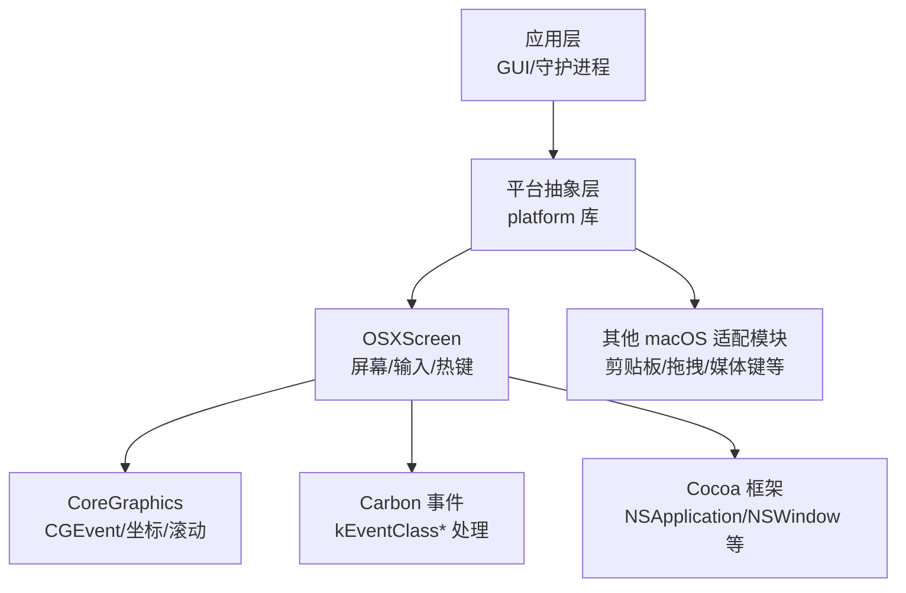
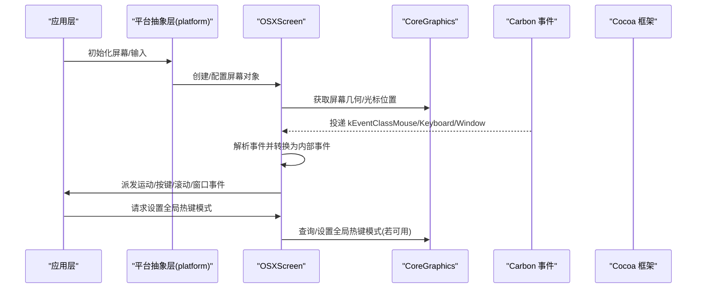
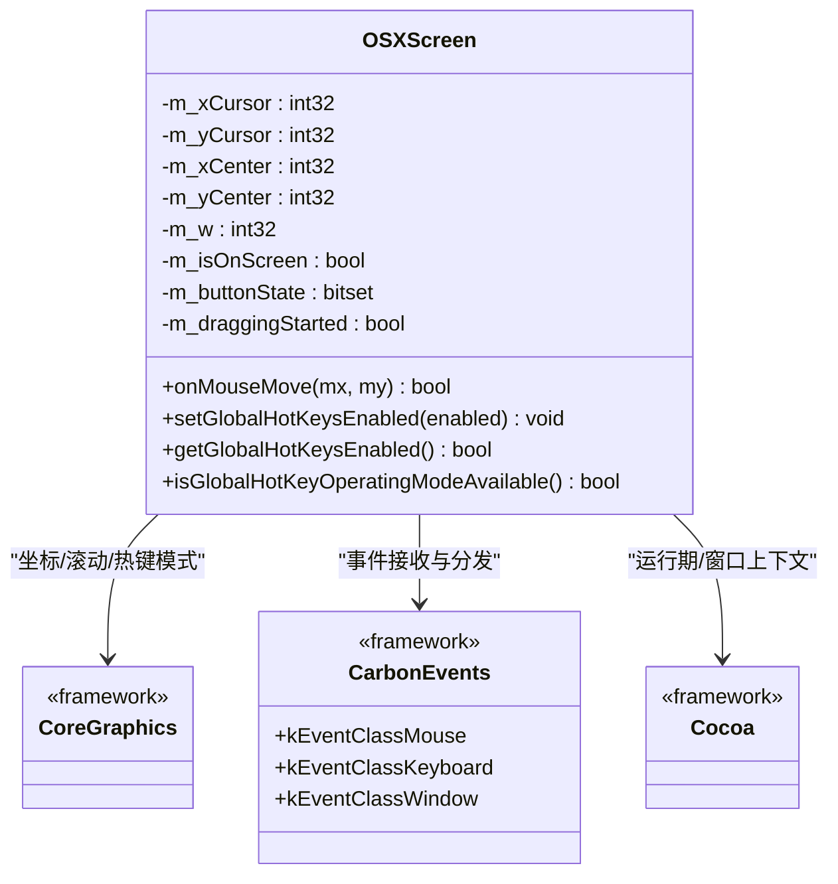
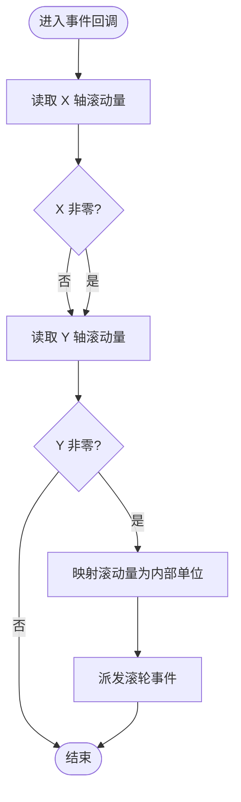
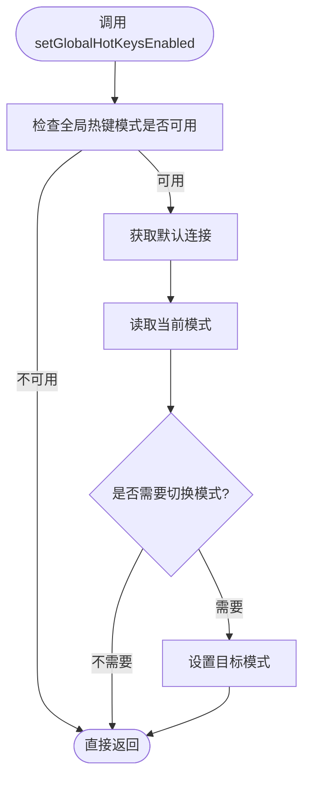
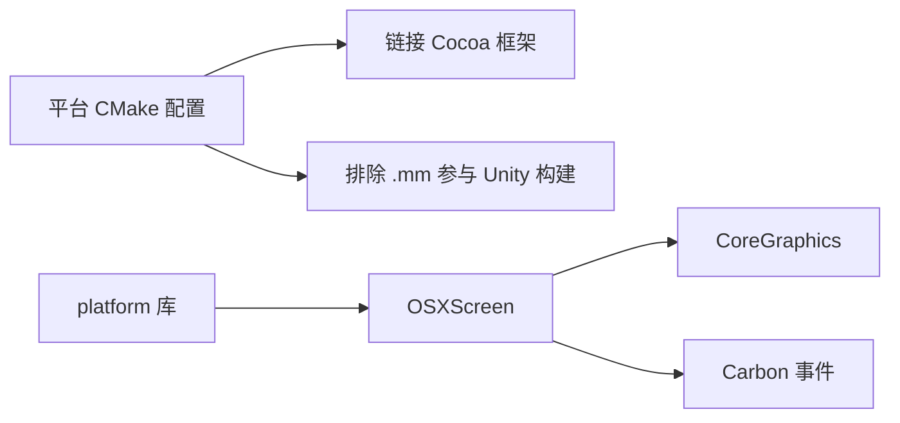

# macOS 平台支持

<cite>
**本文引用的文件**   
- [README.md](file://README.md)
- [CMakeLists.txt](file://src/lib/platform/CMakeLists.txt)
- [OSXScreen.mm](file://src/lib/platform/OSXScreen.mm)
</cite>

## 目录
1. [简介](#简介)
2. [项目结构](#项目结构)
3. [核心组件](#核心组件)
4. [架构总览](#架构总览)
5. [详细组件分析](#详细组件分析)
6. [依赖分析](#依赖分析)
7. [性能考虑](#性能考虑)
8. [故障排查指南](#故障排查指南)
9. [结论](#结论)
10. [附录](#附录)

## 简介
本文件聚焦 Input Leap 在 macOS 平台的实现与集成方式，围绕 Carbon API、Cocoa 框架、CoreGraphics 输入模拟、辅助功能（AXUIElement）集成、NSEvent 事件处理等主题展开。文档同时覆盖辅助功能权限配置、菜单栏与通知中心集成策略、多版本兼容性、沙盒与 App Store 分发约束、macOS 特有性能优化与调试方法，以及与系统特性的对接要点。

## 项目结构
Input Leap 的 macOS 平台相关代码主要位于平台抽象层中，通过 CMake 条件编译将 macOS 源文件纳入构建，并链接 Cocoa 框架。关键入口包括：
- 平台库构建与框架链接：在平台 CMake 脚本中为 Apple 平台添加 Cocoa 框架链接，并将 .mm 文件排除在 Unity 构建之外，确保 Objective-C++ 正确编译。
- 屏幕与输入子系统：OSXScreen 负责屏幕几何、光标位置、滚动、窗口焦点以及全局热键模式等能力，内部使用 CoreGraphics 与 Carbon 事件机制进行交互。

图表来源
- [CMakeLists.txt:56-73](file://src/lib/platform/CMakeLists.txt#L56-L73)
- [OSXScreen.mm:974-1029](file://src/lib/platform/OSXScreen.mm#L974-L1029)

章节来源
- [CMakeLists.txt:56-73](file://src/lib/platform/CMakeLists.txt#L56-L73)

## 核心组件
- OSXScreen
  - 职责：封装屏幕尺寸与光标位置、鼠标移动与滚轮事件、窗口激活/失焦事件、全局热键模式查询与设置等。
  - 技术栈：CoreGraphics（坐标与滚动映射）、Carbon 事件类（键盘/鼠标/窗口事件）、Cocoa（运行时环境）。
  - 关键点：对滚动轴进行映射；对窗口事件进行分类处理；提供全局热键模式的可用性检测与开关。

章节来源
- [OSXScreen.mm:974-1029](file://src/lib/platform/OSXScreen.mm#L974-L1029)

## 架构总览
下图展示 Input Leap 在 macOS 上的高层架构与数据流：上层逻辑调用平台抽象层，后者通过 CoreGraphics 与 Carbon 事件系统与系统交互，Cocoa 提供运行期支撑。

图表来源
- [OSXScreen.mm:974-1029](file://src/lib/platform/OSXScreen.mm#L974-L1029)
- [OSXScreen.mm:1703-1782](file://src/lib/platform/OSXScreen.mm#L1703-L1782)

## 详细组件分析

### OSXScreen 组件分析
OSXScreen 是 macOS 平台的核心组件之一，承担以下职责：
- 屏幕与光标：维护当前光标坐标、屏幕中心点、是否在主屏等状态，用于计算相对位移与边界行为。
- 鼠标移动：当光标在主屏上移动时，生成“主屏内运动”事件；在非主屏时执行回弹到中心的策略，并对“伪运动”区域做过滤。
- 滚轮事件：从 Carbon 事件中读取 x/y 滚动量，并进行映射后上报。
- 窗口事件：处理窗口激活/失活/获得焦点/失去焦点等生命周期事件。
- 全局热键模式：通过动态符号查找判断是否存在全局热键操作模式接口，并提供启用/禁用与查询能力。

图表来源
- [OSXScreen.mm:974-1029](file://src/lib/platform/OSXScreen.mm#L974-L1029)
- [OSXScreen.mm:1703-1782](file://src/lib/platform/OSXScreen.mm#L1703-L1782)

#### 滚轮事件处理流程

图表来源
- [OSXScreen.mm:974-989](file://src/lib/platform/OSXScreen.mm#L974-L989)

#### 全局热键模式控制流程

图表来源
- [OSXScreen.mm:1733-1764](file://src/lib/platform/OSXScreen.mm#L1733-L1764)

章节来源
- [OSXScreen.mm:974-1029](file://src/lib/platform/OSXScreen.mm#L974-L1029)
- [OSXScreen.mm:1703-1782](file://src/lib/platform/OSXScreen.mm#L1703-L1782)

### 辅助功能（AXUIElement）集成说明
- 现状：在当前仓库片段中未发现 AXUIElement 的直接调用或辅助功能权限相关代码。
- 建议路径：
  - 如需访问系统辅助功能（例如读取/注入某些受保护的应用程序信息），应在启动时检查并引导用户开启“辅助功能”权限。
  - 使用 AXUIElement 前需验证当前进程是否具备相应权限，并在无权限时给出清晰的用户提示与跳转指引。
  - 注意：仅凭当前源码无法确认是否已实现该能力，后续可在平台层新增辅助功能桥接模块。

[本节未直接分析具体文件，故不附“章节来源”]

### NSEvent 事件处理说明
- 现状：当前源码片段显示 OSXScreen 主要通过 Carbon 事件类（如 kEventClassMouse/Keyboard/Window）进行处理，未见直接使用 NSEvent 的代码。
- 建议路径：
  - 若需要在 Cocoa 层统一事件模型，可引入 NSEvent 作为上层事件抽象，再向下映射至 CoreGraphics/Carbon。
  - 注意事件优先级与拦截范围，避免与系统快捷键冲突。

[本节未直接分析具体文件，故不附“章节来源”]

### 菜单栏与通知中心集成说明
- 现状：当前仓库片段未包含菜单栏或通知中心的具体实现代码。
- 建议路径：
  - 菜单栏：可使用 NSStatusBar 与 NSMenu 实现常驻菜单项，提供快速启停、状态指示与常用设置入口。
  - 通知中心：使用 UserNotifications 框架推送关键状态变更（如连接建立/断开、权限缺失提醒等）。
  - 注意：在沙盒模式下，通知权限需在 Info.plist 中声明并遵循系统授权流程。

[本节未直接分析具体文件，故不附“章节来源”]

## 依赖分析
- 构建期依赖
  - 平台库在 Apple 平台上链接 Cocoa 框架，确保 Objective-C++ 源文件能正常编译与运行。
  - .mm 文件被显式排除在 Unity 构建之外，以避免 C++ 模式下的编译问题。
- 运行期依赖
  - OSXScreen 依赖 CoreGraphics 与 Carbon 事件系统进行输入与窗口事件处理。
  - 全局热键模式通过动态符号查找弱引用 CoreGraphics 内部接口，具备向后兼容与降级能力。

图表来源
- [CMakeLists.txt:56-73](file://src/lib/platform/CMakeLists.txt#L56-L73)
- [OSXScreen.mm:1703-1782](file://src/lib/platform/OSXScreen.mm#L1703-L1782)

章节来源
- [CMakeLists.txt:56-73](file://src/lib/platform/CMakeLists.txt#L56-L73)

## 性能考虑
- 事件节流与去抖
  - 对高频鼠标移动事件进行阈值判断与合并，减少不必要的跨进程事件派发。
- 滚动映射优化
  - 将系统滚动量映射为内部单位时尽量使用整数运算，避免浮点抖动。
- 全局热键模式
  - 仅在必要时查询/设置全局热键模式，缓存结果以减少系统调用开销。
- 内存管理
  - 避免在事件回调中分配大量临时对象；复用缓冲区与对象池。
- 线程模型
  - 事件处理尽量保持轻量，耗时任务异步化，避免阻塞主循环。

[本节提供通用指导，不直接分析具体文件，故不附“章节来源”]

## 故障排查指南
- 权限问题
  - 若涉及辅助功能或输入注入，请确认已在“系统偏好设置 > 安全性与隐私 > 辅助功能”中授予权限。
- 事件丢失或异常
  - 检查 Carbon 事件回调是否正确转发与分类；核对滚动轴映射函数返回值。
- 全局热键失效
  - 确认 isGlobalHotKeyOperatingModeAvailable 返回 true；若为 false，则按降级策略处理。
- 日志与调试
  - 在关键路径增加 LOG_DEBUG 级别日志，定位事件流转与状态变化。
  - 使用 Instruments 分析 CPU/内存热点，关注事件回调路径。

章节来源
- [OSXScreen.mm:974-1029](file://src/lib/platform/OSXScreen.mm#L974-L1029)
- [OSXScreen.mm:1703-1782](file://src/lib/platform/OSXScreen.mm#L1703-L1782)

## 结论
Input Leap 在 macOS 平台通过 platform 抽象层与 OSXScreen 组件，结合 CoreGraphics 与 Carbon 事件系统实现了屏幕与输入的核心能力。当前源码片段未包含辅助功能（AXUIElement）、NSEvent、菜单栏与通知中心的实现，建议在平台层按需扩展，并遵循权限与沙盒约束。构建层面通过 CMake 明确链接 Cocoa 并隔离 .mm 文件，保证编译稳定性。

[本节为总结性内容，不直接分析具体文件，故不附“章节来源”]

## 附录

### 兼容性要求
- 官方支持的 macOS 版本为 10.12 及以上。
- 旧版本（低于 10.12）不受支持。

章节来源
- [README.md:114-131](file://README.md#L114-L131)

### 沙盒与 App Store 分发注意事项
- 若计划沙盒化或上架 App Store，需评估以下限制：
  - 辅助功能权限：必须在 Info.plist 中声明并使用系统授权流程。
  - 输入注入与全局热键：可能受限于沙盒策略与系统安全模型，需采用系统推荐的方式（如 Accessibility API 与标准快捷键注册）。
  - 网络与后台任务：遵循 App Sandbox 的网络与后台执行规则。
- 当前仓库未包含 Info.plist 或沙盒相关配置，发布前需补充相应清单与权限声明。

[本节为通用指导，不直接分析具体文件，故不附“章节来源”]