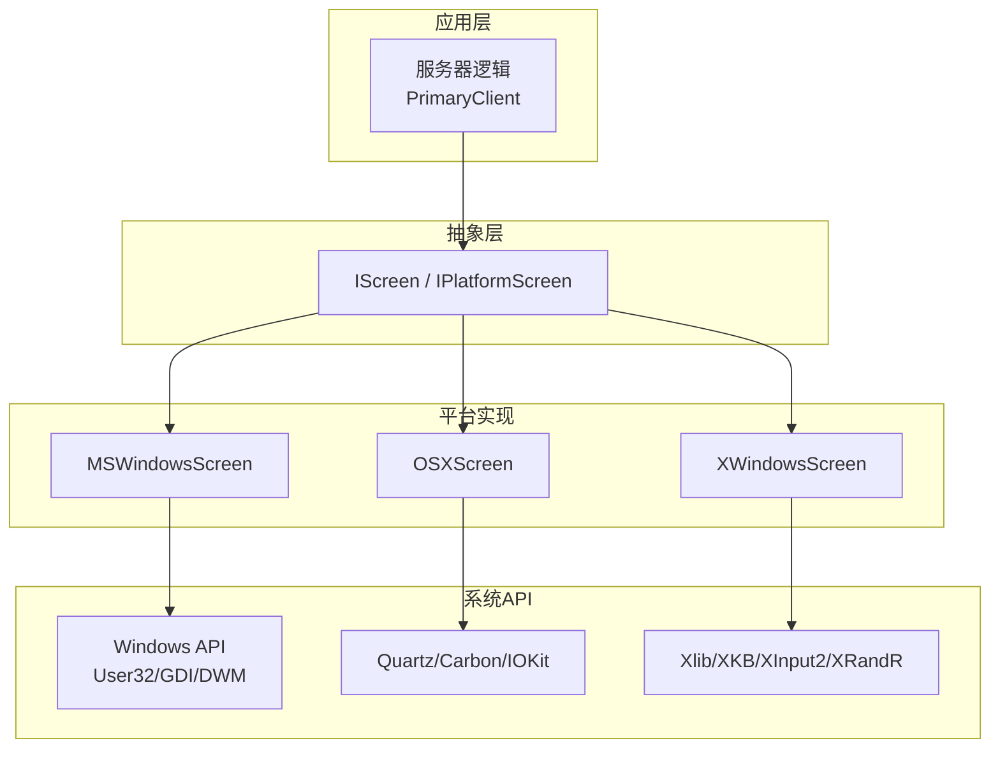
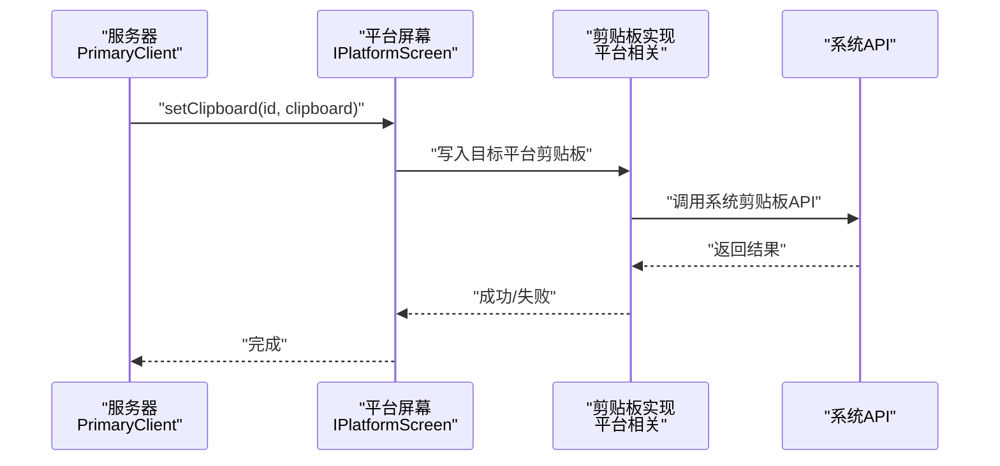
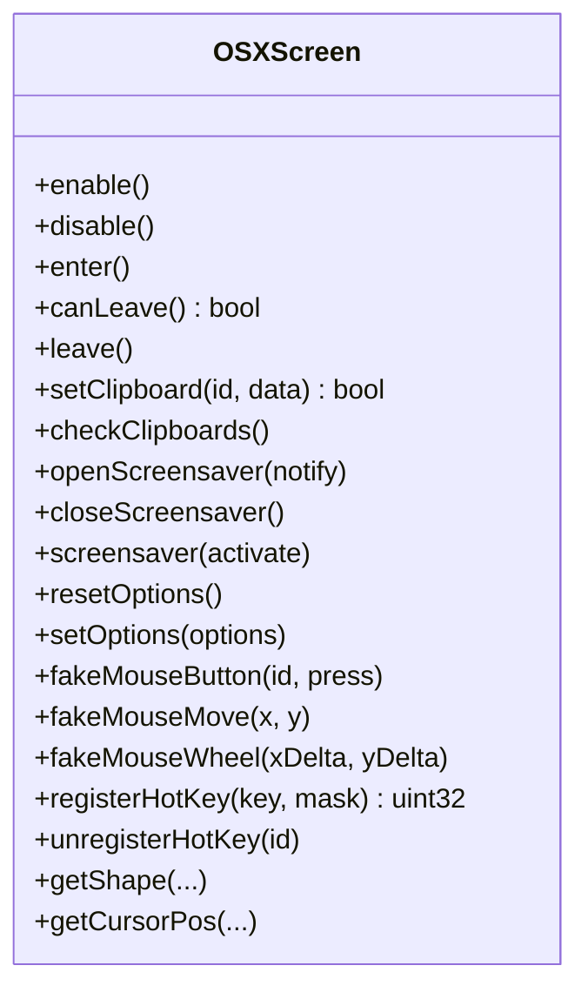
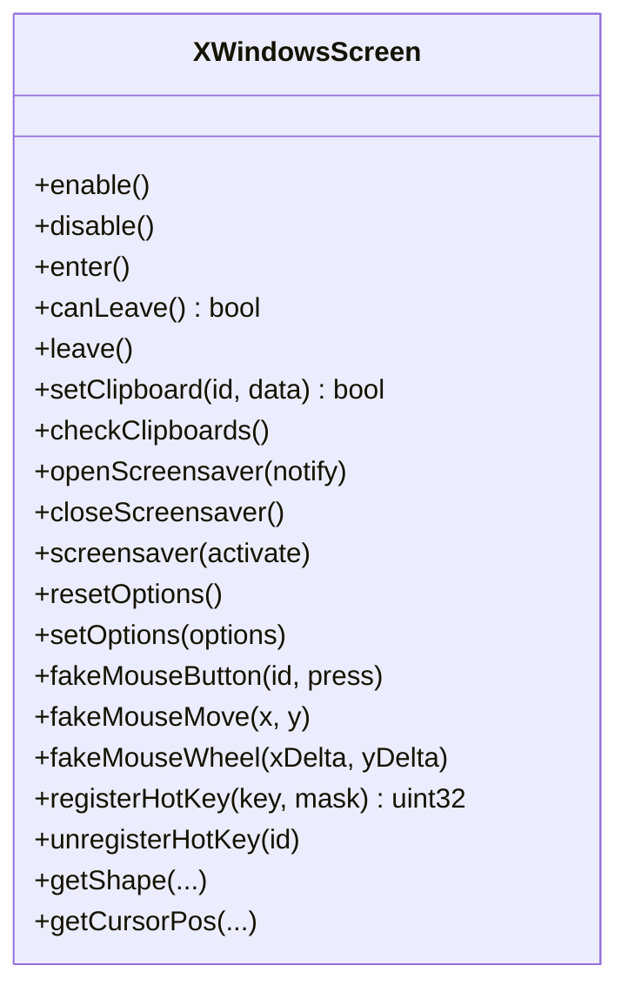
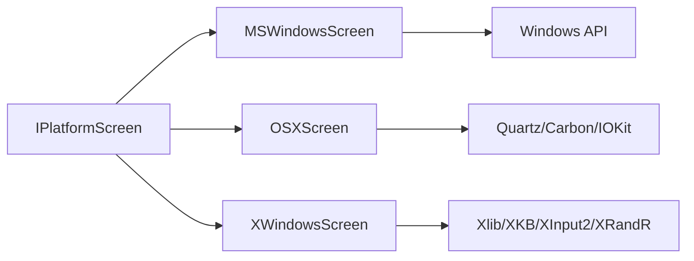

# 平台支持

<cite>
**本文引用的文件**   
- [README.md](file://README.md)
- [IPlatformScreen.h](file://src/lib/inputleap/IPlatformScreen.h)
- [MSWindowsScreen.h](file://src/lib/platform/MSWindowsScreen.h)
- [OSXScreen.h](file://src/lib/platform/OSXScreen.h)
- [XWindowsScreen.h](file://src/lib/platform/XWindowsScreen.h)
- [XWindowsImpl.h](file://src/lib/platform/XWindowsImpl.h)
- [XWindowsImpl.cpp](file://src/lib/platform/XWindowsImpl.cpp)
- [MSWindowsClipboardTests.cpp](file://src/test/integtests/platform/MSWindowsClipboardTests.cpp)
- [PrimaryClient.cpp](file://src/lib/server/PrimaryClient.cpp)
</cite>

## 目录
1. [简介](#简介)
2. [项目结构](#项目结构)
3. [核心组件](#核心组件)
4. [架构总览](#架构总览)
5. [详细组件分析](#详细组件分析)
6. [依赖关系分析](#依赖关系分析)
7. [性能考虑](#性能考虑)
8. [故障排除指南](#故障排除指南)
9. [结论](#结论)
10. [附录：新平台适配指南](#附录新平台适配指南)

## 简介
本文件聚焦 Input Leap 在 Windows、macOS、Linux（X11）三大平台的输入共享实现与跨平台抽象层设计，覆盖输入捕获、鼠标模拟、剪贴板操作与系统集成。文档同时给出权限要求、系统限制与兼容性注意事项，并提供各平台性能优化技巧、常见问题排查方法以及为新平台适配的开发指南与集成示例路径。

## 项目结构
Input Leap 将“平台无关”的屏幕与事件抽象置于 inputleap 层，具体平台实现位于 src/lib/platform 下，分别提供 MSWindows、OSX、XWindows 三类 Screen 实现，统一实现 IPlatformScreen 接口，向上屏蔽平台差异。

图表来源
- [IPlatformScreen.h:31-185](file://src/lib/inputleap/IPlatformScreen.h#L31-L185)
- [MSWindowsScreen.h:42-126](file://src/lib/platform/MSWindowsScreen.h#L42-L126)
- [OSXScreen.h:53-104](file://src/lib/platform/OSXScreen.h#L53-L104)
- [XWindowsScreen.h:39-89](file://src/lib/platform/XWindowsScreen.h#L39-L89)
- [PrimaryClient.cpp:102-161](file://src/lib/server/PrimaryClient.cpp#L102-L161)

章节来源
- [README.md:114-123](file://README.md#L114-L123)

## 核心组件
- IPlatformScreen：定义所有平台必须实现的屏幕能力，包括启用/禁用、进入/离开、剪贴板读写、屏保控制、选项重置、拖拽状态等。
- PlatformScreen：对 IPlatformScreen 的通用封装与日志包装（见同名头文件），用于统一行为与可观测性。
- 平台 Screen 实现：
  - MSWindowsScreen：基于 Windows 消息循环、全局钩子、剪贴板查看器链、热键与桌面切换处理。
  - OSXScreen：基于 Quartz EventTap、Carbon/Quartz 窗口与事件、IOKit 电源管理、剪贴板 Pasteboard。
  - XWindowsScreen：基于 Xlib、XKB、XInput2、XRandR、Xinerama 扩展，处理焦点、输入法、滚动累积等。

章节来源
- [IPlatformScreen.h:31-185](file://src/lib/inputleap/IPlatformScreen.h#L31-L185)
- [MSWindowsScreen.h:42-126](file://src/lib/platform/MSWindowsScreen.h#L42-L126)
- [OSXScreen.h:53-104](file://src/lib/platform/OSXScreen.h#L53-L104)
- [XWindowsScreen.h:39-89](file://src/lib/platform/XWindowsScreen.h#L39-L89)

## 架构总览
下图展示从服务器到平台的具体调用路径，重点体现剪贴板与屏幕交互的关键流程。

图表来源
- [PrimaryClient.cpp:147-157](file://src/lib/server/PrimaryClient.cpp#L147-L157)
- [IPlatformScreen.h:81-93](file://src/lib/inputleap/IPlatformScreen.h#L81-L93)

## 详细组件分析

### Windows 平台实现
- 输入捕获与模拟
  - 使用全局钩子与消息循环拦截键盘/鼠标事件；主线程维护窗口消息队列，避免丢弃已排队消息。
  - 通过 User32/GDI 合成鼠标移动、滚轮、按键事件，并处理多显示器与桌面切换。
- 剪贴板
  - 作为剪贴板查看器链节点监听变化，配合多种格式转换器（文本、HTML、位图等）。
  - 测试用例验证打开/清空等基本行为。
- 屏保与显示变更
  - 通过系统 API 查询/设置屏保状态，响应显示分辨率变化。
- 权限与限制
  - 需要足够权限以安装全局钩子与访问剪贴板；某些安全策略可能阻止注入或剪贴板读取。
- 性能要点
  - 批量合成输入事件时减少系统调用次数；合理缓存屏幕形状与光标位置；避免频繁刷新消息队列。

图表来源
- [MSWindowsScreen.h:42-126](file://src/lib/platform/MSWindowsScreen.h#L42-L126)

章节来源
- [MSWindowsScreen.h:42-126](file://src/lib/platform/MSWindowsScreen.h#L42-L126)
- [MSWindowsClipboardTests.cpp:19-51](file://src/test/integtests/platform/MSWindowsClipboardTests.cpp#L19-L51)

### macOS 平台实现
- 输入捕获与模拟
  - 使用 Quartz EventTap 捕获全局输入事件；通过 Carbon/Quartz 合成鼠标与键盘事件。
  - 支持媒体键与全局热键模式检测。
- 剪贴板
  - 基于 NSPasteboard/Carbon Pasteboard 进行读写，支持多种数据格式转换。
- 屏保与电源管理
  - 通过 IOKit 监听电源事件，维持运行时断言防止休眠影响服务。
- 权限与限制
  - 需辅助功能权限以捕获全局输入；部分沙盒环境会限制剪贴板访问。
- 性能要点
  - 合并滚动事件、节流剪贴板检查定时器；避免在高频回调中执行重计算。

图表来源
- [OSXScreen.h:53-104](file://src/lib/platform/OSXScreen.h#L53-L104)

章节来源
- [OSXScreen.h:53-104](file://src/lib/platform/OSXScreen.h#L53-L104)

### Linux（X11）平台实现
- 输入捕获与模拟
  - 基于 Xlib 连接 Display，使用 XInput2 获取原始运动事件，结合 XKB 处理键盘映射与组合键。
  - 通过 XTest 合成输入事件，注意 Xinerama/Xwayland 兼容性问题。
- 剪贴板
  - 基于 X Selection 机制，处理 PRIMARY/CURRENT/CLIPBOARD 等选择区，支持多种图像与文本编码转换。
- 屏保与显示
  - 通过 DPMS 与 XGetScreenSaver/XSetScreenSaver 控制屏保；使用 XRandR 监听分辨率变化。
- 权限与限制
  - 需要访问 X server 的权限；Wayland 下剪贴板共享受限（参见 README）。
- 性能要点
  - 滚动增量累积以减少事件风暴；延迟刷新键盘映射；按需选择 XI2 事件。

图表来源
- [XWindowsScreen.h:39-89](file://src/lib/platform/XWindowsScreen.h#L39-L89)

章节来源
- [XWindowsScreen.h:39-89](file://src/lib/platform/XWindowsScreen.h#L39-L89)
- [XWindowsImpl.h:10-31](file://src/lib/platform/XWindowsImpl.h#L10-L31)
- [XWindowsImpl.cpp:249-496](file://src/lib/platform/XWindowsImpl.cpp#L249-L496)

## 依赖关系分析
- 抽象层与平台实现解耦：上层仅依赖 IPlatformScreen 接口，平台差异由各自 Screen 实现承担。
- 平台内部依赖：
  - Windows：依赖 User32/GDI、剪贴板查看器链、热键注册、桌面切换。
  - macOS：依赖 Quartz/Carbon、IOKit 电源管理、Pasteboard。
  - Linux：依赖 Xlib、XKB、XInput2、XRandR、DPMS。

图表来源
- [IPlatformScreen.h:31-185](file://src/lib/inputleap/IPlatformScreen.h#L31-L185)
- [MSWindowsScreen.h:42-126](file://src/lib/platform/MSWindowsScreen.h#L42-L126)
- [OSXScreen.h:53-104](file://src/lib/platform/OSXScreen.h#L53-L104)
- [XWindowsScreen.h:39-89](file://src/lib/platform/XWindowsScreen.h#L39-L89)

章节来源
- [IPlatformScreen.h:31-185](file://src/lib/inputleap/IPlatformScreen.h#L31-L185)

## 性能考虑
- 事件批处理与节流
  - 合并鼠标移动与滚轮事件，降低系统调用频率。
  - 剪贴板变更采用定时器轮询作为兜底，避免过度触发。
- 缓存与懒加载
  - 缓存屏幕尺寸、光标位置、按钮状态，仅在必要时更新。
  - 键盘映射与布局变更时再刷新，避免每次按键都重建映射。
- 平台特定优化
  - Windows：减少消息队列刷新次数，避免丢弃必要消息；合理使用热键与钩子粒度。
  - macOS：合并滚动事件，节流剪贴板检查；谨慎使用全局热键模式。
  - Linux：使用 XInput2 原始事件，累积滚动增量；检测并规避 Xinerama/Xwayland 异常。

[本节为通用指导，不直接分析具体文件]

## 故障排除指南
- 剪贴板无法同步
  - Windows：确认进程具备剪贴板访问权限，检查剪贴板查看器链是否被其他程序破坏。
  - macOS：确认辅助功能权限已授予，检查 Pasteboard 访问是否被沙盒限制。
  - Linux：Wayland 下剪贴板共享受限，建议使用 X11 会话或遵循发行版提示配置。
- 输入无响应或卡顿
  - Windows：检查全局钩子是否被安全软件拦截；确认消息循环未被阻塞。
  - macOS：确认 EventTap 已正确创建且未被关闭；检查辅助功能权限。
  - Linux：确认 X server 可达；检查 XInput2 与 XKB 扩展是否可用；关注 Xwayland 兼容问题。
- 屏保与休眠
  - macOS：确保电源管理断言有效，避免服务休眠导致事件丢失。
  - Linux：检查 DPMS 与屏保设置，必要时禁用自动屏保。

章节来源
- [README.md:150-156](file://README.md#L150-L156)
- [MSWindowsClipboardTests.cpp:19-51](file://src/test/integtests/platform/MSWindowsClipboardTests.cpp#L19-L51)

## 结论
Input Leap 通过统一的 IPlatformScreen 抽象屏蔽了 Windows、macOS、Linux 的平台差异，实现了稳定的输入共享与剪贴板同步。各平台实现充分利用系统 API 的优势，并在性能与兼容性方面做了针对性优化。对于新平台适配，建议严格遵循接口契约，参考现有实现的结构与最佳实践。

[本节为总结性内容，不直接分析具体文件]

## 附录：新平台适配指南
- 新增平台步骤
  - 定义并实现新的 PlatformScreen 子类，完整实现 IPlatformScreen 接口。
  - 接入系统输入捕获与模拟 API，确保能正确处理键盘、鼠标、滚轮与热键。
  - 实现剪贴板读写与格式转换，保证与现有 ClipboardID 体系兼容。
  - 处理屏保与显示变更事件，保持服务稳定运行。
- 集成示例路径
  - 参考 Windows 实现：[MSWindowsScreen.h](file://src/lib/platform/MSWindowsScreen.h)
  - 参考 macOS 实现：[OSXScreen.h](file://src/lib/platform/OSXScreen.h)
  - 参考 Linux 实现：[XWindowsScreen.h](file://src/lib/platform/XWindowsScreen.h)
  - 参考抽象接口：[IPlatformScreen.h](file://src/lib/inputleap/IPlatformScreen.h)
- 关键接口清单（按职责分组）
  - 生命周期：enable/disable/enter/canLeave/leave
  - 剪贴板：setClipboard/checkClipboards/getClipboard
  - 屏保：openScreensaver/closeScreensaver/screensaver
  - 选项：resetOptions/setOptions
  - 输入模拟：fakeMouseButton/fakeMouseMove/fakeMouseRelativeMove/fakeMouseWheel
  - 热键：registerHotKey/unregisterHotKey
  - 屏幕信息：getShape/getCursorPos/getCursorCenter/isAnyMouseButtonDown
- 测试与验证
  - 编写平台特定的集成测试，覆盖剪贴板、热键、屏保与输入模拟。
  - 在不同分辨率与多显示器环境下验证光标与边界穿越逻辑。
  - 在 Wayland/Xwayland 环境下验证剪贴板与输入行为。

章节来源
- [IPlatformScreen.h:31-185](file://src/lib/inputleap/IPlatformScreen.h#L31-L185)
- [MSWindowsScreen.h:42-126](file://src/lib/platform/MSWindowsScreen.h#L42-L126)
- [OSXScreen.h:53-104](file://src/lib/platform/OSXScreen.h#L53-L104)
- [XWindowsScreen.h:39-89](file://src/lib/platform/XWindowsScreen.h#L39-L89)