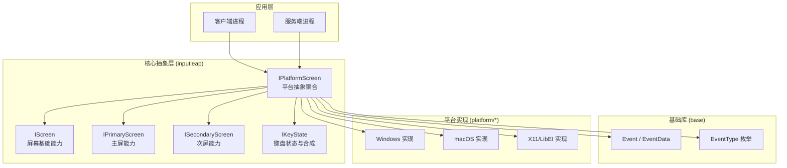
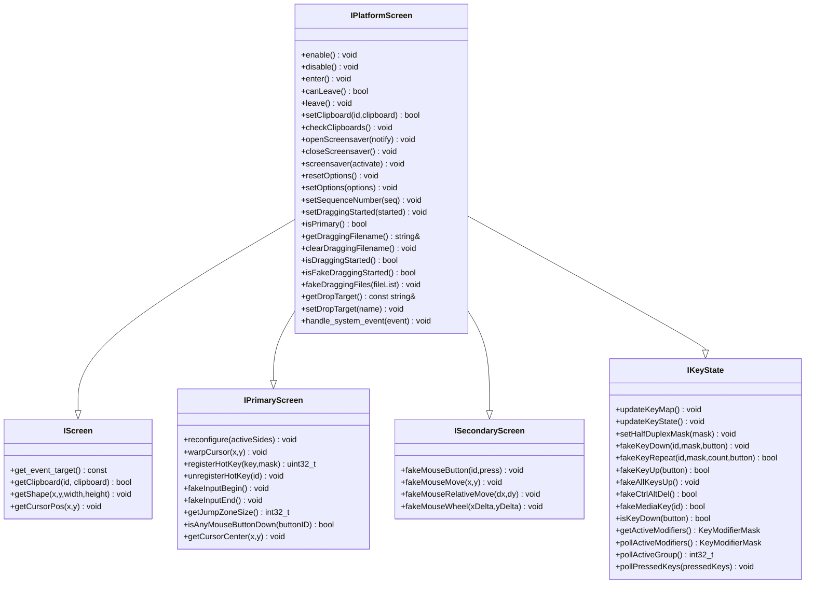
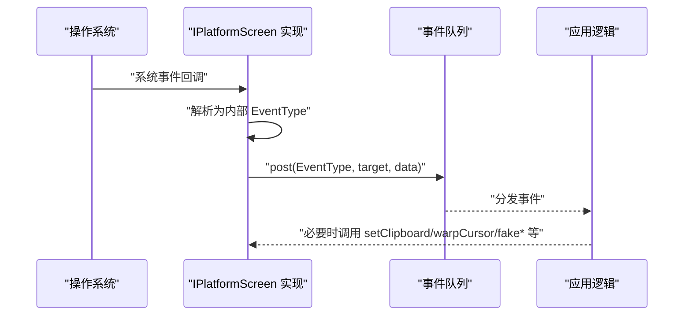
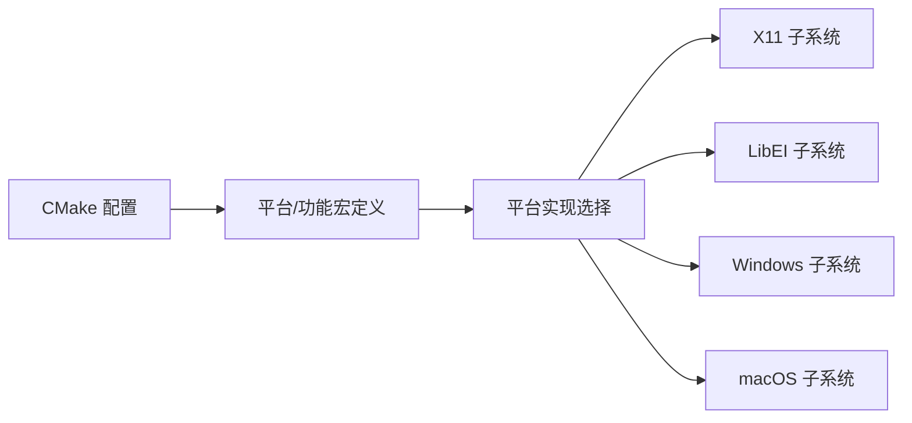

# 跨平台抽象层

<cite>
**本文引用的文件**   
- [IPlatformScreen.h](file://src/lib/inputleap/IPlatformScreen.h)
- [IScreen.h](file://src/lib/inputleap/IScreen.h)
- [IPrimaryScreen.h](file://src/lib/inputleap/IPrimaryScreen.h)
- [ISecondaryScreen.h](file://src/lib/inputleap/ISecondaryScreen.h)
- [IKeyState.h](file://src/lib/inputleap/IKeyState.h)
- [Event.h](file://src/lib/base/Event.h)
- [EventTypes.h](file://src/lib/base/EventTypes.h)
- [CMakeLists.txt](file://CMakeLists.txt)
</cite>

## 目录
1. [简介](#简介)
2. [项目结构](#项目结构)
3. [核心组件](#核心组件)
4. [架构总览](#架构总览)
5. [详细组件分析](#详细组件分析)
6. [依赖分析](#依赖分析)
7. [性能考虑](#性能考虑)
8. [故障排查指南](#故障排查指南)
9. [结论](#结论)
10. [附录：新平台适配开发指南](#附录新平台适配开发指南)

## 简介
本文件聚焦 Input Leap 的跨平台抽象层，围绕 IPlatformScreen 接口设计、事件与屏幕操作抽象、剪贴板抽象、以及构建系统（CMake）的跨平台配置进行系统化说明。文档同时给出架构层（arch）在数据类型、内存管理、线程模型方面的通用约定与实践建议，并提供新平台适配的开发指南与最佳实践。

## 项目结构
Input Leap 将“平台无关”的输入与屏幕抽象集中在 inputleap 模块中，通过一组纯虚接口统一屏蔽底层差异；平台相关实现位于各平台的 platform 子系统中（例如 Windows、macOS、X11/LibEI）。基础事件系统与类型定义位于 base 模块。顶层 CMake 负责条件编译、平台检测与依赖发现。

图表来源
- [IPlatformScreen.h:1-188](file://src/lib/inputleap/IPlatformScreen.h#L1-L188)
- [IScreen.h:1-76](file://src/lib/inputleap/IScreen.h#L1-L76)
- [IPrimaryScreen.h:1-179](file://src/lib/inputleap/IPrimaryScreen.h#L1-L179)
- [ISecondaryScreen.h:1-67](file://src/lib/inputleap/ISecondaryScreen.h#L1-L67)
- [IKeyState.h:1-188](file://src/lib/inputleap/IKeyState.h#L1-L188)
- [Event.h:1-153](file://src/lib/base/Event.h#L1-L153)
- [EventTypes.h:1-291](file://src/lib/base/EventTypes.h#L1-L291)

章节来源
- [CMakeLists.txt:1-342](file://CMakeLists.txt#L1-L342)

## 核心组件
本节从接口职责与交互角度梳理跨平台抽象层的核心组件。

- IPlatformScreen：平台无关的屏幕抽象聚合器，组合了屏幕基础能力、主屏能力、次屏能力与键盘状态能力，并定义生命周期与系统事件处理入口。
- IScreen：所有屏幕共有的基础能力，包括获取事件目标、读取剪贴板、获取屏幕几何与光标位置等。
- IPrimaryScreen：主屏特有能力，如重配置跳转区域、绝对移动光标、注册系统热键、进入/退出假输入模式、查询鼠标按键状态与光标中心等。
- ISecondaryScreen：次屏特有能力，用于合成鼠标事件（按下/释放、绝对/相对移动、滚轮）。
- IKeyState：键盘状态管理与事件合成，包括更新键映射与物理状态、半双工修饰键掩码、合成按键按下/重复/释放、特殊组合键（如 Ctrl+Alt+Del）、媒体键等。
- Event 与 EventType：跨平台事件载体与类型体系，支持泛型数据包装、可移动语义、立即投递标志等。

章节来源
- [IPlatformScreen.h:1-188](file://src/lib/inputleap/IPlatformScreen.h#L1-L188)
- [IScreen.h:1-76](file://src/lib/inputleap/IScreen.h#L1-L76)
- [IPrimaryScreen.h:1-179](file://src/lib/inputleap/IPrimaryScreen.h#L1-L179)
- [ISecondaryScreen.h:1-67](file://src/lib/inputleap/ISecondaryScreen.h#L1-L67)
- [IKeyState.h:1-188](file://src/lib/inputleap/IKeyState.h#L1-L188)
- [Event.h:1-153](file://src/lib/base/Event.h#L1-L153)
- [EventTypes.h:1-291](file://src/lib/base/EventTypes.h#L1-L291)

## 架构总览
下图展示了 IPlatformScreen 与其基接口的关系，以及事件系统在其中的作用。

图表来源
- [IPlatformScreen.h:1-188](file://src/lib/inputleap/IPlatformScreen.h#L1-L188)
- [IScreen.h:1-76](file://src/lib/inputleap/IScreen.h#L1-L76)
- [IPrimaryScreen.h:1-179](file://src/lib/inputleap/IPrimaryScreen.h#L1-L179)
- [ISecondaryScreen.h:1-67](file://src/lib/inputleap/ISecondaryScreen.h#L1-L67)
- [IKeyState.h:1-188](file://src/lib/inputleap/IKeyState.h#L1-L188)

## 详细组件分析

### IPlatformScreen 接口设计与职责
- 生命周期与切换
  - enable/disable：启用/禁用屏幕，准备或清理系统事件监听与资源。
  - enter/canLeave/leave：进入/离开当前屏幕的生命周期钩子，canLeave 允许主屏在无法安装钩子时拒绝离开。
- 剪贴板抽象
  - setClipboard/getClipboard：设置/读取指定 ID 的剪贴板内容。
  - checkClipboards：作为兜底策略检查剪贴板所有权变化并发布相应事件。
- 屏幕保护程序控制
  - openScreensaver/closeScreensaver/screensaver：打开/关闭/强制激活或停用屏幕保护，并可选择是否通知激活/停用事件。
- 选项与序列号
  - resetOptions/setOptions：重置或增量更新平台相关选项。
  - setSequenceNumber：为后续剪贴板事件设置序列号。
- 拖拽与文件传输
  - setDraggingStarted/isDraggingStarted/isFakeDraggingStarted：标记拖拽开始及真假拖拽状态。
  - getDraggingFilename/clearDraggingFilename：维护拖拽文件名上下文。
  - fakeDraggingFiles：模拟拖拽文件列表。
  - getDropTarget/setDropTarget：记录/设置拖放目标。
- 系统事件处理
  - handle_system_event：平台侧应在此方法中处理系统事件，并按需向 IScreen 发布事件。主屏还需调用 KeyState 的 onKey/updateKeyMap 等方法。

章节来源
- [IPlatformScreen.h:1-188](file://src/lib/inputleap/IPlatformScreen.h#L1-L188)

### 事件系统与事件类型
- Event 与 EventData
  - Event 持有事件类型、目标对象与泛型数据指针，支持移动语义与立即投递标志。
  - EventData<T> 提供类型安全的拷贝与访问接口，配合 create_event_data 工厂函数创建。
- EventType 枚举
  - 覆盖系统事件、网络流事件、IPC 事件、屏幕事件、剪贴板事件、文件传输事件等。
  - 与 IPlatformScreen::handle_system_event 配合，平台侧将底层事件转换为上层事件类型并投递到目标。

图表来源
- [Event.h:1-153](file://src/lib/base/Event.h#L1-L153)
- [EventTypes.h:1-291](file://src/lib/base/EventTypes.h#L1-L291)
- [IPlatformScreen.h:1-188](file://src/lib/inputleap/IPlatformScreen.h#L1-L188)

章节来源
- [Event.h:1-153](file://src/lib/base/Event.h#L1-L153)
- [EventTypes.h:1-291](file://src/lib/base/EventTypes.h#L1-L291)

### 主屏与次屏能力
- 主屏（IPrimaryScreen）
  - reconfigure：根据 activeSides 位图重新配置跳转区域。
  - warpCursor：绝对移动光标并丢弃待处理输入事件。
  - registerHotKey/unregisterHotKey：注册/注销全局热键，由平台保证事件投递到自身。
  - fakeInputBegin/fakeInputEnd：进入/退出“假输入”模式，避免回环捕获。
  - isAnyMouseButtonDown/getCursorCenter：查询鼠标按键与光标中心位置。
- 次屏（ISecondaryScreen）
  - fakeMouseButton/fakeMouseMove/fakeMouseRelativeMove/fakeMouseWheel：合成鼠标事件以驱动远端系统。

章节来源
- [IPrimaryScreen.h:1-179](file://src/lib/inputleap/IPrimaryScreen.h#L1-L179)
- [ISecondaryScreen.h:1-67](file://src/lib/inputleap/ISecondaryScreen.h#L1-L67)

### 键盘状态与合成（IKeyState）
- 状态同步
  - updateKeyMap/updateKeyState：刷新键映射与物理按键状态。
  - pollActiveModifiers/pollActiveGroup/pollPressedKeys：从系统拉取当前修饰键、布局组与已按下的键集合。
- 事件合成
  - fakeKeyDown/fakeKeyRepeat/fakeKeyUp/fakeAllKeysUp：合成按键事件并维护内部状态。
  - fakeCtrlAltDel/fakeMediaKey：合成特殊组合键与媒体键。
- 修饰键行为
  - setHalfDuplexMask：设置半双工修饰键掩码，解决某些切换键不报告释放/按下的问题。

章节来源
- [IKeyState.h:1-188](file://src/lib/inputleap/IKeyState.h#L1-L188)

### 剪贴板与文件传输抽象
- 剪贴板
  - IScreen::getClipboard 与 IPlatformScreen::setClipboard/checkClipboards 共同构成跨平台剪贴板读写与所有权监控。
- 文件传输
  - 通过 DragInformation 与拖拽相关方法（如 fakeDraggingFiles、getDropTarget）协同完成文件拖拽与分块传输流程。

章节来源
- [IScreen.h:1-76](file://src/lib/inputleap/IScreen.h#L1-L76)
- [IPlatformScreen.h:1-188](file://src/lib/inputleap/IPlatformScreen.h#L1-L188)

## 依赖分析
- 组件耦合
  - IPlatformScreen 聚合四个接口，形成高内聚的平台抽象面；具体平台实现只需关注这些接口契约。
  - 事件系统解耦平台与业务逻辑，平台仅负责将系统事件转换为 EventType 并投递。
- 外部依赖与条件编译
  - 顶层 CMake 根据平台与选项启用 X11、libei、Qt、OpenSSL、Avahi 等依赖，并通过宏定义（如 SYSAPI_UNIX/WIN32、WINAPI_XWINDOWS/LIBEI/MSWINDOWS）控制代码分支。
  - macOS 使用 Cocoa/Carbon/IOKit 等框架；Linux/FreeBSD/OpenBSD 通过 pkg-config 探测依赖。

图表来源
- [CMakeLists.txt:1-342](file://CMakeLists.txt#L1-L342)

章节来源
- [CMakeLists.txt:1-342](file://CMakeLists.txt#L1-L342)

## 性能考虑
- 事件路径优化
  - 尽量在平台侧批量转换系统事件为 EventType，减少跨层调用次数。
  - 使用 Event 的移动语义传递数据，避免不必要的深拷贝。
- 剪贴板与文件传输
  - 采用分块传输与序列号机制，避免阻塞 UI 线程；合理设置节流与去抖策略。
- 输入合成
  - 在主屏 fakeInputBegin/fakeInputEnd 包裹的合成区间内，避免重复注册钩子或频繁查询状态。

[本节为通用指导，无需源码引用]

## 故障排查指南
- 常见问题定位
  - 事件未触发：确认平台侧是否在构造函数中注册 SYSTEM 事件处理器，并在析构中移除。
  - 剪贴板不同步：检查 setClipboard/checkClipboards 的调用时机与序列号一致性。
  - 热键冲突：确保 registerHotKey 返回的 id 被正确保存并在 unregisterHotKey 中释放。
- 日志与调试
  - 使用 PlatformScreenLoggingWrapper 对关键方法进行日志包装，便于追踪参数与返回值。
  - 结合 EventType 与 EventTarget 定位事件流向。

章节来源
- [IPlatformScreen.h:1-188](file://src/lib/inputleap/IPlatformScreen.h#L1-L188)

## 结论
IPlatformScreen 通过组合 IScreen、IPrimaryScreen、ISecondaryScreen 与 IKeyState，提供了统一的跨平台屏幕与输入抽象。配合 Event/EventType 的事件体系，平台实现仅需关注底层 API 到上层事件的映射。CMake 的条件编译与依赖管理确保了多平台构建的一致性与可扩展性。遵循本文档的接口契约与最佳实践，可高效完成新平台适配与功能扩展。

[本节为总结性内容，无需源码引用]

## 附录：新平台适配开发指南

### 需要实现的接口清单
- 实现 IPlatformScreen 的所有纯虚方法，并确保：
  - 生命周期：enable/disable/enter/canLeave/leave 正确初始化与清理系统钩子与资源。
  - 剪贴板：实现 setClipboard/getClipboard/checkClipboards，保证所有权变更能被检测到。
  - 屏幕保护：实现 openScreensaver/closeScreensaver/screensaver，按需派发激活/停用事件。
  - 选项：实现 resetOptions/setOptions，忽略未知选项且保持幂等。
  - 拖拽：实现拖拽状态与文件列表相关方法，确保与上层文件传输协议一致。
  - 系统事件：在构造中注册 SYSTEM 事件处理器，析构中移除；在 handle_system_event 中将系统事件转为 EventType 并投递。
- 若为主屏，还需实现 IPrimaryScreen 的全部方法（重配置、热键、光标操控、假输入模式等）。
- 若为次屏，需实现 ISecondaryScreen 的鼠标事件合成方法。
- 键盘状态：实现 IKeyState 的状态同步与事件合成方法，正确处理半双工修饰键。

章节来源
- [IPlatformScreen.h:1-188](file://src/lib/inputleap/IPlatformScreen.h#L1-L188)
- [IPrimaryScreen.h:1-179](file://src/lib/inputleap/IPrimaryScreen.h#L1-L179)
- [ISecondaryScreen.h:1-67](file://src/lib/inputleap/ISecondaryScreen.h#L1-L67)
- [IKeyState.h:1-188](file://src/lib/inputleap/IKeyState.h#L1-L188)

### 测试要求
- 单元测试
  - 针对 IKeyState 的按键合成与状态同步编写用例，覆盖半双工修饰键与特殊组合键。
  - 针对 ISecondaryScreen 的鼠标事件合成，验证坐标与相对位移的正确性。
- 集成测试
  - 在真实平台上验证剪贴板读写与所有权变更检测。
  - 验证热键注册/注销与事件投递的可靠性。
  - 验证拖拽与文件传输的分块与完整性。

章节来源
- [EventTypes.h:1-291](file://src/lib/base/EventTypes.h#L1-L291)

### 兼容性验证
- 构建矩阵
  - 使用 CMake 在不同平台与 Qt 版本下构建，确保宏定义与依赖探测正确。
- 运行时验证
  - 在不同窗口管理器/桌面环境（如 Wayland/X11）下验证输入捕获与合成。
  - 验证在不同分辨率与多显示器场景下的屏幕几何与跳转区域。

章节来源
- [CMakeLists.txt:1-342](file://CMakeLists.txt#L1-L342)

### 平台特定代码组织模式与最佳实践
- 目录组织
  - 将平台特定实现置于 src/lib/platform/<platform>/ 下，按功能拆分文件（如 screen、clipboard、keystate）。
  - 公共头文件放在 inputleap 模块中，平台实现仅包含必要接口头。
- 条件编译
  - 使用 CMake 生成的宏（如 SYSAPI_*、WINAPI_*）控制平台分支，避免在源文件中硬编码平台判断。
- 错误处理
  - 平台 API 失败时应返回明确状态码或抛出异常，并在上层统一处理。
- 线程模型
  - 事件处理应在事件循环线程执行，避免阻塞；平台钩子回调需将工作投递到安全队列。
- 资源管理
  - 使用 RAII 封装平台资源（句柄、回调、定时器），在析构中确保释放与注销。

[本节为通用指导，无需源码引用]