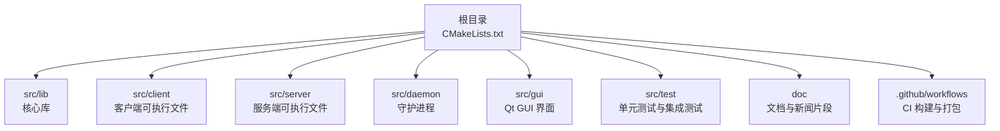
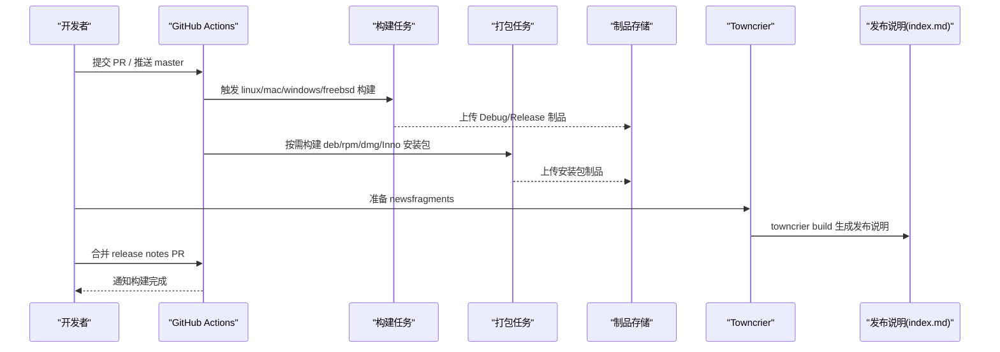
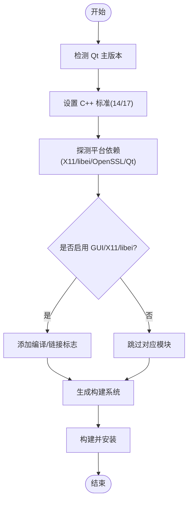
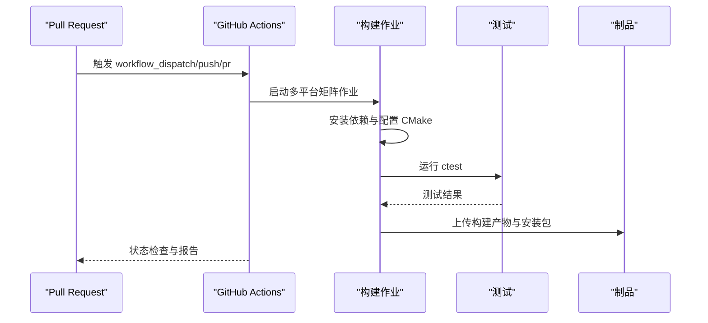
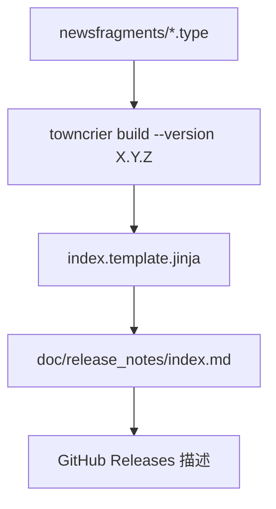
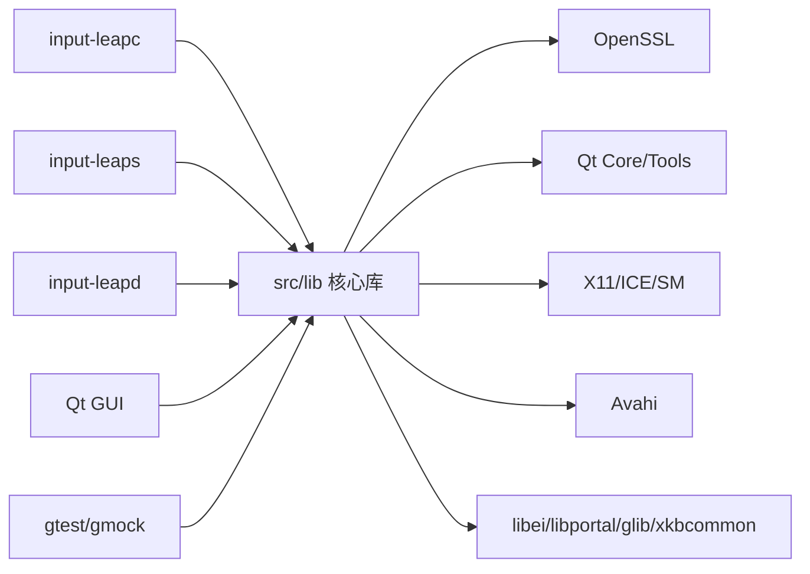
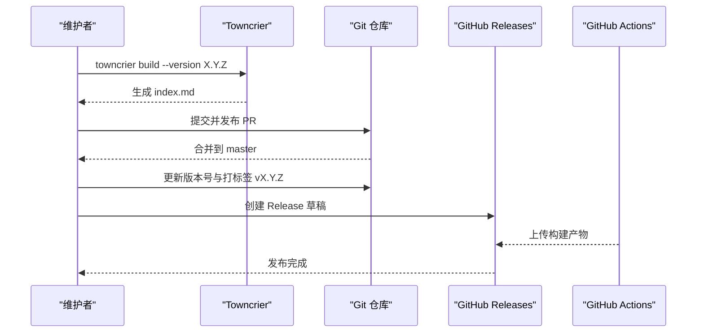

# 开发指南

<cite>
**本文引用的文件**
- [README.md](file://README.md)
- [RELEASING.md](file://RELEASING.md)
- [.github/PULL_REQUEST_TEMPLATE.md](file://.github/PULL_REQUEST_TEMPLATE.md)
- [doc/newsfragments/README.md](file://doc/newsfragments/README.md)
- [towncrier.toml](file://towncrier.toml)
- [doc/release_notes/index.template.jinja](file://doc/release_notes/index.template.jinja)
- [.editorconfig](file://.editorconfig)
- [CMakeLists.txt](file://CMakeLists.txt)
- [.github/workflows/builds.yml](file://.github/workflows/builds.yml)
- [.github/workflows/win-release.yml](file://.github/workflows/win-release.yml)
</cite>

## 目录
1. [简介](#简介)
2. [项目结构](#项目结构)
3. [核心组件](#核心组件)
4. [架构总览](#架构总览)
5. [详细组件分析](#详细组件分析)
6. [依赖关系分析](#依赖关系分析)
7. [性能与构建优化](#性能与构建优化)
8. [故障排除与调试](#故障排除与调试)
9. [贡献与协作规范](#贡献与协作规范)
10. [版本发布流程](#版本发布流程)
11. [结论](#结论)

## 简介
本指南面向希望为 Input Leap 做出贡献的开发者与维护者，涵盖代码贡献规范、编码标准、Git 工作流、分支与审查流程、新功能与 Bug 修复流程、文档与新闻片段管理、发布说明生成、调试技巧、性能分析与排障方法。Input Leap 是一个跨平台的键盘鼠标共享工具，支持 Windows、macOS、Linux、FreeBSD 等系统，强调可靠性与兼容性。

## 项目结构
仓库采用 CMake 作为构建系统，源码位于 src 下，按功能域划分为 client、server、daemon、gui、lib 等模块；测试位于 src/test；文档与发布相关配置位于 doc 与根目录；CI 流水线定义在 .github/workflows。

图表来源
- [CMakeLists.txt:18-48](file://CMakeLists.txt#L18-L48)
- [.github/workflows/builds.yml:1-20](file://.github/workflows/builds.yml#L1-L20)

章节来源
- [CMakeLists.txt:18-48](file://CMakeLists.txt#L18-L48)

## 核心组件
- 构建系统与平台适配：通过顶层 CMakeLists.txt 统一配置编译器标准、可选特性（GUI、X11、libei、Gulrak 文件系统）、OpenSSL、Qt 版本选择、各平台依赖探测与编译选项。
- 客户端与服务端：分别提供 input-leapc 与 input-leaps 可执行目标，链接 lib 下的基础库与平台抽象层。
- GUI：基于 Qt 的图形化配置与管理界面，包含多语言资源与零配置发现服务。
- 测试：使用 GoogleTest/GMock 进行单元与集成测试，CI 中自动运行。

章节来源
- [CMakeLists.txt:18-48](file://CMakeLists.txt#L18-L48)
- [CMakeLists.txt:71-89](file://CMakeLists.txt#L71-L89)
- [CMakeLists.txt:254-258](file://CMakeLists.txt#L254-L258)

## 架构总览
下图展示了从 PR 触发到多平台构建、打包与产物上传的整体 CI 流程，以及 Release 时生成发布说明的流程。

图表来源
- [.github/workflows/builds.yml:1-20](file://.github/workflows/builds.yml#L1-L20)
- [.github/workflows/builds.yml:194-232](file://.github/workflows/builds.yml#L194-L232)
- [.github/workflows/builds.yml:234-257](file://.github/workflows/builds.yml#L234-L257)
- [.github/workflows/builds.yml:314-421](file://.github/workflows/builds.yml#L314-L421)
- [.github/workflows/builds.yml:423-505](file://.github/workflows/builds.yml#L423-L505)
- [towncrier.toml:1-40](file://towncrier.toml#L1-L40)
- [doc/release_notes/index.template.jinja:1-38](file://doc/release_notes/index.template.jinja#L1-L38)

## 详细组件分析

### 构建与平台适配（CMake）
- 编译器与标准：根据 Qt 主版本选择 C++14/17；非 Debug 模式关闭断言；启用 -Wformat 警告。
- 可选特性开关：INPUTLEAP_BUILD_GUI、INPUTLEAP_BUILD_X11、INPUTLEAP_BUILD_LIBEI、INPUTLEAP_BUILD_GULRAK_FILESYSTEM、INPUTLEAP_USE_EXTERNAL_GTEST。
- 平台差异：
  - macOS：静态 OpenSSL、Bundle 打包、部署目标版本控制。
  - Linux：pkg-config 探测 X11、Avahi、libei、libportal、glib 等；Wayland/libei 条件编译。
  - Windows：MSVC 并行编译、Inno Setup/WiX 安装器配置。
- 输出目录：统一将二进制与库输出至构建目录 bin/lib。

图表来源
- [CMakeLists.txt:18-48](file://CMakeLists.txt#L18-L48)
- [CMakeLists.txt:71-89](file://CMakeLists.txt#L71-L89)
- [CMakeLists.txt:162-228](file://CMakeLists.txt#L162-L228)
- [CMakeLists.txt:254-258](file://CMakeLists.txt#L254-L258)

章节来源
- [CMakeLists.txt:18-48](file://CMakeLists.txt#L18-L48)
- [CMakeLists.txt:71-89](file://CMakeLists.txt#L71-L89)
- [CMakeLists.txt:162-228](file://CMakeLists.txt#L162-L228)
- [CMakeLists.txt:254-258](file://CMakeLists.txt#L254-L258)

### 持续集成与多平台构建（GitHub Actions）
- 触发条件：push 到 master、PR 到 master、release 事件、手动触发。
- 矩阵策略：覆盖 Ubuntu 多个发行版、Debian、Fedora、openSUSE、macOS 多架构、Windows 多版本、FreeBSD。
- 关键步骤：
  - 安装依赖（Qt、OpenSSL、X11、libei、libportal、glib、ninja 等）。
  - 配置与构建（Debug/Release），启用 Unity Build 加速。
  - 运行测试（ctest）。
  - 打包产物（tar.gz、deb、rpm、dmg、Inno 安装包、Flatpak）。
  - 上传制品供后续下载或发布。

图表来源
- [.github/workflows/builds.yml:1-20](file://.github/workflows/builds.yml#L1-L20)
- [.github/workflows/builds.yml:194-232](file://.github/workflows/builds.yml#L194-L232)
- [.github/workflows/builds.yml:234-257](file://.github/workflows/builds.yml#L234-L257)
- [.github/workflows/builds.yml:314-421](file://.github/workflows/builds.yml#L314-L421)
- [.github/workflows/builds.yml:423-505](file://.github/workflows/builds.yml#L423-L505)

章节来源
- [.github/workflows/builds.yml:1-20](file://.github/workflows/builds.yml#L1-L20)
- [.github/workflows/builds.yml:194-232](file://.github/workflows/builds.yml#L194-L232)
- [.github/workflows/builds.yml:234-257](file://.github/workflows/builds.yml#L234-L257)
- [.github/workflows/builds.yml:314-421](file://.github/workflows/builds.yml#L314-L421)
- [.github/workflows/builds.yml:423-505](file://.github/workflows/builds.yml#L423-L505)

### 发布说明与新闻片段（Towncrier）
- 新闻片段目录：doc/newsfragments，按类型扩展名组织（feature、bugfix、security、doc、removal）。
- 配置文件：towncrier.toml 指定输入目录、输出文件、模板与分类标题。
- 模板：doc/release_notes/index.template.jinja 控制最终 Markdown 的结构与内容展示。
- 维护者流程：在 RELEASING.md 中描述如何生成发布说明、打标签与创建 GitHub Release。

图表来源
- [doc/newsfragments/README.md:1-13](file://doc/newsfragments/README.md#L1-L13)
- [towncrier.toml:1-40](file://towncrier.toml#L1-L40)
- [doc/release_notes/index.template.jinja:1-38](file://doc/release_notes/index.template.jinja#L1-L38)
- [RELEASING.md:14-26](file://RELEASING.md#L14-L26)
- [RELEASING.md:53-64](file://RELEASING.md#L53-L64)

章节来源
- [doc/newsfragments/README.md:1-13](file://doc/newsfragments/README.md#L1-L13)
- [towncrier.toml:1-40](file://towncrier.toml#L1-L40)
- [doc/release_notes/index.template.jinja:1-38](file://doc/release_notes/index.template.jinja#L1-L38)
- [RELEASING.md:14-26](file://RELEASING.md#L14-L26)
- [RELEASING.md:53-64](file://RELEASING.md#L53-L64)

### 代码风格与编辑器配置
- EditorConfig：统一换行符（LF）、UTF-8 编码、去除尾部空白、末尾换行、缩进为空格且大小为 4。
- 建议：在 IDE 中启用 EditorConfig 插件以保持一致性。

章节来源
- [.editorconfig:1-10](file://.editorconfig#L1-L10)

## 依赖关系分析
- 外部依赖：
  - Qt（Core/Tools/Localization），用于 GUI 与国际化。
  - OpenSSL（SSL/Crypto），用于安全通信。
  - X11（x11/xext/xrandr/xinerama/xtst/xi）与 ICE/SM，用于 Linux 输入捕获与屏幕交互。
  - Avahi（avahi-compat-libdns_sd），用于零配置网络发现。
  - Wayland/libei/libportal/glib/xkbcommon，用于 Wayland 输入捕获与远程桌面会话。
  - gtest/gmock，用于测试框架。
- 内部模块：
  - src/lib 提供 arch/base/common/io/ipc/net/platform/server/client 等分层能力。
  - src/client 与 src/server 分别链接上述库形成可执行目标。

图表来源
- [CMakeLists.txt:71-89](file://CMakeLists.txt#L71-L89)
- [CMakeLists.txt:162-228](file://CMakeLists.txt#L162-L228)
- [CMakeLists.txt:254-258](file://CMakeLists.txt#L254-L258)

章节来源
- [CMakeLists.txt:71-89](file://CMakeLists.txt#L71-L89)
- [CMakeLists.txt:162-228](file://CMakeLists.txt#L162-L228)
- [CMakeLists.txt:254-258](file://CMakeLists.txt#L254-L258)

## 性能与构建优化
- 构建加速：
  - 启用 Unity Build（CMAKE_UNITY_BUILD=1）以减少编译时间。
  - 使用 Ninja 生成器提升增量构建速度。
  - 合理设置并行度（--parallel）与缓存（如 macOS OpenSSL 缓存）。
- 平台特定优化：
  - Windows MSVC 开启并行编译与优化选项。
  - macOS 指定部署目标版本与架构（Universal/Apple Silicon）。
  - Linux 按需启用 libei 与 Wayland 支持，避免不必要的依赖。
- 运行时性能：
  - 减少不必要的日志输出与锁竞争。
  - 针对输入事件路径进行热点优化与批处理。

[本节为通用指导，不直接分析具体文件]

## 故障排除与调试
- 构建失败常见原因：
  - 缺少 pkg-config 或依赖头文件（如 dns_sd.h、X11、libei）。
  - Qt 版本不匹配或未正确安装。
  - OpenSSL 路径未正确配置（尤其在 macOS 上）。
- 定位问题：
  - 查看 CI 日志中的错误输出与命令参数。
  - 本地复现时使用 Debug 构建并启用详细日志（VERBOSE=1）。
  - 使用 ctest 运行测试用例，缩小问题范围。
- 平台特有问题：
  - Wayland/libei：确认 libportal 与 dbus 环境可用。
  - macOS：确保 SDK 与部署目标一致，必要时清理缓存重新构建 OpenSSL。
  - Windows：检查 Bonjour SDK 与 Inno Setup 安装路径。

章节来源
- [.github/workflows/builds.yml:194-232](file://.github/workflows/builds.yml#L194-L232)
- [.github/workflows/builds.yml:314-421](file://.github/workflows/builds.yml#L314-L421)
- [.github/workflows/builds.yml:423-505](file://.github/workflows/builds.yml#L423-L505)

## 贡献与协作规范
- 提交流程：
  - Fork 仓库，创建功能分支，提交变更后发起 Pull Request。
  - PR 模板要求：若变更影响终端用户，需在 doc/newsfragments 中添加新闻片段；否则勾选“不影响终端用户”。
- 代码审查：
  - 保持 PR 小而精，附带必要测试与文档更新。
  - 遵循 EditorConfig 与 CMake 配置约定的编码风格。
- 分支策略：
  - 默认分支为 master，功能分支命名建议 feature/*、fix/*、chore/*。
  - 发布分支（如 release）仅用于整理发布说明与版本号。
- 沟通渠道：
  - IRC 频道 #inputleap（用户支持）与 #inputleap-dev（开发讨论）。

章节来源
- [.github/PULL_REQUEST_TEMPLATE.md:1-5](file://.github/PULL_REQUEST_TEMPLATE.md#L1-L5)
- [doc/newsfragments/README.md:1-13](file://doc/newsfragments/README.md#L1-L13)
- [.editorconfig:1-10](file://.editorconfig#L1-L10)
- [README.md:5-8](file://README.md#L5-L8)

## 版本发布流程
- 维护者步骤：
  - 设置环境变量 VERSION=X.Y.Z。
  - 新建 release 分支，运行 towncrier build 生成发布说明并提交。
  - 合并发布说明 PR 到 master。
  - 更新版本号相关文件（cmake/Version.cmake、man 页、issue 模板、debian changelog）。
  - 提交并签名标签 vX.Y.Z，推送到远端。
  - 在 GitHub Releases 页面创建草稿，使用生成的发布说明作为描述，上传 CI 产物。
- 自动化支持：
  - builds.yml 负责多平台构建与打包。
  - win-release.yml 提供 Windows CLI 快速构建脚本。

图表来源
- [RELEASING.md:14-26](file://RELEASING.md#L14-L26)
- [RELEASING.md:30-51](file://RELEASING.md#L30-L51)
- [RELEASING.md:53-64](file://RELEASING.md#L53-L64)
- [.github/workflows/builds.yml:194-232](file://.github/workflows/builds.yml#L194-L232)
- [.github/workflows/win-release.yml:1-36](file://.github/workflows/win-release.yml#L1-L36)

章节来源
- [RELEASING.md:14-26](file://RELEASING.md#L14-L26)
- [RELEASING.md:30-51](file://RELEASING.md#L30-L51)
- [RELEASING.md:53-64](file://RELEASING.md#L53-L64)
- [.github/workflows/builds.yml:194-232](file://.github/workflows/builds.yml#L194-L232)
- [.github/workflows/win-release.yml:1-36](file://.github/workflows/win-release.yml#L1-L36)

## 结论
本指南总结了 Input Leap 的开发环境与工作流程，包括构建系统、CI 流水线、代码风格、贡献与审查规范、新闻片段与发布说明生成、以及版本发布流程。遵循本文档有助于提高协作效率与代码质量，确保跨平台构建的稳定性和可维护性。