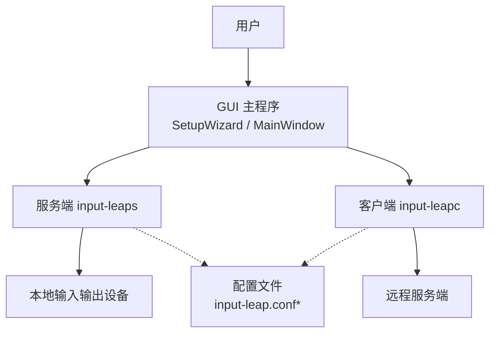
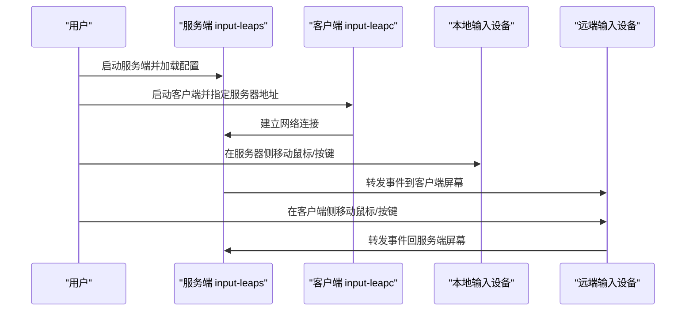
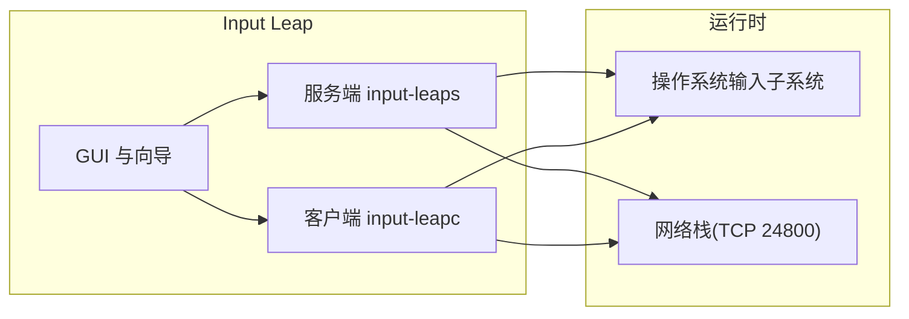

# 快速开始

<cite>
**本文引用的文件**   
- [README.md](file://README.md)
- [input-leaps.1](file://doc/input-leaps.1)
- [input-leapc.1](file://doc/input-leapc.1)
- [input-leap.conf.example](file://doc/input-leap.conf.example)
- [input-leap.conf.example-basic](file://doc/input-leap.conf.example-basic)
- [input-leap.conf.example-barebones](file://doc/input-leap.conf.example-barebones)
- [input-leap.conf.example-advanced](file://doc/input-leap.conf.example-advanced)
- [MacReadme.txt](file://doc/MacReadme.txt)
- [SetupWizard.cpp](file://src/gui/src/SetupWizard.cpp)
</cite>

## 目录
1. [简介](#简介)
2. [项目结构](#项目结构)
3. [核心组件](#核心组件)
4. [架构总览](#架构总览)
5. [详细组件分析](#详细组件分析)
6. [依赖关系分析](#依赖关系分析)
7. [性能注意事项](#性能注意事项)
8. [故障排除指南](#故障排除指南)
9. [结论](#结论)
10. [附录](#附录)

## 简介
本指南面向首次使用 Input Leap 的用户，帮助你在最短时间内完成安装、配置并成功运行。你将学会：
- 在各平台获取与安装安装包
- 设置服务器端与客户端屏幕
- 配置网络参数（地址、端口）
- 使用命令行启动服务与客户端
- 理解配置文件格式与常用示例
- 处理常见问题与基本排障

Input Leap 通过软件模拟 KVM 切换器功能，让你用一套键鼠控制多台计算机。只需将鼠标移动到屏幕边缘或按快捷键即可在系统间切换。

**章节来源**
- [README.md:10-67](file://README.md#L10-L67)

## 项目结构
仓库包含服务端、客户端、GUI 以及文档与示例配置等关键部分：
- 服务端可执行程序与服务守护进程
- 客户端可执行程序
- GUI 向导与主界面
- 手册页与示例配置文件
- 平台特定说明（如 macOS 二进制安装步骤）

**图表来源**
- [SetupWizard.cpp:26-132](file://src/gui/src/SetupWizard.cpp#L26-L132)
- [input-leaps.1:1-85](file://doc/input-leaps.1#L1-L85)
- [input-leapc.1:1-71](file://doc/input-leapc.1#L1-L71)
- [input-leap.conf.example:1-38](file://doc/input-leap.conf.example#L1-L38)

**章节来源**
- [README.md:48-67](file://README.md#L48-L67)
- [SetupWizard.cpp:26-132](file://src/gui/src/SetupWizard.cpp#L26-L132)

## 核心组件
- 服务端（input-leaps）：监听客户端连接，转发键盘与鼠标事件到本机，并根据配置决定屏幕布局与跳转逻辑。
- 客户端（input-leapc）：连接到服务端，将本地输入事件发送到服务端，并在跨屏时接收远端事件。
- GUI 向导与主界面：引导你选择“服务器”或“客户端”模式，自动发现与添加屏幕，保存配置。
- 配置文件：定义屏幕名称、相对位置链接与别名映射，用于描述多机拓扑。

**章节来源**
- [input-leaps.1:1-85](file://doc/input-leaps.1#L1-L85)
- [input-leapc.1:1-71](file://doc/input-leapc.1#L1-L71)
- [SetupWizard.cpp:26-132](file://src/gui/src/SetupWizard.cpp#L26-L132)
- [input-leap.conf.example:1-38](file://doc/input-leap.conf.example#L1-L38)

## 架构总览
下图展示了典型的双机或多机协作流程：一台作为服务器，其他作为客户端；所有机器均需安装 Input Leap。

**图表来源**
- [input-leaps.1:1-85](file://doc/input-leaps.1#L1-L85)
- [input-leapc.1:1-71](file://doc/input-leapc.1#L1-L71)
- [README.md:48-67](file://README.md#L48-L67)

## 详细组件分析

### 安装与获取
- Windows/macOS/Linux/FreeBSD/OpenBSD：从官方发布页面下载对应平台的安装包或压缩包。
- Linux 发行版：可通过包管理器或第三方打包站点获取（详见 README 中的分发信息）。
- macOS 压缩包安装：解压后复制二进制到系统路径并修正权限（参考 Mac 说明）。

提示：
- 所有需要共享键鼠的机器都必须安装 Input Leap。
- 若使用 GUI，可在主界面中点击“配置服务器”，拖拽新屏幕到网格以添加客户端屏幕。

**章节来源**
- [README.md:94-122](file://README.md#L94-L122)
- [README.md:48-67](file://README.md#L48-L67)
- [MacReadme.txt:1-14](file://doc/MacReadme.txt#L1-L14)

### 首次配置流程（GUI 向导）
- 启动 GUI 后，向导会引导你选择“服务器”或“客户端”模式。
- 在服务器模式下，点击“配置服务器”，为每个客户端屏幕添加一个格子，并确保“屏幕名称”完全一致（区分大小写）。
- 在客户端上输入服务器 IP 地址（或使用自动发现），然后启动。
- 当两端均显示“Input Leap 正在运行”时，即可跨屏移动鼠标。

注意：
- 如果键盘 Scroll Lock 处于激活状态，可能会阻止鼠标跨屏切换。

**章节来源**
- [SetupWizard.cpp:26-132](file://src/gui/src/SetupWizard.cpp#L26-L132)
- [README.md:48-67](file://README.md#L48-L67)

### 命令行启动示例
- 服务端
  - 监听地址与端口：--address <主机名或IP>[:端口]
  - 指定配置文件：--config <路径>
  - 前台运行：--no-daemon
  - 调试级别：--debug <级别>
  - 日志输出：--log <文件>
- 客户端
  - 指定服务器地址：<server-address>（支持 [<主机名>][:<端口>]）
  - 前台运行：--no-daemon
  - 调试级别：--debug <级别>
  - 日志输出：--log <文件>

默认端口为 24800；IPv6 地址加端口时需使用方括号包裹。

**章节来源**
- [input-leaps.1:1-85](file://doc/input-leaps.1#L1-L85)
- [input-leapc.1:1-71](file://doc/input-leapc.1#L1-L71)

### 配置文件格式说明
配置文件采用分节语法，主要包含：
- section: screens：定义逻辑屏幕名称（便于书写配置）
- section: links：定义屏幕之间的相对位置与相邻关系（left/right/up/down 等）
- section: aliases：将真实主机名映射到逻辑屏幕名称

常见用法：
- 基础双机并列：定义两个屏幕，互为左右邻居
- 三机布局：定义三个屏幕，分别声明上下左右关系
- 高级布局：可为相邻边指定偏移坐标，实现更精细的对齐

配置文件默认加载顺序（未显式指定 --config 时）：
- $HOME/.config/InputLeap/input-leap.conf
- /etc/input-leap.conf

**章节来源**
- [input-leap.conf.example:1-38](file://doc/input-leap.conf.example#L1-L38)
- [input-leap.conf.example-basic:1-40](file://doc/input-leap.conf.example-basic#L1-L40)
- [input-leap.conf.example-barebones:1-18](file://doc/input-leap.conf.example-barebones#L1-L18)
- [input-leap.conf.example-advanced:1-50](file://doc/input-leap.conf.example-advanced#L1-L50)
- [input-leaps.1:70-85](file://doc/input-leaps.1#L70-L85)

### 使用场景示例
- 双显示器/双机并列：
  - 在服务器上定义两个屏幕，互为 left/right 邻居
  - 客户端屏幕名称需与服务器一致
- 多计算机共享（三机及以上）：
  - 在 servers 段列出所有逻辑屏幕
  - 在 links 段逐一声明相邻方向
  - 使用 aliases 将真实主机名映射到逻辑名，简化维护
- 复杂布局（带偏移）：
  - 在 links 中使用 (x, y) 偏移参数，精确对齐不同分辨率或排列方式

**章节来源**
- [input-leap.conf.example-basic:1-40](file://doc/input-leap.conf.example-basic#L1-L40)
- [input-leap.conf.example-advanced:1-50](file://doc/input-leap.conf.example-advanced#L1-L50)

## 依赖关系分析
- 运行时依赖
  - 操作系统输入子系统（Windows/macOS/X11/Wayland 等）
  - 网络栈（TCP 默认端口 24800）
- 可选特性
  - SSL 加密插件（--enable-crypto）
  - 文件拖放（--enable-drag-drop）
  - 系统托盘图标（--no-tray 可禁用）
- GUI 与向导
  - 向导负责保存语言、模式选择等应用设置，并触发零配置服务更新

**图表来源**
- [input-leaps.1:1-85](file://doc/input-leaps.1#L1-L85)
- [input-leapc.1:1-71](file://doc/input-leapc.1#L1-L71)
- [SetupWizard.cpp:26-132](file://src/gui/src/SetupWizard.cpp#L26-L132)

**章节来源**
- [input-leaps.1:1-85](file://doc/input-leaps.1#L1-L85)
- [input-leapc.1:1-71](file://doc/input-leapc.1#L1-L71)
- [SetupWizard.cpp:26-132](file://src/gui/src/SetupWizard.cpp#L26-L132)

## 性能注意事项
- 默认端口 24800，避免与其他服务冲突
- 在高延迟或不稳定网络环境下，建议启用加密插件以提升安全性（可能带来轻微开销）
- 关闭不必要的托盘图标可减少 UI 资源占用
- 合理设置调试级别，仅在排查问题时开启高详细度日志

[本节为通用指导，不直接分析具体文件]

## 故障排除指南
- 无法跨屏切换
  - 检查是否启用了 Scroll Lock（会阻止跨屏）
  - 确认服务器与客户端的屏幕名称完全一致（区分大小写）
  - 确认客户端已正确填写服务器 IP 或使用了自动发现
- 客户端“服务器 IP”为空
  - 手动编辑配置文件，在 options 段添加 serverhostname=...
- 找不到配置文件
  - 确保配置文件位于默认路径之一，或通过 --config 指定
- 网络连通性问题
  - 检查防火墙是否放行 TCP 24800
  - IPv6 地址加端口时需使用方括号包裹
- 日志定位问题
  - 使用 --log 输出日志文件，结合 --debug 提高日志级别进行诊断

**章节来源**
- [README.md:48-67](file://README.md#L48-L67)
- [README.md:132-147](file://README.md#L132-L147)
- [input-leaps.1:65-85](file://doc/input-leaps.1#L65-L85)
- [input-leapc.1:59-71](file://doc/input-leapc.1#L59-L71)

## 结论
通过以上步骤，你应该已经能够在最短时间成功运行 Input Leap。建议先从最简单的双机并列场景开始，逐步扩展到多机与复杂布局。遇到问题时，优先检查屏幕名称一致性、网络连通性与日志输出。

[本节为总结性内容，不直接分析具体文件]

## 附录
- 更多示例配置与进阶选项请参考 doc 目录下的示例文件与手册页
- 社区支持与反馈渠道参见 README 中的联系方式与问题跟踪链接

[本节为补充信息，不直接分析具体文件]