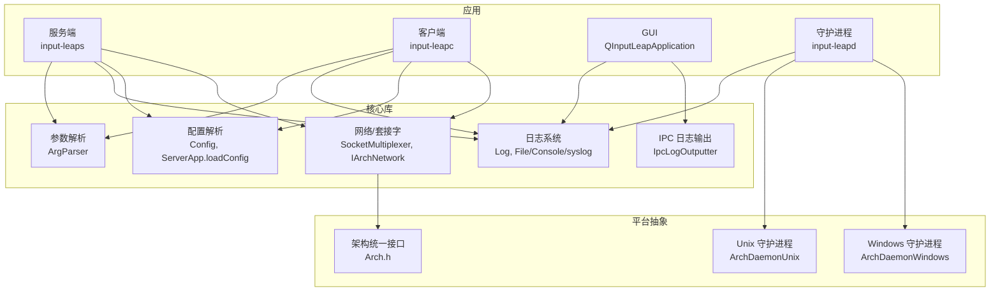
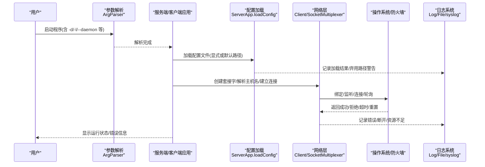
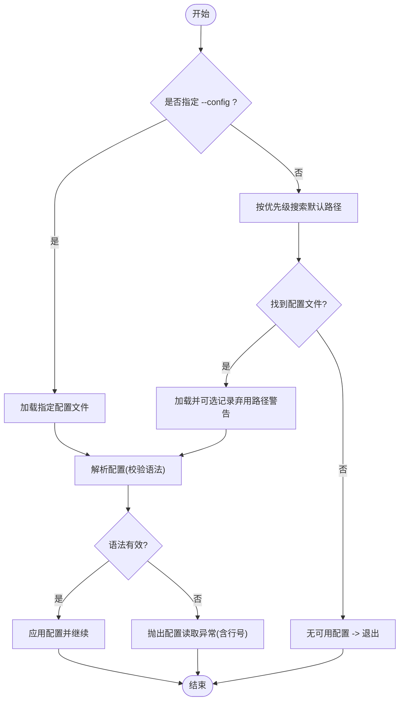
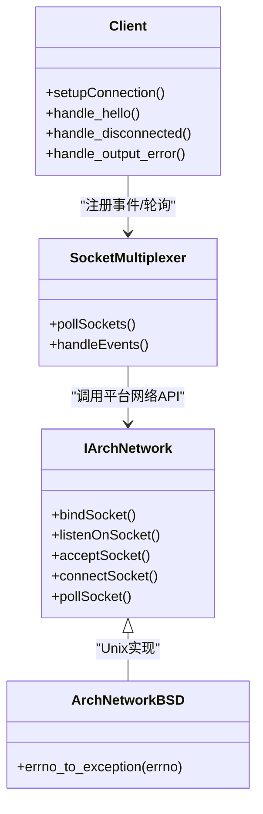
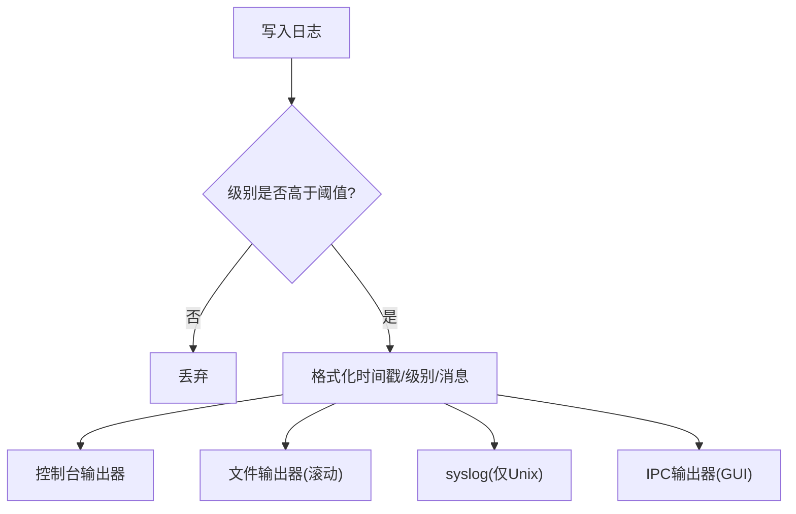
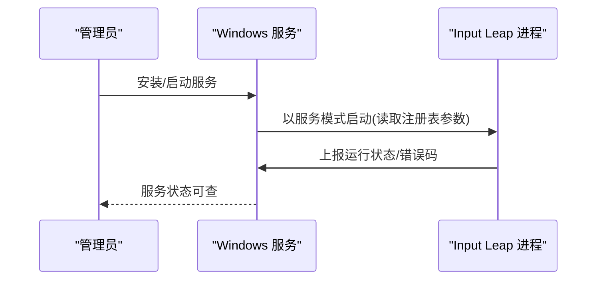
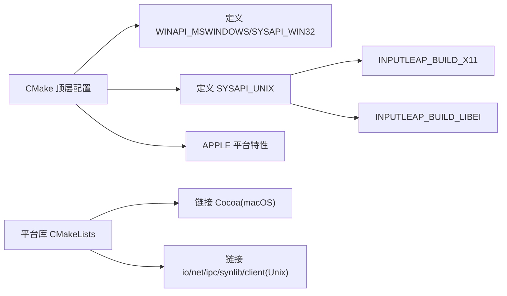

# 故障排除

<cite>
**本文引用的文件**   
- [README.md](file://README.md)
- [ArgParser.cpp](file://src/lib/inputleap/ArgParser.cpp)
- [ServerApp.cpp](file://src/lib/inputleap/ServerApp.cpp)
- [Config.cpp](file://src/lib/server/Config.cpp)
- [input-leap.conf.example](file://doc/input-leap.conf.example)
- [input-leap.conf.example-advanced](file://doc/input-leap.conf.example-advanced)
- [Log.h](file://src/lib/base/Log.h)
- [Log.cpp](file://src/lib/base/Log.cpp)
- [log_outputters.cpp](file://src/lib/base/log_outputters.cpp)
- [ArchLogUnix.cpp](file://src/lib/arch/unix/ArchLogUnix.cpp)
- [LogWindow.cpp](file://src/gui/src/LogWindow.cpp)
- [Client.cpp](file://src/lib/client/Client.cpp)
- [IArchNetwork.h](file://src/lib/arch/IArchNetwork.h)
- [ArchNetworkBSD.cpp](file://src/lib/arch/unix/ArchNetworkBSD.cpp)
- [SocketMultiplexer.cpp](file://src/lib/net/SocketMultiplexer.cpp)
- [ConnectionSecurityLevel.h](file://src/lib/net/ConnectionSecurityLevel.h)
- [IArchDaemon.h](file://src/lib/arch/IArchDaemon.h)
- [ArchDaemonWindows.h](file://src/lib/arch/win32/ArchDaemonWindows.h)
- [ArchDaemonWindows.cpp](file://src/lib/arch/win32/ArchDaemonWindows.cpp)
- [ArchDaemonUnix.h](file://src/lib/arch/unix/ArchDaemonUnix.h)
- [CMakeLists.txt](file://CMakeLists.txt)
- [platform/CMakeLists.txt](file://src/lib/platform/CMakeLists.txt)
</cite>

## 目录
1. [简介](#简介)
2. [项目结构](#项目结构)
3. [核心组件](#核心组件)
4. [架构总览](#架构总览)
5. [详细组件分析](#详细组件分析)
6. [依赖关系分析](#依赖关系分析)
7. [性能考虑](#性能考虑)
8. [故障排除指南](#故障排除指南)
9. [结论](#结论)
10. [附录](#附录)

## 简介
本指南面向 Input Leap 的用户与管理员，聚焦安装、配置与运行时的常见问题定位与解决。内容涵盖：
- 常见安装问题（平台依赖、服务/守护进程权限）
- 配置错误（配置文件路径、语法、屏幕布局与别名）
- 运行时故障（网络连接、握手与安全级别、输入捕获）
- 日志分析方法与诊断步骤
- 性能问题的识别与优化建议
- 社区支持与问题报告渠道

## 项目结构
Input Leap 采用分层与平台抽象相结合的结构：
- 应用层：服务端、客户端、GUI、守护进程入口
- 核心库：网络、IPC、事件队列、平台抽象、日志系统
- 平台适配：Windows/macOS/Linux/X11/libei 等后端
- 文档与示例：配置文件样例、手册页、平台说明

图表来源
- [CMakeLists.txt:207-248](file://CMakeLists.txt#L207-L248)
- [platform/CMakeLists.txt:32-73](file://src/lib/platform/CMakeLists.txt#L32-L73)
- [Arch.h:33-73](file://src/lib/arch/Arch.h#L33-L73)

章节来源
- [CMakeLists.txt:207-248](file://CMakeLists.txt#L207-L248)
- [platform/CMakeLists.txt:32-73](file://src/lib/platform/CMakeLists.txt#L32-L73)

## 核心组件
- 参数与启动流程：命令行参数解析、守护进程模式、日志级别与输出目标
- 配置加载：默认路径、弃用路径兼容、配置语法校验与错误提示
- 网络连接：地址解析、安全级别协商、连接建立与重试
- 日志系统：多输出器（控制台、文件、syslog、IPC）、滚动与限流
- 平台能力：Windows 服务安装/状态、Unix 守护进程、X11/libei 构建开关

章节来源
- [ArgParser.cpp:317-368](file://src/lib/inputleap/ArgParser.cpp#L317-L368)
- [ServerApp.cpp:190-272](file://src/lib/inputleap/ServerApp.cpp#L190-L272)
- [Config.cpp:1799-2252](file://src/lib/server/Config.cpp#L1799-L2252)
- [Client.cpp:122-481](file://src/lib/client/Client.cpp#L122-L481)
- [Log.h:1-189](file://src/lib/base/Log.h#L1-L189)
- [Log.cpp:46-158](file://src/lib/base/Log.cpp#L46-L158)
- [log_outputters.cpp:268-343](file://src/lib/base/log_outputters.cpp#L268-L343)
- [ArchLogUnix.cpp:55-84](file://src/lib/arch/unix/ArchLogUnix.cpp#L55-L84)
- [IArchDaemon.h:98-129](file://src/lib/arch/IArchDaemon.h#L98-L129)
- [ArchDaemonWindows.h:72-110](file://src/lib/arch/win32/ArchDaemonWindows.h#L72-L110)
- [ArchDaemonWindows.cpp:286-458](file://src/lib/arch/win32/ArchDaemonWindows.cpp#L286-L458)
- [ArchDaemonUnix.h:1-41](file://src/lib/arch/unix/ArchDaemonUnix.h#L1-L41)

## 架构总览
下图展示从启动到建立连接的典型调用链，以及关键异常点与日志位置。

图表来源
- [ArgParser.cpp:317-368](file://src/lib/inputleap/ArgParser.cpp#L317-L368)
- [ServerApp.cpp:190-272](file://src/lib/inputleap/ServerApp.cpp#L190-L272)
- [Client.cpp:122-481](file://src/lib/client/Client.cpp#L122-L481)
- [SocketMultiplexer.cpp:170-206](file://src/lib/net/SocketMultiplexer.cpp#L170-L206)
- [ArchLogUnix.cpp:55-84](file://src/lib/arch/unix/ArchLogUnix.cpp#L55-L84)

## 详细组件分析

### 配置加载与语法校验
- 加载顺序：优先使用显式 --config；否则在用户配置目录与系统目录查找默认文件名；兼容旧版隐藏配置文件路径并给出弃用提示
- 语法校验：逐行读取、去除注释与空白、非法字符检测、区间与角落参数校验，失败时抛出带行号的配置读取异常
- 常见错误：缺少分隔符、无效区间值、非法字符、未找到配置导致退出

图表来源
- [ServerApp.cpp:190-272](file://src/lib/inputleap/ServerApp.cpp#L190-L272)
- [Config.cpp:1799-2252](file://src/lib/server/Config.cpp#L1799-L2252)

章节来源
- [ServerApp.cpp:190-272](file://src/lib/inputleap/ServerApp.cpp#L190-L272)
- [Config.cpp:1799-2252](file://src/lib/server/Config.cpp#L1799-L2252)
- [input-leap.conf.example](file://doc/input-leap.conf.example)
- [input-leap.conf.example-advanced](file://doc/input-leap.conf.example-advanced)

### 网络连接与错误分类
- 客户端连接流程：解析服务器主机名、创建套接字、设置过滤器、发起连接、注册事件处理（断开、输入就绪、输出错误等）
- 网络错误映射：将底层 errno 映射为具体异常类型（如地址占用、无路由、连接被拒、已关闭、资源不足等），便于快速定位
- 轮询与异常恢复：SocketMultiplexer 在 poll 阶段捕获异常并记录告警，避免主循环崩溃

图表来源
- [Client.cpp:122-481](file://src/lib/client/Client.cpp#L122-L481)
- [SocketMultiplexer.cpp:170-206](file://src/lib/net/SocketMultiplexer.cpp#L170-L206)
- [IArchNetwork.h:142-174](file://src/lib/arch/IArchNetwork.h#L142-L174)
- [ArchNetworkBSD.cpp:757-807](file://src/lib/arch/unix/ArchNetworkBSD.cpp#L757-L807)

章节来源
- [Client.cpp:122-481](file://src/lib/client/Client.cpp#L122-L481)
- [SocketMultiplexer.cpp:170-206](file://src/lib/net/SocketMultiplexer.cpp#L170-L206)
- [IArchNetwork.h:142-174](file://src/lib/arch/IArchNetwork.h#L142-L174)
- [ArchNetworkBSD.cpp:757-807](file://src/lib/arch/unix/ArchNetworkBSD.cpp#L757-L807)

### 日志系统与诊断
- 日志级别与过滤：支持 FATAL/ERROR/WARNING/INFO/DEBUG 等多级，默认在非调试构建中仅输出 INFO 及以上
- 输出目标：控制台、文件（自动滚动）、syslog（Unix）、IPC（供 GUI 实时查看）
- 文件滚动：超过阈值后重命名为 .1，避免无限增长
- Unix 系统日志：将内部级别映射到 syslog 优先级

图表来源
- [Log.h:1-189](file://src/lib/base/Log.h#L1-L189)
- [Log.cpp:46-158](file://src/lib/base/Log.cpp#L46-L158)
- [log_outputters.cpp:268-343](file://src/lib/base/log_outputters.cpp#L268-L343)
- [ArchLogUnix.cpp:55-84](file://src/lib/arch/unix/ArchLogUnix.cpp#L55-L84)
- [LogWindow.cpp:1-103](file://src/gui/src/LogWindow.cpp#L1-L103)

章节来源
- [Log.h:1-189](file://src/lib/base/Log.h#L1-L189)
- [Log.cpp:46-158](file://src/lib/base/Log.cpp#L46-L158)
- [log_outputters.cpp:268-343](file://src/lib/base/log_outputters.cpp#L268-L343)
- [ArchLogUnix.cpp:55-84](file://src/lib/arch/unix/ArchLogUnix.cpp#L55-L84)
- [LogWindow.cpp:1-103](file://src/gui/src/LogWindow.cpp#L1-L103)

### 守护进程与服务管理（Windows/Unix）
- Windows：通过服务控制管理器注册服务，支持安装/卸载、查询状态、读取注册表中的命令行参数、设置服务状态与错误码
- Unix：提供 daemonize 接口，配合系统初始化脚本或 systemd 管理
- 权限检查：提供 canInstallDaemon/isDaemonInstalled 等能力判断

图表来源
- [IArchDaemon.h:98-129](file://src/lib/arch/IArchDaemon.h#L98-L129)
- [ArchDaemonWindows.h:72-110](file://src/lib/arch/win32/ArchDaemonWindows.h#L72-L110)
- [ArchDaemonWindows.cpp:286-458](file://src/lib/arch/win32/ArchDaemonWindows.cpp#L286-L458)
- [ArchDaemonUnix.h:1-41](file://src/lib/arch/unix/ArchDaemonUnix.h#L1-L41)

章节来源
- [IArchDaemon.h:98-129](file://src/lib/arch/IArchDaemon.h#L98-L129)
- [ArchDaemonWindows.h:72-110](file://src/lib/arch/win32/ArchDaemonWindows.h#L72-L110)
- [ArchDaemonWindows.cpp:286-458](file://src/lib/arch/win32/ArchDaemonWindows.cpp#L286-L458)
- [ArchDaemonUnix.h:1-41](file://src/lib/arch/unix/ArchDaemonUnix.h#L1-L41)

## 依赖关系分析
- 平台构建开关：Linux 下需选择 X11 或 libei 之一，否则构建失败；macOS 使用 Carbon；Windows 使用 Winsock
- 平台库链接：macOS 链接 Cocoa；Unix 平台链接 io/net/ipc/synlib/client 等子模块
- 架构统一接口：通过 Arch.h 聚合各平台实现，屏蔽差异

图表来源
- [CMakeLists.txt:207-248](file://CMakeLists.txt#L207-L248)
- [platform/CMakeLists.txt:32-73](file://src/lib/platform/CMakeLists.txt#L32-L73)

章节来源
- [CMakeLists.txt:207-248](file://CMakeLists.txt#L207-L248)
- [platform/CMakeLists.txt:32-73](file://src/lib/platform/CMakeLists.txt#L32-L73)

## 性能考虑
- 日志开销：在高频率场景下，降低日志级别或关闭不必要的 DEBUG 输出可减少 CPU 与 I/O 压力
- 文件滚动：合理设置文件大小上限，避免频繁重命名带来的额外开销
- 网络轮询：SocketMultiplexer 的 poll 异常捕获会记录告警，但不应影响主循环；关注资源不足类异常（内存/句柄耗尽）
- GUI 刷新：日志窗口定时刷新，限制最大行数以避免内存膨胀

[本节为通用指导，不直接分析具体文件]

## 故障排除指南

### 一、安装与平台兼容性问题
- Linux 构建要求：必须启用 X11 或 libei 其中之一，否则构建失败
  - 现象：构建时报错“需要 X11 或 libei”
  - 排查：检查构建选项 INPUTLEAP_BUILD_X11 与 INPUTLEAP_BUILD_LIBEI
  - 参考：[CMakeLists.txt:207-248](file://CMakeLists.txt#L207-L248)
- macOS 平台：需要 Cocoa 框架链接
  - 现象：链接阶段找不到 Cocoa
  - 排查：确认 Apple 平台编译环境与依赖
  - 参考：[platform/CMakeLists.txt:32-73](file://src/lib/platform/CMakeLists.txt#L32-L73)
- Windows 服务安装失败：
  - 现象：无法安装/卸载服务，或启动后立即停止
  - 排查：检查管理员权限、服务注册表项、服务状态与错误码
  - 参考：[ArchDaemonWindows.cpp:286-458](file://src/lib/arch/win32/ArchDaemonWindows.cpp#L286-L458)、[ArchDaemonWindows.h:72-110](file://src/lib/arch/win32/ArchDaemonWindows.h#L72-L110)

章节来源
- [CMakeLists.txt:207-248](file://CMakeLists.txt#L207-L248)
- [platform/CMakeLists.txt:32-73](file://src/lib/platform/CMakeLists.txt#L32-L73)
- [ArchDaemonWindows.cpp:286-458](file://src/lib/arch/win32/ArchDaemonWindows.cpp#L286-L458)
- [ArchDaemonWindows.h:72-110](file://src/lib/arch/win32/ArchDaemonWindows.h#L72-L110)

### 二、配置错误与修复
- 找不到配置文件：
  - 现象：启动后提示“无可用配置”并退出
  - 排查：确认 --config 路径或默认路径是否存在；注意弃用路径兼容性
  - 参考：[ServerApp.cpp:190-272](file://src/lib/inputleap/ServerApp.cpp#L190-L272)
- 配置语法错误：
  - 现象：抛出“配置读取异常”，包含行号与错误描述
  - 排查：检查非法字符、缺失分隔符、区间值范围、角落参数完整性
  - 参考：[Config.cpp:1799-2252](file://src/lib/server/Config.cpp#L1799-L2252)
- 屏幕名称大小写不一致：
  - 现象：客户端无法匹配服务器配置的屏幕名
  - 排查：确保 screens 与 links 中的名称完全一致（区分大小写）
  - 参考：[README.md:48-63](file://README.md#L48-L63)
- 示例配置参考：
  - 基础布局与别名映射
  - 参考：[input-leap.conf.example](file://doc/input-leap.conf.example)、[input-leap.conf.example-advanced](file://doc/input-leap.conf.example-advanced)

章节来源
- [ServerApp.cpp:190-272](file://src/lib/inputleap/ServerApp.cpp#L190-L272)
- [Config.cpp:1799-2252](file://src/lib/server/Config.cpp#L1799-L2252)
- [README.md:48-63](file://README.md#L48-L63)
- [input-leap.conf.example](file://doc/input-leap.conf.example)
- [input-leap.conf.example-advanced](file://doc/input-leap.conf.example-advanced)

### 三、网络连接问题
- 主机名解析失败：
  - 现象：客户端无法解析服务器地址
  - 排查：检查 DNS/hosts、IPv4/IPv6 地址族、网络连通性
  - 参考：[Client.cpp:122-481](file://src/lib/client/Client.cpp#L122-L481)
- 端口占用或绑定失败：
  - 现象：EADDRINUSE 或地址不可用
  - 排查：释放端口、更换监听地址、检查防火墙规则
  - 参考：[ArchNetworkBSD.cpp:757-807](file://src/lib/arch/unix/ArchNetworkBSD.cpp#L757-L807)
- 连接被拒/无路由/连接重置：
  - 现象：ECONNREFUSED、ENETUNREACH、ECONNRESET
  - 排查：确认服务端监听、路由可达、中间设备策略
  - 参考：[ArchNetworkBSD.cpp:757-807](file://src/lib/arch/unix/ArchNetworkBSD.cpp#L757-L807)
- 轮询异常与恢复：
  - 现象：SocketMultiplexer 捕获异常并记录告警
  - 排查：关注资源不足、IO 错误、协议不支持等异常类型
  - 参考：[SocketMultiplexer.cpp:170-206](file://src/lib/net/SocketMultiplexer.cpp#L170-L206)

章节来源
- [Client.cpp:122-481](file://src/lib/client/Client.cpp#L122-L481)
- [ArchNetworkBSD.cpp:757-807](file://src/lib/arch/unix/ArchNetworkBSD.cpp#L757-L807)
- [SocketMultiplexer.cpp:170-206](file://src/lib/net/SocketMultiplexer.cpp#L170-L206)

### 四、权限与守护进程问题
- Windows 服务权限：
  - 现象：安装/卸载失败、服务启动即停止
  - 排查：以管理员身份运行、检查服务注册表键值与依赖、查看服务错误码
  - 参考：[ArchDaemonWindows.cpp:286-458](file://src/lib/arch/win32/ArchDaemonWindows.cpp#L286-L458)
- Unix 守护进程：
  - 现象：无法后台运行或退出
  - 排查：确认 daemonize 行为、systemd 单元配置、日志输出位置
  - 参考：[ArchDaemonUnix.h:1-41](file://src/lib/arch/unix/ArchDaemonUnix.h#L1-L41)
- 能力检查：
  - 现象：无法判断是否具备安装守护进程的权限
  - 排查：使用 canInstallDaemon/isDaemonInstalled 进行前置检查
  - 参考：[IArchDaemon.h:98-129](file://src/lib/arch/IArchDaemon.h#L98-L129)

章节来源
- [ArchDaemonWindows.cpp:286-458](file://src/lib/arch/win32/ArchDaemonWindows.cpp#L286-L458)
- [ArchDaemonUnix.h:1-41](file://src/lib/arch/unix/ArchDaemonUnix.h#L1-L41)
- [IArchDaemon.h:98-129](file://src/lib/arch/IArchDaemon.h#L98-L129)

### 五、日志分析与诊断步骤
- 调整日志级别：
  - 使用 -d/--debug 提高详细度；使用 -l/--log 指定文件输出
  - 参考：[ArgParser.cpp:317-368](file://src/lib/inputleap/ArgParser.cpp#L317-L368)
- 查看日志输出：
  - 控制台：默认输出 INFO 及以上
  - 文件：自动滚动，超过阈值重命名为 .1
  - Unix：syslog 映射到系统日志
  - GUI：通过 IPC 实时查看
  - 参考：[Log.h:1-189](file://src/lib/base/Log.h#L1-L189)、[Log.cpp:46-158](file://src/lib/base/Log.cpp#L46-L158)、[log_outputters.cpp:268-343](file://src/lib/base/log_outputters.cpp#L268-L343)、[ArchLogUnix.cpp:55-84](file://src/lib/arch/unix/ArchLogUnix.cpp#L55-L84)、[LogWindow.cpp:1-103](file://src/gui/src/LogWindow.cpp#L1-L103)
- 定位连接问题：
  - 关注“连接中”、“Hello 响应”、“断开/输出错误”等事件日志
  - 参考：[Client.cpp:122-481](file://src/lib/client/Client.cpp#L122-L481)

章节来源
- [ArgParser.cpp:317-368](file://src/lib/inputleap/ArgParser.cpp#L317-L368)
- [Log.h:1-189](file://src/lib/base/Log.h#L1-L189)
- [Log.cpp:46-158](file://src/lib/base/Log.cpp#L46-L158)
- [log_outputters.cpp:268-343](file://src/lib/base/log_outputters.cpp#L268-L343)
- [ArchLogUnix.cpp:55-84](file://src/lib/arch/unix/ArchLogUnix.cpp#L55-L84)
- [LogWindow.cpp:1-103](file://src/gui/src/LogWindow.cpp#L1-L103)
- [Client.cpp:122-481](file://src/lib/client/Client.cpp#L122-L481)

### 六、安全与加密级别
- 安全级别枚举：明文、加密、加密且认证
- 客户端始终对服务器进行认证，确保握手安全性
- 若出现握手失败或证书相关错误，检查两端安全级别配置与证书有效性
- 参考：[ConnectionSecurityLevel.h:1-24](file://src/lib/net/ConnectionSecurityLevel.h#L1-L24)、[Client.cpp:122-481](file://src/lib/client/Client.cpp#L122-L481)

章节来源
- [ConnectionSecurityLevel.h:1-24](file://src/lib/net/ConnectionSecurityLevel.h#L1-L24)
- [Client.cpp:122-481](file://src/lib/client/Client.cpp#L122-L481)

### 七、性能问题识别与优化
- 识别高日志量导致的 I/O 瓶颈：适当降低日志级别或关闭冗余输出
- 监控文件滚动频率：调整文件大小上限以减少重命名次数
- 观察网络轮询异常：关注资源不足类错误，必要时增加系统资源或优化连接复用
- GUI 日志窗口行数限制：防止内存膨胀

[本节为通用指导，不直接分析具体文件]

### 八、社区支持与问题报告
- 官方反馈渠道：GitHub Issues（请遵循模板）
- IRC 支持频道：LiberaChat #inputleap（用户支持）、#inputleap-dev（开发讨论）
- 参考：[README.md:71-80](file://README.md#L71-L80)

章节来源
- [README.md:71-80](file://README.md#L71-L80)

## 结论
通过理解配置加载流程、网络连接与错误分类、日志系统输出机制以及平台守护进程行为，用户可以高效定位并解决大多数安装、配置与运行时问题。结合本文提供的诊断步骤与参考文件路径，建议优先从日志与配置入手，再逐步深入到网络与平台层面进行排查。

## 附录
- 常用命令与参数：
  - --config：指定配置文件路径
  - -d/--debug：提升日志级别
  - -l/--log：指定日志文件
  - --daemon / -f/--no-daemon：守护进程模式控制（Windows 建议使用服务安装）
  - 参考：[ArgParser.cpp:317-368](file://src/lib/inputleap/ArgParser.cpp#L317-L368)
- 配置文件样例：
  - 基础布局与别名映射
  - 参考：[input-leap.conf.example](file://doc/input-leap.conf.example)、[input-leap.conf.example-advanced](file://doc/input-leap.conf.example-advanced)