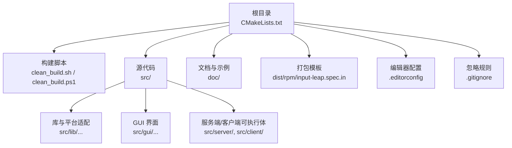
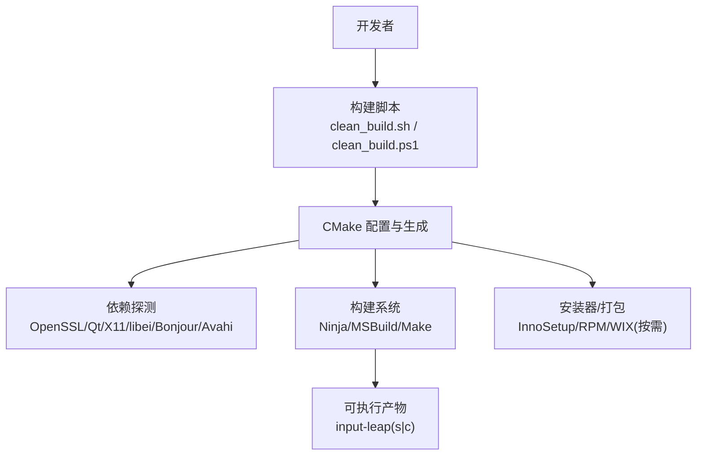
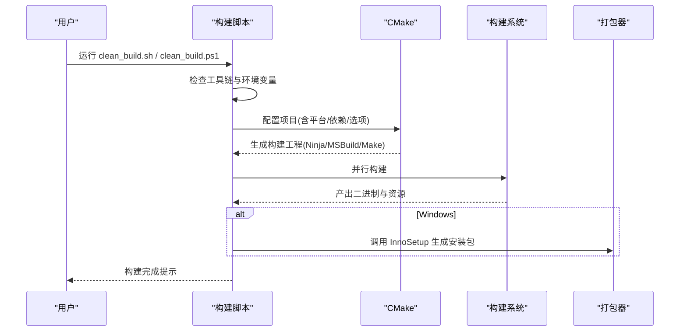
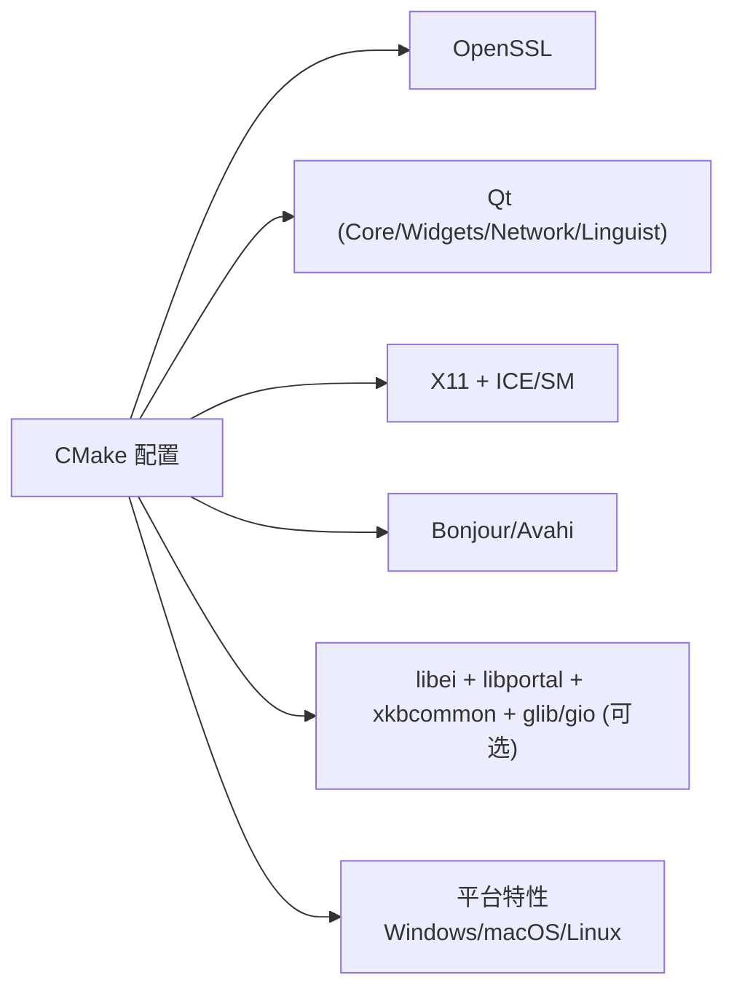
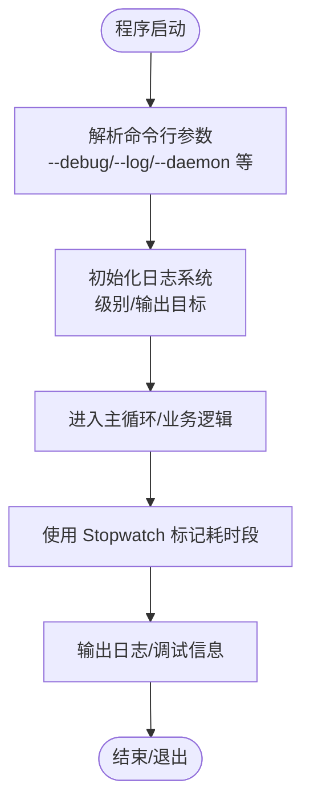

# 开发环境搭建

<cite>
**本文引用的文件**   
- [README.md](file://README.md)
- [CMakeLists.txt](file://CMakeLists.txt)
- [clean_build.sh](file://clean_build.sh)
- [clean_build.ps1](file://clean_build.ps1)
- [.editorconfig](file://.editorconfig)
- [.gitignore](file://.gitignore)
- [dist/rpm/input-leap.spec.in](file://dist/rpm/input-leap.spec.in)
- [cmake/cmake_uninstall.cmake.in](file://cmake/cmake_uninstall.cmake.in)
- [doc/MacReadme.txt](file://doc/MacReadme.txt)
- [src/lib/platform/MSWindowsDebugOutputter.h](file://src/lib/platform/MSWindowsDebugOutputter.h)
- [src/lib/platform/MSWindowsDebugOutputter.cpp](file://src/lib/platform/MSWindowsDebugOutputter.cpp)
- [src/lib/base/Log.h](file://src/lib/base/Log.h)
- [src/lib/base/Stopwatch.h](file://src/lib/base/Stopwatch.h)
- [src/lib/base/Stopwatch.cpp](file://src/lib/base/Stopwatch.cpp)
- [src/lib/inputleap/ArgParser.h](file://src/lib/inputleap/ArgParser.h)
- [src/lib/inputleap/ArgParser.cpp](file://src/lib/inputleap/ArgParser.cpp)
</cite>

## 目录
1. [简介](#简介)
2. [项目结构](#项目结构)
3. [核心组件](#核心组件)
4. [架构总览](#架构总览)
5. [详细组件分析](#详细组件分析)
6. [依赖关系分析](#依赖关系分析)
7. [性能与调试](#性能与调试)
8. [故障排查指南](#故障排查指南)
9. [结论](#结论)
10. [附录](#附录)

## 简介
本指南面向希望从源码构建和开发 Input Leap 的工程师，覆盖 Windows、macOS、Linux 三大平台的环境准备、工具链安装、依赖配置、IDE 设置、脚本使用、代码风格规范、常见问题定位与调试、性能分析要点，以及容器化开发环境的配置建议。Input Leap 是一个跨平台的键盘鼠标共享工具，支持在多台计算机之间通过移动鼠标跨越屏幕边界或快捷键切换控制目标。

## 项目结构
仓库采用 CMake 作为主要构建系统，顶层 CMakeLists.txt 负责全局选项、平台分支、依赖探测与子模块组织；clean_build.sh 与 clean_build.ps1 提供一键清理并构建的便捷入口；.editorconfig 统一代码风格；.gitignore 排除构建产物与 IDE 缓存；RPM spec 模板用于 Linux 打包；部分平台特定说明位于 doc 目录。

图示来源
- [CMakeLists.txt:1-342](file://CMakeLists.txt#L1-L342)
- [clean_build.sh:1-44](file://clean_build.sh#L1-L44)
- [clean_build.ps1:1-91](file://clean_build.ps1#L1-L91)
- [.editorconfig:1-10](file://.editorconfig#L1-L10)
- [.gitignore:1-42](file://.gitignore#L1-L42)
- [dist/rpm/input-leap.spec.in:1-88](file://dist/rpm/input-leap.spec.in#L1-L88)

章节来源
- [README.md:1-157](file://README.md#L1-L157)
- [CMakeLists.txt:1-342](file://CMakeLists.txt#L1-L342)
- [clean_build.sh:1-44](file://clean_build.sh#L1-L44)
- [clean_build.ps1:1-91](file://clean_build.ps1#L1-L91)
- [.editorconfig:1-10](file://.editorconfig#L1-L10)
- [.gitignore:1-42](file://.gitignore#L1-L42)
- [dist/rpm/input-leap.spec.in:1-88](file://dist/rpm/input-leap.spec.in#L1-L88)

## 核心组件
- 构建系统与选项
  - 顶层 CMake 要求版本 3.21+，启用 C++ 标准（Qt6 为 C++17，Qt5 为 C++14），输出目录 bin/lib，导出 compile_commands.json 便于 IDE 索引。
  - 关键开关：是否构建 GUI、是否构建测试、是否使用外部 gtest、是否启用 X11、是否启用 libei、是否内置 gulrak-filesystem。
  - 平台相关：Windows 下启用并行编译与调试信息；Unix 下通过 pkg-config 探测依赖；macOS 下链接系统框架。
- 构建脚本
  - clean_build.sh：自动选择 cmake3/cmake，优先 Ninja，初始化 Git 子模块，清理并生成构建目录，调用 CMake 配置与构建。
  - clean_build.ps1：在 Windows 上自动检测 Visual Studio 版本、下载 Bonjour SDK 兼容包、解析 Qt 路径、生成并构建安装包。
- 代码风格
  - .editorconfig 定义 LF 换行、UTF-8、去除尾部空白、末尾换行、空格缩进且缩进大小为 4。
- 忽略规则
  - .gitignore 排除 build、bin、lib、CMakeFiles、VS/VSCode 缓存、deps 等临时与生成内容。

章节来源
- [CMakeLists.txt:18-45](file://CMakeLists.txt#L18-L45)
- [CMakeLists.txt:71-89](file://CMakeLists.txt#L71-L89)
- [CMakeLists.txt:134-202](file://CMakeLists.txt#L134-L202)
- [CMakeLists.txt:230-247](file://CMakeLists.txt#L230-L247)
- [CMakeLists.txt:249-258](file://CMakeLists.txt#L249-L258)
- [CMakeLists.txt:289-311](file://CMakeLists.txt#L289-L311)
- [CMakeLists.txt:329-337](file://CMakeLists.txt#L329-L337)
- [clean_build.sh:1-44](file://clean_build.sh#L1-L44)
- [clean_build.ps1:1-91](file://clean_build.ps1#L1-L91)
- [.editorconfig:1-10](file://.editorconfig#L1-L10)
- [.gitignore:1-42](file://.gitignore#L1-L42)

## 架构总览
下图展示开发环境中的关键角色与交互：开发者通过脚本驱动 CMake 完成配置与构建，CMake 根据平台与选项探测依赖（OpenSSL、Qt、X11/libei、Bonjour/Avahi 等），最终产出可执行程序与可选的安装包。

图示来源
- [clean_build.sh:1-44](file://clean_build.sh#L1-L44)
- [clean_build.ps1:1-91](file://clean_build.ps1#L1-L91)
- [CMakeLists.txt:134-202](file://CMakeLists.txt#L134-L202)
- [CMakeLists.txt:230-247](file://CMakeLists.txt#L230-L247)
- [CMakeLists.txt:289-311](file://CMakeLists.txt#L289-L311)

## 详细组件分析

### 构建脚本与流程
- Unix/macOS 构建流程（clean_build.sh）
  - 查找 cmake3 或 cmake，失败则报错退出。
  - 默认构建类型 Debug，构建目录 build，可在环境变量中覆盖。
  - macOS 下尝试加载 macos_environment.sh，并注入 SDK 路径与部署目标。
  - 若存在 ninja，则使用 Ninja 生成器。
  - 允许本地自定义 build_env.sh 扩展构建环境。
  - 初始化 Git 子模块，清理并创建构建目录，执行 CMake 配置与并行构建。
- Windows 构建流程（clean_build.ps1）
  - 通过 Chocolatey 需要安装 cmake、openssl、aqt、InnoSetup。
  - 自动下载 Bonjour SDKLike 到 deps 目录，供 mDNS 发现功能使用。
  - 自动检测 Visual Studio 2019/2022 的 Developer Command Prompt。
  - 解析 Qt 主版本与路径，可通过环境变量 B_QT_ROOT 指定。
  - 以对应 VS 生成器配置 CMake，传入 Qt 前缀路径、构建类型、DNSSD 库路径等，构建并安装，最后调用 InnoSetup 生成安装包。

图示来源
- [clean_build.sh:1-44](file://clean_build.sh#L1-L44)
- [clean_build.ps1:1-91](file://clean_build.ps1#L1-L91)
- [CMakeLists.txt:289-311](file://CMakeLists.txt#L289-L311)

章节来源
- [clean_build.sh:1-44](file://clean_build.sh#L1-L44)
- [clean_build.ps1:1-91](file://clean_build.ps1#L1-L91)

### 平台依赖与配置
- Windows
  - 编译器：Visual Studio 2019/2022（x64）。
  - 运行时依赖：OpenSSL（静态）、Qt（5.15.x 或 6.x）、Bonjour SDKLike（mDNS）。
  - 打包：InnoSetup（也可使用 WIX，见 CMake 配置）。
- macOS
  - 编译器：Xcode 命令行工具。
  - 依赖：OpenSSL、Qt、系统框架（ScreenSaver、IOKit、ApplicationServices、Foundation、Carbon）。
  - 部署目标：最低 10.9（由脚本注入）。
- Linux
  - 构建工具：CMake、pkg-config、gcc/g++、ninja（推荐）。
  - 依赖：OpenSSL、Qt（Core/Widgets/Network/Linguist）、X11（x11/xext/xrandr/xinerama/xtst/xi）、ICE/SM、Bonjour/Avahi（avahi-compat-libdns_sd）。
  - 可选：libei、libportal、xkbcommon、glib-2.0、gio-2.0（Wayland/EIS 输入捕获）。
  - RPM 打包：基于 dist/rpm/input-leap.spec.in。

章节来源
- [CMakeLists.txt:71-89](file://CMakeLists.txt#L71-L89)
- [CMakeLists.txt:117-132](file://CMakeLists.txt#L117-L132)
- [CMakeLists.txt:134-202](file://CMakeLists.txt#L134-L202)
- [CMakeLists.txt:230-247](file://CMakeLists.txt#L230-L247)
- [CMakeLists.txt:249-258](file://CMakeLists.txt#L249-L258)
- [dist/rpm/input-leap.spec.in:20-36](file://dist/rpm/input-leap.spec.in#L20-L36)
- [doc/MacReadme.txt:1-13](file://doc/MacReadme.txt#L1-L13)

### 代码风格与编辑器
- 统一风格：LF 换行、UTF-8、去除尾部空白、末尾换行、4 空格缩进。
- 建议在 IDE 中启用 EditorConfig 插件或原生支持，确保团队一致。

章节来源
- [.editorconfig:1-10](file://.editorconfig#L1-L10)

### 忽略规则与清理
- .gitignore 排除了构建目录、中间文件、IDE 缓存、第三方依赖树等，避免污染仓库。
- 可使用 CMake 提供的 uninstall 目标进行卸载（读取 install_manifest.txt 逐条删除）。

章节来源
- [.gitignore:1-42](file://.gitignore#L1-L42)
- [cmake/cmake_uninstall.cmake.in:1-21](file://cmake/cmake_uninstall.cmake.in#L1-L21)
- [CMakeLists.txt:329-337](file://CMakeLists.txt#L329-L337)

## 依赖关系分析
- 构建期依赖
  - CMake ≥ 3.21，编译器（MSVC/GCC/Clang），可选 Ninja。
  - OpenSSL 1.1.1+（SSL/Crypto）。
  - Qt（Core/Widgets/Network/Linguist），Qt6 需 C++17，Qt5 需 C++14。
  - X11 相关（x11/xext/xrandr/xinerama/xtst/xi）与 ICE/SM。
  - Bonjour/Avahi（avahi-compat-libdns_sd）。
  - 可选：libei、libportal、xkbcommon、glib-2.0、gio-2.0。
- 平台差异
  - Windows 使用 MSVC 与 InnoSetup/WIX。
  - macOS 链接系统框架并通过 xcrun 指定 SDK。
  - Linux 通过 pkg-config 探测依赖，RPM 打包使用 spec 模板。

图示来源
- [CMakeLists.txt:134-202](file://CMakeLists.txt#L134-L202)
- [CMakeLists.txt:230-247](file://CMakeLists.txt#L230-L247)
- [CMakeLists.txt:249-258](file://CMakeLists.txt#L249-L258)
- [dist/rpm/input-leap.spec.in:20-36](file://dist/rpm/input-leap.spec.in#L20-L36)

章节来源
- [CMakeLists.txt:134-202](file://CMakeLists.txt#L134-L202)
- [CMakeLists.txt:230-247](file://CMakeLists.txt#L230-L247)
- [CMakeLists.txt:249-258](file://CMakeLists.txt#L249-L258)
- [dist/rpm/input-leap.spec.in:20-36](file://dist/rpm/input-leap.spec.in#L20-L36)

## 性能与调试
- 日志系统
  - 提供多级日志宏（PRINT/FATAL/ERROR/WARNING/NOTE/INFO/DEBUG*），在 Release 下会省略文件名与行号，Debug 包含位置信息。
  - 可通过参数调整日志级别与输出文件。
- Windows 调试输出
  - 提供将日志写入调试器的输出器，便于在 Visual Studio 中查看实时输出。
- 计时与性能剖析
  - Stopwatch 提供启动/停止/触发/获取时间等接口，可用于热点路径测量。
- 参数解析与平台特性
  - ArgParser 支持通用参数（如 --debug、--log、--daemon 等）与平台特定参数，有助于快速定位问题。

图示来源
- [src/lib/base/Log.h:155-188](file://src/lib/base/Log.h#L155-L188)
- [src/lib/platform/MSWindowsDebugOutputter.h:1-43](file://src/lib/platform/MSWindowsDebugOutputter.h#L1-L43)
- [src/lib/platform/MSWindowsDebugOutputter.cpp:1-62](file://src/lib/platform/MSWindowsDebugOutputter.cpp#L1-L62)
- [src/lib/base/Stopwatch.h:84-113](file://src/lib/base/Stopwatch.h#L84-L113)
- [src/lib/base/Stopwatch.cpp:49-130](file://src/lib/base/Stopwatch.cpp#L49-L130)
- [src/lib/inputleap/ArgParser.h:40-76](file://src/lib/inputleap/ArgParser.h#L40-L76)
- [src/lib/inputleap/ArgParser.cpp:317-393](file://src/lib/inputleap/ArgParser.cpp#L317-L393)

章节来源
- [src/lib/base/Log.h:155-188](file://src/lib/base/Log.h#L155-L188)
- [src/lib/platform/MSWindowsDebugOutputter.h:1-43](file://src/lib/platform/MSWindowsDebugOutputter.h#L1-L43)
- [src/lib/platform/MSWindowsDebugOutputter.cpp:1-62](file://src/lib/platform/MSWindowsDebugOutputter.cpp#L1-L62)
- [src/lib/base/Stopwatch.h:84-113](file://src/lib/base/Stopwatch.h#L84-L113)
- [src/lib/base/Stopwatch.cpp:49-130](file://src/lib/base/Stopwatch.cpp#L49-L130)
- [src/lib/inputleap/ArgParser.h:40-76](file://src/lib/inputleap/ArgParser.h#L40-L76)
- [src/lib/inputleap/ArgParser.cpp:317-393](file://src/lib/inputleap/ArgParser.cpp#L317-L393)

## 故障排查指南
- 找不到 CMake
  - 现象：脚本提示未找到 CMake。
  - 处理：安装 CMake 并确保在 PATH 中；或在 Unix 环境中安装 cmake3。
- 缺少依赖头文件或库
  - 现象：CMake 报缺失 dns_sd.h 或 pkg-config 未找到。
  - 处理：安装 avahi-compat-libdns_sd、X11 相关包、OpenSSL、Qt 开发包；Linux 下确认 pkg-config 可用。
- macOS 构建失败
  - 现象：SDK 路径或部署目标错误。
  - 处理：确保 Xcode 命令行工具已安装；脚本会自动注入 SDK 路径与部署目标；必要时手动设置 CMAKE_OSX_SYSROOT 与 CMAKE_OSX_DEPLOYMENT_TARGET。
- Windows 找不到 Visual Studio 或 Qt
  - 现象：脚本无法检测到 VS 或 Qt 路径。
  - 处理：安装 VS 2019/2022 并勾选 C++ 桌面开发；使用 aqt 或手动安装 Qt；通过环境变量 B_QT_ROOT 指定 Qt 路径。
- Wayland/EIS 相关构建失败
  - 现象：缺少 libei、libportal、xkbcommon、glib/gio。
  - 处理：安装相应开发包，或通过 CMake 选项关闭 libei 仅使用 X11。
- 卸载残留
  - 现象：安装后需要清理。
  - 处理：使用 CMake 生成的 uninstall 目标，它会读取 install_manifest.txt 并逐个删除文件。

章节来源
- [clean_build.sh:1-44](file://clean_build.sh#L1-L44)
- [CMakeLists.txt:134-202](file://CMakeLists.txt#L134-L202)
- [CMakeLists.txt:230-247](file://CMakeLists.txt#L230-L247)
- [CMakeLists.txt:289-311](file://CMakeLists.txt#L289-L311)
- [cmake/cmake_uninstall.cmake.in:1-21](file://cmake/cmake_uninstall.cmake.in#L1-L21)

## 结论
通过统一的 CMake 构建系统与跨平台脚本，Input Leap 能在 Windows、macOS、Linux 上高效构建与打包。遵循 .editorconfig 的代码风格、合理使用日志与计时工具、按平台安装必要依赖，是稳定开发与调试的关键。对于复杂场景，可参考 RPM spec 模板与脚本中的环境变量进行定制。

## 附录

### 各平台环境准备清单
- Windows
  - 工具链：Visual Studio 2019/2022（x64）、CMake、InnoSetup。
  - 依赖：OpenSSL、Qt（5.15.x 或 6.x）、Bonjour SDKLike（脚本自动下载）。
  - 可选：Chocolatey 管理上述工具。
- macOS
  - 工具链：Xcode 命令行工具、CMake、Qt。
  - 依赖：OpenSSL、系统框架（脚本自动链接）。
  - 部署目标：最低 10.9（脚本注入）。
- Linux
  - 工具链：CMake、gcc/g++、pkg-config、ninja（推荐）。
  - 依赖：OpenSSL、Qt（Core/Widgets/Network/Linguist）、X11（x11/xext/xrandr/xinerama/xtst/xi）、ICE/SM、Bonjour/Avahi。
  - 可选：libei、libportal、xkbcommon、glib-2.0、gio-2.0。
  - 打包：RPM（spec 模板）。

章节来源
- [clean_build.ps1:1-91](file://clean_build.ps1#L1-L91)
- [clean_build.sh:1-44](file://clean_build.sh#L1-L44)
- [CMakeLists.txt:134-202](file://CMakeLists.txt#L134-L202)
- [CMakeLists.txt:230-247](file://CMakeLists.txt#L230-L247)
- [dist/rpm/input-leap.spec.in:20-36](file://dist/rpm/input-leap.spec.in#L20-L36)

### 常用构建命令与环境变量
- Unix/macOS
  - 基本构建：./clean_build.sh
  - 指定构建类型：B_BUILD_TYPE=Release ./clean_build.sh
  - 指定构建目录：B_BUILD_DIR=out ./clean_build.sh
  - 指定 CMake：B_CMAKE=/usr/local/bin/cmake3 ./clean_build.sh
  - 本地扩展：创建 build_env.sh 并在其中设置额外 CMake 标志。
- Windows
  - 基本构建：.\clean_build.ps1
  - 指定构建类型：$env:B_BUILD_TYPE="Release"; .\clean_build.ps1
  - 指定 Qt 主版本：$env:B_QT_MAJOR_VERSION="5"; .\clean_build.ps1
  - 指定 Qt 路径：$env:B_QT_ROOT="C:\Qt\5.15.2\msvc2019_64"; .\clean_build.ps1

章节来源
- [clean_build.sh:14-30](file://clean_build.sh#L14-L30)
- [clean_build.ps1:53-67](file://clean_build.ps1#L53-L67)

### Docker 容器化开发环境（概念性指导）
- 基础镜像
  - Linux：选择带 gcc/g++、CMake、pkg-config、ninja 的基础镜像（如 Ubuntu/Debian）。
  - Windows：使用官方 Windows 镜像并安装 Visual Studio 构建工具与 CMake。
  - macOS：由于许可限制，建议使用 CI 云主机或使用 Linux 交叉构建。
- 依赖安装
  - 在镜像内安装 OpenSSL、Qt 开发包、X11 相关包、Bonjour/Avahi 等。
  - 如需 Wayland/EIS，安装 libei、libportal、xkbcommon、glib/gio。
- 构建步骤
  - 复制源码至容器，执行 clean_build.sh 或 CMake 直接配置与构建。
  - 将构建产物挂载到宿主机以便调试与分发。
- 注意事项
  - 保持依赖版本与本机一致，避免“在我机器上能跑”的问题。
  - 使用多阶段构建减少镜像体积。
  - 对图形相关功能，考虑无头模式或 VNC/Xvfb 进行自动化测试。

[本节为概念性指导，不直接分析具体源文件]