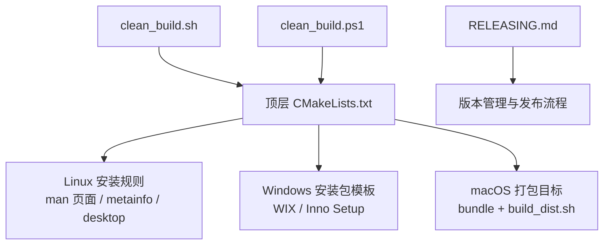
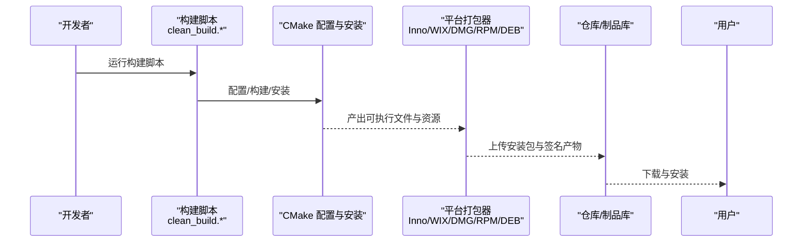
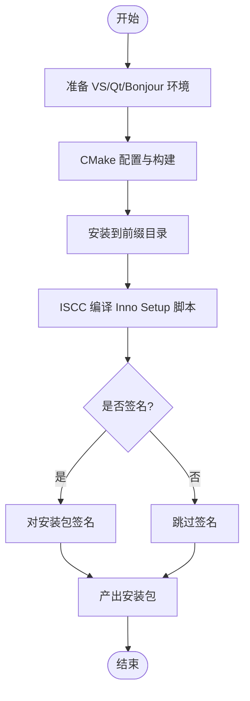
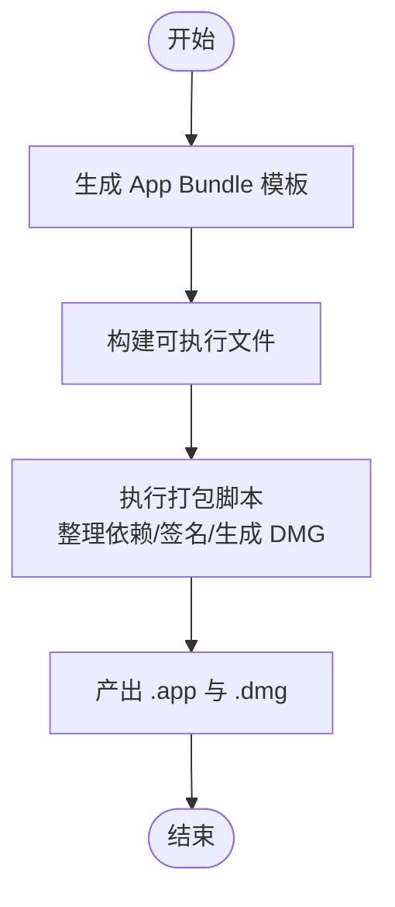
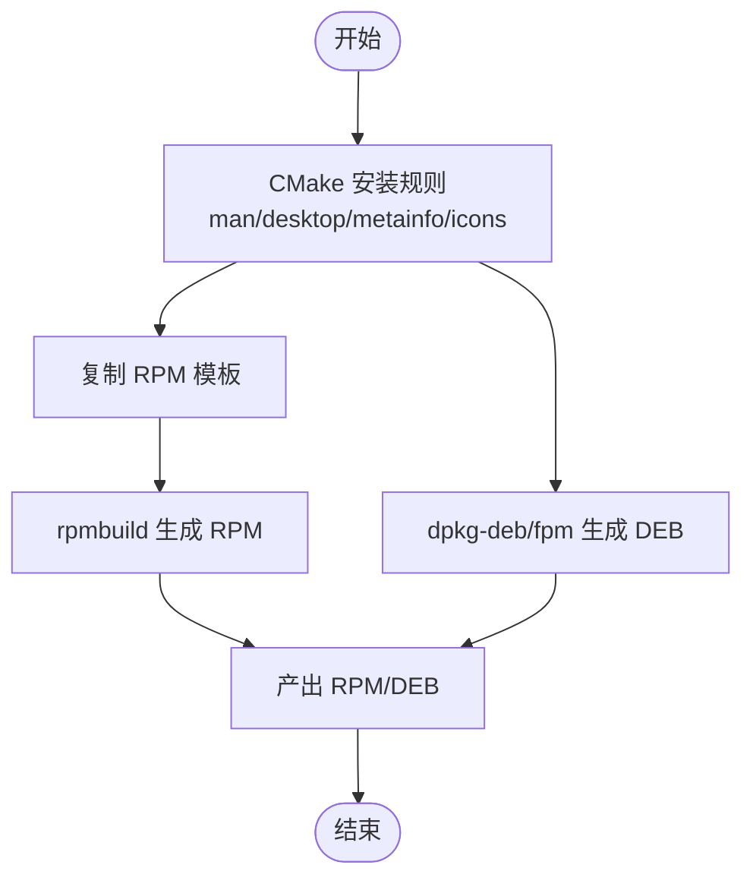

# 打包与分发

<cite>
**本文引用的文件**   
- [CMakeLists.txt](file://CMakeLists.txt)
- [clean_build.sh](file://clean_build.sh)
- [clean_build.ps1](file://clean_build.ps1)
- [RELEASING.md](file://RELEASING.md)
- [cmake_uninstall.cmake.in](file://cmake/cmake_uninstall.cmake.in)
- [input-leapc.1](file://doc/input-leapc.1)
- [input-leaps.1](file://doc/input-leaps.1)
- [io.github.input_leap.input-leap.desktop](file://res/io.github.input_leap.input-leap.desktop)
- [io.github.input_leap.input-leap.appdata.xml](file://res/io.github.input_leap.input-leap.appdata.xml)
</cite>

## 目录
1. [简介](#简介)
2. [项目结构](#项目结构)
3. [核心组件](#核心组件)
4. [架构总览](#架构总览)
5. [详细组件分析](#详细组件分析)
6. [依赖分析](#依赖分析)
7. [性能考虑](#性能考虑)
8. [故障排除指南](#故障排除指南)
9. [结论](#结论)
10. [附录](#附录)

## 简介
本文件面向 Input Leap 的打包与分发，覆盖 Windows（MSI/Inno Setup）、macOS（DMG/App Bundle）与 Linux（RPM/DEB）的安装包制作流程；说明应用元数据配置、桌面集成文件和手册页安装；阐述版本管理策略、签名验证与安全发布流程；并提供仓库集成、包管理器适配与企业级部署最佳实践及自动化脚本使用指导。

## 项目结构
Input Leap 使用 CMake 作为构建系统，顶层 CMakeLists.txt 负责跨平台选项、依赖探测、安装规则以及各平台打包入口。Linux 下通过 install 规则安装手册页、AppStream 元数据与桌面启动项；Windows 下生成 WIX 与 Inno Setup 安装包模板；macOS 下生成 App Bundle 并通过脚本完成资源整理与 DMG 制作。

图表来源
- [CMakeLists.txt:303-322](file://CMakeLists.txt#L303-L322)
- [clean_build.sh:1-44](file://clean_build.sh#L1-L44)
- [clean_build.ps1:1-91](file://clean_build.ps1#L1-L91)
- [RELEASING.md:1-64](file://RELEASING.md#L1-L64)

章节来源
- [CMakeLists.txt:18-48](file://CMakeLists.txt#L18-L48)
- [CMakeLists.txt:303-322](file://CMakeLists.txt#L303-L322)
- [clean_build.sh:1-44](file://clean_build.sh#L1-L44)
- [clean_build.ps1:1-91](file://clean_build.ps1#L1-L91)
- [RELEASING.md:1-64](file://RELEASING.md#L1-L64)

## 核心组件
- 构建与打包入口
  - 顶层 CMakeLists.txt：定义构建选项、平台分支逻辑、安装规则与打包目标。
  - clean_build.sh：Unix/macOS 一键清理并构建，自动选择 Ninja，设置 macOS SDK 与部署目标。
  - clean_build.ps1：Windows 环境准备（VS、Qt、Bonjour SDK），调用 CMake 构建并执行 Inno Setup 编译。
- 卸载支持
  - cmake_uninstall.cmake.in：提供 uninstall 目标以移除已安装文件。
- 文档与元数据
  - doc/input-leapc.1、doc/input-leaps.1：手册页源文件。
  - res/io.github.input_leap.input-leap.desktop：桌面启动项。
  - res/io.github.input_leap.input-leap.appdata.xml：AppStream 元数据。
- 版本与发布
  - RELEASING.md：维护者发布的步骤指引（版本号、标签、GitHub Release）。

章节来源
- [CMakeLists.txt:303-322](file://CMakeLists.txt#L303-L322)
- [cmake_uninstall.cmake.in](file://cmake/cmake_uninstall.cmake.in)
- [input-leapc.1](file://doc/input-leapc.1)
- [input-leaps.1](file://doc/input-leaps.1)
- [io.github.input_leap.input-leap.desktop](file://res/io.github.input_leap.input-leap.desktop)
- [io.github.input_leap.input-leap.appdata.xml](file://res/io.github.input_leap.input-leap.appdata.xml)
- [clean_build.sh:1-44](file://clean_build.sh#L1-L44)
- [clean_build.ps1:1-91](file://clean_build.ps1#L1-L91)
- [RELEASING.md:1-64](file://RELEASING.md#L1-L64)

## 架构总览
下图展示从源码到各平台安装包的总体流程，包括构建、安装、打包与发布环节。

图表来源
- [clean_build.sh:1-44](file://clean_build.sh#L1-L44)
- [clean_build.ps1:1-91](file://clean_build.ps1#L1-L91)
- [CMakeLists.txt:303-322](file://CMakeLists.txt#L303-L322)

## 详细组件分析

### Windows 打包（MSI/Inno Setup）
- 打包入口与模板
  - 顶层 CMakeLists.txt 在 Windows 分支中生成 WIX 与 Inno Setup 安装包模板至构建目录，供后续工具链编译为 MSI/EXE 安装包。
- 自动化构建与打包
  - clean_build.ps1 负责：
    - 准备 Visual Studio 开发环境
    - 定位 Qt 根路径
    - 下载 Bonjour SDK 并设置环境变量
    - 调用 CMake 配置与构建，并将产物安装到前缀目录
    - 使用 ISCC 编译 Inno Setup 脚本生成安装包
- 建议补充
  - 若需同时生成 MSI，可在 CI 中增加 WIX 编译步骤（基于 CMake 生成的模板）。
  - 对最终安装包进行数字签名（代码签名证书）以提升可信度。

图表来源
- [CMakeLists.txt:316-322](file://CMakeLists.txt#L316-L322)
- [clean_build.ps1:1-91](file://clean_build.ps1#L1-L91)

章节来源
- [CMakeLists.txt:316-322](file://CMakeLists.txt#L316-L322)
- [clean_build.ps1:1-91](file://clean_build.ps1#L1-L91)

### macOS 打包（DMG/App Bundle）
- App Bundle 生成
  - 顶层 CMakeLists.txt 在 Apple 分支中：
    - 设置 RPATH 以便运行时查找框架与库
    - 将 bundle 模板复制到构建目录
    - 创建自定义目标，依赖可执行文件后执行打包脚本
- DMG 制作
  - 打包脚本由 CMake 目标触发，通常包含拷贝依赖、重签名、生成 DMG 等步骤。
- 交叉编译与部署目标
  - clean_build.sh 在 macOS 上设置 SDK 路径与最低部署目标，便于构建兼容版本。

图表来源
- [CMakeLists.txt:289-302](file://CMakeLists.txt#L289-L302)
- [clean_build.sh:18-22](file://clean_build.sh#L18-L22)

章节来源
- [CMakeLists.txt:289-302](file://CMakeLists.txt#L289-L302)
- [clean_build.sh:18-22](file://clean_build.sh#L18-L22)

### Linux 打包（RPM/DEB）
- 安装规则
  - 顶层 CMakeLists.txt 在 UNIX 非 Apple 分支中：
    - 安装手册页到 share/man/man1
    - 安装 AppStream 元数据到 share/metainfo
    - 安装 SVG 图标到 share/icons/hicolor/scalable/apps
    - 安装桌面启动项到 share/applications
    - 复制 RPM 相关模板到构建目录
- 包管理器适配
  - DEB/RPM 的打包脚本与 changelog 位于 dist 目录下（参见发布流程中对 debian/changelog 的引用）。
  - 建议在 CI 中使用 rpmbuild 与 dpkg-deb/fpm 等工具生成二进制包。

图表来源
- [CMakeLists.txt:303-311](file://CMakeLists.txt#L303-L311)
- [RELEASING.md:35-43](file://RELEASING.md#L35-L43)

章节来源
- [CMakeLists.txt:303-311](file://CMakeLists.txt#L303-L311)
- [RELEASING.md:35-43](file://RELEASING.md#L35-L43)

### 应用程序元数据与桌面集成
- 桌面启动项
  - 安装位置：share/applications
  - 文件名：io.github.input_leap.input-leap.desktop
- AppStream 元数据
  - 安装位置：share/metainfo
  - 文件名：io.github.input_leap.input-leap.appdata.xml
- 图标
  - 安装位置：share/icons/hicolor/scalable/apps
  - 文件名：io.github.input_leap.input-leap.svg

章节来源
- [CMakeLists.txt:306-310](file://CMakeLists.txt#L306-L310)
- [io.github.input_leap.input-leap.desktop](file://res/io.github.input_leap.input-leap.desktop)
- [io.github.input_leap.input-leap.appdata.xml](file://res/io.github.input_leap.input-leap.appdata.xml)

### 手册页安装
- 安装位置：share/man/man1
- 源文件：doc/input-leapc.1、doc/input-leaps.1

章节来源
- [CMakeLists.txt:304](file://CMakeLists.txt#L304)
- [input-leapc.1](file://doc/input-leapc.1)
- [input-leaps.1](file://doc/input-leaps.1)

### 版本管理策略
- 版本来源
  - 顶层 CMakeLists.txt 引入版本模块，用于注入版本常量与构建信息。
- 发布流程
  - 维护者按 RELEASING.md 执行：收集变更日志、更新版本号、打签名标签、创建 GitHub Release 并上传制品。
- 建议
  - 将版本号与标签绑定，确保制品可追溯。
  - 在 CI 中根据 tag 自动生成变更日志与制品清单。

章节来源
- [CMakeLists.txt:47-48](file://CMakeLists.txt#L47-L48)
- [RELEASING.md:1-64](file://RELEASING.md#L1-L64)

### 签名验证与安全发布
- 代码签名
  - Windows：对安装包与可执行文件进行数字签名，提升可信度。
  - macOS：对 App Bundle 与 DMG 进行签名与公证（如适用）。
- 完整性校验
  - 发布时附带 SHA256 校验值或签名文件，供用户验证。
- 供应链安全
  - 固定第三方依赖版本，使用最小权限的 CI 密钥存储。

[本节为通用安全建议，不直接分析具体文件]

### 软件仓库集成与包管理器适配
- Linux
  - 使用 rpmbuild/dpkg-deb/fpm 生成 RPM/DEB，配合企业私有仓库（如 YUM/DNF、APT）进行分发。
  - 遵循发行版打包规范（FHS、命名约定、依赖声明）。
- Windows
  - 通过 Inno Setup/MSI 分发，结合企业软件分发系统（SCCM、Intune）进行批量部署。
- macOS
  - 通过 DMG 分发，结合 Jamf/Munki 等企业 MDM 方案进行安装与升级。

[本节为通用集成建议，不直接分析具体文件]

### 自动化打包脚本使用指导
- Unix/macOS
  - 运行 clean_build.sh 自动初始化子模块、配置与并行构建；在 macOS 上自动设置 SDK 与部署目标。
- Windows
  - 运行 clean_build.ps1 自动准备 VS/Qt/Bonjour，构建并调用 Inno Setup 生成安装包。
- 自定义
  - 可通过环境变量调整构建类型、Qt 主版本与安装前缀等参数。

章节来源
- [clean_build.sh:1-44](file://clean_build.sh#L1-L44)
- [clean_build.ps1:1-91](file://clean_build.ps1#L1-L91)

## 依赖分析
- 构建期依赖
  - CMake、编译器（GCC/Clang/MSVC）、Qt（可选 GUI）、OpenSSL、X11/libei（Linux）、Bonjour SDK（Windows）。
- 运行时依赖
  - 动态库与系统框架（取决于平台与构建选项）。
- 打包期依赖
  - Inno Setup、WIX、rpmbuild、dpkg-deb/fpm、macOS 打包工具链。

图表来源
- [CMakeLists.txt:255-258](file://CMakeLists.txt#L255-L258)
- [CMakeLists.txt:303-322](file://CMakeLists.txt#L303-L322)
- [clean_build.ps1:1-91](file://clean_build.ps1#L1-L91)

章节来源
- [CMakeLists.txt:255-258](file://CMakeLists.txt#L255-L258)
- [CMakeLists.txt:303-322](file://CMakeLists.txt#L303-L322)
- [clean_build.ps1:1-91](file://clean_build.ps1#L1-L91)

## 性能考虑
- 构建优化
  - 使用 Ninja 加速构建（clean_build.sh 自动检测）。
  - 合理开启并行编译与增量构建。
- 安装包体积
  - 静态链接关键依赖（如 OpenSSL）可减少运行时依赖问题，但会增加体积。
  - 按需裁剪功能开关（如 X11/libei、GUI）以减少产物大小。
- 分发效率
  - 使用压缩与去重策略，减少网络传输成本。

[本节为通用性能建议，不直接分析具体文件]

## 故障排除指南
- 构建失败
  - 检查 CMake 版本与编译器环境；确认 Qt、OpenSSL、X11/libei、Bonjour SDK 等依赖可用。
  - Windows 下确认 VS 环境与 Qt 路径正确；macOS 下确认 SDK 与部署目标设置。
- 安装后缺失桌面集成
  - 确认 share/applications 与 share/metainfo 下的文件是否正确安装。
- 卸载问题
  - 使用提供的 uninstall 目标移除已安装文件。

章节来源
- [clean_build.sh:1-44](file://clean_build.sh#L1-L44)
- [clean_build.ps1:1-91](file://clean_build.ps1#L1-L91)
- [CMakeLists.txt:329-337](file://CMakeLists.txt#L329-L337)
- [cmake_uninstall.cmake.in](file://cmake/cmake_uninstall.cmake.in)

## 结论
Input Leap 的打包与分发体系以 CMake 为核心，结合平台脚本与模板实现多平台一致化构建与打包。通过完善的手册页、桌面集成与 AppStream 元数据安装，提升了用户体验与可发现性。遵循版本管理与安全发布流程，并结合企业级仓库与 MDM 方案，可实现稳定可靠的规模化分发。

## 附录
- 常用命令参考
  - Unix/macOS：运行 clean_build.sh 完成构建与安装。
  - Windows：运行 clean_build.ps1 完成构建与 Inno Setup 打包。
  - 卸载：使用 uninstall 目标移除安装内容。
- 相关文件索引
  - 构建与打包：CMakeLists.txt、clean_build.sh、clean_build.ps1
  - 文档与元数据：doc/*.1、res/*.desktop、res/*.appdata.xml
  - 卸载支持：cmake_uninstall.cmake.in
  - 发布流程：RELEASING.md