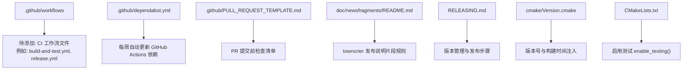
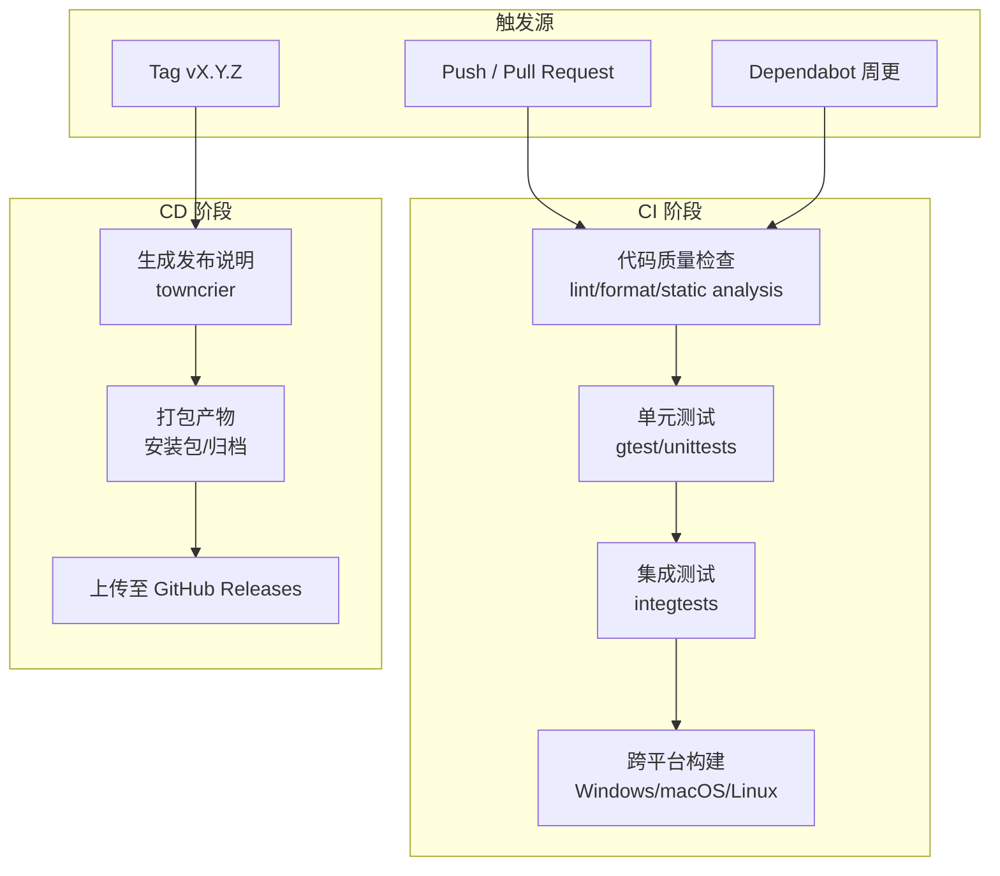
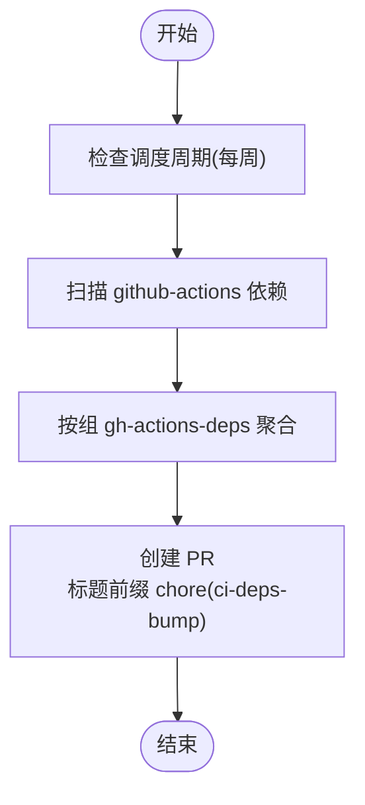
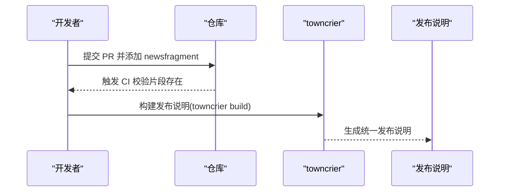
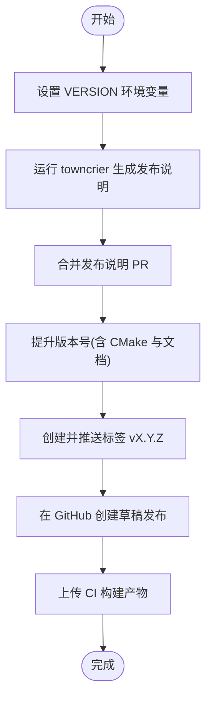
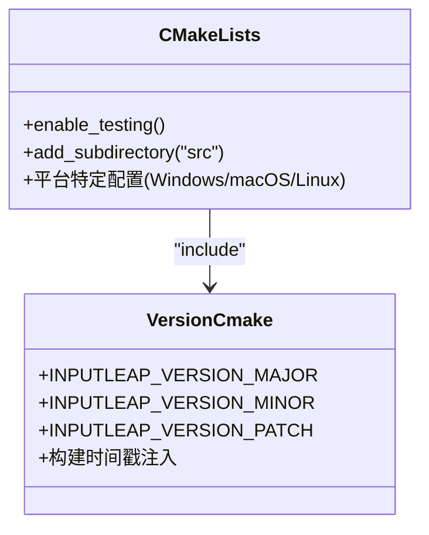
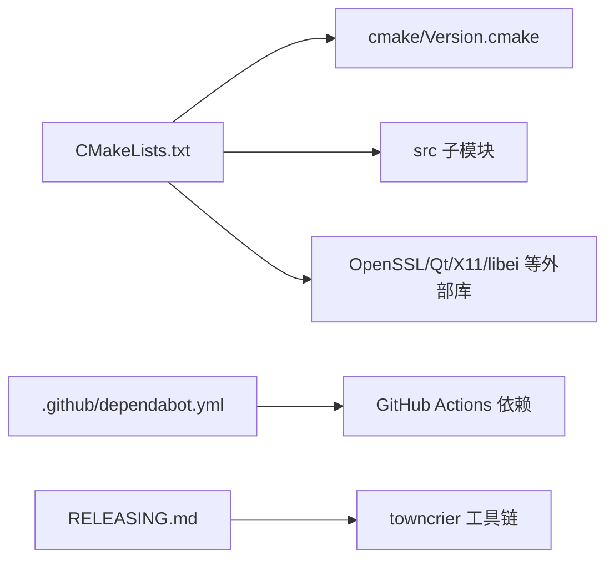

# 持续集成流水线

<cite>
**本文引用的文件**
- [.github/dependabot.yml](file://.github/dependabot.yml)
- [.github/PULL_REQUEST_TEMPLATE.md](file://.github/PULL_REQUEST_TEMPLATE.md)
- [doc/newsfragments/README.md](file://doc/newsfragments/README.md)
- [RELEASING.md](file://RELEASING.md)
- [cmake/Version.cmake](file://cmake/Version.cmake)
- [CMakeLists.txt](file://CMakeLists.txt)
</cite>

## 目录
1. [简介](#简介)
2. [项目结构](#项目结构)
3. [核心组件](#核心组件)
4. [架构总览](#架构总览)
5. [详细组件分析](#详细组件分析)
6. [依赖分析](#依赖分析)
7. [性能考虑](#性能考虑)
8. [故障排查指南](#故障排查指南)
9. [结论](#结论)
10. [附录](#附录)

## 简介
本技术文档聚焦于 Input Leap 的持续集成与持续部署（CI/CD）流水线，围绕 GitHub Actions 工作流配置、自动化测试流程、代码质量检查、跨平台构建、Pull Request 模板、Issue 模板、Dependabot 依赖更新策略、发布流程与版本标签管理、发布产物分发、本地 CI 模拟与调试方法以及自定义工作流扩展进行系统化说明。由于仓库中未包含已提交的 GitHub Actions 工作流文件，本文在“架构总览”和“详细组件分析”部分提供基于现有工程结构的推荐方案与实践建议，帮助团队快速落地并完善 CI/CD 体系。

## 项目结构
从仓库根目录可见，GitHub 相关配置位于 .github 目录：
- workflows：用于存放 GitHub Actions 工作流定义（当前为空）
- ISSUE_TEMPLATE：Issue 模板目录（存在但需确认具体模板内容）
- PULL_REQUEST_TEMPLATE.md：Pull Request 模板
- dependabot.yml：Dependabot 自动更新配置

此外，构建系统与版本信息通过 CMake 管理，发布流程由 RELEASING.md 规范，新闻片段生成使用 towncrier。

**图表来源**
- [.github/dependabot.yml:1-13](file://.github/dependabot.yml#L1-L13)
- [.github/PULL_REQUEST_TEMPLATE.md:1-5](file://.github/PULL_REQUEST_TEMPLATE.md#L1-L5)
- [doc/newsfragments/README.md:1-13](file://doc/newsfragments/README.md#L1-L13)
- [RELEASING.md:1-64](file://RELEASING.md#L1-L64)
- [cmake/Version.cmake:1-34](file://cmake/Version.cmake#L1-L34)
- [CMakeLists.txt:339-342](file://CMakeLists.txt#L339-L342)

**章节来源**
- [.github/dependabot.yml:1-13](file://.github/dependabot.yml#L1-L13)
- [.github/PULL_REQUEST_TEMPLATE.md:1-5](file://.github/PULL_REQUEST_TEMPLATE.md#L1-L5)
- [doc/newsfragments/README.md:1-13](file://doc/newsfragments/README.md#L1-L13)
- [RELEASING.md:1-64](file://RELEASING.md#L1-L64)
- [cmake/Version.cmake:1-34](file://cmake/Version.cmake#L1-L34)
- [CMakeLists.txt:339-342](file://CMakeLists.txt#L339-L342)

## 核心组件
- Dependabot 依赖更新策略：仅配置了 GitHub Actions 自身依赖的每周更新，采用分组聚合 PR，便于集中审查与维护。
- Pull Request 模板：要求贡献者在影响最终用户时创建 newsfragments 片段，确保发布说明可追踪。
- 版本与构建：CMake 版本脚本负责主/次/补丁版本与描述字符串拼接，并在构建时注入编译日期等元数据。
- 测试开关：顶层 CMakeLists.txt 启用测试框架，为后续单元测试与集成测试执行提供基础。

**章节来源**
- [.github/dependabot.yml:1-13](file://.github/dependabot.yml#L1-L13)
- [.github/PULL_REQUEST_TEMPLATE.md:1-5](file://.github/PULL_REQUEST_TEMPLATE.md#L1-L5)
- [cmake/Version.cmake:1-34](file://cmake/Version.cmake#L1-L34)
- [CMakeLists.txt:339-342](file://CMakeLists.txt#L339-L342)

## 架构总览
本节给出推荐的 CI/CD 架构蓝图，涵盖代码质量检查、单元测试、集成测试、跨平台构建与发布流程。该蓝图映射到仓库中的实际构件与脚本，便于逐步实现。

[此图为概念性架构图，不直接映射具体源码文件，故不提供图表来源]

## 详细组件分析

### 组件一：Dependabot 依赖更新策略
- 目标：定期升级 GitHub Actions 依赖，降低安全与兼容风险。
- 策略要点：
  - 包生态：github-actions
  - 目录：/
  - 调度：weekly
  - 提交消息前缀：chore(ci-deps-bump)
  - 分组：gh-actions-deps（聚合所有匹配模式）
- 效果：每周自动生成一个聚合 PR，减少碎片化维护成本。

**图表来源**
- [.github/dependabot.yml:1-13](file://.github/dependabot.yml#L1-L13)

**章节来源**
- [.github/dependabot.yml:1-13](file://.github/dependabot.yml#L1-L13)

### 组件二：Pull Request 模板与发布说明片段
- 模板要求：若变更影响最终用户，需在 doc/newsfragments 下新增片段文件；否则无需操作。
- 片段类型：feature、bugfix、security、doc、removal 等，由 towncrier 处理并汇总到发布说明。
- 实践建议：
  - 在 PR 模板中增加“片段文件命名约定”提示，避免遗漏。
  - 在 CI 中加入片段校验任务，确保 PR 符合规范。

**图表来源**
- [.github/PULL_REQUEST_TEMPLATE.md:1-5](file://.github/PULL_REQUEST_TEMPLATE.md#L1-L5)
- [doc/newsfragments/README.md:1-13](file://doc/newsfragments/README.md#L1-L13)

**章节来源**
- [.github/PULL_REQUEST_TEMPLATE.md:1-5](file://.github/PULL_REQUEST_TEMPLATE.md#L1-L5)
- [doc/newsfragments/README.md:1-13](file://doc/newsfragments/README.md#L1-L13)

### 组件三：版本管理与发布流程
- 版本来源：cmake/Version.cmake 定义主/次/补丁版本，并支持 git 描述符与构建时间戳。
- 发布步骤（依据 RELEASING.md）：
  - 准备环境：设置 VERSION 环境变量
  - 生成发布说明：towncrier build --version ${VERSION} --date ...
  - 合并发布说明 PR
  - 提升版本号：更新 cmake/Version.cmake 及相关文档与模板
  - 打标签：git tag -s vX.Y.Z
  - 推送分支与标签
  - 在 GitHub Releases 草稿发布，使用 towncrier 生成的说明作为描述，并上传 CI 产物
- 版本注入：CMake 将版本宏注入到构建系统，供运行时查询。

**图表来源**
- [RELEASING.md:1-64](file://RELEASING.md#L1-L64)
- [cmake/Version.cmake:1-34](file://cmake/Version.cmake#L1-L34)

**章节来源**
- [RELEASING.md:1-64](file://RELEASING.md#L1-L64)
- [cmake/Version.cmake:1-34](file://cmake/Version.cmake#L1-L34)

### 组件四：测试与构建基座（CMake）
- 测试开关：顶层 CMakeLists.txt 调用 enable_testing()，为 gtest 与自定义测试提供基础。
- 平台差异：
  - Windows：并行编译、优化选项、链接库与宏定义
  - macOS：Bundle 构建、macdeployqt 工具链
  - Linux：pkg-config 检测 X11/libei 等依赖，条件编译
- 建议：
  - 在 CI 中分别构建 Debug/Release 变体，覆盖不同编译器与 Qt 版本矩阵
  - 针对各平台启用相应特性（如 X11、libportal、libei），以验证功能组合

**图表来源**
- [CMakeLists.txt:339-342](file://CMakeLists.txt#L339-L342)
- [cmake/Version.cmake:1-34](file://cmake/Version.cmake#L1-L34)

**章节来源**
- [CMakeLists.txt:1-342](file://CMakeLists.txt#L1-L342)
- [cmake/Version.cmake:1-34](file://cmake/Version.cmake#L1-L34)

### 组件五：Issue 模板管理
- 现状：ISSUE_TEMPLATE 目录存在，但未见具体模板文件。建议在仓库中添加 bug_report.yml 等标准模板，并与 RELEASING.md 中提及的版本号同步更新。
- 建议：
  - 提供结构化问题报告模板（环境、复现步骤、日志、期望行为）
  - 在模板中引用版本来源（cmake/Version.cmake），便于定位问题版本

[本节为通用指导，不直接分析具体文件，故无章节来源]

## 依赖分析
- 内部依赖：
  - CMake 构建系统驱动跨平台编译与测试
  - towncrier 用于发布说明聚合
- 外部依赖：
  - GitHub Actions（工作流尚未提交）
  - Dependabot（已配置）
  - OpenSSL、Qt、X11/libei 等（由 CMake 探测）

**图表来源**
- [CMakeLists.txt:1-342](file://CMakeLists.txt#L1-L342)
- [cmake/Version.cmake:1-34](file://cmake/Version.cmake#L1-L34)
- [.github/dependabot.yml:1-13](file://.github/dependabot.yml#L1-L13)
- [RELEASING.md:1-64](file://RELEASING.md#L1-L64)

**章节来源**
- [CMakeLists.txt:1-342](file://CMakeLists.txt#L1-L342)
- [.github/dependabot.yml:1-13](file://.github/dependabot.yml#L1-L13)
- [RELEASING.md:1-64](file://RELEASING.md#L1-L64)

## 性能考虑
- 并行构建：Windows 使用 /MP 并行编译，CI 中应充分利用多核 Runner 加速。
- 缓存策略：缓存依赖下载（OpenSSL、Qt、X11/libei）、CMake 配置结果与第三方库，缩短冷启动时间。
- 增量构建：仅在变更路径触发重新构建，避免全量编译。
- 测试分片：对大规模测试集进行分片并行执行，缩短反馈时间。

[本节为通用指导，不直接分析具体文件，故无章节来源]

## 故障排查指南
- 版本不一致：
  - 现象：运行时版本与预期不符
  - 排查：核对 cmake/Version.cmake 与 RELEASING.md 的步骤是否一致，确认标签与构建产物版本对应
- 发布说明缺失：
  - 现象：towncrier 构建失败或输出为空
  - 排查：确认 PR 模板要求是否满足，检查 doc/newsfragments 是否存在对应片段
- 依赖缺失：
  - 现象：CMake 配置失败（缺少 pkg-config、X11、libei 等）
  - 排查：在 CI Runner 安装必要依赖，或在本地使用 clean_build.sh/clean_build.ps1 清理后重试
- 测试失败：
  - 现象：单元测试或集成测试报错
  - 排查：查看 CMake 启用测试的配置，确认 gtest 可用，必要时启用外部 gtest 选项

**章节来源**
- [cmake/Version.cmake:1-34](file://cmake/Version.cmake#L1-L34)
- [RELEASING.md:1-64](file://RELEASING.md#L1-L64)
- [CMakeLists.txt:1-342](file://CMakeLists.txt#L1-L342)

## 结论
当前仓库已具备 Dependabot 与 PR 模板的基础能力，并通过 CMake 与 RELEASING.md 明确了版本与发布流程。为实现完整的 CI/CD 流水线，建议在 .github/workflows 中补充工作流文件，覆盖代码质量检查、单元测试、集成测试与跨平台构建，并将 towncrier 与 GitHub Releases 集成到发布阶段。同时，结合本地脚本与缓存策略，提升构建效率与可重复性。

[本节为总结性内容，不直接分析具体文件，故无章节来源]

## 附录
- 本地 CI 模拟与调试：
  - 使用仓库提供的 clean_build.sh 与 clean_build.ps1 清理构建目录，复现 CI 环境
  - 在本地运行 CMake 配置与测试，验证依赖与平台特性
- 自定义工作流扩展：
  - 在 .github/workflows 中新增工作流文件，复用现有 CMake 配置与测试开关
  - 引入缓存与矩阵策略，覆盖多平台与多编译器组合
  - 将发布说明生成与产物上传纳入 CD 阶段，遵循 RELEASING.md 的流程

[本节为通用指导，不直接分析具体文件，故无章节来源]