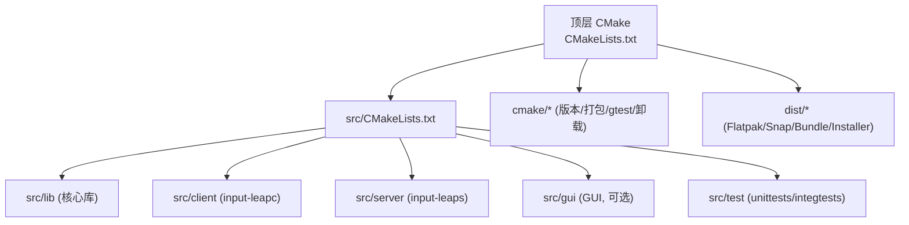
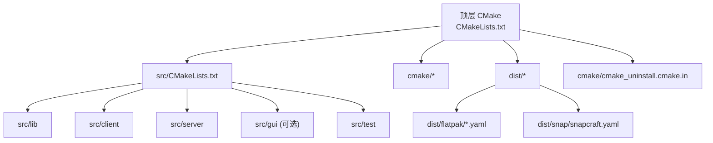
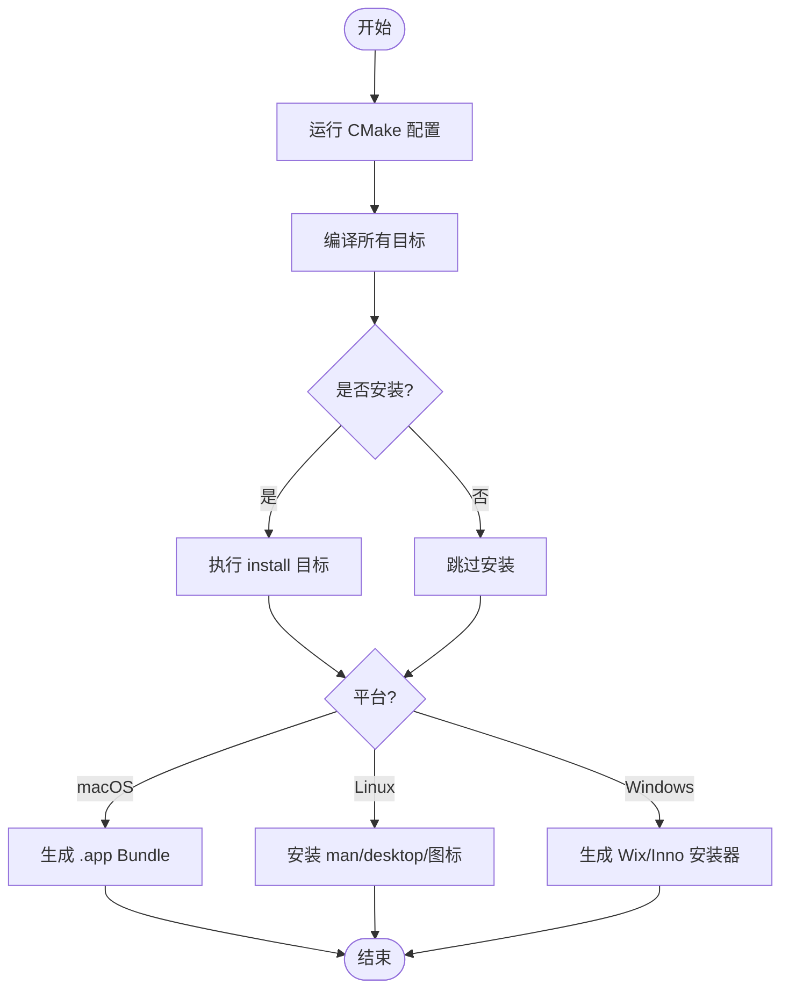
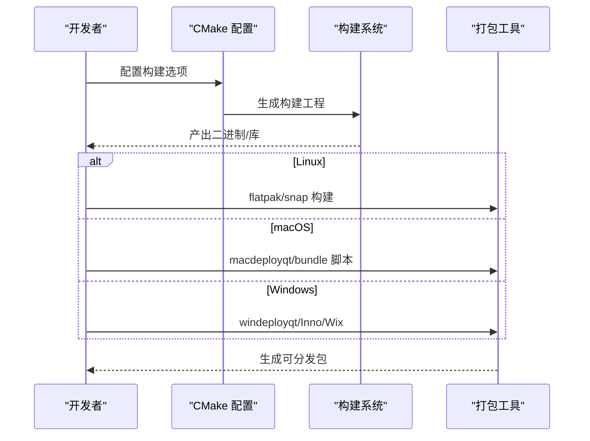
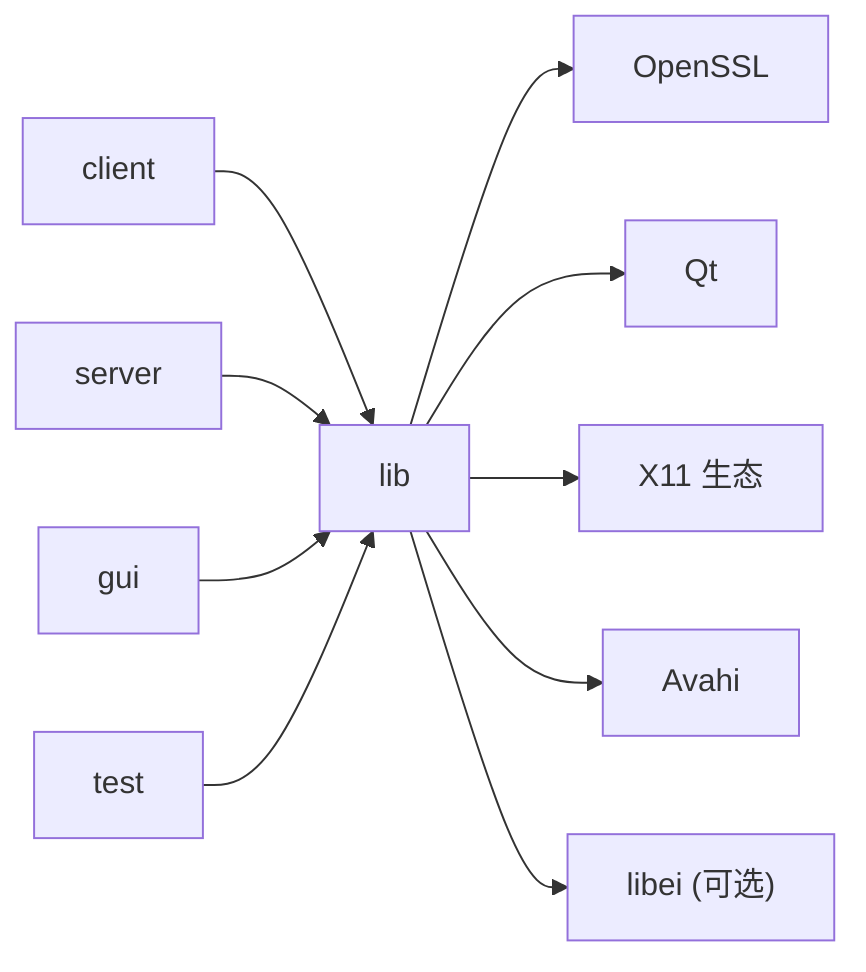

# 构建与部署

<cite>
**本文引用的文件**
- [CMakeLists.txt](file://CMakeLists.txt)
- [src/CMakeLists.txt](file://src/CMakeLists.txt)
- [cmake/Package.cmake](file://cmake/Package.cmake)
- [cmake/Version.cmake](file://cmake/Version.cmake)
- [cmake/gtest.cmake](file://cmake/gtest.cmake)
- [cmake/cmake_uninstall.cmake.in](file://cmake/cmake_uninstall.cmake.in)
- [clean_build.sh](file://clean_build.sh)
- [clean_build.ps1](file://clean_build.ps1)
- [README.md](file://README.md)
- [RELEASING.md](file://RELEASING.md)
- [dist/flatpak/io.github.input_leap.input-leap.yaml](file://dist/flatpak/io.github.input_leap.input-leap.yaml)
- [dist/snap/snapcraft.yaml](file://dist/snap/snapcraft.yaml)
</cite>

## 目录
1. [简介](#简介)
2. [项目结构](#项目结构)
3. [核心组件](#核心组件)
4. [架构总览](#架构总览)
5. [详细组件分析](#详细组件分析)
6. [依赖关系分析](#依赖关系分析)
7. [性能考虑](#性能考虑)
8. [故障排查指南](#故障排查指南)
9. [结论](#结论)
10. [附录](#附录)

## 简介
本文件面向 DevOps 工程师与系统管理员，提供 Input Leap 的构建与部署全面技术文档。内容涵盖 CMake 构建系统配置、跨平台编译要求与依赖管理；Windows/macOS/Linux 的构建流程、打包方法与分发策略；开发环境搭建、IDE 配置与调试设置；持续集成流水线要点、自动化测试与发布流程；以及容器化部署、包管理器集成与企业级部署最佳实践。

## 项目结构
Input Leap 采用顶层 CMake 工程组织，按功能模块拆分子目录：
- src/lib：核心库（平台抽象、网络、IPC、输入输出等）
- src/client、src/server：客户端与服务端可执行入口
- src/gui：Qt GUI 应用（可选）
- src/test：单元测试与集成测试
- cmake：构建辅助脚本（版本、打包、gtest 集成、卸载目标）
- dist：平台打包清单与脚本（Flatpak、Snap、macOS bundle、Windows 安装器模板等）
- doc：手册页、示例配置、图标与桌面文件等

图表来源
- [CMakeLists.txt:1-342](file://CMakeLists.txt#L1-L342)
- [src/CMakeLists.txt:1-38](file://src/CMakeLists.txt#L1-L38)

章节来源
- [CMakeLists.txt:1-342](file://CMakeLists.txt#L1-L342)
- [src/CMakeLists.txt:1-38](file://src/CMakeLists.txt#L1-L38)

## 核心组件
- 构建系统与选项
  - 最低 CMake 版本：3.21
  - 关键选项：
    - INPUTLEAP_BUILD_GUI：是否构建 GUI（默认 ON）
    - INPUTLEAP_BUILD_TESTS：是否构建测试（默认 ON）
    - INPUTLEAP_USE_EXTERNAL_GTEST：使用外部 gtest（默认 OFF）
    - INPUTLEAP_BUILD_X11：启用 X11 支持（默认 ON）
    - INPUTLEAP_BUILD_LIBEI：启用 libei 支持（默认 OFF）
    - INPUTLEAP_BUILD_GULRAK_FILESYSTEM：使用内置 gulrak-filesystem（默认 OFF）
  - Qt 主版本选择：QT_DEFAULT_MAJOR_VERSION（默认 6），影响 C++ 标准（Qt6→C++17，Qt5→C++14）
  - 输出目录：bin/lib 位于构建目录
- 平台检测与特性开关
  - UNIX 分支：通过 pkg-config 探测依赖，启用 X11/libei/Avahi 等；非 Apple 平台强制位置无关代码
  - macOS 分支：链接系统框架（ScreenSaver、IOKit、ApplicationServices、Foundation、Carbon）
  - Windows 分支：启用 MSVC 并行编译与优化标志，链接系统库
- OpenSSL 依赖
  - 在 macOS/Windows 上优先静态链接，Linux 动态链接
- 安装与卸载
  - 生成 uninstall 目标，基于 install_manifest.txt 删除已安装文件
- 测试
  - enable_testing()，包含 gtest 集成与测试子目录

章节来源
- [CMakeLists.txt:18-46](file://CMakeLists.txt#L18-L46)
- [CMakeLists.txt:71-89](file://CMakeLists.txt#L71-L89)
- [CMakeLists.txt:91-228](file://CMakeLists.txt#L91-L228)
- [CMakeLists.txt:230-247](file://CMakeLists.txt#L230-L247)
- [CMakeLists.txt:255-258](file://CMakeLists.txt#L255-L258)
- [CMakeLists.txt:329-337](file://CMakeLists.txt#L329-L337)
- [CMakeLists.txt:339-342](file://CMakeLists.txt#L339-L342)
- [src/CMakeLists.txt:29-37](file://src/CMakeLists.txt#L29-L37)

## 架构总览
下图展示从顶层 CMake 到各子模块与打包产物的整体关系。

图表来源
- [CMakeLists.txt:1-342](file://CMakeLists.txt#L1-L342)
- [src/CMakeLists.txt:1-38](file://src/CMakeLists.txt#L1-L38)
- [dist/flatpak/io.github.input_leap.input-leap.yaml:1-131](file://dist/flatpak/io.github.input_leap.input-leap.yaml#L1-L131)
- [dist/snap/snapcraft.yaml:1-91](file://dist/snap/snapcraft.yaml#L1-L91)

## 详细组件分析

### 构建系统配置与跨平台要求
- 通用要求
  - CMake ≥ 3.21
  - 编译器：MSVC/Clang/GCC（依据平台）
  - 线程库：POSIX pthread（UNIX）
  - OpenSSL ≥ 1.1.1（SSL + Crypto）
- Linux/X11 路径
  - 需要 pkg-config
  - X11 相关：x11/xext/xrandr/xinerama/xtst/xi、ICE/SM
  - Avahi（Bonjour 兼容）：avahi-compat-libdns_sd
  - 可选 libei 路径：libei-1.0、xkbcommon、glib/gio、libportal、m
- macOS 路径
  - 系统框架：ScreenSaver、IOKit、ApplicationServices、Foundation、Carbon
  - 部署工具：macdeployqt（若启用 GUI）
- Windows 路径
  - Visual Studio 2019/2022（x64）
  - Bonjour SDK（dnssd.lib）用于 mDNS
  - 部署工具：windeployqt（若启用 GUI）
- 构建类型与标准
  - Debug/Release 等由 CMAKE_BUILD_TYPE 控制
  - Qt6 → C++17；Qt5 → C++14

章节来源
- [CMakeLists.txt:18-46](file://CMakeLists.txt#L18-L46)
- [CMakeLists.txt:91-228](file://CMakeLists.txt#L91-L228)
- [CMakeLists.txt:230-247](file://CMakeLists.txt#L230-L247)
- [CMakeLists.txt:255-258](file://CMakeLists.txt#L255-L258)
- [CMakeLists.txt:71-89](file://CMakeLists.txt#L71-L89)

### 依赖管理与发现
- pkg-config 驱动依赖查找（X11、Avahi、libei 等）
- find_package(Qt*) 定位 Qt 运行时与 qmake 路径
- OpenSSL 通过 find_package(OpenSSL) 获取，macOS/Windows 静态链接
- 平台特定库通过 find_library/find_package 收集并加入 libs 列表
- 头文件与宏定义：根据平台与特性开关注入 SYSAPI_*、WINAPI_* 等宏

章节来源
- [CMakeLists.txt:91-228](file://CMakeLists.txt#L91-L228)
- [CMakeLists.txt:255-258](file://CMakeLists.txt#L255-L258)

### 构建流程与产物
- 顶层目标
  - input-leap（GUI，可选）
  - input-leaps（服务端）
  - input-leapc（客户端）
  - 测试目标（unittests/integtests，可选）
- 安装与卸载
  - install 目标将二进制、手册页、桌面文件、图标等安装至系统目录
  - uninstall 目标读取 install_manifest.txt 逐条删除
- 平台打包
  - macOS：生成 .app Bundle，调用 build_dist.sh
  - Linux：安装 man 页、metainfo、desktop、图标
  - Windows：配置 Wix/Inno 安装器模板

图表来源
- [CMakeLists.txt:289-322](file://CMakeLists.txt#L289-L322)
- [CMakeLists.txt:329-337](file://CMakeLists.txt#L329-L337)

章节来源
- [CMakeLists.txt:289-322](file://CMakeLists.txt#L289-L322)
- [CMakeLists.txt:329-337](file://CMakeLists.txt#L329-L337)

### 开发环境搭建与 IDE 配置
- Linux/macOS
  - 使用 clean_build.sh 自动初始化子模块、选择 Ninja（可用时）、设置构建类型与参数
  - macOS 额外设置 SDK 路径与部署目标
  - 可通过 build_env.sh 进行本地定制
- Windows
  - 使用 clean_build.ps1 自动下载 Bonjour SDK、检测 VS 版本、定位 Qt 根目录
  - 通过环境变量 B_QT_ROOT/B_QT_MAJOR_VERSION 指定 Qt 路径与主版本
  - 生成 Inno Setup 安装包
- IDE
  - 推荐生成 compile_commands.json（已在顶层开启），便于 clangd/VSCode/CLion 索引
  - 使用 Ninja 或原生 IDE 生成器以获得更快增量构建

章节来源
- [clean_build.sh:1-44](file://clean_build.sh#L1-L44)
- [clean_build.ps1:1-91](file://clean_build.ps1#L1-L91)
- [CMakeLists.txt:27](file://CMakeLists.txt#L27)

### 测试与调试
- 启用测试：INPUTLEAP_BUILD_TESTS=ON（默认）
- 测试入口：enable_testing()，包含 unittests 与 integtests
- 调试建议
  - 使用 Debug 构建类型
  - 在 IDE 中附加进程或启动带参数的可执行文件
  - 利用日志窗口（GUI）查看运行期信息

章节来源
- [CMakeLists.txt:339-342](file://CMakeLists.txt#L339-L342)
- [src/CMakeLists.txt:29-33](file://src/CMakeLists.txt#L29-L33)

### 打包与分发策略
- Flatpak
  - 使用 dist/flatpak/io.github.input_leap.input-leap.yaml 描述运行时、权限与模块（libei、avahi、libportal 等）
  - 通过 CMake 构建，启用 GUI、X11、libei
- Snap
  - 使用 dist/snap/snapcraft.yaml 定义 parts、build-packages、stage-packages 与 plugs
  - 基于 Qt5 构建，禁用 Wayland 回退至 XWayland
- macOS
  - 顶层 CMake 生成 .app Bundle，并调用 build_dist.sh 完成资源整理
- Windows
  - 配置 Wix/Inno 安装器模板，生成安装包

图表来源
- [dist/flatpak/io.github.input_leap.input-leap.yaml:1-131](file://dist/flatpak/io.github.input_leap.input-leap.yaml#L1-L131)
- [dist/snap/snapcraft.yaml:1-91](file://dist/snap/snapcraft.yaml#L1-L91)
- [CMakeLists.txt:289-322](file://CMakeLists.txt#L289-L322)

章节来源
- [dist/flatpak/io.github.input_leap.input-leap.yaml:1-131](file://dist/flatpak/io.github.input_leap.input-leap.yaml#L1-L131)
- [dist/snap/snapcraft.yaml:1-91](file://dist/snap/snapcraft.yaml#L1-L91)
- [CMakeLists.txt:289-322](file://CMakeLists.txt#L289-L322)

### 持续集成与发布流程
- 依赖更新
  - dependabot 每周扫描 GitHub Actions 依赖并创建 PR
- 版本与发布
  - 维护者遵循 RELEASING.md：towncrier 生成变更日志、更新版本号、打标签、创建 GitHub Release 并上传制品
- 制品下载
  - 参考 dist/scripts/download_release.py（仓库中存在该脚本说明）

章节来源
- [.github/dependabot.yml:1-12](file://.github/dependabot.yml#L1-L12)
- [RELEASING.md:1-64](file://RELEASING.md#L1-L64)

### 容器化部署与企业级部署
- 容器镜像
  - 可使用 Dockerfile 封装构建环境（CMake、Qt、OpenSSL、X11 依赖），在 CI 中构建后推送镜像
  - 运行时镜像仅包含必要运行时库与二进制，避免携带构建工具链
- 包管理器集成
  - Flatpak/Snap 清单已提供，可直接提交至 Flathub/Snap Store
  - Linux 发行版可通过 RPM/DEB 打包（顶层 CMake 已安装 man/desktop 等资源）
- 企业部署建议
  - 集中管理配置文件（如 server.name 或完整配置文件路径）
  - 使用组策略/MDM 分发二进制与配置
  - 通过防火墙规则限制端口访问，结合 TLS（OpenSSL）保障通信安全

[本节为概念性指导，不直接分析具体源码文件]

## 依赖关系分析
- 内部依赖
  - src/lib 被 client/server/gui 共同依赖
  - test 依赖 lib 与 gtest
- 外部依赖
  - Qt（Core/Widgets/QML 等，取决于 GUI）
  - OpenSSL（SSL/Crypto）
  - X11 生态（Xlib、ICE/SM、xrandr、xinerama、xtst、xi）
  - Avahi（Bonjour 兼容）
  - libei、xkbcommon、glib/gio、libportal（可选）
  - 平台库（Windows：Wtsapi32/Userenv/Wininet/comsuppw/Shlwapi；macOS：ScreenSaver/IOKit/ApplicationServices/Foundation/Carbon）

图表来源
- [src/CMakeLists.txt:1-38](file://src/CMakeLists.txt#L1-L38)
- [CMakeLists.txt:91-228](file://CMakeLists.txt#L91-L228)
- [CMakeLists.txt:230-247](file://CMakeLists.txt#L230-L247)

章节来源
- [src/CMakeLists.txt:1-38](file://src/CMakeLists.txt#L1-L38)
- [CMakeLists.txt:91-228](file://CMakeLists.txt#L91-L228)
- [CMakeLists.txt:230-247](file://CMakeLists.txt#L230-L247)

## 性能考虑
- 构建性能
  - 使用 Ninja 作为生成器以加速增量构建
  - 合理划分构建类型（Debug/RelWithDebInfo/Release）
- 运行性能
  - 在 Release 模式下启用编译器优化
  - 按需启用 GUI 与可选特性（libei）以减少运行时开销
  - 合理配置网络与事件队列（由核心库实现）

[本节为通用建议，不直接分析具体源码文件]

## 故障排查指南
- 常见构建错误
  - pkg-config 未找到：在非 Apple 的 UNIX 平台必须安装 pkg-config
  - 缺少 dns_sd.h：GUI 构建时需要 Avahi 兼容头文件
  - 未满足 X11/libei 二选一：至少启用其一
  - OpenSSL 版本过低：需 ≥ 1.1.1
- 平台特定问题
  - macOS：确保 xcrun SDK 路径正确，必要时设置 CMAKE_OSX_SYSROOT 与部署目标
  - Windows：确认 VS 环境与 Qt 路径，设置 BONJOUR_SDK_HOME 指向 dnssd.lib
- 卸载残留
  - 使用 uninstall 目标清理安装产物

章节来源
- [CMakeLists.txt:135-137](file://CMakeLists.txt#L135-L137)
- [CMakeLists.txt:198-201](file://CMakeLists.txt#L198-L201)
- [CMakeLists.txt:225-227](file://CMakeLists.txt#L225-L227)
- [CMakeLists.txt:255-258](file://CMakeLists.txt#L255-L258)
- [clean_build.sh:18-22](file://clean_build.sh#L18-L22)
- [clean_build.ps1:77-87](file://clean_build.ps1#L77-L87)
- [cmake/cmake_uninstall.cmake.in:1-22](file://cmake/cmake_uninstall.cmake.in#L1-L22)

## 结论
Input Leap 的构建体系以 CMake 为核心，具备完善的跨平台支持与模块化设计。通过顶层选项与平台分支，可在 Linux/macOS/Windows 上灵活构建 GUI/CLI 与测试套件。配合 Flatpak/Snap 清单与平台打包脚本，可实现端到端的打包与分发。建议在 CI 中固化构建与测试步骤，并结合企业策略进行集中部署与安全加固。

[本节为总结性内容，不直接分析具体源码文件]

## 附录
- 支持的操作系统与版本参见 README 中的 FAQ 部分
- 发行版包状态可查看 repology 页面

章节来源
- [README.md:114-123](file://README.md#L114-L123)
- [README.md:94-100](file://README.md#L94-L100)