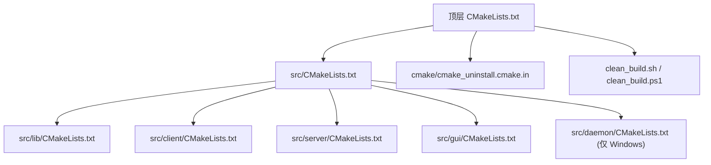
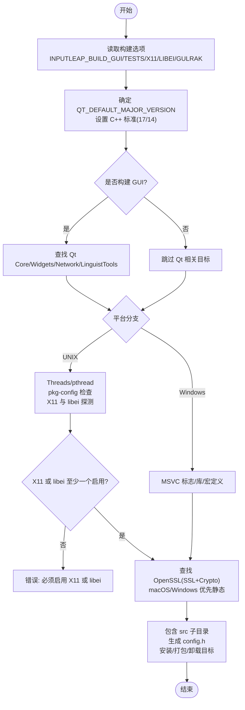
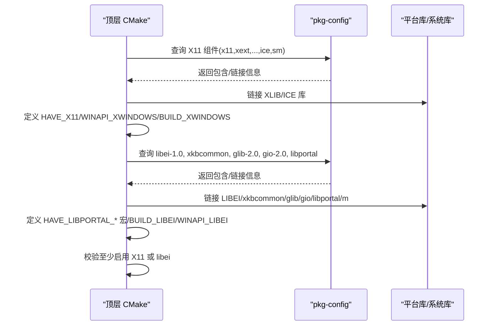
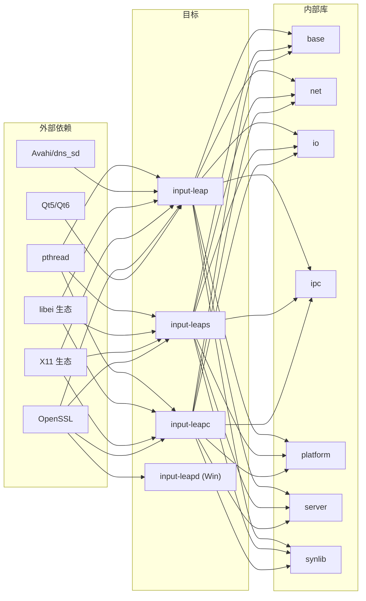

# 构建系统配置

<cite>
**本文引用的文件**   
- [CMakeLists.txt](file://CMakeLists.txt)
- [src/CMakeLists.txt](file://src/CMakeLists.txt)
- [src/lib/CMakeLists.txt](file://src/lib/CMakeLists.txt)
- [src/lib/config.h.in](file://src/lib/config.h.in)
- [src/gui/CMakeLists.txt](file://src/gui/CMakeLists.txt)
- [src/client/CMakeLists.txt](file://src/client/CMakeLists.txt)
- [src/server/CMakeLists.txt](file://src/server/CMakeLists.txt)
- [src/daemon/CMakeLists.txt](file://src/daemon/CMakeLists.txt)
- [cmake/cmake_uninstall.cmake.in](file://cmake/cmake_uninstall.cmake.in)
- [clean_build.sh](file://clean_build.sh)
- [clean_build.ps1](file://clean_build.ps1)
</cite>

## 目录
1. [简介](#简介)
2. [项目结构](#项目结构)
3. [核心组件](#核心组件)
4. [架构总览](#架构总览)
5. [详细组件分析](#详细组件分析)
6. [依赖关系分析](#依赖关系分析)
7. [性能与可维护性考虑](#性能与可维护性考虑)
8. [故障排查指南](#故障排查指南)
9. [结论](#结论)
10. [附录：自定义构建示例与最佳实践](#附录自定义构建示例与最佳实践)

## 简介
本文件面向希望理解或定制 Input Leap CMake 构建系统的开发者与维护者，系统性解析顶层 CMakeLists.txt 的配置结构、跨平台编译选项与依赖管理策略。重点覆盖 Qt5/Qt6 双版本支持、X11 与 libei 输入系统选择机制、OpenSSL 集成、关键构建开关（如 INPUTLEAP_BUILD_GUI、INPUTLEAP_BUILD_TESTS、INPUTLEAP_BUILD_X11 等）的作用与用法，并给出编译器标志、链接库配置与平台特定宏定义说明，以及自定义构建的最佳实践。

## 项目结构
Input Leap 的构建采用分层 CMake 组织方式：
- 顶层 CMakeLists.txt 负责全局设置、平台检测、依赖发现、构建选项与子目录调度。
- src/ 下按功能模块划分子目录（lib、client、server、gui、daemon、test），每个子目录拥有自己的 CMakeLists.txt 以定义目标与依赖。
- cmake/ 提供辅助脚本与卸载目标模板。
- 根级 clean_build.sh/.ps1 提供跨平台一键清理与构建入口。

图表来源
- [CMakeLists.txt:18-47](file://CMakeLists.txt#L18-L47)
- [src/CMakeLists.txt:17-38](file://src/CMakeLists.txt#L17-L38)
- [cmake/cmake_uninstall.cmake.in:1-22](file://cmake/cmake_uninstall.cmake.in#L1-L22)
- [clean_build.sh:1-43](file://clean_build.sh#L1-L43)
- [clean_build.ps1:28-71](file://clean_build.ps1#L28-L71)

章节来源
- [CMakeLists.txt:18-47](file://CMakeLists.txt#L18-L47)
- [src/CMakeLists.txt:17-38](file://src/CMakeLists.txt#L17-L38)

## 核心组件
- 构建选项与标准
  - 启用 GUI、测试、X11、libei、gulrak-filesystem 等选项；默认开启 GUI 与测试，X11 默认开启，libei 默认关闭。
  - 强制 C++ 标准：Qt6 使用 C++17，Qt5 使用 C++14；禁用扩展，要求严格标准模式。
  - 非 Debug 构建自动定义 NDEBUG。
- 输出目录
  - 统一将可执行文件输出到 bin，库输出到 lib。
- 平台分支
  - UNIX（含 macOS 与非 macOS）、Windows 三大分支分别处理线程、包管理器、平台库与安装规则。
- 依赖发现
  - Threads、OpenSSL、Qt、X11、libei、glib/gio、xkbcommon、libportal、Avahi/dns_sd 等。
- 生成配置头
  - 通过 config.h.in 模板生成 config.h，注入平台与特性探测结果。
- 安装与打包
  - Linux/BSD 安装 man 页、桌面项、图标；macOS 打包 App Bundle；Windows 配置 Wix/Inno 安装器。
- 卸载目标
  - 基于 install_manifest.txt 实现 uninstall 目标。

章节来源
- [CMakeLists.txt:21-35](file://CMakeLists.txt#L21-L35)
- [CMakeLists.txt:37-45](file://CMakeLists.txt#L37-L45)
- [CMakeLists.txt:30-31](file://CMakeLists.txt#L30-L31)
- [CMakeLists.txt:112-116](file://CMakeLists.txt#L112-L116)
- [CMakeLists.txt:255-258](file://CMakeLists.txt#L255-L258)
- [src/lib/CMakeLists.txt:17-18](file://src/lib/CMakeLists.txt#L17-L18)
- [src/lib/config.h.in:1-42](file://src/lib/config.h.in#L1-L42)
- [CMakeLists.txt:303-311](file://CMakeLists.txt#L303-L311)
- [CMakeLists.txt:316-322](file://CMakeLists.txt#L316-L322)
- [CMakeLists.txt:329-337](file://CMakeLists.txt#L329-L337)

## 架构总览
下图展示了顶层构建流程与关键决策点：Qt 版本选择、GUI 开关、UNIX 分支下的 X11/libei 互斥校验、OpenSSL 静态偏好、以及各子目标的包含顺序。

图表来源
- [CMakeLists.txt:21-26](file://CMakeLists.txt#L21-L26)
- [CMakeLists.txt:37-45](file://CMakeLists.txt#L37-L45)
- [CMakeLists.txt:71-89](file://CMakeLists.txt#L71-L89)
- [CMakeLists.txt:112-116](file://CMakeLists.txt#L112-L116)
- [CMakeLists.txt:162-196](file://CMakeLists.txt#L162-L196)
- [CMakeLists.txt:225-228](file://CMakeLists.txt#L225-L228)
- [CMakeLists.txt:255-258](file://CMakeLists.txt#L255-L258)
- [src/lib/CMakeLists.txt:17-18](file://src/lib/CMakeLists.txt#L17-L18)
- [CMakeLists.txt:339-342](file://CMakeLists.txt#L339-L342)

## 详细组件分析

### 顶层 CMakeLists.txt 配置要点
- 最小版本与工程声明
  - 要求 CMake 3.21，工程语言为 C/CXX。
- 构建选项
  - INPUTLEAP_BUILD_GUI：控制 GUI 目标与 Qt 依赖。
  - INPUTLEAP_BUILD_TESTS：控制单元测试与集成测试。
  - INPUTLEAP_USE_EXTERNAL_GTEST：是否使用外部 gtest。
  - INPUTLEAP_BUILD_X11：启用 X11 输入后端。
  - INPUTLEAP_BUILD_LIBEI：启用 libei 输入后端。
  - INPUTLEAP_BUILD_GULRAK_FILESYSTEM：启用内部 gulrak::filesystem。
- 标准与警告
  - 根据 Qt 主版本选择 C++17/14；非 Debug 定义 NDEBUG；尝试添加 -Wformat。
- 输出目录
  - 统一 bin/lib 输出路径。
- 平台分支
  - UNIX：启用位置无关代码（非 Apple），探测 pthread、pkg-config、X11、libei、glib/gio、xkbcommon、libportal、dns_sd 等；设置 SYSAPI_UNIX、WINAPI_* 宏；要求至少启用 X11 或 libei。
  - Windows：设置 MSVC 并行编译、调试信息、Release 优化、链接库与宏（SYSAPI_WIN32、WINAPI_MSWINDOWS 等）。
- OpenSSL
  - macOS/Windows 优先静态库；要求 1.1.1 及以上，组件 SSL 与 Crypto。
- 安装与打包
  - Linux/BSD：安装 man 页、appdata、图标、desktop；复制 rpm 资源。
  - macOS：生成 App Bundle 并调用打包脚本。
  - Windows：配置 Wix/Inno 安装器资源。
- 卸载目标
  - 基于 install_manifest.txt 删除已安装文件。
- 子目录包含
  - 最后 include src，由 src/CMakeLists.txt 进一步分发。

章节来源
- [CMakeLists.txt:18-20](file://CMakeLists.txt#L18-L20)
- [CMakeLists.txt:21-26](file://CMakeLists.txt#L21-L26)
- [CMakeLists.txt:33-35](file://CMakeLists.txt#L33-L35)
- [CMakeLists.txt:37-45](file://CMakeLists.txt#L37-L45)
- [CMakeLists.txt:65-69](file://CMakeLists.txt#L65-L69)
- [CMakeLists.txt:30-31](file://CMakeLists.txt#L30-L31)
- [CMakeLists.txt:91-104](file://CMakeLists.txt#L91-L104)
- [CMakeLists.txt:112-116](file://CMakeLists.txt#L112-L116)
- [CMakeLists.txt:162-196](file://CMakeLists.txt#L162-L196)
- [CMakeLists.txt:225-228](file://CMakeLists.txt#L225-L228)
- [CMakeLists.txt:230-247](file://CMakeLists.txt#L230-L247)
- [CMakeLists.txt:255-258](file://CMakeLists.txt#L255-L258)
- [CMakeLists.txt:303-322](file://CMakeLists.txt#L303-L322)
- [CMakeLists.txt:329-337](file://CMakeLists.txt#L329-L337)
- [CMakeLists.txt:339-342](file://CMakeLists.txt#L339-L342)

### Qt5/Qt6 支持配置
- 版本选择
  - 通过 QT_DEFAULT_MAJOR_VERSION 决定 Qt5 或 Qt6；未显式设置时默认为 6。
  - Qt6 使用 C++17，Qt5 使用 C++14。
- GUI 构建时的 Qt 需求
  - 当启用 GUI 时，查找对应版本的 Core/Widgets/Network/LinguistTools。
  - 在 GUI 子目录中再次 find_package 指定所需组件与最低版本。
- 部署工具
  - Windows：windeployqt；macOS：macdeployqt 与平台插件定位。
- 国际化
  - TS 文件列表与 qm 生成（qt5_add_translation/qt_add_translation）。

章节来源
- [CMakeLists.txt:37-45](file://CMakeLists.txt#L37-L45)
- [CMakeLists.txt:71-89](file://CMakeLists.txt#L71-L89)
- [src/gui/CMakeLists.txt:1-8](file://src/gui/CMakeLists.txt#L1-L8)
- [src/gui/CMakeLists.txt:166-171](file://src/gui/CMakeLists.txt#L166-L171)
- [src/gui/CMakeLists.txt:237-249](file://src/gui/CMakeLists.txt#L237-L249)

### X11 与 libei 输入系统选择机制
- 条件探测
  - X11：通过 pkg_check_modules 查找 x11/xext/xrandr/xinerama/xtst/xi 及 ice/sm。
  - libei：查找 libei-1.0 >= 0.99.1、xkbcommon、glib-2.0/gio-2.0、libportal，并针对 libportal 进行符号/枚举存在性检查。
- 宏与构建开关
  - 启用 X11 时定义 WINAPI_XWINDOWS 与 BUILD_XWINDOWS。
  - 启用 libei 时定义 WINAPI_LIBEI 与 BUILD_LIBEI。
- 互斥校验
  - 若两者均未启用，则报错终止配置。
- 链接与包含
  - 将对应库加入 libs 列表并在 GUI 目标中链接 dns_sd 与 Threads。

图表来源
- [CMakeLists.txt:162-170](file://CMakeLists.txt#L162-L170)
- [CMakeLists.txt:172-196](file://CMakeLists.txt#L172-L196)
- [CMakeLists.txt:217-228](file://CMakeLists.txt#L217-L228)

章节来源
- [CMakeLists.txt:162-196](file://CMakeLists.txt#L162-L196)
- [CMakeLists.txt:217-228](file://CMakeLists.txt#L217-L228)

### OpenSSL 集成配置
- 静态库偏好
  - macOS 与 Windows 上优先使用静态库（OPENSSL_USE_STATIC_LIBS=TRUE）。
- 版本与组件
  - 要求 1.1.1 及以上，组件 SSL 与 Crypto。
- 链接
  - GUI、客户端、服务端与守护进程均链接 OpenSSL::SSL 与 OpenSSL::Crypto。

章节来源
- [CMakeLists.txt:255-258](file://CMakeLists.txt#L255-L258)
- [src/gui/CMakeLists.txt:203](file://src/gui/CMakeLists.txt#L203)
- [src/client/CMakeLists.txt:51-52](file://src/client/CMakeLists.txt#L51-L52)
- [src/server/CMakeLists.txt:51-52](file://src/server/CMakeLists.txt#L51-L52)
- [src/daemon/CMakeLists.txt:26-27](file://src/daemon/CMakeLists.txt#L26-L27)

### 构建选项详解与使用方法
- INPUTLEAP_BUILD_GUI
  - 作用：启用 GUI 目标与 Qt 依赖；影响安装与部署行为。
  - 用法：-DINPUTLEAP_BUILD_GUI=ON/OFF。
- INPUTLEAP_BUILD_TESTS
  - 作用：启用单元测试与集成测试目标。
  - 用法：-DINPUTLEAP_BUILD_TESTS=ON/OFF。
- INPUTLEAP_USE_EXTERNAL_GTEST
  - 作用：使用系统安装的 Google Test 而非内置。
  - 用法：-DINPUTLEAP_USE_EXTERNAL_GTEST=ON/OFF。
- INPUTLEAP_BUILD_X11
  - 作用：启用 X11 输入后端（Linux/BSD）。
  - 用法：-DINPUTLEAP_BUILD_X11=ON/OFF。
- INPUTLEAP_BUILD_LIBEI
  - 作用：启用 libei 输入后端（Linux/BSD）。
  - 用法：-DINPUTLEAP_BUILD_LIBEI=ON/OFF。
- INPUTLEAP_BUILD_GULRAK_FILESYSTEM
  - 作用：启用内部 gulrak::filesystem 并通过宏控制。
  - 用法：-DINPUTLEAP_BUILD_GULRAK_FILESYSTEM=ON/OFF。

章节来源
- [CMakeLists.txt:21-26](file://CMakeLists.txt#L21-L26)
- [CMakeLists.txt:90](file://CMakeLists.txt#L90)

### 编译器标志、链接库与平台宏
- 通用
  - 非 Debug 定义 NDEBUG；尝试添加 -Wformat。
- UNIX（非 Apple）
  - 启用位置无关代码；需要 pkg-config；设置 BSD 特殊路径；定义 SYSAPI_UNIX。
- macOS
  - 设置 sysroot 与 GTEST_TR1_TUPLE；链接 ScreenSaver、IOKit、ApplicationServices、Foundation、Carbon；定义 BUILD_CARBON 与相关宏。
- Linux/BSD
  - 通过 pkg_check_modules 发现 X11、libei、glib/gio、xkbcommon、libportal 等；定义 HAVE_X11、BUILD_XWINDOWS、HAVE_LIBPORTAL_*、BUILD_LIBEI、WINAPI_LIBEI；要求至少启用 X11 或 libei。
- Windows
  - 并行编译 /MP、调试信息 /Zi；Release 优化 /O2 /Ob2；链接 Wtsapi32/Userenv/Wininet/comsuppw/Shlwapi；定义 SYSAPI_WIN32、WINAPI_MSWINDOWS 等。

章节来源
- [CMakeLists.txt:33-35](file://CMakeLists.txt#L33-L35)
- [CMakeLists.txt:65-69](file://CMakeLists.txt#L65-L69)
- [CMakeLists.txt:91-104](file://CMakeLists.txt#L91-L104)
- [CMakeLists.txt:117-132](file://CMakeLists.txt#L117-L132)
- [CMakeLists.txt:134-202](file://CMakeLists.txt#L134-L202)
- [CMakeLists.txt:211-228](file://CMakeLists.txt#L211-L228)
- [CMakeLists.txt:230-247](file://CMakeLists.txt#L230-L247)

### 子目标与产物
- 库与核心模块
  - src/lib 生成多个库目标（arch/base/client/common/io/ipc/mt/net/platform/server/inputleap 等），并生成 config.h。
- 客户端与服务端
  - input-leapc 与 input-leaps 链接 core 库与 OpenSSL。
- GUI
  - input-leap 链接 Qt 与核心库，支持 i18n 与部署工具。
- 守护进程（Windows）
  - input-leapd 作为 Windows 服务程序。

章节来源
- [src/lib/CMakeLists.txt:17-31](file://src/lib/CMakeLists.txt#L17-L31)
- [src/client/CMakeLists.txt:50-60](file://src/client/CMakeLists.txt#L50-L60)
- [src/server/CMakeLists.txt:50-60](file://src/server/CMakeLists.txt#L50-L60)
- [src/gui/CMakeLists.txt:181-249](file://src/gui/CMakeLists.txt#L181-L249)
- [src/daemon/CMakeLists.txt:24-35](file://src/daemon/CMakeLists.txt#L24-L35)

## 依赖关系分析
- 外部依赖
  - Qt（Core/Widgets/Network/LinguistTools）、OpenSSL（SSL/Crypto）、pthread、X11 生态、libei 生态（libei、xkbcommon、glib/gio、libportal）、Avahi/dns_sd。
- 内部依赖
  - GUI/客户端/服务端均依赖 core 库集合（base、net、io、ipc、platform、server、synlib 等）。
- 平台特定依赖
  - macOS：ScreenSaver、IOKit、ApplicationServices、Foundation、Carbon。
  - Windows：Wtsapi32、Userenv、Wininet、comsuppw、Shlwapi、Bonjour SDK（DNSSD）。

图表来源
- [CMakeLists.txt:112-116](file://CMakeLists.txt#L112-L116)
- [CMakeLists.txt:162-196](file://CMakeLists.txt#L162-L196)
- [CMakeLists.txt:255-258](file://CMakeLists.txt#L255-L258)
- [src/gui/CMakeLists.txt:193-224](file://src/gui/CMakeLists.txt#L193-L224)
- [src/client/CMakeLists.txt:51-52](file://src/client/CMakeLists.txt#L51-L52)
- [src/server/CMakeLists.txt:51-52](file://src/server/CMakeLists.txt#L51-L52)
- [src/daemon/CMakeLists.txt:26-27](file://src/daemon/CMakeLists.txt#L26-L27)

章节来源
- [CMakeLists.txt:112-116](file://CMakeLists.txt#L112-L116)
- [CMakeLists.txt:162-196](file://CMakeLists.txt#L162-L196)
- [CMakeLists.txt:255-258](file://CMakeLists.txt#L255-L258)
- [src/gui/CMakeLists.txt:193-224](file://src/gui/CMakeLists.txt#L193-L224)
- [src/client/CMakeLists.txt:51-52](file://src/client/CMakeLists.txt#L51-L52)
- [src/server/CMakeLists.txt:51-52](file://src/server/CMakeLists.txt#L51-L52)
- [src/daemon/CMakeLists.txt:26-27](file://src/daemon/CMakeLists.txt#L26-L27)

## 性能与可维护性考虑
- 构建速度
  - Windows 使用 /MP 并行编译；建议 Ninja 生成器以提升多核构建效率。
- 二进制体积
  - macOS/Windows 优先静态 OpenSSL，便于分发但会增大体积；按需切换动态库可降低体积。
- 可移植性
  - 通过 pkg-config 与 find_package 组合，增强在不同发行版与平台的可发现性；BSD/macOS 特殊路径处理提升兼容性。
- 可维护性
  - 使用 configure_file(config.h.in) 集中管理特性宏；通过 option 暴露用户可控开关，减少硬编码分支。

[本节为通用指导，不直接分析具体文件]

## 故障排查指南
- 缺少 pkg-config（非 macOS 的 UNIX）
  - 现象：配置阶段报错提示需要 pkg-config。
  - 解决：安装 pkg-config 并确保 PATH 正确。
- 缺少 dns_sd.h（启用 GUI 时）
  - 现象：配置失败，提示缺失 dns_sd.h。
  - 解决：安装 Avahi 兼容库或 Bonjour SDK，确保头文件可见。
- X11 与 libei 均未启用
  - 现象：配置失败，提示至少启用 X11 或 libei。
  - 解决：启用其中一个后端（例如 -DINPUTLEAP_BUILD_X11=ON 或 -DINPUTLEAP_BUILD_LIBEI=ON）。
- Qt 版本不匹配
  - 现象：找不到 Qt 组件或版本过低。
  - 解决：设置 QT_DEFAULT_MAJOR_VERSION 为 5 或 6，并确保对应 Qt 版本满足最低要求。
- OpenSSL 版本不足
  - 现象：找不到 OpenSSL 或版本低于 1.1.1。
  - 解决：安装满足要求的 OpenSSL，或在 macOS/Windows 上提供静态库路径。
- 卸载失败
  - 现象：运行 uninstall 目标时报找不到 install_manifest.txt。
  - 解决：先执行一次 install，再运行 uninstall。

章节来源
- [CMakeLists.txt:134-137](file://CMakeLists.txt#L134-L137)
- [CMakeLists.txt:198-201](file://CMakeLists.txt#L198-L201)
- [CMakeLists.txt:225-228](file://CMakeLists.txt#L225-L228)
- [CMakeLists.txt:255-258](file://CMakeLists.txt#L255-L258)
- [cmake/cmake_uninstall.cmake.in:1-22](file://cmake/cmake_uninstall.cmake.in#L1-L22)

## 结论
Input Leap 的 CMake 构建系统通过清晰的选项与平台分支，实现了跨平台、可裁剪的构建能力。Qt5/Qt6 双版本支持、X11/libei 输入后端可选、OpenSSL 静态/动态灵活集成，配合完善的安装与卸载目标，为不同环境与分发场景提供了良好支撑。遵循本文档的构建选项与最佳实践，可快速搭建稳定可靠的本地构建环境。

[本节为总结性内容，不直接分析具体文件]

## 附录：自定义构建示例与最佳实践

- 常用构建开关
  - 仅构建命令行版本（无 GUI）：-DINPUTLEAP_BUILD_GUI=OFF
  - 禁用测试：-DINPUTLEAP_BUILD_TESTS=OFF
  - 使用系统 gtest：-DINPUTLEAP_USE_EXTERNAL_GTEST=ON
  - 仅启用 libei（不启用 X11）：-DINPUTLEAP_BUILD_X11=OFF -DINPUTLEAP_BUILD_LIBEI=ON
  - 使用内部 gulrak::filesystem：-DINPUTLEAP_BUILD_GULRAK_FILESYSTEM=ON
  - 指定 Qt 主版本：-DQT_DEFAULT_MAJOR_VERSION=5 或 6

- 推荐构建命令（Unix/macOS）
  - 使用 Ninja 加速构建：
    - cmake -GNinja -DCMAKE_BUILD_TYPE=Release -DINPUTLEAP_BUILD_TESTS=OFF ..
    - cmake --build . --parallel
  - macOS 交叉/部署：
    - 参考 clean_build.sh 中的 CMAKE_OSX_SYSROOT 与 CMAKE_OSX_DEPLOYMENT_TARGET 设置。

- 推荐构建命令（Windows）
  - 使用 Visual Studio 生成器：
    - cmake -G "Visual Studio 17 2022" -A x64 -DCMAKE_BUILD_TYPE=Release ..
    - cmake --build . --config Release --parallel
  - 使用 PowerShell 脚本：
    - 参考 clean_build.ps1 自动检测 VS 与 Qt 路径的逻辑。

- 最佳实践
  - 保持构建目录干净：每次切换选项建议使用独立 build 目录。
  - 明确 Qt 版本：通过环境变量或 CMake 变量固定 QT_DEFAULT_MAJOR_VERSION，避免歧义。
  - 合理选择 OpenSSL：开发调试可用动态库，发布打包可使用静态库简化依赖。
  - 记录构建日志：在 CI 中保存 CMake 配置与构建日志，便于复现问题。

章节来源
- [CMakeLists.txt:21-26](file://CMakeLists.txt#L21-L26)
- [CMakeLists.txt:37-45](file://CMakeLists.txt#L37-L45)
- [clean_build.sh:14-27](file://clean_build.sh#L14-L27)
- [clean_build.ps1:53-71](file://clean_build.ps1#L53-L71)